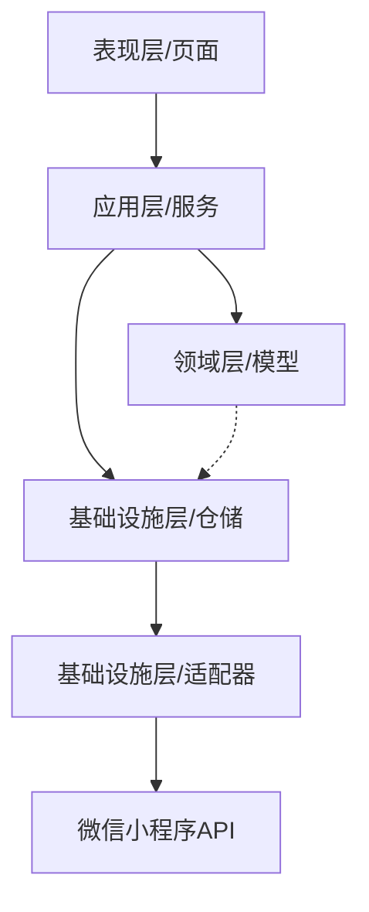
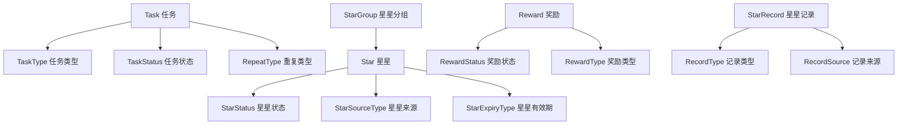
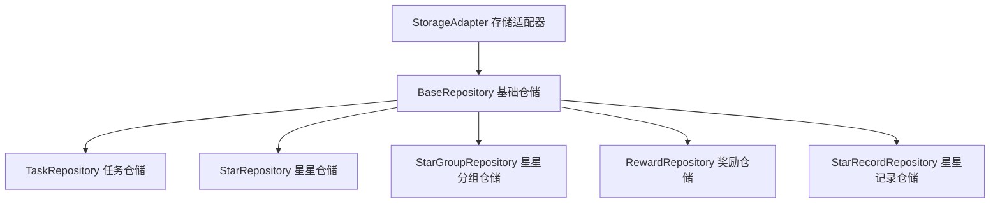
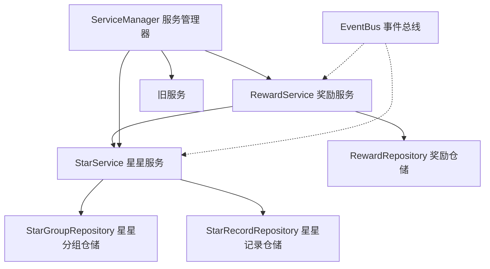
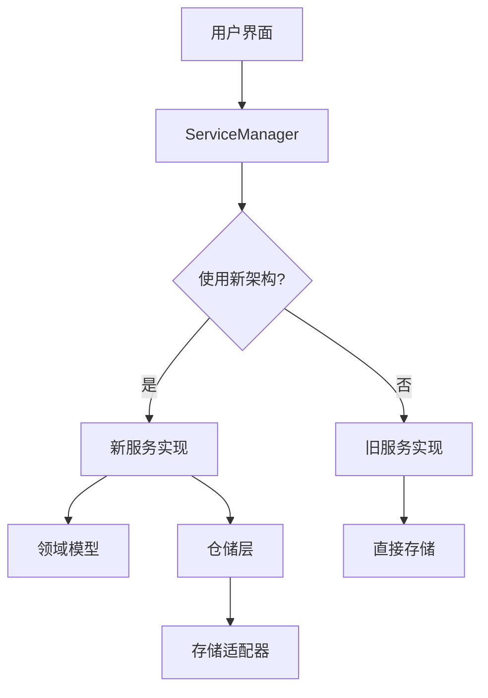
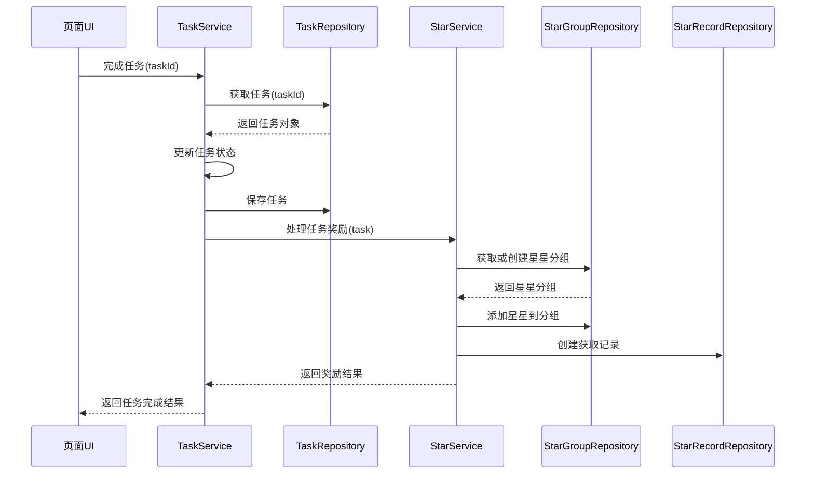
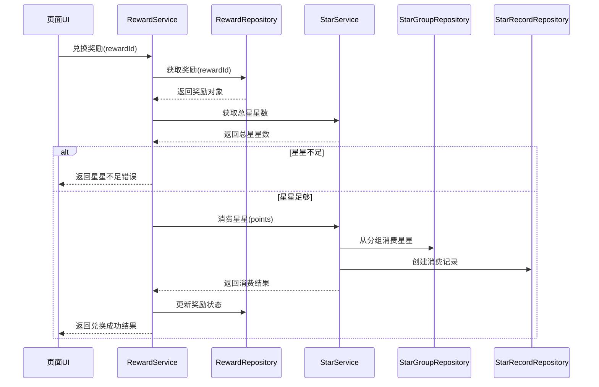

# 学习任务微信小程序系统架构

## 系统概述

学习任务微信小程序是一个专为帮助小朋友养成良好学习习惯而设计的任务管理工具。系统采用领域驱动设计(DDD)架构，支持多种任务类型，提供丰富的进度跟踪和奖励机制。本文档主要描述系统的核心架构、组件关系以及数据流。

## 核心架构

### 1. 领域驱动设计架构

系统采用领域驱动设计架构，分为以下几层：

- **领域层(Domain Layer)**：核心业务逻辑，包含领域模型和业务规则
- **应用层(Application Layer)**：协调领域对象，实现业务用例
- **基础设施层(Infrastructure Layer)**：提供技术支持，包括数据持久化
- **表现层(Presentation Layer)**：用户界面和交互处理

### 2. 应用结构

系统代码结构组织如下：

- **models/**：领域模型定义
  - task.js、star.js、reward.js 等
- **services/**：应用服务实现
  - star-service.js、reward-service.js 等
- **repositories/**：仓储实现
  - task-repository.js、star-repository.js 等
- **adapters/**：适配器实现
  - storage-adapter.js 等
- **utils/**：工具类
  - logger.js、dateUtils.js 等
- **pages/**：页面实现
- **components/**：UI组件实现

### 3. 数据管理

系统采用以下数据管理方式：

- **领域模型**：封装业务数据和规则
- **仓储层**：负责数据持久化，隐藏存储细节
- **存储适配器**：封装微信小程序存储API
- **服务层**：协调多个领域对象，实现业务流程
- **事件总线**：实现领域事件的发布和订阅

## 领域模型与仓储

### 1. 核心领域模型

系统包含以下主要领域模型：

### 2. 仓储关系

系统实现了以下仓储类：

## 应用服务

### 1. 服务结构

系统实现了以下应用服务：

### 2. 迁移策略

系统采用渐进式迁移策略：

## 数据流

### 1. 任务完成流程

系统的任务完成流程如下：

### 2. 奖励兑换流程

系统的奖励兑换流程如下：

## 核心功能模块

### 1. 任务管理模块

任务管理是系统的核心功能，在新架构中由TaskService和TaskRepository实现：

- **创建任务**：创建Task领域对象并通过仓储保存
- **编辑任务**：更新Task领域对象的属性并保存
- **完成任务**：调用Task.complete()方法并保存
- **查询任务**：通过仓储的查询方法获取任务列表

### 2. 星星管理模块

星星管理由StarService实现，包括：

- **添加星星**：向StarGroup添加星星并创建记录
- **消费星星**：从StarGroup消费星星并创建记录
- **星星过期**：定期检查并处理过期星星
- **星星统计**：计算星星数量和分布

### 3. 奖励管理模块

奖励管理由RewardService实现，包括：

- **创建奖励**：创建Reward领域对象并保存
- **兑换奖励**：更新奖励状态并消费星星
- **查询奖励**：获取可用奖励和已兑换奖励列表

### 4. 日志记录模块

系统实现了统一的日志记录功能，由Logger实现：

- **信息日志**：记录正常操作信息
- **警告日志**：记录潜在问题
- **错误日志**：记录异常和错误
- **调试日志**：记录开发调试信息

## 迁移与兼容性

### 1. 迁移路径

系统从旧架构向新架构的迁移路径：

1. **基础设施层**：首先实现存储适配器和仓储基类
2. **领域模型**：定义核心领域模型和业务规则
3. **仓储实现**：基于领域模型实现具体仓储
4. **服务层**：实现服务类并连接仓储
5. **服务管理器**：更新服务管理器支持新旧架构共存
6. **界面改造**：逐步更新界面使用新服务

### 2. 兼容策略

为确保旧代码与新架构兼容，系统采用以下策略：

- **服务管理器模式**：通过服务管理器决定使用新旧实现
- **数据格式兼容**：确保新旧代码可读取对方数据
- **功能等价**：确保迁移功能与原有功能等价
- **渐进式替换**：一次只迁移一个功能模块

## 优势与改进

新架构相比旧架构具有以下优势：

1. **高内聚低耦合**：
   - 业务逻辑与技术实现分离
   - 单一职责原则更好地体现

2. **可测试性**：
   - 业务逻辑可独立测试
   - 基础设施可模拟测试

3. **性能优化**：
   - 多级缓存机制减少存储操作
   - 事务支持确保数据一致性

4. **可维护性**：
   - 清晰的分层结构
   - 显式的依赖关系

5. **可扩展性**：
   - 新功能可以独立开发
   - 现有功能易于修改

## 未来规划

系统未来的发展规划包括：

1. **完全迁移**：将所有功能迁移到新架构
2. **云同步**：实现数据云端同步，支持多设备使用
3. **更多领域模型**：增加更丰富的领域模型和业务规则
4. **测试覆盖**：完善单元测试和集成测试
5. **性能监控**：添加性能监控和日志分析功能
6. **多租户支持**：支持家庭成员分组和权限控制

## 结论

学习任务微信小程序通过采用领域驱动设计架构，实现了业务逻辑与技术实现的分离，提高了系统的可维护性、可测试性和可扩展性。新架构为系统的长期发展提供了坚实的基础，使系统能够更好地适应未来的需求变化和功能扩展。 