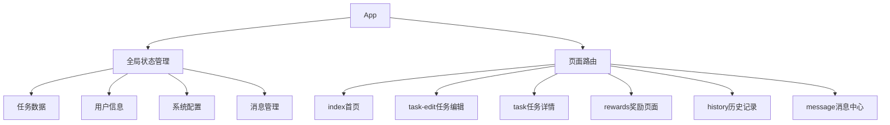

# 系统架构

## 整体架构

## 设计模式
1. 组件化设计
   - 可复用的UI组件
   - 统一的交互体验
   - 模块化的功能实现

2. 数据驱动视图
   - 使用setData更新页面数据
   - 通过全局状态管理共享数据
   - 实现数据持久化

3. 事件系统
   - 自定义事件总线
   - 组件间通信机制
   - 全局事件监听

## 核心组件
1. progressRing
   - 圆环进度展示
   - 支持多种尺寸和类型
   - 动画效果优化

2. taskItem
   - 任务项展示
   - 状态管理
   - 交互处理

3. calendar
   - 日期选择
   - 任务概览
   - 事件标记