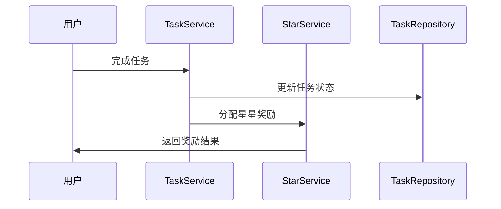
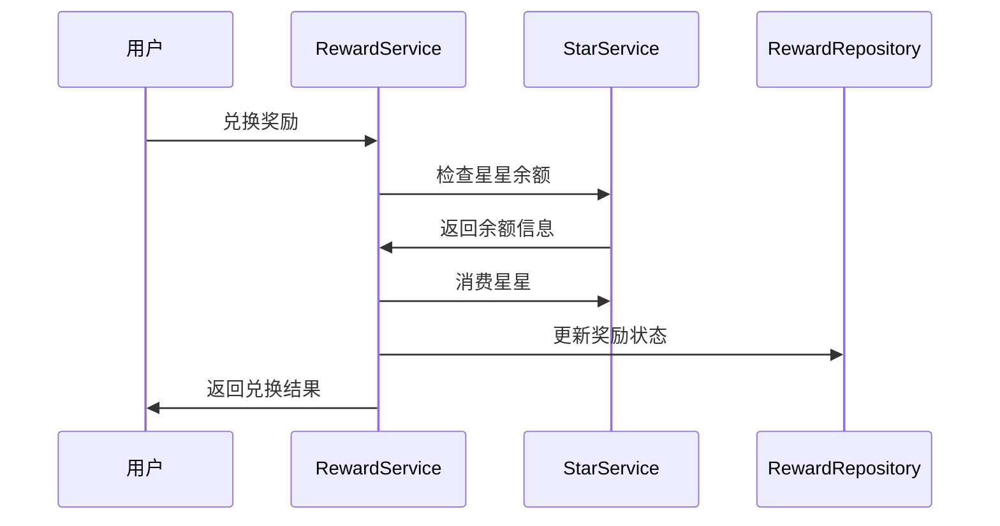

# 学习任务微信小程序

> 基于DDD架构的儿童学习习惯培养工具，通过任务管理和积分奖励机制，帮助小朋友养成良好的学习习惯

[](https://developers.weixin.qq.com/miniprogram/dev/)
[](https://docs/architecture/domain-model-architecture.md)
[](./test/)

## ✨ 核心特性

### 🎯 智能任务管理
- **多任务类型**：学习任务、习惯任务、兴趣任务
- **重复任务**：支持日、周、月重复设置
- **必做任务**：未完成会扣除星星，培养责任感
- **任务热力图**：可视化展示学习压力分布

### ⭐ 星星积分系统
- **FIFO消费策略**：优先使用即将过期的星星
- **有效期管理**：支持永久、周、月、季度等有效期
- **智能提醒**：星星即将过期时自动通知
- **完整记录**：详细的获得、消费、过期记录

### 🎁 奖励兑换机制
- **多种奖励类型**：物品、特权、活动奖励
- **状态管理**：可用、已兑换、已领取、已禁用
- **库存控制**：支持有限和无限数量奖励
- **兑换历史**：完整的兑换记录追踪

### 👥 多用户角色
- **角色切换**：家长和小朋友角色无缝切换
- **权限控制**：基于角色的功能权限管理
- **数据隔离**：不同角色的数据安全隔离

### 📊 数据分析
- **进度统计**：任务完成率、星星获取趋势
- **可视化图表**：环形进度条、线性进度条、热力图
- **连续记录**：连续完成天数统计
- **星星日历**：星星获得历史日历视图

### 🏗️ DDD架构
- **领域驱动设计**：清晰的业务逻辑分层
- **高可维护性**：模块化设计，易于扩展
- **完整测试**：单元测试和集成测试覆盖
- **文档完善**：详细的API和架构文档

## 🛠️ 技术栈

### 核心技术
- **平台**：微信小程序原生框架
- **架构**：领域驱动设计(DDD)
- **语言**：JavaScript (ES6+)
- **UI框架**：微信小程序原生组件 + 自定义组件

### 架构组件
- **状态管理**：自定义事件总线(EventBus)
- **数据存储**：StorageAdapter + 微信小程序本地存储
- **服务管理**：ServiceManager (依赖注入)
- **表单验证**：ValidationService (统一验证逻辑)
- **批量处理**：batchUtils (性能优化)
- **日志系统**：统一Logger工具

### 开发工具
- **测试框架**：Jest
- **代码规范**：ESLint + 自定义规则
- **文档工具**：Markdown + Mermaid图表
- **版本控制**：Git + 语义化版本

## 🚀 快速开始

### 环境要求
- 微信开发者工具 >= 1.06.0
- Node.js >= 14.0.0
- npm >= 6.0.0

### 安装步骤

1. **克隆项目**
```bash
git clone <repository-url>
cd study_task_wechat
```

2. **安装依赖**
```bash
npm install
```

3. **开发环境配置**
```bash
# 项目配置已包含在project.config.json中
# 如需自定义配置，直接修改该文件
```

4. **启动开发**
- 使用微信开发者工具打开项目目录
- 点击"编译"开始开发

### 运行测试
```bash
# 运行所有测试
npm test

# 运行测试并生成覆盖率报告
npm run test:coverage

# 监听模式运行测试
npm run test:watch
```

## 📁 项目结构

```
study_task_wechat/
├── 📁 models/              # 领域模型层
│   ├── task.js            # 任务模型
│   ├── star.js            # 星星模型
│   ├── star-group.js      # 星星分组模型
│   ├── reward.js          # 奖励模型
│   └── ...
├── 📁 services/           # 应用服务层
│   ├── task-service.js    # 任务服务
│   ├── star-service.js    # 星星服务
│   ├── reward-service.js  # 奖励服务
│   ├── validation-service.js # 表单验证服务
│   ├── config-service.js  # 配置服务
│   ├── service-manager.js # 服务管理器
│   └── ...
├── 📁 repositories/       # 仓储层
│   ├── base-repository.js # 基础仓储
│   ├── task-repository.js # 任务仓储
│   └── ...
├── 📁 adapters/          # 适配器层
│   └── storage-adapter.js # 存储适配器
├── 📁 utils/             # 工具函数
│   ├── logger.js         # 日志工具
│   ├── date-utils.js     # 日期工具
│   └── ...
├── 📁 pages/             # 页面
├── 📁 components/        # 组件
├── 📁 test/              # 测试文件
└── 📁 docs/              # 项目文档
```

## 📖 文档导航

### 🏛️ 架构文档
- [架构文档索引](docs/architecture/README.md) - 架构文档导航
- [系统架构](docs/architecture/system_architecture.md) - 整体架构设计
- [DDD架构](docs/architecture/domain-model-architecture.md) - 领域驱动设计实现
- [项目结构](docs/architecture/project_structure.md) - 文件组织结构
- [数据模型](docs/architecture/data_models.md) - 核心数据模型
- [星星积分系统](docs/architecture/star_points_system.md) - 积分系统设计

### 🔧 API文档
- [API文档索引](docs/api/readme.md) - API文档导航
- [服务层API](docs/api/services-guide.md) - 业务服务接口（包含验证和配置服务）
- [仓储层API](docs/api/repositories.md) - 数据访问接口
- [组件API](docs/api/components-guide.md) - UI组件使用指南
- [工具函数](docs/api/utils_guide.md) - 工具函数库
- [存储适配器](docs/api/storage-adapter.md) - 数据存储接口

### 👨‍💻 开发指南
- [开发文档索引](docs/development/README.md) - 开发文档导航
- [编码标准](docs/development/coding_standards.md) - 代码风格和规范
- [开发工作流](docs/development/workflow.md) - 开发流程规范
- [故障排除](docs/development/troubleshooting.md) - 常见问题解决
- [文档维护](docs/development/document_workflow.md) - 文档更新流程

### 👥 用户手册
- [用户指南](docs/user/guide.md) - 功能使用说明
- [常见问题](docs/user/faq.md) - FAQ解答

## 🎯 核心业务流程

### 任务完成流程


### 奖励兑换流程


## 🧪 测试策略

### 测试覆盖
- **单元测试**：模型、服务、工具函数
- **集成测试**：服务间协作、数据流
- **组件测试**：UI组件功能验证
- **端到端测试**：完整业务流程

### 测试命令
```bash
# 运行特定模块测试
npm run test:models
npm run test:services
npm run test:repositories

# 生成测试报告
npm run test:report
```

## 🔄 版本管理

### 版本规范
项目遵循[语义化版本](https://semver.org/lang/zh-CN/)规范：
- **主版本号**：不兼容的API修改
- **次版本号**：向下兼容的功能性新增
- **修订号**：向下兼容的问题修正

### 发布流程
1. 功能开发完成
2. 测试通过
3. 文档更新
4. 版本标记
5. 发布部署

## 🤝 贡献指南

### 开发流程
1. **Fork项目** 并创建功能分支
2. **遵循编码规范** 进行开发
3. **编写测试** 确保功能正确
4. **更新文档** 同步API变更
5. **提交PR** 并等待代码审查

### 代码规范
- 遵循[编码标准](docs/development/coding_standards.md)
- 使用简洁的中文注释
- 在关键操作处添加日志
- 保持代码简洁，去除冗余

### 提交规范
```bash
# 功能开发
git commit -m "feat(TaskService): 添加任务批量操作功能"

# 问题修复
git commit -m "fix(StarService): 修复星星过期计算错误"

# 文档更新
git commit -m "docs(API): 更新服务层API文档"
```

## 📊 项目统计

- **代码行数**：~15,000行
- **测试覆盖率**：85%+
- **文档完整度**：95%+
- **组件数量**：20+个
- **API接口**：50+个

## 📄 许可证

本项目采用 MIT 许可证 - 查看 [LICENSE](LICENSE) 文件了解详情

## 🙏 致谢

感谢所有为这个项目做出贡献的开发者和用户！

---

**项目维护者**：开发团队  
**最后更新**：2025年1月  
**当前版本**：v3.1 