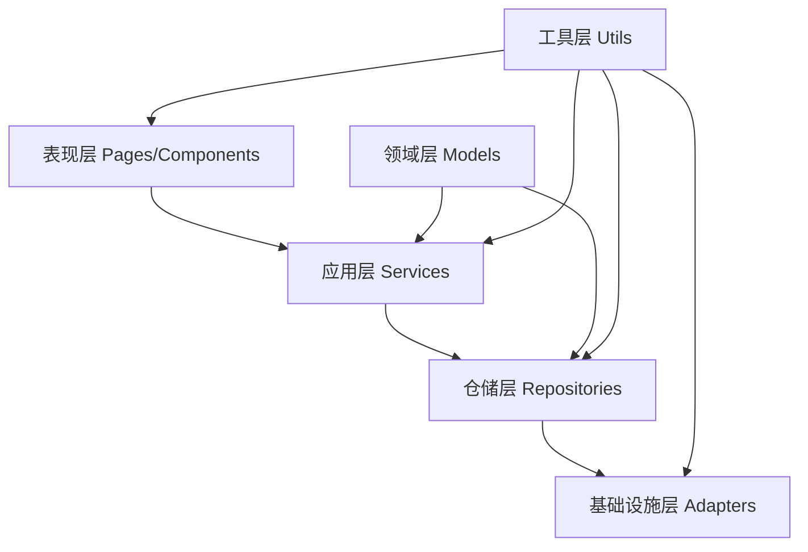
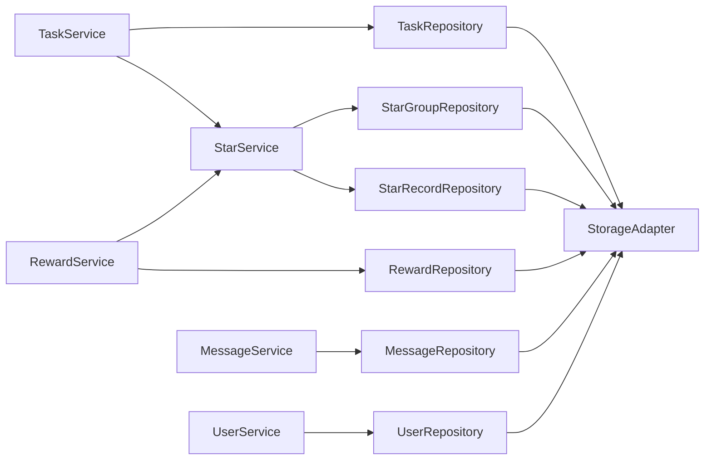

# API 文档导航

## 概述

本目录包含学习任务微信小程序的完整API文档，基于DDD（领域驱动设计）架构组织。文档涵盖了服务层、仓储层、组件层、工具层和存储适配器的详细API说明。

## 文档结构

### 核心API文档

| 文档名称 | 描述 | 更新状态 |
|---------|------|----------|
| [services-guide.md](./services-guide.md) | 服务层API完整指南 | ✅ 最新 |
| [repositories.md](./repositories.md) | 仓储层API详细文档 | ✅ 最新 |
| [components-guide.md](./components-guide.md) | 组件使用指南和API | ✅ 最新 |
| [utils_guide.md](./utils_guide.md) | 工具函数库API文档 | ✅ 最新 |
| [storage-adapter.md](./storage-adapter.md) | 存储适配器API文档 | ✅ 最新 |

## 快速导航

### 🔧 服务层 API
**文档**: [services-guide.md](./services-guide.md)

核心业务服务的完整API文档：

- **TaskService** - 任务管理服务
  - 任务CRUD操作
  - 任务状态管理
  - 必做任务处理
  - 任务完成奖励

- **StarService** - 星星积分服务
  - 星星余额管理
  - FIFO消费策略
  - 星星过期处理
  - 积分记录追踪

- **RewardService** - 奖励兑换服务
  - 奖励兑换流程
  - 库存管理
  - 状态跟踪
  - 兑换历史

- **MessageService** - 消息通知服务
  - 消息创建和管理
  - 状态更新
  - 查询和过滤
  - 批量操作

- **UserService** - 用户管理服务
  - 用户角色管理
  - 权限控制
  - 用户切换
  - 配置管理

### 🗄️ 仓储层 API
**文档**: [repositories.md](./repositories.md)

数据持久化层的详细API：

- **BaseRepository** - 基础仓储类
  - CRUD操作
  - 缓存机制
  - 批量操作
  - 查询构建

- **TaskRepository** - 任务数据仓储
  - 日期范围查询
  - 状态过滤
  - 类型分组
  - 性能优化

- **StarGroupRepository** - 星星分组仓储
  - FIFO消费实现
  - 过期处理
  - 余额计算
  - 事务支持

- **StarRecordRepository** - 星星记录仓储
  - 交易历史
  - 统计查询
  - 时间范围过滤
  - 数据分析

### 🧩 组件层 API
**文档**: [components-guide.md](./components-guide.md)

UI组件的使用指南和API：

- **基础组件**
  - Card - 卡片容器
  - ProgressRing - 环形进度条
  - ProgressBar - 线性进度条

- **业务组件**
  - TaskItem - 任务项组件
  - RewardItem - 奖励项组件

- **交互组件**
  - FloatingMenu - 浮动菜单
  - DatePicker - 日期选择器
  - UserSwitcher - 用户切换器

- **数据展示组件**
  - StarCalendar - 星星日历

### 🛠️ 工具层 API
**文档**: [utils_guide.md](./utils_guide.md)

工具函数和实用程序的API：

- **ServiceManager** - 服务管理器
- **Logger** - 日志工具
- **batchUtils** - 批量处理工具
- **dateUtils** - 日期处理工具
- **StorageAdapter** - 存储适配器
- **EventBus** - 事件总线

### 💾 存储适配器 API
**文档**: [storage-adapter.md](./storage-adapter.md)

数据存储的核心适配器：

- 命名空间隔离
- 内存缓存机制
- 批量操作支持
- 异步操作优先
- 错误处理和验证

## 架构概览

### DDD 分层架构



### 服务依赖关系



## 使用指南

### 1. 服务层使用

```javascript
// 获取服务实例
const taskService = getApp().serviceManager.get('taskService');
const starService = getApp().serviceManager.get('starService');

// 使用服务API
const result = await taskService.completeTask(taskId, userId);
const balance = await starService.getStarBalance(userId);
```

### 2. 组件使用

```javascript
// 页面JSON配置
{
  "usingComponents": {
    "task-item": "/components/taskItem/taskItem",
    "progress-ring": "/components/progressRing/progressRing"
  }
}

// 页面WXML使用
<task-item task="{{item}}" bind:complete="onTaskComplete"></task-item>
```

### 3. 工具函数使用

```javascript
// 导入工具函数
const logger = require('../utils/logger');
const dateUtils = require('../utils/dateUtils');

// 使用工具函数
logger.info('Component', '操作完成', { data });
const today = dateUtils.formatDate(new Date());
```

## 最佳实践

### 1. 服务层调用

```javascript
// ✅ 推荐：通过ServiceManager获取服务
const taskService = getApp().serviceManager.get('taskService');

// ❌ 避免：直接实例化服务
const taskService = new TaskService();
```

### 2. 错误处理

```javascript
// ✅ 推荐：完整的错误处理
try {
  const result = await taskService.completeTask(taskId, userId);
  if (result.success) {
    // 处理成功结果
  } else {
    // 处理业务错误
    wx.showToast({ title: result.message, icon: 'error' });
  }
} catch (error) {
  // 处理系统错误
  logger.error('Page', '操作失败', error);
  wx.showToast({ title: '系统错误，请重试', icon: 'error' });
}
```

### 3. 日志记录

```javascript
// ✅ 推荐：统一的日志格式
logger.info('ComponentName', '操作描述', { 
  userId, 
  taskId, 
  result 
});

// ❌ 避免：不规范的日志
console.log('something happened');
```

### 4. 异步操作

```javascript
// ✅ 推荐：使用async/await
async function loadTasks() {
  const result = await taskService.getAllTasks();
  return result.tasks;
}

// ❌ 避免：回调地狱
taskService.getAllTasks().then(result => {
  // 处理结果
}).catch(error => {
  // 处理错误
});
```

## 版本信息

| 版本 | 发布日期 | 主要更新 |
|------|----------|----------|
| v3.0 | 2024-12 | DDD架构完整实现，API文档全面更新 |
| v2.5 | 2024-11 | 服务层重构，组件API标准化 |
| v2.0 | 2024-10 | 引入DDD架构，仓储层实现 |
| v1.5 | 2024-09 | 工具函数库重构 |
| v1.0 | 2024-08 | 初始版本发布 |

## 贡献指南

### 文档更新流程

1. **代码变更** - 修改API实现
2. **文档同步** - 更新对应的API文档
3. **示例更新** - 更新使用示例
4. **版本标记** - 更新版本信息

### 文档规范

- 使用Markdown格式
- 包含完整的参数说明
- 提供实用的代码示例
- 保持与实际代码一致
- 添加错误处理示例

## 技术支持

- **开发团队**：负责API设计和实现
- **文档维护**：与代码同步更新
- **问题反馈**：通过项目issue跟踪

---

**文档维护者**：开发团队  
**最后更新**：2024年12月  
**版本**：v3.0 