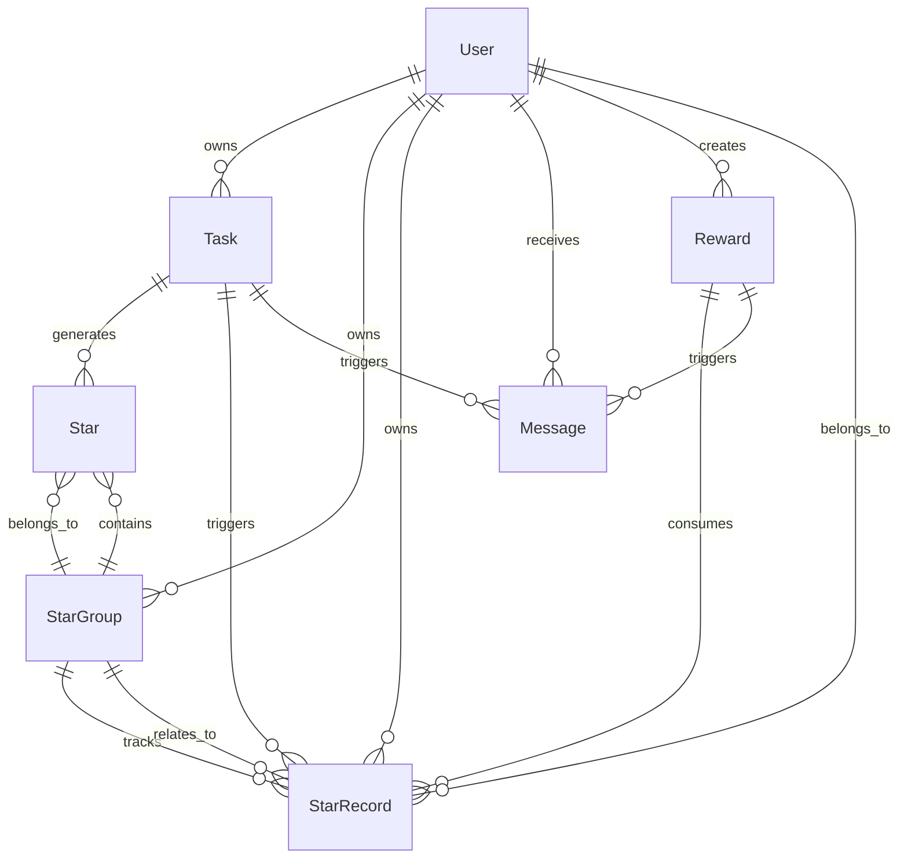

# 数据模型设计

本文档详细描述了学习任务微信小程序的核心数据模型，包括任务、消息等数据结构和处理逻辑。

## 任务数据模型

### 任务对象结构

任务对象是应用的核心数据模型，结构如下：

```javascript
{
  // 基础信息
  id: 'task_1234567890_123',     // 任务唯一ID，格式：task_时间戳_随机数
  userId: 'child',               // 用户ID，标识任务归属（'parent'/'child'）
  title: '练习钢琴',              // 任务标题
  description: '练习新曲目30分钟', // 任务描述
  type: 'study',                 // 任务类型: 'study'(学习)/'habit'(习惯)/'interest'(兴趣)
  
  // 时间相关
  date: '2023-05-23',            // 任务日期，YYYY-MM-DD格式
  startTime: '08:00',            // 开始时间
  endTime: '08:30',              // 结束时间
  duration: 30,                  // 持续时间(分钟)
  isAllDay: false,               // 是否为全天任务
  
  // 状态相关
  status: 0,                     // 任务状态: 0(未完成)/1(已完成)
  isRequired: false,             // 是否为必做任务
  penaltyApplied: false,         // 是否已应用惩罚(针对未完成的必做任务)
  completionTime: 0,             // 完成时间戳
  
  // 星星奖励
  points: 10,                    // 完成可获得的奖励点数（星星数量）
  pointsExpiry: 'permanent',     // 积分有效期类型：'permanent'/'week'/'month'/'quarter'
  pointsExpiryDate: '',          // 积分有效期显示文本
  starAwarded: false,            // 是否已经获得过星星（防止重复获取）
  
  // 重复设置
  repeat: {
    type: 'none',                // 重复类型: 'none'/'daily'/'weekly'/'monthly'
    startDate: '2023-05-23',     // 开始日期
    endDate: '2023-06-23',       // 结束日期
    days: []                     // 自定义重复天数
  },
  parentTaskId: '',              // 父任务ID（用于重复任务）
  hasNoEndDate: false,           // 重复任务是否无结束日期
  
  // 其他属性
  createTime: 1621693875000,     // 创建时间戳
  modifyTime: 1621693875000,     // 修改时间戳
  tags: ['音乐', '练习']          // 任务标签
}
```

### 任务类型定义

项目支持三种类型的任务，由TaskType枚举定义：

1. **学习任务 (study - TaskType.STUDY)**
   - 有明确的开始时间和结束时间（支持全天任务）
   - 通常与学业相关
   - 可设置为必做任务，未完成会应用惩罚
   - 支持重复设置（日、周、月）
   - 示例：语文作业、数学练习、阅读

2. **习惯任务 (habit - TaskType.HABIT)**
   - 培养良好习惯的任务
   - 通常需要重复执行
   - 支持连续完成天数统计
   - 示例：每天喝水、早起、整理房间

3. **兴趣任务 (interest - TaskType.INTEREST)**
   - 与兴趣爱好相关的活动
   - 培养多元化发展
   - 支持进度追踪
   - 示例：画画、弹钢琴、运动

### 任务状态流转

任务状态由TaskStatus枚举定义：
- `TaskStatus.PENDING (0)`: 待完成（数值类型）
- `TaskStatus.COMPLETED (1)`: 已完成（数值类型）

状态流转通过TaskService实现：

```javascript
// 完成任务
await taskService.completeTask(taskId, userId);

// 重置任务（取消完成）
await taskService.resetTask(taskId, userId);

// 更新任务状态
await taskService.updateTaskStatus(taskId, status, userId);
```

状态变更时的业务逻辑：
- 当任务状态从未完成变为已完成时，如果任务未获得过星星，则通过StarService添加对应积分
- 当任务状态从已完成变为未完成时，通过StarService扣除对应积分
- 对于必做任务，未完成并且过期的会自动应用惩罚机制
- 状态变更会通过EventBus发布事件，触发相关业务逻辑

### 必做任务机制

必做任务是一种特殊的任务类型，具有以下特点：
- 用 `isRequired` 字段标记
- 如果未完成且过期，将扣除积分作为惩罚
- 使用 `penaltyApplied` 字段防止重复惩罚
- 通过TaskService管理必做任务状态

```javascript
// 标记为必做任务
await taskService.markTaskAsRequired(taskId, userId);

// 取消必做任务标记
await taskService.unmarkTaskAsRequired(taskId, userId);

// 检查必做任务状态
await taskService.checkRequiredTasks();

// 处理必做任务惩罚
await taskService.handleRequiredTaskPenalty(task);
```

必做任务惩罚逻辑：
- 只有过期未完成且未应用过惩罚的必做任务才会被惩罚
- 惩罚会从用户的星星余额中扣除
- 即使星星余额不足，只要扣除了一些星星，任务就会被标记为已应用惩罚
- 惩罚信息会通过MessageService创建系统消息通知用户

### 星星有效期（积分有效期）

任务完成后获得的星星有以下有效期选项，由StarExpiryType枚举定义：
- `StarExpiryType.PERMANENT`: 永久有效
- `StarExpiryType.WEEK`: 到当前自然周的周日24点
- `StarExpiryType.MONTH`: 到当前自然月的最后一天24点
- `StarExpiryType.QUARTER`: 到当前自然季度的最后一天24点

星星有效期在代码中的处理：
- 使用 `pointsExpiry` 存储有效期类型
- 使用 `pointsExpiryDate` 存储格式化的有效期显示文本
- 通过StarService管理星星的创建、分组和过期处理
- 星星按过期时间分组存储，便于消费时按FIFO原则处理

```javascript
// 星星有效期类型枚举
const StarExpiryType = {
  PERMANENT: 'permanent',
  WEEK: 'week',
  MONTH: 'month',
  QUARTER: 'quarter'
};
```

## 星星数据模型

### 星星对象结构（Star Model）

```javascript
{
  id: 'star_1234567890_123',     // 星星唯一ID
  userId: 'child',               // 所属用户ID
  sourceType: 'task',            // 来源类型: 'task'(任务奖励)/'manual'(手动添加)
  sourceId: 'task_123',          // 来源ID（任务ID）
  amount: 1,                     // 星星数量
  expiryType: 'permanent',       // 有效期类型
  expiryDate: null,              // 过期日期（时间戳，永久有效为null）
  createTime: 1621693875000,     // 创建时间戳
  description: '完成任务奖励'      // 描述信息
}
```

### 星星分组对象结构（StarGroup Model）

```javascript
{
  id: 'group_1234567890_123',    // 分组唯一ID
  userId: 'child',               // 所属用户ID
  expiryType: 'permanent',       // 有效期类型
  expiryDate: null,              // 过期日期（时间戳）
  totalStars: 10,                // 总星星数量
  availableStars: 8,             // 可用星星数量
  consumedStars: 2,              // 已消费星星数量
  createTime: 1621693875000,     // 创建时间戳
  updateTime: 1621693875000      // 更新时间戳
}
```

### 星星记录对象结构（StarRecord Model）

```javascript
{
  id: 'record_1234567890_123',   // 记录唯一ID
  userId: 'child',               // 所属用户ID
  type: 'earn',                  // 记录类型: 'earn'(获得)/'consume'(消费)/'expire'(过期)
  amount: 5,                     // 数量（正数表示获得，负数表示消费/过期）
  balance: 25,                   // 操作后的余额
  sourceType: 'task',            // 来源类型
  sourceId: 'task_123',          // 来源ID
  groupId: 'group_123',          // 关联的星星分组ID
  description: '完成任务获得星星', // 描述信息
  createTime: 1621693875000      // 创建时间戳
}
```

### 星星系统核心逻辑

1. **星星创建流程**：
   - 任务完成时，TaskService通过StarService创建星星
   - 根据任务的pointsExpiry计算星星过期时间
   - 星星按相同过期时间分组到StarGroup中
   - 记录星星获得的StarRecord

2. **星星消费流程**：
   - 奖励兑换时，RewardService通过StarService消费星星
   - 按FIFO原则，优先消费即将过期的星星
   - 更新StarGroup的可用数量
   - 记录星星消费的StarRecord

3. **星星过期处理**：
   - 系统定期检查过期的StarGroup
   - 将过期星星标记为不可用
   - 记录星星过期的StarRecord
   - 保持数据一致性

## 奖励数据模型

### 奖励对象结构（Reward Model）

```javascript
{
  id: 'reward_1234567890_123',   // 奖励唯一ID
  userId: 'parent',              // 创建者用户ID（通常是家长）
  title: '看动画片30分钟',        // 奖励标题
  description: '可以选择喜欢的动画片', // 奖励描述
  cost: 10,                      // 兑换所需星星数量
  category: 'entertainment',     // 奖励类别
  isActive: true,                // 是否启用
  totalCount: 5,                 // 总数量（-1表示无限）
  remainingCount: 3,             // 剩余数量
  createTime: 1621693875000,     // 创建时间戳
  updateTime: 1621693875000      // 更新时间戳
}
```

## 消息数据模型

### 消息对象结构（Message Model）

```javascript
{
  id: 'message_1234567890_123',  // 消息唯一ID
  userId: 'child',               // 接收者用户ID
  type: 'system',                // 消息类型: 'system'(系统)/'notification'(通知)
  subType: 'task_completion',    // 消息子类型
  title: '任务完成通知',          // 消息标题
  content: '恭喜完成任务！',      // 消息内容
  priority: 'normal',            // 优先级: 'high'/'normal'/'low'
  isRead: false,                 // 是否已读
  isArchived: false,             // 是否已归档
  data: {                        // 相关数据
    taskId: 'task_123',
    points: 5
  },
  createTime: 1621693875000,     // 创建时间戳
  readTime: null                 // 读取时间戳
}
```

### 消息类型定义

```javascript
// 消息类型枚举
const MessageType = {
  SYSTEM: 'system',
  NOTIFICATION: 'notification'
};

// 通知类型枚举
const NotificationType = {
  TASK_COMPLETION: 'task_completion',
  STAR_REWARD: 'star_reward', 
  REQUIRED: 'required',
  UPCOMING: 'upcoming',
  PENALTY: 'penalty',
  REWARD_EXCHANGE: 'reward_exchange'
};

// 消息优先级枚举
const MessagePriority = {
  HIGH: 'high',
  NORMAL: 'normal', 
  LOW: 'low'
};
```

## 用户数据模型

### 用户对象结构（User Model）

```javascript
{
  id: 'child',                   // 用户唯一ID
  name: '小明',                   // 用户名称
  avatar: '',                    // 头像URL
  role: 'child',                 // 用户角色: 'parent'(家长)/'child'(小朋友)
  status: 'active',              // 用户状态: 'active'(活跃)/'inactive'(非活跃)
  settings: {                    // 用户设置
    notifications: true,         // 是否启用通知
    language: 'zh-CN'           // 语言设置
  },
  createTime: 1621693875000,     // 创建时间戳
  updateTime: 1621693875000,     // 更新时间戳
  lastActiveTime: 1621693875000  // 最后活跃时间戳
}
```

### 用户角色定义

```javascript
// 用户角色枚举
const UserRole = {
  PARENT: 'parent',    // 家长角色
  CHILD: 'child'       // 小朋友角色
};

// 用户状态枚举
const UserStatus = {
  ACTIVE: 'active',     // 活跃状态
  INACTIVE: 'inactive'  // 非活跃状态
};
```

## 数据关系图



## 数据存储策略

### 仓储模式
- **BaseRepository**: 提供通用的CRUD操作
- **TaskRepository**: 任务数据的专门存储和查询
- **StarGroupRepository**: 星星分组的存储和星星消费逻辑
- **StarRecordRepository**: 星星记录的存储和历史查询
- **RewardRepository**: 奖励数据的存储和管理
- **MessageRepository**: 消息数据的存储和状态管理

### 存储适配器
- **StorageAdapter**: 统一的数据存储接口
- 支持命名空间隔离
- 提供缓存机制
- 统一错误处理

### 数据一致性
- 使用事务性操作确保数据一致性
- 通过EventBus实现数据变更的事件通知
- 定期进行数据一致性检查和修复