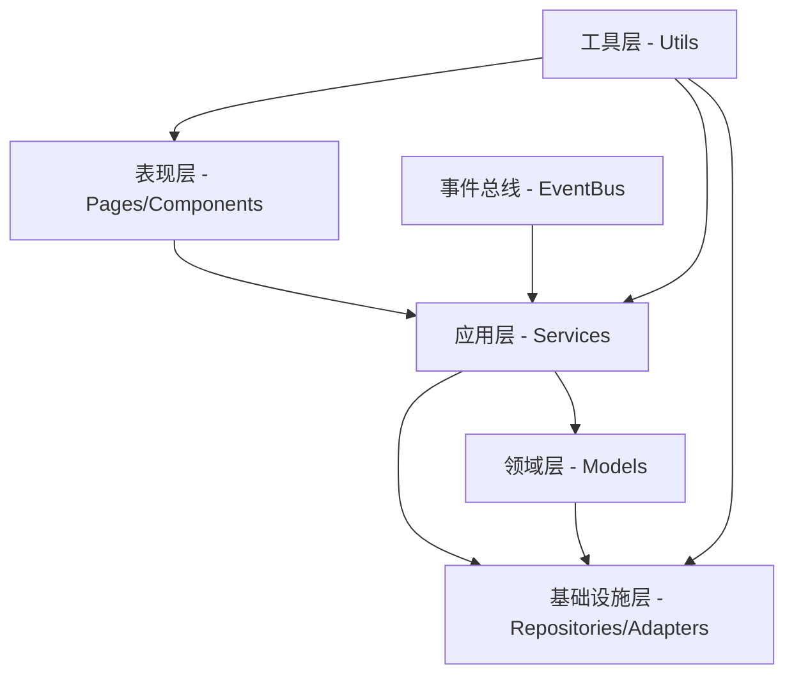

# 微信小程序项目结构

这是一个学习任务微信小程序，用于帮助小朋友养成良好学习习惯的任务管理工具。

## 核心文件
- **app.js** - 小程序入口文件，包含全局事件总线、全局数据和初始化逻辑
- **app.json** - 小程序配置文件，定义了页面路径、窗口样式和底部导航栏
- **app.wxss** - 全局样式文件
- **project.config.json** - 项目配置文件，包含编译设置和开发者工具配置

## 主要页面目录

### 主包页面
- **pages/index/** - 主页（任务日历）
- **pages/task-edit/** - 任务编辑页面
- **pages/rewards/** - 奖池页面

### 分包页面
- **packageChart/pages/analysis/** - 数据分析页面
- **packageManage/pages/reward-manage/** - 奖励管理页面
- **packageManage/pages/my-exchanges/** - 我的兑换记录页面
- **packageMessage/pages/message/** - 消息中心页面
- **packageMessage/pages/star-records/** - 星星记录页面

## 组件目录

### 主要组件
- **components/card/** - 卡片容器组件
- **components/date-picker/** - 日期选择器组件
- **components/float-menu/** - 浮动菜单组件
- **components/index-task-item/** - 主页任务项组件
- **components/progressBar/** - 进度条组件
- **components/progressRing/** - 环形进度条组件
- **components/upcomingTask/** - 即将到期任务组件
- **components/user-switcher/** - 用户切换组件

### 分包组件
- **packageComponents/components/task-heatmap/** - 任务热力图组件
- **packageChart/components/star-calendar/** - 星星日历组件
- **packageChart/components/star-trend/** - 星星趋势图组件

## 领域服务目录（DDD架构）

### 核心服务
- **services/task-service.js** - 任务领域服务，管理任务生命周期
- **services/star-service.js** - 星星领域服务，管理积分系统
- **services/reward-service.js** - 奖励领域服务，管理奖励兑换
- **services/message-service.js** - 消息领域服务，管理系统消息
- **services/user-service.js** - 用户领域服务，管理用户状态
- **services/service-manager.js** - 服务管理器，统一管理所有服务实例
- **services/index.js** - 服务导出入口

### 分包服务
- **packageChart/services/analytics-service.js** - 分析服务，提供数据统计

## 领域数据存储（仓储层）

### 核心仓储
- **repositories/base-repository.js** - 基础仓储类，提供通用数据操作
- **repositories/task-repository.js** - 任务数据仓储
- **repositories/star-group-repository.js** - 星星分组数据仓储
- **repositories/star-record-repository.js** - 星星记录数据仓储
- **repositories/reward-repository.js** - 奖励数据仓储
- **repositories/message-repository.js** - 消息数据仓储
- **repositories/index.js** - 仓储导出入口

## 领域模型（领域层）

### 核心模型
- **models/task.js** - 任务领域模型，定义任务实体和业务规则
- **models/star.js** - 星星领域模型，定义星星实体
- **models/star-group.js** - 星星分组模型，管理星星分组逻辑
- **models/star-record.js** - 星星记录模型，追踪星星变化
- **models/reward.js** - 奖励领域模型，定义奖励实体
- **models/message.js** - 消息领域模型，定义消息实体
- **models/user.js** - 用户领域模型，定义用户实体
- **models/index.js** - 模型导出入口

## 适配器目录（基础设施层）

### 核心适配器
- **adapters/storage-adapter.js** - 存储适配器，统一数据存储接口

## 工具函数目录

### 核心工具
- **utils/logger.js** - 日志工具，统一日志管理
- **utils/log-config.js** - 日志配置工具
- **utils/log-analyzer.js** - 日志分析工具
- **utils/dateUtils.js** - 日期处理工具
- **utils/uiUtils.js** - UI相关工具函数
- **utils/formatUtils.js** - 格式化工具
- **utils/batchUtils.js** - 批量处理工具，优化性能
- **utils/constants.js** - 常量定义
- **utils/deviceInfo.js** - 设备信息工具
- **utils/permission-utils.js** - 权限控制工具
- **utils/page-storage-helper.js** - 页面存储助手
- **utils/unit.js** - 单位换算工具

### 核心工具包
- **utils/core/event-bus.js** - 事件总线，支持组件间通信

### 分包工具
- **packageChart/utils/chart-utils.js** - 图表工具函数

## 样式目录

### 全局样式
- **app.wxss** - 全局样式文件
- **styles/variables.wxss** - 样式变量定义
- **styles/common.wxss** - 通用样式类
- **styles/animation.wxss** - 动画相关样式

## 静态资源目录

### 资源文件
- **assets/icons/** - 图标文件
- **assets/images/** - 图片文件

## 测试目录

### 测试文件
- **test/** - 测试文件目录
- **jest.config.js** - Jest测试配置

## 配置和文档

### 配置文件
- **.cursorrules** - Cursor开发规则和项目规范
- **.gitignore** - Git忽略文件配置
- **package.json** - 项目依赖和脚本配置
- **sitemap.json** - 小程序页面收录配置

### 文档系统
- **docs/** - 项目文档根目录
  - **docs/architecture/** - 架构文档
  - **docs/development/** - 开发指南
  - **docs/api/** - API文档
  - **docs/user/** - 用户手册

## DDD架构层次关系



## 主要数据流

### 1. 任务管理流程
```
用户操作 → Pages → TaskService → TaskRepository → StorageAdapter → 本地存储
                    ↓
              EventBus → MessageService → 消息通知
```

### 2. 星星奖励流程
```
任务完成 → TaskService → StarService → StarGroupRepository → 星星分组存储
                           ↓
                    RewardService → 奖励兑换处理
```

### 3. 数据分析流程
```
原始数据 → AnalyticsService → 数据聚合 → 图表组件 → 可视化展示
```

## 分包结构说明

### packageChart（图表分包）
- 包含数据分析和图表展示相关功能
- 主要页面：analysis（分析页面）
- 主要组件：star-calendar、star-trend
- 核心服务：analytics-service

### packageManage（管理分包）
- 包含奖励管理和兑换记录功能
- 主要页面：reward-manage、my-exchanges

### packageMessage（消息分包）
- 包含消息中心和星星记录功能
- 主要页面：message、star-records

### packageComponents（组件分包）
- 包含复杂的共享组件
- 主要组件：task-heatmap

## 文件命名规范

1. **JavaScript文件**：使用短横线分隔（kebab-case），如 `task-service.js`
2. **目录命名**：使用短横线分隔，如 `star-records/`
3. **组件目录**：使用驼峰命名，如 `progressRing/`
4. **常量定义**：使用大写字母和下划线，如 `TASK_STATUS`
5. **文档文件**：使用短横线分隔，如 `project-structure.md`

```
app.js ────────┐
               ▼
         全局事件总线 ─────────┐
               │               │
        全局状态/配置 ◄────────┤
               │               │
               ▼               │
pages/ ◄── components/ ◄── services/ ◄── repositories/
  │          │               │            │
  │          ▼               ▼            ▼
  └───► 页面组件交互        领域模型     数据存储
```

## 主要数据流

1. **任务数据流**:
   ```
   TaskService ──> TaskRepository ──> 本地存储 ──> 页面/组件展示
        ▲                                             │
        │                                             │
        └─────────────── 用户操作 ◄───────────────────┘
   ```

2. **消息通知流**:
   ```
   事件触发 ──> MessageService ──> MessageRepository ──> 存储
                      │
                      ▼
               消息中心/通知展示
   ```

3. **主题和样式**:
   ```
   variables.wxss ──> app.wxss ──> 页面/组件样式
   ``` 