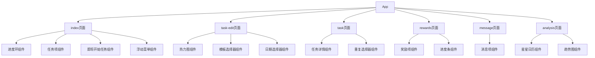
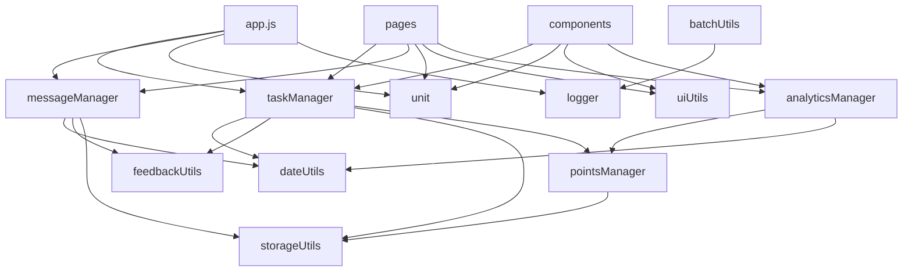
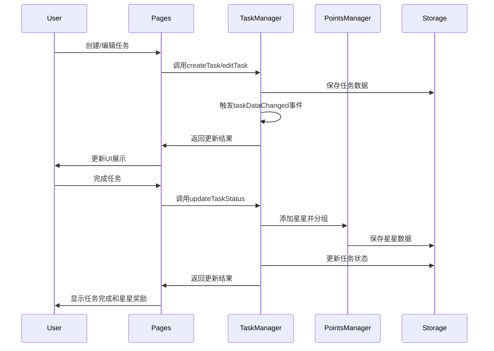
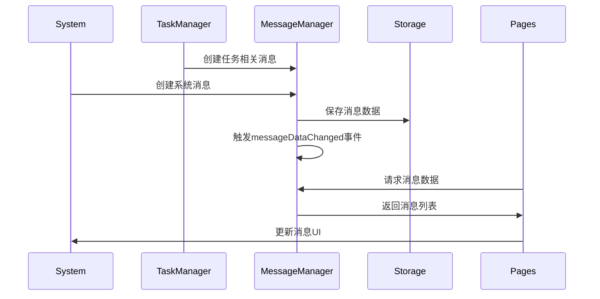
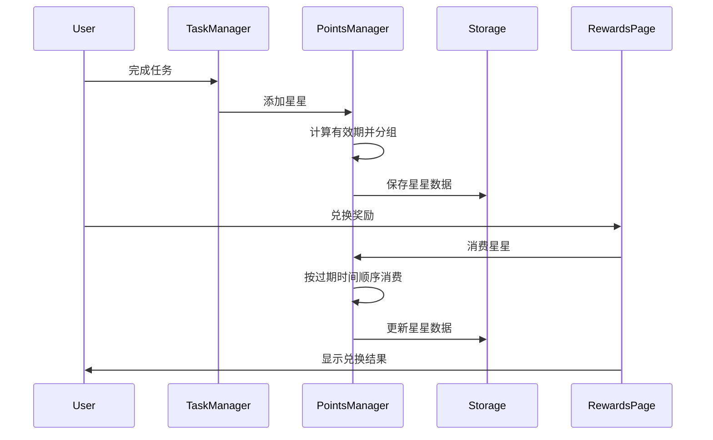

# 学习任务微信小程序系统架构

## 系统概述

学习任务微信小程序是一个专为帮助小朋友养成良好学习习惯而设计的任务管理工具。系统采用组件化设计，支持多种任务类型，提供丰富的进度跟踪和奖励机制。本文档主要描述系统的核心架构、组件关系以及数据流。

## 核心架构

### 1. 应用结构

系统采用标准的微信小程序架构，由以下部分组成：

- **入口文件**：app.js、app.json和app.wxss
- **页面**：存放在pages目录下，每个页面包含js、wxml、wxss和json文件
- **组件**：存放在components目录下，负责实现可复用的UI和功能模块
- **工具类**：存放在utils目录下，提供通用功能支持
- **资源文件**：存放在assets目录下，包括图片、图标等静态资源

### 2. 数据管理

系统采用以下数据管理方式：

- **本地存储**：使用wx.setStorage和wx.getStorage存储任务和设置数据
- **全局状态**：通过app.globalData管理全局状态
- **事件总线**：实现了自定义的事件总线机制，用于组件间通信
- **数据同步**：通过自定义的任务管理器和消息管理器实现数据同步
- **批量处理**：通过batchUtils实现大量数据的高效处理

## 组件关系

### 1. 核心组件

系统包含多个关键组件，以下是主要组件及其关系：

### 2. 工具类关系

系统包含多个工具类，以下是主要工具类及其关系：

## 数据流

### 1. 任务数据流

系统的任务数据流如下：

### 2. 消息数据流

系统的消息数据流如下：

### 3. 星星数据流

系统的星星(积分)数据流如下：

## 核心功能模块

### 1. 任务管理模块

任务管理是系统的核心功能，主要由taskManager.js实现，包括：

- **创建任务**：支持创建单次任务和重复任务
- **编辑任务**：支持编辑任务的各种属性
- **删除任务**：支持删除单个任务或一系列重复任务
- **更新任务状态**：支持标记任务完成/未完成
- **查询任务**：支持获取所有任务和今日任务
- **任务统计**：支持计算任务完成率和进度
- **必做任务**：支持设置必做任务并处理惩罚机制

### 2. 星星奖励模块

星星奖励模块由pointsManager.js实现，是系统的核心激励机制，包括：

- **星星获取**：任务完成后获得星星
- **星星分组**：按有效期将星星分组存储
- **星星消费**：实现"先过期先使用"的消费策略
- **过期处理**：自动清理过期星星
- **数据维护**：定期检查并修复数据一致性
- **趋势分析**：提供星星获取和过期趋势分析

### 3. 消息通知模块

消息通知功能由messageManager.js实现，包括：

- **创建消息**：支持系统消息、任务提醒和奖励通知
- **标记已读**：支持标记单条消息或所有消息为已读
- **消息查询**：支持按类型和状态查询消息
- **消息过期**：支持设置消息有效期和自动过期
- **过期预警**：提供星星即将过期的预警消息

### 4. 数据分析模块

数据分析功能由analyticsManager.js实现，包括：

- **任务分布**：分析任务类型和时间分布
- **完成情况**：统计任务完成率和连续完成天数
- **星星趋势**：分析星星获取和消费趋势
- **过期预测**：预测未来星星过期趋势
- **压力指数**：计算任务压力指数并可视化

### 5. 适配性模块

系统提供了完善的适配性支持，主要由unit.js实现，包括：

- **单位转换**：支持px和rpx之间的转换
- **高度计算**：支持计算可用内容高度
- **设备检测**：支持检测设备类型和方向
- **安全区域**：支持计算安全区域尺寸
- **横屏适配**：支持横屏和竖屏动态适配

### 6. 日志模块

系统实现了统一的日志模块logger.js，用于跟踪和调试：

- **分级日志**：支持log/info/warn/error四个级别
- **模块标识**：每条日志带有模块标识
- **格式统一**：统一的日志格式和展示风格
- **性能记录**：支持关键操作的性能跟踪
- **调试模式**：支持在调试模式下显示更详细的日志

## 优化措施

系统实施了多项优化措施，主要包括：

### 1. 性能优化

- **批量处理**：使用batchUtils处理大量数据操作
- **延迟加载**：使用setTimeout延迟非关键任务
- **数据缓存**：避免重复计算和请求
- **防抖处理**：对频繁操作如保存数据进行防抖处理
- **选择性渲染**：根据需要渲染组件，减少不必要的重绘
- **存储合并**：合并多次存储操作，减少IO

### 2. 用户体验优化

- **即时反馈**：操作后提供及时的视觉反馈
- **动画过渡**：使用动画使界面过渡更流畅
- **错误处理**：提供友好的错误提示和恢复机制
- **加载指示**：长时间操作时显示加载指示器
- **数据一致性**：自动检查和修复数据不一致问题

### 3. 适配性优化

- **屏幕适配**：支持不同尺寸和方向的屏幕
- **设备适配**：针对不同类型设备优化界面
- **暗黑模式**：支持系统暗黑模式
- **字体适配**：支持系统字体大小调整
- **安全区域**：适应不同设备的安全区域

## 数据持久化

系统使用微信小程序的本地存储机制进行数据持久化：

### 1. 存储结构

- **taskData**：存储所有任务数据
- **points**：存储用户当前总星星数
- **starGroups**：按有效期分组存储的星星数据
- **pointsRecords**：存储星星获取和消费记录
- **messageData**：存储所有消息数据
- **templates**：存储用户创建的任务模板
- **settings**：存储用户设置

### 2. 存储优化

- **统一接口**：使用storageUtils提供统一的存储接口
- **批量操作**：合并多次存储操作减少IO
- **增量更新**：只更新发生变化的数据部分
- **压缩存储**：对大型数据进行压缩处理
- **存储监控**：监控存储用量，防止超出限制

## 未来规划

系统未来的发展规划包括：

1. **云同步**：实现数据云端同步，支持多设备使用
2. **智能提醒**：基于用户习惯智能调整提醒时间
3. **社交功能**：增加家庭成员协作和激励功能
4. **数据分析**：增强数据分析和可视化功能
5. **个性化推荐**：根据用户习惯推荐任务模板和奖励
6. **AI助手**：引入AI助手帮助规划任务和学习路径
7. **进阶版星星策略**：更灵活的星星有效期和消费策略配置 