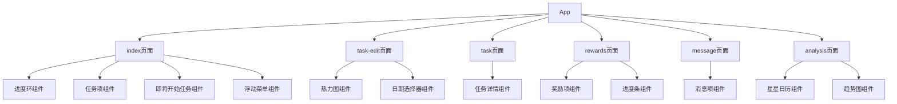
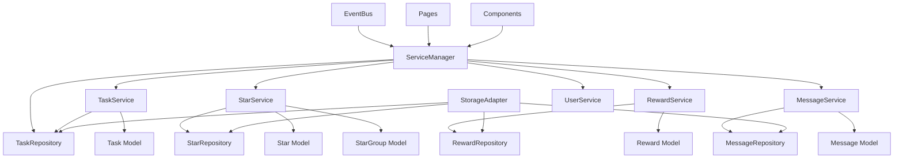
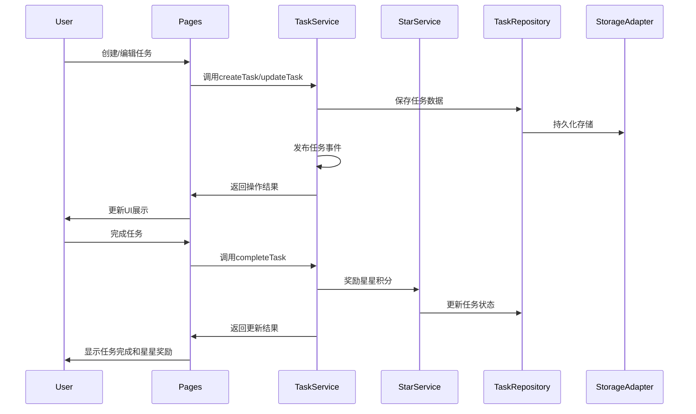
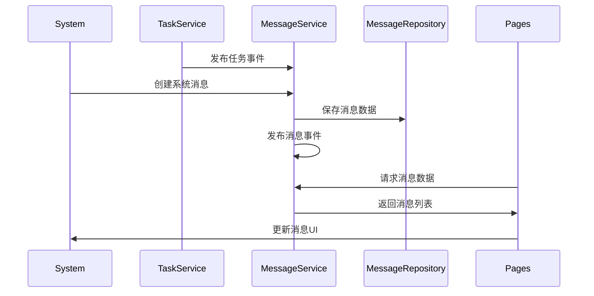
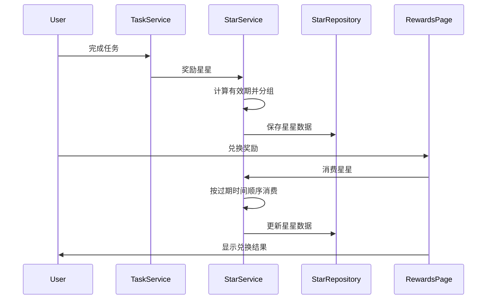

# 学习任务微信小程序系统架构

## 系统概述

学习任务微信小程序是一个专为帮助小朋友养成良好学习习惯而设计的任务管理工具。系统采用领域驱动设计(DDD)架构，支持多种任务类型，提供丰富的进度跟踪和奖励机制。

### 技术特点
- **微信小程序原生框架**：充分利用小程序生态优势
- **DDD架构**：清晰的分层架构，易于维护和扩展
- **事件驱动**：通过EventBus实现松耦合的组件通信
- **分包加载**：优化加载性能，按需加载功能模块
- **多用户支持**：支持家长和小朋友角色切换

本文档主要描述系统的核心架构、组件关系以及数据流。

## 核心架构

### 1. DDD分层架构

系统采用完整的领域驱动设计架构，由以下层次组成：

- **领域层(models/)**：定义核心业务实体和规则
  - Task、Star、StarGroup、Reward、Message、User等核心模型
  - 业务规则封装在模型内部，确保业务一致性
  - 领域事件机制支持状态变更通知

- **应用服务层(services/)**：协调领域对象，实现业务逻辑
  - TaskService、StarService、RewardService、MessageService、UserService、ValidationService
  - 通过ServiceManager统一管理和依赖注入
  - 服务间通过EventBus进行事件通信
  - ValidationService提供统一的表单验证逻辑

- **基础设施层(repositories/ & adapters/)**：提供技术支撑
  - BaseRepository提供通用CRUD操作
  - 各领域仓储实现专门的数据操作
  - StorageAdapter统一数据存储接口

- **表现层(pages/ & components/)**：实现用户界面和交互
  - 页面组件通过ServiceManager访问业务逻辑
  - 组件化设计，高度复用
  - 支持分包按需加载

### 2. 应用结构

#### 核心文件
- **app.js**：应用入口，初始化服务管理器、用户服务、日志系统等
- **app.json**：应用配置，定义页面路由、分包策略、TabBar等
- **app.wxss**：全局样式，定义通用UI规范

#### 分包策略
- **主包**：包含核心页面(index、task-edit、rewards)和基础组件
- **packageChart**：数据分析功能，包含analysis页面和图表组件
- **packageManage**：管理功能，包含奖励管理和兑换记录
- **packageMessage**：消息功能，包含消息中心和星星记录
- **packageComponents**：复杂组件，如任务热力图

#### 工具和基础设施
- **utils/**：通用工具类，包含日志、批处理、格式化等工具
- **adapters/**：适配器层，统一数据存储接口
- **styles/**：样式系统，包含变量定义和通用样式
- **assets/**：静态资源，图标和图片文件

### 3. 数据管理

系统采用现代化的数据管理架构：

#### 领域模型层
- **Task**：任务实体，包含完整的业务逻辑和验证规则
- **Star/StarGroup**：星星积分系统，支持分组管理和有效期控制
- **Reward**：奖励系统，支持多种奖励类型和状态管理
- **Message**：消息通知系统，支持多种消息类型和优先级
- **User**：用户管理，支持多角色和权限控制

#### 仓储模式
- **BaseRepository**：提供通用的CRUD操作和数据访问模式
- **专门仓储**：各领域仓储实现特定的业务查询和操作
- **事务支持**：确保数据操作的一致性和完整性

#### 服务层架构
- **ServiceManager**：统一的服务管理和依赖注入容器
- **事件驱动**：通过EventBus实现服务间的松耦合通信
- **批量处理**：通过batchUtils优化大量数据操作的性能

#### 存储策略
- **StorageAdapter**：统一的存储抽象，支持命名空间和缓存
- **数据一致性**：定期检查和修复数据一致性
- **性能优化**：合理的数据结构设计和索引策略

## 组件关系

### 1. 核心组件

系统包含多个关键组件，以下是主要组件及其关系：

### 2. 服务架构关系

系统采用DDD架构，以下是主要服务及其关系：

## 数据流

### 1. 任务数据流

系统的任务数据流基于DDD架构：

### 2. 消息数据流

系统的消息数据流基于DDD架构：

### 3. 星星数据流

系统的星星(积分)数据流基于DDD架构：

## 核心功能模块

### 1. 任务管理模块

任务管理是系统的核心功能，主要由TaskService实现，包括：

- **创建任务**：支持创建单次任务和重复任务
- **编辑任务**：支持编辑任务的各种属性
- **删除任务**：支持删除单个任务或一系列重复任务
- **更新任务状态**：支持标记任务完成/未完成
- **查询任务**：支持获取所有任务和今日任务
- **任务统计**：支持计算任务完成率和进度
- **必做任务**：支持设置必做任务并处理惩罚机制
- **批量操作**：支持批量处理任务数据

### 2. 星星奖励模块

星星奖励模块由StarService实现，是系统的核心激励机制，包括：

- **星星获取**：任务完成后获得星星
- **星星分组**：按有效期将星星分组存储
- **星星消费**：实现"先过期先使用"的消费策略
- **过期处理**：自动清理过期星星
- **数据维护**：定期检查并修复数据一致性
- **趋势分析**：提供星星获取和过期趋势分析

### 3. 消息通知模块

消息通知功能由MessageService实现，包括：

- **创建消息**：支持系统消息、任务提醒和奖励通知
- **标记已读**：支持标记单条消息或所有消息为已读
- **消息查询**：支持按类型和状态查询消息
- **消息过期**：支持设置消息有效期和自动过期
- **过期预警**：提供星星即将过期的预警消息
- **批量处理**：支持批量创建和处理消息

### 4. 奖励兑换模块

奖励兑换功能由RewardService实现，包括：

- **奖励管理**：创建、编辑和删除奖励项目
- **库存管理**：跟踪奖励库存和补充机制
- **兑换流程**：完整的星星消费和奖励发放流程
- **兑换记录**：跟踪用户兑换历史
- **状态管理**：奖励状态的完整生命周期管理

### 5. 数据分析模块

数据分析功能通过各服务的统计方法实现，包括：

- **任务分布**：分析任务类型和时间分布
- **完成情况**：统计任务完成率和连续完成天数
- **星星趋势**：分析星星获取和消费趋势
- **过期预测**：预测未来星星过期趋势
- **用户行为**：分析用户使用模式和习惯

### 6. 适配性模块

系统提供了完善的适配性支持，主要由unit.js实现，包括：

- **单位转换**：支持px和rpx之间的转换
- **屏幕适配**：根据不同设备屏幕尺寸调整UI
- **方向适配**：支持横屏和竖屏模式
- **字体缩放**：支持系统字体大小调整
- **主题适配**：支持系统主题切换

## 性能优化

### 1. 批量处理机制

- **数据操作批量化**：使用batchUtils避免UI阻塞
- **存储操作优化**：减少I/O次数，批量提交更改
- **异步操作支持**：Promise和async/await模式广泛应用
- **延迟加载策略**：非关键功能延迟初始化

### 2. 缓存策略

- **多级缓存**：内存缓存 + 存储缓存
- **智能失效**：基于TTL和数据变化的缓存策略
- **命名空间**：避免数据冲突，支持模块化存储
- **增量更新**：只更新变化的数据部分

### 3. 事件优化

- **事件总线优化**：支持开发和生产环境的不同优化策略
- **事件聚合**：减少不必要的事件触发
- **异步处理**：事件处理不阻塞主线程

## 扩展性设计

### 1. 插件化架构

- **服务扩展**：通过ServiceManager轻松添加新服务
- **模型扩展**：通过继承BaseRepository添加新仓储
- **事件扩展**：通过EventBus添加新的业务事件

### 2. 配置化设计

- **环境配置**：支持开发和生产环境的不同配置
- **用户配置**：支持用户个性化设置
- **日志配置**：支持模块级别的日志控制

### 3. 国际化支持

- **文本国际化**：支持多语言切换
- **日期格式**：支持不同地区的日期格式
- **数字格式**：支持不同地区的数字格式

## 安全性考虑

### 1. 数据安全

- **输入验证**：所有用户输入进行验证和过滤
- **数据加密**：敏感数据加密存储
- **访问控制**：按用户权限控制数据访问

### 2. 代码安全

- **错误处理**：完善的异常处理机制
- **日志安全**：避免在日志中记录敏感信息
- **依赖安全**：定期检查和更新依赖包

项目架构已达到高度成熟状态，采用现代化的DDD设计模式，具备良好的可扩展性、可维护性和性能表现。 