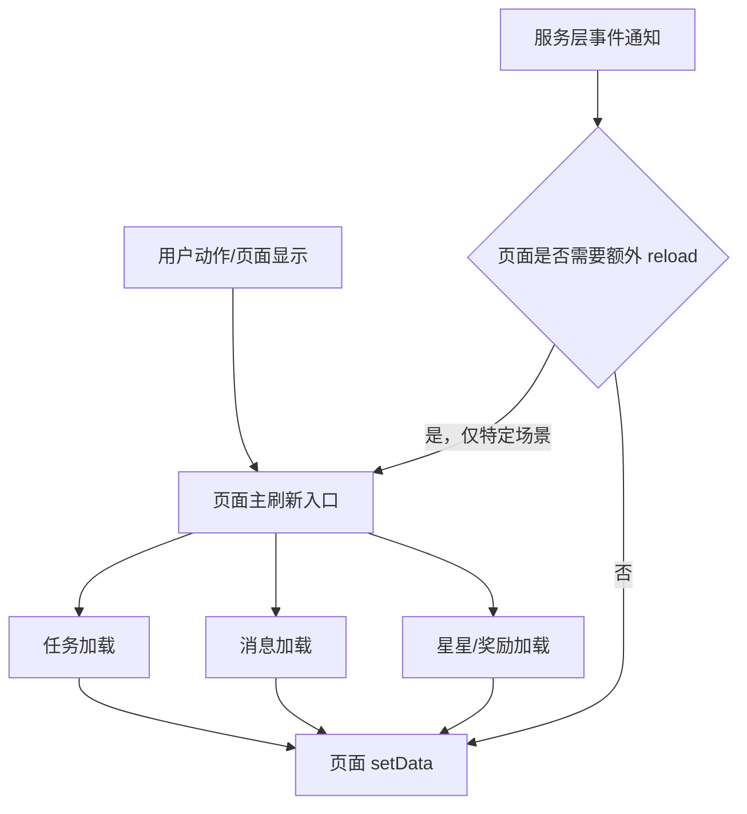

# 重复刷新治理 详细设计文档

> **设计状态**：🟢 已完成
> **创建日期**：2026-04-04
> **设计者**：GPT5 Codex
> **审核者**：项目维护者
> **预计工期**：0.5天

> **实施结果**：
> - 已完成首页、奖励页、消息页重复刷新治理
> - 已补齐页面层回归测试，并完成模拟器日志复核

---

## 📋 目录

- [需求分析](#需求分析)
- [技术方案](#技术方案)
- [代码结构](#代码结构)
- [实施步骤](#实施步骤)
- [测试方案](#测试方案)
- [风险评估](#风险评估)
- [替代方案](#替代方案)
- [审核要点自检](#审核要点自检)
- [审核记录](#审核记录)

---

## 需求分析

### 功能描述

本次修复不改变任务、星星、奖励、消息的业务语义，只治理页面与服务层之间的重复刷新编排问题。当前手工验收日志和代码复核都表明，首页、奖励页、消息页以及任务完成后的联动刷新存在“同一用户动作触发多轮数据加载”的情况，虽然最终结果正确，但会带来额外请求、重复缓存清理、UI 闪动和弱网下体感退化。

这类问题已经不是单纯的性能观察项，而是明确的状态编排缺陷。需要在不改变现有功能结果的前提下，收敛页面生命周期、事件驱动和手动 reload 的职责边界，让每类交互只有一条主刷新路径。

### 业务价值

- [x] 用户价值：减少页面重复加载、降低返回首页和消息已读后的闪动感，改善真机和弱网体验。
- [x] 技术价值：明确“唯一主刷新入口”，降低页面和服务层相互叠加造成的复杂度，便于后续排查真实故障。
- [x] 业务价值：在不改业务规则的前提下提升交付稳定性，避免后续迭代继续放大重复请求与状态竞争。

### 功能范围

**包含**：
- ✅ 首页 `onShow` 与 `loadAllPageData()` 的重复刷新治理
- ✅ 奖励页 `onLoad` / `onShow` 首次进入双加载治理
- ✅ 消息页“标记已读”后的双刷新治理
- ✅ 任务完成/重置后的页面补刷新与事件驱动重叠治理
- ✅ 为上述链路补最小必要的回归测试

**不包含**（明确的边界）：
- ❌ 不调整奖励业务模型，不在本次里程碑内处理“家庭共享奖励池”的产品口径统一
- ❌ 不重构 `loginUser / currentUser / targetUserId` 双轨模型
- ❌ 不重写消息、奖励、任务服务的整体架构
- ❌ 不引入新的全局状态管理机制

### 优先级

- **优先级**：P1
- **理由**：当前没有阻断发布的功能故障，但重复刷新已经由日志和代码双重证实，若不修复会持续影响体验，并放大后续弱网和多页面切换场景的排查成本。

---

## 技术方案

### 方案概述

本次采用“唯一主刷新入口 + 去重补刷新 + 保留现有业务语义”的收敛策略。核心原则是：每个页面在每种交互场景下，只允许存在一条主刷新链路；如果事件驱动已经能完成 UI 更新，页面层就不再额外手动 reload；如果页面层明确承担主刷新职责，则服务层事件只保留轻量通知，不再触发同域的重复加载。

不做跨层大重构，也不把这次修复扩展为“统一页面状态架构”。所有改动都限制在现有页面模块和服务层的编排边界内，用最小必要修改消除重复调用。

### 技术选型

| 技术点 | 选择方案 | 替代方案 | 选择理由 |
|--------|---------|---------|---------|
| 生命周期治理 | 保留现有页面生命周期，收敛入口 | 重写成新的页面状态机 | 改动更小，风险更可控 |
| 消息刷新 | 明确“事件驱动”与“页面手动 reload”二选一 | 两套机制并存继续依赖节流 | 继续并存只会掩盖问题，不是修复 |
| 奖励页首进加载 | 增加首进跳过策略，避免 `onLoad + onShow` 双加载 | 保持现状，依赖缓存节流 | 奖励页当前存在结构性双加载，必须消除 |
| 首页数据加载 | 保留 `loadAllPageData()` 作为主入口 | 分散在 `onShow` 中逐项刷新 | 批量入口更容易统一约束和测试 |

### DDD分层设计

说明涉及的层次：

**领域层（models/）**：
- [ ] 新建模型：无
- [ ] 修改模型：无
- 说明：本次不改领域模型和业务规则。

**服务层（services/）**：
- [ ] 新建服务：无
- [ ] 修改服务：无
- 说明：本次实现未修改服务层，治理点都收敛在页面模块编排。

**仓储层（repositories/）**：
- [ ] 新建仓储：无
- [ ] 修改仓储：无
- 说明：不改变数据持久化结构。

**适配器层（adapters/）**：
- [ ] 新建适配器：无
- [ ] 修改适配器：无
- 说明：不新增适配器。

**表现层（pages/、components/）**：
- [ ] 新建页面：无
- [x] 修改页面：`pages/index/modules/index-lifecycle.js`
- [x] 修改页面：`pages/index/modules/index-refresh-coordinator.js`
- [x] 修改页面：`pages/index/modules/index-task-actions.js`
- [x] 修改页面：`pages/rewards/rewards.js`
- [x] 修改页面：`packageMessage/pages/message/message.js`
- 说明：主要收敛生命周期入口、手动补刷新和事件驱动的职责边界。

### 架构图



### 数据模型

```typescript
interface RefreshDecision {
  source: 'page-lifecycle' | 'user-action' | 'event-bus';
  page: 'index' | 'rewards' | 'message';
  shouldReloadTasks: boolean;
  shouldReloadMessages: boolean;
  shouldReloadRewards: boolean;
}
```

### 接口设计

本次不新增后端接口，不修改 REST 契约。

### 事件 ownership 矩阵

| 事件 | 触发源 | 首页处理方式 | 当前页面处理方式 | 是否允许触发全量 reload | 设计说明 |
|------|--------|-------------|------------------|-------------------------|---------|
| `message:changed` | `MessageService` 云端刷新 / 本地已读写入后 | 首页仅在当前可见时做轻量预览更新，不再主动触发 `loadMessageData()` | 消息中心页若本次操作已由页面显式 reload，则不再额外触发第二轮 reload | 否 | 避免“消息服务发事件 + 页面 setTimeout reload”双叠加 |
| `reward:updated` | 奖励增删改 / 示例奖励清理 | 首页仅刷新奖励摘要，不触发任务/消息重载 | 奖励页根据当前是否可见决定局部更新或单次主刷新 | 否 | 奖励变更不应扩散为整页批量刷新 |
| `reward:claimed` | 奖励兑换成功 | 首页不在事件回调里立即全量刷新，改为设置返回刷新标记并在 `onShow` 主入口统一处理 | 奖励页由兑换成功链路自己完成一次结果刷新 | 否 | 避免“奖励页内部刷新 + 首页事件监听刷新 + 返回首页 onShow 再刷新”三重叠加 |
| `task:changed` | 任务更新/删除/状态变更 | 首页可按当前视图执行一次任务区局部刷新，不额外带出消息/奖励全量 reload | 任务操作发起页负责一次必要补刷新 | 否 | 任务卡片状态正确优先，但不再放大为多域联动重复刷新 |
| `task:created` | 任务创建成功 | 首页只刷新当前视图任务列表 | 创建页返回首页后不再额外追加同域第二轮 reload | 否 | 创建后以任务域刷新为主，不扩大为消息/奖励重复刷新 |
| `user:switched` | `UserService.switchToUser()` | 首页显式执行 `refreshDataForCurrentUser()` 一轮主刷新 | 其他页面不依赖该事件做自动 reload | 否 | 用户切换继续由页面显式刷新负责，不新增 event-bus 监听链 |

### 关键设计结论

#### 1. 首页统一以 `loadAllPageData()` 为主刷新入口

- `onShow` 不再先独立刷新奖励，再进入批量加载。
- `checkExpiredTasksAndStars()` 保留，但只负责结算/检查，不新增重复读取。
- `loadAllPageData()` 必须作为首页进入和从奖励页返回后的单一主入口执行。

#### 2. 奖励页首进不允许 `onLoad + onShow` 双加载

- 奖励页应仿照消息页已有的 `_skipNextOnShowRefresh` 思路，首次进入只走一轮主加载。
- `onShow` 负责“页面再次显示时的刷新”，不是“首次进入的第二轮初始化”。
- `loadRewardsData()` 不应每次都无条件清空星星/奖励缓存，否则任何正常刷新都会被放大。
- 奖励兑换成功后的 `_handleExchangeSuccess()` 也纳入本次治理：兑换结果只允许触发一轮奖励页主刷新，不允许“局部 setData + 全量 `loadRewardsData()` + 返回后 `onShow` 再刷新”连续叠加。

#### 3. 消息页已读后只能保留一个刷新来源

- 页面手动 `setTimeout(loadMessageData)` 与消息服务云端刷新后的事件通知，不能同时承担同一轮 UI 刷新职责。
- 本次优先保留页面层显式已读结果更新，避免消息服务内部事件把当前页和首页同时拉进重复 reload。
- `viewMessageDetail()` 与 `markMessageAsRead()` 两条已读路径行为要统一。
- 首页未读预览同步规则要明确：消息中心页完成已读后，当前不在首页时不强制拉起首页全量 reload；首页预览由返回首页时的主刷新入口兜底，若首页当前可见则仅做轻量预览更新。

#### 4. 任务完成/重置后的联动刷新要按职责收口

- 任务状态成功后，页面仍需要刷新任务列表以保证当前卡片状态正确。
- 但消息和奖励/星星的刷新不能既靠显式调用，又靠事件驱动重复执行。
- 本次以“页面层明确发起一次补刷新”为准，事件监听保留轻量 UI 更新，不再触发同域二次加载。

---

## 代码结构

### 文件变更清单

**新增文件**：
- `docs/design/fix-refresh-orchestration-dedup.md` - 重复刷新治理设计文档

**修改文件**：
- `pages/index/modules/index-lifecycle.js` - 收敛首页 `onShow` 刷新入口
- `pages/index/modules/index-refresh-coordinator.js` - 收敛批量刷新与事件驱动职责
- `pages/index/modules/index-task-actions.js` - 收敛任务完成后的补刷新链路
- `pages/rewards/rewards.js` - 消除首进双加载与过度全量重载
- `packageMessage/pages/message/message.js` - 消除消息已读后的双刷新
- `test/pages/index.lifecycle.test.js` - 补首页生命周期刷新断言
- `test/pages/index.refresh-coordinator.test.js` - 补首页刷新协调断言
- `test/pages/index.task-actions.test.js` - 补任务动作后的去重刷新断言
- `test/pages/index.reward-flow.test.js` - 补首页与奖励页联动断言
- `test/pages/rewards.behavior.test.js` - 补奖励页首进与兑换后刷新断言
- `test/pages/rewards.page-contract.test.js` - 补奖励页页面契约断言
- `test/pages/message-page.behavior.test.js` - 补消息页已读刷新断言
- `test/pages/message-page.extra-behavior.test.js` - 补消息页额外行为回归断言

### 核心代码结构

```javascript
// 首页 onShow
async function onShow(page) {
  await page.waitForServicesReady();
  await page.initializeMultiUserSystemDelayed();

  if (fromRewardCompletion) {
    await page.loadAllPageData({ ... });
    return;
  }

  await page.checkExpiredTasksAndStars();
  await page.loadAllPageData({ ... });
}

// 消息页已读
async function markMessageAsRead() {
  const success = await messageService.markMessageAsRead(...);
  if (!success) return;

  // 二选一：本地更新 or 单次 reload
  await this.loadMessageData();
}
```

### 关键函数

**函数1**：`loadAllPageData`
- **输入**：`options`
- **输出**：`Promise<void>`
- **职责**：作为首页主刷新入口，统一调度任务、消息、星星/奖励加载
- **依赖**：`loadTaskDataOnly`、`loadMessageData`、`loadStarsAndRewards`

**函数2**：`loadRewardsData`
- **输入**：无
- **输出**：`Promise<void>`
- **职责**：渲染奖励页数据，不再承担无条件清缓存和重复初始化职责
- **依赖**：`starService`、`rewardService`

**函数3**：`markMessageAsRead`
- **输入**：`messageId`
- **输出**：`Promise<boolean>`
- **职责**：完成消息已读写入，并只保留一条页面刷新链路
- **依赖**：`messageService.markMessageAsRead`

**函数4**：`handleSuccess`
- **输入**：任务状态变更上下文
- **输出**：`Promise<void>`
- **职责**：任务成功后只保留必要的补刷新，不与事件驱动叠加
- **依赖**：`refreshTaskDataForCurrentView`、`loadMessageData`、`loadStarsAndRewards`、`checkRewardUnlock`

**函数5**：`_handleExchangeSuccess`
- **输入**：奖励兑换结果、奖励对象、孩子 userId
- **输出**：`Promise<void>`
- **职责**：奖励兑换成功后只保留一轮奖励页结果刷新，不再叠加后续 `onShow` 双加载
- **依赖**：`loadRewardsData`、奖励页返回链路

---

## 实施步骤

### 第1步：收敛首页刷新入口（预计1小时）

- [ ] **任务**：调整首页 `onShow` 与 `loadAllPageData()` 的职责边界
- [ ] **验证**：进入首页或从奖励页返回时，日志中不再出现奖励预刷新 + 批量刷新双链路
- [ ] **依赖**：无

**实施要点**：
1. `onShow` 不再额外独立调用一轮奖励云同步
2. `loadAllPageData()` 作为主入口时要显式 `await`
3. 保持过期检查和正式提醒同步现有语义不变

---

### 第2步：消除奖励页首进双加载（预计1小时）

- [ ] **任务**：让奖励页首次进入只执行一轮主加载
- [ ] **验证**：首次打开奖励页只出现一轮数据加载日志；兑换成功后也只保留一轮结果刷新
- [ ] **依赖**：第1步完成后可独立推进

**实施要点**：
1. 增加或复用“跳过首次 onShow 刷新”机制
2. `onLoad` 与 `onShow` 明确分工：初始化 vs 再次显示刷新
3. `loadRewardsData()` 取消无条件全清缓存，改为按需要刷新
4. `_handleExchangeSuccess()` 与返回首页标记链路的职责必须拆清，避免再次叠加刷新

---

### 第3步：收敛消息页已读刷新链路（预计1小时）

- [ ] **任务**：消除消息页已读后的页面 reload 与事件通知叠加
- [ ] **验证**：单条消息已读后只发生一轮消息列表刷新
- [ ] **依赖**：无

**实施要点**：
1. `viewMessageDetail()` 与 `markMessageAsRead()` 的刷新策略保持一致
2. 明确保留页面 reload 还是本地状态更新，不允许两者叠加
3. 保持首页消息预览和消息中心数据正确
4. 明确首页预览在“首页当前不可见”与“首页当前可见”两种情况下的同步方式

---

### 第4步：收敛任务成功后的补刷新与回归测试（预计1.5小时）

- [ ] **任务**：减少任务完成/重置后的重复消息/奖励刷新，并补测试
- [ ] **验证**：完成任务后结果正确，日志中不出现显著重复刷新
- [ ] **依赖**：第1~3步完成

**实施要点**：
1. 保证任务卡片状态刷新优先级最高
2. 消息与奖励只保留一次必要补刷新
3. 为首页、奖励页、消息页补针对性测试，防止回归

---

## 测试方案

### 单元测试

| 测试项 | 测试方法 | 预期结果 |
|--------|---------|---------|
| 首页 `onShow` | mock 生命周期与服务调用 | 首次显示只触发一轮主刷新 |
| 奖励页首进 | mock `onLoad + onShow` | 首次进入不重复执行两轮 `loadRewardsData` |
| 消息单条已读 | mock `markMessageAsRead` | 成功后只触发一轮消息重载 |
| 任务完成联动 | mock `handleSuccess` | 任务、消息、奖励的跟进刷新不重复 |
| 用户切换联动 | mock `handleUserSwitch` / `refreshDataForCurrentUser` | 切换后任务、消息、奖励、星星只触发一轮主刷新 |

### 集成测试

- [ ] 场景1：首页进入后任务、消息、奖励仍全部正确展示
- [ ] 场景2：消息页标记已读后，首页未读数与消息中心保持一致
- [ ] 场景3：奖励兑换后，奖励页和首页返回状态一致且无双刷新
- [ ] 场景4：家长切换到孩子视角后，任务、消息、星星、奖励结果正确且无重复刷新

### 手动测试

1. **首页链路**：
   - [ ] 冷启动进入首页，确认任务、消息、奖励正常展示
   - [ ] 从奖励页返回首页，确认不出现重复加载感

2. **奖励页链路**：
   - [ ] 首次进入奖励页，只出现一轮主加载
   - [ ] 奖励兑换后余额、奖励状态、首页返回数据正确

3. **消息页链路**：
   - [ ] 单条已读后，列表和未读数正确更新
   - [ ] 全部已读后，首页预览与消息页一致

4. **任务链路**：
   - [ ] 完成普通任务后星星、消息、奖励状态正确
   - [ ] 重置任务后扣星与消息正确

5. **用户切换链路**：
   - [ ] 家长切换到孩子视角后，任务、消息、奖励、星星只发生一轮主刷新
   - [ ] 切回家长或切换其他孩子后，页面结果正确且无连环重复加载

---

## 风险评估

| 风险 | 影响 | 概率 | 缓解措施 |
|------|------|------|---------|
| 过度收敛后遗漏必要刷新 | 中 | 中 | 每步都以“功能结果不变”为第一原则，先补测试再删调用 |
| 奖励页缓存策略改动影响云端一致性 | 中 | 中 | 保留云端刷新，只去掉无条件清缓存和重复入口 |
| 消息事件调整影响首页预览同步 | 中 | 中 | 保持首页消息预览测试与消息页回归测试同时补齐 |
| 任务完成后奖励弹窗时序被误伤 | 高 | 低 | 保留 `checkRewardUnlock()` 语义，只治理重复调用链 |

### 修复风险结论

本次修复风险可控，但不能用“简单删请求”的方式做。必须按页面主入口、事件通知、补刷新三个层次逐一收敛，并以回归测试保证结果一致。

---

## 替代方案

### 方案A：保持现状，只依赖节流与缓存

优点：
- 不需要改动页面刷新结构

缺点：
- 结构性重复仍然存在
- 只是把问题藏在节流里，不是真修复

结论：
- 不采用

### 方案B：引入新的全局状态管理层统一调度

优点：
- 理论上能彻底统一页面编排

缺点：
- 超出本次 bug 修复范围
- 改动过大，回归风险高

结论：
- 不采用

### 方案C：最小必要收敛现有编排

优点：
- 改动范围清晰
- 符合当前项目结构和里程碑节奏
- 能直接解决已定位的重复刷新问题

缺点：
- 仍保留现有架构，不是长期终局方案

结论：
- 采用

---

## 审核要点自检

- [x] 已明确本次只治理重复刷新，不混入奖励模型或用户上下文改造
- [x] 已覆盖首页、奖励页、消息页、任务成功后的四类重复链路
- [x] 已说明“唯一主刷新入口”的设计原则
- [x] 已列出具体文件变更范围
- [x] 已给出测试与手工回归方案
- [x] 已说明为何不采用“大重构”方案

---

## 审核记录

### 审核要点

- [x] 已按设计收敛首页、奖励页、消息页的重复刷新入口
- [x] 未混入奖励模型、用户上下文或服务层架构改造
- [x] 页面层回归测试与手工日志验证已同步补齐
- [x] 用户可感知结果保持不变，仅减少重复刷新与重复请求

### 审核意见

**审核者**：项目维护者  
**审核日期**：2026-04-04  
**审核结果**：✅ 通过

**意见**：
- 已完成重复刷新治理实施，页面层刷新链路、奖励页首进、消息页已读与任务动作后的重复刷新均已收口。

**修改记录**：
- [x] 根据日志与代码复核，移除设计阶段中未实际落地的 `services/message-service.js` / `pages/index/index.js` 计划项
- [x] 补记页面测试与模拟器日志验证结果

---

**最后更新**：2026-04-04
