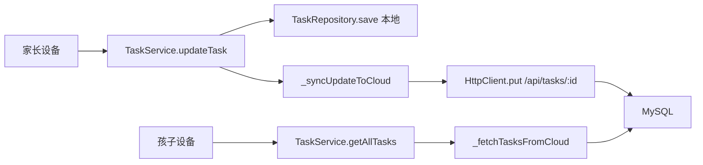

# 里程碑-07：普通任务云端同步 + 分析页用户隔离

> **设计状态**：🔴 待审核
> **创建日期**：2026-03-16
> **设计者**：Claude Code
> **审核者**：项目维护者
> **预计工期**：1周

---

## 📋 目录

- [需求分析](#需求分析)
- [技术方案](#技术方案)
- [代码结构](#代码结构)
- [实施步骤](#实施步骤)
- [测试方案](#测试方案)
- [风险评估](#风险评估)
- [替代方案](#替代方案)

---

## 需求分析

### 功能描述

M06 完成了家庭账户和数据隔离，但留下两个已知限制：

1. **跨设备同步缺口**：任务的「创建」已有云端双写，但「编辑」「删除」「完成/重置打卡」三个操作仍只写本地，家长和孩子在各自设备上的操作互不可见。
2. **分析页数据隔离缺失**：分析页内部组件调用 `getAllTasks()` 时未传 `userId`，导致多用户家庭下数据混淆，目前全局禁用该入口（首页显示"分析功能即将上线"）。

本里程碑修复这两个问题，使多设备家庭的**普通（非重复）任务**可以正常协作，分析页可以重新开放。

> **范围说明**：重复任务的后续实例（由 `_generateRepeatTasks` 本地生成）不在本里程碑同步范围内，这是 M06 延续的存量限制（见已知限制）。

### 业务价值

- **用户价值**：家长和孩子的操作（打卡、删除、编辑）在对方设备**重新进入首页后**可见（最终一致），实现家庭协作；不要求当前页停留时实时刷新（无 WebSocket）
- **技术价值**：补齐任务 CRUD 的双写闭环，架构完整性提升
- **业务价值**：分析页重新上线，家长可查看家庭所有孩子的任务完成数据，孩子可查看自己的数据（星星趋势图展示本设备本地数据，跨设备准确性等 M09）

### 功能范围

**包含**：
- ✅ 后端新增任务更新 API（`PUT /api/tasks/:taskId`）
- ✅ 后端新增任务删除 API（`DELETE /api/tasks/:taskId`）
- ✅ 后端新增任务状态变更 API（`PATCH /api/tasks/:taskId/status`）
- ✅ 前端 `updateTask` 增加云端同步
- ✅ 前端 `deleteTask` 增加云端同步
- ✅ 前端 `updateTaskStatus`（complete）增加云端同步
- ✅ 前端 `resetTask` 增加云端同步（`resetTask` 有独立的锁定校验和扣星逻辑，不经过 `updateTaskStatus`，需单独挂载同步调用）
- ✅ 后端 `GET /api/tasks?scope=family` 支持家长获取家庭所有孩子的任务聚合数据
- ✅ 分析页按角色决定数据范围：家长调用新增的 `getTasksByScope({ scope: 'family' })`，孩子调用 `getTasksByScope({ userId: childId })`；`getAllTasks(userId)` 签名不变，现有调用方不受影响
- ✅ 首页重新开放分析页入口（所有视角均可进入）
- ✅ 分析页星星趋势图加本地数据免责提示（"星星数据仅含本设备记录，完整数据 M09 上线"）

**不包含**（明确的边界）：
- ❌ 星星积分和奖励的云端同步（M09 范围）
- ❌ WebSocket 实时推送（超出当前规模需求；轮询/按需拉取即可）
- ❌ CloudStorageAdapter 正式适配器类（当前 Service 直接调 HttpClient 的模式已满足需求，不做提前抽象）
- ❌ 数据迁移工具（M08 范围）

**已知限制（不阻止上线，后续里程碑解决）**：
- ⚠️ **重复任务实例不上云**：`_generateRepeatTasks` 在本地生成所有重复实例，不调用云端 API；跨设备操作重复实例仍会"找不到任务"。M07 只保证首次创建的单次任务 CRUD 的跨设备同步，这是 M06 延续的存量限制，不在本里程碑修复。
- ⚠️ **云端写失败后下次读取覆盖本地**：云端写同步失败后，下次刷新首页时云端优先读取会用旧数据覆盖本地修改（无补偿队列）。M07 接受此限制，M08 补充冲突解决策略。
- ⚠️ **跨设备 resetTask 显式拒绝（语义保证优先）**：设备 A 完成任务后，PATCH 只同步 `status=1`，云端 `star_awarded` 始终为 false。设备 B 拉取云端任务时得到 `starAwarded=false`；若允许 resetTask 继续，会跳过扣星静默成功，用户看到"取消打卡成功"但星星余额未回退——这是成功语义错误，比明确失败更危险。**M07 实施决策**：`resetTask` 中增加前置检测：`task.status === 1 && !task.starAwarded && task.points > 0 && !task.isRequired` → 判定为跨设备完成（本地无奖励记录）→ 显式返回失败并告知用户，不执行状态回退。对于 `points=0` 或 `isRequired=true` 的任务（完成时本身不奖星），`starAwarded` 同样为 false，但此类任务 reset 不需要扣星，可正常执行。此外，`_fetchTasksFromCloud` upsert 时仍需合并规则防止本设备 `starAwarded=true` 被覆盖。根本原因：星星数据未跨设备同步，M09 解决后开放跨设备 reset。
- ⚠️ **星星趋势图数据**：星星记录来自设备本地 `StarService`，跨设备的星星同步要等 M09。
- ⚠️ **双设备同时编辑冲突**：后同步的操作覆盖先同步的，无冲突解决机制，当前接受此限制。

### 优先级

- **优先级**：P0
- **理由**：M06 明确标注"M7 解决"的遗留缺陷，影响家庭协作的核心体验

---

## 技术方案

### 方案概述

**后端**：在现有 `backend/routes/tasks.js` 和 `backend/controllers/taskController.js` 中新增三个端点（UPDATE / DELETE / STATUS），沿用现有鉴权中间件和角色校验模式。

**前端**：在 `task-service.js` 的 `updateTask`、`deleteTask`、`updateTaskStatus` 三个方法末尾，参照已有的 `createTask` 中 `_syncTaskToCloud` 的双写模式，各加一个"异步同步到云端、失败不影响本地"的保护性调用。

**分析页**：首页分析入口全面开放（无需传参）。`analysis.js` 只读 `loginUser.role` 做一次判断：家长设备（`loginUser.role === 'parent'`）始终传 `{ scope: 'family' }`，看全家孩子汇总；孩子设备（`loginUser.role === 'child'`）传 `{ userId: loginUser.id }`，只看自己。分析页不跟随首页的 currentUser 视角切换，`getAllTasks(userId: string)` 签名保持不变。

### 技术选型

| 技术点 | 选择方案 | 替代方案 | 选择理由 |
|--------|---------|---------|---------|
| 云端同步模式 | 双写（本地优先 + 异步云端）| 云端主导 | 保持现有模式一致，离线可用 |
| 失败处理 | 静默降级（warn log，不阻断主流程）| 抛异常 | 本地操作已成功，网络失败不应影响用户当次操作 |
| 数据隔离传参 | 直接传 `userId` 参数 | 全局 context | 最小改动，与现有接口签名一致 |

### DDD分层设计

**服务层（services/）**：
- [x] 修改服务：`task-service.js`
  - `updateTask`：成功保存本地后，新增 `_syncUpdateToCloud(updatedTask)` 调用
  - `deleteTask`：成功删除本地后，新增 `_syncDeleteToCloud(taskId)` 调用
  - `updateTaskStatus`：成功更新本地后，新增 `_syncStatusToCloud(taskId, task)` 调用（覆盖 `completeTask`，因为 `completeTask` 直接调用 `updateTaskStatus`）
  - `resetTask`：在方法末尾本地状态更新完成后，**单独**新增 `_syncStatusToCloud(taskId, task)` 调用（`resetTask` 有独立锁定检查和扣星逻辑，不调用 `updateTaskStatus`，必须独立挂载）
  - 新增三个私有方法：`_syncUpdateToCloud`、`_syncDeleteToCloud`、`_syncStatusToCloud`

**适配器层（adapters/）**：
- 无需改动，延用现有 `StorageAdapter` + 直接 `HttpClient` 调用模式

**后端（backend/）**：
- [x] 修改路由：`backend/routes/tasks.js`（新增 PUT / DELETE / PATCH 路由）
- [x] 修改控制器：`backend/controllers/taskController.js`（新增三个处理方法）
- [x] 修改后端服务：`backend/services/taskService.js`（新增 update / softDelete / updateStatus 方法；所有读查询加 `WHERE deleted_at IS NULL`）
- [x] 修改数据模型：`backend/models/Task.js`（新增 `completionTime`、`starAwarded`、`modifyTime`、`deleted_at`、`duration`、`hasNoEndDate`、`tags` 字段；`toJSON()` 和 `fromDB()` 同步更新）
- [x] 新增数据库迁移：`backend/database/migrations/005_alter_tasks_add_fields.sql`（加 `deleted_at`、`completion_time`、`star_awarded`、`modify_time`、`duration`、`has_no_end_date`、`tags` 共7列；现有 001-004 已占用）

**表现层（pages/）**：
- [x] 修改页面：`packageChart/pages/analysis/analysis.js`（传入 userId）
- [x] 修改页面：`pages/index/index.js`（调整分析入口显示策略）
- [x] 修改相关子组件（分析页内调用 taskService 的组件，见代码结构）

### 架构图



### 接口设计

**后端新增 API**：

| 方法 | 路径 | 说明 | 请求体/参数 | 返回 |
|------|------|------|--------|------|
| `PUT` | `/api/tasks/:taskId` | 更新任务内容 | `{ title, description, date, type, startTime, endTime, duration, isAllDay, isRequired, penaltyApplied, points, pointsExpiry, tags, hasNoEndDate, repeat }` （与 `Task.update()` 字段完全对齐，后端按白名单更新，多余字段忽略）| `{ task }` |
| `DELETE` | `/api/tasks/:taskId` | 软删除任务 | 无 | `200 { message }` （不用 204，兼容 HttpClient 只认 200 的实现）|
| `PATCH` | `/api/tasks/:taskId/status` | 更新完成状态 | `{ status }` | `{ task }` |
| `GET` | `/api/tasks?scope=family` | 家长获取家庭所有孩子的任务聚合 | Query: `scope=family`（仅家长角色有效，孩子角色调用返回 403）| `{ tasks, total }` |

**`GET /api/tasks` 完整 Query 参数（正式契约）**：

| 参数 | 类型 | 说明 |
|---|---|---|
| `date` | string (YYYY-MM-DD) | 按单日过滤 |
| `startDate` | string (YYYY-MM-DD) | 日期范围起始，与 `endDate` 配对使用（用于月视图批量拉取） |
| `endDate` | string (YYYY-MM-DD) | 日期范围结束 |
| `status` | number (0/1) | 按完成状态过滤 |
| `scope` | string ('family') | 家长聚合全家孩子任务，孩子角色调用返回 403 |
| `targetUserId` | string | 家长代查单个孩子任务（现有参数，保持不变）|

> `startDate/endDate` 需在后端 `getTasks` controller 中解析并传入 `taskService.getTasksByUser(effectiveUserId, { startDate, endDate, ... })`，同时 `taskService.getTasksByUser` 需支持该过滤条件。

**`GET /api/tasks?scope=family` 实现要点**：
1. 鉴权：`role !== 'parent'` → 403
2. 查询：`familyService.getFamilyMembers(familyId)` 得到成员列表，过滤 `role=child`，对每个 `childId` 调用 `taskService.getTasksByUser(childId, params)`，合并结果
3. 可与 `date`/`startDate`/`endDate`/`status` 等过滤参数组合使用

**错误响应规范**（与现有接口一致）：

```json
{ "success": false, "message": "任务不存在", "error": "TASK_NOT_FOUND" }
```

新增端点错误码：

| 错误码 | 触发场景 |
|--------|---------|
| `TASK_NOT_FOUND` | 任务不存在或已软删除 |
| `PERMISSION_DENIED` | 跨用户/跨家庭无权操作 |
| `INVALID_STATUS` | PATCH 传入的 status 值非法 |

**前端新增私有方法**：

| 方法 | 说明 | 参数 | 说明 |
|------|------|------|------|
| `_syncUpdateToCloud(task)` | 同步更新到云端 | `task` - Task对象 | 失败静默降级 |
| `_syncDeleteToCloud(taskId)` | 同步删除到云端 | `taskId` - 任务ID | 失败静默降级 |
| `_syncStatusToCloud(taskId, task)` | 同步状态变更到云端 | `taskId` - 任务ID；`task` - Task对象（从 task.status/userId/completionTime 等读取字段）| 失败静默降级 |

---

## 代码结构

### 文件变更清单

**后端新增/修改文件**：
- `backend/routes/tasks.js` - 新增 PUT / DELETE / PATCH 路由
- `backend/controllers/taskController.js` - 新增 updateTask / deleteTask / updateTaskStatus 方法；`getTasks` 新增 `scope=family` 分支（家长获取所有孩子任务）
- `backend/services/taskService.js` - 新增 update / delete / updateStatus 数据操作

**前端修改文件**：
- `services/task-service.js` - updateTask / deleteTask / updateTaskStatus / resetTask 各加云端同步；新增 `_syncUpdateToCloud`、`_syncDeleteToCloud`、`_syncStatusToCloud` 三个私有方法；新增 `getTasksByScope(options)` 公共方法供分析页专用（`getAllTasks(userId: string)` 签名不变）；`_fetchTasksFromCloud` 修复：①返回 Task 实例 ②拉取后仅将 `task.userId === loginUserId` 的任务 upsert 回灌本地仓储（其他孩子任务只在内存持有，不写 taskData，防止打穿 M06 隔离）③透传 `params.scope`（不做隐式角色推断）；**扩展 `getTasksByDateRange(startDate, endDate, userId, options)`**：云端模式下调 `_fetchTasksFromCloud(userId, { startDate, endDate, ...options })`，用于 star-calendar 批量拉取月视图任务（当前只走本地仓库，不发 HTTP 请求）
- `utils/api-config.js` - 确认 `TASK_BY_ID` 端点已存在
- `packageChart/pages/analysis/analysis.js` - `onLoad` 只读 `loginUser.role`：parent → `analysisOptions = { scope: 'family' }`（家长始终看全家汇总）；child → `analysisOptions = { userId: loginUser.id }`；写入 `data.analysisOptions` 后传给子组件
- `packageChart/pages/analysis/analysis.wxml` - `<star-calendar>` 和 `<star-trend>` 组件增加 `analysisOptions` 属性绑定（当前两组件无任何 prop 传入）
- `packageChart/components/star-calendar/star-calendar.js` - 接收 `analysisOptions` prop；⚠️ **批量拉取**：月视图初始化时调 `getTasksByDateRange(startDate, endDate, userId, analysisOptions)` 一次性拉取整月任务并缓存，`_calculateEarnedStarsFromTasks` 改为从内存缓存过滤（不再逐日发 HTTP 请求，避免 ~30 次并发请求）；星星记录仍按 `analysisOptions.userId` 过滤
- `packageChart/components/star-trend/star-trend.js` - 接收 `analysisOptions` prop，`calculateHistoricalBalance` 补充 `userId: analysisOptions.userId`（`analytics-service` 签名扩展为 `calculateHistoricalBalance(days, userId = null)`）
- `packageChart/services/analytics-service.js`：
  - **当前分析页实际调用链**：`calculateHistoricalBalance(days)` 扩展为 `(days, userId = null)`，`getAllStarRecords()` → `getStarRecords({ userId })`（`:213`，趋势图路径）
  - `getTaskStarCalendarData()`（`:41`）和 `getTaskCompletionStats()`（`:520`）不在当前 `analysis.wxml` 调用链上，保持代码准确性改造，不影响 M07 分析页隔离的交付
- `pages/index/index.js` - 移除分析入口禁用过滤，全面开放

### 核心代码结构

```javascript
// task-service.js 新增私有方法（参照 _syncTaskToCloud 模式）

async _syncUpdateToCloud(task) {
  if (!this.enableCloudStorage) return;
  try {
    const url = API_CONFIG.ENDPOINTS.TASK_BY_ID.replace('{taskId}', task.id);
    await HttpClient.put(url, { title: task.title, /* ... */ });
    logger.info('TaskService', '任务更新已同步到云端', { taskId: task.id });
  } catch (err) {
    logger.warn('TaskService', '云端更新同步失败（本地已保存）', { taskId: task.id, error: err.message });
  }
}

async _syncDeleteToCloud(taskId) {
  if (!this.enableCloudStorage) return;
  try {
    const url = API_CONFIG.ENDPOINTS.TASK_BY_ID.replace('{taskId}', taskId);
    await HttpClient.delete(url);
    logger.info('TaskService', '任务删除已同步到云端', { taskId });
  } catch (err) {
    logger.warn('TaskService', '云端删除同步失败（本地已删除）', { taskId, error: err.message });
  }
}

async _syncStatusToCloud(taskId, task) {
  if (!this.enableCloudStorage) return;
  try {
    const url = `${API_CONFIG.ENDPOINTS.TASK_BY_ID.replace('{taskId}', taskId)}/status`;
    // 只传 status（0=未完成 / 1=已完成，与前端 TaskStatus 枚举一致）
    // 其余字段由服务端推导：
    // - completionTime：status===1 时服务端取 Date.now()，否则置 null
    // - modifyTime：服务端取 Date.now()
    // - starAwarded：M07 保持原值（积分逻辑在前端，M09 统一设计）
    // - userId：从 JWT 取，不信任 body
    await HttpClient.patch(url, { status: task.status }); // task.status 已是 0/1 数字
    logger.info('TaskService', '任务状态已同步到云端', { taskId, status: task.status });
  } catch (err) {
    logger.warn('TaskService', '云端状态同步失败（本地已更新）', { taskId, error: err.message });
  }
}
```

```javascript
// task-service.js _fetchTasksFromCloud 修复（三处必须同时修复）
// 修复1：返回 Task 实例（analytics-service 调用 task.isCompleted() 不报错）
// 修复2：回灌本地仓储（updateTask/deleteTask/updateTaskStatus/resetTask 先查本地 repo，
//         云端任务不回灌则会报"未找到指定的任务"，这是跨设备操作的阻断缺口）
// 修复3：显式 params.scope='family' 时走家庭聚合，不改变 null userId 的通用语义
// 原因：getAllTasks(null) 被首页、编辑页、统计等多处复用，隐式推断角色会改变全局行为
// 只有 analysis.js 显式传入 { scope: 'family' } 时才走聚合路径
async _fetchTasksFromCloud(userId, params = {}) {
  const loginUserId = this.userService ? this.userService.getLoginUserId() : null;
  const requestParams = { ...params };

  if (userId && loginUserId && userId !== loginUserId) {
    // 指定查别人：传 targetUserId（家长看单个孩子）
    requestParams.targetUserId = userId;
  }
  // params.scope='family' 由调用方显式传入，此处直接透传，不做隐式推断

  const response = await HttpClient.get(API_CONFIG.ENDPOINTS.TASKS, requestParams);
  const tasks = (response?.tasks || []).map(raw => new Task({ ...raw, id: raw.taskId || raw.id }));

  // 回灌本地仓储：仅回灌属于 loginUser 的任务
  // ⚠️ scope=family 拉到的其他孩子任务只在内存持有，不写入 taskData
  //    原因：taskData 无用户分区，写入会打穿 M06 隔离边界
  // ⚠️ 家长代操作孩子任务时，本地 getById 会 miss（孩子任务未批量回灌）
  //    补丁：写操作中 getById 返回 null 时，通过 GET /api/tasks/{taskId} 拉取单条并 upsert
  //    （见"修复B补丁"，只写被操作的特定任务，隔离边界可控）
  const loginUserId = this.userService ? this.userService.getLoginUserId() : null;
  for (const task of tasks) {
    if (loginUserId && task.userId !== loginUserId) continue; // 非本机用户，跳过
    try {
      await this.taskRepository.save(task);
    } catch (err) {
      logger.warn('TaskService', '云端任务回灌本地失败', { taskId: task.id, error: err.message });
    }
  }
  return tasks;
}
```

```javascript
// backend/controllers/taskController.js 新增方法示例
// 鉴权规则：先查任务归属，再判断本人或同家庭家长代操作，不信任 body 里的 userId

async updateTask(req, res) {
  try {
    const { taskId } = req.params;
    const { userId, role, familyId } = req.user;
    const changes = req.body;

    // 步骤1：查出任务（含软删除检查）
    const existing = await taskService.getTaskById(taskId);
    if (!existing) return res.status(404).json(error('任务不存在', 'TASK_NOT_FOUND'));

    // 步骤2：鉴权
    // 业务背景：本系统任务只属于孩子，家长没有自己的任务
    // 规则：孩子操作自己的任务，或家长操作同家庭任意孩子的任务
    const isOwner = existing.userId === userId;
    let isParentProxy = false;
    if (!isOwner && role === 'parent' && familyId) {
      const targetUser = await userService.getUserById(existing.userId);
      // 同家庭即允许；防御性断言 role=child（理论上任务所有者必为孩子）
      isParentProxy = targetUser && targetUser.familyId === familyId && targetUser.role === 'child';
    }
    if (!isOwner && !isParentProxy) {
      return res.status(403).json(error('无权限操作', 'PERMISSION_DENIED'));
    }

    // 步骤3：字段白名单过滤（防止客户端篡改 userId/status 等敏感字段）
    const ALLOWED_FIELDS = [
      'title', 'description', 'date', 'type', 'startTime', 'endTime',
      'duration', 'isAllDay', 'isRequired', 'penaltyApplied',
      'points', 'pointsExpiry', 'tags', 'hasNoEndDate', 'repeat'
    ];
    const safeChanges = {};
    ALLOWED_FIELDS.forEach(field => {
      if (req.body[field] !== undefined) safeChanges[field] = req.body[field];
    });

    // 步骤4：校验（复用现有 Task.validate，isUpdate=true 允许部分字段为空）
    const validation = Task.validate(safeChanges, true);
    if (!validation.valid) {
      return res.status(400).json(error(validation.errors.join('; '), 'INVALID_TASK_DATA'));
    }

    // 步骤5：更新
    const task = await taskService.updateTask(taskId, safeChanges);
    res.json(success({ task: task.toJSON() }, '更新成功'));
  } catch (err) {
    logger.error('更新任务失败', err);
    res.status(500).json(error('更新任务失败'));
  }
}
```

---

## 实施步骤

### 第1步：确认分析页子组件调用点（0.5小时）

- [ ] **任务**：grep 分析页及其子组件中所有 `getAllTasks` / `getTasksByDate` / `getStarRecords` 调用，列出需要传入 `userId` 的位置
- [ ] **验证**：列表完整，无遗漏
- [ ] **依赖**：无

**实施要点**：
1. 搜索 `packageChart/` 目录下所有 `.js` 文件中的 taskService / starService 调用
2. 确认哪些组件已传 userId，哪些未传

---

### 第2步：后端新增三个 Task API（2小时）

- [ ] **任务**：`backend/routes/tasks.js` 新增 PUT / DELETE / PATCH 路由
- [ ] **任务**：`backend/controllers/taskController.js` 新增对应处理方法
- [ ] **任务**：`backend/services/taskService.js` 新增数据操作方法
- [ ] **验证**：使用 curl 或 Postman 验证三个接口正常响应
- [ ] **依赖**：无

**实施要点**：
1. **数据库迁移（先做）**：新建迁移脚本 `005_alter_tasks_add_fields.sql`（001-004 已存在，下一个编号为 005），执行后再上其他代码：
   ```sql
   ALTER TABLE tasks
     ADD COLUMN deleted_at DATETIME NULL DEFAULT NULL,
     ADD COLUMN completion_time BIGINT NULL DEFAULT NULL COMMENT 'epoch ms，与前端Task模型一致',
     ADD COLUMN star_awarded TINYINT(1) NOT NULL DEFAULT 0,
     ADD COLUMN modify_time BIGINT NULL DEFAULT NULL COMMENT 'epoch ms，与前端Task模型一致',
     ADD COLUMN duration INT NULL DEFAULT 0 COMMENT '时长（分钟）',
     ADD COLUMN has_no_end_date TINYINT(1) NOT NULL DEFAULT 0 COMMENT '无截止日期标志',
     ADD COLUMN tags JSON NULL COMMENT '标签数组';
   ```
   > **时间字段契约**：`completion_time` 和 `modify_time` 全链路统一使用 **epoch ms（BIGINT）**。前端 `Task` 模型中 `completionTime = Date.now()`（毫秒数字），`canBeUnchecked()` 做数值比较；若使用 `DATETIME` 则后端回传字符串，数值比较直接失真。`backend/models/Task.js` 的 `fromDB()` 直接读取 BIGINT 数值，无需转换。
2. **读路径全量加过滤**（逐项勾选，防遗漏）：
   - [ ] `getTasksByUser`：WHERE 条件加 `AND deleted_at IS NULL`
   - [ ] `getTaskById`：WHERE 条件加 `AND deleted_at IS NULL`
   - [ ] `countTasks`：WHERE 条件加 `AND deleted_at IS NULL`
   - [ ] 验证方式：迁移完成后在 MySQL 执行 `SELECT * FROM tasks WHERE deleted_at IS NOT NULL LIMIT 10`，确认软删除数据不会出现在上述接口返回中
   - [ ] 回归：运行 `npm run test:integration` 确认现有测试全部通过
3. **写接口统一鉴权规则（PUT / DELETE / PATCH）**：本系统任务只属于孩子，家长没有自己的任务。因此：① `task.userId === req.user.userId`（孩子操作自己的任务）→ 允许；② `req.user.role === 'parent'` 时，查 `task.userId` 对应用户，若该用户 `familyId === req.user.familyId`（同家庭）→ 允许（代码层可额外断言 `role=child` 作防御）；③ 跨家庭用户 → 403。注：tasks 表无 familyId，需通过用户表关联查询任务所有者信息
4. **DELETE 接口（软删除）**：`UPDATE tasks SET deleted_at = NOW() WHERE task_id = ?`，同上归属校验
5. **PATCH status 接口实现**：遵循统一鉴权规则（本人或同家庭孩子任务的家长）。**不**复用 `_resolveTargetUserId`；鉴权依据从 JWT 取，body 中的任何字段均**不作为鉴权依据**。接受字段：只有 `status`（`0` = 未完成 / `1` = 已完成，与前端 `TaskStatus.PENDING/COMPLETED` 一致，后端已有 `![0, 1].includes(status)` 校验）；服务端推导：`completion_time = (status === 1) ? Date.now() : null`、`modify_time = Date.now()`、`star_awarded` 保持原值（M07 积分在前端处理）、`user_id` 不可变
6. **backend/models/Task.js 同步更新**：`fromDB()` 映射新字段，`toJSON()` 输出新字段；确保 `deleted_at` 不对外暴露
7. 错误码与现有接口保持一致

---

### 第3步：前端 task-service 新增云端同步（1.5小时）

- [ ] **任务**：新增 `_syncUpdateToCloud`、`_syncDeleteToCloud`、`_syncStatusToCloud` 三个私有方法
- [ ] **任务**：在 `updateTask` 成功保存本地后调用 `_syncUpdateToCloud`
- [ ] **任务**：在 `deleteTask` 成功删除本地后调用 `_syncDeleteToCloud`
- [ ] **任务**：在 `updateTaskStatus` 成功更新本地后调用 `_syncStatusToCloud`（覆盖 `completeTask` 路径）
- [ ] **任务**：在 `resetTask` 本地状态更新完成后**单独**调用 `_syncStatusToCloud`（`resetTask` 不经过 `updateTaskStatus`）
- [ ] **验证**：开启云端模式（`ENABLE_API=true`），在开发者工具中完成一个任务，查看后端日志确认 PATCH 请求到达
- [ ] **依赖**：第2步完成

**实施要点**：
1. 严格遵循"失败静默降级"原则：云端失败只打 warn 日志（含 taskId），不影响本地操作结果
2. 只有 `this.enableCloudStorage` 为 true 时才调用云端
3. 已有 `TASK_BY_ID` 端点定义在 `api-config.js`，直接复用
4. **积分逻辑**：`updateTaskStatus` 中现有的 `starService.addStars()` / `starService.consumeStarsFromSpecificType()` 直接调用**保持不变**（并非 `starService.completeTask()/resetTask()`，这两个方法不存在），`_syncStatusToCloud` 只负责同步任务状态字段到云端，两者独立不影响
5. **修复 `_fetchTasksFromCloud`（两处必须同时修复）**：
   - **修复A**：返回 Task 实例（当前返回 plain object，`analytics-service` 调用 `task.isCompleted()` 会抛异常）
   - **修复B（阻断缺口）**：拉取云端任务后，对属于 `loginUser` 的任务逐条 `upsert` 回灌本地 `taskRepository`。原因：`updateTask / deleteTask / updateTaskStatus / resetTask` 均先执行 `taskRepository.getById()`，云端任务若未回灌则报"未找到指定的任务"，导致跨设备打卡/编辑/删除全部失败。注意：upsert 会用云端版本覆盖本地版本；若本地有离线编辑未同步成功，再次拉取时本地修改会被覆盖（已知限制，见风险表）。⚠️ **隔离约束**：仅回灌 `task.userId === loginUserId` 的任务；`scope=family` 拉到的其他孩子任务**只在内存中持有，不写入 taskData**，防止打穿 M06 用户隔离边界（`taskData` 存储键无用户分区，`getAllTasks(null)` 降级路径会读整表）。
   - **修复B补丁（家长代操作孩子任务 / 跨设备操作）**：仅回灌 loginUserId 的限制会导致家长设备执行 `updateTask / deleteTask / updateTaskStatus / resetTask` 时，目标任务（属于孩子或来自另一台设备未回灌）在本地 `getById` 返回 null 直接失败。解决方案：在四个写操作方法的 `getById` 返回 null 分支，当 `enableCloudStorage === true` 时，通过 `GET /api/tasks/{taskId}` 拉取单条云端任务（已有端点），upsert 后继续操作。此方案只持久化被操作的特定任务，不批量写入他人数据，隔离边界可控：
     ```javascript
     // task-service.js 写操作本地 miss 补丁（适用于 updateTask / deleteTask / updateTaskStatus）
     // HttpClient 成功时 resolve res.data.data，即 task.toJSON() 本身，无外层 { task: ... } 包装
     let task = await this.taskRepository.getById(taskId);
     if (!task && this.enableCloudStorage) {
       try {
         const url = API_CONFIG.ENDPOINTS.TASK_BY_ID.replace('{taskId}', taskId);
         const raw = await HttpClient.get(url); // raw 就是 task.toJSON() 对象
         if (raw) {
           task = new Task({ ...raw, id: raw.taskId || raw.id });
           await this.taskRepository.save(task); // upsert 单条，不污染整表
         }
       } catch (err) {
         logger.warn('TaskService', '云端按id拉取任务失败', { taskId, error: err.message });
       }
     }
     if (!task) {
       return { success: false, message: '未找到指定的任务' };
     }
     ```
   - **本地收敛（陈旧任务清理）**：当前 upsert 只新增/覆盖，不清理"云端已删、本地仍留"的陈旧任务。M07 接受此限制（清理策略需 tombstone 或 replace-all，属 M08 范围）；但云端读取失败时会回退本地，已删任务可能短暂重现——这是可接受的降级行为，需在 UI 上保证软删除任务不影响正常流程
6. **`resetTask` 跨设备显式拒绝**：跨设备完成的任务 `starAwarded=false`，如允许 reset 会静默成功但不扣星，造成账目错误。M07 的实施方式是在 `resetTask` 中增加前置拦截：
   ```javascript
   // task-service.js resetTask 前置检测（跨设备完成检测）
   // 条件：已完成 + 未奖星 + 有积分 + 非必做 → 说明是其他设备完成的
   if (task.status === TaskStatus.COMPLETED
       && !task.starAwarded
       && task.points > 0
       && !task.isRequired) {
     logger.warn('TaskService', '跨设备取消打卡被拦截', { taskId: task.id });
     return {
       success: false,
       message: '该任务在其他设备完成，暂不支持跨设备取消打卡（M09 上线后开放）',
       crossDeviceLimit: true
     };
   }
   ```
   upsert 仍需合并规则，防止设备 A 自身 `starAwarded=true` 被云端 false 覆盖：
   ```javascript
   // _fetchTasksFromCloud upsert 循环中（star_awarded 合并规则）
   const localTask = await this.taskRepository.getById(cloudTask.id);
   if (localTask?.starAwarded && !cloudTask.starAwarded) {
     cloudTask.starAwarded = true; // 本地已奖励，云端未同步，保留本地值
   }
   await this.taskRepository.save(cloudTask);
   ```

---

### 第4步：分析页按角色决定数据范围（1.5小时）

**数据范围规则（唯一契约）**：

> 分析页不跟随首页的 `currentUser` 视角切换。判断依据**只用 `loginUser.role`**：家长设备始终看全家孩子汇总，孩子设备始终看自己。

| `loginUser.role` | analysisOptions | 显示内容 |
|---|---|---|
| `parent` | `{ scope: 'family' }` | 家庭所有孩子的任务汇总 |
| `child` | `{ userId: loginUser.id }` | 该孩子自己的数据 |

- [ ] **任务**：`analysis.js` 在 `onLoad` 中只读 `loginUser.role`，计算 `analysisOptions`
  ```javascript
  // analysis.js onLoad 示例
  const userService = app.globalData.userService;
  const loginUser = userService.getLoginUser();
  // 分析页不跟随首页视角切换，只看 loginUser 角色
  const analysisOptions = (loginUser?.role === 'parent')
    ? { scope: 'family' }
    : { userId: loginUser?.id };
  this.setData({ analysisOptions });
  ```
- [ ] **任务**：`task-service.js` 新增 `getTasksByScope(options)` 方法（不改动 `getAllTasks`）：`options.scope === 'family'` 时调用 `_fetchTasksFromCloud(null, { scope: 'family' })`（云端）或全量本地任务（本地）；`options.userId` 时委托 `getAllTasks(options.userId)`
- [ ] **任务**：`analysis.wxml` 给 `<star-calendar>` 和 `<star-trend>` 组件增加 `analysisOptions` 属性绑定（两组件当前无任何 prop 传入，这是数据隔离的前置条件）
- [ ] **任务**：`task-service.js` 扩展 `getTasksByDate(date, userId = null, options = {})`，云端模式时将 `options.scope` 透传给 `_fetchTasksFromCloud`（第三参数），使 `scope=family` 可通过此方法传到后端
- [ ] **任务**：`star-calendar.js` 接收 `analysisOptions` prop，三处查询传入对应参数：
  - `getStarRecordsByDateRange(start, end, analysisOptions.userId)` / `getStarRecordsByDate(date, analysisOptions.userId)`（星星按 userId 过滤，家长自己视角传 `undefined` = 全量本地星星）
  - `getTasksByDate(date, analysisOptions.userId || null, analysisOptions)`（任务查询：孩子传 `userId`，家长自己视角传 `scope=family`）
- [ ] **任务**：`star-trend.js` 接收 `analysisOptions` prop，`calculateHistoricalBalance` 调用补充 `userId: analysisOptions.userId`
- [ ] **任务**：`analytics-service.js` `calculateHistoricalBalance(days)` 扩展为 `calculateHistoricalBalance(days, userId = null)`，`getAllStarRecords()` → `getStarRecords({ userId })`（`:213` 趋势图路径，当前分析页实际调用链）
- [ ] **任务**：`star-trend.wxml` 趋势图标题行右侧（或图表上方）加灰色小字免责提示，文案：`"星星数据仅含本设备记录，完整数据 M09 上线"`，字号 `22rpx`，颜色 `#999999`
- [ ] **验证**：家长进入分析页，确认显示所有孩子的任务汇总；切换到孩子账号进入分析页，确认只显示该孩子数据；首页、编辑页等现有功能验证行为不变
- [ ] **依赖**：无（独立于第2/3步）

**实施要点**：
1. `analysis.js` 是**唯一决策源**，角色判断只在 `onLoad` 中做一次；子组件只消费 `analysisOptions`，禁止在组件内部再做 role/scope 独立判断
2. **`getAllTasks(userId: string)` 签名不变**，现有首页/编辑页/统计的调用零修改
3. **当前分析页有两条并行数据链**，均从 `analysisOptions` 取值，无第二套决策逻辑：
   - **star-trend 链**：`star-trend.js` → `analyticsService.calculateHistoricalBalance(days, analysisOptions.userId)` → `starService.getStarRecords({ userId })`（星星数据，按 userId 过滤；家长传 undefined = 全量本地星星）
   - **star-calendar 链**：`star-calendar.js` → 月视图初始化时调 `taskService.getTasksByDateRange(startDate, endDate, userId, analysisOptions)` 一次批量拉取 + 内存缓存，`_calculateEarnedStarsFromTasks` 改为从缓存过滤（⚠️ 原来逐日调 `getTasksByDate` 在云端模式下会产生 ~30 次并发 HTTP 请求，家庭 scope 下更严重）；星星记录仍调 `getStarRecordsByDateRange/ByDate(start, end, analysisOptions.userId)`
4. `getTasksByScope(options)` 供 `analytics-service` 内的 `getTaskStarCalendarData` / `getTaskCompletionStats` 改造使用（代码准确性，不影响当前分析页实际调用链）；`analytics-service` 不做角色判断

5. **新方法 `getTasksByScope` 示例**：
   ```javascript
   // task-service.js 新增（不改 getAllTasks）
   async getTasksByScope(options = {}) {
     if (options.userId) {
       return this.getAllTasks(options.userId);  // 委托现有方法
     }
     if (options.scope === 'family') {
       if (this.enableCloudStorage) {
         return this._fetchTasksFromCloud(null, { scope: 'family' });
       }
       return this.taskRepository.getAll();  // 本地全量
     }
     return this.getAllTasks(null);  // 兜底
   }
   ```
   ```javascript
   // analytics-service.js 修改示例（calculateHistoricalBalance 只用星星记录，不调 getAllTasks）
   async calculateHistoricalBalance(days, userId = null) {
     const starRecords = await this.starService.getStarRecords({ userId });
     // ... 原有统计逻辑不变（已有 getAllStarRecords() → getStarRecords() 路径）
   }
   ```
5. **星星数据说明**：`star-calendar` / `star-trend` 星星记录来自设备本地 `StarService`，家长看到的是本设备记录到的星星数据，跨设备完整同步等 M09

---

### 第5步：首页全面开放分析入口（0.5小时）

- [ ] **任务（入口1 - 菜单）**：`pages/index/index.js:2844` 附近删除 `.filter(item => item.id !== 'study')` 过滤条件，恢复菜单中分析页入口；跳转时**不传任何 userId 参数**（`analysis.js` 内部按角色判断）
- [ ] **任务（入口2 - 进度环）**：`pages/index/index.js:1650` 附近 `onRingTap` 方法，将 toast 改为 `wx.navigateTo` 跳转分析页，**不传 userId 参数**
- [ ] **验证**：家长进入分析页，确认看到所有孩子的汇总数据；孩子进入分析页，确认只看到自己的数据
- [ ] **依赖**：第4步完成

**实施要点**：
1. 分析页的"看谁的数据"由 `analysis.js` 根据角色独立决定，不依赖首页传参，两个入口均无需携带 userId
2. 角色判断逻辑集中在 `analysis.js` 的 `onLoad` 中（见第4步）

---

### 第6步：前端单元测试（1小时）

- [ ] **任务**：`test/services/task-service.test.js` 补充三个云端同步私有方法的测试（success 和 fail 两个分支各一个）
- [ ] **验证**：`npm test` 全部通过，分支覆盖率不低于当前 66%
- [ ] **依赖**：第3步完成

---

### 第7步：后端真实集成测试（1.5小时）⚠️ 准入门槛

> 现有 `task-api.test.js` 是**内存版假实现**，无法覆盖 `deleted_at` 过滤、迁移后字段、权限逻辑。M07 后端改造**必须通过真实集成测试**才能视为完成，否则不允许合并。

- [ ] **任务**：新建 `backend/test/integration/task-api-m07.test.js`（或扩展为真实 DB 实现），覆盖：
  - PUT/DELETE/PATCH 三个新端点的正常路径
  - 软删除后 GET 列表不含已删任务（验证 `deleted_at IS NULL` 生效）
  - 跨家庭无权限返回 403
  - 家长代操作同家庭孩子任务返回 200
  - `completionTime`/`modifyTime` 以 BIGINT 返回（非 DATETIME 字符串）
- [ ] **验证**：`cd backend && npm test` 全部通过（backend 无 `test:backend` 脚本，直接用 `npm test`）
- [ ] **依赖**：第2步完成

---

## 测试方案

### 单元测试

**私有方法（隔离测试）**

| 测试项 | 测试方法 | 预期结果 |
|--------|---------|---------|
| `_syncUpdateToCloud` 成功 | mock HttpClient.put 返回成功 | 调用 PUT 接口，无异常 |
| `_syncUpdateToCloud` 失败 | mock HttpClient.put 抛异常 | 静默降级，不影响返回 |
| `_syncDeleteToCloud` 成功 | mock HttpClient.delete 返回成功 | 调用 DELETE 接口 |
| `_syncDeleteToCloud` 失败 | mock HttpClient.delete 抛异常 | 静默降级 |
| `_syncStatusToCloud` 成功 | mock HttpClient.patch 返回成功 | 调用 PATCH 接口 |
| `_syncStatusToCloud` 失败 | mock HttpClient.patch 抛异常 | 静默降级 |
| `enableCloudStorage=false` | 不 mock HttpClient | 三个方法均不调用 HttpClient |

**公开方法端到端（本地成功 + 云端失败路径）**

| 测试项 | 测试方法 | 预期结果 |
|--------|---------|---------|
| `updateTask` 本地成功但云端失败 | 本地 repo.save 成功 + HttpClient.put 抛异常 | 返回本地操作成功，打 warn 日志，不抛异常 |
| `deleteTask` 本地成功但云端失败 | 本地 repo.delete 成功 + HttpClient.delete 抛异常 | 返回本地操作成功，打 warn 日志，不抛异常 |
| `updateTaskStatus` 本地成功但云端失败 | 本地 repo.save 成功 + HttpClient.patch 抛异常 | 返回本地操作成功，打 warn 日志，不抛异常 |
| `resetTask` 本地成功但云端失败 | 本地锁定检查通过、扣星成功 + HttpClient.patch 抛异常 | 返回本地操作成功，打 warn 日志，不抛异常（`resetTask` 不经过 `updateTaskStatus`，独立验证）|
| `resetTask` 跨设备完成被显式拒绝 | mock 任务 `status=1, starAwarded=false, points=5, isRequired=false` | 返回 `{ success: false, crossDeviceLimit: true }`，不修改任务状态，不发 PATCH 请求 |
| `resetTask` 跨设备拒绝不影响零积分任务 | mock 任务 `status=1, starAwarded=false, points=0, isRequired=false` | 跳过拒绝分支，正常执行 reset |
| `resetTask` 跨设备拒绝不影响必做任务 | mock 任务 `status=1, starAwarded=false, points=5, isRequired=true` | 跳过拒绝分支，正常执行 reset（必做任务完成不奖星，reset 无需扣星）|

**云端读取契约（防止 plain object 回归）**

| 测试项 | 测试方法 | 预期结果 |
|--------|---------|---------|
| `_fetchTasksFromCloud` 返回 Task 实例 | mock HttpClient.get 返回含 `taskId` 的 raw 对象数组 | 每个元素均为 `Task` 实例，`task.isCompleted()` 可正常调用，不抛异常 |
| `_fetchTasksFromCloud` 字段映射正确 | mock 返回含 `taskId` 字段的 raw 对象 | 返回实例的 `id` 字段等于 raw 的 `taskId` |

### 后端集成测试

> ⚠️ **重要**：现有 `backend/test/integration/task-api.test.js` 是**内存版假实现**（文件首行注释明写"内存版"），使用内存 store 而非真实 controller/service/SQL，无法覆盖 `deleted_at` 过滤、权限校验和迁移后的查询条件。
>
> M07 后端改造（软删除、新字段、三个新端点）**必须新建真实集成测试**或在现有文件中替换为真实 DB 实现，否则测试通过不代表实际逻辑正确。

**需新增/扩展的测试用例（需接真实 service + SQL）**：

| 测试项 | 测试方法 | 预期结果 |
|--------|---------|---------|
| PUT 任务（有权限） | 发起 PUT `/api/tasks/:id`，任务属于该用户 | 200，返回更新后任务 |
| PUT 任务（跨用户无权限） | 发起 PUT，任务属于其他家庭 | 403 |
| DELETE 任务（软删除） | 发起 DELETE，再 GET 该任务 | 200+`{message}`；GET 返回 404 |
| DELETE 后列表不可见 | 软删除后 GET 任务列表 | 列表中不含该任务（SQL `deleted_at IS NULL` 生效）|
| PATCH status（完成） | 只传 `{ status: 1 }`，验证返回 task 中 completionTime 非空 | 200，completionTime 由服务端生成 |
| PATCH status（家长代操作孩子） | 家长 token 操作孩子任务 | 200 |
| PATCH status（无权限） | 非家庭成员 token | 403 |

**分析页角色判定 + userId/scope 透传（前端单元/服务测试）**

| 测试层 | 测试项 | 测试方法 | 预期结果 |
|--------|--------|---------|---------|
| analysis.js 角色判定 | 家长设备 → `scope=family` | mock `loginUser.role=parent`，调用 `analysis.js` 的 `getAnalysisOptions()` 辅助函数 | 返回 `{ scope: 'family' }` |
| analysis.js 角色判定 | 孩子设备 → `userId=loginUser.id` | mock `loginUser.role=child`、`loginUser.id='child1'` | 返回 `{ userId: 'child1' }` |
| task-service scope 透传 | 家长传 `scope=family` → 云端请求携带 | mock enableCloudStorage，调用 `getTasksByScope({ scope: 'family' })` | `_fetchTasksFromCloud` 收到 `params.scope='family'` |
| task-service scope 透传 | 孩子传 `userId` → 走 `getAllTasks` | mock `loginUser.role=child`，调用 `getTasksByScope({ userId: 'child2' })` | `getAllTasks('child2')` 被调用 |
| task-service date scope 透传 | 家长视角 `getTasksByDate` 透传 scope | 调用 `getTasksByDate(date, null, { scope: 'family' })` | `_fetchTasksFromCloud` 收到 `params.scope='family'` 和 `params.date` |

### 前端集成测试（场景）

- [ ] 场景1：家长完成任务 → 孩子设备重新拉取 → 任务状态一致
- [ ] 场景2：家长删除任务 → 孩子设备重新拉取 → 任务消失
- [ ] 场景3：网络断开 → 操作本地成功 → 网络恢复后手动刷新 → 云端优先读取覆盖（⚠️ 本地写失败的操作不会自动重放，见已知限制）
- [ ] 场景4：analytics-service 从云端拉取任务后调用 `task.isCompleted()` 不报错

### 手动测试

1. **任务同步**：
   - [ ] 两台设备登录同一家庭，设备A完成任务，设备B重进首页，确认任务已标记完成
   - [ ] 设备A删除任务，设备B重进首页，确认任务消失
   - [ ] 设备A编辑任务标题，设备B重进确认标题更新

2. **分析页**：
   - [ ] 家长账号进入分析页，确认看到家庭所有孩子的任务汇总数据（而非家长自己的空数据）
   - [ ] 孩子账号进入分析页，确认只看到该孩子自己的任务数据
   - [ ] 家长账号通过菜单入口和进度环两个路径均可正常进入分析页

3. **并发冲突场景**（手动验证，验证降级行为符合预期）：

   | 场景 | 操作步骤 | 预期结果 |
   |------|---------|---------|
   | 两设备同时编辑同一任务 | 设备A改标题，设备B改描述，先后同步 | 后同步的数据覆盖先同步的，无报错 |
   | 一设备编辑时另一设备已删除 | 设备B删除任务后，设备A再同步编辑 | 设备A云端同步返回404，前端静默 warn 日志；若下次刷新前云端同步未成功，A设备再次进入首页时云端旧状态（已删）将覆盖本地 |

4. **回归测试**：
   - [ ] 无网络时完成任务，提示本地操作成功（不报错）
   - [ ] 现有任务创建功能正常

---

## 风险评估

### 技术风险

| 风险项 | 影响 | 概率 | 应对措施 |
|--------|------|------|---------|
| 云端写失败后下次读取覆盖本地 | 高 | 中 | **已知限制**：读路径云端优先（`getAllTasks` 先拉云端），云端写同步失败后本地修改会在下次刷新时被云端旧数据覆盖。M07 接受此限制，无补偿队列；M08 补充冲突解决策略 |
| `_fetchTasksFromCloud` upsert 覆盖本地离线修改 | 中 | 低 | **已知限制**：回灌时用云端版本 upsert 本地，若设备在离线状态编辑了任务且云端写失败，下次拉取时本地修改被覆盖。与上条同根因，M08 补充冲突解决策略 |
| `scope=family` 任务写入主 taskData 破坏 M06 隔离 | 高 | 已修复 | `_fetchTasksFromCloud` 回灌时只写 `loginUserId` 自己的任务；其他孩子任务只在内存持有 |
| star-calendar 月视图 ~30 次并发 HTTP 请求 | 中 | 已修复 | 月视图初始化改为 `getTasksByDateRange` 批量拉取，`_calculateEarnedStarsFromTasks` 从内存过滤；`getTasksByDateRange` 需扩展云端支持 |
| 云端删除成功但本地删除失败（顺序问题）| 高 | 低 | 先删本地，再同步云端；云端失败打 warn 日志（含 taskId）便于排查 |
| PATCH status 接口与积分逻辑解耦 | 中 | 中 | PATCH body 只接受 `status`；服务端自行推导 completionTime / modifyTime，不触发积分；前端积分链路（`starService.addStars()` / `consumeStarsFromSpecificType()`）保持不变，与云端同步独立 |
| 分析页子组件接口改动遗漏 | 中 | 中 | 文件变更清单已逐一列出受影响组件，按清单逐项实施 |
| 软删除读路径遗漏导致已删任务仍可见 | 中 | 中 | 迁移后全量检索所有 SELECT 语句，逐一加 `deleted_at IS NULL` 并跑回归测试 |
| 分析入口全面开放后用户看到错误数据 | 低 | 低 | userId 已正确传入，数据隔离由服务层保证 |
| 星星趋势图跨设备数据不完整 | 低 | 高（已知）| 已在功能范围中说明；M07 只过滤本设备星星，跨设备同步等 M09 |
| **resetTask 跨设备操作被显式拒绝** | 中 | 已处理 | 云端 `star_awarded` 始终为 false；若允许 reset 会静默成功但不扣星（成功语义错误）。M07 决策：`resetTask` 前置检测 `status=1 && !starAwarded && points>0 && !isRequired` → 显式返回失败并提示用户；`points=0` 或必做任务不受影响。upsert 加合并规则保留本地 `starAwarded=true`。M09 星星同步上线后开放跨设备 reset |

### 业务风险

| 风险项 | 影响 | 概率 | 应对措施 |
|--------|------|------|---------|
| 并发冲突：两台设备同时编辑同一任务 | 中 | 中 | 后同步的覆盖先同步的，当前接受此限制；M08 数据迁移时补充冲突解决策略 |
| 并发冲突：两台设备同时删除同一任务 | 低 | 低 | 第二次删除请求后端返回 404，前端静默忽略 |
| 并发冲突：一台编辑时另一台删除该任务 | 中 | 低 | 编辑同步到云端时后端返回 404，前端打 warn 日志；云端优先读路径下，A设备下次刷新时本地编辑结果会被云端删除状态覆盖（已知限制，见上方风险表） |
| 离线操作和云端不一致暂无解决方案 | 中 | 中 | 当前接受此限制，M08 数据迁移后可补充冲突解决策略 |

---

## 替代方案

### 方案A：当前方案（双写，本地优先，云端静默同步）

**优势**：
- ✅ 与现有 createTask 模式完全一致，代码风格统一
- ✅ 离线可用，网络失败不影响用户操作
- ✅ 改动最小，风险低

**劣势**：
- ❌ 无冲突解决机制（两台设备同时编辑同一任务，后同步的覆盖先同步的）
- ❌ 非实时（需要手动刷新才能看到对方的更新）

---

### 方案B：云端主导（先写云端，成功后写本地）

**描述**：所有写操作先发云端请求，成功后更新本地，失败则回滚本地。

**优势**：
- ✅ 数据一致性更强

**劣势**：
- ❌ 离线不可用
- ❌ 操作延迟增加（等待网络响应）
- ❌ 与现有 createTask 模式不一致

**未选择原因**：离线可用性是核心需求，且当前用户规模（家庭内2-5人）无强一致需求。

---

### 方案C：引入 CloudStorageAdapter 适配器类

**描述**：新建 `adapters/cloud-storage-adapter.js`，将所有 HttpClient 调用封装为与 StorageAdapter 相同接口，Repository 层按 flag 选择本地或云端 Adapter。

**优势**：
- ✅ 架构更符合 DDD 适配器层职责
- ✅ 未来扩展更方便

**劣势**：
- ❌ 需要改动所有 Repository 接口，改动量远大于当前需求
- ❌ Repository 和 StorageAdapter 目前是一对一关系，引入新 Adapter 需要重新设计 Repository 的依赖注入
- ❌ 当前规模下 YAGNI（You Aren't Gonna Need It）

**未选择原因**：改动成本过高，当前 Service 层直接调用 HttpClient 的模式已满足需求，待未来扩展到 StarService / RewardService 云端同步时再评估是否值得引入。

---

## 审核记录

### 审核要点

- [ ] **符合DDD架构**：是否遵循 DDD 分层原则
- [ ] **技术方案合理**：双写策略是否合适
- [ ] **实施步骤清晰**：6步是否可独立执行
- [ ] **风险评估充分**：离线冲突风险是否可接受
- [ ] **测试方案完整**：是否覆盖云端失败降级场景
- [ ] **后端真实集成测试**：第7步测试是否全部通过（准入门槛，不通过不允许合并）

### 审核意见

**审核者**：项目维护者
**审核日期**：—
**审核结果**：🔴 待审核

**已确认的设计决策**（独立于整体审核结果）：
1. **分析页开放策略**：✅ 所有视角均可进入分析页。数据范围**只看 `loginUser.role`**：家长设备始终传 `{ scope: 'family' }` 显示全家孩子汇总，孩子设备传 `{ userId: loginUser.id }` 只看自己。分析页不跟随首页 `currentUser` 视角切换。`getAllTasks(userId: string)` 签名保持不变。
2. **后端 DELETE 接口**：✅ 软删除（在数据库中标记 `deleted_at` 字段，不物理删除数据）。
3. **PATCH status 接口积分**：✅ 后端 M07 不处理积分，积分逻辑保留在前端；等 M09 星星云端 API 上线时统一设计。

---

**最后更新**：2026-03-16
