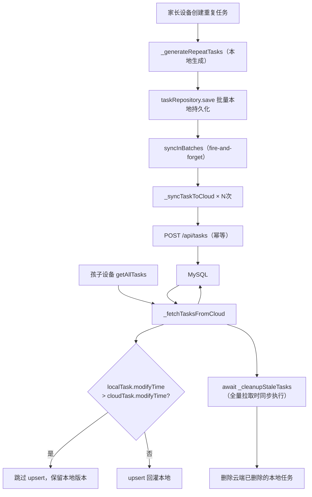

# 里程碑-08：云端同步完善

> **设计状态**：✅ 已完成
> **创建日期**：2026-03-19
> **设计者**：Claude Code
> **审核者**：项目维护者
> **预计工期**：1周

---

## 📋 目录

- [需求分析](#需求分析)
- [技术方案](#技术方案)
- [代码结构](#代码结构)
- [实施步骤](#实施步骤)
- [测试方案](#测试方案)
- [风险评估](#风险评估)
- [替代方案](#替代方案)

---

## 需求分析

### 功能描述

M07 完成了普通（非重复）任务 CRUD 的双写闭环，但遗留了三个限制：

1. **重复任务实例不上云**：`_generateRepeatTasks` 在本地生成所有重复实例时未调用 `_syncTaskToCloud`，导致重复任务在其他设备完全不可见，家庭协作体验缺失。

2. **云端写失败后本地修改被覆盖**：`_fetchTasksFromCloud` 的 upsert 目前只保护 `starAwarded` 字段，当用户在网络不稳定时修改任务后，下次 `getAllTasks` 拉取会用云端旧数据覆盖本地新数据（标题、时间等字段均受影响）。

3. **云端软删除的任务在本地仍然存在**：设备 A 删除任务后，设备 B 的本地仓储中仍有该任务，`getAllTasks` 拉取云端数据时没有清理机制，已删任务会在设备 B 持续显示。

本里程碑修复以上三个问题，使同步链路完整可靠，为 M09（星星积分云端同步）奠定基础。

### 业务价值

- **用户价值**：重复任务跨设备可见，家庭成员操作结果不再互相覆盖，已删任务不再"复活"
- **技术价值**：补齐 M07 同步链路的可靠性缺口，data consistency 从"尽力而为"提升至"本地最新优先"
- **业务价值**：M09 依赖稳定的任务同步基础，此里程碑解锁后续里程碑进展

### 功能范围

**包含**：
- ✅ 重复任务实例生成时批量同步到云端（幂等写入，避免重复调用产生重复记录）
- ✅ 冲突解决：`_fetchTasksFromCloud` upsert 时基于 `modifyTime` 全字段保护本地最新版本
- ✅ 陈旧任务清理：全量拉取成功后，删除云端已不存在的本地任务

**不包含**（明确的边界）：
- ❌ 星星积分、奖励的云端同步（M09 范围）
- ❌ WebSocket 实时推送（超出当前规模需求）
- ❌ 重复任务的编辑/删除跨设备同步（重复任务创建后，单条实例的操作复用 M07 双写链路；M08 只解决初始批量创建同步）
- ❌ 离线写失败的重试队列（当前接受此限制，`modifyTime` 保护已防止覆盖）

### 优先级

- **优先级**：P1
- **理由**：重复任务是用户核心功能（学习/习惯类任务绝大多数为重复任务），不上云导致家庭协作严重受损；另外两项是 M07 明确标注的遗留限制，M09 前必须解决

---

## 技术方案

### 方案概述

**前置任务A（parentTaskId 云端支持）**：在 `_syncTaskToCloud` payload 中补充 `parentTaskId` 字段，后端 `Task` 模型和 `tasks` 表新增 `parent_task_id` 列（新增迁移文件）。这是重复任务同步的必要前提——若不携带该字段，device B 从云端拿到的实例没有父子关系，无法正确渲染重复任务，且后续 upsert 会把本地 `parentTaskId` 字段覆盖为空。

**前置任务B（syncedToCloud 本地标记）**：在前端 `Task` 模型新增 `syncedToCloud` 布尔字段（默认 false）。当 `_syncTaskToCloud` 成功时，将对应任务的本地副本更新为 `syncedToCloud = true`。这个标记用于区分"从未上云的本地任务（应保留）"和"曾成功上云、现不在云端的任务（可清理）"，是陈旧任务清理安全性的唯一保障。

**任务1（重复任务批量同步）**：在 `_generateRepeatTasks` 创建本地实例完成后，用内联 `syncInBatches` async 函数（`Promise.allSettled` + `setTimeout` 分批）调用 `_syncTaskToCloud`，控制并发（batchSize:10, delay:100ms）。同步成功的实例立即 `saveAll` 更新本地 `syncedToCloud = true`；失败的实例保留本地但不标记，不阻断主流程。后端 `createTask` 增加幂等检查并补写 `modify_time`。

**任务2（modifyTime 冲突保护）**：扩展 `_fetchTasksFromCloud` 的 upsert 循环：当 `localTask.modifyTime > cloudTask.modifyTime` 时，跳过该任务的 upsert，保留本地最新版本（同时修正返回对象）。**保持 saveAll 批量写入**，不退化为逐条 save。

**任务3（陈旧任务清理）**：在 `_fetchTasksFromCloud` 全量拉取成功后（无日期过滤），只清理 `syncedToCloud === true` 且不在云端的本地任务。清理操作在 `_fetchTasksFromCloud` 内部 **await 同步执行**，确保陈旧任务在 `getAllTasks` 做 localOnly 合并前已删除。

### 技术选型

| 技术点 | 选择方案 | 替代方案 | 选择理由 |
|--------|---------|---------|---------|
| 重复任务父子关系跨设备保持 | 后端新增 `parent_task_id` 列 + sync payload 携带 | 不同步，依赖设备自生成 | 不同步则 upsert 会覆盖本地 parentTaskId 为空，破坏设备B的UI逻辑 |
| 清理安全性标记 | 本地 `syncedToCloud` 标记（sync 成功后置 true） | parentTaskId 类型区分 / tombstone API | parentTaskId 无法区分普通任务 sync 失败场景；tombstone API 需新增后端接口 |
| 重复任务批量云端写入 | 内联 `syncInBatches` + 现有 `_syncTaskToCloud` | 新建批量 POST API / batchUtils | 复用现有 `_syncTaskToCloud`；batchUtils 返回 undefined 且默认触发 wx.showLoading |
| 批量同步幂等保证 | 后端 createTask 增加 task_id 重复检查 | 前端 cloudId 记录跳过已同步 | 后端幂等更可靠，不依赖本地状态 |
| 冲突解决策略 | modifyTime last-write-wins | 向量时钟 / 三路合并 | 项目规模小（家庭2-5人），简单策略足够 |
| 陈旧任务清理 | `syncedToCloud=true` 且不在云端时删除 | tombstone API / parentTaskId 类型区分 | 统一覆盖所有任务类型（普通+重复）；无需新后端接口 |

### DDD分层设计

**领域层（models/）**：
- [x] 修改前端模型：`models/task.js`
  - `Task` 构造函数新增 `syncedToCloud = false` 字段（本地标记，不上云）

**服务层（services/）**：
- [x] 修改服务：`task-service.js`
  - `createTask`：`_syncTaskToCloud` 成功后更新本地任务 `syncedToCloud = true`
  - `_generateRepeatTasks`：末尾追加批量云端同步逻辑；同步成功的实例 `saveAll` 更新 `syncedToCloud = true`
  - `_fetchTasksFromCloud`：upsert 循环改为收集 `tasksToSaveToLocal` 数组，循环后统一 `saveAll`（保持现有批量写入优化）；modifyTime 保护时 `Object.assign` 修正返回对象；全量拉取时调用 `_cleanupStaleTasks`
  - 新增私有方法：`_cleanupStaleTasks(cloudTaskIds, loginUserId)`

**后端（backend/）**：
- [x] 修改后端服务：`backend/services/taskService.js`
  - `createTask`：增加幂等检查、归属校验、补写 `modify_time`、软删除恢复覆盖
  - 新增 `parent_task_id` 字段支持（INSERT 和 SELECT 均包含）
- [x] 修改后端控制器：`backend/controllers/taskController.js`
  - `createTask` catch 块新增 `TASK_ID_USER_MISMATCH` targeted catch，返回 409
- [x] 修改后端模型：`backend/models/Task.js`
  - 新增 `parentTaskId` 字段
- [x] 新增数据库迁移：`backend/database/migrations/006_alter_tasks_add_parent_task_id.sql`
  - `ALTER TABLE tasks ADD COLUMN parent_task_id VARCHAR(100) DEFAULT NULL`
- [x] 修改 `_syncTaskToCloud` payload：新增 `parentTaskId` 字段

**仓储层（repositories/）**：
- [x] 修改仓储：`repositories/task-repository.js`
  - 新增方法：`getByUserId(userId)`，返回指定用户的全部任务（`_cleanupStaleTasks` 使用）

**表现层（pages/）**：无需改动

### 架构图



### 接口设计

**后端 `POST /api/tasks` 幂等升级**（不增加新路由，修改已有行为）：

| 场景 | 原行为 | 新行为 |
|------|--------|--------|
| `taskId` 未提供或云端不存在 | 正常创建 | 不变 |
| `taskId` 已存在且 `user_id` 不匹配 | 可能报主键冲突或返回他人数据 | 拒绝：service 抛出 `TASK_ID_USER_MISMATCH`，controller 捕获后返回 **409 CONFLICT** |
| `taskId` 已存在且未删除 | 可能报主键冲突 | 幂等：直接返回已有任务（200 + task） |
| `taskId` 已存在但已软删除 | 可能报冲突 | 恢复并覆盖：清除 `deleted_at`，重置 `status=0/completion_time=NULL/star_awarded=0`，写入新请求业务字段，返回 200 + task |

**前端新增私有方法**：

| 方法 | 说明 | 参数 | 说明 |
|------|------|------|------|
| `_cleanupStaleTasks(cloudTaskIds, loginUserId)` | 清理云端已不存在的本地任务 | `cloudTaskIds` - Set\<string\>；`loginUserId` - 当前登录用户 ID | **须 await**（在 localOnly 合并前完成删除），失败 catch 静默 warn |

---

## 代码结构

### 文件变更清单

**前端修改文件**：
- `models/task.js`：`Task` 构造函数新增 `syncedToCloud = false` 字段
- `services/task-service.js`
  - `createTask`：`_syncTaskToCloud` 成功后保存 `syncedToCloud = true`
  - `_generateRepeatTasks`：批量同步成功后 `saveAll` 更新 `syncedToCloud = true`
  - `_fetchTasksFromCloud`：upsert 循环改为 `saveAll` 批量写；modifyTime 保护时修正返回对象；全量模式下 `await _cleanupStaleTasks`
  - 新增 `_cleanupStaleTasks` 私有方法（基于 `syncedToCloud` 标记）
- `repositories/task-repository.js`：新增 `getByUserId(userId)` 方法

**后端修改文件**：
- `backend/database/migrations/006_alter_tasks_add_parent_task_id.sql`：新增迁移文件
- `backend/database/test-setup-fixed.sql`：`tasks` 表定义补充 `parent_task_id VARCHAR(100) DEFAULT NULL` 列（测试环境直接使用此 schema 快照，不走 migration）
- `backend/database/test-setup-modern.sql`：同上，`tasks` 表补充 `parent_task_id` 列
- `backend/models/Task.js`：新增 `parentTaskId` 字段
- `backend/services/taskService.js`：`createTask` 增加幂等检查、归属校验、补写 `modify_time`、`parent_task_id` 写入；软删除恢复覆盖
- `backend/controllers/taskController.js`：`createTask` catch 块新增 `TASK_ID_USER_MISMATCH` targeted catch，返回 409
- `services/task-service.js`（前端）`_syncTaskToCloud`：payload 补充 `parentTaskId`

### 核心代码结构

```javascript
// task-service.js _generateRepeatTasks 末尾追加（批量云端同步）
// 位于 return repeatTasks 前
//
// ⚠️ 注意：不使用 batchUtils.batchProcess，原因：
//   1. batchUtils.batchProcess 返回 undefined（非 Promise），不能 .catch()
//   2. batchUtils 内部用 forEach 而非 await，async processFn 的错误会被吞掉
//   3. showProgress 默认 true，会调用 wx.showLoading 影响后台同步 UX
// 改用内联的 async 分批函数，保持 Promise 语义完整。

if (this.enableCloudStorage && repeatTasks.length > 0) {
  const tasksToSync = [...repeatTasks];
  const batchSize = 10;
  const delay = 100;

  const syncInBatches = async () => {
    for (let i = 0; i < tasksToSync.length; i += batchSize) {
      const batch = tasksToSync.slice(i, i + batchSize);
      // 并行处理当前批，每个失败独立捕获，不影响其他批
      const results = await Promise.allSettled(
        batch.map(task => this._syncTaskToCloud(task))
      );

      // 同步成功的实例：标记 syncedToCloud = true 并批量落盘
      // 这是陈旧任务清理能安全区分"未上云"和"已上云后被删"的唯一依据
      const syncedTasks = [];
      results.forEach((result, idx) => {
        if (result.status === 'fulfilled') {
          batch[idx].syncedToCloud = true;
          syncedTasks.push(batch[idx]);
        } else {
          logger.warn('TaskService', '重复任务实例云端同步失败', {
            taskId: batch[idx].id,
            error: result.reason?.message,
          });
        }
      });
      if (syncedTasks.length > 0) {
        await this.taskRepository.saveAll(syncedTasks).catch(err => {
          logger.warn('TaskService', '更新 syncedToCloud 标记失败', { error: err.message });
        });
      }

      if (i + batchSize < tasksToSync.length) {
        await new Promise(resolve => setTimeout(resolve, delay));
      }
    }
  };

  // fire-and-forget：不 await，失败不影响本地创建结果
  syncInBatches().catch(err => {
    logger.warn('TaskService', '重复任务批量同步异常', { error: err.message });
  });
}
```

```javascript
// task-service.js _fetchTasksFromCloud upsert 循环扩展（modifyTime 保护 + saveAll 批量写）
// 替换现有的 forEach 合并逻辑 + saveAll，保持 1次读+1次写 的批量写优化
//
// ⚠️ 关键1（modifyTime 保护）：ownTasks 是 tasks 数组的同一批对象引用。
//   当本地版本更新时，必须用 Object.assign 把本地字段复制到 cloudTask，
//   才能让本次返回给页面的数组也是最新版本。仅跳过 save 不够。
//
// ⚠️ 关键2（saveAll 批量写）：不能在循环内逐条 await taskRepository.save()。
//   save() 每次调用都 getAll+saveData（N次读N次写）；
//   saveAll() 一次 getAll+saveData（1次读1次写）。
//   需收集 tasksToSaveToLocal，循环后统一 saveAll。

const tasksToSaveToLocal = [];

for (const cloudTask of ownTasks) {
  const localTask = localTaskMap[cloudTask.id];

  // starAwarded 保护（M07 已有）：本地已奖励，云端未同步，保留本地值
  if (localTask?.starAwarded && !cloudTask.starAwarded) {
    cloudTask.starAwarded = true;
  }

  // modifyTime 保护（M08 新增）：本地修改时间更新时，跳过云端覆盖
  //
  // ⚠️ 不能假设 cloudTask.modifyTime 非 null：
  //   M07 的 createTask INSERT 不写 modify_time，导致所有 M07 存量云端任务 modifyTime=null。
  //   修复：将 null 视为 0，若本地有明确的 modifyTime 则本地优先。
  //   M08 Step2 补写 createTask 的 modify_time，此后新任务不再受此影响。
  if (localTask && localTask.modifyTime && localTask.modifyTime > (cloudTask.modifyTime || 0)) {
    logger.info('TaskService', '本地修改更新，用本地版本覆盖返回对象', {
      taskId: cloudTask.id,
      localModifyTime: localTask.modifyTime,
      cloudModifyTime: cloudTask.modifyTime,
    });
    // 将本地最新字段复制到 cloudTask（同一引用 → 同时修正 tasks 数组里的对象）
    // 只覆盖业务字段，保留 id/userId 等标识字段不变
    Object.assign(cloudTask, {
      title: localTask.title,
      description: localTask.description,
      date: localTask.date,
      type: localTask.type,
      startTime: localTask.startTime,
      endTime: localTask.endTime,
      points: localTask.points,
      pointsExpiry: localTask.pointsExpiry,
      isRequired: localTask.isRequired,
      status: localTask.status,
      isAllDay: localTask.isAllDay,
      repeat: localTask.repeat,
      duration: localTask.duration,
      hasNoEndDate: localTask.hasNoEndDate,
      tags: localTask.tags,
      penaltyApplied: localTask.penaltyApplied,
      completionTime: localTask.completionTime,
      starAwarded: localTask.starAwarded,
      modifyTime: localTask.modifyTime,
      parentTaskId: localTask.parentTaskId,
    });
    continue; // 跳过 upsert（本地版本更新），不加入 tasksToSaveToLocal
  }

  // ⚠️ 云端回灌时必须标记 syncedToCloud = true
  //   cloudTask 是从云端拉回的，说明它已经存在于云端，等价于"曾成功上云"。
  //   不标记则 device B 拿到的任务 syncedToCloud 默认 false，
  //   后续跨设备删除时 _cleanupStaleTasks 会跳过它们，清理永远不生效。
  cloudTask.syncedToCloud = true;
  tasksToSaveToLocal.push(cloudTask);
}

// 统一批量写入（1次 getAll + 1次 saveData，替代原来的逐条 save）
if (tasksToSaveToLocal.length > 0) {
  try {
    await this.taskRepository.saveAll(tasksToSaveToLocal);
  } catch (err) {
    logger.warn('TaskService', '云端任务批量回灌本地失败', {
      count: tasksToSaveToLocal.length,
      error: err.message,
    });
  }
}
```

```javascript
// task-service.js 新增私有方法 _cleanupStaleTasks
// 在 _fetchTasksFromCloud 全量拉取成功后【同步 await】调用（不可 fire-and-forget）
//
// ⚠️ 必须 await 的原因：
//   getAllTasks 在 _fetchTasksFromCloud 返回后立即做 localOnly 补充合并。
//   若陈旧任务尚未删除，它们满足"本地有、cloudIds 无"的条件，会被误追加到结果。
//
// ⚠️ 安全删除条件：只删 syncedToCloud === true 且不在云端的任务。
//   不满足此条件的两种任务均不得删除：
//   1. 普通任务 sync 失败（syncedToCloud = false）→ 从未上过云，保留
//   2. 重复实例 sync 失败（syncedToCloud = false）→ 同上，保留
//   区分"未上云"和"已上云后被其他设备删除"，只能靠 syncedToCloud 标记。
//   用 parentTaskId 类型区分不可行：普通任务也会 sync 失败，两种情况完全相同。

async _cleanupStaleTasks(cloudTaskIds, loginUserId) {
  try {
    // 只读当前用户的任务，避免加载家庭内其他用户数据
    const loginUserTasks = await this.taskRepository.getByUserId(loginUserId);

    for (const localTask of loginUserTasks) {
      // 云端有此任务，跳过
      if (cloudTaskIds.has(localTask.id)) continue;

      // ⚠️ 核心安全条件：只清理 syncedToCloud = true 的任务
      //   syncedToCloud = false 意味着该任务从未成功上云（sync 失败或从未触发），
      //   此时"云端无"不代表"被删"，而是"本地合法存在"，不能删除。
      if (!localTask.syncedToCloud) continue;

      // syncedToCloud = true 且不在云端 → 曾成功上云，现已被其他设备删除 → 本地清理
      logger.info('TaskService', '清理云端已删除的本地任务', {
        taskId: localTask.id,
        parentTaskId: localTask.parentTaskId || null,
      });
      await this.taskRepository.delete(localTask.id);
    }
  } catch (err) {
    logger.warn('TaskService', '陈旧任务清理失败，跳过', { error: err.message });
  }
}
```

```javascript
// _fetchTasksFromCloud 尾部：全量拉取时触发清理（有 date/startDate 参数时不触发）
// 在 return tasks 前追加
// ⚠️ 必须 await，不能 fire-and-forget（见 _cleanupStaleTasks 注释）

const isFullFetch = !params.date && !params.startDate && !params.endDate;
if (isFullFetch && loginUserId) {
  const cloudTaskIds = new Set(tasks.map(t => t.id));
  // 同步等待：确保陈旧任务在 getAllTasks 做 localOnly 合并前已删除
  // 失败不阻断主流程：catch 内仅打 warn 日志
  await this._cleanupStaleTasks(cloudTaskIds, loginUserId).catch(err => {
    logger.warn('TaskService', '陈旧任务清理失败，跳过', { error: err.message });
  });
}
```

```javascript
// backend/services/taskService.js createTask 幂等写入
async createTask(userId, taskData) {
  const providedTaskId = taskData.taskId;

  if (providedTaskId) {
    // 幂等检查（含软删除）：查询时不过滤 deleted_at
    // ⚠️ 注意：项目 db.query() 封装（backend/config/database.js）内部已解构 [rows]，
    //   直接返回 rows 数组，不是 mysql2 原始的 [rows, fields] 元组。
    //   必须用 const rows = await db.query(...)，而不是 const [rows] = await db.query(...)。
    const rows = await db.query(
      'SELECT * FROM tasks WHERE task_id = ? LIMIT 1',
      [providedTaskId]
    );
    const existingRaw = rows[0];

    if (existingRaw) {
      // ⚠️ 归属校验：task_id 已存在时必须验证 user_id 匹配
      //   controller 传入的 userId 已是 effectiveUserId（经 _resolveTargetUserId 处理）。
      //   若不校验，其他用户可通过已知 taskId 拿到别人的任务数据或复活别人的软删除任务。
      if (existingRaw.user_id !== userId) {
        logger.warn('TaskService', '幂等创建 user_id 不匹配，拒绝', {
          taskId: providedTaskId,
          expectedUserId: userId,
          actualUserId: existingRaw.user_id,
        });
        throw Object.assign(new Error('TASK_ID_USER_MISMATCH'), { code: 'TASK_ID_USER_MISMATCH' });
      }

      if (!existingRaw.deleted_at) {
        // 未删除：直接返回已有任务（幂等）
        logger.info('TaskService', '任务已存在，幂等跳过创建', { taskId: providedTaskId });
        return Task.fromDB(existingRaw);
      } else {
        // 已软删除：恢复并覆盖（清除 deleted_at，重置完成态，写入新请求的业务字段）
        //
        // ⚠️ 不能只复用 updateTask：其白名单不含 status/completionTime/starAwarded，
        //   若旧任务处于已完成状态，会被带着完成态复活，与 POST（创建）语义不符。
        // 修复：在一条 UPDATE 中同时重置完成态 + 写入业务字段。
        logger.info('TaskService', '恢复已软删除任务并覆盖字段', { taskId: providedTaskId });

        // 业务字段白名单（与 updateTask 保持一致）
        const ALLOWED_FIELDS = [
          'title', 'description', 'date', 'type', 'startTime', 'endTime',
          'duration', 'isAllDay', 'isRequired', 'penaltyApplied',
          'points', 'pointsExpiry', 'tags', 'hasNoEndDate', 'repeat',
        ];
        const setParts = [
          'deleted_at = NULL',
          'status = 0',           // 重置为未完成
          'completion_time = NULL', // 清除完成时间
          'star_awarded = 0',     // 清除奖星标记
          'modify_time = ?',
        ];
        const values = [Date.now()];

        ALLOWED_FIELDS.forEach(field => {
          if (taskData[field] !== undefined) {
            const dbField = field === 'hasNoEndDate' ? 'has_no_end_date' : field;
            const val = (field === 'tags' || field === 'repeat')
              ? JSON.stringify(taskData[field])
              : taskData[field];
            setParts.push(`${dbField} = ?`);
            values.push(val);
          }
        });
        values.push(providedTaskId);

        await db.query(
          `UPDATE tasks SET ${setParts.join(', ')} WHERE task_id = ?`,
          values
        );
        return this.getTaskById(providedTaskId);
      }
    }
  }

  // ... 原有创建逻辑不变
}
```

### 关键函数

```javascript
// repositories/task-repository.js 新增方法 getByUserId
// 复用现有 query() 接口，与其他方法风格一致

async getByUserId(userId) {
  if (!userId) {
    logger.warn('TaskRepository', 'getByUserId: userId 为空');
    return [];
  }
  try {
    const tasks = await this.query(task => task.userId === userId);
    logger.info('TaskRepository', `getByUserId 成功，用户=${userId}，数量=${tasks.length}`);
    return tasks;
  } catch (error) {
    logger.error('TaskRepository', 'getByUserId 失败', error);
    return [];
  }
}
```

**函数1**：`_cleanupStaleTasks(cloudTaskIds, loginUserId)`
- **输入**：`cloudTaskIds`（Set\<string\>，全量拉取返回的任务 ID 集合）；`loginUserId`（当前登录用户 ID）
- **输出**：无返回值（副作用：删除本地陈旧任务）
- **职责**：对比本地与云端，清理云端已删除的本地任务
- **依赖**：`taskRepository.getByUserId()`、`taskRepository.delete()`、`logger`

---

## 实施步骤

### 第1步：前置 - 后端新增 parent_task_id 字段（0.5小时）

- [ ] **任务A**：新增迁移文件 `backend/database/migrations/006_alter_tasks_add_parent_task_id.sql`
- [ ] **任务B**：`backend/models/Task.js` 构造函数新增 `parentTaskId` 字段，`fromDB`/`toDB` 映射补充
- [ ] **任务C**：`backend/services/taskService.js` `createTask` INSERT 和 SELECT 补充 `parent_task_id`
- [ ] **任务D**：`services/task-service.js` `_syncTaskToCloud` payload 补充 `parentTaskId: task.parentTaskId || null`
- [ ] **验证**：创建含 `parentTaskId` 的任务，查看 DB 中 `parent_task_id` 已写入；GET tasks 响应包含 `parentTaskId`
- [ ] **依赖**：无，独立步骤，优先执行

**实施要点**：
1. 迁移文件内容：`ALTER TABLE tasks ADD COLUMN parent_task_id VARCHAR(100) DEFAULT NULL;`
2. **同步更新测试 schema 快照**：`fix-and-init.sh` 直接使用 `test-setup-fixed.sql` / `test-setup-modern.sql` 建表（不走 migration），两个文件的 `tasks` 表定义都需要补充 `parent_task_id VARCHAR(100) DEFAULT NULL` 列，否则集成测试和本地初始化会报"列不存在"
3. `_syncTaskToCloud` 只有 `parentTaskId` 非空时才追加，避免给普通任务传无意义的空值
4. 后端 `Task.fromDB` 需把 `task.parent_task_id` 映射回 `parentTaskId`；`toDB` 反向映射
5. 这一步不改任何业务逻辑，是纯粹的数据模型扩展

---

### 第2步：前置 - 前端 Task 模型新增 syncedToCloud 字段（0.25小时）

- [ ] **任务**：`models/task.js` `Task` 构造函数新增 `this.syncedToCloud = data.syncedToCloud || false`
- [ ] **任务**：`services/task-service.js` `createTask` 中 `_syncTaskToCloud` 成功后：`savedTask.syncedToCloud = true; await this.taskRepository.save(savedTask);`
- [ ] **验证**：创建任务后查看本地存储，`syncedToCloud` 字段为 `true`；网络断开时创建任务，`syncedToCloud` 为 `false`
- [ ] **依赖**：无

**实施要点**：
1. `syncedToCloud` 是纯本地字段，不上云（`_syncTaskToCloud` payload 不包含它）
2. `task-service.js` 现有 `createTask` 在第478行保存后、第484行 sync 后，sync 成功时需要回写 `syncedToCloud = true` 并再次 `save`
3. **⚠️ `_createRepeatTaskInstance` 必须显式重置 `syncedToCloud: false`**：该方法通过 `...originalTask` 展开父任务属性，若父任务已设置 `syncedToCloud = true`（sync 成功后），子实例会继承该值，导致未上云的实例被误判为"已同步"而遭误删。修复：在 `_createRepeatTaskInstance` 的 `taskData` 对象中添加 `syncedToCloud: false`，确保所有新生成的重复实例从未同步状态开始
4. 云端拉回任务时也须标记 `syncedToCloud = true`：`_fetchTasksFromCloud` 中把 cloudTask 加入 `tasksToSaveToLocal` 之前设置该字段（见代码结构示例）——device B 从云端拿到的任务本质上是"已上云的任务"
5. 新字段默认 `false`，存量本地数据不受影响（存量任务 `syncedToCloud` 均为 false，不会被清理逻辑误删）

---

### 第3步：后端 createTask 幂等写入（0.5小时）

- [ ] **任务**：`backend/services/taskService.js` `createTask` 方法头部增加 `task_id` 重复检查
- [ ] **验证**：使用相同 taskId POST 两次，第二次返回已有任务（200）而非报错或创建重复
- [ ] **依赖**：第1步（`parent_task_id` 字段已存在，INSERT 中已包含）

**实施要点**：
1. 只有 `taskData.taskId` 存在时才做重复检查，避免普通任务创建路径受影响
2. 查询时**不使用 `getTaskById`**（其过滤 `deleted_at IS NULL`），需直接查 DB 获取含软删除记录的原始行
3. **归属校验（安全要求）**：查到 `existingRaw` 后，立即校验 `existingRaw.user_id === userId`（`userId` 是 controller 传入的 effectiveUserId）。不匹配时抛出携带 `code: 'TASK_ID_USER_MISMATCH'` 的 Error
4. **controller 需补 targeted catch**：在 catch 块开头增加判断，`err.code === 'TASK_ID_USER_MISMATCH'` 时返回 409，其余走原有 500 路径
5. 未删除：直接返回已有任务（幂等，200）；已软删除：一条 UPDATE 同时清除 `deleted_at`、重置 `status=0/completion_time=NULL/star_awarded=0`、写入新请求业务字段，返回 200
6. **同步补写 `modify_time`**：CREATE INSERT 语句增加 `modify_time = Date.now()`（当前缺失）

---

### 第4步：前端重复任务批量云端同步（1小时）

- [ ] **任务**：`task-service.js` `_generateRepeatTasks` 末尾追加异步批量同步逻辑
- [ ] **验证**：创建一个每周重复任务（约4个实例），后端日志确认4次 POST 请求到达；换设备重开首页确认重复任务可见（含 parentTaskId）
- [ ] **依赖**：第1步（parentTaskId 已在后端）、第2步（syncedToCloud 已在模型中）、第3步（幂等写入确保重入安全）

**实施要点**：
1. **不使用 `batchUtils.batchProcess`**：返回 undefined（非 Promise）、forEach 不 await、默认触发 wx.showLoading
2. 改用内联 `syncInBatches`（见代码结构），`Promise.allSettled` 并行处理每批，`setTimeout` 控制批间延迟
3. 整体 fire-and-forget（不 await），不阻断 `createTask` 返回
4. **同步成功后 saveAll 更新 syncedToCloud = true**（见代码结构注释）——这是步骤4的关键新增，缺失则陈旧清理无法安全工作

---

### 第5步：_fetchTasksFromCloud modifyTime 冲突保护（1小时）

- [ ] **任务**：`_fetchTasksFromCloud` upsert 循环改为收集 `tasksToSaveToLocal` 数组，循环后统一 `saveAll`；modifyTime 更新时用 `Object.assign` 修正返回对象
- [ ] **验证**：本地编辑任务（模拟云端同步失败场景）→ 重新进入首页 → 本地编辑结果保留（本次页面即显示正确）
- [ ] **依赖**：无（与其他步骤无依赖，可并行）

**实施要点**：
1. **null 处理策略**：`cloudTask.modifyTime` 将 null 视为 `0`（即 `cloudTask.modifyTime || 0`）；只要本地有明确 modifyTime 且大于 0，本地即优先
2. `starAwarded` 合并逻辑须在 `modifyTime` 判断之前执行（保证 continue 分支也处理了 starAwarded）
3. **跳过 save 同时必须修正返回对象**：必须用 `Object.assign(cloudTask, localTask 业务字段)` 将本地字段复制到 cloudTask；同时不加入 `tasksToSaveToLocal`（跳过写库）
4. **保持 saveAll 批量写入**：见代码结构中的 `tasksToSaveToLocal` 收集逻辑，不可退化为循环内逐条 `save()`（N次读写 vs 1次读写）
5. **根因修复在 Step3**：`createTask` 补写 `modify_time`，Step5 只是消费端保护；两者配合才能让 modifyTime 保护完整生效

---

### 第6步：全量拉取后清理陈旧本地任务（1.5小时）

- [ ] **任务**：新增 `_cleanupStaleTasks(cloudTaskIds, loginUserId)` 私有方法
- [ ] **任务**：在 `_fetchTasksFromCloud` 返回前，判断全量拉取场景（无 date/startDate/endDate）后 **await 调用**清理
- [ ] **验证**：设备 A 删除普通任务 → 设备 B 重新进入首页（触发全量拉取）→ 设备 B 不再显示该任务；离线创建但未同步的任务不被误删
- [ ] **依赖**：第2步（`syncedToCloud` 字段已在模型中）

**实施要点**：
1. 触发条件严格限制为全量拉取（`!params.date && !params.startDate && !params.endDate`），避免月视图等部分拉取误删
2. **安全删除条件（已修正）**：只删 `syncedToCloud === true` 且不在云端的任务。`syncedToCloud = false` 代表从未成功上云（sync 失败），此时"云端无"不代表"被删"，不能删除。原先基于 `parentTaskId` 的保护只覆盖重复实例，不覆盖同样会 sync 失败的普通任务；改用 `syncedToCloud` 标记统一覆盖所有任务类型。
3. **必须 await**：`_cleanupStaleTasks` 须在 `_fetchTasksFromCloud` 返回之前完成，否则 `getAllTasks` 的 localOnly 合并会把陈旧任务重新追加进结果
4. 调用 `taskRepository.delete()` 而非 `taskService.deleteTask()`，避免触发 EventBus 导致 UI 刷新
5. **确认 `taskRepository.getByUserId(userId)` 方法存在**：如不存在，需在 `TaskRepository` 中新增
6. 依赖第2步（`syncedToCloud` 字段已在模型中），确保 `getByUserId` 返回的任务对象上有该字段

---

### 第7步：单元测试（1小时）

- [ ] **任务**：`test/services/task-service.test.js` 补充各场景测试用例（详见测试方案）
- [ ] **验证**：`npm test` 全部通过，覆盖率不低于当前水平
- [ ] **依赖**：第4/5/6步完成

---

## 测试方案

### 单元测试

| 测试项 | 测试方法 | 预期结果 |
|--------|---------|---------|
| 重复任务生成后触发批量云端同步 | mock `enableCloudStorage=true`，创建每周重复任务 | `_syncTaskToCloud` 调用次数 = 实例数（跳过原始任务） |
| 重复任务云端同步失败不影响本地 | mock `_syncTaskToCloud` 抛异常 | `_generateRepeatTasks` 仍返回本地实例，不抛出 |
| `enableCloudStorage=false` 时不触发同步 | mock `enableCloudStorage=false` | `_syncTaskToCloud` 不被调用 |
| modifyTime 保护：本地更新时跳过 upsert 且返回对象为本地版本 | mock `localTask.modifyTime=2000`（title='本地标题'）> `cloudTask.modifyTime=1000`（title='云端标题'）| 1. 该任务**不在** `saveAll` 的入参数组中；2. `getAllTasks` 返回数组中该任务的 `title` 为 `'本地标题'`（非云端旧值） |
| modifyTime 保护：云端更新时正常覆盖 | mock `cloudTask.modifyTime=2000` >= `localTask.modifyTime=1000` | 该任务**在** `saveAll` 的入参数组中，且 `taskRepository.saveAll` 被调用 |
| 云端 modifyTime=null 时本地有值则本地优先 | mock `localTask.modifyTime=1000`，`cloudTask.modifyTime=null` | 1. 该任务不在 `saveAll` 入参中（null 视为 0）；2. 返回对象为本地版本 |
| 两者 modifyTime 均为 null 时走原有覆盖逻辑 | mock 两者 `modifyTime=null` | 该任务在 `saveAll` 入参中（本地无 modifyTime，不判定为本地更新） |
| modifyTime 保护与 starAwarded 保护共存 | mock 本地 `modifyTime` 更新 + 本地 `starAwarded=true` | 跳过 upsert，starAwarded 合并发生在 continue 前 |
| `_cleanupStaleTasks` 清理已同步后云端删除的任务 | mock 云端无 taskA，本地有 taskA（`syncedToCloud=true`）；调用 `getAllTasks` | 1. `taskRepository.delete('taskA')` 被调用；2. `getAllTasks` 返回数组不含 taskA |
| `_cleanupStaleTasks` 保留 sync 失败的普通任务 | mock 云端无 taskB，本地有 taskB（`syncedToCloud=false`，sync 失败场景） | `delete` 不被调用（sync 失败不等于云端删除） |
| `_cleanupStaleTasks` 保留 sync 失败的重复实例 | mock 云端无重复实例 instanceC，本地有 instanceC（`syncedToCloud=false`） | `delete` 不被调用 |
| `_cleanupStaleTasks` 清理已同步后被删的重复实例 | mock 云端无 instanceD，本地有 instanceD（`syncedToCloud=true`，已同步后被其他设备删除） | `taskRepository.delete('instanceD')` 被调用 |
| `_cleanupStaleTasks` 跳过其他用户的任务 | mock 本地有 userId=otherUser 的任务，`syncedToCloud=true` 但不在云端 | `delete` 不被调用（loginUserId 过滤保护） |
| `_cleanupStaleTasks` 失败不影响主流程 | mock `taskRepository.delete` 抛异常 | `getAllTasks` 正常返回任务列表 |
| 日期过滤拉取不触发清理 | 调用 `_fetchTasksFromCloud(userId, { date: '2026-01-01' })` | `_cleanupStaleTasks` 不被调用 |

### 后端集成测试

| 测试项 | 测试方法 | 预期结果 |
|--------|---------|---------|
| 同一 taskId POST 两次（幂等） | 用相同 taskId 发两次 POST `/api/tasks` | 两次均返回 200，任务数据一致，DB 中无重复 |
| 不提供 taskId 的创建（原有路径） | POST 不带 taskId | 正常创建，行为与 M07 一致 |
| taskId 已软删除时 POST | 先 DELETE 软删除，再用相同 taskId POST | 200，任务恢复（`deleted_at=NULL`），DB 中无重复 |
| taskId 归属不匹配（构造越权请求） | 用 userA 的 taskId 以 userB 身份 POST | 409 TASK_ID_USER_MISMATCH，不返回任务数据 |

### 手动测试

1. **重复任务跨设备可见**：
   - [ ] 设备 A 创建每天重复任务（7天周期）→ 后端日志确认多次 POST 到达 → 设备 B 进入首页 → 确认能看到所有重复实例

2. **冲突保护验证**：
   - [ ] 关闭网络，设备 A 编辑任务标题 → 恢复网络（此时云端同步失败，云端有旧标题）→ 重新进入首页拉取云端数据 → 确认本地编辑标题保留（未被云端旧标题覆盖）

3. **陈旧任务清理**：
   - [ ] 设备 A 删除普通任务 → 设备 B 重新进入首页（触发全量拉取）→ 确认该任务在设备 B 消失

4. **回归测试**：
   - [ ] 普通任务创建/编辑/删除/打卡功能正常
   - [ ] 重复任务本地功能（打卡、重置）正常
   - [ ] 家长视角 + 孩子视角切换、分析页功能正常
   - [ ] 离线场景：无网络时操作本地成功，不报错

---

## 风险评估

### 技术风险

| 风险项 | 影响 | 概率 | 应对措施 |
|--------|------|------|---------|
| 大量重复实例短时 HTTP 请求影响性能 | 中 | 中 | 内联 `syncInBatches`（batchSize:10, delay:100ms）控制并发；fire-and-forget 不阻塞主流程；最极端场景 90 次请求，分 10 批分散 |
| M07 存量云端任务 modifyTime=null 导致冲突保护失效 | 中 | 已修复 | Step3 补写 `createTask` 的 `modify_time`；Step5 将云端 null 视为 0，本地有 modifyTime 即优先，存量任务本地编辑后也受保护 |
| 陈旧清理误删 sync 失败的本地任务（普通+重复） | 高 | 已修复 | Step2 引入 `syncedToCloud` 标记；Step4 sync 成功时置 true；Step6 只清理 `syncedToCloud=true` 的任务 |
| `_cleanupStaleTasks` 读取本地任务性能 | 低 | 低 | 改用 `getByUserId` 只读当前用户数据，避免加载家庭内其他用户任务；清理在 `_fetchTasksFromCloud` 内 await 完成，与云端拉取顺序执行，不额外增加用户等待感知 |
| family scope 拉取时 cloudTaskIds 包含其他孩子任务导致误判 | 中 | 中 | `_cleanupStaleTasks` 只处理 `loginUserId` 的任务（`t.userId === loginUserId`），其他孩子任务不在处理范围内 |
| 幂等写入掩盖真实创建失败 | 低 | 低 | 幂等仅对 taskId 重复场景；正常创建路径不受影响；重复调用返回已有数据符合语义 |

### 业务风险

| 风险项 | 影响 | 概率 | 应对措施 |
|--------|------|------|---------|
| 清理逻辑误删未同步的本地任务（普通任务或重复实例） | 高 | 已修复 | `syncedToCloud` 标记统一覆盖所有任务类型；sync 失败时 `syncedToCloud` 保持 false，清理逻辑跳过；不再依赖 `parentTaskId` 类型区分 |
| 两设备同时编辑后 modifyTime 相等的极端冲突 | 低 | 极低 | modifyTime 为 epoch ms，精度毫秒，同时修改概率极低；相等时云端版本覆盖本地（可接受） |

---

## 替代方案

### 方案A：当前方案（syncInBatches + modifyTime 保护 + 全量对比清理）

**优势**：
- ✅ 复用现有 `_syncTaskToCloud` 等基础设施，改动集中在 `task-service.js`
- ✅ 无需新增后端 API，只改 `createTask` 幂等性
- ✅ 与 M07 双写模式一致，维护统一

**劣势**：
- ❌ 新增 `syncedToCloud` 本地标记字段，需要在多个写入点（本机 sync 成功、云端回灌、重复实例创建）维护正确状态，实施点分散

---

### 方案B：后端 tombstone API

**描述**：新增 `GET /api/tasks/deleted?since=timestamp` 接口，返回软删除任务 ID 列表，客户端主动删除对应本地记录。

**优势**：
- ✅ 精确清理，无全量对比开销
- ✅ 支持增量同步（只拉取指定时间后的删除记录）

**劣势**：
- ❌ 需要新增后端接口，改动量大
- ❌ 需要持久化 tombstone 记录或依赖 `deleted_at` 查询
- ❌ 当前家庭规模（2-5人，数百条任务）下无必要引入此复杂性

**未选择原因**：改动成本过高，全量对比方案在当前规模下完全足够。

---

### 方案C：全量替换本地数据

**描述**：每次全量 `getAllTasks` 成功后，清空本地仓储，用云端数据重新填充。

**优势**：
- ✅ 最简单，无需对比逻辑，彻底清理陈旧数据

**劣势**：
- ❌ 会丢失 localOnly 重复任务实例（M07 已处理此特殊情况）
- ❌ 频繁清空写入对本地存储性能不友好
- ❌ 破坏 M07 建立的"本地未同步任务保护"逻辑

**未选择原因**：会引入 M07 已解决问题的回归，且性能不优。

---

## 审核记录

### 审核要点

- [ ] **符合DDD架构**：改动集中在服务层，不绕过 Repository，不违反分层原则
- [ ] **技术方案合理**：三个任务的方案选型是否合适，批量同步性能是否可接受
- [ ] **实施步骤清晰**：7步是否可独立执行，依赖关系是否清晰
- [ ] **风险评估充分**：误删保护是否可靠，modifyTime 边界是否覆盖完整
- [ ] **测试方案完整**：是否覆盖边界场景（null、fire-and-forget 失败、family scope 干扰）

### 审核意见

**审核者**：项目维护者
**审核日期**：—
**审核结果**：✅ 已完成

---

**最后更新**：2026-03-19
