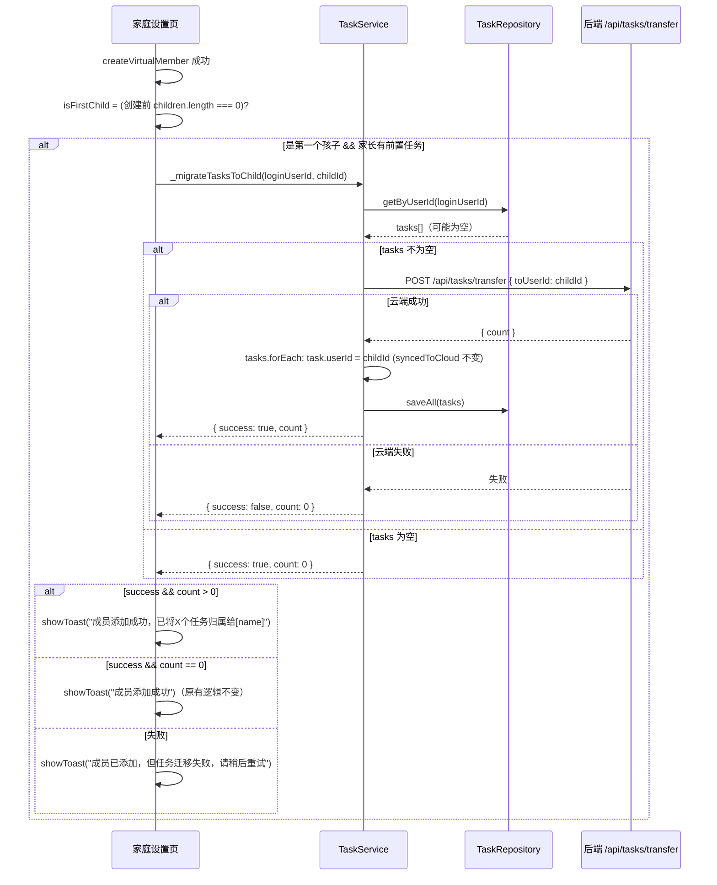

# M08b：前置任务归属迁移 详细设计文档

> **设计状态**：✅ 已完成
> **创建日期**：2026-03-19
> **设计者**：项目维护团队
> **审核者**：待定
> **预计工期**：1天

---

## 📋 目录

- [需求分析](#需求分析)
- [技术方案](#技术方案)
- [代码结构](#代码结构)
- [实施步骤](#实施步骤)
- [测试方案](#测试方案)
- [风险评估](#风险评估)
- [替代方案](#替代方案)

---

## 需求分析

### 功能描述

本 App 的核心使用流程是：家长登录注册 → 创建家庭 → 添加孩子 → 为孩子创建任务。但由于注册流程的自然顺序，家长可能在添加孩子**之前**就创建了任务（探索功能或提前准备）。这些任务的 `userId` 是家长自己的 ID。当家长添加第一个孩子时，首页视图切换到展示孩子任务，家长之前创建的任务从主界面**消失**，造成困惑。

本功能在家长**成功创建第一个孩子**后，自动将家长名下的所有任务迁移到该孩子名下。迁移顺序为：先云端后本地，保证本地与云端始终一致。如果云端迁移失败，本地不做任何修改，并提示用户重试。

### 业务价值

- **用户价值**：消除"任务莫名消失"的困惑，首次使用体验平滑自然
- **技术价值**：修补 M06~M08 遗留的任务归属语义不一致问题
- **业务价值**：符合 App 核心定位（任务的主体始终是孩子），减少新用户流失

### 功能范围

**包含**：
- ✅ 创建第一个孩子成功后，自动将家长名下任务迁移到该孩子
- ✅ 迁移顺序：**云端先行**，云端成功后再更新本地 `userId`
- ✅ 云端迁移失败时：**本地不修改**，提示用户重试
- ✅ 本地迁移时 `syncedToCloud` 标记**保持不变**（原来 true 仍 true，false 仍 false）
- ✅ 迁移成功后，将"成员添加成功"与"已迁移 X 个任务"合并为一条 Toast
- ✅ 后端新增 `POST /api/tasks/transfer` 接口（含安全校验）
- ✅ 触发入口：`family-settings.js` 页面（而非 UserService 内部）

**不包含**（明确的边界）：
- ❌ 已有孩子后再添加第二个孩子时不触发迁移（歧义太大，留用户手动管理）
- ❌ 邀请码加入家庭场景（见[已知限制](#已知限制)）
- ❌ 迁移历史记录/撤销功能

### 已知限制

**邀请码场景（真实孩子）**：当家庭的第一个孩子通过邀请码从自己设备加入时，迁移触发点（`createVirtualMember`）不会被调用。此场景在当前 App 中概率极低（主要使用虚拟成员），暂标记为 known limitation。如后续需要支持，可在 `loadFamilyMembers` 刷新后检测"是否首次出现孩子"并触发迁移。

### 优先级

- **优先级**：P1
- **理由**：影响新用户的首次核心体验，属于已知 UX 缺陷，改动小、收益明确

---

## 技术方案

### 方案概述

迁移的核心原则是**云端优先、本地跟随**：

1. 先调用后端 `POST /api/tasks/transfer`，原子性地批量更新云端 `user_id`
2. 云端成功后，再更新本地任务的 `userId` 字段，`syncedToCloud` 标记保持不变
3. 云端失败时，本地不做任何修改，返回失败状态供页面提示重试

`syncedToCloud` 保持不变的原因：云端 transfer 不创建也不删除任务，只是修改 `user_id`。已在云端的任务（`syncedToCloud=true`）在 transfer 后仍在云端，标记应继续为 true；从未上云的任务（`syncedToCloud=false`）不受 transfer 影响，标记应继续为 false。

触发时机的入口设在 `family-settings.js` 页面，而非 UserService 内部，理由是：
- `createVirtualMember` 的成功 Toast 已在页面处理，合并提示更自然
- 避免 UserService 持有对 TaskService 的直接依赖（违反服务层隔离原则）

### 技术选型

| 技术点 | 选择方案 | 替代方案 | 选择理由 |
|--------|---------|---------|---------|
| 迁移顺序 | 云端先行，云端成功再做本地 | 本地先行再补偿 | 避免本地/云端分叉，无需补偿链路 |
| 触发入口 | `family-settings.js` 页面 | 在 UserService 内触发 | 避免跨服务依赖，Toast 合并更自然 |
| 本地批量更新 | `taskRepository.saveAll()` | 逐条 `save()` | 避免写放大，与现有代码一致 |
| syncedToCloud 策略 | 保持不变 | 统一置 true | 云端 transfer 不影响任务存在性，标记语义不变 |
| 云端迁移 | 后端 `POST /api/tasks/transfer`（单条 SQL execute） | 前端逐条调用 updateTask | 一次网络请求，原子性好 |
| 云端失败处理 | 不做本地迁移，提示重试 | 降级补偿 | 消除本地/云端归属分叉 |

### DDD分层设计

**表现层（pages/）**：
- [x] 修改页面：`packageManage/pages/family-settings/family-settings.js`
  - 在 `createVirtualMember` 成功回调中，判断是否为第一个孩子
  - 如果是，调用 `taskService._migrateTasksToChild` 并合并 Toast

**服务层（services/）**：
- [x] 修改服务：`services/task-service.js` — 新增 `_migrateTasksToChild(fromUserId, toUserId)` 方法
- `user-service.js` 无需修改

**仓储层（repositories/）**：
- 无需改动（`getByUserId` 和 `saveAll` 已存在）

**后端（backend/）**：
- [x] 新增路由：`backend/routes/tasks.js` — `POST /api/tasks/transfer`
- [x] 新增控制器方法：`backend/controllers/taskController.js` — `transferTasks`
- [x] 新增服务方法：`backend/services/taskService.js` — `transferTasksToChild`

### 架构图



### 接口设计

**新增后端接口**：

| 字段 | 说明 |
|------|------|
| 路径 | `POST /api/tasks/transfer` |
| 鉴权 | 必须 JWT，`role === 'parent'`，`familyId` 非空 |
| 请求体 | `{ toUserId: string }` |
| 成功响应 | `{ success: true, data: { count: N }, message: "转移成功" }` |
| 失败响应 | 403（非家长）、400（参数缺失 / toUserId 不在同家庭 / toUserId 非孩子角色）、500 |

**后端安全校验逻辑**：
1. 验证 `role === 'parent'`
2. 验证 `toUserId` 是 `familyId` 下的 `role='child'` 成员（`status='active'`）
3. `UPDATE tasks SET user_id = :toUserId WHERE user_id = :fromUserId`（`fromUserId` 来自 JWT，不信任客户端）

---

## 代码结构

### 文件变更清单

**修改文件**：
- `packageManage/pages/family-settings/family-settings.js` — 在 `createVirtualMember` 成功回调中添加迁移触发逻辑，合并 Toast
- `services/task-service.js` — 新增 `_migrateTasksToChild(fromUserId, toUserId)` 方法
- `backend/routes/tasks.js` — 新增 `POST /api/tasks/transfer` 路由
- `backend/controllers/taskController.js` — 新增 `transferTasks` 方法
- `backend/services/taskService.js` — 新增 `transferTasksToChild(fromUserId, toUserId, familyId)` 方法

**无需修改**：
- `services/user-service.js`（职责不变）
- `repositories/task-repository.js`（`getByUserId`、`saveAll` 已存在）
- `models/task.js`（无字段变更）
- 数据库 schema（`user_id` 字段已存在，只是 UPDATE 操作，无 migration 文件）

### 核心代码结构

**前端：`task-service.js` 新增方法**

```javascript
/**
 * 将家长名下的任务迁移到指定孩子
 * 顺序：云端先行（不依赖本地是否有数据），云端成功后再更新本地
 * syncedToCloud 标记保持不变（不影响 M08 陈旧清理安全边界）
 * @param {string} fromUserId 家长 userId（来自 userService.getLoginUserId()）
 * @param {string} toUserId   目标孩子 userId
 * @returns {{ success: boolean, count: number }}
 */
async _migrateTasksToChild(fromUserId, toUserId) {
  logger.info('TaskService', '开始前置任务归属迁移', { fromUserId, toUserId });
  try {
    // 1. 先做云端迁移（不依赖本地缓存，直接调用，由后端返回实际迁移数量）
    // HttpClient.post 成功时 resolve(res.data.data)，即后端 Result<T>.data，此处拿到 { count }
    const cloudResult = await HttpClient.post(API_CONFIG.ENDPOINTS.TASKS_TRANSFER, { toUserId });
    const cloudCount = cloudResult?.count ?? 0;
    logger.info('TaskService', '云端迁移成功', { cloudCount });

    // 2. 云端成功后，更新本地中归属家长的任务（本地可能为空，无副作用）
    const tasks = await this.taskRepository.getByUserId(fromUserId);
    if (tasks.length > 0) {
      tasks.forEach(task => {
        task.userId = toUserId;
        // syncedToCloud 不改动：已同步仍 true，未同步仍 false
      });
      await this.taskRepository.saveAll(tasks);
      logger.info('TaskService', '本地迁移完成', { count: tasks.length });
    }

    return { success: true, count: cloudCount };
  } catch (error) {
    logger.error('TaskService', '前置任务归属迁移失败', error);
    return { success: false, count: 0 };
  }
}
```

**前端：`family-settings.js` 修改（仅 `createVirtualMember` 回调部分）**

```javascript
// 创建孩子之前，记录当前孩子数量（不依赖刷新后状态）
const userService = getApp().globalData?.userService;
const taskService = getApp().getTaskService();  // app.js:711 暴露此方法
const childrenBefore = userService.getAllUsers().filter(u => u.role === 'child');
const isFirstChild = childrenBefore.length === 0;

const result = await userService.createVirtualMember(res.content.trim());
if (result.success) {
  let toastTitle = '成员添加成功';
  if (isFirstChild && result.member?.userId) {
    const loginUserId = userService.getLoginUserId();
    const migrateResult = await taskService._migrateTasksToChild(loginUserId, result.member.userId);
    if (migrateResult.success && migrateResult.count > 0) {
      toastTitle = `成员添加成功，已将 ${migrateResult.count} 个任务归属给${res.content.trim()}`;
    } else if (!migrateResult.success) {
      toastTitle = '成员已添加，但任务迁移失败，请稍后重试';
    }
  }
  wx.showToast({ title: toastTitle, icon: 'none', duration: 2500 });
  this._loadFamilyData();
} else {
  wx.showToast({ title: result.message || '添加失败', icon: 'none' });
}
```

**后端：`backend/services/taskService.js` 新增方法**

```javascript
async transferTasksToChild(fromUserId, toUserId, familyId) {
  // 验证 toUserId 是同家庭的 child 成员（status='active'，role='child'）
  const targetRows = await query(
    "SELECT user_id FROM users WHERE user_id = ? AND family_id = ? AND role = 'child' AND status = 'active' LIMIT 1",
    [toUserId, familyId]
  );
  if (!targetRows.length) {
    const err = new Error('目标用户不是同家庭的孩子成员');
    err.code = 'TRANSFER_TARGET_INVALID';
    throw err;
  }
  // execute() 用于 DML，返回 result 对象（含 affectedRows）
  const result = await execute(
    'UPDATE tasks SET user_id = ? WHERE user_id = ?',
    [toUserId, fromUserId]
  );
  return result.affectedRows;
}
```

> **注意**：后端 DB 封装中，`query(sql, params)` 用于 SELECT（返回 rows 数组），`execute(sql, params)` 用于 DML（返回 result 对象，含 `affectedRows`）。见 `backend/config/database.js:71-90`。

**后端：`backend/controllers/taskController.js` 新增方法**

```javascript
async transferTasks(req, res) {
  try {
    const { userId, role, familyId } = req.user;
    const { toUserId } = req.body;

    if (role !== 'parent') {
      return res.status(403).json(error('只有家长可以转移任务', 'TRANSFER_PARENT_REQUIRED'));
    }
    if (!familyId) {
      return res.status(400).json(error('您尚未加入家庭', 'FAMILY_NOT_JOINED'));
    }
    if (!toUserId) {
      return res.status(400).json(error('目标用户不能为空', 'INVALID_PARAMS'));
    }

    const count = await taskService.transferTasksToChild(userId, toUserId, familyId);
    logger.info('任务归属转移成功', { fromUserId: userId, toUserId, count });
    res.json(success({ count }, '转移成功'));
  } catch (err) {
    if (err.code === 'TRANSFER_TARGET_INVALID') {
      return res.status(400).json(error(err.message, err.code));
    }
    logger.error('任务归属转移失败', err);
    res.status(500).json(error('转移失败', 'TASK_TRANSFER_FAILED'));
  }
}
```

**后端路由：`backend/routes/tasks.js` 新增一行**

```javascript
router.post('/transfer', authMiddleware, taskController.transferTasks.bind(taskController));
```

---

## 实施步骤

### 第1步：后端新增 transferTasksToChild 服务方法（预计30分钟）

- [ ] **任务**：在 `backend/services/taskService.js` 末尾添加 `transferTasksToChild` 方法
- [ ] **验证**：方法逻辑正确（家庭归属校验 + DML）
- [ ] **依赖**：无

**实施要点**：
1. SELECT 用 `query()`，UPDATE 用 `execute()`（见 `backend/config/database.js` 中两者语义区别）
2. 用户校验条件：`role = 'child' AND status = 'active'`（users 表无 `deleted_at`，用 `status`）
3. 必须校验 `role = 'child'`，不允许转移给家长账号
4. `fromUserId` 全部来自 JWT，不信任客户端传入

---

### 第2步：后端新增控制器方法和路由（预计20分钟）

- [ ] **任务**：在 `backend/controllers/taskController.js` 新增 `transferTasks`；在 `backend/routes/tasks.js` 注册路由
- [ ] **验证**：接口可调用，鉴权和参数校验均正常
- [ ] **依赖**：第1步完成

**实施要点**：
1. 路由：`router.post('/transfer', authMiddleware, taskController.transferTasks.bind(taskController))`
2. 错误映射：403（非家长）、400（参数缺失 / 目标无效）、500（DB 失败）

---

### 第3步：前端新增 _migrateTasksToChild 方法（预计30分钟）

- [ ] **任务**：在 `services/task-service.js` 新增 `_migrateTasksToChild(fromUserId, toUserId)` 方法
- [ ] **验证**：云端成功 → 本地迁移正确；云端失败 → 本地不改动，返回 success=false
- [ ] **依赖**：第2步完成（后端接口就绪）

**实施要点**：
1. 云端迁移**不设本地前置条件**，直接调用后端；`cloudResult.count`（`HttpClient.post` resolve 后直接得到 `{ count }`，即后端 `affectedRows`）是实际迁移数量的权威来源，清缓存场景下依然准确
2. 云端 `throw` 时直接 return `{ success: false, count: 0 }`，不做本地修改
3. 本地迁移时**不改动** `syncedToCloud`（核心约束，避免破坏 M08 清理安全边界）
4. `API_CONFIG.ENDPOINTS.TASKS_TRANSFER` 需在 `utils/api-config.js` 的 `ENDPOINTS` 对象中新增为**相对路径**（`HttpClient` 自动拼接 `BASE_URL`）

**同步新增 API 配置**：在 `utils/api-config.js` 的 `ENDPOINTS` 中添加（相对路径，`HttpClient.post` 会自动拼接 `BASE_URL`）：
```javascript
TASKS_TRANSFER: '/api/tasks/transfer'
```

---

### 第4步：修改 family-settings.js 触发迁移（预计30分钟）

- [ ] **任务**：修改 `packageManage/pages/family-settings/family-settings.js` 中的 `createVirtualMember` 成功回调
- [ ] **验证**：第一个孩子触发迁移，第二个孩子不触发；Toast 合并正确显示
- [ ] **依赖**：第3步完成

**实施要点**：
1. 在 `createVirtualMember` 调用**之前**用 `userService.getAllUsers().filter(u => u.role === 'child')` 记录 `isFirstChild`
2. `userService` 通过 `getApp().globalData?.userService` 获取（与页面现有其他方法一致）；`taskService` 通过 `getApp().getTaskService()` 获取（`app.js:711` 已暴露此方法）
3. 迁移失败时 Toast 说明"成员已添加"但提示迁移失败，避免用户以为整个操作失败
4. 替换原有的 `wx.showToast({ title: '成员添加成功' })` 这一行，改为合并逻辑

---

## 测试方案

### 单元测试

| 测试项 | 测试方法 | 预期结果 |
|--------|---------|---------|
| 家长有2个任务，云端迁移成功 | mock `getByUserId` 返2条，mock 后端 transfer 成功 | 本地 userId 更新，saveAll 被调用，syncedToCloud 不变，count=2 |
| 家长无任务（本地为空，云端也无），创建第一个孩子 | mock 后端 transfer 返回 count=0，mock `getByUserId` 返回[] | 云端仍被调用，返回 count=0，不调用 saveAll |
| 云端迁移失败 | mock 后端 transfer 抛错 | 本地不修改（saveAll 不被调用），返回 success=false |
| 云端成功时 syncedToCloud=true 的任务仍保持 true | mock 一条 syncedToCloud=true 的任务 | 迁移后该任务 syncedToCloud 仍为 true |
| 云端成功时 syncedToCloud=false 的任务仍保持 false | mock 一条 syncedToCloud=false 的任务 | 迁移后该任务 syncedToCloud 仍为 false |
| 创建第二个孩子时不触发迁移 | 页面测试，设置 childrenBefore.length=1 | `_migrateTasksToChild` 不被调用 |

### 集成测试（后端）

- [ ] 以非家长身份调用 → 返回 403
- [ ] `toUserId` 不在同家庭 → 返回 400 `TRANSFER_TARGET_INVALID`
- [ ] `toUserId` 是家长角色 → 返回 400 `TRANSFER_TARGET_INVALID`
- [ ] 正常调用 → tasks 表中 `user_id` 被批量更新，`affectedRows` 正确
- [ ] 家长名下无任务 → 返回 200，count=0

### 手动测试

1. **主流程**：
   - [ ] 清除缓存重新进入 → 创建若干任务 → 创建家庭 → 创建第一个孩子 → 观察 Toast 合并提示 → 首页任务仍可见（归属已是孩子）
   - [ ] 切换孩子视角 → 能看到刚才创建的任务

2. **边界场景**：
   - [ ] 家长无任务时创建第一个孩子 → Toast 只显示"成员添加成功"，无多余提示
   - [ ] 创建第二个孩子 → 无迁移触发，Toast 保持原有"成员添加成功"
   - [ ] 网络断开时创建第一个孩子 → 成员创建本地可能失败；如成员创建成功但 transfer 失败 → Toast 提示迁移失败

3. **回归测试**：
   - [ ] 正常任务创建/完成/删除流程不受影响
   - [ ] M08 陈旧任务清理逻辑不受影响（syncedToCloud 未被篡改）
   - [ ] 切换孩子视角不再触发家长任务消失

---

## 风险评估

### 技术风险

| 风险项 | 影响 | 概率 | 应对措施 |
|--------|------|------|---------|
| 后端 UPDATE 影响其他用户数据 | 高 | 极低 | `fromUserId` 来自 JWT；`toUserId` 有家庭+角色双重校验 |
| 重复触发迁移（如网络重试） | 低 | 低 | 第二次触发时云端 `affectedRows=0`，本地 `getByUserId` 也为空，均无副作用 |
| 清缓存后本地为空时漏触发 | 高 | 无 | 已消除：云端迁移不依赖本地数据，直接调用后端，count 来自 `affectedRows` |
| `isFirstChild` 检查时机错误 | 中 | 低 | 在 `createVirtualMember` 调用之前记录，不依赖 `loadFamilyMembers` 刷新后状态 |
| 邀请码孩子加入不触发迁移 | 中 | 极低 | 已知限制，本期接受 |

### 业务风险

| 风险项 | 影响 | 概率 | 应对措施 |
|--------|------|------|---------|
| 家长有"个人任务"（非给孩子的）被错误迁移 | 中 | 极低 | App 定位明确（任务主体是孩子），接受此假设 |
| 迁移失败后用户不知道如何重试 | 中 | 低 | Toast 明确提示，后续可在家庭设置页添加手动重试入口 |

---

## 替代方案

### 方案A（当前方案）：云端先行 + 本地跟随 + 失败提示重试

**优势**：
- ✅ 本地与云端始终一致，无补偿链路负担
- ✅ syncedToCloud 语义不被污染，M08 清理安全边界不受影响
- ✅ 失败处理明确（不做本地修改，Toast 提示）

**劣势**：
- ❌ 云端失败时任务不迁移，用户需手动重试（概率极低，接受）

---

### 方案B：本地先行 + 异步云端补偿

**描述**：先做本地迁移，再异步推送云端，失败依赖后续同步修复

**劣势**：
- ❌ 补偿链路不成立：`updateTask` 不发 userId，`createTask` 对归属冲突报 TASK_ID_USER_MISMATCH，无法自动修复
- ❌ syncedToCloud 批量置 true 会把从未上云的任务纳入陈旧清理路径

**未选择原因**：云端失败后本地与云端归属永久分叉，没有可靠的自愈机制

---

### 方案C：任务始终展示（不迁移）

**描述**：修改首页视图逻辑，家长的个人任务在孩子视角外单独展示

**劣势**：
- ❌ 引入永久的"家长个人任务"概念，与 App 定位不符
- ❌ UI 需要增加归属 tab 或分区，视觉复杂度上升

**未选择原因**：引入不必要的产品复杂度，根本问题没解决

---

## 审核记录

### 审核要点

- [ ] **符合DDD架构**：触发逻辑在页面层，迁移逻辑在服务层，仓储无改动
- [ ] **技术方案合理**：云端先行，无补偿链路风险；syncedToCloud 语义安全
- [ ] **实施步骤清晰**：4步独立可执行，各有验收标准
- [ ] **风险评估充分**：识别了安全风险、已知限制和业务假设
- [ ] **测试方案完整**：覆盖主流程、边界场景和回归

### 审核意见

**审核者**：待定
**审核日期**：待定
**审核结果**：待定

---

**最后更新**：2026-03-19
