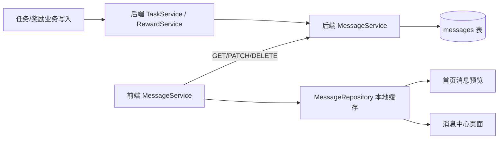

# 里程碑-10：消息通知云端同步 + 多孩子路由修复 详细设计文档

> **设计状态**：🟢 已实施并完成文档收口
> **创建日期**：2026-03-21
> **设计者**：GPT5 Codex
> **审核者**：项目维护者
> **预计工期**：1周

---

## 📋 目录

- [需求分析](#需求分析)
- [技术方案](#技术方案)
- [代码结构](#代码结构)
- [实施步骤](#实施步骤)
- [测试方案](#测试方案)
- [风险评估](#风险评估)
- [替代方案](#替代方案)

---

## 需求分析

### 功能描述

M09 已完成任务、星星和奖励的云端同步，但消息系统仍停留在本地仓储实现，且沿用单孩子时期的接收者假设。当前 `services/message-service.js` 仍使用 `'parent'` / `'child'` 字面量分发消息，`packageMessage/pages/message/message.js` 与首页消息预览也依赖本地全量消息后再按 `userId/shared` 过滤，后端完全没有消息表和消息 API。

这会带来三个直接问题：第一，跨设备下消息中心无法保证完整一致；第二，多孩子家庭中消息接收者会被错误路由；第三，首页消息预览和消息中心页面的数据来源与 M07/M09 已完成的云端主链路脱节。M10 需要把消息系统纳入现有混合存储体系，并修复多孩子路由，使消息成为可跨设备同步、且同时满足“孩子个人消息流”和“家长家庭消息流”的能力。

### 业务价值

- [x] 用户价值：家长和孩子在不同设备上都能看到一致的消息记录，消息中心不再是“只在本机有效”的孤岛。
- [x] 技术价值：补齐游戏化主链路最后一个仍未云端化的业务域，使任务、星星、奖励、消息四条核心链路口径一致。
- [x] 业务价值：解决多孩子家庭消息错发和首页消息预览不稳定问题，并让家长侧能看到“当前家庭孩子行为流”，为后续提醒、通知和体验优化打基础。

### 实施结果（2026-03-22）

- ✅ 后端已落地 `messages` 表、消息模型、消息服务、控制器和路由，消息域已纳入云端主链路
- ✅ 后端任务/奖励成功写路径已接入消息生成，按个人流 / 家庭流双记录落库
- ✅ 前端 `MessageService` 已完成 scope 读取、云端回灌、已读同步、删除同步、provisional 兜底
- ✅ 任务/奖励本地补云链路已持久化 `pendingSyncMeta` 与删除 tombstone，应用重启后仍可继续补云
- ✅ 后端真实集成测试已补齐：`backend/test/integration/message-api-m10-real.test.js`
- ✅ 前端消息服务单元测试已补齐：`test/services/message-service.test.js`
- ✅ 集成测试库 schema 已同步补充 `messages` 表：`backend/database/test-setup-modern.sql`

### 功能范围

**包含**：
- ✅ 后端新增 `messages` 表、模型、服务、控制器、路由
- ✅ 后端任务/奖励核心写路径在成功后生成消息记录，消息以云端为权威来源
- ✅ 前端 `MessageService` 新增消息云端读取、已读同步、批量已读同步、删除同步
- ✅ 修复多孩子家庭中的消息接收者解析，移除 `'parent'` / `'child'` 字面量路由
- ✅ 家长视角提供“家庭孩子行为流”，孩子视角提供“个人消息流”
- ✅ 家长创建任务时，接收消息的孩子取得方式与任务归属孩子取得方式保持一致
- ✅ 首页消息预览与消息中心页面按“家长家庭流 / 孩子个人流”两种模式刷新云端消息
- ✅ 本地消息仓储保留为缓存层，支持云端全量回灌与 stale cleanup

**不包含**（明确边界）：
- ❌ 微信订阅消息、模板消息、系统推送通知
- ❌ WebSocket / SSE 实时推送，仍采用进入页面时刷新
- ❌ 服务端定时任务调度“即将开始/即将过期”提醒；此类提醒仍可保留为本地增强能力，暂不承诺跨设备一致
- ❌ 重新设计消息页面视觉样式，M10 聚焦数据正确性与链路闭环

### 优先级

- **优先级**：P1（已完成）
- **理由**：M10 不再是补核心账本，但消息中心是当时唯一仍未进入云端闭环的业务域，同时直接影响多孩子家庭的可用性和跨设备一致性。

---

## 技术方案

### 方案概述

M10 延续 M07/M09 已验证的“本地缓存 + 云端权威 + 双写降级”思路，但对消息域采用更严格的权威划分：**状态型业务消息由后端在任务/奖励业务写入成功后直接生成，前端不再把消息创建作为主权威来源**。这样可以避免“业务动作已同步，但消息因前端同步失败而缺失”的分叉。

消息展示分为两条明确的阅读口径：
1. **孩子个人消息流**：孩子设备或孩子视角下，只看属于该孩子自己的消息。
2. **家长家庭消息流**：家长视角下，不按某一个 `currentUserId` 过滤，而是查看当前家庭中孩子们行为产生的消息流，例如“谁完成了什么任务”“谁给哪个孩子创建了任务”。

前端 `MessageService` 主要负责三类工作：一是进入首页/消息页时按“孩子个人流 / 家长家庭流”刷新消息列表并回灌本地缓存；二是将已读、批量已读、删除等用户交互状态同步到云端；三是在云端写失败但本地业务已成功时，保留可回收的本地 provisional 消息，并在后续同一业务实体成功同步到云端后按业务幂等键去重收敛。

M10 对一致性机制再补一条硬约束：**不引入独立消息重试队列，状态型业务消息必须与后端任务/奖励主写入处于同一个云端成功判定中**。具体规则如下：
1. 当前端调用后端任务/奖励 API 且请求成功返回时，表示“业务记录 + 对应消息记录”已经在后端同一事务或同一成功单元内写入完成；消息写失败不得被吞掉为“业务成功但消息缺失”。
2. 当前端本地业务先成功、随后云同步失败时，前端只允许保留 `isProvisional=true` 的本地兜底消息，同时把源业务实体继续标记为未完成云同步；此时不承诺跨设备可见。
3. M10 不新增通用后台补偿任务；provisional 消息的回收触发点明确为“该任务/奖励在后续同步过程中成功落云并生成正式消息”后的刷新回灌。若源业务始终未成功上云，则 provisional 消息保留在本机，不伪装为已同步正式消息。
4. 因此，M10 的最终一致性前提是继续复用 M07/M09 现有任务/奖励同步链路，而不是另起一套消息专用补偿系统。
5. M10 **不承诺离线多次连续操作的完整事件回放**。在“本地优先、后续补云”的旧前端链路下，每个任务/奖励实体只保证“最近一次待补云操作”可被恢复并与云端正式消息对账；若同一实体在成功上云前连续发生多次本地操作，后续正式云消息只保证与最后一次待补云操作收敛，较早的 provisional 消息仅保留本机可见，不升级为云端正式历史。

为避免单条消息同时承载两套已读/删除语义，M10 明确采用**双记录策略**：
1. **孩子个人流记录**：`visibilityScope='user'`，`userId=subjectUserId`
2. **家长家庭流记录**：`visibilityScope='family'`，`userId=null`

两条记录共享同一个**消息事件键**，但不是简单按业务实体去重。M10 明确区分：
1. **消息事件键 `messageEventKey`**：用于标识“某一业务实体上的某一次操作实例”，建议组成：`sourceType + relatedId + notificationType + subjectUserId + actorUserId + operationKey`
2. **消息记录唯一键**：`messageEventKey + visibilityScope`

其中 `operationKey` 必须能区分同一任务/奖励上的不同操作轮次，优先复用已存在的业务幂等字段，例如任务/奖励写接口里的 `modifyTime`、命令时间戳或后端生成的事件 ID。这样可以保证“同一任务第二次完成”“再次更新同一奖励”会生成新的消息事件，而不会被首次事件误去重；同时孩子个人流和家长家庭流仍然能通过同一个 `messageEventKey` 对齐为一对双记录。两条记录的已读/删除状态相互独立，因此孩子把自己的消息读掉后，不会影响家长家庭流中的同一条事件记录，反之亦然。

为控制改造风险，M10 还明确采用**兼容迁移策略**：
1. 现有公开接口 `getAllMessages()`、`getUnreadCount()`、`markAllMessagesAsRead()` 在 M10 第一阶段继续保留，内部改为委托到新的 scope 读取/写入逻辑，避免一次性改爆所有调用点。
2. 兼容接口默认 scope 明确如下：
   - `loginUser.role === 'parent'` 且未显式传参时：默认走 `scope='family'`
   - `loginUser.role === 'child'` 时：默认走 `scope='user'` 且 `userId=currentUserId`
   - 显式传入 `scope` / `userId` 时，以显式参数优先
3. 现有页面与 `app.js` 可先逐步切换到 `getMessagesByScope()`；在全部调用点收敛前，旧接口只作为兼容层存在，不再承载新语义扩展。
4. 旧本地历史消息**不迁移上云**。首次进入云端模式后，按 scope 进行一次“本地旧消息归档到 legacy 集合 + 云端消息回灌”的切换：
   - 已同步消息：以云端记录为准，旧本地副本清理
   - 未同步或无法映射的旧本地正式消息：迁移到本地 `legacyMessages` 只读集合，不再混入主消息流
   - provisional 消息：继续保留在主仓储，等待云端补齐后回收
5. 首页预览和消息中心主列表只展示当前主消息流，不展示 `legacyMessages`；如后续需要，可单独提供“历史消息（仅本机）”入口，但不在 M10 范围内。

### 技术选型

| 技术点 | 选择方案 | 替代方案 | 选择理由 |
|--------|---------|---------|---------|
| 消息权威来源 | 后端业务写路径直接生成消息 | 前端本地创建后异步上云 | 避免消息与任务/奖励主业务出现“双成功/单失败”分叉 |
| 消息读取 | 页面进入时按 scope 刷新：孩子 `scope=user`，家长 `scope=family` | 永远只读本地缓存 | 与真实阅读口径一致，保证跨设备可见 |
| 接收者路由 | 真实 `userId` + 家庭鉴权解析 | `'parent'/'child'` 字面量约定 | 多孩子家庭下必须使用真实用户 ID 才能正确归属 |
| 家长消息视图 | 家庭孩子行为流 | 绑定某个 `currentUserId` 的单孩子流 | 更符合家长视角下“看全家孩子动态”的真实诉求 |
| 本地消息存储 | `MessageRepository` 作为缓存层保留 | 完全移除本地仓储 | 兼容现有页面、便于离线降级和渐进迁移 |
| 实时性 | 进入页面刷新 + 事件驱动本地更新 | WebSocket 推送 | 当前项目复杂度不需要引入常连通道 |

### DDD分层设计

**领域层（models/）**：
- [x] 新建模型：`backend/models/Message.js`
- [x] 修改模型：`models/message.js`
- [x] 修改模型：`models/task.js`
- [x] 修改模型：`models/reward.js`
- 说明：
  - 前端 `Message` 模型补充 `familyId`、`actorUserId`、`syncedToCloud` 等字段
  - 前端 `Task` / `Reward` 模型补充 `pendingSyncMeta`，用于持久化最近一次待补云操作元数据
  - 保留 `userId` 作为个人消息接收者 ID；新增 `subjectUserId` 标识本条消息关联的孩子
  - 通过 `scope` / `visibilityScope` 区分“孩子个人消息”和“家长家庭消息”，不再允许任务/奖励消息使用 `'parent'/'child'` 占位符
  - 后端 `Message` 模型与数据库字段映射，承载消息合法性校验

**服务层（services/）**：
- [x] 新建服务：`backend/services/messageService.js`
- [x] 修改服务：`services/message-service.js`
- [x] 修改服务：`backend/services/taskService.js`
- [x] 修改服务：`backend/services/rewardService.js`
- 说明：
  - 后端 `messageService` 负责消息 CRUD、读状态变更、按用户/家庭查询
  - 后端任务/奖励服务在业务成功后调用消息服务创建对应消息
  - 前端 `MessageService` 新增 `refreshMessagesFromCloud(userId, options)`、`getMessagesByScope(options)`、`_syncReadToCloud`、`_syncDeleteToCloud`、`_syncMarkAllReadToCloud`
  - 兼容接口 `getAllMessages()`、`getUnreadCount()`、`markAllMessagesAsRead()` 继续保留一版，通过 `currentUser` / `loginUser` 和默认 scope 适配到新实现
  - 前端创建消息逻辑仅保留为“云端失败时的 provisional 本地兜底”，且必须具备后续去重/回收机制；云端模式正常路径以下发云端消息为准
  - 在云端模式下，现有 `MessageService` 事件监听器对 **任务/奖励云端托管消息** 不再直接持久化正式消息；仅在对应业务云端写失败时才允许落本地 provisional 消息。`upcoming` / `expired` / `penalty` / `system` 等 M10 未云端化类型继续保留本地路径
  - M10 新增专用失败信号：`TASK_CLOUD_SYNC_FAILED`、`REWARD_CLOUD_SYNC_FAILED`。云端托管类型的 provisional 消息只能由这两类失败事件触发，不能继续依赖 `TASK_CREATED`、`TASK_UPDATED`、`REWARD_CREATED` 等泛业务事件在“不知道云端结果”的时点提前落库
  - 前端任务/奖励同步请求需统一携带 `operationKey`；对“谁触发了动作”敏感的链路，还需透传 `operatorContext` 或其等价字段，确保后续补云时仍能还原 `actorUserId`、`subjectUserId` 和消息文案

**仓储层（repositories/）**：
- [x] 修改仓储：`repositories/message-repository.js`
- [x] 修改仓储：`repositories/task-repository.js`
- [x] 修改仓储：`repositories/reward-repository.js`
- [x] 新建仓储：后端服务内部数据访问逻辑可先内聚在 `backend/services/messageService.js`，后续如复杂再独立仓储
- 说明：
  - 前端仓储增加 `getByUserId`、`getFamilyFeedMessages`、`replaceSyncedMessagesByScope`、`cleanupStaleMessages`、`archiveLegacyMessages` 等能力
  - 前端任务/奖励仓储需原样持久化同步元数据，保证“本地成功、补云失败、应用重启后再补云”仍能拿到 `operationKey` 与最近一次操作者上下文
  - stale cleanup 仅删除 `syncedToCloud=true` 且云端已不存在的消息；本地 provisional 消息需通过单独标记避免被误删
  - 旧本地历史正式消息在首次切换时归档到 `legacyMessages`，不再参与主消息流查询

**适配器层（adapters/）**：
- [x] 修改适配器：`utils/api-config.js`
- 说明：
  - 新增消息相关 API 端点配置

**表现层（pages/、components/）**：
- [x] 修改页面：`packageMessage/pages/message/message.js`
- [x] 修改页面：`pages/index/index.js`
- 说明：
  - 首页消息预览和消息中心页面都改为显式按 scope 刷新：家长读家庭流，孩子读个人流
  - 页面不再依赖 `'shared'` 作为任务/奖励消息跨用户可见策略；改为使用明确的 `visibilityScope`

### 架构图



### 数据模型

```typescript
interface MessageData {
  id: string;
  familyId: string;
  userId?: string;         // 个人消息接收者 userId；家庭流消息可为空
  actorUserId?: string;    // 触发动作的操作者
  subjectUserId?: string;  // 关联的孩子 userId
  operationKey?: string;   // 区分同一业务实体上的不同操作实例
  messageEventKey?: string;// 同一操作实例在 user/family 双记录之间共享
  visibilityScope: 'user' | 'family';
  type: 'task' | 'reward' | 'system' | 'star' | 'notification';
  notificationType: string;
  relatedId?: string;
  relatedType?: string;
  title: string;
  summary: string;
  content?: string;
  icon?: string;
  priority: 0 | 1 | 2;
  isRead: boolean;
  isArchived: boolean;
  createTime: number;
  readTime?: number;
  expireTime?: number;
  syncedToCloud?: boolean;
  isLegacy?: boolean;
  isProvisional?: boolean;
}
```

```typescript
interface PendingSyncMeta {
  operationKey: string;
  operatorUserId?: string;
  operatorRole?: 'parent' | 'child' | 'system';
  familyId?: string | null;
  targetUserId?: string | null;   // 任务归属孩子或需要显式传给后端的目标孩子
  exchangeUserId?: string | null; // 奖励兑换目标孩子
  notificationType?: string;
}
```

```typescript
interface PendingDeleteMeta {
  entityType: 'task' | 'reward';
  entityId: string;
  operationKey: string;
  operatorUserId?: string;
  operatorRole?: 'parent' | 'child' | 'system';
  familyId?: string | null;
  subjectUserId?: string | null;
  notificationType?: string;
  title?: string;
  summary?: string;
  createTime: number;
}
```

说明：
1. 对前端本地优先链路，`Task` / `Reward` 实体必须至少保留一份“最近一次待补云操作”的同步元数据；优先直接落在实体字段中，若团队认为污染领域模型过重，也可改为实体内嵌 `pendingSyncMeta` 对象，但不能只停留在运行时内存。
2. M10 不建设通用操作日志队列，因此 `pendingSyncMeta` 的语义明确为“每个实体最近一次待补云操作”，不是完整历史列表。
3. 只要业务实体仍是 `syncedToCloud !== true`，且最近一次操作尚未成功补云，上述元数据就必须跟随本地仓储持久化。
4. 奖励兑换场景至少要保留 `exchangeUserId` 与最近一次操作者信息，否则家长代孩子兑换后的补云消息无法正确还原“谁为哪个孩子兑换了奖励”。
5. 删除场景不能依赖已被本地删除的实体字段恢复上下文，必须额外持久化 `PendingDeleteMeta` tombstone，直到云端删除成功后再清理。

### 接口设计

**新增后端 API**：

| 方法 | 说明 | 参数 | 返回值 |
|------|------|------|--------|
| `GET /api/messages` | 按 scope 查询消息 | `scope=user|family`，`userId` 仅在 `scope=user` 时使用 | `{ success, data: Message[] }` |
| `PATCH /api/messages/:messageId/read` | 标记单条已读 | `{ readTime? }` | `{ success, data: Message }` |
| `PATCH /api/messages/read-all` | 批量标记当前 scope 下全部已读 | `{ scope, userId? }` | `{ success, data: { count } }` |
| `DELETE /api/messages/:messageId` | 删除单条消息 | - | `{ success, message }` |

**现有任务/奖励 API 的扩展约定**：

| 接口 | M10 新增字段 | 说明 |
|------|-------------|------|
| `POST /api/tasks` | `modifyTime`、`operationKey`、`targetUserId?` | 创建任务时用于消息事件键与多孩子归属对齐；`operationKey` 默认可复用 `modifyTime` |
| `PUT /api/tasks/:taskId` | `modifyTime`、`operationKey` | 更新任务时必须显式传入，避免重复更新被误并为同一消息 |
| `PATCH /api/tasks/:taskId/status` | `modifyTime`、`operationKey` | 完成/重置任务时必须显式传入，支持“同一任务多轮完成/重置”消息区分 |
| `DELETE /api/tasks/:taskId` | `operationKey` | 删除前由前端生成并随请求透传，供 provisional 对账与后端删除消息生成使用 |
| `POST /api/rewards` | `modifyTime`、`operationKey` | 创建奖励消息事件键 |
| `PUT /api/rewards/:rewardId` | `modifyTime`、`operationKey` | 更新奖励时进入家长家庭流 |
| `PATCH /api/rewards/:rewardId/exchange` | `modifyTime`、`operationKey`、`exchangeUserId` | 兑换奖励时区分不同兑换轮次，并保留被兑换孩子 |
| `DELETE /api/rewards/:rewardId` | `operationKey` | 删除奖励时供消息事件键与 provisional 对账使用 |

说明：
1. `operationKey` 优先复用前端本次操作生成的 `modifyTime`；若当前链路没有可靠 `modifyTime`，则在发请求前生成一次并同时用于本地实体、同步请求和 provisional 消息。
2. 后端 controller 收到 `operationKey` 后必须透传给 service / messageService；不得在 messageService 内重新生成，否则本地 provisional 与云端正式消息无法对账。
3. 删除类请求在本地删除前必须先生成并持久化 tombstone（`PendingDeleteMeta`），再发起云端删除；不能等实体删掉后再回头补上下文。

**新增前端服务接口**：

| 方法 | 说明 | 参数 | 返回值 |
|------|------|------|--------|
| `refreshMessagesFromCloud(userId = null, options = {})` | 按 scope 拉取消息并回灌本地 | `{ scope: 'user'|'family' }` | `Promise<Message[]>` |
| `getMessagesByScope(options = {})` | 按 scope 获取消息，必要时先刷新云端 | `{ scope, userId?, requireFresh?: boolean }` | `Promise<Message[]>` |
| `getAllMessages(options = {})` | 兼容接口；内部按默认 scope 委托到新实现 | `{ scope?, userId?, preferScope? }` | `Promise<Message[]>` |
| `getUnreadCount(options = {})` | 兼容接口；内部按默认 scope 统计 | `{ scope?, userId? }` | `Promise<number>` |
| `_syncReadToCloud(message)` | 同步单条已读状态 | `Message` | `Promise<void>` |
| `_syncMarkAllReadToCloud(options)` | 同步批量已读 | `{ scope, userId? }` | `Promise<void>` |
| `_syncDeleteToCloud(messageId)` | 同步删除消息 | `messageId` | `Promise<void>` |

### 消息来源与可见性矩阵

| 消息来源 | 事件示例 | 云端化策略 | 孩子个人流 | 家长家庭流 | 备注 |
|---------|---------|-----------|-----------|-----------|------|
| 任务主业务 | 创建、完成、更新、删除 | ✅ 云端权威 | 按规则生成 | 按规则生成 | M10 主范围 |
| 奖励主业务 | 创建、兑换 | ✅ 云端权威 | 按规则生成 | 按规则生成 | 以当前后端已公开动作面为准 |
| 本地提醒 | upcoming、expired | ❌ 本地保留 | 可选 | 不承诺 | 不进云端，不参与 stale cleanup |
| 惩罚/临时系统提示 | penalty、welcome 等 | ❌ 本地保留 | 可选 | 可选 | 后续版本再评估是否云端化 |
| 旧本地历史消息 | M10 前遗留正式消息 | ❌ 不上云 | ❌ 主流不展示 | ❌ 主流不展示 | 归档到 `legacyMessages`，仅保本机追溯 |

### 任务/奖励消息规则矩阵

| 业务动作 | 关联孩子 `subjectUserId` | 孩子个人流 | 家长家庭流 | 说明 |
|---------|-------------------------|-----------|-----------|------|
| 家长创建任务 | 任务最终归属孩子（与 `targetUserId` / `task.userId` 一致） | ✅ | ✅ | 必须复用任务归属解析结果，不能再猜 |
| 孩子完成任务 | 任务归属孩子 | ✅ | ✅ | 家长流展示“谁完成了什么任务” |
| 家长代孩子完成/重置任务 | 任务归属孩子 | ✅ | ✅ | 家长流展示“谁为哪个孩子执行了什么操作” |
| 家长更新任务 | 任务归属孩子 | ✅ | ✅ | 孩子流展示“我的任务被更新”，家长流展示“谁更新了哪个孩子的任务” |
| 家长删除任务 | 任务归属孩子 | ✅ | ✅ | 孩子流展示“我的任务被删除”，家长流展示“谁删除了哪个孩子的任务” |
| 家长创建奖励 | 无单一目标孩子 | ❌ | ✅ | 奖励是家庭奖励池，避免伪造“目标孩子消息” |
| 孩子兑换奖励 | `exchangeUserId` | ✅ | ✅ | 以当前后端单步兑换模型为准，消息文案使用“兑换成功/已发放”一体化表达 |
| 家长代孩子兑换奖励 | `exchangeUserId` | ✅ | ✅ | 个人流归被操作孩子，家庭流保留操作者信息 |
| 家长禁用/启用奖励 | 无单一目标孩子 | ❌ | ✅ | 奖励池管理动作只进家长家庭流 |
| 家长删除奖励 | 无单一目标孩子 | ❌ | ✅ | 奖励池管理动作只进家长家庭流 |

补充边界说明：
1. 当前后端公开奖励动作只有创建、更新、删除、兑换；`exchange` 现阶段即完成实际扣星并写成 `delivered` 终态，因此 M10 不单独设计“领取完成消息”。
2. 旧前端本地能力中的“取消兑换”或废弃的“单独标记已领取”不纳入 M10 云端消息主范围；如后续后端新增对应 API，再按 `exchangeUserId` 规则补充个人流/家庭流消息。
3. 奖励更新动作如需发消息，仅进入家长家庭流，不生成孩子个人流，因为当前奖励池不绑定单一目标孩子。

---

## 代码结构

### 文件变更清单

**新增文件**：
- `backend/database/migrations/010_create_messages.sql` - 新增消息表
- `backend/models/Message.js` - 后端消息模型
- `backend/services/messageService.js` - 后端消息业务服务
- `backend/controllers/messageController.js` - 消息 API 控制器
- `backend/routes/messages.js` - 消息路由
- `backend/test/integration/message-api-m10-real.test.js` - M10 真实集成测试

**修改文件**：
- `backend/database/test-setup-modern.sql` - 集成测试库 schema 补充 `messages` 表
- `services/message-service.js` - 接入云端同步与接收者解析
- `repositories/message-repository.js` - 支持按用户回灌与 stale cleanup
- `models/message.js` - 补充云端字段
- `models/task.js` - 补充本地待补云同步元数据
- `models/reward.js` - 补充本地待补云同步元数据
- `pages/index/index.js` - 首页消息预览读取改造
- `packageMessage/pages/message/message.js` - 消息页按家长家庭流 / 孩子个人流刷新云端消息
- `utils/api-config.js` - 新增消息 API 端点
- `backend/server.js` - 注册消息路由
- `backend/controllers/taskController.js` - 将 `operatorContext` 传入任务服务
- `backend/controllers/rewardController.js` - 将 `operatorContext` 传入奖励服务
- `backend/services/taskService.js` - 任务业务成功后创建消息
- `backend/services/rewardService.js` - 奖励业务成功后创建消息
- `repositories/task-repository.js` - 持久化任务同步元数据
- `repositories/reward-repository.js` - 持久化奖励同步元数据
- `repositories/task-repository.js` - 持久化任务删除 tombstone
- `repositories/reward-repository.js` - 持久化奖励删除 tombstone
- `docs/api/services-guide.md` - 实施完成后补充 MessageService 云端接口
- `docs/development/CHANGELOG.md` - 实施完成后记录 M10

### 核心代码结构

```javascript
// backend/services/messageService.js
class MessageService {
  async getMessages(scope, viewer, options = {}) {}
  async markAsRead(messageId, viewer, readTime = Date.now()) {}
  async markAllAsRead(scope, viewer, options = {}) {}
  async deleteMessage(messageId, viewer) {}
  async createTaskMessages(input, connection) {}
  async createRewardMessages(input, connection) {}
  _buildMessageEventKey(payload) {}
}

// services/message-service.js
class MessageService {
  async refreshMessagesFromCloud(userId = null, options = {}) {}
  async getMessagesByScope(options = {}) {}
  async getAllMessages(options = {}) {}
  async getUnreadCount(options = {}) {}
  async markMessageAsRead(messageId, options = {}) {}
  async markAllMessagesAsRead(options = {}) {}
  async deleteMessage(messageId, options = {}) {}
  async _createProvisionalMessages(eventType, payload = {}) {}
  _handleTaskCloudSyncFailed(payload) {}
  _handleRewardCloudSyncFailed(payload) {}
}
```

### 关键函数

**函数1**：`_buildMessageEventKey(payload)`
- **输入**：`sourceType`、`relatedId`、`notificationType`、`subjectUserId`、`actorUserId`、`operationKey`
- **输出**：稳定的 `messageEventKey`
- **职责**：确保云端双记录、provisional 回收与幂等判断都基于“同一操作实例”，而不是粗粒度的“同一业务对象”
- **依赖**：任务/奖励写接口透传的 `operationKey`

**函数2**：`_createProvisionalMessages(eventType, payload)`
- **输入**：`eventType`、`task/reward snapshot`、`pendingSyncMeta`
- **输出**：本地 provisional 消息或空
- **职责**：只在 `TASK_CLOUD_SYNC_FAILED` / `REWARD_CLOUD_SYNC_FAILED` 到达时创建 provisional 消息，避免普通业务事件提前落正式消息
- **依赖**：`MessageRepository`、事件总线失败信号

**函数3**：`refreshMessagesFromCloud(userId, options)`
- **输入**：目标用户 ID + scope
- **输出**：云端消息数组
- **职责**：从云端拉取消息、全量回灌本地、清理已同步陈旧消息
- **依赖**：`HttpClient`、`MessageRepository`

**函数4**：`createTaskMessages(input, connection)` / `createRewardMessages(input, connection)`
- **输入**：任务或奖励业务事件数据、操作者上下文、`operationKey`
- **输出**：已创建的消息记录
- **职责**：在后端任务/奖励主链路成功后生成个人流与家庭流双记录，保证跨设备一致
- **依赖**：后端 `Message` 模型与家庭用户鉴权逻辑

---

## 实施步骤

### 第1步：消息领域模型与后端 API 落地（预计2天）

- [x] **任务**：新增 `messages` 表、后端模型、服务、控制器和路由
- [x] **验证**：可以通过 API 查询、标记已读、批量已读、删除消息
- [x] **依赖**：复用现有 JWT、`resolveTargetUserId` / 家庭鉴权模式

**实施要点**：
1. 表结构至少包含 `family_id`、`user_id`、`actor_user_id`、`subject_user_id`、`visibility_scope`、`type`、`notification_type`、`related_id`、`title`、`summary`、`is_read`、`read_time`、`create_time`
2. `GET /api/messages` 必须做家庭鉴权，家长可读 `scope=family` 的家庭流，也可在需要时读孩子个人流；孩子只能读自己的 `scope=user`
3. 已读和删除操作必须具备幂等语义
4. 后端消息记录需支持同一业务动作生成两条记录（user/family），并保留共享 `messageEventKey`
5. 任务/奖励云端 API 的“成功返回”语义需扩展为：主业务记录与对应消息记录都已成功提交；若消息写入失败，整个请求按失败处理，由前端继续保留本地未同步业务和 provisional 消息
6. `messageEventKey` 必须包含 `operationKey`，不能只按 `relatedId` 粗粒度去重，否则同一任务/奖励的多次完成、更新、重置后再次完成会被错误合并
7. controller/service 层必须接受并透传前端提供的 `operationKey`；任务更新、任务状态更新、奖励更新、奖励兑换等现有云同步请求不能再省略该字段
8. 前端本地实体或专用 `pendingSyncMeta` 记录必须持久化最近一次待补云操作的 `operationKey`、`operatorContext`、目标孩子信息；不能只保存在运行时变量中
9. M10 的补云能力以“最近一次待补云操作”为边界，不要求在无操作日志队列的前提下完整回放同一实体的多次离线历史事件

---

### 第2步：后端任务/奖励写路径接入消息生成（预计1.5天）

- [x] **任务**：在任务/奖励业务成功后生成对应消息
- [x] **验证**：任务创建/完成、奖励创建/兑换后可在云端查到消息
- [x] **依赖**：第1步消息服务已可用

**实施要点**：
1. 以现有业务成功点为准生成消息，避免失败后脏消息；在后端云端路径中，消息写入必须纳入与主业务同一个成功单元，不能出现“任务/奖励成功但消息漏写”
2. 家长创建任务时，消息关联的孩子必须直接复用任务归属解析结果（`targetUserId` / 最终 `task.userId`），不能额外再猜
3. 同一业务动作明确采用“双记录”实现：孩子个人流一条、家长家庭流一条；两条记录分别维护已读/删除状态
4. 奖励类消息严格按上方规则矩阵生成，禁止再使用模糊的“发给某个孩子”推断
5. 当前后端奖励接口只覆盖创建、更新、删除、兑换；M10 先按这组真实动作落消息，不把“取消兑换/单独领取”写成必做实现项
6. controller 必须把 `operatorContext = { operatorUserId, operatorRole, familyId }` 透传给任务/奖励 service；后端 messageService 只消费显式传入的操作者上下文，不在 service 内重新猜测当前操作者
7. 任务创建、任务更新、任务删除、任务状态更新、奖励创建、奖励更新、奖励删除、奖励兑换这几条 controller 入口都要显式传递 `operatorContext`，以保证家长家庭流中的“谁对哪个孩子做了什么”可落库
8. 对本地优先、异步补云的旧前端链路，task/reward service 的云同步 `catch` 分支必须派发 `TASK_CLOUD_SYNC_FAILED` / `REWARD_CLOUD_SYNC_FAILED`，事件载荷至少包含 `operationKey`、`operatorContext`、`subjectUserId`、`notificationType`、本地业务快照
9. 前端 task/reward service 在本地保存业务实体前，就要把本次操作的同步元数据一并写入本地实体或 `pendingSyncMeta`；这样即使用户重启应用，后续补云仍能恢复 `actorUserId`、`subjectUserId`、`exchangeUserId`
10. 删除类操作在本地实体真正删除前，必须先写入 `PendingDeleteMeta` tombstone，至少保存 `entityId`、`operationKey`、`operatorContext`、`subjectUserId` 和最小展示快照；云端删除成功后再清理 tombstone

---

### 第3步：前端 MessageService 云端刷新与状态同步（预计1.5天）

- [x] **任务**：前端消息服务接入云端拉取、已读同步、删除同步
- [x] **验证**：跨设备已读/删除状态一致，本地缓存可正确回灌
- [x] **依赖**：第1步完成

**实施要点**：
1. 读路径参考 M07/M09 的全量刷新 + stale cleanup
2. 写路径失败时不阻断本地交互，但记录 warn 日志
3. 对于“本地业务成功、云端失败”的场景，需要保留 provisional 本地消息，并在该业务实体后续成功同步到云端后按业务幂等键去重/回收；M10 不额外建设消息专用重试队列
4. provisional 创建入口明确为专用失败信号，而不是普通业务事件：当前实现由 `MessageService` 监听 `TASK_CLOUD_SYNC_FAILED` / `REWARD_CLOUD_SYNC_FAILED` 创建 provisional 消息，避免普通业务事件在“不知道云端结果”的时点提前落库
5. 任务创建/更新/状态同步、奖励创建/更新/兑换、任务/奖励删除等前端云同步请求都要显式透传 `operationKey`；删除场景在本地删除前先生成一次 `operationKey`
6. 云端托管消息类型对应的普通 `TASK_*` / `REWARD_*` 监听器只保留 UI 刷新、副作用编排或非云消息职责，不再承担 provisional 创建
7. 应用重启后的补云流程必须优先从本地 task/reward 实体或其 `pendingSyncMeta` 中恢复 `operationKey`、`operatorContext`、目标孩子信息，而不是重新生成
8. 对同一实体在成功上云前发生多次离线本地操作的场景，M10 只保证最后一次待补云操作参与后续正式消息收敛；更早的 provisional 消息保留本机可见，但不升级为云端正式历史
9. 删除失败后的补云流程必须优先从 tombstone 恢复，而不是依赖已被本地删除的 task/reward 实体
10. 云端模式下需显式关闭任务/奖励正式消息的前端持久化路径，避免与后端生成重复
11. 本地临时提醒消息不可被云端 cleanup 误删
12. 首次切换到云端主流时，要执行一次 legacy 归档，避免旧本地正式消息与新云端消息混流

---

### 第4步：首页与消息中心页面改造（预计1天）

- [x] **任务**：首页消息预览、消息页改为按“家长家庭流 / 孩子个人流”读取消息
- [x] **验证**：家长视角看到当前家庭孩子行为流，孩子设备只看到自己的消息
- [x] **依赖**：第3步完成

**实施要点**：
1. 页面进入时显式调用 `refreshMessagesFromCloud(null, { scope: 'family' })` 或 `refreshMessagesFromCloud(currentUserId, { scope: 'user' })`
2. 去除对 `'shared'` 的主依赖；家长流改为家庭 scope，而不是用占位 userId 拼接
3. 保持现有 UI 结构，优先改数据来源与权限逻辑
4. `getAllMessages()` / `getUnreadCount()` 保留一版兼容适配，待调用点全部切完后再评估移除

---

### 第5步：测试与文档同步（预计1天）

- [x] **任务**：补齐单元测试、真实集成测试、文档更新
- [x] **验证**：测试通过，文档与实现一致
- [x] **依赖**：前 4 步完成

**实施要点**：
1. 新增消息 API 真实集成测试
2. 补消息服务多孩子路由、云端回灌、已读同步的单元测试
3. 更新 `services-guide.md`、`CHANGELOG.md` 和本设计文档状态

---

## 测试方案

> 说明：以下为设计阶段的验证清单；其中当前已有自动化或真实集成测试覆盖的关键项已标记为 ✅，其余保留为后续扩展回归项。

### 单元测试

| 测试项 | 测试方法 | 预期结果 |
|--------|---------|---------|
| 多孩子接收者路由 | 构造 parent + 多 child 家庭，验证不同操作的目标用户 | 任务消息关联孩子与任务归属孩子一致，且无 `'parent'/'child'` 占位 |
| 消息云端回灌 | mock 云端返回 + 本地残留消息 | 当前用户消息被正确替换，陈旧已同步消息被清理 |
| 家长家庭流读取 | mock 家庭 scope 云端返回 | 家长视角能读到全家孩子行为消息，而非单个孩子消息 |
| 双记录读写语义 | 同一业务动作生成 user/family 两条记录 | 两条记录已读/删除互不影响 |
| 已读/删除同步 | mock API 成功与失败 | 本地状态正确更新，云端失败时仅降级不阻断 |
| 首页/消息页读取 | 页面层 mock 家长/孩子两种模式 | 家长读家庭流，孩子读个人流 |
| 旧接口兼容 | 继续调用 `getAllMessages()` / `getUnreadCount()` | 在 M10 过渡期仍能返回正确主流数据 |
| 本地历史切换 | mock 旧本地消息 + 新云端首刷 | 旧消息被归档到 `legacyMessages`，主流不混入历史脏数据 |
| `operationKey` 透传 | mock create/update/status/delete/exchange 各同步请求 | 后端生成的 `messageEventKey` 与本地 provisional 使用同一 `operationKey` |
| 云失败信号触发 | mock `TASK_CLOUD_SYNC_FAILED` / `REWARD_CLOUD_SYNC_FAILED` | provisional 只在失败信号到达时创建，普通业务事件不落库云托管正式消息 |
| 多次离线操作边界 | 同一实体在成功补云前连续执行两次以上本地操作 | 仅最后一次待补云操作参与正式消息收敛，较早 provisional 不升级为云端正式历史 |
| 删除 tombstone 恢复 | 本地删除成功、云端删除失败、应用重启后再补云 | 能从 tombstone 恢复 `operationKey`、操作者和展示快照，并继续补云 |

### 集成测试

- [x] 场景1：家长为孩子创建任务，云端生成孩子消息
- [x] 场景2：孩子完成任务，云端生成家长消息
- [x] 场景3：家长创建任务，家长家庭流出现“谁给哪个孩子创建了任务”
- [x] 场景4：消息标记已读后跨设备读取状态一致
- [ ] 场景5：删除消息后云端与本地都不再返回
- [ ] 场景6：云端写失败时本地 provisional 消息可见，后续补齐后不重复
- [ ] 场景7：孩子个人流已读后，家长家庭流仍保持未读
- [ ] 场景8：升级后首次拉取云端消息，旧本地历史消息被归档而不是混入主流

### 手动测试

1. **功能测试**：
   - [ ] 家长视角查看当前家庭孩子行为消息流
   - [ ] 家长创建任务后，家庭流里能看到“谁给哪个孩子创建了任务”
   - [ ] 孩子完成任务后，家庭流里能看到“谁完成了什么任务”
   - [ ] 孩子设备查看自己的消息
   - [ ] 首页消息预览与消息中心内容一致
   - [ ] 单条已读、全部已读、删除消息后跨设备一致

2. **回归测试**：
   - [ ] 确保任务、奖励、星星主链路不受消息功能改造影响
   - [ ] 确保首页任务加载、奖励页、分析页等 M09 功能未回退

### 测试覆盖率目标

- 最低要求：85%
- 推荐目标：90%

---

## 风险评估

### 技术风险

| 风险项 | 影响 | 概率 | 应对措施 |
|--------|------|------|---------|
| 消息生成点分散在任务/奖励多条业务链路 | 高 | 中 | 先梳理统一的后端写入成功点，避免重复/漏发 |
| 本地临时提醒与云端权威消息混合，cleanup 误删 | 中 | 中 | 用 `syncedToCloud` 明确区分，只清理已同步消息 |
| 多孩子接收者解析依赖家庭成员缓存/鉴权 | 高 | 中 | 前后端都复用现有家庭关系判断，不使用角色字面量 |
| 页面层切用户后消息刷新不及时 | 中 | 中 | 在 `onShow` / 用户切换事件中显式刷新，不依赖旧缓存 |

### 业务风险

| 风险项 | 影响 | 概率 | 应对措施 |
|--------|------|------|---------|
| 家长看到孩子消息、孩子看到家长消息的边界不清 | 中 | 中 | 设计中明确“家长家庭流 / 孩子个人流”两条口径，并以家庭权限约束 |
| 旧本地消息与新云端消息并存导致重复 | 中 | 中 | 首次全量回灌时执行一次性去重和 stale cleanup |
| 本地业务成功但云端失败导致消息缺失 | 高 | 中 | 保留 provisional 本地消息，并定义后续云端补齐后的收敛机制 |
| 单条消息同时服务两种视图导致已读语义冲突 | 高 | 中 | 明确采用双记录策略，个人流/家庭流分别维护状态 |
| 旧接口一次性移除导致页面/测试大面积回归 | 中 | 中 | M10 先保留兼容 wrapper，等调用点清完再移除 |
| 设计消息动作超出当前奖励后端接口范围 | 中 | 中 | 先以现有创建/更新/删除/兑换动作闭环，超出部分延期到后续里程碑 |

---

## 替代方案

### 方案A：继续前端创建消息，再把消息双写到云端

**优点**：
- 复用现有 `MessageService` 创建逻辑，改动看起来更小
- 可以少改后端任务/奖励服务

**缺点**：
- 业务动作和消息创建仍分散在前端，云端失败时容易产生“业务成功、消息丢失”
- 多设备一致性仍依赖前端调用时机，不适合作为长期权威方案

**结论**：不选。M10 的目标是补齐消息域的权威链路，继续把消息主生成权留在前端只会延续现有问题。

### 方案B：后端作为消息权威，前端负责读取和状态同步

**优点**：
- 消息与任务/奖励主业务在同一侧落库，跨设备一致性最强
- 更容易做幂等、权限和多孩子接收者解析
- 与 M07/M09 已形成的云端主链路口径一致

**缺点**：
- 后端改动面更大，需要新增表和接口
- 需要梳理前端本地消息的保留边界

**结论**：采用本方案。

---

## 审核检查清单

- [x] M10 范围是否明确聚焦消息通知，而非重复 M07/M09 已完成内容
- [x] 消息接收者路由是否彻底摆脱 `'parent'/'child'` 字面量，并与任务归属解析保持一致
- [x] 后端生成消息的成功点是否足够清晰，能避免重复/漏发
- [x] 本地缓存、provisional 消息与云端权威的边界是否明确
- [x] 家长家庭流与孩子个人流的读取口径是否明确
- [x] 双记录策略与奖励规则矩阵是否已定型，不再留待实现时拍板
- [ ] 手动测试是否覆盖多孩子家庭和跨设备场景
