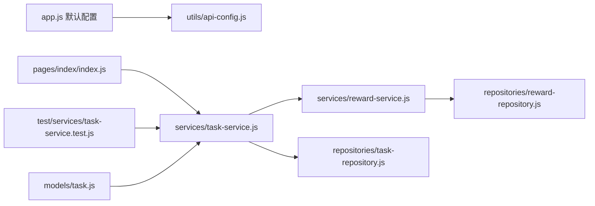

# 里程碑-11：稳定性收口 详细设计文档

> **设计状态**：🟢 已完成
> **创建日期**：2026-03-25
> **设计者**：GPT5 Codex
> **审核者**：项目维护者
> **预计工期**：2-3天

---

## 📋 目录

- [需求分析](#需求分析)
- [技术方案](#技术方案)
- [代码结构](#代码结构)
- [实施步骤](#实施步骤)
- [测试方案](#测试方案)
- [风险评估](#风险评估)
- [替代方案](#替代方案)

---

## 需求分析

### 功能描述

项目已完成 M07-M10 的云同步闭环，当前主要风险已从“有没有功能”转为“关键链路是否稳定、默认行为是否安全、文档是否与真实仓库一致”。综合评审和当前仓库复核表明，M11 不适合继续叠加普通功能，而应先完成一轮稳定性收口，消除会直接影响开发、测试和真实使用的高优先级问题。

本阶段以“正确性恢复”和“入口治理”作为核心目标，只处理已经被代码、测试或文档事实验证的问题，不做结构性重构。M11 的完成标准不是系统变得更优雅，而是让主质量闸门恢复可信、默认配置更安全、任务重置和锁定逻辑回到正确作用域、潜伏 bug 被清除、文档入口与仓库现状重新对齐。

### 业务价值

- [x] 用户价值：降低因默认连到测试后端、奖励锁定误判、任务重置异常而影响真实使用的风险。
- [x] 技术价值：恢复测试闸门可信度，避免后续 M12/M13 在不稳定基线上继续叠加复杂度。
- [x] 业务价值：通过低风险收口为后续结构治理和质量闸门升级建立可靠起点。

### 事实基线（2026-03-25，实施前）

- 前端关键测试当前仍非全绿：
  - `npm test -- --runInBand test/services/task-service.test.js`
  - 结果：`116` 个用例中 `114` 通过，`2` 失败
  - 失败点：`M08 - _generateRepeatTasks 批量云端同步`
- 默认 API 配置仍会在未显式选择环境时自动启用，并落到 `https://api.todoceo.xyz/test/`
  - `app.js`
  - `utils/api-config.js`
- 任务重置锁定当前按“全局最后兑换时间”判断，而不是按任务归属用户或当前语义范围判断：
  - `services/task-service.js`
  - `services/reward-service.js`
- 首页仍存在语义不一致调用：`rewardService.getLastExchangeTime(id)`，但服务实现并不接收该参数：
  - `pages/index/index.js`
- `models/task.js` 中存在已确认的兼容缺陷：`_initDefaults()` 第 121-123 行为不可达死代码，且分支内引用未定义的 `data`
- 关键大文件规模仍然偏大，但这属于 M12 结构治理议题，不纳入 M11 实施范围：
  - `pages/index/index.js` 3017 行
  - `services/task-service.js` 2600 行
  - `services/message-service.js` 2081 行
  - `services/star-service.js` 1713 行
  - `services/reward-service.js` 1637 行
  - `app.js` 1029 行

### 功能范围

**包含**：
- ✅ 修复当前已确认的测试红灯，恢复 `TaskService` 主测试套件全绿
- ✅ 收紧默认 API 环境配置，避免未显式配置时自动落到测试后端
- ✅ 修正任务重置锁定逻辑的作用域，避免多孩子/家庭场景下误锁
- ✅ 修复已确认的潜伏正确性 bug 与语义不一致调用
- ✅ 修正文档中与当前仓库不一致的命令、入口、版本和测试口径
- ✅ 为上述修复补齐针对性回归测试

**不包含**（明确边界）：
- ❌ 拆分 `app.js`、首页脚本和高复杂服务
- ❌ 统一页面刷新策略或重建同步编排机制
- ❌ 扩大正式覆盖率统计口径到页面层、适配器层、启动层
- ❌ 首页/奖池页视觉改版和主路径体验重设计
- ❌ 新增业务功能或新云端能力

### 优先级

- **优先级**：P0
- **理由**：本阶段修复项都已对应真实红灯、真实错误默认行为或真实潜伏 bug，不处理会继续削弱后续里程碑的设计和实施基础。

### 实施结果（2026-03-25）

- `TaskService._generateRepeatTasks()` 已修复 weekly 重复任务在 `startDate < today` 时破坏原始节奏的问题，并补齐回归测试
- `utils/api-config.js` 与 `app.js` 已改为显式配置才启用 API，空配置默认回到本地模式
- `TaskService.resetTask()` 与首页取消完成预检查已统一按任务归属用户查询最后兑换时间，并复用 `Task.canBeUnchecked(...)` 语义
- `Task` 模型已将旧字段 `pointsValidPeriod` 的兼容前移到构造阶段，原 `_initDefaults()` 不可达分支已清理
- 与当前环境切换方式直接相关的部署文档已同步为显式配置口径
- 前端全量 Jest 套件已重新跑通

---

## 技术方案

### 方案概述

M11 采用“最小必要修复 + 明确契约 + 文档对齐”的策略，不做大范围重构。所有改动都围绕已证实的问题点展开，优先在现有职责边界内修复：测试契约回归到实现契约一致、默认环境从“自动启用”改为“显式启用”、任务锁定从“全局时间”改为“按用户/语义范围判断”、模型兼容分支中的潜伏错误直接修正、文档入口与真实使用方式重新对齐。

M11 的核心原则：

1. 先恢复正确性，再谈结构治理。
2. 只修复已经被代码、测试或文档复核证实的问题。
3. 避免为了修复稳定性问题而引入跨层大重构，把结构治理留给 M12。
4. 所有修复必须带回归测试或文档校验点，避免同类问题二次回归。

### 技术选型

| 技术点 | 选择方案 | 替代方案 | 选择理由 |
|--------|---------|---------|---------|
| 重复任务测试红灯修复 | 以现有 `TaskService` 契约为准，修正重复任务生成与 fire-and-forget 同步行为/测试基线 | 直接删除相关测试 | 红灯反映真实契约漂移，不能靠删测试掩盖 |
| 默认环境配置 | 改为“默认关闭 API，只有显式配置时才启用” | 保持自动启用，仅换默认地址 | 自动启用本身就是风险源 |
| 奖励锁定作用域 | 按任务归属用户或明确用户范围计算最后兑换时间 | 保持全局最后兑换时间 | 多孩子场景下会误锁无关任务 |
| 潜伏兼容缺陷修复 | 删除或重构不可达兼容分支，并修正错误调用 | 延后到 M12 重构时一并处理 | 已是代码正确性缺陷，不应继续滞留 |
| 文档收口 | 只修正与 M11 直接相关的入口、命令、状态和测试口径 | 顺手全面重写文档 | 控制范围，避免文档治理再次膨胀 |

### DDD分层设计

**领域层（models/）**：
- [x] 修改模型：`models/task.js`
- 说明：
  - 修正 `_initDefaults()` 中不可达的旧字段兼容分支
  - 保持既有字段语义不变，不做模型结构重设计

**服务层（services/）**：
- [x] 修改服务：`services/task-service.js`
- [x] 复用现有能力：`services/reward-service.js`
- 说明：
  - `TaskService` 修复重复任务批量云同步主流程中的返回契约与同步标记行为
  - `TaskService.resetTask()` 改为使用与任务归属用户一致的奖励锁定判断，调用已存在的 `getLastExchangeTimeByUser(userId)`
  - `RewardService.getLastExchangeTimeByUser(userId)` 已存在，M11 重点是复用该方法并在必要时校正其注释或语义说明，而不是重新设计接口

**仓储层（repositories/）**：
- [x] 评估无需修改：`repositories/reward-repository.js`
- 说明：
  - 若 `RewardService.getLastExchangeTimeByUser()` 现有实现无法满足性能或语义要求，再补充仓储级过滤方法
  - 若现有读取已足够，则不引入仓储改动

**适配器层（adapters/ / utils/）**：
- [x] 修改配置：`utils/api-config.js`
- 说明：
  - 收紧 API 默认启用逻辑
  - 明确“未配置即本地模式 / API 默认关闭”的默认行为

**应用入口层（app.js）**：
- [x] 修改入口：`app.js`
- 说明：
  - 去除自动把 `ENABLE_API` 设为 `true`、自动写入测试后端地址的行为
  - 保留显式配置下的初始化流程

**表现层（pages/）**：
- [x] 修改页面：`pages/index/index.js`
- 说明：
  - 修正首页预检查奖励锁定逻辑，不再把 `getLastExchangeTime(id)` 的时间戳结果直接当布尔锁定状态
  - 优先方案：使用 `currentTask.userId` 调用已存在的 `getLastExchangeTimeByUser(userId)`，并与 `currentTask.canBeUnchecked(lastExchangeTime)` 保持同口径
  - 备选方案：若页面侧难以保证与服务层完全一致，则删除该预检查，直接以 `TaskService.resetTask()` 返回的 `locked` 结果为准
  - 不在 M11 中扩展页面刷新编排或做视觉调整

**文档层（docs/）**：
- [x] 修改文档：与 M11 直接相关的设计、路线图和开发说明
- 说明：
  - 仅修正当前仓库已确认漂移的命令、状态和入口信息
  - M11 完成后再写入 `CHANGELOG.md`

### 环境切换兼容策略

M11 的目标是收紧“默认行为”，不是移除双环境能力。为避免影响当前“用户环境 + 测试环境”并行使用，M11 明确采用以下兼容策略：

1. 保留双环境切换能力：
   - 正式用户环境：显式设置 `ENABLE_API=true` + 正式 `API_BASE_URL`
   - 测试环境：显式设置 `ENABLE_API=true` + 测试 `API_BASE_URL`
   - 未配置环境：默认 `ENABLE_API=false`，回到本地模式
2. M11 取消的只有“空配置自动落到测试后端”这条隐式路径，不取消测试环境本身。
3. 若当前发包流程依赖预置环境，则应继续通过预置 `wx` 存储或等价初始化脚本写入配置，而不是依赖运行时自动补默认值。
4. M11 实施后，测试包和正式包都应具备“显式环境身份”，避免用户安装后误连测试环境。
5. 若项目后续需要更稳定的双环境分发，可在 M13 或单独文档中补充“环境预置脚本 / 切换工具”，但不属于 M11 必做范围。

### 架构图



### 数据模型

M11 不引入新模型，只修正现有模型兼容逻辑中的不可达分支和错误引用。

```typescript
interface TaskCompatInput {
  pointsExpiry?: string | null;
  pointsValidPeriod?: string | null;
}
```

说明：

1. `Task` 模型仍需明确如何兼容旧字段 `pointsValidPeriod`；若默认值逻辑已覆盖该场景，则应删除死代码分支，而不是保留不可达实现。
2. M11 不调整 `Task`、`Reward`、`Message` 的持久化字段结构。

### 接口设计

**调整服务接口**：

| 方法 | 说明 | 参数 | 返回值 |
|------|------|------|--------|
| `RewardService.getLastExchangeTimeByUser` | 已有方法，获取指定用户范围的最后兑换时间，供任务锁定判断使用 | `userId` | `Promise<number|null>` |
| `TaskService._generateRepeatTasks` | 保持“本地生成为主、云同步补充”的契约，但修正返回值和同步标记行为 | `task` | `Promise<Task[]>` |

**接口约束说明**：

1. `getLastExchangeTime()` 保留为全局查询接口，仅用于全局统计或历史视图，不再用于任务锁定判断，也不再接受伪参数调用。
2. `resetTask()` 的锁定判断必须与任务归属用户绑定，不能再依赖全局最近兑换时间。
3. `_generateRepeatTasks()` 返回值必须稳定反映“本地已生成的实例列表”，不因异步云同步失败而返回空数组。

---

## 代码结构

### 文件变更清单

**新增文件**：
- `docs/design/milestone-11-stability-hardening.md` - M11 详细设计文档

**修改文件**：
- `services/task-service.js` - 修复重复任务批量云同步与任务锁定判断
- `models/task.js` - 清理不可达兼容分支
- `utils/api-config.js` - 收紧默认 API 配置
- `app.js` - 移除自动落到测试后端的启动默认行为
- `pages/index/index.js` - 修正奖励锁定预检查调用语义
- `test/services/task-service.test.js` - 修复并补强 M11 回归测试
- `test/pages/index.reward-flow.test.js` - 补齐首页奖励锁定预检查回归测试
- `test/models/task.test.js` - 补齐旧字段兼容回归测试
- `test/utils/api-config.test.js` - 补齐环境配置回归测试
- `docs/development/ROADMAP.md` - 将 M11 状态更新为已完成
- `docs/development/CHANGELOG.md` - 记录 M11 交付结果与验证摘要
- `docs/deployment/真机测试部署指南.md` - 改为显式环境配置口径
- `docs/deployment/后端部署小白指引.md` - 改为显式环境配置口径
- `docs/deployment/HTTPS配置详细指南.md` - 改为显式环境配置口径
- `docs/deployment/腾讯云轻量服务器部署指南.md` - 改为显式环境配置口径
- 其他直接相关文档 - 修正 M11 处理范围内的漂移项

### 核心代码结构

```javascript
// TaskService: 保持本地生成任务为主，云同步作为后续补充
async _generateRepeatTasks(task) {
  const repeatTasks = this._buildRepeatTaskInstances(task);

  if (repeatTasks.length > 0) {
    await this.taskRepository.saveAll(repeatTasks);
  }

  if (this.enableCloudStorage && repeatTasks.length > 0) {
    this._syncRepeatTasksInBatches(repeatTasks).catch(() => null);
  }

  return repeatTasks;
}

async resetTask(taskId, userId = null) {
  const task = await this._loadTaskForReset(taskId, userId);
  const lastExchangeTime = this.rewardService
    ? await this.rewardService.getLastExchangeTimeByUser(task.userId)
    : null;

  if (!task.canBeUnchecked(lastExchangeTime)) {
    return { success: false, locked: true };
  }

  // ... existing reset flow
}
```

### 关键函数

**函数1**：`TaskService._generateRepeatTasks`
- **输入**：重复任务父任务 `task`
- **输出**：本地已生成的重复任务实例列表
- **职责**：生成本地重复任务、触发后续批量补云、确保返回契约与同步状态行为稳定
- **依赖**：`taskRepository.saveAll`、`_createRepeatTaskInstance`、`_syncTaskToCloud`

**函数2**：`RewardService.getLastExchangeTimeByUser`
- **输入**：`userId`
- **输出**：该用户相关奖励的最后兑换时间
- **职责**：为任务锁定判断提供正确的用户范围查询
- **依赖**：`rewardRepository.getClaimedRewards`

**函数3**：`Task._initDefaults`
- **输入**：模型初始化输入
- **输出**：标准化后的 `Task` 默认字段
- **职责**：处理旧字段兼容和默认值补齐
- **依赖**：构造输入对象本身

---

## 实施步骤

### 第1步：恢复重复任务云同步测试契约（预计0.5天）

- [x] **任务**：复核并修复 `_generateRepeatTasks` 的本地返回值、异步补云与 `syncedToCloud` 标记行为
- [x] **验证**：`test/services/task-service.test.js` 中 M08 批量云同步场景全绿
- [x] **依赖**：无

**实施要点**：
1. 明确“本地生成成功”与“云同步成功”两个阶段的契约边界。
2. 确认 `saveAll` 至少包含本地保存和成功回写两类可观察行为，或在必要时调整测试使其匹配正式契约。
3. 保证云同步失败不影响已生成本地实例的返回值。
4. 明确 fire-and-forget 的正式契约：
   - 若契约要求“同步成功后立即回写 `syncedToCloud`”，则需要让测试能可靠等待该阶段完成
   - 若契约只要求“本地优先，补云状态后续更新”，则应把测试断言收敛到本地返回值和可观察的异步副作用，而不是强绑实现时序

---

### 第2步：收紧默认 API 配置（预计0.5天）

- [x] **任务**：移除启动阶段自动写入 `ENABLE_API=true` 和测试后端地址的行为
- [x] **验证**：未显式配置环境时，应用保持本地模式；显式配置时仍可进入 API 模式
- [x] **依赖**：无

**实施要点**：
1. 统一 `app.js` 与 `utils/api-config.js` 的默认值语义。
2. 将“微信环境未配置时默认启用 API”改为“未配置时默认关闭 API，必须显式配置才启用”。
3. 将默认 `BASE_URL` 从自动落测试地址改为仅在 API 显式开启且显式配置时生效。
4. 保留显式环境配置优先级，不影响已有测试/开发环境切换方式。
5. 明确双环境兼容规则：测试环境和正式环境继续支持显式预置配置，不依赖运行时自动写默认值。
6. 补充配置回归测试或最小可验证断言，防止未来再次默认落测试环境。

---

### 第3步：修正任务锁定作用域与错误调用（预计0.5天）

- [x] **任务**：让任务重置锁定逻辑按任务归属用户生效，并修正首页错误调用签名
- [x] **验证**：多孩子场景下，无关孩子的兑换记录不会错误锁住当前任务
- [x] **依赖**：第1步可并行

**实施要点**：
1. `resetTask()` 使用 `task.userId` 作为锁定判断主语义，并切换到已存在的 `getLastExchangeTimeByUser(userId)`。
2. 首页预检查不再将时间戳直接当作布尔锁定状态，而是与 `currentTask.canBeUnchecked(lastExchangeTime)` 使用同一套判断口径。
3. 若页面侧无法稳定复用同一逻辑，则移除该预检查，统一以后端/服务层 `locked` 返回为准。
4. 若全局查询接口仍保留，需在命名和调用点上显式区分用途。

---

### 第4步：修复潜伏正确性缺陷（预计0.5天）

- [x] **任务**：清理 `Task` 模型中的不可达兼容分支，并修正 M11 范围内已确认的语义错位
- [x] **验证**：模型初始化和旧字段兼容场景语义明确，且单测覆盖
- [x] **依赖**：无

**实施要点**：
1. 将 `models/task.js` 中 `_initDefaults()` 的不可达兼容分支删除或按真实兼容需求重构。
2. 优先处理已明确证实的错误，不在本步骤扩展为大规模模型重构。
3. 为兼容路径或分支删除结果补最小回归测试。

---

### 第5步：文档与验证收口（预计0.5天）

- [x] **任务**：修正 M11 直接相关文档漂移，并记录验证结果
- [x] **验证**：设计、路线图、命令说明与当前仓库真实状态一致
- [x] **依赖**：前四步完成

**实施要点**：
1. 更新设计文档状态和 `ROADMAP` 实施状态。
2. 校对与 M11 相关的命令、测试入口、版本信息。
3. M11 完成后再在 `CHANGELOG.md` 记录最终结果和验证摘要。

---

## 测试方案

### 单元测试

| 测试项 | 测试方法 | 预期结果 |
|--------|---------|---------|
| 重复任务批量云同步成功 | 运行 `test/services/task-service.test.js` 中 M08 场景 | 本地保存与 `syncedToCloud` 回写行为符合契约 |
| 重复任务批量云同步失败 | Mock 云端失败 | 本地实例返回不受影响，失败只影响补云结果 |
| 任务锁定按用户作用域判断 | 构造多孩子奖励兑换数据 | 无关孩子的兑换时间不锁住当前任务 |
| Task 模型兼容旧字段 | 新增 `models/task` 相关单测 | `pointsValidPeriod` 兼容路径不抛异常 |
| 默认 API 配置安全默认值 | 新增或调整配置测试 | 未显式配置时不自动启用 API 模式 |
| 双环境显式配置兼容 | Mock `ENABLE_API=true` + 不同 `API_BASE_URL` | 测试环境和正式环境都可通过显式配置进入云端模式 |

### 集成测试

- [x] 场景1：共享设备多孩子场景下，孩子 A 的奖励兑换不应锁住孩子 B 的任务重置
- [x] 场景2：重复任务创建后，本地实例可见，异步补云成功后同步标记正确
- [x] 场景3：未配置 API 环境时，应用启动不应自动写入测试后端地址
- [x] 场景4：显式预置测试环境 / 正式环境配置时，应用仍可进入对应云端环境

### 手动测试

1. **功能测试**：
   - [x] 未设置 `ENABLE_API` / `API_BASE_URL` 时启动应用，确认不自动切到测试后端
   - [x] 预置测试环境配置后启动应用，确认进入测试后端
   - [x] 预置正式环境配置后启动应用，确认进入正式后端
   - [x] 家长设备在多孩子家庭下分别操作两个孩子，验证奖励兑换锁定只作用于对应孩子
   - [x] 创建重复任务并观察本地列表、同步状态和后续页面可见性

2. **回归测试**：
   - [x] 任务创建、完成、重置主链路未破坏
   - [x] 奖励兑换、消息生成和首页展示未因 M11 修复回归

### 实际验证结果

- `npm test -- --runInBand test/services/task-service.test.js` -> 117/117 通过
- `npm test -- --runInBand test/utils/api-config.test.js test/services/user-service.test.js test/services/service-manager.test.js` -> 77/77 通过
- `npm test -- --runInBand test/services/task-service.test.js test/pages/index.reward-flow.test.js` -> 127/127 通过
- `npm test -- --runInBand test/models/task.test.js` -> 53/53 通过
- `npm test -- --runInBand` -> 前端全量 Jest 套件通过

### 测试覆盖率目标

- 变更模块的新增/修改分支必须有回归测试覆盖
- M11 不追求整体覆盖率大幅提升，重点是恢复质量闸门可信度

---

## 风险评估

### 技术风险

| 风险项 | 影响 | 概率 | 应对措施 |
|--------|------|------|---------|
| 修复 `_generateRepeatTasks` 时误伤既有异步补云行为 | 高 | 中 | 先锁定测试契约，再做最小修改并补场景测试 |
| 调整默认 API 配置后影响当前开发联调习惯 | 中 | 中 | 保留显式开启方式，并在文档中写清配置入口 |
| 奖励锁定范围调整后与历史数据语义不一致 | 中 | 中 | 优先使用任务归属用户为主语义，并补多孩子回归测试 |
| 修正文档漂移时再次扩大修改范围 | 低 | 中 | 仅修正 M11 直接相关文档，不做额外文档整治 |

### 兼容性说明

1. M11 不改变核心业务模型结构，不涉及数据库迁移。
2. M11 只收紧默认值，不移除显式 API 模式。
3. 若发现奖励锁定逻辑在部分旧数据下无法仅凭 `userId` 判定，需在实施阶段记录并评估是否追加最小兼容处理，但不扩大为 M12 级重构。

---

## 替代方案

### 方案A：先做 M12 结构治理，再回头修稳定性

- **优点**：可以顺便拆大文件、重构职责边界
- **缺点**：在测试红灯、默认环境风险和正确性缺陷仍存在的基础上做重构，风险过高
- **结论**：不采用

### 方案B：只修测试红灯，不处理默认配置和锁定作用域

- **优点**：工期更短
- **缺点**：会把真实使用风险继续留在生产路径上，M11 名义上“稳定性收口”但实质不完整
- **结论**：不采用

### 方案C：M11 只做最小必要收口，结构治理与质量升级后置到 M12/M13

- **优点**：范围清晰、风险可控、与现有路线图分工一致
- **缺点**：无法一次性消化全部技术债
- **结论**：采用
