# 里程碑-12：前端结构治理 详细设计文档

> **设计状态**：✅ 已完成
> **创建日期**：2026-03-25
> **完成日期**：2026-03-26
> **设计者**：GPT5 Codex
> **审核者**：项目维护者
> **预计工期**：4-6天

---

## 📋 目录

- [需求分析](#需求分析)
- [技术方案](#技术方案)
- [代码结构](#代码结构)
- [实施步骤](#实施步骤)
- [测试方案](#测试方案)
- [风险评估](#风险评估)
- [替代方案](#替代方案)

---

## 需求分析

### 功能描述

M11 已经把高优先级正确性问题收口，当前主风险不再是“功能错误”，而是前端关键入口的结构复杂度过高，导致后续改动成本、回归成本和协作成本持续上升。M12 的目标不是改业务，而是在不改变当前用户行为、双环境切换方式、登录语义和云同步契约的前提下，把启动链、首页编排和任务服务内部职责拆清楚。

这次设计只基于仓库真实代码，不做假想式重构。当前需要治理的重点都已有明确代码证据：`app.js` 同时负责环境读取、登录恢复、服务初始化、登录后补偿、设备监听和欢迎消息；`pages/index/index.js` 同时承担生命周期、用户视角初始化、并行加载、任务操作、奖励动画和事件回流；`services/task-service.js` 同时承担查询、写入、重复任务生成、惩罚处理、云同步、冲突保护和删除墓碑管理。它们已经是后续 M13/M14 的实际阻塞点。

### 业务价值

- [x] 用户价值：在不改变现有功能的前提下，降低后续迭代引入回归的概率，尤其是首页、登录和任务主链路。
- [x] 技术价值：缩小关键文件复杂度，建立更清晰的模块边界，为 M13 质量闸门扩展提供稳定落点。
- [x] 业务价值：让团队后续并行开发时可以按模块分工，减少多人同时碰同一超大文件的冲突。

### 事实基线（2026-03-25，设计前）

#### 1. 关键文件体量仍然偏大

- `app.js`：995 行
- `pages/index/index.js`：3024 行
- `services/task-service.js`：2608 行
- `services/message-service.js`：2081 行
- `services/star-service.js`：1713 行
- `services/reward-service.js`：1637 行
- `services/user-service.js`：922 行

其中 M12 直接处理的是前三者；其余大文件暂不纳入本阶段实施。

#### 2. `app.js` 的职责已明显混合

当前 `app.js` 中同时存在以下真实职责：

- `onLaunch()` 内完成环境配置读取、本地存储初始化、`UserService` 启动策略分支、`ServiceManager` 初始化、`wx.login` 登录流
- `postLoginInitialization()` 内顺序执行任务惩罚检查、即将过期星星保护、星星初始化与修复、消息初始化、首次启动欢迎消息、主题设置
- `doCloudLogin()`、`autoLogin()`、`getWxLoginCode()` 存在重复登录链路
- `setupOrientationListener()`、`setupThemeChangeListener()`、`setupFontSizeChangeListener()`、`updateHeightParams()` 属于运行时设备监听职责

额外确认到两处实际结构问题：

1. `onLaunch()` 已包含一套云端登录初始化逻辑，后续又在 `wx.login` 成功回调里再次进入登录后初始化，职责交织。
2. `autoLogin()` 直接使用 `wx.request`，而 `onLaunch()` / `doCloudLogin()` 使用 `HttpClient`，同一登录语义存在双实现。

#### 3. 首页编排不是单一问题，而是多类职责同时耦合

`pages/index/index.js` 当前至少混合了以下职责：

- 生命周期与服务就绪等待：`onLoad()`、`onShow()`、`waitForServicesReady()`、`waitForLoginComplete()`
- 用户视角初始化：`initializeMultiUserSystem()`、`initializeMultiUserSystemDelayed()`
- 页面数据编排：`checkExpiredTasksAndStars()`、`loadAllPageData()`、`loadTaskDataOnly()`、`loadMessageData()`、`loadStarsAndRewards()`
- 任务交互：`completeTask()`、`refreshTaskDataForCurrentView()`
- 奖励流转动画：`checkRewardUnlock()`、`_handleRewardCompletion()`、`showRewardChoiceDialog()`、`transitionToNewTarget()`
- 事件回流与局部刷新：`handleTaskDataChanged()`、`handleRewardUpdated()`、`handleMessageDataChanged()`

已确认的结构性不一致点：

1. `onLoad()` 调 `initializeMultiUserSystemDelayed()`，`onShow()` 又 `await initializeMultiUserSystem()`，存在双入口初始化。
2. `loadAllPageData()` 并行调用三个加载函数，而每个函数内部都独立 `setData`，页面刷新并未真正统一。
3. `handleTaskDataChanged()` 在删除和普通分支中都直接调用 `getTodayTasks(...)`，这与 `refreshTaskDataForCurrentView()` 保留当前日期视图的语义不一致；当前结构已经出现“同一页面存在两套刷新口径”的事实。

#### 4. `TaskService` 目前是“超级服务”

`services/task-service.js` 当前同时负责：

- 任务查询：`getAllTasks()`、`getTasksByDate()`、`getTasksByDateRange()`、`getTasksByScope()`
- 任务写操作：`createTask()`、`updateTask()`、`deleteTask()`、`updateTaskStatus()`、`resetTask()`
- 重复任务生成：`_generateRepeatTasks()`
- 惩罚与状态扫描：`checkTasksStatus()`、`handleRequiredTaskPenalty()`
- 云同步读写：`_fetchTasksFromCloud()`、`_fetchSingleTaskFromCloud()`、`_syncTaskToCloud()`、`_syncUpdateToCloud()`、`_syncDeleteToCloud()`、`_syncStatusToCloud()`
- 本地/云端冲突保护、墓碑管理、待同步元数据、操作者上下文

已确认的重复模式也比较明显：

1. `updateTask()`、`deleteTask()`、`updateTaskStatus()`、`resetTask()` 都先做“本地 miss 时云端补拉”的同类写前加载。
2. 查询语义、写入语义、同步语义和惩罚语义都压在同一类中，导致局部变更很难验证影响面。

### 功能范围

**包含**：

- ✅ 拆分 `app.js` 启动与登录后初始化链路，保留现有行为语义
- ✅ 拆分首页生命周期、数据刷新、任务交互和奖励流转编排
- ✅ 拆分 `TaskService` 内部职责，保留外部调用接口不变
- ✅ 建立首页统一刷新口径，消除“今天任务”和“当前视图任务”并存的编排分叉
- ✅ 为结构拆分补充最小必要的回归保护测试

**不包含**：

- ❌ 修改环境切换方式，不改 `ENABLE_API` / `API_BASE_URL` 的当前显式配置策略
- ❌ 修改登录业务语义、家庭/孩子权限语义、奖励锁定语义
- ❌ 视觉改版或首页信息架构重设计
- ❌ 扩大正式测试覆盖口径到全页面、全启动链路统计，这是 M13 议题
- ❌ 重构 `MessageService`、`StarService`、`RewardService` 等其他大服务

### 优先级

- **优先级**：P1
- **理由**：这不是立即影响用户正确性的 P0 缺陷，但已经是后续迭代、测试和多人协作的明确阻塞项；若继续在当前结构上叠加 M13/M14，回归风险会明显放大。

---

## 技术方案

### 方案概述

M12 采用“外部接口稳定、内部组织重构”的策略。原则是：不改页面路由、不改服务名、不改已有公共 API 签名，优先通过新增内部模块和门面委托，把复杂逻辑从超大文件中平移出去。这样做的核心收益是降低实施风险，避免在结构治理阶段同时引入大范围调用方改造。

本阶段只做三类治理：

1. `app.js` 从“完整业务入口”收敛为“应用生命周期壳层”。
2. 首页从“所有事情都写在 Page 对象里”收敛为“Page 壳层 + 局部编排模块”。
3. `TaskService` 从“超级服务”收敛为“稳定 facade + 内部分工模块”。

### 技术选型

| 技术点 | 选择方案 | 替代方案 | 选择理由 |
|--------|---------|---------|---------|
| 启动链拆分 | 新增应用级编排模块，由 `app.js` 调用 | 继续在 `app.js` 内用私有函数分段 | 当前重复登录链路已经跨函数分散，单文件继续堆私有函数收益有限 |
| 首页拆分 | 在 `pages/index/` 下新增本地模块并按职责混入 Page | 直接拆成多个页面或改框架 | 当前需求是降低复杂度，不是重做页面模型 |
| `TaskService` 拆分 | 保留 `services/task-service.js` facade，内部委托给子模块 | 直接重命名/替换服务 | 现有调用面大，先稳定 facade 风险最低 |
| 模块导出模式 | 纯函数导出 / 工厂函数导出 | Class 实例化 | 小程序 CommonJS 场景下更直接，模块更轻，测试时也更容易传入 page/app/host mock |
| 刷新治理 | 建立统一 refresh coordinator，明确 full/tasks/messages/rewards 四类刷新 | 继续在各事件处理器里各自调用 | 现有“多套刷新口径”已经是实际问题 |
| 测试策略 | 只补结构边界保护测试和关键回归测试 | 立即做全面覆盖率升级 | 全面质量闸门升级属于 M13，不应与结构治理混做 |

### DDD分层设计

M12 不改领域模型和仓储模型，只调整应用层和服务层的组织方式。

**领域层（models/）**：

- [ ] 不新增模型
- [ ] 不修改核心业务语义
- 说明：`Task`、`Reward`、`User` 等模型语义保持不变

**服务层（services/）**：

- [x] 修改门面：`services/task-service.js`
- [x] 新增内部模块目录：`services/task-service/`
- 说明：
  - `task-service.js` 保留现有对外方法名
  - 查询、写入、重复任务、惩罚扫描、云同步拆为内聚模块

**应用编排层（新增轻量模块）**：

- [x] 新增目录：`utils/app/`
- [x] 新增目录：`pages/index/modules/`
- 说明：
  - `utils/app/` 存放应用启动、登录恢复、登录后初始化、运行时监听编排
  - `pages/index/modules/` 存放首页生命周期、刷新编排、任务动作、奖励流转、用户视角初始化逻辑

**表现层（pages/）**：

- [x] 修改页面：`pages/index/index.js`
- 说明：
  - 页面保留数据定义、事件绑定入口和少量页面专属 UI 方法
  - 复杂异步编排转移到局部模块

### 设计原则

1. **对外稳定**：`getApp().getService(...)`、`serviceManager.getService(...)`、`taskService.*` 的公共入口不变。
2. **行为不变**：环境切换、登录、任务完成/重置、奖励动画、视角切换不改业务结果。
3. **分层清晰**：Page 不直接拼装过多跨域流程；`TaskService` 不再同时承担全部内部实现细节。
4. **先提炼重复，再切文件**：优先抽出重复流程和统一口径，再移动代码。

### 架构图

```mermaid
graph TD
    A[app.js] --> B[utils/app/runtime-observers.js]
    A --> C[utils/app/bootstrap-auth.js]
    A --> Q[utils/app/bootstrap-services.js]
    A --> D[utils/app/post-login-bootstrap.js]

    E[pages/index/index.js] --> F[pages/index/modules/index-lifecycle.js]
    E --> G[pages/index/modules/index-refresh-coordinator.js]
    E --> H[pages/index/modules/index-task-actions.js]
    E --> I[pages/index/modules/index-reward-flow.js]
    E --> J[pages/index/modules/index-user-context.js]

    K[services/task-service.js facade] --> L[task-query.js]
    K --> M[task-write.js]
    K --> N[task-repeat.js]
    K --> O[task-penalty.js]
    K --> P[task-sync.js]
```



### 模块拆分设计

#### 1. `app.js` 收敛方案

`app.js` 最终只保留五类内容：

- `App({...})` 壳层定义与 `globalData`
- 生命周期入口：`onLaunch()`、`onShow()`
- 对外 getter：`getService()`、`getTaskService()`、`getUserService()` 等
- 对外运行时/认证 wrapper：`doCloudLogin()`、`doCloudLogout()`、`autoLogin()`、`getWxLoginCode()`、`globalEvent()`
- 少量纯页面无关工具：`compareVersion()` 这类无业务状态依赖的方法

建议新增模块：

- `utils/app/bootstrap-auth.js`
  - 负责 token 检查、缓存用户恢复、云端登录执行、`UserService` 注入
  - 统一 `onLaunch()`、`doCloudLogin()`、`autoLogin()` 中重复的登录流程
- `utils/app/bootstrap-services.js`
  - 负责 `ServiceManager` 初始化
  - 只做服务初始化，不混入登录后补偿逻辑
- `utils/app/post-login-bootstrap.js`
  - 负责 `fixLegacyTaskData`、`checkTasksStatus`、星星保护、消息初始化、首次欢迎消息
- `utils/app/runtime-observers.js`
  - 负责方向、窗口、主题等监听及 `updateHeightParams()` 相关逻辑

明确边界：

- M12 不改变是否调用这些逻辑，只改变组织位置。
- `postLoginInitialization()` 可保留为门面方法，但内部全部委托给 `post-login-bootstrap.js`。
- `doCloudLogin()`、`doCloudLogout()`、`autoLogin()`、`getWxLoginCode()`、`globalEvent()` 继续保留在 App 实例上作为稳定入口；允许内部委托，不允许对外消失或改名。
- `setupOrientationListener()`、`setupFontSizeChangeListener()`、`updateHeightParams()`、`setTheme()` 若下沉到运行时模块，也必须保留当前运行时回调链路和 `globalData` 更新语义。

#### 2. 首页模块化方案

建议在 `pages/index/modules/` 下拆成五类模块：

- `index-lifecycle.js`
  - `onLoad` / `onShow` 的异步编排辅助
  - `waitForServicesReady`、`waitForLoginComplete`
- `index-user-context.js`
  - `initializeMultiUserSystem`
  - `initializeMultiUserSystemDelayed`
  - 与 `currentUser` / `loginUser` / `isReadonlyView` 计算相关逻辑
- `index-refresh-coordinator.js`
  - 统一定义四类刷新入口：
    - `refreshPageData`
    - `refreshTasksForCurrentView`
    - `refreshMessages`
    - `refreshRewards`
  - 负责决定何时检查过期、何时并行、何时追加 `checkUpcomingTasks`
- `index-task-actions.js`
  - 任务完成、取消完成、刷新后提示、任务锁定预检查
- `index-reward-flow.js`
  - `checkRewardUnlock`
  - `_handleRewardCompletion`
  - `showRewardChoiceDialog`
  - `continueCollecting`
  - `transitionToNewTarget`

统一刷新规则：

1. 首页只允许通过 refresh coordinator 发起数据加载，不再让事件处理器直接拼装服务调用。
2. “当前日期视图”是任务刷新唯一口径；事件回流不得再硬编码 `getTodayTasks()`。
3. `loadAllPageData()` 重构为 coordinator 内部方法，页面层不再手写三个并行请求。
4. `setData` 尽量按刷新批次聚合，减少一次刷新中多次独立提交。

`setData` 合并策略约束：

1. coordinator 内部各加载函数默认返回“数据片段”，而不是直接提交 UI。
2. 只有页面专属即时反馈仍允许局部 `setData`，例如按钮 loading、弹窗显隐、动画状态。
3. 页面完整刷新时优先采用“一次收集、一次提交”模式，降低渲染抖动。
4. 任何被 WXML、组件事件或 EventBus 直接绑定的方法，都必须继续挂在 `Page({...})` 实例上；允许改为委托模块实现，不允许直接移除或改名。

首页入口兼容约束：

1. WXML 当前直接绑定的入口方法必须稳定，例如 `completeTask`、`onRewardComplete`、`continueCollecting`、`handleUserSwitch`、`handleUserAdd`、`handleUserDelete`、`handleNicknameEdit`、`toggleMessagePreview`、`navigateToUserProfile`。
2. `onLoad()` 中注册到 `_eventHandlers` 的方法必须继续存在于页面实例上，例如 `handleTaskDataChanged`、`handleTaskCreated`、`handleMessageDataChanged`、`handleRewardClaimed`、`handleRewardUpdated`、`handleProgressBarComplete`。
3. 模块化后的推荐模式是“Page 保留同名入口，内部转调模块函数”，而不是让 WXML 或 EventBus 直接依赖模块文件。

```javascript
async function refreshPageData(page, options = {}) {
  const updates = {};

  if (options.refreshTasks !== false) {
    Object.assign(updates, await loadTasksForView(page));
  }

  if (options.refreshMessages !== false) {
    Object.assign(updates, await loadMessagesSnapshot(page));
  }

  if (options.refreshRewards !== false) {
    Object.assign(updates, await loadRewardsSnapshot(page));
  }

  if (Object.keys(updates).length > 0) {
    page.setData(updates);
  }
}
```

#### 3. `TaskService` 门面化方案

`services/task-service.js` 保留为 facade，不对调用方暴露重构痕迹。内部建议拆分为：

- `services/task-service/task-query.js`
  - `getAllTasks`
  - `getTasksByDate`
  - `getTasksByDateRange`
  - `getTasksByScope`
  - 统计与进度相关查询
- `services/task-service/task-write.js`
  - `createTask`
  - `updateTask`
  - `deleteTask`
  - `updateTaskStatus`
  - `resetTask`
  - 提炼统一的“写前加载任务”逻辑
- `services/task-service/task-repeat.js`
  - `_generateRepeatTasks`
  - `_createRepeatTaskInstance`
- `services/task-service/task-penalty.js`
  - `checkTasksStatus`
  - `handleRequiredTaskPenalty`
- `services/task-service/task-sync.js`
  - `_fetchTasksFromCloud`
  - `_fetchSingleTaskFromCloud`
  - `_syncTaskToCloud`
  - `_syncUpdateToCloud`
  - `_syncDeleteToCloud`
  - `_syncStatusToCloud`
  - stale cleanup / local merge / tombstone 协调

门面职责保留：

- 构造依赖注入
- 对外方法名保持不变
- 统一把依赖和上下文传给内部模块
- 保留当前与 `ServiceManager` 重注入机制直接耦合的兼容入口，如 `updateUserService()`

子模块依赖访问约束：

1. 子模块不直接 `require` 宿主实例，不通过全局单例偷拿依赖。
2. 子模块统一通过工厂函数接收 `host` 与 `deps`。
3. `host` 负责暴露共享状态，如 `taskRepository`、`userService`、`enableCloudStorage`、同步辅助函数。

```javascript
function createTaskSyncModule(host, deps) {
  return {
    async fetchTasksFromCloud(userId, params = {}) {
      const { enableCloudStorage, taskRepository, userService } = host;
      if (!enableCloudStorage) {
        return [];
      }

      return deps.fetchTasksFromCloudImpl({
        userId,
        params,
        taskRepository,
        userService
      });
    }
  };
}
```

门面异常传播策略：

1. facade 不吞掉子模块异常，也不把所有错误都改造成静默成功。
2. 若现有公共方法契约是“返回 `{ success, message }`”，则继续在对应写方法内兜底并保持现有返回结构。
3. 若现有公共方法契约本来就是抛出异常或让调用方决定提示，则 facade 只补日志并原样向上抛出。
4. 结构治理阶段不得随意改变错误处理语义。

与现有 `ServiceManager` 的兼容约束：

1. `ServiceManager.setUserService()` 当前会在初始化后调用 `taskService.updateUserService(...)`。
2. 因此 M12 后的 facade 必须继续暴露 `updateUserService()`，不能只把该能力藏进子模块。
3. 若后续需要同步更新更多内部模块引用，应由 facade 在 `updateUserService()` 内统一分发，不改变 `ServiceManager` 的调用方式。

这样做的直接收益：

1. M13 可以单独给 sync/query/write 模块补测试，不必每次都从 2600 行单文件切入。
2. 后续若要治理 `MessageService` / `RewardService`，可以复用同样模式。

### 兼容性约束

#### 双环境与登录兼容

M12 不改变以下已落地口径：

- 环境仍由 `ENABLE_API` + `API_BASE_URL` 显式控制
- 未配置时默认本地模式
- 测试环境和正式环境仍可通过存储切换
- `UserService`、`TokenManager`、`HttpClient` 的现有契约保持不变

#### 页面行为兼容

M12 不改变以下用户可感知结果：

- 首页进入时仍等待服务和登录就绪
- 当前孩子/家长视角判断规则不变
- 完成任务、取消完成、奖励解锁、奖励选择弹窗语义不变
- 首次启动欢迎消息逻辑不变

---

## 代码结构

### 文件变更清单

**新增文件**：

- `docs/design/milestone-12-frontend-structure-governance.md` - M12 详细设计文档
- `utils/app/bootstrap-auth.js` - 统一云端登录、自动登录、用户服务注入
- `utils/app/bootstrap-services.js` - 应用服务初始化编排
- `utils/app/post-login-bootstrap.js` - 登录后补偿初始化编排
- `utils/app/runtime-observers.js` - 设备监听与运行时事件编排
- `pages/index/modules/index-lifecycle.js` - 首页生命周期辅助逻辑
- `pages/index/modules/index-user-context.js` - 用户视角初始化模块
- `pages/index/modules/index-refresh-coordinator.js` - 首页统一刷新编排
- `pages/index/modules/index-task-actions.js` - 首页任务动作模块
- `pages/index/modules/index-reward-flow.js` - 首页奖励流转模块
- `services/task-service/task-query.js` - 任务查询模块
- `services/task-service/task-write.js` - 任务写入模块
- `services/task-service/task-repeat.js` - 重复任务模块
- `services/task-service/task-penalty.js` - 惩罚与状态扫描模块
- `services/task-service/task-sync.js` - 云同步模块

**修改文件**：

- `app.js` - 收敛为生命周期壳层与对外入口
- `pages/index/index.js` - 改为页面壳层 + 模块委托
- `services/task-service.js` - 改为 facade
- `docs/development/ROADMAP.md` - 将 M12 状态改为已完成
- `docs/development/CHANGELOG.md` - 记录 M12 完成事实、验证结果与设计文档链接

### 核心代码结构

```javascript
// app.js
const bootstrapAuth = require('./utils/app/bootstrap-auth');
const bootstrapServices = require('./utils/app/bootstrap-services');
const postLoginBootstrap = require('./utils/app/post-login-bootstrap');
const runtimeObservers = require('./utils/app/runtime-observers');

App({
  async onLaunch() {
    this.initLogSystem();
    await bootstrapAuth.prepareUserService(this);
    await bootstrapServices.initialize(this);
    await bootstrapAuth.runWxLogin(this);
    runtimeObservers.install(this);
  },

  async postLoginInitialization() {
    return postLoginBootstrap.run(this);
  }
});
```

```javascript
// services/task-service.js
const taskQuery = require('./task-service/task-query');
const taskWrite = require('./task-service/task-write');
const taskSync = require('./task-service/task-sync');

class TaskService {
  async getTasksByDate(date, userId, options) {
    return taskQuery.getTasksByDate(this, date, userId, options);
  }

  async resetTask(taskId, userId) {
    return taskWrite.resetTask(this, taskId, userId);
  }

  async _fetchTasksFromCloud(userId, params = {}) {
    return taskSync.fetchTasksFromCloud(this, userId, params);
  }
}
```

```javascript
// pages/index/index.js
const refreshCoordinator = require('./modules/index-refresh-coordinator');
const taskActions = require('./modules/index-task-actions');
const rewardFlow = require('./modules/index-reward-flow');

Page({
  async onShow() {
    await refreshCoordinator.handlePageShow(this);
  },

  async completeTask(e) {
    return taskActions.completeTask(this, e);
  },

  async transitionToNewTarget() {
    return rewardFlow.transitionToNewTarget(this);
  }
});
```

### 关键函数

**函数1**：`refreshPageData(page, options)`

- **输入**：页面实例、刷新场景参数
- **输出**：`Promise<void>`
- **职责**：统一首页完整刷新，封装过期检查、任务/消息/奖励并行加载和追加检查
- **依赖**：`loadTaskDataOnly`、`loadMessageData`、`loadStarsAndRewards`、`checkUpcomingTasks`

**函数2**：`loadTaskForWrite(taskId)`

- **输入**：任务 ID
- **输出**：`Promise<Task|null>`
- **职责**：统一处理“本地 miss 时从云端补拉”的写前加载
- **依赖**：`taskRepository.getById`、`_fetchSingleTaskFromCloud`
- **约束**：查不到时返回 `null`，由现有调用方继续走原有 `{ success: false, message }` 分支，不新增隐式兜底语义

**函数3**：`prepareCloudSession(app)`

- **输入**：App 实例
- **输出**：`Promise<{ userService, initialized }>`
- **职责**：统一云端模式下 token 校验、自动登录恢复、用户服务初始化和注入
- **依赖**：`TokenManager`、`UserService`、`HttpClient`

---

## 实施步骤

### 第1步：收敛应用启动链（预计1天）

- [x] **任务**：已抽出 `bootstrap-auth`、`bootstrap-services`、`post-login-bootstrap`、`runtime-observers`
- [x] **验证**：`app.js` 已保留壳层；本地模式和 API 模式启动链路改为模块委托
- [x] **依赖**：基于 M11 稳定基线实施完成

**实施要点**：
1. 先抽重复登录逻辑，再移动 `postLoginInitialization` 细节。
2. 保持 `doCloudLogin()`、`autoLogin()` 对外语义不变。
3. 不在本步骤顺手改业务规则，只做组织调整。

---

### 第2步：统一首页刷新编排（预计1-2天）

- [x] **任务**：已建立 `index-refresh-coordinator`、`index-user-context`、`index-lifecycle`
- [x] **验证**：首页进入、视角切换、事件回流后的任务刷新已统一走当前视图口径
- [x] **依赖**：已在启动链收敛后完成联调

**实施要点**：
1. 先统一 `onLoad/onShow` 初始化入口，消除双入口初始化。
2. 将“当前视图日期”定义为任务刷新唯一口径。
3. 修掉 `handleTaskDataChanged()` 直接取今日任务的结构分叉。

---

### 第3步：拆分首页动作与奖励流（预计1天）

- [x] **任务**：已抽出 `index-task-actions`、`index-reward-flow`
- [x] **验证**：任务完成、取消完成、奖励达成弹窗与过渡动画行为保持一致
- [x] **依赖**：已在首页刷新编排收敛后接入

**实施要点**：
1. `completeTask()` 先拆预检查、服务调用、成功后反馈三个阶段。
2. 奖励进度与弹窗动画逻辑集中到单模块，避免多个函数重复算进度状态。
3. 页面壳层只保留事件入口和 `setData` 相关最少逻辑。

---

### 第4步：门面化 `TaskService`（预计1-2天）

- [x] **任务**：已新增内部模块并把 `task-service.js` 收敛为 facade
- [x] **验证**：现有服务调用点无需改名；任务 CRUD、状态切换、重复任务和云同步行为保持兼容
- [x] **依赖**：已完成与首页、启动链的联调

**实施要点**：
1. 先抽“写前加载任务”与同步模块，再拆查询/惩罚/重复任务模块。
2. 任何外部方法名变化都不在 M12 范围内。
3. 若拆分过程中发现某模块天然需要新公共接口，延后到 M13 再评估，不在 M12 扩口。

---

## 测试方案

### 回归测试范围

M12 不追求一次性扩大所有覆盖率统计，只补重构保护测试。

**必须通过的既有测试**：

- `test/app.test.js`
- `test/services/task-service.test.js`
- `test/pages/index.reward-flow.test.js`
- `test/services/service-manager.test.js`
- `test/services/user-service.test.js`
- `test/utils/api-config.test.js`

**建议新增的针对性测试**：

- `test/app/app-bootstrap.test.js`
  - 覆盖本地模式启动、API 模式启动、token 恢复、登录后初始化委托
- `test/app/app-contract.test.js`
  - 覆盖 `doCloudLogin()`、`doCloudLogout()`、`autoLogin()`、`getWxLoginCode()`、`globalEvent()` 仍保留在 App 实例上
- `test/pages/index.page-contract.test.js`
  - 覆盖 WXML / EventBus 依赖的页面方法仍保留在 `Page` 实例上
- `test/services/task-service.test.js`
  - 扩展 facade 委托、历史补云兼容、查询参数契约等结构治理回归用例

### 实际完成的测试与验证

- 已新增：
  - `test/app/app-bootstrap.test.js`
  - `test/app/app-contract.test.js`
  - `test/pages/index.page-contract.test.js`
- 已扩展：
  - `test/services/task-service.test.js`
  - `test/app.test.js`
- 已执行并通过的关键自动化验证：
  - `npx jest test/services/task-service.test.js --runInBand`
- 已完成的手工验证：
  - 模拟器多轮日志复核，覆盖家庭创建、添加孩子、任务迁移、孩子视角读取、任务完成、星星发放、任务同步、家庭聚合读取
  - 已确认修复历史补云误发 `targetUserId=parent`
  - 已确认修复任务查询冗余透传 `userId + targetUserId`

### 手工验证要点

1. 本地模式启动后首页可正常加载。
2. API 模式启动后，登录用户和当前视角恢复正常。
3. 家长切换到孩子视角后，首页任务刷新不跳回“今天默认口径”。
4. 完成任务、取消完成、奖励达成、返回首页后的刷新行为保持一致。
5. 重复任务创建、状态切换、云同步失败降级仍符合 M11 后基线。
6. 分包页面和诊断脚本仍可通过 `getApp()` 调用现有 App 对外入口。

---

## 风险评估

### 主要风险

1. **启动链回归风险**
   - 原因：`app.js` 同时含本地模式、API 模式、自动登录和登录后补偿
   - 应对：第1步后立即跑最小启动回归测试，不等待全部拆完

2. **首页刷新行为偏移**
   - 原因：当前已经同时存在 `getTodayTasks()` 与 `refreshTaskDataForCurrentView()` 两套口径
   - 应对：先建立 refresh coordinator，再迁移事件处理器，避免边迁边乱

3. **`TaskService` 拆分后隐式依赖丢失**
   - 原因：当前类内部大量直接访问 `this.taskRepository`、`this.userService`、`this.enableCloudStorage`
   - 应对：子模块统一通过工厂函数接收宿主对象和依赖，不在模块内偷拿全局状态

### 回滚策略

1. 以步骤为单位提交，启动链、首页、任务服务分开提交。
2. 保留 facade 和原对外方法名，必要时可局部回退某个内部模块而不回退整个里程碑。
3. 任一步如果导致主链路回归，先停在上一步稳定提交，不强行并入后续步骤。

---

## 替代方案

### 方案A：继续在原文件内整理函数，不新增模块

**优点**：

- 提交面更小
- 对 require 路径零改动

**缺点**：

- 无法真正降低超大文件风险
- 团队协作时仍会反复冲突到同一文件
- 对 M13 的测试扩展没有新的清晰落点

**结论**：不采用。收益不足以覆盖 M12 的目标。

### 方案B：直接全面重构多个大服务和页面

**优点**：

- 一次性把更多大文件都切开

**缺点**：

- 范围失控，容易把结构治理做成业务重构
- 同时触碰 `MessageService`、`RewardService`、首页和启动链，回归面过大

**结论**：不采用。M12 必须控制为“关键入口结构治理”，不能扩成全仓库重构。

### 方案C：M12 只做设计，不立即实施

**优点**：

- 风险最低
- 可继续先做 M13 或 M14 讨论

**缺点**：

- 当前结构债务继续累积
- 后续里程碑仍需在超大文件上工作，协作成本不降反升

**结论**：设计完成后应进入实施，不建议长期停留在纸面阶段。
