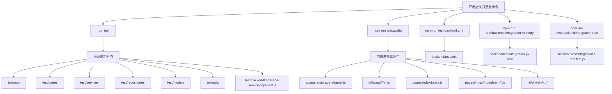

# 里程碑-13：质量闸门升级 详细设计文档

> **设计状态**：🔴 待审核
> **创建日期**：2026-03-26
> **设计者**：GPT5 Codex
> **审核者**：项目维护者
> **预计工期**：3-5天

---

## 📋 目录

- [需求分析](#需求分析)
- [技术方案](#技术方案)
- [代码结构](#代码结构)
- [实施步骤](#实施步骤)
- [测试方案](#测试方案)
- [风险评估](#风险评估)
- [替代方案](#替代方案)

---

## 需求分析

### 功能描述

M11 已把高优先级正确性问题收口，M12 已把启动链路、首页编排和 `TaskService` 内部结构拆出清晰边界。当前项目的主要矛盾已经不是“没有测试”，而是“质量闸门和真实风险没有对齐”。仓库当前前端 Jest 全量运行已经是 `36/36` 个 suite、`1425/1425` 个用例通过，但 `npm run test:coverage -- --runInBand` 仍因全局分支覆盖率只有 `65.94%` 而失败。同时，`app.js`、`pages/**`、`adapters/**` 这些真实高风险层并未被当前正式覆盖率口径纳入，后端测试又是独立的手工入口，导致团队看到的“测试状态”与实际风险面并不一致。

M13 的目标不是新增业务能力，也不是大规模重构，而是基于当前仓库真实结构，把根级稳定闸门、前端硬性覆盖率闸门、后端测试入口和测试文档说明重新收敛成一套可执行、可解释、可逐步扩展的正式质量体系。这个阶段的重点是“重新定义并落地质量闸门契约”，而不是追求表面上的全局覆盖率数字。

### 业务价值

- [x] 用户价值：降低首页、启动、奖励和消息主链路改动后的回归风险，避免看似改了小功能却破坏主路径。
- [x] 技术价值：让测试结果重新具备解释力，减少“测试全绿但关键层没被覆盖”或“覆盖率失败但失败原因不清晰”的协作成本。
- [x] 业务价值：为 M14 的体验与文档统一提供稳定质量基线，减少后续迭代反复补测试和返工。

### 事实基线（2026-03-26，设计前）

#### 1. 根级测试体系已经存在，但入口和说明不清晰

当前仓库根级 `test/` 目录下的真实测试分布如下：

- 根级文件：`test/app.test.js`、`test/backend/message-service-copy.test.js`
- `test/app/`：2 个测试文件
- `test/pages/`：3 个测试文件
- `test/services/`：9 个测试文件
- `test/repositories/`：7 个测试文件
- `test/models/`：7 个测试文件
- `test/utils/`：6 个测试文件

其中已确认的页面/启动链路测试包括：

- `test/app/app-bootstrap.test.js`
- `test/app/app-contract.test.js`
- `test/app.test.js`
- `test/pages/index.page-contract.test.js`
- `test/pages/index.reward-flow.test.js`
- `test/pages/message-page.test.js`
- `test/backend/message-service-copy.test.js`

这说明当前根级稳定闸门并不只是“前端 services/models/utils 单测”，还混合了承担根级契约保护职责的根级 `app.js` 测试和一条根级 backend 文案契约测试；但脚本和文档仍未把这件事讲清楚。

#### 2. 当前覆盖率闸门是红的，而且统计口径和风险层错位

`jest.config.js` 当前真实配置为：

- `testMatch: ['**/test/**/*.test.js']`
- `testPathIgnorePatterns: ['/node_modules/', '/backend/test/']`
- `collectCoverageFrom` 仅统计：
  - `services/**/*.js`
  - `repositories/**/*.js`
  - `models/**/*.js`
  - `utils/batchUtils.js`
  - `utils/dateUtils.js`
  - `utils/formatUtils.js`
  - `utils/core/**/*.js`
- `coveragePathIgnorePatterns` 明确排除了 `/adapters/`
- `coverageThreshold.global` 为 branches/functions/lines/statements 全部 `70`

在这个口径下：

- `npm test -- --runInBand`：`36/36` suite 通过，`1425/1425` tests 通过
- `npm run test:coverage -- --runInBand`：同样 `36/36` suite 通过，`1425/1425` tests 通过
- 但覆盖率结果为：
  - statements `73.09%`
  - branches `65.94%`
  - functions `78.02%`
  - lines `73.65%`
- 最终因为 branches 低于阈值 `70%`，覆盖率命令整体失败

这意味着当前“主质量闸门”为红灯，但红灯并不是功能测试失败，而是统计规则和现状不匹配。

#### 3. 高风险层并未纳入正式硬性闸门

路线图对 M13 的目标已经写明要纳入适配器、关键页面行为和启动链路；当前仓库也确实具备相应代码落点：

- 应用壳层：`app.js`
- 启动链路：`utils/app/bootstrap-auth.js`、`utils/app/bootstrap-services.js`、`utils/app/post-login-bootstrap.js`、`utils/app/runtime-observers.js`
- 首页行为：`pages/index/modules/*.js`
- 页面壳层：`pages/index/index.js`、`pages/rewards/rewards.js`、`packageMessage/pages/message/message.js`
- 适配器层：`adapters/storage-adapter.js`

但这些文件并不在当前正式覆盖率统计中，导致“风险高但不计分”。

#### 4. 后端测试是真实存在的另一条通道，但入口是分裂的

`backend/test/` 下已经存在：

- `backend/test/unit/*`
- `backend/test/integration/*`
- `backend/test/README.md`

`backend/package.json` 当前只有 `test`、`test:watch`、`test:coverage`，根目录 `package.json` 也没有统一包装后端命令。因此后端测试虽然存在，但在项目层面仍表现为“会用的人自己去跑”，不是正式可见的质量入口。

#### 5. 被测模块运行时日志噪声过大，影响闸门可读性

`test/setup/jest-setup.js` 目前只 mock 了 `global.logger`，但项目很多被测模块直接调用 `utils/logger.js`。实际运行 `npm run test:coverage -- --runInBand` 时，大量输出来自被测模块运行时日志，而不是测试文件主动打印，主要来源包括：

- `utils/batchUtils.js`
- `utils/core/event-bus.js`
- `utils/logger.js` 中对 `console.log` / `console.warn` / `console.error` 的直接调用

测试虽然通过，但输出噪声非常大，不利于快速识别真实失败点，也不适合作为正式闸门日志。

#### 6. 测试文档已经与真实仓库状态脱节

`test/README.md` 仍描述“页面和 UI 不包含在自动测试中”，与当前仓库已有 `test/app/*` 和 `test/pages/*` 的事实不一致。`docs/README.md`、`docs/development/workflow.md` 对“稳定质量闸门”的描述仍偏向旧口径，缺少“根级稳定闸门 / 前端覆盖率闸门 / 后端手工闸门”这种分层说明。

### 功能范围

**包含**：

- ✅ 明确项目正式质量闸门的分层契约：根级稳定闸门、前端覆盖率闸门、按目录测试入口
- ✅ 将启动链路、关键页面行为、适配器层纳入正式测试与覆盖率统计范围
- ✅ 通过现有 Jest 体系补齐高风险层测试，不引入新框架
- ✅ 收敛测试日志输出噪声，使质量闸门结果更易读
- ✅ 明确后端 unit、轻量集成、真实集成三类测试入口，并在项目文档中说明其用途与前置条件
- ✅ 更新测试相关说明文档，使文档与仓库现状一致

**不包含**：

- ❌ 不做新的业务功能开发
- ❌ 不做全量页面 E2E 自动化
- ❌ 不强行把后端真实数据库集成测试接入仓库级 CI 阻塞流程
- ❌ 不在 M13 内大规模提升所有遗留服务的总体覆盖率
- ❌ 不改变微信小程序运行时行为、路由结构和双环境切换语义

### 优先级

- **优先级**：P1
- **理由**：这不是直接影响线上用户正确性的 P0 缺陷，但当前质量闸门已经无法准确表达风险面，继续进入 M14 会显著放大回归和协作成本。

---

## 技术方案

### 方案概述

M13 采用“根级稳定闸门 + 前端覆盖率闸门 + 后端三类入口 + 文档对齐”的方案，核心目标是让质量状态重新具备解释力。

其中根级自动化部分不再被笼统称为“前端测试”，而是拆成两个职责明确的入口：

1. **根级稳定闸门**：确保根级 Jest 套件全绿，覆盖当前项目已经纳入根测试树的页面、服务、模型、仓储、`app.js` 契约，以及 `test/backend/message-service-copy.test.js` 这类根级 backend 契约测试。
2. **前端覆盖率闸门**：只对当前里程碑真正关心的核心高风险范围设硬性阈值，包括 `app.js`、启动链路、适配器层、首页模块和关键页面行为相关代码。

后端部分不进入“全自动 CI 阻塞”模式，而是先把已有测试收敛为 `unit`、轻量集成、真实集成三类项目级可见入口，并明确真实数据库集成测试属于“有前置条件的手工质量通道”。这样做能在不引入额外基础设施的情况下，让 M13 先完成“规则明确、入口清晰、范围对齐”的目标。

### 质量闸门契约

M13 完成后，项目层面的正式质量入口应明确为以下五类：

| 闸门 | 阻塞级别 | 目标 | 建议命令 |
|------|----------|------|---------|
| 根级稳定闸门 | 阻塞 | 确认根级 Jest 全量行为与契约全绿，继续包含 `test/backend/message-service-copy.test.js` | `npm test -- --runInBand` |
| 前端覆盖率闸门 | 阻塞 | 对核心高风险范围执行硬性覆盖率检查 | `npm run test:quality` |
| 后端单元闸门 | 非默认阻塞 | 明确后端本地 unit 测试入口 | `npm run test:backend:unit` |
| 后端轻量集成闸门 | 非默认阻塞 | 明确后端非真实数据库集成/内存版测试入口 | `npm run test:backend:integration:memory` |
| 后端真实集成闸门 | 手工阻塞 | 在具备远程测试 DB 时只执行 `*-real.test.js` 真实链路验证 | `npm run test:backend:integration:real` |

其中“阻塞”是指该闸门可作为里程碑实施和合并前的正式判断条件；“手工阻塞”表示只有在满足环境前置条件时才执行，但入口必须明确。

### 技术选型

| 技术点 | 选择方案 | 替代方案 | 选择理由 |
|--------|---------|---------|---------|
| 根级质量闸门配置 | 在现有 Jest 基础上拆分根级稳定闸门与覆盖率闸门配置 | 继续沿用单一 `jest.config.js` 同时承担所有职责 | 当前单一配置已经同时承担运行、覆盖率、阈值三种职责，导致结果不易解释 |
| 覆盖率口径 | 对核心高风险范围做路径级阈值，而不是沿用单一 global 阈值 | 继续强推全局 70% | 现有 global 阈值既没覆盖关键层，又会被长尾遗留文件拖红，不能体现真实风险 |
| 页面/启动链路测试方式 | 沿用现有 Jest + `Page` / `App` mock + M12 拆出的模块化边界 | 引入新的小程序测试框架 | 当前仓库已经有可运行的测试方式，兼容性最好，实施成本最低 |
| 测试日志治理 | 在 `utils/logger.js` 中增加 test 环境静默策略，并保留显式开关 | 继续允许真实 `console` 大量输出 | 现有噪声已经影响闸门可读性；在 test 环境静默最直接且不影响小程序运行时 |
| 后端入口收敛 | 在根 `package.json` 暴露后端 unit、轻量集成、真实集成包装命令 | 只保留 `backend/` 内部 README 说明 | 当前问题不是后端没测试，而是项目层面没有统一入口 |
| CI 策略 | M13 先不把 GitHub Actions 作为必做项 | 直接新建 CI 工作流并接管全部测试 | 仓库当前无 `.github/`，后端真实集成依赖远程 DB，先定义本地正式入口更务实 |

### DDD分层设计

M13 不改变领域语义，不改存储模型，只围绕测试、质量入口和可验证边界做增量治理。

**领域层（models/）**：

- [ ] 不新增模型
- [ ] 不修改领域语义
- 说明：M13 不以业务模型改造为目标，模型层只作为既有测试口径的一部分继续保留

**服务层（services/）**：

- [ ] 不新增业务服务
- [ ] 可能补充服务层测试
- 说明：仅补测试或极小的可测性调整，不改业务语义

**仓储层（repositories/）**：

- [ ] 不新增仓储
- [ ] 不修改仓储契约
- 说明：仓储层不作为 M13 的主实施重点

**适配器层（adapters/）**：

- [x] 修改测试范围：`adapters/storage-adapter.js`
- [ ] 如有必要，做极小的可测性修正
- 说明：M13 要把适配器层从“覆盖率盲区”变成正式闸门的一部分

**应用壳层（根级入口）**：

- [x] 补硬闸门：`app.js`
- [x] 扩展测试：`test/app/app-contract.test.js`、`test/app/app-bootstrap.test.js`、`test/app.test.js`
- 说明：`app.js` 仍然保留真实启动编排、日志初始化和设备/兼容性相关逻辑，不能只把 `utils/app/*` 视作启动链路全部范围

**应用编排层（utils/app/）**：

- [x] 补测试：`bootstrap-auth.js`
- [x] 补测试：`bootstrap-services.js`
- [x] 补测试：`post-login-bootstrap.js`
- [x] 补测试：`runtime-observers.js`
- 说明：M12 已将启动链路拆成独立模块，M13 直接围绕这些模块补闸门

**表现层（pages/、packageMessage/pages/）**：

- [x] 补首页壳层测试：`pages/index/index.js`
- [x] 补首页模块测试：`pages/index/modules/*.js`
- [x] 补关键页面契约/行为测试：`pages/rewards/rewards.js`
- [x] 延续并扩展消息页测试：`packageMessage/pages/message/message.js`
- 说明：优先测试关键行为和编排模块，不追求把整页 UI 细节全部纳入

**基础工具层（utils/）**：

- [x] 修改：`utils/logger.js`
- 说明：仅为测试环境静默和日志可控性提供支持，不改变业务日志语义

### 设计原则

1. **先定义闸门，再补数字**：先明确什么是正式阻塞项，再决定覆盖率怎么统计，不再把“单一 global 阈值”当成唯一质量定义。
2. **对准真实高风险层**：M13 的新增硬性范围必须优先覆盖 `app.js`、适配器、启动链路、首页编排和关键页面行为。
3. **不引入新框架**：继续使用现有 Jest、CommonJS、`Page` / `App` mock 方式，保持对微信小程序原生代码的兼容。
4. **日志默认安静，调试可显式开启**：正式质量闸门默认输出应聚焦失败信息，不被海量 `console` 淹没。
5. **根级稳定闸门口径如实表达**：`npm test` 继续包含根级 backend 契约测试，不再把它错误叙述成“纯前端测试”。
6. **后端入口先统一，自动化后置**：先把命令和边界讲清楚，再决定是否建设完整 CI。

### 架构图



### 数据模型

```typescript
interface QualityGateDefinition {
  id: 'root-stable' | 'frontend-coverage' | 'backend-unit' | 'backend-integration-memory' | 'backend-integration-real';
  blocking: boolean;
  scope: string[];
  command: string;
  prerequisite?: string;
  successStandard: string;
}
```

### 接口设计

**新增/调整脚本接口**：

| 方法 | 说明 | 参数 | 返回值 |
|------|------|------|--------|
| `npm test -- --runInBand` | 根级稳定闸门 | 无 | 根级 Jest 全量通过/失败 |
| `npm run test:quality` | 前端覆盖率闸门 | 无 | 核心范围覆盖率通过/失败 |
| `npm run test:app` | 运行 `app.js` 相关测试，包含 `test/app/` 与 `test/app.test.js` | 无 | 通过/失败 |
| `npm run test:pages` | 仅运行页面与页面模块测试 | 无 | 通过/失败 |
| `npm run test:adapters` | 仅运行适配器层测试 | 无 | 通过/失败 |
| `npm run test:backend:unit` | 根级包装后端 unit 测试 | 无 | 通过/失败 |
| `npm run test:backend:integration:memory` | 根级包装后端非真实数据库集成/内存版测试 | 无 | 通过/失败 |
| `npm run test:backend:integration:real` | 根级包装后端真实集成测试，仅跑 `*-real.test.js` | 需配置 `backend/.env.test` | 通过/失败 |

### 覆盖率策略

M13 不再把“当前 collectCoverageFrom 范围内的 global 70%”视作唯一硬标准，而是改成“核心范围路径级阈值 + 全量报告信息化展示”的策略。

**硬性阈值建议**：

| 范围 | lines/statements/functions | branches | 说明 |
|------|---------------------------|----------|------|
| `app.js` | 75% | 70% | 应用壳层仍保留真实启动编排与兼容逻辑，需纳入正式硬闸门 |
| `adapters/storage-adapter.js` | 75% | 70% | 存储底座，需要覆盖命名空间、缓存、异常降级 |
| `utils/app/**/*.js` | 75% | 70% | 启动链路属于 M13 主范围 |
| `pages/index/index.js` | 70% | 65% | 首页壳层仍保留生命周期与编排入口，需进入正式硬闸门 |
| `pages/index/modules/**/*.js` | 75% | 70% | 首页行为编排是后续改动高频区 |
| `pages/rewards/rewards.js` | 70% | 65% | 保证奖池页关键刷新逻辑有正式保护 |
| `packageMessage/pages/message/message.js` | 70% | 65% | 保证消息页关键时间/视角行为受保护 |
| `services/task-service.js` | 80% | 70% | 对外门面仍承载真实编排与公共契约，不能遗漏 |
| `services/task-service/**/*.js` | 80% | 70% | M12 已完成拆分，适合作为较稳定的高标准范围 |

**说明**：

- 当前全局覆盖率仍可继续生成报告，但不再作为 M13 的唯一阻塞条件。
- 若实施过程中发现某个范围的初始基线明显低于建议阈值，应优先补足测试，不建议通过下调阈值过关。
- 页面壳层不追求完整 UI 覆盖，更关注主路径行为和契约是否受保护。

---

## 代码结构

### 文件变更清单

**新增文件**：

- `jest.quality.config.js` - 前端覆盖率闸门专用配置
- `test/adapters/storage-adapter.test.js` - 适配器层正式测试
- `test/app/app-launch-behavior.test.js` - `app.js` 启动行为与兼容逻辑测试
- `test/app/post-login-bootstrap.test.js` - 登录后初始化链路测试
- `test/app/runtime-observers.test.js` - 设备监听与主题/尺寸监听测试
- `test/pages/index.refresh-coordinator.test.js` - 首页统一刷新编排测试
- `test/pages/index.task-actions.test.js` - 首页任务动作编排测试
- `test/pages/index.shell-contract.test.js` - 首页壳层生命周期与入口契约测试
- `test/pages/rewards.page-contract.test.js` - 奖池页关键契约/刷新测试
- `test/utils/logger.test.js` - logger 静默机制与显式开关测试

**修改文件**：

- `package.json` - 增加 `test:quality`、`test:app`、`test:pages`、`test:adapters`、`test:backend:*` 等脚本
- `package.json` - 清理或重定义失效的 `test:integration` 入口，避免继续指向不存在的 `test/integration`
- `backend/package.json` - 细分后端 `test:unit`、`test:integration:memory`、`test:integration:real` 命令
- `jest.config.js` - 收敛为根级稳定闸门基础配置
- `utils/logger.js` - 增加 test 环境静默与显式开关
- `test/setup/jest-setup.js` - 统一测试日志和基础 mock 策略
- `test/app/app-bootstrap.test.js` - 覆盖云端/本地启动分支
- `test/app.test.js` - 保留并归类 `app.js` 自动登录环境配置契约
- `test/pages/index.page-contract.test.js` - 扩展首页生命周期与入口契约
- `test/pages/index.reward-flow.test.js` - 扩展首页奖励主路径测试
- `test/pages/message-page.test.js` - 扩展消息页关键视角/时间行为测试
- `test/README.md` - 更新前端测试范围、命令和质量闸门说明
- `backend/test/README.md` - 更新后端 `unit`、`integration:memory`、`integration:real` 入口说明
- `docs/development/workflow.md` - 更新正式质量命令口径
- `docs/development/GITHUB_WORKFLOW.md` - 更新 PR 前质量检查命令口径
- `docs/development/coding_standards.md` - 更新测试运行章节中的正式闸门说明
- `docs/api/services-guide.md` - 更新服务测试入口说明
- `docs/README.md` - 更新项目级测试命令说明

### 核心代码结构

```javascript
// jest.quality.config.js
const baseConfig = require('./jest.config');

module.exports = {
  ...baseConfig,
  collectCoverage: true,
  coveragePathIgnorePatterns: baseConfig.coveragePathIgnorePatterns
    .filter((pattern) => pattern !== '/adapters/'),
  collectCoverageFrom: [
    'app.js',
    'adapters/storage-adapter.js',
    'utils/app/**/*.js',
    'pages/index/index.js',
    'pages/index/modules/**/*.js',
    'pages/rewards/rewards.js',
    'packageMessage/pages/message/message.js',
    'services/task-service.js',
    'services/task-service/**/*.js'
  ],
  coverageThreshold: {
    './pages/index/index.js': {
      branches: 65,
      functions: 70,
      lines: 70,
      statements: 70
    },
    './adapters/storage-adapter.js': {
      branches: 70,
      functions: 75,
      lines: 75,
      statements: 75
    },
    './services/task-service.js': {
      branches: 70,
      functions: 80,
      lines: 80,
      statements: 80
    }
    // 其他路径阈值同理展开
  }
};
```

```javascript
// utils/logger.js
function getNodeEnvValue(name) {
  if (typeof process === 'undefined' || !process || !process.env) {
    return undefined;
  }
  return process.env[name];
}

_shouldLog(level) {
  if (getNodeEnvValue('NODE_ENV') === 'test' &&
      getNodeEnvValue('ENABLE_TEST_LOGS') !== 'true') {
    return false;
  }

  const currentLevel = this._getCurrentLevel();
  const currentValue = LogLevelMap[currentLevel.toLowerCase()] || LogLevel.INFO;
  const messageValue = LogLevelMap[level.toUpperCase()] || LogLevelMap[level.toLowerCase()] || LogLevel.INFO;
  return messageValue >= currentValue;
}
```

```javascript
// package.json
{
  "scripts": {
    "test": "jest",
    "test:quality": "jest --config jest.quality.config.js --runInBand",
    "test:app": "jest test/app test/app.test.js --runInBand",
    "test:pages": "jest test/pages --runInBand",
    "test:adapters": "jest test/adapters --runInBand",
    "test:backend:unit": "npm --prefix backend run test:unit -- --runInBand",
    "test:backend:integration:memory": "npm --prefix backend run test:integration:memory -- --runInBand",
    "test:backend:integration:real": "npm --prefix backend run test:integration:real -- --runInBand"
  }
}
```

### 关键函数/模块

**模块1**：`utils/logger.js`

- **输入**：日志级别、模块名、消息和附加数据
- **输出**：测试环境静默，非测试环境按原有逻辑输出
- **职责**：让正式测试结果可读，同时保留显式打开测试日志的能力
- **依赖**：受 `typeof process` 防护保护的 Node 环境变量读取，以及现有 `_shouldLog()` / `_detectEnvironmentLevel()` 决策链

**模块2**：`app.js`

- **输入**：`App` 生命周期、`wx` 存储/登录 API、启动期依赖模块
- **输出**：可验证的启动壳层行为和运行时契约
- **职责**：把仍留在 `app.js` 中的真实启动逻辑纳入正式硬闸门
- **依赖**：`bootstrap-auth`、`bootstrap-services`、`post-login-bootstrap`、`runtime-observers`、`StorageAdapter`

**模块3**：`utils/app/*.js`

- **输入**：`app` 实例、服务依赖、微信 API mock
- **输出**：可验证的启动链路行为
- **职责**：将 M12 拆出的启动模块纳入正式闸门范围
- **依赖**：`UserService`、`service-manager`、`token-manager`、`http-client`

**模块4**：`pages/index/index.js`

- **输入**：Page 生命周期、页面 data、页面级事件入口、服务调用壳层
- **输出**：可验证的首页壳层行为和模块编排入口
- **职责**：把仍留在首页壳层中的生命周期和协调逻辑纳入正式硬闸门
- **依赖**：`pages/index/modules/*`、`service-manager`、页面 `setData`

**模块5**：`pages/index/modules/*.js`

- **输入**：页面实例、服务对象、页面数据上下文
- **输出**：刷新、任务动作、奖励流转等行为结果
- **职责**：对首页高风险行为建立正式保护
- **依赖**：`service-manager`、`formatUtils`、`dateUtils`、页面 `setData`

---

## 实施步骤

### 第1步：重定义质量闸门入口与配置（预计4小时）

- [ ] **任务**：拆分根级稳定闸门和前端覆盖率闸门，补充根级和后端脚本入口
- [ ] **验证**：`npm test -- --runInBand`、`npm run test:quality`、`npm run test:backend:unit` 能按设计入口运行
- [ ] **依赖**：已确认现有 Jest 和 backend Jest 均可本地运行

**实施要点**：

1. 保留 `jest.config.js` 作为根级稳定闸门基础配置，不再让它同时承担所有覆盖率职责。
2. 新增 `jest.quality.config.js`，只针对 M13 核心高风险范围做正式覆盖率统计和阈值约束，并显式移除对 `/adapters/` 的排除。
3. 先在 `backend/package.json` 新增 `test:unit`、`test:integration:memory`、`test:integration:real`。
4. `test:integration:memory` 只跑当前 `backend/test/integration/` 中的非 `*-real.test.js` 套件；`test:integration:real` 只跑 `*-real.test.js`。
5. 再在根 `package.json` 暴露 `test:quality`、`test:app`、`test:pages`、`test:adapters`、`test:backend:*` 脚本。
6. 清理或重定义当前失效的 `test:integration` 命令，避免继续保留无效入口。
7. `test:app` 需要显式包含 `test/app.test.js`，不能只跑 `test/app/` 目录。
8. 后端命令优先通过 `npm --prefix backend run ...` 形式包装，不在脚本中依赖交互式切目录。

---

### 第2步：治理测试日志噪声并稳定输出（预计3小时）

- [ ] **任务**：为测试环境增加日志静默机制，保留显式打开日志的调试开关
- [ ] **验证**：全量 Jest 运行时不再出现大面积 `console.log` / `console.warn` 噪声
- [ ] **依赖**：第1步中的配置拆分已完成

**实施要点**：

1. 优先在 `utils/logger.js` 的 `_shouldLog()` 决策点识别 `NODE_ENV=test`，默认静默真实日志输出，避免另起一套平行判断分支。
2. 保留 `ENABLE_TEST_LOGS=true` 之类的显式开关，避免排查疑难测试时失去日志能力。
3. `test/setup/jest-setup.js` 继续承担基础 mock，但不再指望仅通过 `global.logger` 解决所有日志问题。
4. 读取 `process.env` 时必须保持 `typeof process === 'undefined'` 防护，避免引入微信小程序运行时兼容性问题。
5. 为 logger 静默和显式开关补专门测试，避免后续误伤排查能力。
6. 验证日志治理不会影响小程序运行时环境，只对 Node/Jest 环境生效。

---

### 第3步：补齐 M13 核心范围测试（预计12-16小时）

- [ ] **任务**：围绕适配器、启动链路、首页模块和关键页面行为补正式测试
- [ ] **验证**：新增测试能覆盖本阶段定义的核心范围并稳定通过
- [ ] **依赖**：第1步、第2步完成

**实施要点**：

1. 为 `app.js` 补充启动编排、兼容性检查、日志初始化和本地日志写入等壳层行为测试。
2. 为 `adapters/storage-adapter.js` 补充命名空间、缓存命中、异步读写、异常降级和批量初始化场景测试。
3. 为 `utils/app/` 下四个模块分别补充本地/云端、登录后初始化、监听注册与回调行为测试。
4. 为 `pages/index/index.js` 补充壳层生命周期、入口暴露和模块协调测试。
5. 为 `pages/index/modules/` 补充统一刷新、任务动作、奖励流转、用户上下文初始化等模块级测试。
6. 为 `test/utils/logger.test.js` 补充静默与显式开关验证。
7. 页面壳层只补关键契约和主路径行为，不追求 UI 细节自动化。
8. `test/app/app-bootstrap.test.js` 继续承担启动前置分支、本地/云端初始化契约；新增 `test/app/app-launch-behavior.test.js`、`test/app/post-login-bootstrap.test.js`、`test/app/runtime-observers.test.js` 分别聚焦 `app.js` 壳层、登录后链路和运行时监听，避免与既有测试重复。

---

### 第4步：收敛覆盖率阈值并打通后端说明（预计4小时）

- [ ] **任务**：让 `test:quality` 在目标范围内变绿，并补齐前后端测试说明文档
- [ ] **验证**：`npm run test:quality` 通过，文档命令与仓库脚本一致
- [ ] **依赖**：第3步完成后可获得真实覆盖率基线

**实施要点**：

1. 先补测试再看阈值，不用“调低阈值”代替测试建设。
2. 前端覆盖率闸门采用路径级阈值，不再依赖单一 global 阈值。
3. `test/README.md` 要明确“根级稳定闸门包含 `test/backend/message-service-copy.test.js`”这一现状，并解释目录级入口与覆盖率闸门的关系。
4. `backend/test/README.md` 与项目级文档要明确 `unit`、`integration:memory`、`integration:real` 的前置条件和用途边界。
5. `docs/README.md`、`workflow.md`、`coding_standards.md`、`GITHUB_WORKFLOW.md`、`services-guide.md` 都需要同步修正文档口径，避免继续把 `npm test` 表述成“纯前端测试”。

---

## 测试方案

### 单元测试

| 测试项 | 测试方法 | 预期结果 |
|--------|---------|---------|
| `StorageAdapter` 核心行为 | 新增 `test/adapters/storage-adapter.test.js` | 命名空间、缓存、异常降级、批量初始化行为稳定 |
| `app.js` 壳层行为 | 新增/扩展 `test/app/*` 与 `test/app.test.js` | 启动编排、兼容性检查、自动登录环境配置稳定 |
| 启动链路模块 | 扩展 `test/app/*` | 本地/云端启动、登录恢复、监听注册行为稳定 |
| 首页壳层行为 | 新增/扩展 `test/pages/index*.test.js` | 生命周期入口、模块协调和页面契约稳定 |
| 首页编排模块 | 新增/扩展 `test/pages/index*.test.js` | 刷新、任务动作、奖励流转和上下文初始化稳定 |
| 奖池页/消息页关键行为 | 扩展 `test/pages/rewards*`、`test/pages/message-page.test.js` | 页面关键契约和主路径逻辑稳定 |
| 根级 backend 契约测试 | 保留 `test/backend/message-service-copy.test.js` | 根级稳定闸门继续保护消息文案契约 |
| 测试日志治理 | 新增 logger 相关测试或断言 | Jest 环境默认安静，显式开关可恢复日志 |

### 集成测试

- [ ] 根级稳定闸门：运行 `npm test -- --runInBand`，确认现有根级套件全绿，并继续包含 `test/backend/message-service-copy.test.js`
- [ ] 前端覆盖率闸门：运行 `npm run test:quality`，确认核心范围覆盖率达标
- [ ] 后端单元入口：运行 `npm run test:backend:unit`，确认根级包装命令可用
- [ ] 后端轻量集成入口：运行 `npm run test:backend:integration:memory`，确认内存版/非真实数据库套件入口可用
- [ ] 后端真实集成入口：在具备 `backend/.env.test` 后运行 `npm run test:backend:integration:real`

### 手动测试

参考 `docs/development/coding_standards.md` 中的测试流程，本阶段主要做不改业务语义的回归确认：

1. **前端回归**：
   - [ ] 启动小程序，确认首页正常进入，不受 logger/test 相关改动影响
   - [ ] 首页任务完成、重置、奖励解锁主路径正常
   - [ ] 奖池页加载和消息页进入正常

2. **后端入口回归**：
   - [ ] 核对后端测试命令与 README 说明一致

3. **回归测试**：
   - [ ] 确保 M11、M12 已建立的回归测试全部继续通过

### 测试覆盖率目标

- 根级稳定闸门：全量根级 Jest 用例通过
- 前端覆盖率闸门：核心范围路径级阈值全部通过
- 后端测试入口：`unit`、`integration:memory`、`integration:real` 边界清晰，不要求在 M13 内实现全自动化

---

## 风险评估

### 技术风险

| 风险项 | 影响 | 概率 | 应对措施 |
|--------|------|------|---------|
| 路径级阈值理解成本上升 | 中 | 中 | 在文档中明确“稳定闸门”和“覆盖率闸门”的不同职责，并给出标准命令 |
| 日志静默影响问题排查 | 中 | 中 | 保留 `ENABLE_TEST_LOGS=true` 之类的显式开关 |
| 页面测试过度依赖实现细节 | 中 | 中 | 优先围绕 M12 拆出的模块和页面契约测试，不直接绑定 UI 细节 |
| 扩大覆盖率范围后首次基线偏低 | 中 | 高 | 先补高价值测试，再决定阈值，不通过降低标准掩盖问题 |
| 后端真实集成入口在不同环境不稳定 | 中 | 中 | 明确这是手工闸门，需要真实 DB 前置条件，不放进默认阻塞链路 |

### 业务风险

| 风险项 | 影响 | 概率 | 应对措施 |
|--------|------|------|---------|
| 为了测试方便误改页面/服务运行时语义 | 高 | 低 | 设计明确要求只做可测性增强，不改变用户可见业务逻辑 |
| 将 M13 扩张成全面测试重构 | 中 | 中 | 坚持只覆盖适配器、启动链路、关键页面行为和正式入口文档 |

---

## 替代方案

### 方案A：继续沿用现有 `jest.config.js` 的 global 覆盖率阈值，只靠补测试把数字抬上去

**优点**：

- 配置最少，看起来最简单

**缺点**：

- 当前 global 阈值没有覆盖真正高风险层
- 会被长尾遗留文件拖住，难以在一个里程碑内落地
- 即使数字变绿，也不能保证启动链路、页面行为和适配器层已经受保护

**结论**：

不选。这个方案解决的是数字，不是闸门口径。

### 方案B：M13 直接建设完整 GitHub Actions CI，并把前后端全部接入阻塞流程

**优点**：

- 形式上最完整

**缺点**：

- 仓库当前没有 `.github/` 基础
- 后端真实集成测试依赖远程数据库和环境配置，无法直接变成默认阻塞链路
- 会把基础设施建设和质量边界重定义混在一个里程碑里，风险过大

**结论**：

不作为 M13 主方案。可在后续基础设施成熟后再补。

### 方案C：引入新的小程序测试框架，对页面做更重的自动化测试

**优点**：

- 理论上可以提供更强的页面测试能力

**缺点**：

- 引入新框架会增加学习成本和兼容性风险
- 当前仓库已经具备可运行的 Jest + 页面 mock 体系
- 与 M13 “增量升级质量闸门”的目标不匹配

**结论**：

不选。继续基于现有 Jest 体系增量演进更稳妥。

---

## 结论

M13 的核心不是“让覆盖率数字更好看”，而是把项目现有测试、真实风险和正式质量入口重新对齐。按本设计实施后，团队将获得一套更清晰的质量契约：

- 根级稳定闸门负责功能与契约全绿，并继续覆盖根级 backend 文案契约测试
- 前端覆盖率闸门负责核心高风险范围硬性保障
- 后端单元、轻量集成、真实集成测试拥有项目级正式入口
- 测试文档、脚本和仓库现状重新一致

这套设计不引入新技术栈，完全兼容当前微信小程序原生架构和现有 Jest 实现方式，适合作为 M13 的落地基线。
