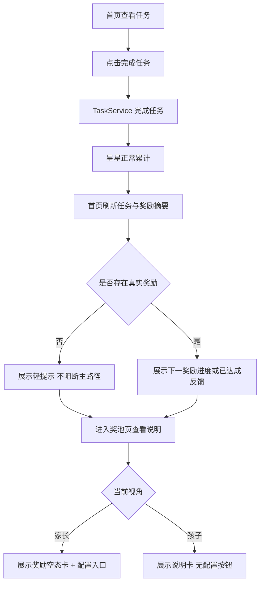

# 里程碑-14A：体验统一 详细设计文档

> **设计状态**：🔶 需修改后重审
> **创建日期**：2026-03-26
> **设计者**：GPT5 Codex
> **审核者**：项目维护者
> **预计工期**：3-4天

---

## 📋 目录

- [需求分析](#需求分析)
- [技术方案](#技术方案)
- [视觉与状态规格](#视觉与状态规格)
- [代码结构](#代码结构)
- [实施步骤](#实施步骤)
- [测试方案](#测试方案)
- [风险评估](#风险评估)
- [替代方案](#替代方案)

---

## 需求分析

### 功能描述

M12 已完成首页结构拆分，M13 已完成质量闸门升级，当前项目进入体验层治理阶段。结合现状代码，首页与奖池页在“没有真实奖励”这一核心场景上的语义仍不一致：首页会把它当成需要提示甚至阻断任务完成的状态；奖池页在“当前没有正式奖励 / 只有示例奖励”场景下又缺少明确空态表达，而且示例奖励仍混入正式奖励列表，导致用户对“现在到底算不算已经设置奖励”“还能不能继续做任务”“下一步该谁处理”产生混淆。

M14A 的目标不是重排首页版式，也不是引入新的技术框架，而是在现有微信小程序原生架构下，统一首页与奖池页对“无真实奖励”场景的语义、空态和角色表达，让任务主路径更顺滑，让奖励相关反馈变得明确、稳定、可理解。

### 业务价值

- [x] 用户价值：避免“没有配置奖励就不能完成任务”的割裂体验，让孩子先完成任务、先积累星星，再理解奖励状态。
- [x] 技术价值：在不改动服务层契约和存储结构的前提下，统一首页与奖池页的展示语义，降低后续体验迭代的维护成本。
- [x] 业务价值：为 M14B 的文档统一和后续视觉/文案精修建立稳定的交互基线。

### 事实基线（2026-03-26，设计前）

#### 1. 首页当前会因“未配置真实奖励”阻断任务完成

`pages/index/modules/index-task-actions.js` 中的 `ensureRewardSetupForCompletion(page)` 会在以下场景直接阻止任务完成：

- `calculateNextAvailableReward()` 返回默认占位奖励
- 奖励列表为空
- 或奖励列表只包含示例奖励

命中后当前逻辑会：

1. 清理 `processingTaskId`
2. 给 `nextReward.showSetupTip = true`
3. 弹出“需要设置奖励”模态框
4. 返回 `false`

这意味着“是否配置奖励”当前是任务完成前置条件，与用户已确认的产品方向不一致。

#### 2. 首页已经具备提示状态，但提示和真实行为还没有统一

`pages/index/modules/index-reward-flow.js` 已能识别：

- `hasNoRealReward`
- `hasOnlyExampleRewards`
- `nextReward.showSetupTip`

并在首页奖励卡内展示“还没有设置奖励哦”的提示文案。但当前这套状态与任务完成逻辑没有被统一使用，导致页面一边显示提示、一边在点击完成任务时强制拦截。

#### 3. 首页和奖池页对“没有真实奖励”的表达不一致

当前同一类场景在两个页面里的表达并不统一：

- 首页会直接提示“还没有设置奖励哦！请找爸爸妈妈来帮你设置奖励吧！”
- 首页完成任务时还会弹出“需要设置奖励”的阻断模态
- 奖池页在 `allRewards.length === 0 && hasCustomRewards` 时只写入空数组并返回，没有对应说明卡
- 只有示例奖励时，首页逻辑把它当成“未完成真实配置”，但 UI 里又仍会显示示例奖励标记；奖池页也会把示例奖励渲染进奖励网格

这会让用户在“逻辑上算没配置，视觉上又像有奖励”的两套语义之间来回切换。

#### 4. 奖池页对“当前没有正式奖励”场景缺少明确空态

`pages/rewards/rewards.js` 中，当 `allRewards.length === 0 && hasCustomRewards` 时，页面会写入：

- `rewards: []`
- `availableRewards: []`
- `claimedRewards: []`
- `nextReward: null`

然后直接返回。当前 `pages/rewards/rewards.wxml` 没有与之对应的显式空态卡片，因此页面会落入“没有奖励网格，但仍保留奖励页框架”的模糊状态，用户很难判断这是“未配置奖励”“奖励被清空”“还是加载失败”。

#### 5. 家长和孩子在“奖励未配置”场景下需要不同动作，但当前表达不够清晰

产品真实需求已经明确：

- 家长拥有创建和管理奖励的权限
- 孩子不负责创建和管理奖励，但仍可查看奖励、积累星星、打卡、重置任务，并沿用项目当前既有的奖励领取能力
- M14A 不涉及“家长代孩子创建任务”能力的新增、删除或改造，沿用项目当前既有能力

因此在奖励未配置时：

- 家长视角应该获得明确的配置入口或引导动作
- 孩子视角应该只看到解释性提示，而不是被引导去执行其无权限的配置动作

#### 6. 示例奖励不应继续混入正式奖励体验

当前实现中，示例奖励仍可能出现在：

- 首页奖励指示器
- 奖池页奖励网格
- “下一奖励”计算链路的可见结果中

这会把“演示用途的数据”误传达为“正式可兑换目标”，弱化真实奖励的语义边界。

#### 7. 示例奖励边界说明

为避免实现阶段把 M14A 扩大成数据治理或云同步改造，本里程碑对示例奖励只约定表现层边界，不扩大到底层契约：

- 来源：沿用项目当前已有的默认/示例奖励来源，不在 M14A 内新增新的示例奖励来源
- 识别：继续复用现有 `isExampleReward()` 或等价规则识别示例奖励
- 展示：示例奖励退出首页正式摘要、奖池正式奖励墙和正式进度语义；如需继续保留，仅限家长管理侧作为示例/模板参考
- 生命周期：M14A 不重写示例奖励的创建、清理、迁移和存储策略，只要求前端在展示时正确过滤
- 云同步：M14A 不修改示例奖励是否同步、如何同步的现有机制；如后续需要统一示例奖励在多端/云端的生命周期，另立服务层或数据层里程碑处理

边界结论：

- M14A 解决的是“示例奖励不要再污染正式体验”
- M14A 不解决“示例奖励在底层如何建模和同步”

### 功能范围

**包含**：

- ✅ 首页任务完成不再因未配置真实奖励而被阻断
- ✅ 首页奖励区在“未配置真实奖励 / 只有示例奖励 / 当前没有正式奖励”时改为说明性提示，而不是主流程门槛
- ✅ 奖池页增加明确的奖励空态卡，并区分家长视角与孩子视角
- ✅ 统一“无真实奖励”的判定语义，包括奖励为空、仅示例奖励、以及“可能存在历史配置”的提示场景
- ✅ 示例奖励退出正式奖励体验：不进入首页正式奖励摘要、不进入奖池正式奖励墙、不参与正式进度表达
- ✅ 在现有 WXML/WXSS/页面脚本内完成体验统一，不引入新技术栈

**不包含**：

- ❌ 不修改奖励、星星、任务的服务层业务规则
- ❌ 不修改云同步、存储结构、API 契约和双环境切换机制
- ❌ 不在 M14A 内补写 API 文档和测试总览文档，这部分归 M14B
- ❌ 不调整首页奖励区与任务区的前后顺序
- ❌ 不做全站视觉重设计，只聚焦首页与奖池页主路径
- ❌ 不改变家长/孩子原有权限边界

### 优先级

- **优先级**：P1
- **理由**：该问题不会像 M11 那样直接造成数据错误，但它持续影响主路径流畅度和页面理解成本，已经成为当前产品体验上的主要短板。

---

## 技术方案

### 方案概述

M14A 采用“保留现有首页版式、统一奖励语义”的方案。具体做法是：

1. 保留首页现有区块顺序，不把版式重排作为本次目标。
2. 移除首页完成任务前的“必须先配置奖励”拦截逻辑，让任务完成和星星累计继续按现有服务层主链路执行。
3. 奖励未配置时，首页只展示说明性提示；奖池页承担主解释和主引导职责。
4. 奖池页对家长和孩子展示不同空态表达：家长在无真实奖励时可看到去配置奖励的动作入口，孩子在无真实奖励时只看到解释性提示。
5. 示例奖励退出正式奖励体验，仅保留在家长管理侧作为示例/模板用途。

这样做的核心是统一页面语义：

- 首页回答“今天要做什么、我做完会得到什么反馈”
- 奖池页回答“奖励现在是什么状态、如果当前没有正式奖励，接下来该谁处理”

### 页面职责约定

- 首页：只处理“提示文案统一”和“任务完成不再被阻断”，不新增空态按钮，不承担奖励配置入口职责
- 奖池页：存在真实奖励时继续展示正常奖励墙；无真实奖励时承接主解释和主引导，家长可看到配置按钮，孩子只看到说明
- 奖励管理页：继续作为家长设置正式奖励的唯一落点

兼容性约束：

- M14A 不引入新的 npm 依赖、UI 框架或构建工具
- 仅基于现有微信小程序原生 `WXML / WXSS / JS` 与既有服务层接口增量实现
- 不改变当前双环境切换方式和 API 配置位置

### 技术选型

| 技术点 | 选择方案 | 替代方案 | 选择理由 |
|--------|---------|---------|---------|
| 页面改造方式 | 基于现有 `index.wxml` / `rewards.wxml` 和对应样式增量调整 | 引入新组件体系或重写整页 | 当前页面已完成 M12 结构治理，继续增量修改成本最低、兼容性最好 |
| 奖励未配置判定 | 复用现有 `nextReward.isDefault`、`showSetupTip`、`visibleRewards.isExample` 及奖池页 `isExampleReward()` 识别能力 | 新增服务层“是否已配置奖励”专用接口 | 当前前端已有足够状态基础，服务层无必要扩口 |
| 完成任务行为 | 取消完成前置拦截，让成功后继续刷新奖励区 | 保留阻断，只优化文案 | 用户已明确希望任务完成仍然成功，阻断方案不再成立 |
| 角色差异表达 | 基于当前视角区分文案和 CTA：家长视角显示配置引导，孩子视角只显示说明 | 在服务层注入角色型视图模型 | 这是纯表现层差异，不应下沉到服务层，且必须贴合现有 `currentUser` / `isReadonlyView` 语义 |
| 共享状态抽象 | 优先在页面模块内收敛体验状态，必要时只抽一个轻量纯函数 helper | 在 M14A 内进一步做结构治理 | M14A 重点是体验统一，不再扩大为结构重构 |

### 架构技术债务说明

当前实现中，“无真实奖励时不能完成任务”的规则存在于表现层模块 `ensureRewardSetupForCompletion()`，而不是服务层。这不符合 DDD 分层中“业务规则尽量收敛到服务层或领域层”的原则。

M14A 对此的处理方式是：

- ✅ 移除表现层中的阻断规则
- ✅ 恢复任务完成主链路的单一职责
- ❌ 不在 M14A 内扩展为服务层奖励策略改造

边界说明：

- M14A 关注的是“移除历史表现层阻断”和“统一页面语义”
- 如果未来出现“无奖励时完成任务但不发星星”之类新规则，应在后续里程碑中以服务层策略方式设计，而不是再次回到表现层拦截

### DDD分层设计

M14A 不改变领域对象和服务契约，只在表现层做增量统一。

**领域层（models/）**：

- [ ] 不新增模型
- [ ] 不修改领域语义
- 说明：任务、星星、奖励的业务规则保持不变

**服务层（services/）**：

- [ ] 不新增服务
- [ ] 不修改已有公开契约
- 说明：继续复用现有 `rewardService`、`starService`、`taskService` 数据能力

**仓储层（repositories/）**：

- [ ] 不新增仓储
- [ ] 不修改仓储契约
- 说明：M14A 不涉及存储结构调整

**适配器层（adapters/）**：

- [ ] 不新增适配器
- [ ] 不修改环境切换逻辑
- 说明：双环境和 API 配置语义保持现状

**表现层（pages/、components/）**：

- [x] 修改首页结构：`pages/index/index.wxml`
- [x] 修改首页样式：`pages/index/index.wxss`
- [x] 修改首页任务操作逻辑：`pages/index/modules/index-task-actions.js`
- [x] 修改首页奖励展示逻辑：`pages/index/modules/index-reward-flow.js`
- [x] 修改奖池页数据装配：`pages/rewards/rewards.js`
- [x] 修改奖池页结构：`pages/rewards/rewards.wxml`
- [x] 修改奖池页样式：`pages/rewards/rewards.wxss`
- 说明：必要时可补充一个轻量纯函数 helper，但不做新的跨层抽象

### 交互主线



### 信息架构图

首页结构保持现状，本次不做区块顺序调整；重点修正奖励区在“无真实奖励”场景下的文案、动作和示例奖励展示语义。

奖池页目标结构：

```text
┌──────────────────────────────┐
│ 我的星星 / 记录 / 我的兑换    │
├──────────────────────────────┤
│ 奖励墙主区                   │
│ - 可获得 / 已领取 Tab         │
│ - 奖励网格                    │
│ - 无真实奖励时替换为空态卡    │
├──────────────────────────────┤
│ 星星宝典 / 辅助说明           │
└──────────────────────────────┘
```

### 数据模型

M14A 不新增业务数据模型，只新增页面层体验状态概念。实现时可采用页面内部字段，不要求建立独立类。

```typescript
interface RewardExperienceState {
  hasRealRewards: boolean;
  hasOnlyExampleRewards: boolean;
  hasRewardHistoryHint: boolean;
  shouldShowSetupHint: boolean;
  canShowManageRewardCTA: boolean;
  viewMode: 'parent-manage' | 'child-no-manage';
  homeHintMode: 'normal' | 'setup';
  rewardPageEmptyMode: 'none' | 'parent-setup' | 'child-explain';
}
```

说明：

- `hasRealRewards`：存在可被视为真实奖池内容的奖励
- `hasOnlyExampleRewards`：当前只有示例奖励，应按“未完成真实配置”处理
- `hasRewardHistoryHint`：基于现有 `hasCustomRewards` 等信号推断“可能曾配置过正式奖励”的弱提示，不等同于精确删除历史
- `shouldShowSetupHint`：首页是否需要展示轻提示
- `canShowManageRewardCTA`：当前视角下是否应该展示“去设置奖励”入口；共享设备家长切到孩子视角时应为 `false`
- `viewMode`：体验视角只分为“家长可管理视角”和“孩子不可管理视角”；这里的“不可管理”只约束配置入口，不影响孩子继续查看和领取奖励
- `rewardPageEmptyMode`：奖池页空态展示策略；孩子视角只展示解释性提示，不出现配置入口或重复导航按钮

### 接口设计

M14A 不新增后端或服务层接口，仅定义前端内部实现边界。

**页面内部建议函数**：

| 方法 | 说明 | 参数 | 返回值 |
|------|------|------|--------|
| `buildHomeRewardState()` | 统一首页奖励摘要与提示态判定 | `({ nextReward, visibleRewards, viewMode })` | `{ shouldShowSetupHint, hintText, rewardSummaryMode }` |
| `resolveRewardPageViewMode()` | 基于当前视角解析奖池页文案和 CTA 所属视角 | `({ loginUser, currentUser, isReadonlyView })` | `{ viewMode }` |
| `buildRewardPageState()` | 统一奖池页空态与 CTA 判定 | `({ rewards, hasRewardHistoryHint, viewMode })` | `{ emptyMode, ctaVisible, ctaText, ctaUrl }` |
| `completeTask()` 调整 | 去除奖励未配置前置阻断 | `({ taskId })` | 维持现有任务完成结果契约 |

实现约束补充：

- 奖池页的 CTA 与空态文案必须按“当前视角”决定，优先依据现有 `currentUser` / `isReadonlyView` 语义，而不能只基于 `loginUser.role`。
- 奖池页的数据归属继续沿用现有实现：星星数按有效孩子账号解析，奖励池归属按登录账号解析；本次只修正文案与 CTA 视角，不改动数据归属规则。
- `hasRewardHistoryHint` 必须在进入 `buildRewardPageState()` 之前完成推导；当前里程碑内默认由现有 `hasCustomRewards` 等弱信号映射得到，`buildRewardPageState()` 本身不再同时接收原始标记与派生标记。

判定约束：

1. 奖池页必须显式过滤示例奖励，过滤规则复用现有 `isExampleReward()` 能力或等价逻辑。
2. “无真实奖励”判定必须基于过滤示例奖励后的结果，不能把示例奖励当作正式奖励墙内容。
3. 家长 CTA 是否展示，以当前视角为准；共享设备家长切到孩子视角时，文案和 CTA 都按孩子视角处理。
4. 首页 `isReadonlyView` 下的奖励快捷入口拦截策略不在 M14A 放开范围；孩子/只读视角可继续通过底部 Tab 进入奖池页。
5. 孩子/只读视角进入奖池页后：
   - 有真实奖励时，正常展示奖励墙与奖励详情流
   - 无真实奖励时，展示解释性空态，不出现配置 CTA
6. `hasCustomRewards` 只能作为“可能存在历史配置”的弱提示，不能被当作精确“已清空奖励”事实来源。

#### 空态判定优先级

为避免“正式奖励、示例奖励、历史配置提示”组合场景产生歧义，M14A 约定以下判定优先级：

1. 存在正式奖励：进入正常奖励墙，忽略示例奖励
2. 不存在正式奖励，但存在示例奖励：按“未完成真实配置”处理
3. 不存在任何奖励，但存在历史配置提示：按“当前没有正式奖励（带历史提示）”处理
4. 以上都不满足：按“从未设置正式奖励”处理

参考伪代码：

```javascript
function determineRewardPageState(rewards, hasRewardHistoryHint) {
  const realRewards = rewards.filter((reward) => !isExampleReward(reward));
  const exampleRewards = rewards.filter((reward) => isExampleReward(reward));

  if (realRewards.length > 0) {
    return { mode: 'normal' };
  }

  if (exampleRewards.length > 0) {
    return { mode: 'setup' };
  }

  if (hasRewardHistoryHint) {
    return { mode: 'history-hint' };
  }

  return { mode: 'empty' };
}
```

说明：

- “既有正式奖励，又有示例奖励”时，正式奖励优先，示例奖励不影响主流程
- “存在历史配置提示，但当前只剩示例奖励”时，仍按“未完成真实配置”处理，而不是单独展示历史提示
- 首页不复用这套细分历史状态：首页统一只表达“当前没有可用的正式奖励”
- 当前项目没有可靠的“正式奖励删除历史”数据源，因此“历史配置提示”只用于辅助文案，不作为精确业务事实验收项

---

## 视觉与状态规格

### 视觉目标

- 首页视觉目标：保留当前首页版式，不做区块顺序重排，只修正奖励反馈在特殊场景下的文案和语义
- 奖池页视觉目标：奖励墙仍然是主视觉区，空态也应保留“奖池”而不是“系统空白”的感受
- 非回退约束：首页奖励区保留当前首屏可见性，不因 M14A 被移位或弱化到不可感知
- 非回退约束：奖池页在有真实奖励时必须保持“可浏览、可收集、可对比”的奖励墙氛围，不能被大段说明文案挤压成说明页

### 首页奖励摘要卡规格

首页奖励区保留当前卡片位置和基础形态，只调整文案与特殊状态展示：

| 项目 | 规格 |
|------|------|
| 位置 | 保持当前首页中的现有位置 |
| 外层 | 复用现有 `.card` 基础风格，不因 M14A 新建新的首页主卡体系 |
| 信息密度 | 保留星星数、下一奖励摘要、说明性提示三类信息 |
| 重点约束 | 不展示会误导用户的示例奖励，不再通过模态框阻断任务主流程 |

### 奖池页空态卡规格

空态卡不是占位文字，而是替代奖励网格的正式内容块：

| 项目 | 规格 |
|------|------|
| 位置 | 奖励墙主区内，直接替代空奖励网格 |
| 结构 | 图标 + 标题 + 说明 + CTA（家长视角） |
| 视觉 | 保持奖励页的“收藏墙”语义，不做系统错误页样式 |
| 按钮 | 复用现有按钮风格，不额外设计新按钮体系 |
| 触摸目标 | CTA 点击区域不低于 `88rpx` 高 |

### 空态卡文案

家长视角空态：

```text
🎁
还没有正式奖励
去设置一个正式奖励吧，孩子完成任务后就能看到努力目标了
[去设置第一个奖励]
```

孩子视角空态：

```text
🎁
现在还没有可用奖励
奖励由家长来设置，现在完成任务也会正常积累星星
```

约束：

- 家长视角 CTA 复用 `/packageManage/pages/reward-manage/reward-manage`
- 孩子视角不显示 CTA，避免与底部任务 Tab 形成重复导航
- 空态文案必须具体，不使用“暂无数据”“请稍后再试”这类系统化占位语
- 如果仅命中“历史配置提示”，家长视角可在说明文案中补充“如果之前清理过奖励，也可以重新添加一个正式奖励”，但不强制显示“奖励已清空”

### 交互状态表

#### 首页奖励摘要

| 状态 | 触发条件 | 页面表现 |
|------|---------|---------|
| Loading | 首次加载奖励数据中 | 保持现有 loading 机制，不新增复杂骨架 |
| Success-正常 | 存在真实奖励 | 展示当前星星、下一奖励摘要、紧凑进度反馈 |
| Success-已达成 | 奖励刚达成或全部已领 | 展示达成反馈或“可继续积累”反馈 |
| Empty-未配置 | 无真实奖励 / 仅示例奖励 / 当前没有正式奖励 | 展示轻提示，不阻断任务完成；如需进一步了解当前状态，由奖池页承接说明 |
| Error | 奖励加载失败 | 维持现有 toast 错误提示，不在首页新增重型错误卡 |

#### 首页提示文案建议

首页统一原则：

- 首页不区分“从未设置奖励”和“是否存在历史配置提示”
- 首页只表达“当前没有可用的正式奖励”，不承担历史状态解释
- 共享设备家长切到孩子视角时，首页使用孩子视角文案

家长视角（当前视角为家长时）：

```text
还没有设置奖励，可以去奖励管理添加一个正式奖励
```

孩子视角（当前视角为孩子时）：

```text
现在还没有可用奖励，完成任务也会正常积累星星
```

#### 奖池页主区

| 状态 | 触发条件 | 页面表现 |
|------|---------|---------|
| Loading | `loadRewardsData()` 执行中 | 保持现有 `wx.showLoading` 或转圈，M14A 不扩展骨架屏设计 |
| Success-正常 | 过滤示例奖励后仍有真实奖励 | 展示奖励墙、Tab 和奖励详情流 |
| Empty-家长 | 过滤示例奖励后无真实奖励，且当前视角为家长 | 展示家长空态卡 + CTA |
| Empty-孩子 | 过滤示例奖励后无真实奖励，且当前视角为孩子 | 展示孩子解释空态，无 CTA |
| Error | 数据加载失败 | 延续现有 Toast 失败提示，M14A 不新增独立错误卡或重试按钮 |

#### 奖池页空态判定文案建议

- 从未配置正式奖励：
  - 家长：`还没有正式奖励`
  - 孩子：`现在还没有可用奖励`
- 只有示例奖励：
  - 家长：`还没有正式奖励`
  - 孩子：`现在还没有可用奖励`
- 当前无正式奖励，且命中历史配置提示：
  - 家长：`目前还没有可用的正式奖励`
  - 孩子：`现在还没有可用奖励`

补充说明文案：

- 家长：`去设置一个正式奖励吧，孩子完成任务后就能看到努力目标了`
- 孩子：`奖励由家长来设置，现在完成任务也会正常积累星星`
- 家长（命中历史配置提示时可选补充）：`如果之前清理过奖励，也可以重新添加一个正式奖励`

### 用户旅程目标

| 阶段 | 目标感受 | 设计落点 |
|------|---------|---------|
| 5秒 | 我知道这是做什么的 | 首页保留当前结构，同时能读懂当前奖励状态不是系统异常 |
| 5分钟 | 我进步了 | 完成任务后立即获得星星与奖励摘要反馈，不再被配置状态打断 |
| 长期 | 这个系统值得信任 | 首页和奖池页对“未配置奖励”的解释一致，不出现忽而阻断、忽而空白的矛盾体验 |

---

## 代码结构

### 文件变更清单

**新增文件**：

- 无强制新增文件

**修改文件**：

- `pages/index/index.wxml` - 调整首页奖励提示文案与示例奖励展示语义
- `pages/index/index.wxss` - 按需微调首页奖励提示样式，不做版式重排
- `pages/index/modules/index-task-actions.js` - 移除未配置奖励时的完成前置阻断
- `pages/index/modules/index-reward-flow.js` - 统一首页奖励摘要与轻提示语义
- `pages/rewards/rewards.js` - 明确奖池页空态、角色差异和状态装配
- `pages/rewards/rewards.wxml` - 新增奖池页显式空态卡和角色差异动作
- `pages/rewards/rewards.wxss` - 为奖励墙、空态卡和辅助说明区补齐一致视觉样式
- `test/pages/index.task-actions.test.js` - 改写“无真实奖励时阻断完成任务”的旧断言
- `test/pages/index.reward-flow.test.js` - 补首页轻提示与摘要态测试
- `test/pages/rewards.page-contract.test.js` - 补奖池页空态与角色差异测试
- `test/pages/rewards.behavior.test.js` - 补“无真实奖励历史提示 / 仅示例奖励”行为测试

### 核心代码结构

```javascript
// pages/index/modules/index-task-actions.js
async function completeTask(page, e) {
  // 1. 校验任务和处理中状态
  // 2. 直接进入完成任务主链路，不再因奖励未配置而前置 return false
  // 3. 成功后刷新任务列表与奖励摘要
}

// pages/index/modules/index-reward-flow.js
function buildHomeRewardState(nextReward, visibleRewards, viewMode) {
  // 统一处理：
  // - 正常奖励进度
  // - 所有奖励已领取
  // - 无真实奖励 / 仅示例奖励
  // - 首页不区分“从未设置”和“是否存在历史配置提示”
  // - 示例奖励完全不进入正式摘要
}

// pages/rewards/rewards.js
function buildRewardPageState(allRewards, hasRewardHistoryHint, viewMode) {
  // 统一处理：
  // - 正常奖励墙
  // - 无真实奖励 + 历史配置提示
  // - 仅示例奖励
  // - 家长按钮 / 孩子纯说明
  // - 过滤示例奖励后再决定空态
}
```

### 关键函数

**函数1**：`completeTask`
- **输入**：页面实例、任务点击事件
- **输出**：沿用当前任务完成结果
- **职责**：保持任务完成主路径畅通，不再把奖励配置当作前置门槛
- **依赖**：`taskService.completeTask()`、页面刷新方法、奖励摘要刷新方法

**函数2**：`loadStarsAndRewards`
- **输入**：页面实例
- **输出**：更新首页星星数、奖励摘要和提示态
- **职责**：统一首页奖励轻提示、奖励摘要和进度展示
- **依赖**：`rewardService.calculateNextAvailableReward()`、`rewardService.getAvailableRewards()`、`starService.getTotalStars()`

**函数3**：`loadRewardsData`
- **输入**：奖池页实例
- **输出**：更新奖励墙、空态卡、CTA 和星星信息
- **职责**：把“正常奖池”与“无正式奖励奖池”明确区分开，并按当前视角决定文案与 CTA
- **依赖**：`rewardService.getAvailableRewards()`、`rewardService.calculateNextAvailableReward()`、`configService.hasCustomRewards()`

**函数4**：`isExampleReward`
- **输入**：奖励对象
- **输出**：布尔值
- **职责**：识别示例奖励，确保其完全退出正式奖励墙和正式进度语义
- **依赖**：现有 `pages/rewards/rewards.js` 中的示例奖励识别规则

---

## 实施步骤

### 第1步：首页主路径去阻断（预计4小时）

- [ ] **任务**：移除完成任务前的奖励配置阻断，让无真实奖励时仍可完成任务
- [ ] **验证**：无真实奖励时点击完成任务，应正常成功、星星增加、页面无阻断模态框
- [ ] **依赖**：现有 `taskService.completeTask()` 和首页刷新链路保持不变

**实施要点**：
1. 删除或改造 `ensureRewardSetupForCompletion(page)` 的阻断语义
2. 保留首页奖励区提示能力，但只作为反馈，不作为前置校验
3. 确保重置任务锁定逻辑不受影响

---

### 第2步：首页奖励语义统一（预计4小时）

- [ ] **任务**：保留首页现有布局，只统一奖励区在特殊场景下的提示语义
- [ ] **验证**：首页在无真实奖励、仅示例奖励、存在历史配置提示时都能给出一致且不误导的反馈
- [ ] **依赖**：第1步完成后首页奖励卡不再承担阻断职责

**实施要点**：
1. 保留 `index.wxml` 现有区块顺序，不把首页重排纳入 M14A
2. 对“无真实奖励”“仅示例奖励”“全部已领”分别提供明确且一致的摘要文案
3. 首页文案按当前视角决定：家长视角显示“还没有设置奖励”，孩子视角显示“现在还没有可用奖励”
4. 示例奖励不再进入首页正式摘要、正式进度和正式指示器语义

---

### 第3步：奖池页空态与角色差异统一（预计6小时）

- [ ] **任务**：为奖池页补显式空态卡，并区分家长/孩子视角动作
- [ ] **验证**：无真实奖励时页面不再出现“空白奖池”，家长可看到配置引导，孩子只看到说明
- [ ] **依赖**：依赖现有奖励数据装配逻辑和视角角色信息

**实施要点**：
1. 识别“当前无真实奖励但存在历史配置提示”与“仅示例奖励”的统一空态
2. 过滤示例奖励后再决定展示奖励墙还是空态卡，示例奖励不进入正式奖励墙
3. 家长视角给出明确 CTA，如“去设置第一个奖励”，并复用现有 `/packageManage/pages/reward-manage/reward-manage` 入口
4. 孩子视角只展示说明性文案，不出现无权限配置动作，也不新增重复导航按钮
5. CTA 展示资格按当前视角判断；共享设备家长切到孩子视角时，不显示 CTA
6. 首页现有 `isReadonlyView` 奖励快捷入口拦截保持不变；孩子/只读视角通过底部 Tab 进入奖池页后，有真实奖励时正常浏览奖励墙，无真实奖励时显示解释性空态

---

### 第4步：测试回归与视觉收口（预计4小时）

- [ ] **任务**：补齐自动化测试，完成模拟器手工回归
- [ ] **验证**：核心场景测试通过，首页与奖池页奖励语义一致
- [ ] **依赖**：前 3 步代码与样式已稳定

**实施要点**：
1. 更新首页任务动作测试断言，确认不再弹“需要设置奖励”
2. 补奖池页空态、角色差异和示例奖励完全隐藏场景测试
3. 在模拟器手工回归家长/孩子、仅示例奖励、历史配置提示、可领奖励、未达成奖励等场景
4. 验证首页奖励区仍保持当前可见性，且首页和奖池页的奖励语义已统一

---

## 测试方案

### 单元测试

| 测试项 | 测试方法 | 预期结果 |
|--------|---------|---------|
| 首页完成任务在无真实奖励场景下的行为 | 修改 `test/pages/index.task-actions.test.js` | 任务完成成功，不弹阻断模态，仍刷新奖励摘要 |
| 首页奖励轻提示判定 | 修改 `test/pages/index.reward-flow.test.js` | 必须覆盖 `loginUser=parent + currentUser=child` 的共享设备场景；该场景下首页提示文案按孩子视角解析 |
| 奖池页空态与角色差异 | 修改 `test/pages/rewards.page-contract.test.js` | 必须覆盖 `loginUser=parent + currentUser=child` 的共享设备场景；该场景下文案与 CTA 按孩子视角解析 |
| 奖池页“历史配置提示”行为 | 修改 `test/pages/rewards.behavior.test.js` | 不再落入模糊空网格，显示明确空态，但不把历史提示当成精确删除事实 |
| 示例奖励完全退出正式体验 | 修改 `test/pages/rewards.behavior.test.js` / `test/pages/index.reward-flow.test.js` | 示例奖励不进入奖励墙、不参与首页正式摘要和正式进度语义 |

### 集成测试

- [ ] 场景1：首页无真实奖励时完成任务后，任务列表、星星数、奖励摘要三者都刷新一致
- [ ] 场景2：通过底部 Tab 或直接进入奖池页时，家长和孩子视角在“无真实奖励”下落入不同空态分支
- [ ] 场景3：已有真实奖励时，首页奖励摘要和奖池页奖励墙保持一致语义
- [ ] 场景4：仅存在示例奖励时，首页按未配置处理，奖池页展示空态而不是示例奖励墙
- [ ] 场景5：共享设备家长切到孩子视角时，首页与奖池页都按孩子视角文案显示，不出现配置 CTA

### 手动测试

参考 `docs/development/coding_standards.md` 中的测试流程：

1. **家长视角，无真实奖励**
   - [ ] 首页能正常完成任务并增加星星
   - [ ] 首页奖励区只显示轻提示，不弹阻断模态
   - [ ] 通过奖池页入口进入后显示空态卡和配置入口

2. **孩子视角，无真实奖励**
   - [ ] 首页能正常完成任务并增加星星
   - [ ] 通过奖池页入口进入后显示解释性空态，无配置入口、无额外按钮

3. **共享设备家长切到孩子视角**
   - [ ] 首页奖励区使用孩子视角文案，不出现“去设置奖励”导向
   - [ ] 奖池页文案和 CTA 资格按孩子视角解析；有真实奖励时仍展示奖励墙，无真实奖励时无配置 CTA

4. **只有示例奖励**
   - [ ] 首页按“未完成真实配置”处理
   - [ ] 奖池页不把示例奖励误当成正式奖励墙主内容
   - [ ] 示例奖励不参与正式进度表达

5. **命中历史配置提示但当前无正式奖励**
   - [ ] 首页仍使用统一轻提示，不区分历史状态
   - [ ] 奖池页对家长显示明确空态，而不是空白列表
   - [ ] 文案可以提示“可重新添加正式奖励”，但不把“已清空”作为强验收事实

6. **存在真实奖励**
   - [ ] 首页显示下一奖励进度
   - [ ] 奖池页正确展示奖励墙、可领取状态和已领取状态

7. **视觉回归**
   - [ ] 首页奖励区保持当前位置与可见性，不因 M14A 被重排
   - [ ] 奖池页在有真实奖励时仍保持奖励墙主视觉，不退化为说明页

### 回归测试

- [ ] 任务完成、重置、奖励领取、奖励锁定、消息入口等既有主链路不回退
- [ ] 双环境切换方式不变，测试环境和正式环境均不受影响
- [ ] 家长/孩子视角切换后的任务列表和奖励归属逻辑保持现状

### 多设备/同步回归

本节用于降低“技术同步问题被误读为业务空态”的风险，不改变 M14A 的实现边界。

- [ ] 场景1：家长设备新增正式奖励后，当前设备首页与奖池页语义正确；另一设备若未及时同步，不应把页面错误提示写成系统故障
- [ ] 场景2：家长设备清理正式奖励后，当前设备进入“无真实奖励”语义；另一设备若仍残留旧奖励数据，按现有同步机制处理，不在 M14A 内新增强制修复逻辑
- [ ] 场景3：孩子设备在奖励未同步完成前进入奖池页，页面文案仍保持“解释当前无正式奖励”的奖励语义，不显示错误态文案
- [ ] 场景4：仅示例奖励场景在多设备切换后仍不进入正式奖励墙和正式进度语义
- [ ] 场景5：共享设备家长切到孩子视角后，再切到另一设备复核，首页与奖池页文案不因设备差异偏离当前视角规则

已知问题与缓解：

- 已知问题：孩子设备在奖励未同步完成时，可能暂时表现为“当前无正式奖励”
- 缓解方式：M14A 通过文案和空态语义避免把该场景渲染成系统故障；不同步修复、补云策略和跨设备一致性增强不在本里程碑范围内

---

## 风险评估

### 技术风险

| 风险 | 影响 | 概率 | 应对措施 |
|------|------|------|---------|
| 去除首页阻断后，奖励摘要刷新时序出现短暂不一致 | 用户完成任务后看到短暂旧奖励态 | 中 | 复用现有刷新链路，先保证任务完成，再统一刷新任务和奖励摘要 |
| 首页和奖池页分别实现空态判断，后续可能再次漂移 | 同一场景两个页面文案不一致 | 中 | 先统一判定规则和测试场景，必要时再抽轻量纯函数 helper |
| 角色判断实现与产品语义不一致 | 共享设备家长切到孩子视角时仍看到家长文案或 CTA | 中 | 明确以当前视角决定文案和 CTA，并在设计中要求奖池页优先使用 `currentUser` / `isReadonlyView` 解析视角，补共享设备切视角测试 |
| 现有 `hasCustomRewards` 信号被误当成精确删除历史 | 页面把同步滞后或全局标记误解为“已清空奖励” | 中 | 明确它只是历史配置弱提示，文案不把“已清空”作为强事实验收 |
| 奖池页样式调整影响已有弹窗或奖励网格布局 | 页面视觉回归 | 中 | 保持现有结构为主，只在必要区域新增空态卡和分区样式 |
| 示例奖励过滤不彻底 | 逻辑上算未配置，视觉上又像有奖励 | 中 | 首页摘要、奖池奖励墙和空态判定都必须基于过滤示例奖励后的结果 |
| 孩子设备奖励未同步时被误判为空态 | 技术同步问题被包装成业务空态 | 中 | 在风险与手工回归中显式记录孩子设备同步限制，M14A 不修改同步策略 |

### 业务风险

| 风险 | 影响 | 概率 | 应对措施 |
|------|------|------|---------|
| 家长看到的配置入口不够明显 | 奖励仍长期未配置 | 中 | 家长空态卡必须给出明确动作文案 |
| 孩子在无奖励场景下误以为系统异常 | 体验困惑 | 中 | 孩子空态文案要明确说明“先继续做任务，奖励由家长配置” |
| 示例奖励语义处理不清 | 用户把示例误认为正式奖励 | 中 | 统一把“仅示例奖励”视为未完成真实配置，并在文案上写清楚 |
| 错误态表达过强 | 奖励未配置被误解为系统故障 | 低 | 空态必须使用奖励语义文案，错误态仅在真实加载失败时出现 |

---

## 替代方案

### 方案A：最小改动，只去掉阻断模态

做法：

- 仅修改 `index-task-actions.js`
- 不调整首页层级
- 不增加奖池页空态卡

优点：

- 改动最小，开发成本最低

缺点：

- 首页和奖池页语义仍不统一
- 用户仍可能在奖池页看到模糊空状态
- 无法解决“示例奖励混入正式体验”和“家长/孩子空态差异”问题

不选原因：

只能修一个点，不能完成 M14A 的体验统一目标。

### 方案B：统一语义，保持首页版式不变

做法：

- 首页保留现有版式
- 取消完成任务前置阻断
- 奖池页新增显式空态和角色差异表达
- 示例奖励退出正式奖励体验

优点：

- 改动范围聚焦在体验层
- 不影响服务层和双环境机制
- 能一次性解决阻断、空态、角色表达和示例奖励语义四类问题

缺点：

- 需要同时改 WXML、WXSS 和页面行为测试

选择原因：

这是当前性价比最高、与项目现状最匹配的方案，也符合“首页奖励区位置暂不调整”的产品决策。

### 方案C：直接做完整视觉翻新和跨页面组件化

做法：

- 同时重做首页、奖池页和共用卡片组件
- 大幅调整视觉语言和组件结构

优点：

- 理论上可获得最强的一致性

缺点：

- 超出 M14A 范围
- 风险和验证成本显著增加
- 容易再次演变成结构治理项目

不选原因：

当前项目刚完成 M12/M13，优先级应是体验统一而不是再次扩大重构范围。
