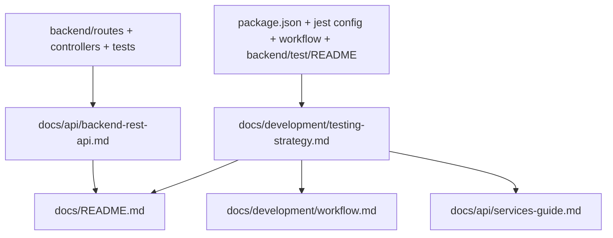

# M14B 文档统一详细设计文档

> **设计状态**：🟢 已完成
> **创建日期**：2026-03-27
> **设计者**：GPT-5 Codex
> **审核者**：项目维护者
> **预计工期**：1-2天

> **实施结果（2026-03-27）**
> - 已新增 `docs/api/backend-rest-api.md`，覆盖认证、统一响应格式和主要路由族的 HTTP 契约
> - 已新增 `docs/development/testing-strategy.md`，统一测试分层、命令入口、覆盖率口径与手工回归原则
> - 已完成 `README.md`、`docs/README.md`、`workflow.md`、`coding_standards.md`、`services-guide.md`、`DOCUMENTATION_MAINTENANCE.md`、`GITHUB_WORKFLOW.md` 的入口与治理规则收敛
> - 已完成 `ROADMAP.md`、`CHANGELOG.md` 状态同步，并修正仓库内文档链接为相对路径

---

## 📋 目录

- [需求分析](#需求分析)
- [技术方案](#技术方案)
- [代码结构](#代码结构)
- [实施步骤](#实施步骤)
- [测试方案](#测试方案)
- [风险评估](#风险评估)
- [替代方案](#替代方案)

---

## 需求分析

### 功能描述

M14A 完成后，当前路线图的下一项工作是 M14B“文档统一”。仓库已经有较多开发文档，但 API 与测试说明仍存在两个明显缺口：第一，`docs/api/` 当前主要描述前端服务层/仓储层接口，缺少独立的后端 REST 契约文档；第二，测试说明分散在 `README.md`、`docs/development/workflow.md`、`docs/development/coding_standards.md`、`docs/api/services-guide.md`、`backend/test/README.md` 等多处，入口多、口径杂、重复高，容易继续漂移。

M14B 的目标不是新增业务能力，也不是引入新的文档技术栈，而是在现有 Markdown 文档体系内做必要扩充：补齐“后端 REST API 契约文档”和“项目级测试策略总览文档”两类当前体系中缺失、但项目已经实际需要的单一数据源，并把现有入口文档调整为正确引用，降低后续协作、回归、评审和维护成本。

### 业务价值

- [x] 用户价值：间接提升迭代稳定性，减少因接口理解偏差和测试入口不清导致的返工。
- [x] 技术价值：建立后端 REST 契约和测试策略的单一数据源，降低文档漂移。
- [x] 业务价值：让后续里程碑在设计、实施、评审和交接时有统一文档基线。

### 功能范围

**包含**：
- ✅ 新增独立的后端 REST API 契约文档
- ✅ 新增项目级测试策略总览文档
- ✅ 调整现有文档入口，区分“前端内部 API 文档”和“后端 REST API 文档”
- ✅ 收敛测试说明引用关系，避免在多个文档中重复维护完整命令与口径

**不包含**（明确的边界）：
- ❌ 不修改后端接口实现、参数语义或权限逻辑
- ❌ 不引入 OpenAPI/Swagger 生成链路或新的文档站点工具
- ❌ 不在 M14B 内重写所有历史设计文档和变更记录
- ❌ 不在 M14B 内调整测试脚本、覆盖率阈值或 CI 行为
- ❌ 不重构现有文档目录层级或推翻既有文档治理规范

### 优先级

- **优先级**：P1
- **理由**：不阻塞线上功能，但会持续影响后续里程碑的设计准确性、实现效率和评审质量，属于结构性收口工作。

---

## 技术方案

### 方案概述

M14B 采用“体系内必要扩充 + 引用收敛”的最小可行方案。核心不是把所有文档重写一遍，也不是重建文档分类体系，而是在现有 `docs/` 结构下补齐两个明确缺口：

1. 一份后端 REST 契约文档，覆盖统一响应格式、认证方式、公共约束和主要路由族。
2. 一份项目级测试策略总览文档，覆盖测试分层、适用范围、命令入口、覆盖率口径、手工回归与已知边界。

完成这两个权威文档后，再对现有文档做引用收敛：
- `docs/README.md` 负责目录入口，不再模糊地把“API”都指向前端服务文档。
- `docs/development/workflow.md` 保留流程与检查清单，但测试细节改为引用测试策略总览。
- `docs/development/coding_standards.md` 保留“如何写测试”的规范，不再同时承担项目级测试范围、命令入口和覆盖率口径总览。
- `docs/api/services-guide.md` 继续承担前端服务层文档职责，不再夹带项目级测试总览口径。
- `backend/test/README.md` 保持后端真实数据库集成测试专用说明，不升级为项目总览。

本方案的硬约束是：不突破现有文档管理体系，只在现有体系下补充必要的权威文档类型，并同步修正文档定位说明，使新增内容被现有治理规则正式承认。

### 技术选型

| 技术点 | 选择方案 | 替代方案 | 选择理由 |
|--------|---------|---------|---------|
| REST 契约文档形式 | Markdown 手册 | OpenAPI/Swagger | 当前仓库已是 Markdown 文档体系，先补事实基线更轻量、更可落地 |
| 测试总览文档位置 | `docs/development/` | `README.md` 根文档 | 测试策略属于开发规范，不应塞回根 README |
| API 文档组织 | 区分前端内部 API 与后端 REST API | 继续混放在 `services-guide.md` | 语义不同，混放会继续误导协作方 |
| 文档治理方式 | 引用收敛 | 各处分别维护完整说明 | 符合单一数据源原则，降低漂移风险 |
| 体系演进方式 | 在既有规则内补充缺失分类 | 重写整套文档分类 | 当前问题是缺口，不是需要推翻体系 |

### DDD分层设计

本里程碑不改业务分层，只改文档体系。

**领域层（models/）**：
- [ ] 新建模型：无
- [ ] 修改模型：无
- 说明：M14B 不涉及领域对象

**服务层（services/）**：
- [ ] 新建服务：无
- [ ] 修改服务：无
- 说明：M14B 不涉及服务实现

**仓储层（repositories/）**：
- [ ] 新建仓储：无
- [ ] 修改仓储：无
- 说明：M14B 不涉及数据访问逻辑

**适配器层（adapters/）**：
- [ ] 新建适配器：无
- [ ] 修改适配器：无
- 说明：M14B 不涉及适配器实现

**表现层（pages/、components/）**：
- [ ] 新建页面：无
- [ ] 修改页面：无
- 说明：M14B 不涉及前端页面行为

### 架构图



### 数据模型

```typescript
interface RestResponseSuccess<T = unknown> {
  success: true;
  data: T;
  message: string;
}

interface RestResponseError {
  success: false;
  data: null;
  message: string;
  error_code: string;
}

interface TestStrategyDocScope {
  testLayers: string[];
  commands: string[];
  coveragePolicy: string[];
  manualRegression: string[];
  knownLimits: string[];
}
```

### 接口设计

**新增文档接口**（非代码接口）：

| 文档 | 说明 | 输入来源 | 输出内容 |
|------|------|------|--------|
| `docs/api/backend-rest-api.md` | 后端 REST 契约手册 | `backend/server.js`、`backend/routes/*.js`、controller、集成测试 | 路由、认证、状态码、响应格式、关键错误码 |
| `docs/development/testing-strategy.md` | 项目级测试策略总览 | 根 `package.json`、`backend/package.json`、workflow、backend/test/README、现有测试结构 | 测试分层、命令入口、覆盖率口径、手工回归、已知边界 |

### 文档模板骨架

为降低实施阶段的输出波动，M14B 约定新增文档至少采用以下骨架。

**后端 REST 契约文档条目模板**：

```markdown
#### [接口名称]

- Method: `POST | GET | PUT | PATCH | DELETE`
- Path: `/api/...`
- Auth: `Public | Bearer Token`
- Query: [关键查询参数，若无则写“无”]
- Body: [关键请求体字段，若无则写“无”]

成功响应：
- Status: `200 / 201`
- Body: `{ success, data, message }`

常见错误：
- `400` - [参数或业务校验失败]
- `401` - [未认证或 token 失效]
- `403` - [权限不足]
- `404` - [资源不存在]
```

说明：
- 模板只约束结构，不在设计阶段写死具体业务字段示例
- 具体字段、错误码和状态码以 route、controller、真实测试为准

**测试策略文档目录骨架**：

```markdown
## 1. 测试分层概览
## 2. 测试命令入口
## 3. 覆盖率口径与限制
## 4. 手工回归原则
## 5. 常见问题与相关文档
```

### 文档边界约定

为避免 M14B 再次形成重复文档，明确以下单一数据源：

- 后端 REST 接口契约：
  - 以 `docs/api/backend-rest-api.md` 为权威文档
  - 其他文档只保留入口链接或简短引用
- 项目级测试策略：
  - 以 `docs/development/testing-strategy.md` 为权威文档
  - `workflow.md` 保留流程检查清单，不再扩写完整测试总览
  - `coding_standards.md` 保留测试编写规范，不再重复维护项目级测试范围、命令入口和覆盖率口径
- 后端真实数据库集成测试细节：
  - 以 `backend/test/README.md` 为权威文档
  - 测试总览仅引用，不重复写操作细节
- 前端服务层接口说明：
  - 继续以 `docs/api/services-guide.md` 为权威文档
  - 不再承担项目测试总览职责

### 与现有文档体系的兼容约束

M14B 必须满足以下兼容要求：

- 不改变 `docs/architecture/`、`docs/development/`、`docs/api/`、`docs/design/` 的现有一级目录职责
- 不把后端 REST 契约混写回前端服务层 API 文档
- 不把项目级测试策略回塞到 `README.md` 或 `workflow.md` 作为新的长篇重复内容
- 不让 `coding_standards.md` 与 `testing-strategy.md` 同时维护同一层级的测试范围、命令和覆盖率口径
- 新增文档类型后，必须同步更新 `docs/DOCUMENTATION_MAINTENANCE.md` 与 `docs/README.md` 的定位说明，使其成为体系内被承认的正式分类
- 若治理规则未同步更新，则 M14B 视为未完成，不允许只落新文档、不修正规则

---

## 代码结构

### 文件变更清单

**新增文件**：
- `docs/api/backend-rest-api.md` - 后端 REST API 契约文档
- `docs/development/testing-strategy.md` - 项目级测试策略总览
- `docs/design/milestone-14b-documentation-unification.md` - M14B 设计文档

**修改文件**：
- `docs/README.md` - 调整 API / 测试文档入口说明
- `README.md` - 增加新文档入口链接
- `docs/development/workflow.md` - 测试流程改为引用总览文档，并补充“后端 REST 接口变更 → 更新 REST 契约文档”的维护规则
- `docs/development/coding_standards.md` - 收敛测试范围/命令/覆盖率总览描述，保留测试编写规范并改为引用 `testing-strategy.md`
- `docs/api/services-guide.md` - 收敛项目级测试说明，保留服务层测试说明和链接
- `docs/DOCUMENTATION_MAINTENANCE.md` - 补充 M14B 后的新文档归属与引用规范，确保新增类型被现有体系正式吸收
- `docs/development/ROADMAP.md` - M14B 状态流转时更新
- `docs/development/CHANGELOG.md` - M14B 完成后记录交付结果

### 核心代码结构

```javascript
// M14B 不新增业务代码
// 核心结构是文档职责拆分：

const docBoundaries = {
  backendRestApi: 'docs/api/backend-rest-api.md',
  testingStrategy: 'docs/development/testing-strategy.md',
  frontendServiceApi: 'docs/api/services-guide.md',
  backendRealIntegrationGuide: 'backend/test/README.md'
};
```

### 关键函数

**函数1**：无
- **输入**：无
- **输出**：无
- **职责**：M14B 为文档治理里程碑，不新增运行时代码
- **依赖**：无

---

## 实施步骤

### 第1步：建立文档事实基线（预计2小时）

- [x] **任务**：盘点后端路由、统一响应格式、测试入口和现有文档引用关系
- [x] **验证**：形成明确的“权威来源清单”和“重复内容清单”
- [x] **依赖**：无

**实施要点**：
1. REST 契约事实来源优先取 `backend/server.js`、`backend/routes/*.js`、controller、真实集成测试
2. 测试事实来源优先取根/后端 `package.json`、`workflow.md`、`backend/test/README.md`
3. 记录哪些文档保留细节、哪些文档只保留引用

---

### 第2步：编写后端 REST 契约文档（预计4小时）

- [x] **任务**：新增 `docs/api/backend-rest-api.md`
- [x] **验证**：覆盖所有已挂载路由族和统一响应格式
- [x] **依赖**：第1步完成

**实施要点**：
1. 先写公共约定：基础地址、认证方式、统一响应、错误码口径
2. 再按路由族拆分：`auth`、`users`、`tasks`、`families`、`stars`、`rewards`、`messages`
3. 每组接口至少写清方法、路径、关键参数、成功响应示例、关键错误场景
4. 不追求 OpenAPI 级穷尽字段描述，但必须达到“足够协作”的契约清晰度

**顺序说明**：
- 推荐先完成 REST 契约文档，再回头编写测试策略总览
- 理由是 REST 契约的事实来源更集中，适合作为 M14B 的第一块稳定输出
- 但这只是推荐实施顺序，不构成测试策略文档的前置依赖

---

### 第3步：编写测试策略总览文档（预计3小时）

- [x] **任务**：新增 `docs/development/testing-strategy.md`
- [x] **验证**：能回答“测什么、怎么跑、哪些是闸门、哪些是手工验证、覆盖率怎么看”
- [x] **依赖**：第1步完成

**实施要点**：
1. 明确前端单元测试、页面契约/行为测试、后端单元测试、后端轻量集成、后端真实 DB 集成的分层
2. 明确根级稳定闸门、覆盖率闸门和后端各入口的适用场景
3. 显式说明覆盖率统计口径与已知限制，避免把数字误读为风险已覆盖
4. 手工回归只保留项目级原则，真实 DB 细节引用 `backend/test/README.md`

---

### 第4步：收敛文档入口与重复内容（预计3小时）

- [x] **任务**：更新入口文档与引用关系
- [x] **验证**：从 `README.md` 和 `docs/README.md` 出发能正确找到 REST 契约和测试总览
- [x] **依赖**：第2步、第3步完成

**实施要点**：
1. `docs/README.md` 与 `README.md` 中区分前端 API 文档和后端 REST 文档
2. `workflow.md` 补充“后端 REST 接口变更 → 更新 REST 契约文档”的规则，并把测试总览口径改为引用 `testing-strategy.md`
3. `coding_standards.md` 只保留“如何写测试”的规范，不再重复维护项目级测试范围、命令入口和覆盖率口径
4. `services-guide.md` 中项目级测试统计、全局覆盖率口径等高漂移内容应收敛或改为引用
5. 同步更新 `DOCUMENTATION_MAINTENANCE.md` 的单一数据源清单与文档分类说明，确保新增文档类型被正式纳入体系
6. 保持单一数据源，不把新文档内容复制回多个旧文档

---

### 第5步：完成收尾与状态同步（预计1小时）

- [x] **任务**：更新 `ROADMAP.md` / `CHANGELOG.md` / 设计文档状态
- [x] **验证**：M14B 完成后路线图、变更记录和设计文档状态一致
- [x] **依赖**：前四步完成

**实施要点**：
1. `ROADMAP.md` 将 M14B 从“计划中/实施中”流转到“已完成”
2. `CHANGELOG.md` 记录新增文档、引用收敛和验证结果
3. 设计文档状态从“待审核”→“审核通过”→“实施中”→“已完成”

---

## 测试方案

### 单元测试

M14B 主要为文档治理，不新增业务代码单元测试。

| 测试项 | 测试方法 | 预期结果 |
|--------|---------|---------|
| REST 契约事实核对 | 文档与 `backend/routes/*.js`、controller、集成测试交叉核对 | 路径、方法、认证和关键错误码一致 |
| 测试命令核对 | 文档与根/后端 `package.json` 对照 | 所有命令可在仓库中找到真实入口 |
| 引用关系核对 | 手动点击/检索文档链接 | 入口文档能指向正确权威文档 |

### 集成测试

- [x] 场景1：从 `README.md` 能找到 REST 契约和测试总览
- [x] 场景2：从 `docs/development/workflow.md` 能跳转到项目级测试策略文档
- [x] 场景3：从 `docs/development/coding_standards.md` 能明确区分“测试编写规范”与“项目测试策略总览”
- [x] 场景4：从 `docs/api/services-guide.md` 能明确区分“前端服务接口”与“项目测试策略”

### 手动测试

1. **文档正确性测试**：
   - [x] 随机抽取 `tasks`、`rewards`、`messages` 三类接口，验证文档与 route/controller/test 一致
   - [x] 验证统一响应格式描述与 `backend/utils/response.js` 一致

2. **入口可达性测试**：
   - [x] 根 `README.md` 文档入口清晰
   - [x] `docs/README.md` 文档入口清晰
   - [x] 开发流程文档不再重复维护大段测试总览
   - [x] 编码规范文档不再重复维护项目级测试范围、命令和覆盖率总览

3. **回归测试**：
   - [x] 确认现有文档引用未断裂
   - [x] 确认 M14A、M13 等近期设计文档不被误改范围

### 测试覆盖率目标

- 文档里程碑不新增覆盖率指标
- 目标是“文档事实一致性”和“入口收敛”，不是新增运行时代码覆盖率

### 文档验收标准

- [x] 所有已挂载的后端路由族都在 REST 契约文档中有对应章节
- [x] 所有项目级测试命令都能在测试策略文档中找到对应入口
- [x] 从 `README.md` 和 `docs/README.md` 出发能找到后端 REST 契约文档与测试策略总览文档
- [x] `workflow.md`、`coding_standards.md`、`services-guide.md` 中不再分别维护同层级的项目测试总览
- [x] `DOCUMENTATION_MAINTENANCE.md` 已正式吸收新增文档类型与维护规则

---

## 风险评估

### 技术风险

| 风险项 | 影响 | 概率 | 应对措施 |
|--------|------|------|---------|
| 文档再次重复扩散 | 中 | 中 | 明确单一数据源，旧文档只保留链接和简述 |
| REST 契约写得过粗，无法支撑协作 | 高 | 中 | 按“方法 + 路径 + 认证 + 参数 + 响应 + 错误码”最低完整度编写 |
| 测试总览与真实命令漂移 | 高 | 中 | 以根/后端 `package.json` 为准逐项核对 |
| 历史统计数字继续过期 | 中 | 高 | 避免在稳定文档中固化易变测试数量和覆盖率数字，必要时只写口径和入口 |
| 新增文档类型未被治理规则接纳，形成“文档已写、体系未认” | 高 | 中 | 把 `DOCUMENTATION_MAINTENANCE.md` / `docs/README.md` 的规则同步更新列为必做项 |
| `coding_standards.md` 与 `testing-strategy.md` 再次产生测试口径重叠 | 中 | 中 | 设计中提前锁定两者职责边界：前者写规范，后者写总览 |

### 业务风险

| 风险项 | 影响 | 概率 | 应对措施 |
|--------|------|------|---------|
| 协作方继续把前端服务文档当成后端 API 契约 | 中 | 中 | 在入口文档中显式区分两类 API 文档 |
| 后续迭代未按新规则维护文档 | 中 | 中 | 在 `DOCUMENTATION_MAINTENANCE.md` 与 `workflow.md` 中补齐引用规范 |

---

## 替代方案

### 方案A：直接上 OpenAPI / Swagger

**优点**：
- 契约结构化程度更高
- 后续可扩展到自动生成

**缺点**：
- 当前仓库没有现成生成链路
- 首次落地成本更高，会把 M14B 扩大为工具链改造
- 需要先解决 controller / schema / 示例响应的结构化来源问题

**结论**：本阶段不选。M14B 先建立 Markdown 级稳定契约，后续若后端继续扩展，可再独立立项升级到 OpenAPI。

### 方案B：沿用现状，只在旧文档中补几段说明

**优点**：
- 修改量最小

**缺点**：
- 无法解决“前端服务 API”与“后端 REST API”语义混淆
- 测试说明仍会分散在多个文档中
- `workflow.md` / `coding_standards.md` / `services-guide.md` 的职责重叠仍然存在
- 继续放大文档漂移风险

**结论**：不选。该方案只能补丁式修复，不能完成 M14B 的“文档统一”目标。

### 方案C：最小新增权威文档 + 收敛引用关系

**优点**：
- 与现有 Markdown 体系兼容
- 实施成本可控
- 能直接解决缺失和重复两个核心问题

**缺点**：
- 仍需人工维护
- 第一版文档需要较强的事实核对

**结论**：选择该方案。它是当前项目阶段下投入最小、收益最直接、风险最可控的做法，而且属于对现有文档体系的必要扩充，不是对体系本身的推翻。
