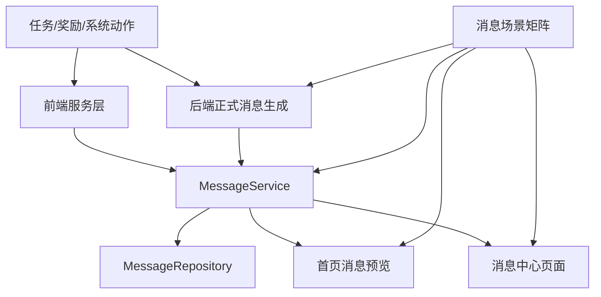

# 里程碑-15A：消息语义审计与通知体验治理 详细设计文档

> **设计状态**：🔴 待审核
> **创建日期**：2026-03-29
> **设计者**：GPT5 Codex
> **审核者**：项目维护者
> **预计工期**：7-10天

---

## 📋 目录

- [需求分析](#需求分析)
- [技术方案](#技术方案)
- [代码结构](#代码结构)
- [实施步骤](#实施步骤)
- [测试方案](#测试方案)
- [风险评估](#风险评估)
- [替代方案](#替代方案)

---

## 需求分析

### 功能描述

M10 已完成消息域云端化与多孩子路由修复，解决了“消息是否能跨设备同步、是否能区分个人流和家庭流”的基础问题。但当前消息域仍主要停留在“链路闭环已建立”的阶段，还没有经历一轮面向用户体验和规则一致性的系统审计。现有测试已覆盖部分消息文案、`scope=user/family`、`read-all` 授权范围，以及消息页 `今天/昨天` 日期标签，但还没有形成一套完整的“消息场景矩阵”来保证消息在正确时机创建、通知到正确的人、用正确视角表达，并在消息中心与首页预览中以一致方式呈现。

本里程碑的目标不是新增消息渠道，也不是重做消息中心 UI，而是基于当前真实代码与链路，系统排查“哪些业务动作应该发消息、应该发给谁、消息内容应该怎么写、不同阅读者看到的是否合理、跨日和聚合是否正确、还有哪些消息功能值得进一步优化”，并把结果落成可执行的实现与测试基线。M15A 不是纯研究型审计，而是“审计 + 确认范围内的 P1 级实现补齐”；M15A 完成后，消息域应从“能同步”提升到“语义稳定、体验可信、可验证”。

### 业务价值

- [x] 用户价值：减少孩子和家长看到“通知对象不对、文案视角不对、时间分段不自然、消息缺失或重复”的困惑，提升消息中心可信度。
- [x] 技术价值：把消息域从“局部场景测试”升级为“场景矩阵 + 契约测试”的可维护状态，为后续真实环境验证提供稳定基线。
- [x] 业务价值：让首页消息预览、消息中心、任务/奖励链路之间的通知语义收敛，避免多设备、多孩子场景下出现错误认知。

### 事实基线（2026-03-29，设计前）

#### 1. M10 已完成消息云端主链路，但当前目标仍偏“链路闭环”

从 `docs/design/milestone-10-message-notification-sync.md` 和现有后端实现可确认：

- 后端正式消息已支持 `task create/update/delete/complete/reset` 与 `reward create/update/delete/exchange`
- 消息按 `visibilityScope=user/family` 双记录落库
- 家长查看家庭流、孩子查看个人流的基础契约已经建立

但现有 M10 更偏“消息能正确进云端并按 scope 读出来”，还没有把“消息是不是在最佳时机创建、阅读者看到的文案是不是最自然、不同入口展示是否完全一致”收敛成稳定规则。

#### 2. 前端当前同时存在“云端托管消息”和“本地兼容消息”两套语义

`services/message-service.js` 当前同时承载两类逻辑：

- **云端模式**：`getMessagesByScope` / `refreshMessagesFromCloud` / provisional 收敛 / scope 读取
- **本地模式**：旧的领域模型消息创建逻辑、事件监听、`parent/child/shared` 占位符语义

已确认的设计决策：

1. **本地模式只作为降级/兼容路径存在，不作为正式语义权威**
2. M15A 仍需检查本地模式是否出现明显错误或重复消息，但正式规则以云端模式为准
3. 因此，M15A 的设计重点应放在“云端正式消息契约 + 降级路径不明显出错”，而不是追求本地模式与云端 100% 同构

#### 3. 本地任务完成链路存在重复创建消息的风险

当前本地模式下，`TaskService.updateTaskStatus()` 会同时发出：

- `EVENTS.TASK_STATUS_UPDATED`
- `EVENTS.TASK_COMPLETED`

而 `MessageService` 对这两个事件都在“完成任务”场景创建消息：

- `_handleTaskStatusUpdated()` 在 `operationType === 'complete'` 时创建完成消息
- `_handleTaskCompleted()` 再次创建完成消息

这意味着**仅在本地降级模式下**，同一次任务完成存在重复消息风险；云端正式模式下两个处理器都会因 `enableCloudStorage` 守卫直接返回。该问题仍属于 M15A 应优先确认和处理的 P1 问题，因为本地模式是当前明确保留的降级/兼容路径。

#### 4. 奖励维护类消息的可见范围与当前实现不一致

当前 `RewardService` 会发出多种事件，包括：

- `REWARD_CREATED`
- `REWARD_UPDATED`
- `REWARD_DELETED`
- `REWARD_DELIVERED`
- `REWARD_CLAIMED`
- `REWARD_UNCLAIMED`
- `REWARD_DELETED_BATCH`

但 `MessageService` 本地监听当前只处理：

- `REWARD_CREATED`
- `REWARD_CLAIMED`
- `REWARD_DELIVERED`
- `REWARD_UNCLAIMED`
- `REWARD_DELETED_BATCH`
- `REWARD_EXAMPLES_CLEARED`

也就是说：

- `REWARD_UPDATED` 在本地兼容消息链路中**完全缺失**
- `REWARD_DELETED` 在本地兼容消息链路中**完全缺失**

当前后端正式消息中：

- `reward create/update/delete` 仅生成家庭流消息
- `reward exchange` 生成孩子个人流 + 家庭流

而本轮设计确认的新要求是：

- **奖励创建 / 更新 / 删除后，家庭中的每个成员都应该能感知到**

这意味着当前实现与新目标之间存在明确差距。M15A 需要补清楚“每个成员都能感知”的正式实现方式，例如：

1. 家长继续通过家庭流感知维护动作
2. 每个活跃孩子补齐个人流维护消息
3. 不改变“家长家庭流 / 孩子个人流”的正式阅读模型

本轮设计已确认采用“家庭流 + 每个活跃孩子个人流”的正式方案，当前实现只能算部分满足，不能直接视为终态。

#### 5. 奖励全员可感知与当前消息唯一键模型存在实现约束

当前消息表对正式消息使用唯一键：

- `UNIQUE KEY uk_message_event_scope (message_event_key, visibility_scope)`

而后端 `_buildRewardMessageRecords()` 目前对 `create/update/delete` 没有 `subjectUserId`，因此天然只会生成一条家庭流记录。若直接把同一个 `messageEventKey` 扩成多条个人流记录，就会在 `visibility_scope='user'` 下互相冲突。

这意味着 M15A 在落地“每个活跃孩子都能感知”时，必须同步明确：

1. 每条孩子个人流消息都要绑定对应 `subjectUserId`
2. `messageEventKey` 必须把 `subjectUserId` 纳入区分维度
3. 家庭流记录与孩子个人流记录要允许同一次业务操作并存，而不是互相覆盖

#### 6. 首页消息预览和消息中心的排序口径不一致

当前：

- 首页 `loadMessageData()` 对消息做“未读优先，其次按时间倒序”，并只取前 3 条
- 消息中心 `processMessages()` 先按 `createTime` 纯时间倒序，再分段展示

这意味着同一 scope 下，首页看到的“最近消息”与消息中心看到的顶部消息并不一定一致。M15A 需要明确：首页预览是“最新消息预览”还是“未读优先预览”，并与消息中心建立一致的解释。

#### 7. 消息页日期分隔是在过滤前计算的，按 Tab 查看时可能出现分隔不准

消息页当前流程是：

1. `processMessages()` 先对完整消息列表计算 `showDateDivider`
2. `filterMessagesByTab()` 再按 `all/task/reward/system` 过滤和分页

这会带来一个边界问题：如果完整列表里两条同日消息中间夹着不同类型消息，切到某个类型 Tab 后，现有 `showDateDivider` 可能不再反映“过滤后列表”的真实相邻关系。M15A 需要确认这是否已经影响 UI，并决定是“过滤后再分段”还是“按当前 Tab 单独重算分隔”。

#### 8. 现有跨日消息测试覆盖过窄

当前消息页测试已覆盖：

- “跨自然日但未满 24 小时显示昨天”
- “同一自然日显示今天”

但仍未覆盖：

- `前天 / 星期几 / 月日 / 跨年日期` 分段
- 按 Tab 过滤后的日期分隔连续性
- `loadMoreMessages()` 后的日期分隔连续性
- 首页预览与消息中心在跨日场景下的一致性

#### 9. 正式消息与 provisional 收敛已有框架，但还缺系统性场景验证

前端当前已经有：

- `messageEventKey`
- `replaceSyncedMessagesByScope()`
- `cleanupStaleMessages()`
- `archiveLegacyMessages()`
- `TASK_CLOUD_SYNC_FAILED` / `REWARD_CLOUD_SYNC_FAILED` 触发 provisional 消息

但还缺少系统性矩阵去验证：

- 同一事件是否会出现“provisional + 正式消息并存”
- 删除/已读后重新拉取是否只影响当前 scope
- legacy 消息是否会被错误混入主流
- 首页预览是否会短暂展示应该被正式消息替换掉的 provisional

#### 10. 家长维护任务/奖励后的标题与摘要可读性仍偏弱

当前消息中心列表同时展示 `title` 和 `summary`。从现有后端正式消息实现看：

- 任务类标题多为 `任务已创建 / 任务已更新 / 任务已删除`
- 奖励类标题多为 `新奖励已创建 / 奖励已更新 / 奖励已删除`
- 任务/奖励对象名、操作者和受影响对象主要放在 `summary`

这带来两个体验问题：

1. **标题辨识度不足**：列表中快速扫读时，多个“任务已更新 / 奖励已更新”会显得很像，不容易立刻看出是谁对什么做了什么
2. **家长维护动作的受影响对象不总是清楚**：尤其是奖励维护类消息，当前 summary 能说明“创建/更新/删除了奖励”，但还没有明确面向“阅读者视角”的细化规则，例如孩子看到时是否需要强调“家长调整了可兑换奖励”

因此，M15A 不仅要校正文案是否“语法正确”，还要明确：

- 标题是否应承担更多动作辨识信息
- summary 是否应稳定包含“操作者 + 动作 + 对象 + 受影响人/范围”
- 任务维护与奖励维护是否需要不同的 copy 模板

#### 11. `upcoming / penalty / required / cancel exchange` 当前缺少后端正式入口

当前后端正式消息的创建入口都依附在既有命令型事务里：

- 任务 `create/update/delete/complete/reset`
- 奖励 `create/update/delete/exchange`

但当前代码里：

- `upcoming` 来自前端任务扫描与事件触发
- `penalty` 来自前端惩罚执行与事件触发
- `mark required / unmark required` 仅有前端本地服务方法，没有后端专用 command 接口
- `cancel exchange / unclaim` 仅在前端本地奖励服务里有完整退星与状态回退逻辑，后端路由当前只有 CRUD + `exchange`

这意味着 M15A 如果要把这些动作纳入正式云端消息体系，设计文档必须同步定义最小必要的后端 API、命令事务和前端调用时机，而不能只停留在“补消息入口”。

### 功能范围

**包含**：
- ✅ 梳理消息触发场景矩阵：任务、奖励、系统类消息分别在哪些动作上应该创建消息
- ✅ 审计消息接收对象与流向：孩子个人流、家长家庭流、共享设备孩子视角、家长代操作场景
- ✅ 审计并优化消息文案：以阅读消息的人为视角校正文案，不混用操作者视角和阅读者视角
- ✅ 审计跨日消息展示：自然日分段、`今天/昨天` 标签、日期分隔、分页后分段连续性
- ✅ 审计 provisional 消息与正式云消息的收敛逻辑，识别重复、遗漏、错保留等问题
- ✅ 对首页消息预览与消息中心做一致性检查，统一必要的过滤与排序语义
- ✅ 输出“消息功能优化清单”，并在本里程碑内实现 P1 级问题修复
- ✅ 为消息域补充前端单测、页面行为测试、必要的后端契约测试

**不包含**（明确边界）：
- ❌ 微信订阅消息、模板消息、系统推送通知
- ❌ WebSocket / SSE 实时推送
- ❌ 大规模视觉改版或重做消息中心页面信息架构
- ❌ 新建独立通知中心后端子系统
- ❌ 扩展到所有非消息域的交付收口，这部分放到 M15B

### 优先级

- **优先级**：P1
- **理由**：消息是用户直接感知的结果层；若消息时机、对象和文案存在偏差，真实环境验证只会放大问题，因此应先完成消息语义治理，再进入 M15B 的真实环境验证和交付级收口。

---

## 技术方案

### 方案概述

M15A 采用“先审计建矩阵，再按矩阵修实现和补测试”的方案。核心原则不是先改代码，而是先把消息域规则说清楚。第一步输出一份消息场景矩阵，覆盖“动作 -> 是否发消息 -> 个人流是否发 -> 家庭流是否发 -> 阅读视角文案 -> 预期展示位置 -> 是否允许 provisional”。第二步对照矩阵核查当前前后端实现，找出缺口、冲突和冗余。第三步仅修复高价值问题，并把这些规则固化到测试里。

为避免把 M15A 扩大成纯研究任务，本里程碑明确要求“审计结果必须直接落到代码契约”。也就是说，所有被确认的问题都要尽量转化为以下至少一种产物：前端消息服务测试、消息页行为测试、首页消息预览测试、后端消息文案/路由契约测试，或必要的实现修复。M15A 最终交付的不只是问题清单，而是一套更稳定的消息域规则基线。

### 首轮消息场景矩阵（审计草案）

| 来源 | 动作 | 当前正式/兼容实现 | 预期目标流向 | 当前结论 |
|------|------|------------------|-------------|---------|
| 任务 | create | 后端正式双记录；本地兼容也会发 | 个人流 + 家庭流 | 已有基础实现，需核对家长自建/代建/共享设备文案 |
| 任务 | update | 后端正式双记录；本地兼容会发 | 个人流 + 家庭流 | 需核对是否所有更新都值得发消息，避免噪声 |
| 任务 | delete | 后端正式双记录；本地兼容会发 | 个人流 + 家庭流 | 需核对删除文案和删除后历史展示策略 |
| 任务 | complete | 后端正式双记录；本地兼容仅在降级模式疑似重复触发 | 个人流 + 家庭流 | 已识别本地降级路径重复消息风险，P1 |
| 任务 | reset | 后端正式双记录；本地兼容走 `uncomplete/reset` 分支待核 | 个人流 + 家庭流 | 需核对文案和触发时机 |
| 任务 | upcoming | 当前主要是前端扫描 + 本地兼容消息 | 应纳入正式云端消息体系 | 已确认进入正式体系，需设计后端 materialize 入口、幂等键与文案 |
| 任务 | penalty | 当前主要是前端惩罚执行 + 本地兼容消息 | 应纳入正式云端消息体系 | 已确认进入正式体系，需设计后端扣星事务与正式消息一体化 |
| 任务 | mark required | 当前主要是前端显式标记 + 本地兼容消息 | 应纳入正式云端消息体系 | 已确认进入正式体系，需设计专用 command 入口与消息互斥规则 |
| 任务 | unmark required | 当前前端会发 `TASK_UNMARKED_REQUIRED` 事件，但本地 MessageService 处理器仅记录日志、不创建消息 | 应纳入正式云端消息体系 | 作为 required 规则变更的对称动作，一并进入正式体系 |
| 奖励 | create | 后端正式仅家庭流；本地兼容会发 | 家庭每个成员都能感知 | 当前正式实现不足，需补孩子可感知路径 |
| 奖励 | update | 后端正式仅家庭流；本地兼容完全缺失 | 家庭每个成员都能感知 | 当前正式实现不足，本地降级路径也缺口明确，P1 |
| 奖励 | delete | 后端正式仅家庭流；本地兼容完全缺失 | 家庭每个成员都能感知 | 当前正式实现不足，本地降级路径也缺口明确，P1 |
| 奖励 | exchange | 后端正式个人流 + 家庭流；本地兼容会发 provisional | 个人流 + 家庭流 | 需重点核对 actor/subject 视角和收敛 |
| 奖励 | delivered | 前端本地兼容有完整处理链路 | 不单独新增正式云消息 | 继续由 `exchange` 承担当前主链路上的最终交付语义 |
| 奖励 | unclaimed/cancel | 仅前端本地兼容覆盖，后端缺少正式 API/事务链路 | 应纳入正式云端消息体系 | 已确认进入正式体系，需补正式路由、退款回滚事务与文案 |
| 奖励 | deleted batch/examples cleared | 当前明确静默 | 默认不发 | 保持静默，但需要在矩阵中明确 |
| 系统 | welcome/system | 本地系统消息 | 当前视角可见 | 作为降级/兼容路径保留，正式语义不依赖 `shared` 作为权威机制 |

### 首轮已识别问题（审计草案）

| 编号 | 问题 | 级别 | 依据 |
|------|------|------|------|
| MSG-01 | 降级/兼容本地模式下任务完成存在重复消息风险 | P1 | 仅本地模式会同时经过 `TASK_STATUS_UPDATED` 与 `TASK_COMPLETED` 双路径 |
| MSG-02 | 奖励创建/更新/删除当前未满足“家庭每个成员都能感知”的目标 | P1 | 正式实现仅发家庭流，孩子侧感知不足 |
| MSG-03 | 首页预览与消息中心排序口径不一致 | P1 | 首页未读优先，消息页纯时间倒序 |
| MSG-04 | 消息页日期分隔在 Tab 过滤前计算，可能导致分隔不准 | P1 | `processMessages()` 先分段，`filterMessagesByTab()` 再过滤 |
| MSG-05 | 现有跨日消息测试覆盖过窄 | P1 | 仅验证 `今天/昨天`，未覆盖分页/分组/多 Tab |
| MSG-06 | local/cloud/shared 三套消息语义并存，降级边界未文档化 | P1 | `parent/child/shared`、`scope=user/family`、provisional 共存 |
| MSG-07 | upcoming / penalty / required 尚未纳入正式云端消息体系，且缺少后端正式触发机制设计 | P1 | 当前主要依赖前端事件或本地兼容消息，后端无对应 command / sync 入口 |
| MSG-08 | 家长维护任务/奖励后的标题与摘要辨识度不足 | P1 | 当前标题泛化，动作对象和受影响范围主要压在 summary |
| MSG-09 | reward unclaimed/cancel 尚未纳入正式云端消息体系，且后端缺少 API/事务链路 | P1 | 已确认进入正式范围，但当前只有前端本地退星与回滚逻辑 |
| MSG-10 | reward delivered 是否需要独立正式云消息仍需保持边界清晰 | P2 | 当前设计明确不单独扩口，需防止后续实现漂移 |
| MSG-11 | 奖励维护类全员可感知与现有 `(message_event_key, visibility_scope)` 唯一键存在冲突风险 | P1 | 若不引入 child-specific `subjectUserId/messageEventKey`，多条个人流消息会相互覆盖 |
| MSG-12 | required / unrequired 正式化若直接复用通用 task update 链路，可能出现同次操作双发消息 | P1 | 后端当前 `updateTask()` 会统一产出 `task_update` 正式消息 |

### 已确认设计决策

结合当前实现复杂度、现有正式消息模型和本轮已确认的产品目标，M15A 按以下设计决策执行：

1. **正式语义以云端消息体系为权威，本地模式只保留降级/兼容职责**
   - 云端正式消息承担消息时机、通知对象、阅读视角和跨设备一致性的唯一权威。
   - 本地模式只负责云端不可用时的降级展示与兼容，不再作为正式语义设计基准。
   - M15A 仍要求本地模式不出现明显错发、漏发和重复，但不追求与云端逐项同构。

2. **奖励 create/update/delete 采用“家庭流 + 每个活跃孩子个人流”**
   - 家长继续通过家庭流感知维护动作。
   - 每个活跃孩子都收到对应个人流维护消息，满足“家庭中的每个成员都可以感知”。
   - 不改变现有“家长家庭流 / 孩子个人流”的正式阅读模型。
   - 个人流 fan-out 的“活跃孩子”按家庭内 `role='child' && status='active'` 解析。
   - 每条孩子个人流记录都使用该孩子的 `userId/subjectUserId`，并让 `messageEventKey` 带上对应 `subjectUserId`，从而避免多条个人流消息在 `user` scope 下互相覆盖。
   - 家庭流仍保留单条家庭记录；若家庭当前没有活跃孩子，只保留家庭流。

3. **upcoming / penalty / required 全部纳入正式云端消息体系**
   - `upcoming`、`penalty`、`mark required`、`unmark required` 统一进入正式云端消息范围，但按不同触发类型分别设计：
   - `upcoming`：采用“后端扫描 + 云端 materialize”的方式，不引入 cron；由前端在应用启动/首页刷新/消息刷新前调用专用 sync 接口触发服务端扫描，并以幂等 `messageEventKey` 落正式消息。
   - `upcoming` 不按 append-only 历史事件处理，而按“活跃提醒”处理：同一任务同一提醒槽只保留一条正式消息；更近的提醒槽会替换或归档更早的提醒槽；任务完成、删除、重置、过截止时间后，对应 upcoming 自动归档或从主消息流移除。
   - `penalty`：采用“后端惩罚命令/同步接口 + 扣星事务 + 正式消息落库”一体化处理，不再依赖前端本地惩罚逻辑作为权威。
   - `penalty` 的正式语义以服务端事务结果为准：只有当扣星、星星流水、任务 `penaltyApplied` 状态和正式消息全部成功提交后，才视为一次成功惩罚；任何一步失败都应整体回滚，避免“消息已发但余额未变”。
   - `penalty` 的触发入口放在任务域刷新/状态检查链路，不放在消息拉取链路；打开消息页或首页消息区不会直接触发新的扣星事务。
   - `mark required / unmark required`：采用专用 task command 接口，不复用通用 `task update` 作为正式语义入口。
   - 本地兼容路径可以保留，但只能作为降级，不再是正式主链路。
   - 对 required 规则变更，专用 `task_required / task_unrequired` 正式消息优先级高于泛化 `task_update`；同一次专用 toggle 操作不再重复生成 `task_update`。

4. **reward cancel exchange / unclaim 纳入正式云端消息体系**
   - `cancel exchange` / `unclaim` 在本轮中视为正式消息范围内的已确认动作，不再保留为 P2 观察项。
   - 这些动作涉及奖励状态回退和星星余额语义变化，必须保证个人流和家庭流的通知对象正确。
   - 正式接口采用独立 command 路径，例如 `PATCH /api/rewards/:rewardId/cancel-exchange`，不复用 `exchange`。
   - 服务端必须在同一事务中完成：权限校验、奖励状态回退、星星退款/流水回滚、正式消息创建。
   - 该事务也必须支持 `operationKey` 幂等，避免重复取消导致重复退款或重复消息。

5. **reward delivered 不单独新增正式云消息**
   - 当前继续由 `exchange` 承担主链路上的最终交付语义。
   - 本地兼容路径如已有 `delivered` 提示可以保留，但不作为正式云端扩口目标。
   - 后续若业务要求把“发起兑换”和“确认发放”拆成两个明确阶段，再单独立项处理。

6. **家长维护任务/奖励的标题与摘要必须提升可辨识度**
   - 标题必须优先表达“发生了什么动作”，避免大量 `任务已更新` / `奖励已更新` 造成扫读困难。
   - 摘要必须稳定表达“操作者 + 动作 + 对象 + 受影响人或范围”。
   - 文案设计必须以阅读者视角为准：孩子侧突出“家长调整了与你相关的内容”，家长侧突出“家庭规则/奖励池发生了什么变化”。
   - 示例：
   - Before：`title="奖励已更新"`，`summary="家长更新了奖励'冰淇淋'"`
   - After：`title="奖励池调整"`，`summary="家长更新了奖励“冰淇淋”的兑换条件"`
   - Before：`title="任务已更新"`，`summary="妈妈更新了任务'数学口算'"`
   - After：`title="任务要求调整"`，`summary="妈妈调整了你的任务“数学口算”，请按新要求完成"`

7. **首页预览与消息中心保留不同展示职责，但必须形成明确契约**
   - 首页消息区是“提醒预览”，沿用“未读优先，其次时间倒序，只取前 3 条”的策略。
   - 消息中心是“完整历史列表”，按 `createTime` 纯时间倒序展示。
   - 两个入口必须共享同一 scope 消息源；未读总数始终基于完整 scope 消息集合计算，不因首页只取前 3 条而改变。

8. **消息页日期分隔改为按最终展示序列重算**
   - `showDateDivider` 不再在完整列表排序后一次性固化。
   - 应在“按当前 Tab 过滤 + 当前分页切片”之后，对最终展示序列重新计算日期分隔。
   - `loadMoreMessages()` 后需要基于扩展后的当前展示序列再次重算，确保分页前后分隔连续。

### 技术选型

| 技术点 | 选择方案 | 替代方案 | 选择理由 |
|--------|---------|---------|---------|
| 消息规则治理方式 | 先建立场景矩阵，再修改实现与测试 | 直接边看边改 | 消息问题跨前后端、跨页面，缺少矩阵会导致局部修复后再次漂移 |
| 文案正确性保障 | 将关键 copy 提炼为可测契约，以测试固化 | 只靠人工回归核对 | 阅读视角文案最容易回归，必须可自动验证 |
| 跨日展示治理 | 以自然日分段为主，补消息页分页与分隔测试 | 继续只测 `今天/昨天` 两个点 | 现有覆盖过窄，无法证明整页分段逻辑可靠 |
| 首页/消息中心一致性 | 统一从 `MessageService` 语义出发做校验 | 页面各自维护局部规则 | 当前同一消息在两个入口存在不同过滤和展示风险 |
| provisional 收敛检查 | 以事件键、scope 和正式消息回灌为准补测试 | 只做人工观察 | 该问题跨云端/本地状态，手工观察难以稳定复现 |
| 正式提醒类落地方式 | 命令驱动 + 按需 sync materialize | 引入 cron / 定时任务系统 | 当前项目没有调度基础设施，按需云端 materialize 更贴合现有架构 |
| 奖励维护全员感知 | 家庭流 + 活跃孩子个人流 fan-out | 直接让孩子读取家庭流 | 保留现有阅读模型，同时满足“每个成员可感知” |
| 撤销兑换接口 | 独立 `cancel-exchange` command | 复用 `exchange` 或纯前端回滚 | 状态回退、退款和消息语义都需要独立命令语义 |

### 消息场景矩阵约定

M15A 设计阶段先明确以下五类检查维度：

1. **触发时机**
   - 哪些业务动作应该创建消息
   - 哪些动作只更新业务状态，不应新增消息
   - 哪些失败场景只允许 provisional，不允许伪装正式消息
   - upcoming / penalty / required / cancel / unclaim 纳入正式体系后的创建入口放在哪里

2. **通知对象**
   - 孩子个人流是否应收到
   - 家长家庭流是否应收到
   - 当前登录用户与当前视角用户不一致时，谁才是阅读者
   - 奖励维护类消息如何通过“家庭流 + 每个活跃孩子个人流”做到“家庭每个成员都能感知”

3. **文案视角**
   - 个人流优先用“你/你的”
   - 家庭流优先用“孩子名/家长名”
   - 家长代操作、共享设备孩子自操作、家长自己视角等场景分别校验
   - 标题与摘要分别承担什么信息，不再只做泛标题

4. **展示聚合**
   - 首页预览和消息页是否使用一致的排序、过滤和未读口径
   - 消息页是否按自然日正确加分隔
   - 分页加载后是否破坏日期分隔连续性

5. **收敛与去重**
   - provisional 与正式消息是否会重复显示
   - 删除、已读、批量已读是否只影响当前授权范围
   - legacy / migrated 历史消息是否错误混入主消息流

### 正式消息创建机制

1. **命令型正式消息**
   - 任务 `create/update/delete/complete/reset`
   - 奖励 `create/update/delete/exchange`
   - `mark required / unmark required`
   - `cancel exchange / unclaim`
   - 这些消息都必须在后端命令事务内创建，和业务状态变更保持同一 `operationKey`

2. **扫描/派生型正式消息**
   - `upcoming`
   - `penalty`
   - 这两类不依赖用户一次性点击命令，而依赖“当前状态是否满足提醒/惩罚条件”
   - M15A 采用“后端扫描 + 按需 materialize”的方式，不引入独立调度系统
   - `upcoming` 属于“提醒态消息”，不是永久历史事件；它需要覆盖、过期和回收策略
   - `penalty` 虽然通过扫描或同步发现，但一旦命中执行条件，必须落到服务端事务里完成真实扣星和消息写入
   - `upcoming` 可以在消息域 refresh 前按需 sync
   - `penalty` 不在消息域 refresh 前执行，而是在任务域刷新、应用启动后的规则检查、或专用任务同步入口执行

3. **去重与幂等**
   - 命令型消息继续使用 `operationKey + source + action + subjectUserId` 生成 `messageEventKey`
   - 新建任务时允许继续通过 `createTask` 一次性写入 `isRequired=true`，保持现有任务创建表单和 `POST /api/tasks` 语义稳定
   - 任务创建阶段若初始即为必做任务，只生成 `task_create` 正式消息，不额外追加一条 `task_required`；`task_required / task_unrequired` 仅用于任务已存在后的显式 toggle
   - `penaltyApplied` 不再作为公共 create/update API 可接受字段；云端模式下只能由服务端 penalty 事务内部写入
   - `upcoming` 必须引入稳定的“提醒槽”键，例如 `taskId + reminderSlot + subjectUserId`，确保同一提醒槽不会重复累积
   - `upcoming` 的更近提醒槽可以覆盖更早提醒槽，避免消息中心堆积多条已过时的“即将到期”
   - `penalty` 必须引入稳定的“惩罚执行槽”键，例如 `taskId + penaltyRuleSlot + subjectUserId`，防止重复扣星和重复发消息
   - 奖励维护 fan-out 的孩子个人流必须把 `subjectUserId` 纳入 `messageEventKey`

### 提醒类消息生命周期

1. **`upcoming` 的生命周期**
   - 创建条件：任务满足某个提醒槽的触发条件，且该提醒槽尚未 materialize
   - 更新条件：同一任务进入更近的提醒槽时，新提醒替换或归档旧提醒
   - 失效条件：任务完成、任务删除、任务被重置、任务时间已过、提醒条件已失效
   - 展示规则：仅活跃 `upcoming` 进入主消息流；失效提醒归档后不再参与首页预览和消息中心主列表
   - 查询规则：当前 UI 主查询默认排除 `isArchived=true` 的消息；归档提醒只作为内部留痕，不进入首页预览、消息中心主列表和未读统计

2. **`penalty` 的生命周期**
   - 创建条件：服务端确认 required 任务满足惩罚条件，且本惩罚执行槽尚未处理
   - 终态规则：`penalty` 属于已发生结果事件，创建后保留为正式历史消息，不做“活跃提醒”覆盖
   - 幂等要求：同一惩罚执行槽只能扣星一次、落一组正式消息一次

### 后端事务边界

1. **`penalty` 事务边界**
   - 事务内必须包含：惩罚条件复核、星星扣减、星星流水记录、任务 `penaltyApplied` 更新、正式消息创建
   - 若任一步失败，整体回滚，不允许出现部分成功
   - 前端只能读取事务结果，不再以本地扣星结果作为正式来源

2. **`cancel exchange / unclaim` 事务边界**
   - 事务内必须包含：权限校验、奖励状态回退、星星退款、退款流水、正式消息创建
   - 若消息创建失败，退款和状态回退也必须回滚，保持业务结果与消息语义一致

### penalty 迁移与降级策略

1. **权威迁移策略**
   - API 启用的云端模式下，`penalty` 的正式执行权迁移到后端；前端本地 `task-penalty` 不再作为正式来源。
   - API 关闭的纯本地模式下，保留现有前端 penalty 逻辑作为降级/兼容路径。

2. **历史数据边界**
   - 迁移前已在本地发生的 penalty 历史不做自动回灌补账，这不作为 M15A 范围内的历史修复目标。
   - M15A 以“迁移后新发生的 penalty 由后端权威执行”为边界，历史对账作为已知边界留给 M15B 真实环境验证阶段观察。

3. **失败与降级策略**
   - 云端模式下若后端 penalty 检查或执行失败，前端不再回退为本地正式扣星，避免出现双重权威。
   - 失败场景允许保留旧消息展示、记录错误日志并在后续任务域刷新时重试。
   - 必要时可以显示非正式错误提示，但不创建伪正式 penalty 消息。

### 查询与展示契约

1. **主消息流查询**
   - 首页预览、消息中心主列表、未读统计默认只读取 `deleted_at IS NULL && is_archived = 0` 的消息。
   - `isArchived` 消息不参与 `getMessagesByScope()` 主路径返回，也不参与未读计数。
   - 与主列表口径一致，`getUnreadMessages()`、`getUnreadCount()`、高优先级未读集合、`read-all` 的目标集合默认也只作用于未归档消息；若后续需要查看归档提醒，必须走显式的归档查询入口。

2. **提醒态与历史态共表策略**
   - `upcoming` 与 `penalty` 共用 `messages` 表，但靠 `notificationType` 和 `isArchived` 区分生命周期。
   - `upcoming` 允许被归档以退出主流；`penalty` 作为结果事件默认保留在主流历史中，除非用户主动已读/删除或后续另有归档规则。

3. **sync 性能与失败策略**
   - `upcoming` sync 允许挂在消息 refresh 前，但需要节流，默认同一 scope 5 分钟内不重复触发。
   - `upcoming` sync 失败时，仍展示本地已有正式消息或上次成功回灌结果，不阻塞消息页面加载。
   - 单次 `upcoming` sync 的目标响应时间应控制在普通消息刷新可接受范围内；若超时则跳过本轮 sync，仅执行消息读取。

### DDD分层设计

**领域层（models/）**：
- [ ] 新建模型：无
- [x] 修改模型：`models/message.js`
- [x] 修改模型：`backend/models/Message.js`
- 说明：
  - 如审计结果确认存在字段语义不清，补齐模型校验或注释性约束
  - 不新增新的消息大类，只收敛现有字段语义

**服务层（services/）**：
- [x] 修改服务：`services/message-service.js`
- [x] 修改服务：`backend/services/messageService.js`
- [x] 修改服务：`services/task-service.js`
- [x] 修改服务：`services/reward-service.js`
- 说明：
- 前端消息服务负责 scope 解析、回灌、本地 provisional 收敛、兼容接口
- 后端消息服务负责正式消息事件生成与文案组装
- 任务/奖励服务或控制器在必要时补齐操作者上下文透传
- upcoming / penalty / required / cancel / unclaim 需补对应后端正式消息生成入口
- `upcoming / penalty` 需要后端新增扫描/同步方法
- 奖励维护 fan-out 需要在后端消息服务中补活跃孩子解析与多条个人流记录生成
- `penalty` 的后端扫描/执行能力应挂到任务域现有状态检查入口，而不是消息域 refresh 入口
- 云端模式下，前端 `MessageService` 对 `TASK_UPCOMING`、`TASK_PENALTY_APPLIED`、`TASK_MARKED_REQUIRED`、`TASK_UNMARKED_REQUIRED` 的本地兼容处理必须显式降级化：要么增加 `enableCloudStorage` guard，要么改为仅在纯本地模式注册/执行，避免与正式云端消息重复

**仓储层（repositories/）**：
- [x] 修改仓储：`repositories/message-repository.js`
- 说明：
  - 重点关注 scope 查询、正式消息替换、stale cleanup、legacy/provisional 边界

**适配器层（adapters/）**：
- [ ] 新建适配器：无
- [ ] 修改适配器：通常不需要
- 说明：
  - 除非审计发现消息接口调用参数或端点定义存在明显问题，否则不扩大到适配器层改造

**表现层（pages/、components/）**：
- [x] 修改页面：`packageMessage/pages/message/message.js`
- [x] 修改页面：`pages/index/index.js`
- [x] 修改模块：`pages/index/modules/index-refresh-coordinator.js`
- 说明：
  - 消息页聚焦分段、分页、已读删除口径
  - 首页聚焦预览列表、未读数、当前视角一致性
  - 首页/消息页需要按最终契约分离“提醒预览”与“完整历史”职责

### 架构图



### 数据模型

```typescript
interface MessageAuditExpectation {
  sourceType: 'task' | 'reward' | 'system';
  action: string;
  shouldCreateMessage: boolean;
  scopes: Array<'user' | 'family'>;
  readerPerspective: 'child' | 'parent' | 'system';
  allowsProvisional: boolean;
  shouldAppearOnHomePreview: boolean;
  shouldAppearOnMessagePage: boolean;
  triggerMode: 'command' | 'sync-materialize';
}
```

```typescript
interface MessageDisplayGroup {
  dateDivider: string;
  showDateDivider: boolean;
  timeDisplay: string;
}
```

### 接口设计

**拟新增或增强的服务接口**：

| 方法 | 说明 | 参数 | 返回值 |
|------|------|------|--------|
| `syncUpcomingTaskMessages` | 服务端扫描当前 scope 下的 upcoming 任务并 materialize 正式消息 | `{ viewerUserId, familyId, scope }` | `{ createdCount, dedupedCount }` |
| `syncRequiredTaskPenalties` | 服务端检查应执行的 required penalty，并在扣星事务内创建正式消息 | `{ viewerUserId, familyId, scope }` | `{ penaltyCount, affectedTaskIds }` |
| `markTaskRequired` | 专用 required command，避免与通用 `task_update` 混发 | `{ taskId, operatorContext }` | `{ task, messageCreated }` |
| `unmarkTaskRequired` | 专用 unrequired command，避免与通用 `task_update` 混发 | `{ taskId, operatorContext }` | `{ task, messageCreated }` |
| `cancelRewardExchange` | 服务端取消兑换，完成退款、状态回退和正式消息落库 | `{ rewardId, operatorContext }` | `{ reward, refundedPoints, messageCreated }` |
| `getMessagesByScope` | 保持现有入口，补充一致性测试 | `{ scope, userId, requireFresh }` | `Message[]` |
| `refreshMessagesFromCloud` | 在获取消息前补齐必要的 `upcoming` 云端 sync，再执行正式消息回灌 | `{ scope, userId }` | `{ success, data, message }` |

---

## 代码结构

### 文件变更清单

**新增文件**：
- `docs/design/milestone-15a-message-semantics-audit.md` - M15A 详细设计文档

**修改文件**：
- `services/message-service.js` - 审计与收敛消息语义主逻辑
- `repositories/message-repository.js` - 统一 scope / provisional / stale cleanup 相关行为
- `packageMessage/pages/message/message.js` - 跨日分段、分页和页面消息口径
- `pages/index/index.js` - 首页消息预览与未读统计一致性
- `pages/index/modules/index-refresh-coordinator.js` - 消息刷新触发时机与页面状态一致性
- `utils/app/post-login-bootstrap.js` - 登录后任务状态检查入口迁移，避免云端模式继续走前端本地 penalty 权威链路
- `utils/api-config.js` - 增加正式 sync / command 端点配置
- `backend/services/messageService.js` - 正式消息文案与消息创建规则
- `backend/services/taskService.js` - 必要时补齐任务消息上下文
- `backend/services/rewardService.js` - 必要时补齐奖励消息上下文
- `backend/controllers/taskController.js` - 为 upcoming / required / penalty 正式化补上下文、command 和 sync 入口
- `backend/controllers/rewardController.js` - 为奖励维护全员感知与 cancel / unclaim 正式化补角色/目标上下文
- `backend/routes/tasks.js` - 增加 required command / task sync 端点
- `backend/routes/rewards.js` - 增加 cancel-exchange 端点
- `test/services/message-service.test.js` - 前端消息服务语义矩阵测试
- `test/pages/message-page*.test.js` - 消息页跨日分段、已读删除、分页行为测试
- `test/pages/index*.test.js` - 首页消息预览排序、未读统计与当前视角一致性测试
- `test/backend/message-service-copy.test.js` - 后端消息文案契约测试
- `backend/test/integration/message-api-m10-real.test.js` - 如需补充真实集成消息契约

### 核心代码结构

```javascript
// 示例：奖励维护 fan-out 和日期分隔重算的核心骨架

async function buildRewardMaintenanceRecords({ reward, familyId, action, actorUserId, operationKey }) {
  const activeChildren = await getActiveChildMembers(familyId);
  const familyRecord = buildFamilyRewardRecord({ reward, action, actorUserId, operationKey });
  const userRecords = activeChildren.map(child =>
    buildUserRewardRecord({
      reward,
      action,
      actorUserId,
      subjectUserId: child.userId,
      operationKey
    })
  );

  return [familyRecord, ...userRecords];
}

function recomputeDateDividers(messages) {
  let lastDate = '';
  return messages.map(message => {
    const dateDivider = formatDate(message.createTime);
    const showDateDivider = dateDivider !== lastDate;
    lastDate = dateDivider;
    return { ...message, dateDivider, showDateDivider };
  });
}
```

### 关键函数

**函数1**：`_buildTaskMessageCopy` / `_buildTaskContent`
- **输入**：任务动作、操作者、归属孩子、任务标题
- **输出**：个人流和家庭流文案
- **职责**：统一消息文案的阅读者视角
- **依赖**：用户显示名解析、动作语义映射

**函数2**：`processMessages`
- **输入**：消息数组
- **输出**：带日期分隔和时间展示的消息数组
- **职责**：统一消息页按自然日分段展示
- **依赖**：`formatDate`、`formatMessageTime`

**函数3**：`replaceSyncedMessagesByScope`
- **输入**：scope、userId、云端消息列表
- **输出**：替换后的正式消息列表
- **职责**：确保正式消息回灌时不会与 provisional 冲突
- **依赖**：`messageEventKey`、`visibilityScope`

**函数4**：`_buildRewardContent`
- **输入**：奖励动作、操作者、阅读者上下文、奖励名称
- **输出**：家庭流与个人流文案
- **职责**：确保奖励维护类消息能被全家成员感知，且标题/摘要一眼看懂动作
- **依赖**：奖励可见策略、家庭成员视角规则

**函数5**：`syncUpcomingTaskMessages` / `syncRequiredTaskPenalties`
- **输入**：当前 viewer/scope、操作时间槽
- **输出**：新增/去重后的正式消息统计
- **职责**：把扫描型消息正式化为云端消息，不引入 cron
- **依赖**：任务查询、幂等事件键、正式消息写入
- **补充约束**：
- `syncUpcomingTaskMessages` 负责活跃提醒的创建、替换和失效归档
- `syncRequiredTaskPenalties` 负责在服务端事务内执行扣星并落正式结果消息
- `syncRequiredTaskPenalties` 不挂在消息 refresh 前，而挂在任务状态检查/任务刷新链路

**函数6**：`recomputeDateDividers`
- **输入**：当前 Tab + 当前分页后的最终消息数组
- **输出**：带 `showDateDivider` 的最终展示数组
- **职责**：保证过滤和分页后的日期分隔准确
- **依赖**：`formatDate`

---

## 实施步骤

### 第1步：固化消息矩阵与目标契约（预计0.5天）

- [ ] **任务**：梳理任务、奖励、系统消息的触发动作、目标流向、阅读者视角和展示预期
- [ ] **验证**：设计文档中形成完整矩阵，并能覆盖当前已知问题
- [ ] **依赖**：现有 M10 设计文档、消息服务实现、现有测试

**实施要点**：
1. 先列出“应该发”的动作，再列出“明确不发”的动作
2. 区分“操作者”“任务/奖励归属用户”“阅读消息的人”
3. 明确首页预览和消息中心是否都应显示
4. 把 local / cloud / provisional 三条路径分别标明，不混写
5. 把“奖励维护类消息让全家成员可感知”的目标拆成明确实现策略
6. 把 `cancel exchange / unclaim`、`upcoming / penalty / required` 明确列为正式消息范围
7. 拍板首页预览、消息页排序和日期分隔的最终契约

---

### 第2步：前后端消息语义审计（预计1天）

- [ ] **任务**：逐项核对前端 `MessageService`、后端 `messageService`、消息页和首页预览实现
- [ ] **验证**：输出问题清单，按 P0/P1/P2 分级
- [ ] **依赖**：第1步矩阵

**实施要点**：
1. 优先检查个人流/家庭流错发、漏发、重复发
2. 优先检查家长代操作、共享设备孩子视角
3. 检查 provisional 和正式云消息的对账与回收
4. 重点核对本地模式的旧 `parent/child/shared` 语义是否仍需保留
5. 专项审计标题与摘要是否能让用户一眼看出“谁对什么做了什么”
6. 核对奖励维护全员感知是否通过正式消息而不是页面侧拼装实现
7. 审计 `message_event_key + visibility_scope` 唯一键是否会阻塞 fan-out 方案

---

### 第3步：补齐后端正式消息能力（预计2.5-3.5天）

- [ ] **任务**：实现 confirmed scope 对应的后端 command / sync / formal message 能力
- [ ] **验证**：对应问题能被自动化测试覆盖
- [ ] **依赖**：第2步问题清单

**实施要点**：
1. 奖励 create/update/delete 按“1 条家庭流 + N 条活跃孩子个人流”生成正式消息
2. `mark required / unmark required` 增加专用后端 command 入口，并压制该操作的泛化 `task_update`
3. `upcoming` 增加后端 sync materialize 入口，不引入定时调度系统
4. `penalty` 增加后端 penalty command / sync 入口，保证扣星事务与正式消息同事务完成，并接入任务域现有状态检查入口
5. `cancel exchange / unclaim` 增加独立后端路由和退款回滚事务
6. 同步调整标题/摘要模板，确保阅读者视角正确
7. 为 `upcoming` 增加活跃提醒替换/归档策略，避免消息中心累积过期提醒
8. 从通用任务更新白名单中移除 `isRequired` / `penaltyApplied`，强制改走专用 command
9. 保留 `createTask(isRequired=true)` 作为“创建即为必做任务”的唯一公共入口，但该创建操作只产出 `task_create` 消息，不重复产出 `task_required`
10. 从公共任务创建入口中同步移除 `penaltyApplied` 入参；该字段只允许后端 penalty 事务和内部迁移逻辑写入

---

### 第4步：补齐前端集成与展示契约（预计1.5-2天）

- [ ] **任务**：接入新 command / sync 入口，收敛首页与消息页展示逻辑
- [ ] **验证**：首页、消息页、回灌和降级路径符合设计契约
- [ ] **依赖**：第3步后端能力可用

**实施要点**：
1. `refreshMessagesFromCloud()` 在拉取正式消息前仅补调用必要的 `upcoming` sync 入口，并做 5 分钟节流
2. 首页继续保留“未读优先预览”，但未读数基于完整 scope 集合
3. 消息页改为对“当前 Tab + 当前分页”结果重算日期分隔
4. 本地降级路径补去重和缺失奖励消息兜底，避免明显错误
5. 云端模式下把现有前端 `checkTasksStatus()` 权威入口从 [index-refresh-coordinator.js](/Users/wangdafei/code/study_task_wechat/pages/index/modules/index-refresh-coordinator.js#L73) 和 [post-login-bootstrap.js](/Users/wangdafei/code/study_task_wechat/utils/app/post-login-bootstrap.js#L17) 迁移到后端 task sync / command；避免登录启动或首页刷新继续触发前端本地扣星
6. `checkUpcomingTasks()` 可继续保留给首页“即将开始任务”卡片使用，但云端模式下不再承担正式 upcoming 消息创建职责
7. 云端模式下为 `services/message-service.js` 中 `TASK_UPCOMING` / `TASK_PENALTY_APPLIED` / `TASK_MARKED_REQUIRED` / `TASK_UNMARKED_REQUIRED` 本地处理链增加显式 guard 或注册隔离，防止首页任务扫描、任务惩罚检查、必做切换继续落本地兼容消息

---

### 第5步：补齐自动化测试（预计1.5-2天）

- [ ] **任务**：把矩阵中高价值场景补成单测/行为测试/契约测试
- [ ] **验证**：前端与消息相关测试全绿，必要场景补充后端契约验证
- [ ] **依赖**：第3步与第4步修复落地

**实施要点**：
1. 优先补“最容易回归的语义”
2. `今天/昨天` 之外补自然日分段与分页连续性
3. 对关键文案使用明确断言，避免模糊快照
4. 首页预览和消息中心必须有一组共享场景断言

---

### 第6步：输出优化清单并准备 M15B（预计0.5天）

- [ ] **任务**：总结剩余 P2 优化项，作为真实环境验证前的已知边界
- [ ] **验证**：在设计文档和变更日志中可追踪
- [ ] **依赖**：前四步完成

**实施要点**：
1. 把“这次不做”的项明确留下
2. 为 M15B 提供消息域回归重点清单
3. 避免把审计结论只停留在对话里

---

## 测试方案

### 单元测试

| 测试项 | 测试方法 | 预期结果 |
|--------|---------|---------|
| 任务消息文案矩阵 | `test/services/message-service.test.js`、`test/backend/message-service-copy.test.js` | 家长自操作、代操作、孩子自操作的个人流/家庭流文案正确 |
| 奖励消息文案矩阵 | 补充前后端消息文案测试 | 奖励创建、更新、删除、兑换等动作符合“全家可感知 + 阅读者视角” |
| scope 与去重 | 补充 `MessageService` / `MessageRepository` 测试 | personal/family/provisional/formal 收敛正确 |
| 跨日分段 | `test/pages/message-page*.test.js` | 自然日分段、`今天/昨天`、分页后分隔正确 |
| 首页消息预览一致性 | 首页相关测试 | 首页未读数、排序和消息中心主流一致 |
| 本地模式兼容语义 | 前端消息服务测试 | 本地模式下不出现重复完成消息，不遗漏关键奖励消息 |
| 正式提醒类消息 | 后端契约 + 前端行为测试 | upcoming / penalty / required 进入正式体系后路由和文案正确 |
| 奖励撤销链路正式化 | 后端契约 + 前端行为测试 | cancel exchange / unclaim 进入正式体系后路由、收敛和文案正确 |
| 家长维护文案可读性 | 后端文案契约测试 | 标题可区分动作，摘要包含操作者、对象和影响范围 |
| 奖励 fan-out 唯一键 | 后端消息服务 + 集成测试 | 多孩子个人流消息不会因 `message_event_key` 冲突而互相覆盖 |
| required 互斥消息 | 后端契约测试 | required/unrequired 专用操作不再重复生成 `task_update` |
| upcoming 生命周期 | 后端契约 + 页面行为测试 | 同一任务不会堆积多条过时 upcoming，失效后会归档或移出主流 |
| penalty 事务一致性 | 后端契约 + 集成测试 | 扣星、流水、`penaltyApplied` 和正式消息要么全部成功，要么全部回滚 |
| archived 查询排除 | 前后端查询测试 | `isArchived` 的活跃提醒不会进入主列表和未读统计 |
| upcoming sync 节流 | 前端行为测试 | 同一 scope 在节流窗口内不会重复触发 sync，sync 失败也不阻塞读消息 |

### 集成测试

- [ ] 场景1：任务创建/完成/重置在不同操作者视角下生成正确的个人流和家庭流消息
- [ ] 场景2：奖励创建/更新/删除/兑换在不同阅读者视角下都能被正确感知
- [ ] 场景3：`PATCH /api/messages/read-all`、删除、重新拉取后不越权、不串 scope
- [ ] 场景4：本地 provisional 消息在正式云消息回灌后正确收敛
- [ ] 场景5：首页预览与消息中心在同一视角下对同一消息集合的解释一致
- [ ] 场景6：upcoming / penalty / required 正式进云后，在不同设备和视角下仍正确
- [ ] 场景7：reward cancel exchange / unclaim 正式进云后，在不同设备和视角下仍正确
- [ ] 场景8：多孩子家庭下 reward create/update/delete 会生成 1 条家庭流 + N 条孩子个人流
- [ ] 场景9：同一任务跨多个 upcoming 提醒槽时，只保留当前活跃提醒，不在主列表累积历史提醒
- [ ] 场景10：penalty 执行失败时，不会出现已扣星但无消息，或有消息但未扣星的半成功状态
- [ ] 场景11：消息 refresh 只会触发 upcoming sync，不会触发新的 penalty 扣星事务
- [ ] 场景12：archived upcoming 不会出现在首页预览、消息中心主列表和未读统计中

### 手动测试

参考 `docs/development/coding_standards.md` 中的测试流程：

1. **功能测试**：
   - [ ] 家长视角查看家庭流，孩子视角查看个人流
   - [ ] 家长代孩子完成任务时，双方看到的文案符合预期
   - [ ] 奖励维护相关消息能让全家成员感知到变化
   - [ ] 家长维护任务/奖励后，标题和摘要能明确表达动作、对象和影响范围
   - [ ] 跨自然日消息分段正确，不出现日期错乱
   - [ ] 首页预览与消息中心顶部消息、未读数和已读操作结果一致

2. **回归测试**：
   - [ ] 首页消息预览、消息中心、已读、批量已读、删除不受破坏
   - [ ] 任务、奖励主流程不因消息治理被阻断

### 测试覆盖率目标

- 最低要求：85%
- 推荐目标：90%
- 重点不是扩大总覆盖率，而是补齐消息域场景矩阵覆盖

---

## 风险评估

### 技术风险

| 风险项 | 影响 | 概率 | 应对措施 |
|--------|------|------|---------|
| 消息语义涉及前后端双实现，改一端漏一端 | 高 | 中 | 先建矩阵，再用前后端契约测试双向固化 |
| 文案修复容易引起既有测试大面积变动 | 中 | 高 | 先归一文案规则，再集中更新断言 |
| provisional 与正式消息收敛问题复现困难 | 高 | 中 | 通过事件键、scope 和仓储替换逻辑补可控测试 |
| 消息页分页与日期分段边界复杂 | 中 | 中 | 补分页后首条消息日期分隔测试 |
| 奖励全员感知会触发多条个人流写入，若事件键设计错误会互相覆盖 | 高 | 中 | 使用 child-specific `subjectUserId + messageEventKey`，并补多孩子集成测试 |
| `upcoming / penalty` 没有现成调度基础设施 | 中 | 高 | 使用“按需 sync materialize”而不是引入 cron |
| `cancel exchange` 需要退款与状态回退同事务完成 | 高 | 中 | 设计专用后端 command，统一用事务和 `operationKey` 幂等保护 |
| `upcoming` 若按历史消息堆积会污染消息中心 | 高 | 中 | 将其定义为“活跃提醒消息”，设计替换、归档和失效回收规则 |
| `penalty` 若仍由前端执行会导致消息与云端余额不一致 | 高 | 高 | 以后端事务为权威，前端不再承担正式扣星语义 |
| 若把 penalty 挂在消息 refresh 上，会出现“读消息触发扣星”的错误语义 | 高 | 中 | 将 penalty 执行入口固定在任务域刷新/状态检查链路，不放在消息域 refresh 前 |

### 业务风险

| 风险项 | 影响 | 概率 | 应对措施 |
|--------|------|------|---------|
| 过度优化文案导致用户习惯变化 | 中 | 低 | 只修正明显错误和歧义，不做风格化大改 |
| 扩大范围拖慢后续 M15B | 中 | 中 | 明确只解决已确认范围内的消息正确性问题，不扩展到消息中心重设计 |
| `upcoming / penalty / required` 正式化后可能带来通知噪声上升 | 高 | 中 | 在矩阵中明确哪些动作只发一次、哪些按时间槽去重，并保留低优先级/聚合空间 |
| 首页与消息页职责差异若未说清楚，容易被误认为不一致缺陷 | 中 | 中 | 在设计中固定“提醒预览 vs 完整历史”的双入口契约 |

---

## 替代方案

### 方案A：直接进入真实环境验证，边测边改消息

**优点**：
- 看起来推进更快
- 能更早发现真机问题

**缺点**：
- 会把“消息规则不清”与“环境问题”混在一起
- 真机回归成本更高，结论不稳定
- 容易重复修改消息逻辑

**不选择原因**：
- 当前更缺的是消息规则基线，而不是验证渠道本身

### 方案B：只补几个消息测试，不单独立里程碑

**优点**：
- 文档成本低
- 可以快速落几个测试

**缺点**：
- 无法覆盖用户提出的“全面检视”
- 缺少范围管理，容易变成零碎补丁
- 后续难以追踪“哪些已确认、哪些未处理”

**不选择原因**：
- 用户明确要求把消息场景、文案与聚合问题作为优先事项列入里程碑

### 方案C：M15A 先做消息语义治理，M15B 再做真实环境验证与交付收口

**优点**：
- 顺序清晰，风险隔离明确
- 先稳定语义，再做真机回归，验证更有意义
- 符合当前项目“设计先行”的流程要求

**缺点**：
- 增加一份设计文档和一次审核流程

**选择原因**：
- 这是当前成本最低、结论最稳定的推进方式
