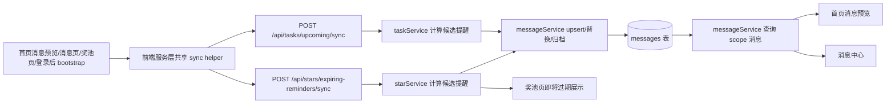

# 里程碑-16A：主动提醒与星星时效治理 详细设计文档

> **设计状态**：✅ 已完成
> **创建日期**：2026-03-31
> **设计者**：GPT5 Codex
> **审核者**：项目维护者
> **预计工期**：6-8天

---

## 📋 目录

- [需求分析](#需求分析)
- [技术方案](#技术方案)
- [代码结构](#代码结构)
- [实施步骤](#实施步骤)
- [测试方案](#测试方案)
- [风险评估](#风险评估)
- [替代方案](#替代方案)
- [审核要点自检](#审核要点自检)
- [审核记录](#审核记录)
- [附录](#附录)

---

## 需求分析

### 功能描述

M15A/M15A+ 已完成消息语义治理和一轮主动行为审计，但审计后仍有三类高价值问题未进入正式治理：一是 `upcoming` 仍是“客户端触发云端 materialize”的混合提醒模型，时效、聚合和过期清理语义不够稳定；二是“星星即将过期”的提醒仍停留在页面展示和启动保护的分散实现中，没有进入正式消息体系，也没有和保护窗口、奖池展示口径统一；三是上述两类提醒都直接影响用户的任务和奖励决策，属于高频、强感知、跨设备体验问题。

本里程碑的目标是先把“主动提醒”和“星星时效”语义统一起来，再决定后续更重的后端权威结算改造。换言之，M16A 不直接重做整个星星结算系统，而是先解决“什么时候提醒、提醒谁、提醒展示多久、提醒之间怎么聚合、和保护窗口是否一致”这些用户现在就能感知到的问题，并为 M16B 的后端权威结算留出明确边界。

### 业务价值

- [x] 用户价值：减少“提醒来得太晚、重复提醒、看不懂什么时候会过期、跨设备看不到一致提醒”的困惑。
- [x] 技术价值：把 `upcoming` 和星星到期提醒从“页面零散逻辑”收敛为统一规则，降低后续实现分叉。
- [x] 业务价值：让孩子和家长都能更可靠地感知任务即将开始、星星即将失效，提升任务完成和奖励兑换转化。

### 事实基线（2026-03-31，设计前）

#### 1. `upcoming` 已进入正式云端消息体系，但触发仍依赖客户端

当前正式链路已存在：

- 首页消息预览和消息页在 `getMessagesByScope({ requireFresh: true })` 期间，会先调用 `services/message-service.js` 中的 upcoming sync
- 后端 `backend/services/taskService.js::syncUpcomingTaskMessages()` 负责实际 materialize
- 当前前端节流窗口是 **30 秒**，且已实现 in-flight 复用

这意味着消息可以跨设备读取，但“不打开页面就不会触发提醒生成”。现阶段它更接近“客户端驱动的正式提醒落库”，不是后端定时主动派发。

#### 2. `upcoming` 的提醒语义仍缺聚合规则

当前前端历史上保留了本地瞬态提醒扫描能力，同一任务存在多个提醒槽位的设计基础。若后续简单把每个槽位都持久化，就会在消息中心产生多条很快过期的提醒，尤其是多天任务、重复任务和多次打开页面场景下，用户会看到大量“即将开始/即将到期”消息堆积。

#### 3. 星星“即将过期”尚未正式化

当前与星星时效相关的能力分散在三处：

- 奖池页展示即将过期信息，但当前只是“所有未过期分组中取最早到期那一天”，没有正式提醒窗口
- 启动链路中做过期保护或待过期计算，当前保护窗口是 **48 小时**
- 星星服务在本地/页面刷新时清理已过期星星

这三条链路并不共享一套“提醒窗口、保护窗口、展示文案、是否发消息”的统一规则，因此用户可能遇到“页面上说快到期、实际还没到保护窗口”或“今天仍能使用但昨天就提示到期”的认知割裂。

#### 4. 星星到期本身还不是后端权威结算

后端读取时会过滤过期分组，用户大多能看到正确余额；但真正的到期清理、到期流水和事件触发并未完全统一到后端权威事务。本里程碑不直接处理这个问题，但必须保证 M16A 的提醒设计不会和 M16B 的后端结算方向冲突。

#### 5. `is_archived`、消息唯一键和星星服务基础设施已存在

当前正式消息表已经具备本里程碑最关键的基础设施：

- `messages.is_archived` 已存在，可直接承载“活跃提醒归档”
- 唯一键仍是 `uk_message_event_scope (message_event_key, visibility_scope)`
- `backend/services/starService.js`、`backend/controllers/starController.js`、`backend/routes/stars.js` 已存在，无需新建星星域基础骨架

因此，M16A 的重点不是新增消息表 schema，而是收敛 event key、notification type、归档规则和前后端触发时机。

### 功能范围

**包含**：
- ✅ 设计并收敛 `upcoming` 正式提醒的聚合、去重、过期归档规则
- ✅ 设计“星星即将过期”正式提醒的消息语义、阅读对象和展示位置
- ✅ 统一提醒窗口、保护窗口、奖池展示文案的口径
- ✅ 明确提醒的客户端触发与后端权威边界，为 M16B 留接口
- ✅ 补齐相关测试设计和手工验收矩阵

**不包含**：
- ❌ 把星星到期结算整体迁移到后端事务权威
- ❌ 引入后端定时任务/消息推送基础设施
- ❌ 重新设计消息中心 UI 信息架构
- ❌ 决定“逾期扣星后补做是否退还”的最终业务规则（留到 M16C）

### 优先级

- **优先级**：P1
- **理由**：这些问题已经直接影响用户对任务提醒和星星时效的理解，但整体修复仍可在现有架构内分阶段完成，不必与 M16B 的重改造绑死。

---

## 技术方案

### 方案概述

M16A 采用“先统一提醒语义，再收敛触发策略”的方案。核心不是一开始就上后端调度，而是先把以下规则讲清楚并固化：

1. `upcoming` 属于正式消息体系中的“活跃提醒”，不是永久历史事件。
2. 星星“即将过期”也采用活跃提醒模型，和奖池展示、保护窗口共用同一时效口径。
3. 活跃提醒进入消息中心时必须支持替换、归档和聚合，不能无限堆积。
4. 在没有后端定时任务的前提下，仍允许由客户端触发 sync，但 sync 的结果必须遵守统一的服务端语义。

### 技术选型

| 技术点 | 选择方案 | 替代方案 | 选择理由 |
|--------|---------|---------|---------|
| upcoming / 星星提醒承载 | 复用正式消息表 + `is_archived` | 新建独立提醒表 | 当前消息表已具备正式读取、权限、未读、归档能力，增量最小 |
| 星星即将过期正式入口 | 新增 `POST /api/stars/expiring-reminders/sync` | 复用 message sync 或奖池读取接口 | 星星提醒有独立扫描口径，独立端点更清晰，避免把消息读取接口变成业务杂糅入口 |
| 活跃提醒识别 | 复用 `notification_type` + `message_event_key` 约定 | 新增 `reminder_category` 列 | 当前 schema 足够，不必为 M16A 引入迁移 |
| 星星提醒消息分类 | 继续写入 `type = 'system'` | 新增 `type = 'star'` | 当前消息中心 Tab 和未读统计按 `task/reward/system` 分类，本期不扩消息中心信息架构 |
| 客户端触发策略 | 共享秒级节流 + in-flight 复用 | 每页各自请求 | 服务层统一更稳，能避免重复打点 |
| 星星提醒聚合粒度 | 每个孩子 1 条“最近到期批次”活跃提醒 | 按每个星星分组逐条提醒 | 更接近当前奖池展示习惯，噪声更低 |

### 架构图



### 设计决策

#### 决策1：把 `upcoming` 和“星星即将过期”都定义为活跃提醒

活跃提醒与历史事件的区别：

- 历史事件：任务已完成、奖励已兑换、必做任务已扣星，属于已经发生的事实，默认长期保留
- 活跃提醒：任务即将开始、星星即将过期，属于未来时间窗口内的提示，过时后应归档或被更新提醒替换

落地要求：

- 使用正式消息表承载，但查询层必须排除已归档活跃提醒
- 同一业务对象在同一提醒类别下只保留“当前有效”的那一条

#### 决策2：`upcoming` 采用“每任务单活跃提醒”而不是“每槽位一条历史提醒”

即便未来保留多提醒槽位计算能力，消息中心里也不应为同一任务堆积多条 upcoming 消息。

规则：

- 同一任务同一日期只保留 1 条活跃 `upcoming`
- 若任务从“提前 30 分钟提醒”推进到“提前 10 分钟提醒”，更新原提醒的 `slot`、`scheduledFor` 和文案，而不是新增第二条
- 任务开始后、任务完成后、任务被删除/改期后，对应活跃提醒自动归档

#### 决策3：多天任务和重复任务的提醒按“任务实例”聚合，不按父模板聚合

原因：

- 用户实际要执行的是某一天的具体任务实例，而不是抽象模板
- 若按父模板聚合，会丢失“哪一天即将开始/到期”的信息

规则：

- 单次任务：一条任务一条活跃提醒
- 多天/重复任务：每个实际任务实例可有自己的活跃提醒
- 但同一实例在消息中心中仍只能保留 1 条活跃提醒，不随多槽位重复累积

#### 决策4：星星“即将过期”进入正式消息体系，阅读对象沿用既有家庭/个人流规则

建议语义：

- 孩子个人流：提醒“你的 X 颗星星将在 Y 天后到期”
- 家庭流：提醒“孩子 A 有 X 颗星星将在 Y 天后到期”

这样可让孩子本人和家庭维护者都感知即将损失的可兑换能力。

接收与聚合规则明确为：

- 孩子个人流：每个孩子最多 1 条“最近到期批次”活跃提醒
- 家庭流：按孩子维度展开，不做“全家合并为 1 条”的超聚合
- 提醒内容聚合“该孩子最近一个到期日上的全部星星数”，不按每个星星分组逐条发消息
- 消息分类继续使用 `type = 'system'`，`notification_type = 'star_expiring'`，避免现有消息中心 Tab/未读统计漏计

正式入口采用独立端点：

- `POST /api/stars/expiring-reminders/sync`

前端触发链路：

- 首页消息预览和消息页：通过共享 reminder sync helper 触发
- 奖池页：进入页面时先 `refreshStarsFromCloud(effectiveChildId)`，再触发同一个 helper，最后读取 `getExpiringStarsInfo()`
- 登录后 bootstrap：补一个轻量 sync 触发，用于首屏前尽快 materialize 正式提醒

鉴权与扫描范围规则：

- 请求参数沿用任务 reminder sync 的模式：`{ scope, targetUserId, modifyTime, operationKey }`
- 孩子本人 + `scope=user`：仅扫描自己
- 家长 + `scope=user`：仅扫描 `targetUserId` 对应孩子；若未传则回落到当前视角成员
- 家长 + `scope=family`：扫描家庭下全部活跃孩子，并按孩子分别生成个人流和家庭流提醒
- 非家长不得请求 `scope=family`

#### 决策5：提醒窗口、保护窗口、奖池展示统一为同一配置口径

统一口径后，应明确三个概念：

- `remindWindowDays`：从什么时候开始出现“即将过期”提醒
- `protectWindowDays`：奖励兑换保护逻辑从什么时候开始阻止过期星星被不合理消费
- `displayWindowDays`：奖池页“即将过期”提示展示窗口

设计要求：

- 三者默认同源配置，避免一处显示“快到期”而另一处仍视为普通星星
- 若必须差异化，文档中必须明确谁更宽、谁更窄，以及对用户的解释

本期建议默认做法：

- `remindWindowDays = 3`
- `displayWindowDays = 3`
- `protectWindowDays = 2`

即先看到 3 天内到期提示，再在最后 48 小时进入更严格的奖励保护窗口。

当前值与目标值对照：

| 能力 | 当前实现 | 当前值 | M16A 目标值 | 说明 |
|------|---------|--------|------------|------|
| 正式消息提醒窗口 | 无 | 无 | 3 天 | 新增正式提醒口径 |
| 奖池页展示窗口 | `getExpiringStarsInfo()` | 无显式窗口，取所有未过期分组中最早到期批次 | 3 天 | 与正式提醒统一 |
| 启动保护窗口 | `calculatePendingExpiry()` | 48 小时 | 48 小时 | 保留现有保护力度 |

#### 决策6：保留客户端触发 sync，但把时效窗口缩到秒级

在当前无后端定时任务基础设施的前提下，仍允许：

- 登录后 bootstrap
- 首页消息预览刷新
- 消息页进入 / 下拉刷新
- 奖池页进入

触发提醒 sync。

需要澄清的是：当前 `upcoming` 已经是 30 秒窗口，不是分钟级。M16A 的目标不是“从分钟级缩到秒级”，而是把现有 30 秒进一步收紧，并让 `upcoming` 与星星提醒共用统一策略。设计口径改为：

- 对 `upcoming` / expiring-stars reminder 的 sync 使用 **10 秒** 共享节流窗口
- 失败不阻断页面读取
- 已有 in-flight 请求必须复用，避免并发重复打点

补充边界：

- 首页任务卡片当前仍走本地 `checkUpcomingTasks()` 扫描链路，不属于本次“正式消息提醒”统一范围
- M16A 只统一首页消息预览、消息中心和奖池页的正式提醒链路，不重写首页任务卡片

#### 决策7：消息中心和首页预览都只展示未归档的活跃提醒

这样可避免用户在消息中心看到一堆已经过期、已经完成、已经无效的 upcoming 或 expiring-soon 提醒。

### DDD 分层设计

**服务层（services/）**：
- [ ] 修改服务：`services/message-service.js`
- [ ] 修改服务：`services/star-service.js`
- [ ] 修改服务：`services/task-service/task-query.js`
- [ ] 修改服务：`utils/app/post-login-bootstrap.js`
- 说明：统一首页消息预览/消息中心/奖池页的 formal reminder sync 入口、活跃提醒归档逻辑、星星即将过期窗口计算和页面触发策略；首页任务卡片链路仅做边界核查，不纳入重构

**后端服务层（backend/services/）**：
- [ ] 修改服务：`backend/services/taskService.js`
- [ ] 修改服务：`backend/services/messageService.js`
- [ ] 修改服务：`backend/services/starService.js`
- 说明：固化活跃提醒 materialize/replace/archive 规则，并为星星即将过期提醒提供正式入口

**后端控制器/路由层（backend/controllers/、backend/routes/）**：
- [ ] 修改接口：新增星星即将过期提醒 sync 端点
- [ ] 修改接口：现有 `upcoming/sync` 返回信息与归档行为
- 说明：保持客户端触发、服务端决定结果的架构边界

**表现层（pages/、components/）**：
- [ ] 修改页面：`packageMessage/pages/message/message.js`
- [ ] 修改页面：`pages/index/index.js`
- [ ] 修改页面：`pages/rewards/rewards.js`
- 说明：保证首页消息预览、消息中心、奖池页对活跃提醒的展示一致；首页任务卡片不在本期统一范围

### 数据模型

M16A 不新增 `reminderCategory` 列，也不修改消息表 schema。活跃提醒语义通过现有 `notification_type` / `message_event_key` / `operation_key` / `is_archived` 组合表达。

建议在设计层定义下列“逻辑元数据”，其中大部分由 event key 和 notification type 推导，不要求新增数据库列：

```typescript
interface ActiveReminderMeta {
  reminderCategory: 'task_upcoming' | 'stars_expiring';
  subjectType: 'task' | 'star_group';
  subjectId: string;
  instanceDate?: string;
  slot?: string;
  scheduledFor?: string;
  expiresAt?: string;
  isArchived?: boolean;
}
```

关键要求：

- 查询主列表时过滤 `isArchived === true` 的活跃提醒
- `reminderCategory` 由 `notification_type` 推导：
  - `task_upcoming` -> `task_upcoming`
  - `star_expiring` -> `stars_expiring`
- 如需保留 `slot`、`scheduledFor`、`expiresAt` 等补充元数据，序列化写入现有 `content` 字段，不新增 schema
- `instanceDate` 不是消息表物理列：
  - 对任务提醒，它对应任务实例日期
  - 对星星提醒，它对应“最近到期批次”的到期日
- M16A 继续复用现有唯一键 `uk_message_event_scope (message_event_key, visibility_scope)`，不新增索引

建议的 event key 约定：

- `task_upcoming`：`task:{taskId}:task_upcoming:{subjectUserId}:none:{instanceDate}`
- `star_expiring`：`star:summary:star_expiring:{subjectUserId}:none:{expiryDate}`

兼容策略：

- 旧 `task_upcoming` 消息仍可被读到，但在 M16A 新 sync 首次运行时，会按 `taskId + subjectUserId + visibilityScope` 归档旧的 slot-key upcoming 消息
- 星星即将过期此前没有正式消息，因此无历史迁移成本
- 因为不改 schema，M16A 不需要数据库迁移脚本，只需要服务层兼容归档逻辑

### 接口设计

**建议新增/调整服务接口**：

| 方法 | 说明 | 参数 | 返回值 |
|------|------|------|--------|
| `syncUpcomingTaskMessages(options)` | 统一 upcoming 活跃提醒生成/替换/归档 | `{ viewerUserId, viewerRole, familyId, scope, targetUserId, force, modifyTime, operationKey }` | `{ success, createdCount, updatedCount, archivedCount }` |
| `syncExpiringStarMessages(options)` | 统一星星即将过期提醒生成/替换/归档 | `{ viewerUserId, viewerRole, familyId, scope, targetUserId, force, modifyTime }` | `{ success, createdCount, updatedCount, archivedCount }` |
| `syncFormalRemindersIfNeeded(options)` | 前端共享提醒 sync helper，统一 upcoming + star expiring 触发 | `{ scope, userId, familyId, force }` | `{ success, upcoming, stars }` |
| `getExpiringStarsInfo(options)` | 统一奖池展示与提醒窗口计算 | `{ userId, now }` | `{ groups, remindWindowDays, protectWindowDays }` |

---

## 代码结构

### 文件变更清单

**预计新增文件**：
- `backend/test/integration/star-api-m16a-real.test.js` - 星星即将过期提醒正式链路集成测试

**预计修改文件**：
- `services/message-service.js` - 主动提醒 sync 节流、活跃提醒过滤和收敛
- `services/star-service.js` - 星星即将过期窗口统一计算
- `services/task-service/task-query.js` - upcoming 本地瞬态提醒与正式链路边界收敛
- `utils/app/post-login-bootstrap.js` - 启动链路提醒 sync 编排
- `pages/index/index.js` - 首页消息预览维持 formal reminder 新鲜度；不改首页 upcoming 任务卡片主逻辑
- `backend/services/taskService.js` - upcoming 活跃提醒替换/归档规则
- `backend/services/messageService.js` - 活跃提醒去重键和文案模板
- `backend/services/starService.js` - 即将过期提醒候选计算与正式 sync
- `backend/routes/stars.js` / `backend/controllers/starController.js` - 新增 expiring-reminders sync 端点

### 核心代码结构

```javascript
// 伪代码：活跃提醒统一处理
async function syncActiveReminderCandidates(candidates, options) {
  for (const candidate of candidates) {
    const existing = await findActiveReminder(candidate.dedupeKey);

    if (!candidate.isActive) {
      await archiveReminder(existing);
      continue;
    }

    if (!existing) {
      await createReminder(candidate);
      continue;
    }

    await replaceReminder(existing, candidate);
  }
}
```

### 关键函数

**函数1**：`_resolveUpcomingReminderCandidate(task, now)`
- **输入**：任务实例、当前时间
- **输出**：候选活跃提醒或空
- **职责**：只为当前仍有效的 upcoming 生成单条候选提醒

**函数2**：`_buildExpiringStarReminderCandidates(groups, now)`
- **输入**：星星分组、当前时间
- **输出**：即将过期提醒候选集合
- **职责**：统一奖池展示与正式提醒所需的即将过期窗口计算，并按“孩子 + 最近到期日”聚合

---

## 实施步骤

### 第1步：统一提醒语义与数据键（预计1天）

- [ ] **任务**：明确活跃提醒与历史事件的字段、去重键、归档规则
- [ ] **验证**：设计评审通过后，团队对 `upcoming`/`stars_expiring` 是否属于活跃提醒达成一致
- [ ] **依赖**：无

**实施要点**：
1. 先收敛模型，不先写页面逻辑
2. 明确消息中心查询如何过滤已归档活跃提醒
3. 明确多天任务按实例聚合而不是按模板聚合
4. 明确不新增消息表字段，复用现有 `notification_type + message_event_key + is_archived`

### 第2步：补星星即将过期正式 sync 入口（预计2天）

- [ ] **任务**：设计并实现 expiring-stars reminder 的统一计算和 formal sync 入口
- [ ] **验证**：奖励页、首页、消息页在同一时间窗口内看到一致结果
- [ ] **依赖**：第1步

**实施要点**：
1. 复用统一窗口配置
2. 失败不阻断页面读取
3. 允许家庭流和孩子个人流并存
4. 新增独立 `POST /api/stars/expiring-reminders/sync`
5. 后端按 `scope + targetUserId + viewerRole` 解析扫描范围，和现有 task reminder sync 口径保持一致
6. 奖池页必须先刷新云端星星分组，再做 expiring reminder sync 和展示计算

### 第3步：收敛 upcoming 活跃提醒替换与节流（预计2天）

- [ ] **任务**：把 upcoming 统一为“每实例单活跃提醒”，并缩短 sync 节流窗口
- [ ] **验证**：同一任务不会在消息中心堆出多条即将开始提醒
- [ ] **依赖**：第1步

**实施要点**：
1. 10 秒短节流 + in-flight 复用
2. 任务完成/删除/改期后主动归档旧提醒
3. 多天任务每个实例只保留 1 条活跃提醒
4. 首次 M16A sync 时兼容归档旧的 slot-key upcoming 消息

### 第4步：前端展示一致性与回归（预计1-2天）

- [ ] **任务**：统一首页预览、消息中心、奖池页对活跃提醒的展示口径
- [ ] **验证**：三处展示结果一致
- [ ] **依赖**：第2-3步

**实施要点**：
1. 首页消息预览与消息中心都只读 formal reminder
2. 奖池页即将过期展示复用同一窗口口径，并基于 fresh cloud star groups 计算
3. 首页任务卡片仅做边界核查，不与消息预览强耦合改造

### 第5步：测试闸门与手工验收（预计1天）

- [ ] **任务**：补齐单测/集成测试/手工清单
- [ ] **验证**：自动化通过，维护者可按清单复核
- [ ] **依赖**：第2-4步

---

## 测试方案

### 单元测试

| 测试项 | 测试方法 | 预期结果 |
|--------|---------|---------|
| upcoming 同任务多槽位提醒 | 构造同一任务多个提醒槽位 | 仅保留 1 条活跃提醒，旧槽位被替换 |
| upcoming 失效归档 | 任务完成/删除/改期后触发 sync | 对应活跃提醒被归档，不再出现在主列表 |
| upcoming 兼容归档旧消息 | 预置旧 slot-key upcoming 消息后执行 M16A sync | 旧消息被归档，新实例键消息保留 |
| 多天任务实例聚合 | 创建两天实例任务并进入提醒窗口 | 每个实例最多 1 条活跃 upcoming |
| 星星即将过期窗口统一 | 同一时间调用奖池展示和提醒候选计算 | 返回同一批 3 天内即将过期分组 |
| 星星提醒按孩子聚合 | 同一孩子多个即将到期分组 | 仅生成 1 条“最近到期批次”提醒 |
| 星星提醒扫描范围 | 分别以孩子、家长个人视角、家长家庭视角触发 sync | 仅扫描有权访问的目标成员集合 |
| 奖池页刷新顺序 | 先刷新云端星星，再执行 reminder sync，再读展示数据 | 奖池页数字与正式提醒一致 |
| 家庭/个人流提醒文案 | 分别以孩子和家长视角读取 | 标题/摘要符合阅读者视角 |
| 10 秒节流 | 短时间多次进入首页/消息页/奖池页 | 复用 in-flight 或返回节流结果，不重复请求 |
| 归档后的未读数 | 预置未读 upcoming，触发失效归档 | 已归档提醒不再计入未读角标 |

### 集成测试

- [ ] upcoming sync：创建任务实例 → 进入提醒窗口 → 生成活跃提醒 → 再次 sync 不重复新增
- [ ] upcoming 归档：任务完成后再次 sync → 活跃提醒归档
- [ ] expiring-stars sync：构造 3 天内即将过期星星分组 → 生成个人流 + 家庭流提醒
- [ ] expiring-stars 过窗归档：到期后 sync → 即将过期提醒归档
- [ ] 页面一致性：首页预览、消息中心、奖池页读取同一窗口结果
- [ ] 权限边界：家长 `scope=family` 扫描全家活跃孩子；`scope=user` 仅扫描目标孩子；孩子只能扫自己

### 手动测试

1. **任务提醒**：
   - [ ] 创建今天稍后开始的任务，首页和消息中心都能看到 1 条即将开始提醒
   - [ ] 同一任务临近更近时间窗后，不新增第二条提醒，只更新原提醒
   - [ ] 完成任务后，即将开始提醒从主列表消失

2. **星星时效**：
   - [ ] 构造 3 天内到期星星，奖池页和消息中心都出现一致提醒
   - [ ] 切换孩子/家长视角时，个人流和家庭流文案正确
   - [ ] 到期后，不再显示“即将过期”，余额和展示一致

3. **回归测试**：
   - [ ] M15A/M15B 消息链路不回退
   - [ ] 奖池页兑换保护仍生效
   - [ ] 活跃提醒被自动归档后，消息中心未读数同步减少且不再显示该提醒

### 测试覆盖率目标

- 前端相关模块维持现有质量闸门不下降
- 新增核心分支覆盖率目标：85%+

---

## 风险评估

### 技术风险

| 风险项 | 影响 | 概率 | 应对措施 |
|--------|------|------|---------|
| 活跃提醒和历史事件共表后查询复杂度上升 | 中 | 中 | 明确归档字段和查询过滤规则，并补分页/未读测试 |
| 10 秒 sync 节流过短导致请求频率上升 | 中 | 中 | 采用 in-flight 复用、只在关键入口触发、必要时增加服务端幂等保护 |
| 星星即将过期提醒与后续 M16B 结算冲突 | 高 | 低 | M16A 只处理提醒和窗口，不提前锁死结算实现细节 |
| 多天任务实例聚合规则与现有消息中心排序耦合 | 中 | 中 | 先补契约测试，再动前端展示代码 |
| 旧 slot-key upcoming 消息与新实例键并存 | 中 | 中 | 在首轮 M16A sync 中做兼容归档，不要求数据库迁移 |

### 业务风险

| 风险项 | 影响 | 概率 | 应对措施 |
|--------|------|------|---------|
| 提醒过少导致用户错过任务或星星到期 | 高 | 中 | 先以“单实例单活跃提醒”替代“完全压缩”，不取消必要提醒 |
| 提醒过多导致消息中心噪声过大 | 高 | 中 | 活跃提醒必须可替换和归档，不允许历史堆积 |
| 家长/孩子视角文案不清造成误解 | 中 | 中 | 文案测试按阅读者视角逐条校验 |

### 修复风险结论

- **低风险项**：统一窗口口径、秒级节流、前端展示一致性，主要是已有逻辑收敛
- **中风险项**：活跃提醒归档和去重键调整，会影响消息中心查询、未读统计和分页
- **高风险项**：若把 M16A 扩大成后端定时任务或星星结算迁移，风险会明显上升，因此本设计明确把这些内容留在 M16B

---

## 替代方案

### 方案A：保持现状，只做局部 Bug 修补

**未选择原因**：

- 不能解决提醒窗口、保护窗口和页面展示口径分裂的问题
- 仍会持续出现“多条 upcoming 堆积”或“星星快到期但没有正式提醒”的体验问题

### 方案B：直接上后端定时调度 + 全量权威结算

**未选择原因**：

- 这会把提醒治理和结算迁移绑成一次高风险重构
- 当前项目还没有为此准备独立的调度基础设施和迁移方案，更适合拆到 M16B

### 方案C：把 active reminder 完全排除在消息中心外，只留页面角标/Toast

**未选择原因**：

- 用户已把消息中心视为“重要业务结果和提醒”的统一入口
- 若 upcoming 和 expiring-soon 只留瞬态提示，跨设备和回看能力都不足

---

## 审核要点自检

- [x] 是否符合当前代码事实：已补充 30 秒 upcoming 节流、48 小时保护窗口、`is_archived` 现状
- [x] 是否明确范围边界：M16A 只处理正式提醒，不做 M16B 结算迁移，不重写首页任务卡片
- [x] 是否明确兼容策略：旧 slot-key upcoming 消息通过服务层首次 sync 兼容归档
- [x] 是否明确接口与存储方式：新增星星提醒 sync 端点，不新增消息表字段
- [x] 是否具备可执行测试口径：已补单测、集测和手工验收重点场景

---

## 审核记录

| 日期 | 审核人 | 结论 | 备注 |
|------|--------|------|------|
| 2026-03-31 | GPT5 Codex | 初稿 | 基于主动行为审计二次复核，待维护者审核 |
| 2026-03-31 | GPT5 Codex + GLM 复核 | 待修订后复审 | 已补充节流现状、兼容策略、配置值、独立端点与模板缺项 |

---

## 附录

### A. 关联审计与前置里程碑

- `docs/design/milestone-15a-proactive-behavior-audit.md`
- `docs/design/milestone-15a-message-semantics-audit.md`
- `docs/design/milestone-15b-real-env-verification.md`

### B. 后续里程碑依赖

- `M16B`：星星到期后端权威结算
- `M16C`：必做任务逾期补做语义治理

### C. 当前不在本期解决的问题

- 是否引入后端定时任务/调度器
- 星星到期流水的历史补算和脏数据修复
- 逾期扣星后补做是否退还星星
