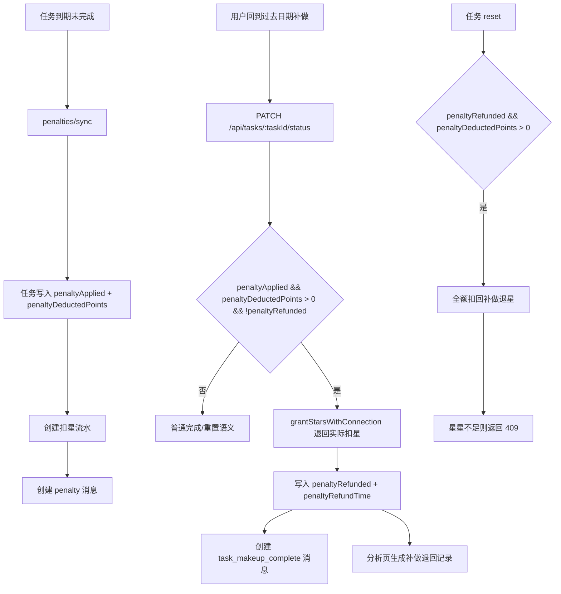

# 里程碑-16C：必做任务逾期补做语义治理 详细设计文档

> **设计状态**：🟢 已完成
> **创建日期**：2026-04-02
> **设计者**：GPT5 Codex
> **审核者**：项目维护者
> **预计工期**：6-8天

---

## 📋 目录

- [需求分析](#需求分析)
- [技术方案](#技术方案)
- [代码结构](#代码结构)
- [实施步骤](#实施步骤)
- [测试方案](#测试方案)
- [风险评估](#风险评估)
- [替代方案](#替代方案)
- [审核要点自检](#审核要点自检)
- [审核记录](#审核记录)
- [附录](#附录)

---

## 需求分析

### 功能描述

当前项目已经具备“必做任务过期后扣星”的完整链路，也允许用户回到过去日期把任务补做完成；但系统对“逾期后补做”还没有形成一套正式语义。现状是：任务逾期后会扣星并写入 `penaltyApplied=true`，之后用户再去补做时，任务会变成已完成，但不会退回已扣星，消息中心仍显示普通“完成任务”，分析页也只会把它长期视为一次惩罚历史。这样虽然链路能跑通，但业务表达并不完整，用户也难以理解“补做”到底有没有被系统认可。

M16C 的目标，是把“逾期扣星后补做”正式收敛为一个有明确定义的业务过程：先发生“逾期扣星”，后发生“逾期后补做”，补做成功时退回此前实际扣除的星星，并在消息、分析、任务状态和本地/云端兼容链路里使用一致语义。M16C 不重做必做规则本身，也不重做消息中心 UI，而是把现有代码里已经部分存在但没有定型的规则，补全成可实现、可测试、可解释的正式契约。

### 业务价值

- [x] 用户价值：孩子逾期后去补做时，系统会明确告知“这是逾期后补做”，并退回已扣星星，避免“做了也白做”的挫败感。
- [x] 技术价值：把“扣星历史”“补做完成”“退星结算”拆成可追踪的独立事实，避免继续依赖模糊状态和文案推断。
- [x] 业务价值：让家长看到更准确的消息和分析结果，既保留逾期事实，也能看到后续已补做、已退回的结果。

### 事实基线（2026-04-02，设计前）

#### 1. 当前逾期惩罚只记录“已扣过星”，不记录“实际扣了多少”

后端 `_applyRequiredTaskPenalty()` 会按任务积分尝试扣星，并允许部分扣减；真正扣掉的数量是 `consumedPoints`，但当前任务实体只持久化了 `penaltyApplied=true`，没有持久化“实际扣除积分数”。这意味着如果一个任务应扣 5 星，但当时只扣成功 3 星，后续系统并没有稳定字段可以直接知道应该退回 3 星还是 5 星。

#### 2. 当前补做只会把任务改为完成，不会退星

前端和后端当前都允许用户回到过去日期把逾期必做任务补做完成，但补做完成只会让任务 `status=completed`，不会清除或回滚历史惩罚，也不会退回此前扣除的星星。必做任务完成仍然不会发放正常奖励星星。

#### 3. 当前消息无法区分“普通完成”和“逾期后补做”

消息服务当前只有 `complete` 和 `penalty` 两种相关语义。也就是说，一条任务先被扣星，之后又被补做完成时，消息中心会看到“必做任务已扣星”和普通“完成任务”，而不是更准确的“逾期后补做并退回星星”。

#### 4. 当前分析页会一直把这类任务视为惩罚历史

分析服务目前只要看到 `task.isRequired === true && task.penaltyApplied === true`，就会生成一条惩罚记录。即使该任务后来已经被补做，分析页也不会额外体现“后续补做并退回星星”的事实。

#### 5. 当前 reset / unrequired 语义与“补做退星”还未建立关系

当前任务重置只会处理已完成任务的奖励星星回滚，不会处理“逾期补做退回的星星”；`unmark required` 只会取消 `isRequired`，不会自动回滚历史惩罚，也不会让任务自动视为已补做。

#### 6. 当前系统已经具备“过去日期可补做”的前端交互基础

M17 已经允许用户查看过去日期并操作过去任务，因此 M16C 不需要重新设计日期导航或补做入口，只需要把补做后的业务语义正式化。

### 功能范围

**包含**：
- ✅ 明确“逾期扣星后补做”的正式业务规则和状态转换
- ✅ 在补做成功时退回此前**实际扣除**的星星，而不是按任务配置积分盲退
- ✅ 为“逾期后补做”补齐正式消息语义与文案
- ✅ 为分析页补齐“逾期扣星”和“补做退回”双事实表达
- ✅ 补齐 reset、required/unrequired 与补做退星的交互边界
- ✅ 同步收敛前端本地模式和后端云端模式的行为
- ✅ 为该规则补齐单元测试、集成测试和手动回归场景

**不包含**：
- ❌ 修改“任务逾期多久触发惩罚”的规则
- ❌ 给必做任务完成额外发放正常奖励星星
- ❌ 重做消息中心页面布局或分析页 UI 架构
- ❌ 把 `unmark required` 改成自动免除历史惩罚
- ❌ 一次性清洗所有历史脏数据的执行脚本实现（本期只设计兼容策略）

### 优先级

- **优先级**：P1
- **理由**：当前链路可用，但业务语义不完整，直接影响家长和孩子对“逾期后补做”是否被认可的理解；这属于体验和规则正确性的高优先级问题，但不属于系统不可用级故障。

---

## 技术方案

### 方案概述

M16C 采用“保留逾期事实、补齐补做事实、在补做时退回实际扣星”的方案。核心思路不是推翻现有 `penaltyApplied` 模型，而是在现有模型上补齐两个缺失维度：

1. 记录当时实际扣除了多少星星；
2. 记录这笔历史惩罚是否已经因补做而退回。

这样一来，系统可以把“逾期扣星”和“逾期后补做退星”都表达为真实发生过的事实，而不是只依赖当前任务状态做推断。任务本身仍然保持现有的二元状态 `pending/completed`，不新增第三种任务状态枚举；“逾期后补做”作为一个组合语义存在：任务曾被惩罚，后来完成，且已退回对应扣星。

补做退星不被视为“完成任务奖励”，而被视为“归还此前惩罚扣除的星星”。因此本期不会改变“必做任务完成本身没有奖励星星”的规则。对用户来说，看到的是：逾期会先扣星；之后去补做时，会退回之前扣掉的那部分星星，而不是额外赚到一笔奖励。

### 技术选型

| 技术点 | 选择方案 | 替代方案 | 选择理由 |
|--------|---------|---------|---------|
| 补做入口 | 复用现有任务完成命令 `PATCH /api/tasks/:taskId/status` | 新增独立“补做”接口 | 现有过去日期补做入口已经基于任务完成命令，增量最小，避免重复入口 |
| 退星触发点 | 在“首次从未完成 -> 已完成”且满足历史惩罚条件时原子执行退星 | 页面层补充单独退星调用 | 退星必须与任务完成保持事务一致，避免完成成功但退星失败 |
| 退星金额来源 | 新增持久化字段记录实际惩罚扣星数 | 从 `star_records` 反查 | 惩罚允许部分扣减，持久化实际值最稳，查询更直接，也利于前端分析使用 |
| 退星有效期策略 | 补做退回的星星统一落到 `permanent` 分组 | 按原惩罚扣减分组逐条精确恢复 | 当前惩罚扣星可能跨多个过期组，统一退回 permanent 最简单、最稳定，也避免补做退星再引入复杂时效争议 |
| 事务内加星落点 | 在 `backend/services/starService.js` 新增正式的事务内加星接口（如 `grantStarsWithConnection`） | 在 `taskService` 中直接拼装星星流水 SQL | 当前后端已有 `consumeStarsWithConnection`，但没有对称的事务内加星正式接口；补齐到 `starService` 最符合现有分层 |
| 补做语义建模 | 保持 `status` 二元状态，新增 `penaltyRefunded` 等事实字段 | 新增 `late_completed` 状态枚举 | 不破坏现有任务状态体系，兼容已有页面和排序逻辑 |
| 消息语义 | 新增 `task_makeup_complete` 正式消息类型 | 继续复用 `task_complete` 文案 | 只有独立语义才能避免用户误解为普通完成 |
| 分析表达 | 同时展示“逾期扣星”与“补做退回”两条事实，并从 `isRequired` 判定解耦 | 补做后直接抹掉惩罚历史 | 保留历史真实性，同时避免任务后来取消必做后历史惩罚从分析中消失 |
| `unrequired` 边界 | 不自动退回历史扣星，只改变未来规则和标签 | 一旦取消必做即自动退星 | 自动退星会把“已逾期但未补做”的历史事实抹掉，且与用户确认方向不一致 |
| 离线/补云权威 | 云端模式恢复网络后由后端重新权威判定补做退星结果 | 直接把本地退星结果视为最终事实上传 | 与 M16B 的后端权威边界一致，避免本地临时状态成为永久事实 |

### 设计决策

#### 决策1：逾期扣星与补做退星是两条独立业务事实

系统需要同时保留以下两件事：

- 某条必做任务确实在原定日期逾期，已经被扣星
- 该任务后来被补做完成，系统退回了此前实际扣除的星星

M16C 不会用“退星后清空惩罚痕迹”的方式简化实现。否则分析页、消息中心和家长认知都会失真。

#### 决策2：补做退回的是“实际扣除星星数”，不是任务配置积分

惩罚执行时允许部分扣减，因此补做退回必须使用当时真实扣掉的数量。例如：任务配置应扣 5 星，但孩子当时只有 3 星，实际只扣了 3 星；那么补做成功后只能退回 3 星，而不是 5 星。

为此，本期新增任务持久化字段：

- `penaltyDeductedPoints: number`
- `penaltyRefunded: boolean`
- `penaltyRefundTime: number | null`

#### 决策3：逾期后首次补做完成时，原子退回历史扣星

当任务满足以下条件时，第一次从未完成变为已完成要触发补做退星：

- 曾经 `penaltyApplied === true`
- `penaltyDeductedPoints > 0`
- `penaltyRefunded === false`

该退星逻辑与任务完成写入必须在同一事务内完成。任一环节失败，则整体回滚，避免出现“任务已完成但未退星”或“退星了但任务仍未完成”的不一致状态。

补充幂等约束：

- 补做退星的正式幂等键固定为 `task_makeup_refund:{taskId}`
- reset 回滚补做退星的正式幂等键固定为 `task_makeup_refund_revoke:{taskId}:{operationKey}`
- `grantStarsWithConnection` 和 reset 回滚扣星都必须以幂等键先查流水，再决定是否真正执行

#### 决策4：补做退星不是正常奖励，不改变必做任务“完成无奖励”的规则

必做任务完成时，依然不发正常任务奖励星星。M16C 退回的是之前被惩罚扣掉的星星，不是新赚的奖励。这一点会体现在：

- 星星流水的 `sourceType`
- 消息文案
- 分析页标题

补充边界：

- 只有在任务满足 `penaltyApplied === true && penaltyDeductedPoints > 0 && penaltyRefunded === false` 时，补做完成才会触发退星。
- 若任务从未被扣过星，即使它是过去日期的必做任务，补做完成也不会产生任何星星变动。
- 若任务先发生历史惩罚、后又被取消必做标签，再被完成，仍然只执行“退回历史惩罚星星”，**不额外发放普通完成奖励**。
- 实施时需把“历史惩罚待退回”判断放在普通 `!isRequired` 奖励判断之前，避免出现“既退惩罚星、又发普通完成星”的双重给星。
- 补做退回的星星统一写入 `permanent` 分组，不尝试按历史惩罚时的原分组或原过期类型精确恢复。

#### 决策5：任务重置时，如果此前已发生补做退星，要回滚这笔退星

如果用户把一条“已逾期补做并已退星”的任务再次重置为未完成，系统应同步撤销这笔补做退星，以保持业务一致性。否则用户可以通过“补做 -> 退星 -> 重置”反复套取星星。

因此 reset 逻辑新增一条分支：

- 若 `penaltyRefunded === true && penaltyDeductedPoints > 0`
- 则先回滚补做退星，再将任务重置为未完成，并把 `penaltyRefunded=false`

回滚策略明确为：

- reset 回滚补做退星时，必须要求 **全额扣回** 此前退回的星星。
- 若当前可用星星不足，reset 整体失败，任务继续保持“已补做完成”状态，不允许部分扣回后继续重置。
- 因此实现上应明确使用“禁止部分扣减”的扣星模式，例如 `consumeStarsWithConnection(..., { allowPartial: false })`。

#### 决策6：`unmark required` 不自动退回历史扣星

取消必做只改变此后任务标签，不自动视为“补做完成”。历史惩罚是否退回，仍取决于用户是否真的完成了这条曾逾期的任务。这样能保留清晰的业务解释：

- “取消必做”是规则变更
- “逾期后补做”是事实补救

二者不混在一起。

补充边界：

- 若任务已经发生历史惩罚，随后被取消必做，但用户后来仍然把该任务完成，则仍按“逾期后补做”处理，并退回此前实际扣星。
- 若任务已经发生历史惩罚，随后被取消必做，且一直没有被完成，则不发生自动退星。

#### 决策7：分析页同时展示“逾期扣星”和“补做退回”

分析页不抹掉惩罚历史，而是增加一条补做退回记录，建议展示规则如下：

- 逾期惩罚记录：归属到任务原始截止日期
- 补做退回记录：归属到任务实际补做完成时间
- 惩罚历史是否存在，后续不再依赖 `isRequired===true`，而改为依赖：
  - `penaltyApplied === true`
  - `penaltyDeductedPoints > 0`
- 这样即使任务后来被 `unrequired`，历史逾期和后续补做退回也仍然可以在分析里被保留

旧数据过渡策略：

- 本期不对历史 `penaltyApplied=true` 但 `penaltyDeductedPoints=0` 的旧任务做自动补录
- 因此，这部分历史任务在新分析口径下可能不再展示惩罚记录
- 该影响仅限旧历史数据；M16C 实施后的新惩罚与新补做记录必须完整可见
- 若后续维护者认为有必要补齐旧历史，可另起专项数据修复，不并入本里程碑

#### 决策8：云端模式下，离线补做的最终结果以后端重算为准

M16C 延续 M16B 已建立的“后端权威”原则：

- `enableCloudStorage=true` 但当下网络失败时，前端可先保留本地任务状态与临时星星体验
- 恢复网络后，通过现有任务状态补云链路把“任务已完成”同步到后端
- 后端基于任务当前事实、`penaltyDeductedPoints / penaltyRefunded` 状态和幂等键重新权威判定是否需要执行补做退星
- 后续页面刷新时，以云端权威返回结果覆盖本地临时状态

因此，云端模式下前端本地退星结果不是最终事实；最终结算以后端为准。

这样家长看到的是：

- 某天孩子确实逾期并扣星
- 后来某天孩子又补做成功，系统退回星星

这比“直接把惩罚从历史里抹掉”更符合业务事实，也更容易解释。

### DDD分层设计

**领域层（models/）**：
- [ ] 修改模型：`models/task.js`
- [ ] 修改模型：`backend/models/task.js`
- [ ] 修改模型：`models/message.js`
- 说明：补充 `penaltyDeductedPoints / penaltyRefunded / penaltyRefundTime`，并定义“逾期后补做”的组合语义辅助判断。

**服务层（services/）**：
- [ ] 修改服务：`backend/services/taskService.js`
- [ ] 修改服务：`backend/services/starService.js`
- [ ] 修改服务：`backend/services/messageService.js`
- [ ] 修改服务：`services/task-service/task-penalty.js`
- [ ] 修改服务：`services/task-service/task-write.js`
- [ ] 修改服务：`services/message-service.js`
- [ ] 修改服务：`services/analytics-service.js`
- 说明：后端负责权威结算和正式消息，前端本地模式补齐兼容语义，分析服务补齐惩罚与补做退回双事实。

**仓储层（repositories/）**：
- [ ] 修改仓储：`repositories/task-repository.js`（如字段透传需要显式兼容）
- 说明：本地存储读取任务模型时需要确保新字段能被完整保留。

**适配器层（adapters/）**：
- [ ] 修改适配器：`adapters/storage-adapter.js`（仅日志或序列化验证需要时）
- 说明：本期原则上不新增适配器，仅在需要兼容调试输出时做最小变更。

### 架构图



### 数据模型设计

#### 任务新增字段

| 字段 | 类型 | 默认值 | 含义 |
|------|------|--------|------|
| `penalty_deducted_points` | `INT` | `0` | 必做任务逾期时实际扣除的星星数 |
| `penalty_refunded` | `TINYINT(1)` | `0` | 该笔历史惩罚是否已因补做而退回 |
| `penalty_refund_time` | `BIGINT` | `NULL` | 退回发生时间（epoch ms） |

#### 星星流水来源

补做退星新增一类正式流水语义：

```js
{
  type: 'income',
  sourceType: 'task_makeup_refund',
  sourceId: taskId,
  points: refundPoints,
  expiryType: 'permanent'
}
```

#### 任务组合语义

- “逾期后补做”不新增数据库枚举状态，而由以下条件推导：
  - `status === 1`
  - `penaltyApplied === true`
  - `penaltyDeductedPoints > 0`
  - `penaltyRefunded === true`
- 仅 `penaltyApplied === true && penaltyRefunded === false` 时，说明任务曾逾期扣星但尚未完成补做。

### 接口设计

| 接口 | 用途 | 关键请求字段 | 关键返回 |
|------|------|-------------|---------|
| `PATCH /api/tasks/:taskId/status` | 任务完成/重置 | `{ status, modifyTime, operationKey }` | `{ success, task }` |
| `POST /api/tasks/penalties/sync` | 到期惩罚执行 | `{ scope, targetUserId, modifyTime, operationKey }` | `{ penaltyCount, affectedTaskIds }` |
| `starService.grantStarsWithConnection(...)` | 后端事务内加星正式接口，供补做退星复用 | `{ connection, userId, commandData }` | `{ success, record, updatedGroupsSnapshot }` |

补充约束：

- 本期不新增独立“补做”REST 接口，继续复用 `PATCH /status`
- `PATCH /status` 在 reset 回滚补做退星失败时返回 `409 INSUFFICIENT_STARS`
- `PUT /api/tasks/:taskId` 仍不开放直接写入 `penaltyRefunded` 等事实字段

### 代码结构

- `backend/database/migrations/012_alter_tasks_add_makeup_fields.sql` - 任务补做退星字段迁移
- `backend/database/test-setup-modern.sql` - 同步补做字段，保证真实数据库测试基线一致
- `backend/models/Task.js` - 后端任务模型补充补做字段
- `backend/services/taskService.js` - 后端任务状态、补做退星、reset 回滚事务
- `backend/services/starService.js` - 新增事务内加星正式接口
- `backend/services/messageService.js` - 后端正式消息补齐 `task_makeup_complete`
- `backend/controllers/taskController.js` - 返回补做退星相关错误语义
- `models/task.js` - 前端任务模型补充补做字段
- `models/message.js` - 本地消息通知类型补充 `MAKEUP_COMPLETED`
- `services/task-service/task-penalty.js` - 本地惩罚链路持久化实际扣星数
- `services/task-service/task-write.js` - 本地补做退星与 reset 回滚
- `services/message-service.js` - 本地降级模式支持补做消息
- `services/analytics-service.js` - 分析页增加补做退回记录
- `backend/test/unit/taskService-m16c-makeup.test.js` - 后端单测
- `backend/test/integration/task-api-m16c-real.test.js` - 后端真实数据库集成测试

---

## 实施步骤

### 第1步：补齐任务事实字段（预计1天）

- [ ] **任务**：为前后端任务模型和后端任务表增加补做退星相关字段
- [ ] **验证**：惩罚执行后能稳定持久化“实际扣除星星数”

实施要点：

1. `backend/database/migrations/012_alter_tasks_add_makeup_fields.sql` 新增字段
2. `backend/database/test-setup-modern.sql` 同步新增字段
3. 前后端 `Task` 模型、序列化与校验逻辑兼容新字段
4. `task-penalty` 正式写入 `penaltyDeductedPoints`，并初始化 `penaltyRefunded=false`

### 第2步：后端正式化“逾期补做退星”事务（预计2天）

- [ ] **任务**：在后端任务完成、任务重置、惩罚同步链路中接入补做退星正式规则
- [ ] **验证**：逾期惩罚后首次补做会退回实际扣星；重置后可撤销退星；不会重复退星

实施要点：

1. `backend/services/starService.js` 新增正式的事务内加星接口 `grantStarsWithConnection`
2. `updateTaskStatus(status=1)` 中先判断是否存在“历史惩罚待退回”；若存在，则只执行补做退星，不再走普通 `!isRequired` 完成奖励分支
3. `updateTaskStatus(status=0)` 或 reset 时回滚已退回的补做星星，且必须全额扣回；若余额不足则 reset 失败
4. `penalties/sync` 写入 `penaltyDeductedPoints`
5. 后端补做退星与 reset 回滚都写入明确幂等键，保证重试安全

### 第3步：补齐正式消息与本地降级消息（预计1天）

- [ ] **任务**：新增 `task_makeup_complete` 正式消息，并收敛本地降级模式语义
- [ ] **验证**：孩子视角和家长视角都能看到正确的“逾期后补做”消息文案

实施要点：

1. 后端 `messageService` 新增 `makeup_complete` 文案模板
2. 标题建议：`逾期后补做：{taskTitle}`
3. 孩子个人流摘要建议：`你逾期后补做了任务“{taskTitle}”，已退回{points}颗星星`
4. 家庭流摘要建议：`{childName}逾期后补做了任务“{taskTitle}”，已退回{points}颗星星`
5. 前端本地消息服务补齐 `MAKEUP_COMPLETED`

### 第4步：补齐分析页双事实表达（预计0.5天）

- [ ] **任务**：补齐分析服务对“逾期扣星 + 补做退回”的双事实展示
- [ ] **验证**：分析页能同时看到截止日扣星记录和补做日退星记录

实施要点：

1. 惩罚记录改为依据 `penaltyApplied === true && penaltyDeductedPoints > 0`
2. 若 `penaltyRefunded=true`，新增一条补做退回收入记录
3. 惩罚记录归属到任务原始日期，补做退回归属到 `penaltyRefundTime` 或 `completionTime`
4. 标题建议：`逾期补做退回：{taskTitle}`

### 第5步：补齐测试与手工回归（预计1-1.5天）

- [ ] **任务**：补齐单元测试、真实数据库集成测试与手工回归清单
- [ ] **验证**：质量闸门通过，关键补做场景在本地/云端均正确

实施要点：

1. 后端单测验证补做退星、reset 回滚、幂等和消息文案
2. 前端单测验证本地模式补做退星语义，包括 `permanent` 落点和 reset 回滚路径
3. 真实数据库集成测试验证事务一致性、409 回滚失败、消息 fan-out
4. 增加“云端模式断网补做 -> 恢复网络补云 -> 云端权威覆盖本地”场景
5. 手工验证过去日期补做、切换视角、消息刷新和分析页结果

---

## 测试方案

### 单元测试

| 场景 | 输入 | 期望 |
|------|------|------|
| 首次补做退星 | 已惩罚未退星任务完成 | 退回 `penaltyDeductedPoints`，并写入 `penaltyRefunded=true` |
| 补做退星幂等 | 同一任务补做请求重复提交/重试 | 只退回一次，基于 `task_makeup_refund:{taskId}` 去重 |
| 未被扣星的必做补做 | 过去日期必做任务完成，但从未触发惩罚 | 不产生任何星星变动 |
| 重复完成不重复退星 | 已补做且已退星任务再次完成 | 不再新增退星 |
| reset 回滚退星 | 已补做退星任务重置 | 再次扣回已退星数量，并置 `penaltyRefunded=false` |
| reset 星星不足 | 已补做退星任务重置，但当前余额不足 | reset 整体失败，不允许部分扣回 |
| 取消必做后再补做 | 已惩罚任务先取消必做后完成 | 仍按逾期后补做退回此前实际扣星 |
| 本地补做退星落点 | 本地模式补做退星 | 统一写入 `permanent` 分组 |
| 消息模板 | `makeup_complete` 家长/孩子不同视角 | 标题摘要符合语义 |
| 分析记录生成 | 惩罚后补做任务 | 同时生成惩罚记录和补做退回记录 |

### 集成测试

- [ ] 场景1：任务逾期后被扣 5 星，随后补做成功，后端事务内完成状态更新 + 退回 5 星 + 写入补做消息
- [ ] 场景2：任务逾期后只扣成功 2 星，随后补做成功，只退回 2 星
- [ ] 场景3：过去日期必做任务从未被扣星，直接补做完成，不发生任何星星变动
- [ ] 场景4：补做退星请求因网络超时重试，后端只退回一次
- [ ] 场景5：任务逾期后补做成功，再重置为未完成，系统全额回滚已退回的 2/5 星
- [ ] 场景6：已补做退星任务在当前余额不足时尝试 reset，reset 被拒绝且任务状态保持不变
- [ ] 场景7：已惩罚任务取消必做，但未补做，不发生自动退星
- [ ] 场景8：已惩罚任务取消必做后再完成，仍按逾期后补做退回此前实际扣星，且不发普通完成奖励
- [ ] 场景9：孩子完成逾期补做后，孩子个人流和家长家庭流都能读到正式补做消息
- [ ] 场景10：分析页读取时，同一任务同时体现“截止日扣星”和“补做日退回”
- [ ] 场景11：云端模式断网补做后恢复网络，后端重算结果与最终页面展示一致

### 手工回归

- [ ] 回到昨天补做该任务，检查星星退回且消息显示“逾期后补做”
- [ ] 对一条从未触发惩罚的过去必做任务执行补做，确认不会新增或退回任何星星
- [ ] 补做后切换家长/孩子视角，确认消息文案都正确
- [ ] 进入分析页，确认同一任务存在“逾期扣星”和“补做退回”两条记录
- [ ] 将已补做任务重置，确认退回的星星被撤销
- [ ] 取消必做标签但不补做，确认不会自动退星
- [ ] 云端模式下断网补做，恢复网络后确认最终星星、任务和消息以后端结果为准
- [ ] 过去日期补做入口与 M17 日期导航不受影响

---

## 风险评估

| 风险 | 影响 | 概率 | 缓解措施 |
|------|------|------|---------|
| 退星与任务完成非原子 | 高 | 中 | 补做退星必须并入现有任务完成事务 |
| reset 造成星星被重复薅取 | 高 | 中 | reset 时强制回滚已退回的补做星星 |
| 旧数据缺少实际扣星数导致分析不完整 | 中 | 中 | 新逻辑以事实字段为准，旧数据作为兼容边界保留说明 |
| 本地与云端语义不一致 | 中 | 中 | 云端模式以后端重算为准，本地只做兼容体验 |
| 家长误以为补做后逾期事实被抹掉 | 中 | 中 | 分析页同时展示扣星和退回两条事实 |
| 用户误把补做退星理解为正常奖励 | 中 | 中 | 文案统一使用“退回已扣星星”，避免“奖励”“获得”措辞 |
| 取消必做后不自动退星引发疑问 | 低 | 中 | 在设计和后续说明中明确“取消必做”不是“补做完成” |

---

## 替代方案

### 方案A：当前方案（保留惩罚事实，补做时退回已扣星）

**优势**：

- ✅ 能完整表达“曾逾期、后补做”的业务过程
- ✅ 用户感知更温和，补做后不再觉得白做
- ✅ 与现有任务状态体系兼容，增量改造成本可控

### 方案B：只改消息和分析，不退星

**描述**：继续保留“逾期后补做不退星”，仅把消息和分析文案改得更像“补做”。

**劣势**：

- ❌ 用户补做后仍无法得到正向反馈

**未选择原因**：用户已经明确要求“逾期后补做可以退还星星”，仅修文案不足以满足目标。

### 方案C：补做后直接清空惩罚痕迹

**描述**：补做成功后直接把 `penaltyApplied` 也恢复为 `false`，分析里不再保留逾期记录。

**优势**：

- ✅ 展示层看起来更简单
- ✅ 分析页无需新增补做退回记录

**劣势**：

- ❌ 历史事实被抹掉
- ❌ 家长无法知道任务曾经逾期
- ❌ 会让消息、分析、日志与实际扣星流水不一致

**未选择原因**：这会把已发生过的逾期事实从任务语义中抹除，不符合“保留历史真实性”的目标。

---

## 审核要点自检

- [x] **基于现有代码增量设计**：复用现有 penalty sync、任务完成/reset 和消息体系，不重造入口
- [x] **符合 DDD 分层**：任务状态、退星结算、消息、分析分别落在既有分层职责内
- [x] **业务规则明确**：已明确补做退星、reset 回滚、unrequired 边界、分析表达
- [x] **兼容边界明确**：旧数据、新字段、本地/云端模式都已说明
- [x] **测试方案完整**：覆盖事务、消息、分析、本地/云端兼容和手工回归

---

## 审核记录

### 审核要点

- [x] **符合DDD架构**：基于现有任务/消息/分析分层增量修改
- [x] **技术方案合理**：已正确处理部分扣减、补做退星、reset 回滚
- [x] **实施步骤清晰**：已按设计完成实现与测试收口
- [x] **风险评估充分**：已覆盖历史数据、重复退星、消息歧义等风险
- [x] **测试方案完整**：已覆盖主要业务路径与关键回归路径

### 审核意见

**审核者**：项目维护者  
**审核日期**：2026-04-02  
**审核结果**：✅ 通过

**意见**：
- 已完成必做任务逾期补做治理实施，补做退星、消息表达、分析页口径与真实数据库集成测试均已收口。

**修改记录**：
- [x] 设计阶段根据多轮代码复核补充幂等键、permanent 落点、reset 回滚与旧数据兼容边界
- [x] 实施完成后同步补齐迁移脚本、测试基线与 REST 契约说明

**Bug 修复记录**（如有）：
```text
- 修复 updateTaskStatus 幂等早退分支事务未关闭问题
- 修复孩子视角历史/今日任务被误判为跨设备只读的问题
- 修复本地降级消息中 operator 身份判断导致的补做语义偏差
```

---

## 附录

### 参考资料

- `docs/development/ROADMAP.md`
- `backend/services/taskService.js`
- `services/task-service/task-penalty.js`
- `services/task-service/task-write.js`
- `backend/services/messageService.js`
- `services/message-service.js`
- `services/analytics-service.js`
- `docs/design/milestone-15a-message-semantics-audit.md`
- `docs/design/milestone-16b-star-expiry-authority-settlement.md`

### 相关 Issue/PR

- 暂无

---

**最后更新**：2026-04-02
