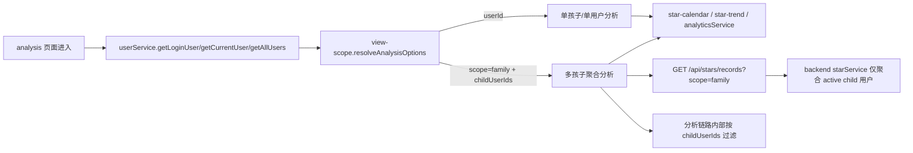

# 里程碑-18：分析页范围语义对齐 详细设计文档

> **设计状态**：🟢 审核通过
> **创建日期**：2026-04-03
> **设计者**：GPT5 Codex
> **审核者**：项目维护者
> **预计工期**：1-2天

---

## 📋 目录

- [需求分析](#需求分析)
- [技术方案](#技术方案)
- [代码结构](#代码结构)
- [实施步骤](#实施步骤)
- [测试方案](#测试方案)
- [风险评估](#风险评估)
- [替代方案](#替代方案)
- [审核要点自检](#审核要点自检)
- [审核记录](#审核记录)

---

## 需求分析

### 功能描述

当前分析页的范围判定规则过于粗糙。只要家长已加入家庭，前端就直接把分析范围设为 `scope=family`；但项目当前的真实业务语义并不是“家长看家长+孩子的混合家庭数据”，而是“分析页围绕孩子的任务与星星表现展开”。这在单孩子家庭里会让家长视角看到不必要的家庭聚合逻辑，在多孩子家庭里又会把“所有孩子汇总”与“当前孩子自己”混在一起，用户难以理解。

进一步复核代码后确认，当前问题不只在后端查询本身。任务侧的 `scope=family` 虽然已经排除了家长，但没有显式排除 `inactive` 孩子；星星流水侧的 `scope=family` 则既会把家长本人历史流水带入后端响应，也会在前端 family 刷新后把“非目标范围但未同步的本地记录”继续保留在本地仓储。结果就是分析页在家长视角下，任务统计和星星趋势并不一定遵循同一套“活跃孩子集合”语义，容易出现数字来源不一致、趋势偏大、解释困难的问题。

本次里程碑目标是先把“分析页到底看谁”的规则收口为一套稳定语义，并据此约束前后端的最小改动面。重点不是重做分析页 UI，而是让分析页在四种家庭状态下都给出符合产品认知的数据范围。

### 业务价值

- [x] 用户价值：家长进入分析页时看到的数据范围可预期，不再出现“为什么把家长自己的旧星星也算进去了”的困惑。
- [x] 技术价值：统一前端范围判定和后端 family 聚合口径，避免任务统计与星星趋势使用不同语义。
- [x] 业务价值：为后续多孩子分析增强打基础，先把“聚合对象是谁”定义清楚。

### 事实基线（2026-04-03）

#### 1. 前端分析范围规则过粗

`utils/view-scope.js` 当前 `resolveAnalysisOptions(loginUser, currentUser)` 规则为：

- 孩子视角：返回 `{ userId: childId }`
- 家长已加入家庭：返回 `{ scope: 'family' }`
- 其他：返回 `{ userId: parentId }`

这意味着它无法区分：

- 家长已加入家庭但还没有孩子
- 家庭里只有 1 个孩子
- 家庭里有多个孩子

#### 2. analysis 页面没有利用已存在的家庭成员缓存

`packageChart/pages/analysis/analysis.js` 当前只读取：

- `userService.getLoginUser()`
- `userService.getCurrentUser()`

然后直接调用 `viewScopeUtils.resolveAnalysisOptions(...)`。而 `services/user-service.js` 已经具备 `getAllUsers()`，家长设备下会返回“家长自己 + 所有孩子”，因此前端其实已经有足够信息做更细粒度判定。

#### 3. 任务侧 family 聚合已排除家长，但未显式排除 inactive 孩子

后端 `backend/services/taskService.js#getTasksByFamily(...)` 查询条件已包含 `u.role = 'child'`，说明它已经不会把家长任务混进来；但当前没有 `u.status = 'active'` 条件，因此若家庭中存在已停用孩子，其任务仍可能进入 family 聚合结果。

#### 4. 星星流水 family 聚合仍会混入家长

后端 `backend/services/starService.js#getFamilyStarRecords(familyId)` 当前条件仅为：

- `u.family_id = ?`
- `u.status = 'active'`

缺少 `u.role = 'child'`。因此分析页在 `scope=family` 下使用的星星流水，可能把家长本人的历史流水也混进去。

#### 5. 分析服务在 family 模式下直接吃 family 流水

`services/analytics-service.js` 在 `scope='family'` 下不会读取单用户 `star_groups`，而是直接基于 family 流水生成趋势图。这意味着只要 family 流水口径不纯，分析结果就一定会被污染。

#### 6. 仅修后端 child 过滤仍不足以消除前端本地残留污染

当前前端 family 星星刷新流程是：

1. `refreshStarsFromCloud(null, { scope: 'family' })`
2. 从后端拿到 family 流水
3. 调用 `_replaceSyncedStarRecords(..., { scope: 'family' })` 写回本地
4. analysis 组件再从本地仓储按 `userId=null` 读取日期范围流水

但 `_replaceSyncedStarRecords(..., { scope: 'family' })` 在 family 模式下会保留“未同步到云端”的本地记录。因此如果设备本地残留了家长自己的未同步流水，仅修后端 `u.role = 'child'` 并不能彻底阻断这些记录继续进入分析页。

### 功能范围

**包含**：
- ✅ 明确分析页在四类场景下的业务范围规则
- ✅ 调整前端分析范围判定逻辑，支持区分“无孩子 / 单孩子 / 多孩子”
- ✅ 明确并修正后端 `scope=family` 星星流水的聚合语义，只统计活跃孩子
- ✅ 明确并修正前端 family 分析的本地读取过滤，避免家长残留流水继续污染分析页
- ✅ 明确任务 family 聚合在分析语义下也只统计活跃孩子
- ✅ 补齐对应单元测试与页面测试

**不包含**：
- ❌ 新增分析页 child picker / 标签切换器
- ❌ 重做分析页 UI 样式或图表形式
- ❌ 修改首页消息中心、奖励池或任务页的范围语义
- ❌ 新增后端分析专用接口
- ❌ 解决所有历史脏数据；本期只收口“分析页查询口径与本地过滤”

### 优先级

- **优先级**：P1
- **理由**：这是分析页语义正确性的基础问题，会直接影响用户对数据是否可信的判断，但不阻塞核心打卡/奖励主链路。

### 目标语义矩阵

| 场景 | 登录者 | 当前视角 | 分析页目标范围 |
| --- | --- | --- | --- |
| 无家庭 | 家长 | 家长 | 家长自己 |
| 有家庭，无孩子 | 家长 | 家长 | 家长自己 |
| 有家庭，1个孩子 | 家长 | 家长 | 该孩子 |
| 有家庭，多个活跃孩子 | 家长 | 家长 | 所有活跃孩子汇总，不含家长 |
| 家长切到孩子视角 | 家长 | 孩子 | 当前孩子自己 |
| 孩子独立设备 | 孩子 | 孩子 | 当前孩子自己 |

---

## 技术方案

### 方案概述

本方案采用“前端精确分流 + family 上下文显式透传 + 分析链路内部过滤 + 后端统一活跃孩子口径”的最小收口方式。

前端不再把“家长已加入家庭”直接等价为 `scope=family`，而是先基于 `userService.getAllUsers()` 统计活跃孩子数量，再决定分析范围：

1. 如果当前视角已经是孩子，直接看该孩子。
2. 如果当前视角是家长，但家庭里没有孩子，回退看家长自己。
3. 如果当前视角是家长，且只有 1 个孩子，直接看该孩子。
4. 如果当前视角是家长，且有 2 个及以上活跃孩子，才进入 `scope=family` 汇总视图。

但多孩子 family 分析不能再只依赖一个裸 `scope=family`。前端需要把“当前 family 分析实际包含哪些孩子”显式写入 `analysisOptions.childUserIds`，并在 analysis 相关的本地读取链路里按这份名单过滤记录。这样即便本地仓储里残留了家长自己的未同步流水，也不会继续被分析页消费。

后端不新增接口，但要同步修正两条既有 family 查询语义：

1. `GET /api/stars/records?scope=family` 只返回活跃孩子流水。
2. `GET /api/tasks?scope=family` 只聚合活跃孩子任务。

这样前端一旦进入 family 分析，就能在“云端返回 + 分析链路本地消费”两层都得到稳定的“活跃孩子汇总”数据，而不是“家长 + 孩子混合”或“包含已停用孩子”的结果。

### 技术选型

| 技术点 | 选择方案 | 替代方案 | 选择理由 |
| --- | --- | --- | --- |
| 前端范围判定输入 | 复用 `userService.getAllUsers()` | 新增后端 `/analysis/context` 接口 | 本地已有成员缓存，改动最小 |
| 家长单孩子处理 | 直接返回 `{ userId: childId }` | 继续走 `scope=family` | 单孩子时直接看孩子更直观，也能继续显示单孩子星星有效期与当前余额 |
| 多孩子聚合 | 复用 `scope=family` + 显式透传 `childUserIds` | 新增 `scope=children` | 保持现有接口不变，同时补足本地消费层所需上下文 |
| family 星星口径 | 后端 child+active 过滤 + 分析链路内部按 `childUserIds` 过滤 | 仅改后端 SQL | 只改后端无法消除本地残留记录污染 |
| family 任务口径 | 后端补 `u.status = 'active'` | 保持当前 child-only | 分析页任务与星星必须共享“活跃孩子集合”语义 |

### DDD 分层设计

**领域层（models/）**：
- 无变更

**服务层（services/）**：
- 修改前端工具：`utils/view-scope.js`
- 修改前端页面：`packageChart/pages/analysis/analysis.js`
- 修改前端服务：`services/analytics-service.js`
- 修改后端服务：`backend/services/starService.js`
- 修改后端服务：`backend/services/taskService.js`
- 说明：前端负责“该看谁 + family 包含哪些孩子”的分流，并在分析链路内部完成本地过滤；后端负责 family 聚合的权威成员集合

**仓储层（repositories/）**：
- 无变更

**适配器层（adapters/）**：
- 无变更

**表现层（pages/、components/）**：
- 修改页面：`packageChart/pages/analysis/analysis.js`
- 修改组件：`packageChart/components/star-calendar/star-calendar.js`
- 说明：只调整传给日历/趋势组件的 `analysisOptions` 与本地过滤调用，不改分析页 UI 结构

### 架构图



### 数据模型

```typescript
interface AnalysisScopeUser {
  userId: string;
}

interface AnalysisScopeFamily {
  scope: 'family';
  childUserIds: string[];
}

type AnalysisOptions = AnalysisScopeUser | AnalysisScopeFamily;

interface ResolveAnalysisContext {
  loginUser: {
    userId?: string;
    id?: string;
    role?: 'parent' | 'child';
    familyId?: string | null;
  } | null;
  currentUser: {
    userId?: string;
    id?: string;
    role?: 'parent' | 'child';
    familyId?: string | null;
  } | null;
  availableUsers: Array<{
    userId?: string;
    id?: string;
    role?: 'parent' | 'child';
    status?: string;
  }>;
}
```

### 接口设计

无新增接口。

仅调整既有接口语义：

| 接口 | 当前语义 | 调整后语义 |
| --- | --- | --- |
| `GET /api/stars/records?scope=family` | 当前家庭所有 active 成员流水 | 当前家庭所有 active 孩子流水 |
| `GET /api/tasks?scope=family` | 当前家庭所有孩子任务（不区分状态） | 当前家庭所有 active 孩子任务 |

### 关键设计决策

#### 决策1：单孩子家庭下，家长视角分析页直接看该孩子

这是最符合产品认知的语义。因为当前产品中家庭建立后的任务、星星、奖励都围绕孩子展开；单孩子场景下再做“家庭汇总”既没有信息增量，也会让趋势图和日历失去“明确归属对象”。

#### 决策2：多孩子家庭下，family 分析等于“所有孩子汇总”，明确排除家长

这一定义要在前后端同时成立。否则前端认为自己在看“孩子汇总”，后端却把家长历史记录混进来，语义会再次漂移。

#### 决策3：family 分析的“孩子集合”定义为活跃孩子集合

本期将 `inactive` 孩子排除在 family 分析之外。原因是前端 `getAllUsers()` 当前本来就只返回活跃成员，家长视角切换器也不会再暴露停用孩子；分析页若继续把 inactive 孩子的历史任务算进 family，而星星流水不算，会再次形成口径分裂。

#### 决策4：多孩子 family 分析必须显式携带 `childUserIds`

不能只依赖 `scope=family` 这个布尔语义。因为 analysis 组件的真实数据来源仍然要经过本地仓储，若没有显式 child 列表，本地残留的家长未同步流水仍可能被误读。`childUserIds` 不是新增接口，而是前端分析上下文的一部分。

#### 决策5：不扩展 `starService.getStarRecords()` 公共接口

本期不把 `userIds` 这样的多用户过滤能力挂到 `starService.getStarRecords()` 这类通用公共接口上，避免把“仅分析页需要的局部语义”扩散成全局服务契约。实现上改为：

- `analytics-service` 在 family 模式下读取现有记录后，按 `childUserIds` 过滤
- `star-calendar` 在分析页日期范围读取后，按 `childUserIds` 过滤

这样能把本次改动控制在分析页链路内部，避免无关调用方被迫理解新参数。

#### 决策6：无孩子场景下保留家长自分析，作为家庭建立前的兼容态

这能兼容当前“先建任务、后建孩子”的过渡流程，也能覆盖“加入家庭但尚未添加孩子”的真实状态。

#### 决策7：本期不新增多孩子逐个切换能力

多孩子场景下，如果家长需要单独看某个孩子，那是后续增强功能，不属于本次收口范围。本期只先把现有视角的默认语义定义正确。

---

## 代码结构

### 文件变更清单

**新增文件**：
- 无

**修改文件**：
- `utils/view-scope.js` - 扩展分析范围判定，支持读取可用用户列表
- `packageChart/pages/analysis/analysis.js` - 将 `availableUsers` 传入分析范围解析
- `services/analytics-service.js` - family 分析按 `childUserIds` 过滤本地记录
- `packageChart/components/star-calendar/star-calendar.js` - 传递 family 分析过滤上下文
- `backend/services/starService.js` - family 星星流水查询仅聚合活跃孩子
- `backend/services/taskService.js` - family 任务查询补齐 `u.status = 'active'`
- `test/utils/view-scope.test.js` - 覆盖四类场景的范围矩阵
- `test/pages/analysis.page.test.js` - 覆盖 analysis 页面传参逻辑
- `test/services/analytics-service.test.js` - 覆盖 family 分析的 `childUserIds` 本地过滤
- `test/pages/star-calendar.component.test.js` - 覆盖 family 日期范围读取时排除本地残留家长流水
- `backend/test/integration/star-api-m09-real.test.js` - 增补 family 星星流水不包含家长的真实接口验证
- `backend/test/integration/task-api-m07-real.test.js` - 增补 inactive 孩子不进入 family 任务聚合

### 核心代码结构

```javascript
// utils/view-scope.js
function resolveAnalysisOptions(loginUser, currentUser, availableUsers = []) {
  if (isChildView(loginUser, currentUser)) {
    return { userId: getUserIdentifier(currentUser) || getUserIdentifier(loginUser) };
  }

  const activeChildren = availableUsers.filter((user) => user.role === 'child' && user.status !== 'inactive');

  if (activeChildren.length === 1) {
    return { userId: getUserIdentifier(activeChildren[0]) };
  }

  if (activeChildren.length >= 2) {
    return {
      scope: 'family',
      childUserIds: activeChildren.map((user) => getUserIdentifier(user)).filter(Boolean)
    };
  }

  return { userId: getUserIdentifier(currentUser) || getUserIdentifier(loginUser) };
}

// analysis.js
getAnalysisOptions(loginUser, currentUser, availableUsers) {
  return viewScopeUtils.resolveAnalysisOptions(loginUser, currentUser, availableUsers);
}

// services/analytics-service.js
async calculateHistoricalBalance(days, userId = null, options = {}) {
  const childUserIds = Array.isArray(options.childUserIds) ? options.childUserIds : [];
  if (options.scope === 'family') {
    const records = (await this.getAllStarRecords())
      .filter((record) => childUserIds.includes(record.userId));
    // 仅基于活跃孩子集合的记录计算趋势
  }
}

// backend/services/starService.js
async getFamilyStarRecords(familyId) {
  return query(`
    SELECT sr.*
    FROM star_records sr
    INNER JOIN users u ON sr.user_id = u.user_id
    WHERE u.family_id = ?
      AND u.role = 'child'
      AND u.status = 'active'
      AND sr.deleted_at IS NULL
  `, [familyId]);
}
```

### 关键函数

**函数1**：`resolveAnalysisOptions(loginUser, currentUser, availableUsers)`
- **输入**：登录用户、当前视角用户、可用成员列表
- **输出**：`{ userId }` 或 `{ scope: 'family', childUserIds }`
- **职责**：统一分析页范围分流规则
- **依赖**：`getUserIdentifier()`、`isChildView()`

**函数2**：`analysis._resolveAnalysisOptions()`
- **输入**：页面当前 `userService`
- **输出**：分析页范围对象
- **职责**：从缓存成员列表构造前端分析范围
- **依赖**：`userService.getLoginUser()`、`userService.getCurrentUser()`、`userService.getAllUsers()`

**函数3**：`backend starService.getFamilyStarRecords(familyId)`
- **输入**：`familyId`
- **输出**：family 星星流水数组
- **职责**：定义 family 聚合的权威语义
- **依赖**：`users`、`star_records` 表

**函数4**：`analyticsService.calculateHistoricalBalance(days, userId, options)`
- **输入**：天数、`userId`、可选 `options.childUserIds`
- **输出**：过滤后的星星记录数组
- **职责**：在 family 分析场景下仅消费活跃孩子集合对应的记录
- **依赖**：`getAllStarRecords()`

---

## 实施步骤

### 第1步：收口前端分析范围判定（预计2小时）

- [ ] **任务**：扩展 `resolveAnalysisOptions`，支持按孩子数量分流
- [ ] **验证**：四类场景返回正确的 `analysisOptions`
- [ ] **依赖**：无

**实施要点**：
1. 保持消息中心的 `resolveMessageScopeOptions` 不变，本轮只动分析范围
2. 不改 `isChildView` 语义，避免影响其他视角逻辑
3. 将 `availableUsers` 设为可选参数，兼容现有调用方

---

### 第2步：analysis 页面接入成员缓存与 family 上下文（预计1小时）

- [ ] **任务**：让 analysis 页面调用 `userService.getAllUsers()` 并传给范围解析函数
- [ ] **验证**：页面首次进入与 onShow 刷新都能拿到一致的范围
- [ ] **依赖**：第1步

**实施要点**：
1. 当 `userService` 不存在或未初始化时，回退为空数组
2. 保持页面现有 `analysisOptions` 生命周期不变，避免引入重复刷新

---

### 第3步：补齐前端 family 本地过滤链路（预计2小时）

- [ ] **任务**：让 family 分析读取链路按 `childUserIds` 过滤本地记录
- [ ] **验证**：即便本地残留家长未同步流水，family 分析仍只统计活跃孩子
- [ ] **依赖**：第1-2步

**实施要点**：
1. `star-trend` 继续透传 `analysisOptions` 给 `analyticsService`
2. `analyticsService` 在 `scope=family` 下只消费 `childUserIds` 对应记录
3. `star-calendar` 的日期范围读取后也必须使用同一份 `childUserIds` 做组件内过滤

---

### 第4步：修正后端 family 聚合口径（预计1小时）

- [ ] **任务**：修正 family 星星与任务查询都只统计活跃孩子
- [ ] **验证**：family 星星流水不再包含家长/停用孩子，family 任务也与之保持一致
- [ ] **依赖**：无

**实施要点**：
1. 不新增新接口，直接修正既有 family 查询语义
2. 保持孩子调用 `scope=family` 仍为 403，不改权限边界

---

### 第5步：补齐自动化测试（预计2-3小时）

- [ ] **任务**：补前端范围矩阵测试与后端 family 星星聚合测试
- [ ] **验证**：相关测试通过，旧错误断言更新到新语义
- [ ] **依赖**：第1-3步

**实施要点**：
1. 前端至少覆盖：无家庭、无孩子、单孩子、多孩子、孩子视角
2. 前端至少覆盖：family 分析面对本地残留家长未同步流水时仍只统计活跃孩子
3. 后端至少覆盖：family 星星流水排除家长/停用孩子、family 任务排除停用孩子、孩子请求 `scope=family` 仍被拒绝
4. 保留现有 analytics-service 趋势测试，只调整它依赖的范围语义

---

## 测试方案

### 单元测试

- `test/utils/view-scope.test.js`
  - 家长无家庭时返回自己
  - 家长有家庭但无孩子时返回自己
  - 家长单孩子时返回该孩子 `userId`
  - 家长多孩子时返回 `scope=family + childUserIds`
  - 孩子视角时始终返回自己

- `test/pages/analysis.page.test.js`
  - 页面解析范围时正确读取 `getAllUsers()`
  - 首次 onLoad / 后续 onShow 不因新增 `availableUsers` 引入重复加载

- `test/services/analytics-service.test.js`
  - 多孩子 family 分析仅统计 `childUserIds` 对应记录
  - 本地残留家长记录不会进入 family 趋势

- `test/pages/star-calendar.component.test.js`
  - family 日期范围读取后仅渲染 `childUserIds` 对应记录
  - family 刷新后本地仍保留其他未同步记录时，日历链路不会误读这些记录

### 集成测试

- `backend/test/integration/star-api-m09-real.test.js`
  - 家长请求 `GET /api/stars/records?scope=family` 只返回活跃孩子流水
  - 如果同家庭内存在家长流水、活跃孩子流水、停用孩子流水，响应中应只保留活跃孩子流水
  - 孩子请求 `scope=family` 仍返回 403

- `backend/test/integration/task-api-m07-real.test.js`
  - 家长请求 `GET /api/tasks?scope=family` 时，停用孩子任务不应进入聚合结果

### 手工验证

1. 无家庭的家长进入分析页，应看到自己的分析数据。
2. 建立家庭但未添加孩子时，家长进入分析页，仍看自己。
3. 单孩子家庭里，家长视角进入分析页，应看到该孩子趋势、日历、统计。
4. 多孩子家庭里，家长视角进入分析页，应看到活跃孩子汇总数据；家长自己历史星星不应混入。
5. 家长切到某个孩子视角进入分析页，应只看到该孩子个人数据。
6. 孩子独立设备进入分析页，应只看到自己。
7. 设备本地存在家长残留未同步星星流水时，多孩子 family 分析仍不应被污染。

### 回归验证

- 分析页首次进入与返回页刷新机制保持正常
- 星星趋势图单用户 current balance 仍锚定当前活跃分组
- 星星日历、任务统计在 `scope=family` 下仍可正常加载
- family 分析中的任务与星星都只基于活跃孩子集合

---

## 风险评估

### 风险1：现有 family 分析截图或认知与新语义不一致

- **影响**：已有使用者可能注意到多孩子聚合值与旧值不同
- **应对**：这是纠正口径而非功能削减；设计与测试中明确“family=孩子集合，不含家长”

### 风险2：单孩子家庭从 `scope=family` 切成 `userId` 后，局部组件行为变化

- **影响**：趋势图会重新启用单孩子的 `star_groups` 与即将过期预测逻辑
- **应对**：这是期望行为；需要用现有单用户趋势测试做回归保护

### 风险3：family 本地过滤实现不完整，仍可能被残留记录污染

- **影响**：只改后端 SQL 而不改 analysis 本地读取链路，会造成“后端已正确、页面仍然不对”
- **应对**：明确把 `childUserIds` 本地过滤纳入实施与测试，不把它留给实现时临场决定

### 风险4：任务侧不补 active 过滤会再次造成任务/星星口径分裂

- **影响**：分析页任务统计与星星趋势使用不同成员集合，用户会看到“任务数和星星变化对不上”
- **应对**：将 `backend/services/taskService.js` 的 family 查询一并纳入本期修正

---

## 替代方案

### 方案A：保持前端现状，只修后端星星流水 family 查询

- **优点**：改动最小
- **缺点**：单孩子家庭仍然会被强制走 family 聚合，且无法消除本地残留记录污染
- **结论**：不选

### 方案B：新增分析页范围切换器，让家长自己切换“本人 / 单孩子 / 家庭汇总”

- **优点**：最灵活
- **缺点**：交互成本和 UI 改动明显增加，不适合本轮“收口语义”的目标
- **结论**：不选

### 方案C：新增后端分析聚合接口，前端不再自行判定

- **优点**：后端可统一返回完整上下文
- **缺点**：引入新接口和新契约，超出本期最小修正范围
- **结论**：不选

---

## 审核要点自检

- [x] 是否基于现有代码做增量修正，而非重复造轮子
- [x] 是否明确区分了无家庭、无孩子、单孩子、多孩子、孩子视角
- [x] 是否让任务侧和星星侧的 family 语义一致为“活跃孩子集合”
- [x] 是否控制在最小改动面，没有无关 UI 重做
- [x] 是否给出了前端、后端、测试三个层面的明确落点

---

## 审核记录

### 第1轮

- 结论：通过
- 关键修正：
  - family 语义明确为“活跃孩子集合”
  - 补入 `childUserIds`，避免本地残留家长流水污染 family 分析
  - 明确不扩展 `starService.getStarRecords()` 公共接口，改为分析链路内部过滤
