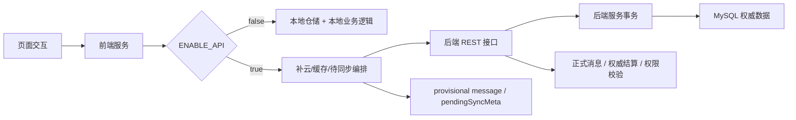

# 里程碑-19A：前后端权威边界审计 详细设计文档

> **设计状态**：🟢 已完成
> **创建日期**：2026-04-03
> **设计者**：GPT5 Codex
> **审核者**：项目维护者
> **预计工期**：1-2天

---

## 📋 目录

- [需求分析](#需求分析)
- [技术方案](#技术方案)
- [代码结构](#代码结构)
- [实施步骤](#实施步骤)
- [测试方案](#测试方案)
- [风险评估](#风险评估)
- [替代方案](#替代方案)
- [审核要点自检](#审核要点自检)
- [审核记录](#审核记录)

---

## 需求分析

### 功能描述

当前项目已经从“纯本地业务逻辑”逐步演进为“本地存储 + 云端存储 + 双写 / 补云 + 部分后端权威”的混合模式，但不同业务域的权威边界并不完全一致。近期里程碑已经把星星到期结算、正式提醒、必做惩罚、逾期补做退星、奖励兑换等高一致性能力逐步迁到后端权威执行；与此同时，前端仍然保留本地仓储、补云、离线兜底、provisional message、重复任务实例生成等职责。

这意味着当前问题的核心已经不是“是否存在双端代码”，而是“哪些能力已经以后端为权威、哪些能力仍以后端+前端协作、哪些能力仍由前端主导”。如果在没有完成一次正式审计的前提下直接启动“大重构”或“前端瘦身”，很容易把离线兜底、本地缓存、待同步体验与真正的业务规则重复混为一谈，导致后续技术债治理目标失焦。

因此，`M19A` 的目标不是立刻实施任何重构，而是先交付一份可落地、可执行的权威边界审计结论，为 `M19` 后续子里程碑拆分提供统一事实基线。这里的“边界”不仅包括任务、星星、奖励、消息、分析五个业务域，还包括横跨这些域的“用户上下文与权限边界”，即登录用户、当前视角用户、家庭成员、`targetUserId`、`actorUserId` / `actorRole` 等决策链路。

### 业务价值

- [x] 用户价值：间接提升后续迭代稳定性，避免因为边界判断错误而引入跨设备数据不一致或离线体验退化。
- [x] 技术价值：明确任务、星星、奖励、消息、分析、用户上下文/权限边界以及配置与降级边界七类审计对象的权威归属，降低后续技术债治理的返工风险。
- [x] 业务价值：为后续里程碑拆分提供事实依据，避免把“重复代码清理”误当成“架构收敛”。

### 事实基线（2026-04-03）

#### 1. 项目当前明确是混合模式，不是纯后端权威架构

`utils/api-config.js` 当前同时保留：

- `ENABLE_API`
- 微信存储中的 `API_BASE_URL`
- 本地模式回退
- 完整 REST 端点配置

这说明云端能力是正式能力，但“关闭 API 后应用仍可运行”也是明确设计目标，而不是偶发兼容分支。

#### 2. 一部分高一致性能力已经迁到后端权威

当前已可确认的后端权威链路包括：

- 星星到期结算：前端通过 `syncExpiryAuthorityIfNeeded()` 触发后端 `POST /api/stars/expiry-authority/sync`
- 正式提醒 materialize：前端刷新消息前触发 `POST /api/tasks/upcoming/sync` 与 `POST /api/stars/expiring-reminders/sync`
- 必做惩罚：云端模式下前端通过 `POST /api/tasks/penalties/sync` 走后端事务执行
- 奖励兑换：云端模式下通过 `PATCH /api/rewards/:rewardId/exchange` 由后端负责实际扣星与保护计算
- 逾期补做退星：云端模式下继续复用 `PATCH /api/tasks/:taskId/status`，由后端统一执行退星 / 回滚

这些能力已经不适合再被描述为“前后端完全重复实现”。

#### 3. 前端仍保留大量本地职责，不能简单视为冗余

当前前端仍明确承担：

- 本地仓储缓存
- `pendingSyncMeta` / `syncedToCloud` 待同步元数据
- 任务、奖励的补云流程
- provisional message 本地生成
- 本地模式下的任务 / 星星 / 奖励完整业务逻辑
- 页面编排与只读规则

其中有些是技术债，有些则是混合架构的必要职责，必须通过审计区分。

#### 4. 重复任务实例生成仍以后端未接管的前端逻辑为主

`services/task-service/task-repeat.js` 仍负责：

- 根据重复规则展开实例日期
- 本地落库
- 批量补云

而当前后端 `taskService.createTask()` 主要仍是“创建单条任务 + 事务消息”，并未等价接管前端这套实例展开逻辑。由此可见，“后端已经基本实现全部业务规则”并不成立。

#### 5. 消息域已经形成“正式消息 + provisional message”双层语义

当前消息系统中：

- 后端负责正式消息 materialize 和持久化
- 前端在待同步链路中仍会创建 provisional message

但这里的 provisional message 不是常态并行生产，而是云端同步失败后的降级兜底产物。后续若要收敛，必须先明确哪些 provisional 仍必要，哪些可以逐步取消。

#### 6. 仓库内已有“重复代码清理”历史文档，但不能替代本次审计

`docs/design/refactor-duplicate-code.md` 聚焦的是早期代码质量和重复代码清理，不涉及当前“前后端权威边界”问题。本次里程碑必须单独建立新的审计文档与结论矩阵。

#### 7. 用户上下文与权限边界是跨域根因，不能只隐含在业务域里

当前多处边界问题并不直接发生在任务/奖励/消息业务逻辑内部，而是发生在“谁在看、谁在操作、谁是实际目标用户”这一层，例如：

- `services/user-service.js` 明确区分 `loginUser` 与 `currentUser`
- `utils/view-scope.js` 负责把登录态和当前视角解析成消息/分析范围
- 后端控制器通过 `targetUserId`、`actorUserId`、`actorRole`、`familyId` 做权限校验和执行者透传

如果这层不被单独纳入审计，后续就容易把“视角上下文漂移”误判成“业务规则重复”。

#### 8. 配置与降级边界是所有权威判断的根开关

当前应用是否进入云端模式，首先由 `utils/api-config.js` 中的 `ENABLE_API`、`API_BASE_URL` 和最终 `finalApiEnabled` 决定。它不是普通偏好配置，而是决定：

- 哪些后端权威链路会被触发
- 哪些本地模式分支会继续承担完整业务逻辑
- 哪些“看起来重复”的逻辑其实只是本地降级保底

因此，`M19A` 需要把“配置与降级边界”作为跨域审计内容之一，重点关注 `api-config.js` 及其在启动链路和服务层中的消费方式，而不是把所有配置服务都等价视作权威边界对象。

### 功能范围

**包含**：
- ✅ 梳理任务、星星、奖励、消息、分析、用户上下文/权限边界以及配置与降级边界七类审计对象的现状边界
- ✅ 对每个业务能力标注“后端权威 / 前端主导 / 混合协作 / 本地降级专属”
- ✅ 识别当前最容易引起误判的边界混淆点
- ✅ 产出问题清单、风险等级和后续候选子里程碑
- ✅ 为 `M19` 后续拆分提供明确的进入条件与顺序建议

**不包含**：
- ❌ 不直接修改任何业务代码
- ❌ 不在本次里程碑中直接实施“大重构”
- ❌ 不直接修改现有 API 契约或数据库结构
- ❌ 不预设“后端权威一定优于混合模式”
- ❌ 不把所有前端逻辑一概定义为冗余

### 优先级

- **优先级**：P1
- **理由**：这是未来技术债治理和架构收敛的前置工作。虽然不直接影响当前用户主链路，但如果没有这份审计，后续任何“瘦客户端 / 后端权威化 / 离线队列治理”都容易走偏。

---

## 技术方案

### 方案概述

`M19A` 采用“代码事实审计 + 业务能力矩阵 + 风险分级 + 子里程碑候选拆分”的方式推进。

核心思路不是讨论抽象架构偏好，而是对照当前真实代码，把每一项业务能力拆成以下问题：

1. 谁负责最终权威结果？
2. 前端当前在做的是业务运算、缓存替换、离线兜底，还是待同步体验补偿？
3. 前后端是否已经存在不必要的重复实现？
4. 如果后续要收敛，最小安全拆分单元是什么？

最终产物不是代码 patch，而是一份正式审计结论，至少包含：

- 能力边界矩阵
- 现状问题清单
- 风险分级
- 后续子里程碑建议

其中“用户上下文与权限边界”以及“配置与降级边界”都会被视为横切能力单独审计，而不是散落在各域描述里带过。因为当前很多争议点本质上都与 `loginUser / currentUser / targetUserId / actorUserId / actorRole / familyId` 的解析透传，以及 `ENABLE_API` 对本地/云端路径的切换有关。

### 技术选型

| 技术点 | 选择方案 | 替代方案 | 选择理由 |
| --- | --- | --- | --- |
| 审计依据 | 直接基于当前代码与近期已完成里程碑事实 | 只基于日志体验或外部讨论结论 | 架构边界必须以代码事实为准 |
| 审计颗粒度 | 按业务域与能力项拆矩阵 | 按文件逐个列出差异 | 后续里程碑拆分依赖业务能力，而不是文件清单 |
| 结论分层 | 后端权威 / 前端主导 / 混合协作 / 本地降级专属 | 仅区分“重复 / 不重复” | 简单的重复判断不足以指导后续治理 |
| 后续规划方式 | 先审计，再回写 `ROADMAP` 拆 `M19A/B/C...` | 现在就把所有子里程碑固定下来 | 当前仍缺正式审计结论，过早拆分会假精确 |

### DDD 分层设计

本次里程碑是审计设计，不改动业务代码，但审计对象覆盖以下层次：

**领域层（models/）**：
- [ ] 本次不修改
- 说明：仅关注领域模型是否在两端承载了重复业务语义

**服务层（services/、backend/services/）**：
- [ ] 本次不修改
- 说明：这是本次审计的核心对象，重点核对业务规则实际归属

**仓储层（repositories/）**：
- [ ] 本次不修改
- 说明：重点核对本地仓储在云端模式下承担的是缓存职责还是业务真相

**适配器层（adapters/、utils/http-client.js）**：
- [ ] 本次不修改
- 说明：重点核对补云、降级和配置切换入口

**表现层（pages/、components/）**：
- [ ] 本次不修改
- 说明：仅核对页面层是否承载了不应存在的业务判断

### 架构图



### 数据模型

```typescript
type AuthorityOwner =
  | 'backend_authoritative'
  | 'frontend_primary'
  | 'hybrid_coordinated'
  | 'local_fallback_only';

interface CapabilityAuditItem {
  domain: 'task' | 'star' | 'reward' | 'message' | 'analytics' | 'context' | 'config';
  capability: string;
  currentOwner: AuthorityOwner;
  frontendRole: string;
  backendRole: string;
  driftRisk: 'P1' | 'P2' | 'P3';
  evidenceFiles: string[];
  followupSuggestion: string;
}

interface M19AuditOutput {
  matrix: CapabilityAuditItem[];
  issues: Array<{
    id: string;
    severity: 'P1' | 'P2' | 'P3';
    summary: string;
    rationale: string;
    candidateMilestone?: string;
  }>;
  nextMilestones: string[];
}
```

### 接口设计

**本次无新增接口。**

但审计结论会对以下现有接口和链路做归属判定：

| 能力 | 现有入口 | 审计目标 |
| --- | --- | --- |
| 任务完成 / 重置 | `PATCH /api/tasks/:taskId/status` | 明确是否已完全后端权威 |
| 必做惩罚 | `POST /api/tasks/penalties/sync` | 明确前端是否仍有多余逻辑 |
| 星星到期结算 | `POST /api/stars/expiry-authority/sync` | 明确本地残留职责是否仍必要 |
| 即将到期提醒 | `POST /api/tasks/upcoming/sync` / `POST /api/stars/expiring-reminders/sync` | 明确正式提醒与 provisional 的边界 |
| 奖励兑换 | `PATCH /api/rewards/:rewardId/exchange` | 明确保护逻辑与本地回退的边界 |
| 视角/目标用户解析 | `currentUser` / `targetUserId` / `actorUserId` / `actorRole` | 明确哪些上下文应由前端决定，哪些必须由后端校验与收口 |

---

## 代码结构

### 文件变更清单

**新增文件**：
- `docs/design/milestone-19a-authority-boundary-audit.md` - `M19A` 审计设计文档

**修改文件**：
- `docs/development/ROADMAP.md` - 记录 `M19` 总里程碑并补记 `M18` 已完成状态

### 核心代码结构

本次不新增业务代码骨架。核心交付物是审计结论矩阵，后续将基于以下代码区域逐项评估：

```javascript
const auditDomains = {
  config: {
    frontend: [
      'utils/api-config.js',
      'utils/app/bootstrap-auth.js',
      'utils/app/post-login-bootstrap.js'
    ],
    backend: []
  },
  context: {
    frontend: [
      'services/user-service.js',
      'utils/view-scope.js',
      'services/task-service.js',
      'services/message-service.js'
    ],
    backend: [
      'backend/controllers/taskController.js',
      'backend/controllers/rewardController.js',
      'backend/utils/resolveTargetUserId.js'
    ]
  },
  task: {
    frontend: [
      'services/task-service.js',
      'services/task-service/task-write.js',
      'services/task-service/task-sync.js',
      'services/task-service/task-repeat.js',
      'services/task-service/task-penalty.js'
    ],
    backend: [
      'backend/services/taskService.js',
      'backend/controllers/taskController.js',
      'backend/routes/tasks.js'
    ]
  },
  star: {
    frontend: ['services/star-service.js'],
    backend: ['backend/services/starService.js', 'backend/services/starExpiryGovernanceService.js']
  },
  reward: {
    frontend: ['services/reward-service.js'],
    backend: ['backend/services/rewardService.js', 'backend/controllers/rewardController.js']
  },
  message: {
    frontend: ['services/message-service.js'],
    backend: ['backend/services/messageService.js', 'backend/controllers/messageController.js']
  },
  analytics: {
    frontend: ['services/analytics-service.js', 'packageChart/pages/analysis/analysis.js'],
    backend: ['backend/services/taskService.js', 'backend/services/starService.js']
  }
};
```

### 关键函数

**函数1**：`syncExpiryAuthorityIfNeeded`
- **输入**：`{ scope, userId, familyId, force, minIntervalMs }`
- **输出**：权威结算同步结果
- **职责**：在云端模式下把星星到期结算前置到后端
- **依赖**：`POST /api/stars/expiry-authority/sync`

**函数2**：`checkTasksStatus`
- **输入**：`service`
- **输出**：任务状态检查结果
- **职责**：区分云端模式与本地模式下的必做惩罚执行入口
- **依赖**：本地任务仓储 / `POST /api/tasks/penalties/sync`

**函数3**：`generateRepeatTasks`
- **输入**：`service, task`
- **输出**：重复任务实例数组
- **职责**：当前仍由前端承担的重复任务展开与补云
- **依赖**：本地任务仓储、批量补云

**函数4**：`_createTaskProvisionalMessages`
- **输入**：`task, pendingSyncMeta`
- **输出**：本地 provisional messages
- **职责**：在正式云端消息之外补足待同步体验
- **依赖**：本地消息仓储

---

## 实施步骤

### 第1步：建立能力边界矩阵（预计3小时）

- [ ] **任务**：按业务域梳理关键能力项，明确每项能力当前的真实归属
- [ ] **验证**：至少覆盖任务、星星、奖励、消息、分析、用户上下文/权限边界、配置与降级边界七类对象
- [ ] **依赖**：当前代码、已完成里程碑设计文档、`ROADMAP`

**实施要点**：
1. 不按文件逐个罗列，而是按能力项组织
2. 每项能力都要有代码证据
3. 必须区分“权威计算”和“缓存/补云/预览”
4. 能力边界矩阵最终以 Markdown 表格形式写入审计结论文档正文

---

### 第2步：识别边界混淆点与风险分级（预计2小时）

- [ ] **任务**：产出问题清单，说明为什么这些能力值得进入后续子里程碑
- [ ] **验证**：每个问题都有严重度、原因和影响面
- [ ] **依赖**：第1步的能力矩阵

**实施要点**：
1. 重点找“容易被误以为重复、但其实承担不同职责”的位置
2. 重点找“已经后端权威，但前端仍残留过重逻辑”的位置
3. 避免把所有问题都升级为 P1

---

### 第3步：形成后续子里程碑候选（预计2小时）

- [ ] **任务**：基于审计结果给出 `M19` 后续拆分建议
- [ ] **验证**：每个候选子里程碑有明确边界，不互相重叠
- [ ] **依赖**：第1步与第2步的结论

**实施要点**：
1. 当前只给候选，不直接写死全部范围
2. 优先按“能否独立交付”拆分
3. 不做一次性大爆炸重构建议

---

### 第4步：完成设计文档与审核材料（预计1小时）

- [ ] **任务**：输出 `M19A` 设计文档并提交审核
- [ ] **验证**：文档结构符合模板，边界表达清晰
- [ ] **依赖**：前三步

**实施要点**：
1. 明确写清“本次不实施代码修改”
2. 明确写清“审计完成后再回写 ROADMAP 拆子里程碑”
3. 自检与既有设计文档不冲突

---

## 测试方案

本次为设计审计阶段，不执行业务代码测试；验证重点是“文档是否完整、结论是否有代码依据、是否可直接指导下一阶段”。

### 文档验证

- [ ] 文档结构符合 `docs/design/.template.md`
- [ ] 范围边界明确写清“只审计，不实施”
- [ ] 已说明与 `M19` 总里程碑、后续子里程碑的关系
- [ ] 没有把 `ROADMAP` 展开成实施细节

### 审计完整性验证

- [ ] 任务、星星、奖励、消息、分析、用户上下文/权限边界、配置与降级边界七类对象均有覆盖
- [ ] 至少列出当前已后端权威的典型能力
- [ ] 至少列出当前前端仍主导的典型能力
- [ ] 至少列出当前混合协作、容易误判的能力
- [ ] 至少列出 1 类“上下文/权限问题伪装成业务问题”的典型案例
- [ ] 至少列出 1 类“配置开关导致权威边界切换”的典型案例

### 后续可执行性验证

- [ ] 读者能据此决定 `M19` 是否拆为多个子里程碑
- [ ] 读者能据此判断先做哪一类治理更稳
- [ ] 不需要额外口头解释也能理解本次结论

---

## 风险评估

### 技术风险

| 风险项 | 影响 | 概率 | 应对措施 |
| --- | --- | --- | --- |
| 审计结论过度抽象，无法落地 | 中 | 中 | 采用能力矩阵而非抽象口号，每项都附代码依据 |
| 把“离线兜底”误判为“业务重复” | 高 | 中 | 明确区分权威计算、缓存、补云、provisional 体验 |
| 子里程碑拆分过早，范围失真 | 中 | 中 | 当前仅形成候选拆分，正式拆分在审计通过后回写 `ROADMAP` |

### 业务风险

| 风险项 | 影响 | 概率 | 应对措施 |
| --- | --- | --- | --- |
| 审计结论误导后续技术方向 | 高 | 低 | 审核时重点复核事实基线是否准确 |
| 团队把技术债里程碑误解为立即要做的大重构 | 中 | 中 | 在文档中明确写明“先审计、再拆分、再逐项设计实施” |

---

## 替代方案

### 方案A：现在就把 `M19` 全部拆成多个固定子里程碑

**优点**：
- 路线图看起来更细
- 后续命名更直观

**缺点**：
- 当前尚无正式审计结论，拆分会假精确
- 容易把尚未确认的边界写死

**结论**：
- 不采用。当前先保留 `M19` 总里程碑更稳。

### 方案B：不做审计，直接启动“后端权威化重构”

**优点**：
- 表面推进速度更快

**缺点**：
- 容易误删前端必要职责
- 很容易把离线兜底和重复逻辑混淆
- 风险远高于收益

**结论**：
- 不采用。必须先完成 `M19A` 审计。

### 方案C：仅做“重复代码清理”，不讨论权威边界

**优点**：
- 范围更小
- 交付更快

**缺点**：
- 不能解决当前真正的架构治理问题
- 很可能清理掉表面重复、保留真正风险点

**结论**：
- 不采用。当前核心问题不是代码行数，而是权威归属。

---

## 审核要点自检

- [x] 已明确本次是审计设计，不是实施方案
- [x] 已明确 `M19` 当前先保持总里程碑，不立即拆分
- [x] 已覆盖任务、星星、奖励、消息、分析以及用户上下文/权限边界、配置与降级边界七类对象
- [x] 已说明“混合模式存在的合理性”和“仍需治理的技术债”要分开判断
- [x] 已给出后续子里程碑的形成方式，但没有过早写死全部内容

---

## 审核记录

### 审核要点

- [x] 是否准确反映当前项目为混合模式而非纯后端权威
- [x] 是否准确区分了后端权威、前端主导、混合协作和本地降级专属能力
- [x] 是否清楚表达了 `M19A` 仅做审计，不做代码改动
- [x] 是否能直接指导后续 `M19` 子里程碑拆分
- [x] 是否与现有 `ROADMAP` 和近期里程碑事实一致

### 审核意见

**审核者**：项目维护者  
**审核日期**：2026-04-04  
**审核结果**：✅ 通过

**意见**：
- 已完成权威边界审计，形成正式审计结论文档，可作为 M19 后续子阶段设计的事实基线。

**修改记录**：
- [x] 补齐 provisional message 为“同步失败降级兜底”而非常态双写
- [x] 补齐“配置与降级边界”为第七类审计对象
- [x] 明确审计产出以矩阵文档形式沉淀，并已产出结论报告
- [x] 审计结论已回写 `ROADMAP.md`，用于标注 M19 已进入分阶段实施

---

**最后更新**：2026-04-04
