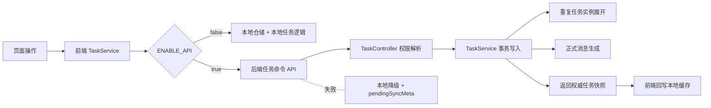

# 里程碑-19B：任务域边界收口 详细设计文档

> **设计状态**：🟢 已完成
> **创建日期**：2026-04-04
> **设计者**：GPT5 Codex
> **审核者**：项目维护者
> **预计工期**：4-6天

> **实施结果**：
> - 已完成任务写接口统一返回、前端权威结果回写、重复任务后端展开
> - 已完成手工验收补修：家长代孩子视角下循环任务批量删改改为按 `targetUserId` 取任务全集

---

## 📋 目录

- [需求分析](#需求分析)
- [技术方案](#技术方案)
- [代码结构](#代码结构)
- [实施步骤](#实施步骤)
- [测试方案](#测试方案)
- [风险评估](#风险评估)
- [替代方案](#替代方案)
- [审核要点自检](#审核要点自检)
- [审核记录](#审核记录)

---

## 需求分析

### 功能描述

`M19A` 审计已经确认，任务域是当前“前后端权威边界”里最典型、也最容易持续漂移的一块：云端模式下，任务状态变更、必做惩罚、逾期补做退星已经以后端事务为权威；但任务创建、更新、删除、重复任务实例展开、ownership 修正、补云回灌与本地 `pendingSyncMeta` 保护仍大量留在前端。

这会造成一个长期问题：从用户视角看，任务系统已经“看起来有云端权威”；但从代码事实看，任务域仍是最重的混合区。`M19B` 的目标不是一次性改造成“纯后端任务系统”，而是先把任务域的**云端模式正常成功路径**收口，让后端成为正式写入真相，前端收窄为“命令发起 + 缓存回写 + 失败降级”，同时把重复任务实例生成从前端迁到后端，减少最核心的双端业务真相分叉。

### 业务价值

- [x] 用户价值：降低多设备、切视角、补云后任务数据不一致的概率，减少“本地看见了但云端并不这么认”的边界问题。
- [x] 技术价值：把任务域最重的混合区先收口，为后续 `M19C/M19D/M19E` 拆分留下清晰边界。
- [x] 业务价值：在不牺牲本地降级能力的前提下，逐步推进“后端权威、前端缓存”的长期方向。

### 事实基线（承接 M19A）

#### 1. 云端模式下，任务状态主链路已经是后端权威

当前 `backend/services/taskService.js` 已在 `updateTaskStatus()` 中统一处理：

- 状态写入
- 逾期补做退星
- 重置时补做退星回滚
- 正式消息生成

这意味着“任务执行结果”的正式权威已经在后端，而不是前端。

#### 2. 任务创建与重复任务展开仍由前端主导

当前前端 `services/task-service/task-write.js` 仍先本地保存任务，再异步补云；若是重复任务，还会在 `services/task-service/task-repeat.js` 中：

- 前端展开未来实例日期
- 本地批量落库
- 批量同步到云端

后端当前 `createTask()` 只负责创建单条任务，不等价接管这套重复实例展开逻辑。

当前前端真实参与实例展开的重复类型包括：

- `daily`
- `weekly`
- `custom`
- `workdays`
- `weekends`

同时还存在一些必须对齐的现有硬编码规则：

- `hasNoEndDate=true` 时，日重复默认向后展开 90 天
- `hasNoEndDate=true` 时，其他已实现重复类型默认向后展开 30 天
- 自定义/工作日/周末重复在起始日期不匹配时，最多向后搜索 21 天寻找第一个合法日期
- 前端当前补云批次大小为 10，批次间隔为 100ms

另外，`models/task.js` 中虽然仍定义了 `monthly` 枚举，但当前前端实例展开代码并未真正实现 `monthly` 分支。  
因此 `M19B` 不应在迁移时“顺手新增 monthly 支持”，而应先严格对齐当前真实已实现的 5 类展开逻辑。

#### 3. 前端 `task-sync.js` 仍承担大量历史兼容和 ownership 修正职责

当前前端云同步链路里，仍包含：

- `resolveCloudTaskOwnership()` 的历史归属修正
- `modifyTime` 新旧覆盖保护
- 本地待同步任务与云端结果合并
- 历史占位 `parent/child` 用户 ID 兼容

这说明任务域当前不仅是“有补云”，而且前端还在承担相当多的任务真相解释职责。

#### 4. 在离线总方案未完成前，不能直接砍掉本地降级

`utils/api-config.js` 仍允许应用进入本地模式；而 `M19E` 的离线队列、失败重放、统一降级策略尚未设计完成。  
因此 `M19B` 只能先收口云端模式的正常路径，失败时仍必须保留本地降级安全垫。

但对于“重复任务创建失败”的降级方式，不能简单沿用当前“本地主任务 + 本地重复实例全量展开”的旧路径。  
否则后续恢复网络后，主任务补云一旦改为后端自动展开，会与本地已生成的重复实例发生重复建档冲突。

### 功能范围

**包含**：
- ✅ 收口云端模式下任务创建/更新/删除/状态变更/必做标记的正常成功写路径，改为“API 优先、成功后回写本地缓存”
- ✅ 将云端模式下的重复任务实例展开从前端迁移到后端执行
- ✅ 统一任务写命令中的 `targetUserId`、`actorUserId`、`actorRole`、`operationKey` 透传契约
- ✅ 保留失败时的本地降级和待同步安全垫，但把它降级为异常路径而不是主路径
- ✅ 缩减前端 `task-sync.js` 中仅用于正常主链路的 ownership 修正职责

**不包含**：
- ❌ 不改造分析页读模型，这属于后续 `M19C`
- ❌ 不改造正式消息域的整体策略，这属于后续 `M19D`
- ❌ 不设计统一离线队列与重放系统，这属于后续 `M19E`
- ❌ 不把所有本地仓储直接删除
- ❌ 不处理奖励、星星域的额外边界问题

### 优先级

- **优先级**：P1
- **理由**：任务域是当前最明显的混合区，也是用户最频繁操作的主域。先收口任务域，能在不大爆炸重构的前提下，实质降低跨设备和补云漂移风险。

---

## 技术方案

### 方案概述

`M19B` 采用“云端模式正常路径收口 + 本地失败降级保留”的渐进方案。

核心原则：

1. 云端模式下，任务创建/编辑/删除/必做标记默认先调后端，后端成功后返回权威结果，前端再回写本地缓存。
2. 任务打卡/重置继续以后端为正式权威，但前端保留“立即进入提交态/视觉反馈”的轻量乐观体验；在后端确认前，不把本地仓储正式状态当作真相落盘。
3. 前端本地先写 + 后补云，不再作为云端模式主路径，只保留为网络失败/服务异常时的降级兜底。
4. 重复任务实例的“展开真相”迁到后端；前端不再在云端模式下批量生成任务实例。
5. 本地模式保持现状，不与本次里程碑耦合。

这样可以先把最核心的“任务写入真相”收口到后端，同时避免因为离线方案尚未完成而造成体验硬退化。

### 重复任务迁移策略

#### 1. 迁移前先固化现有规则为测试

在真正迁移到后端前，先把当前前端已实现的重复规则固化为测试基线，包括：

- `daily`
- `weekly`
- `custom`
- `workdays`
- `weekends`
- `hasNoEndDate` 的 90 天 / 30 天默认展开范围
- 自定义/工作日/周末起始日期不匹配时的 21 天搜索窗口
- 自定义重复 `days` 的字符串/数字兼容输入
- 跳过父任务日期本身，不重复创建父实例

`monthly` 不纳入本次迁移目标，因为当前前端并未真正展开该类型。

#### 2. 云端模式下，重复实例只由后端生成

一旦 `POST /api/tasks` 在云端模式下成功，前端只接收并回写后端返回的 `affectedTasks`，不再调用本地 `_generateRepeatTasks()`。

#### 3. 云端模式下，重复任务创建失败时不再本地全量展开

这是本次设计最关键的边界之一。

对于“云端模式下创建重复任务但请求失败”的场景，前端 fallback 改为：

- 本地只保存主任务
- 不本地生成重复实例
- 在 `pendingSyncMeta` 中标记 `repeatMaterializationPending: true`
- 恢复网络后由后端基于主任务的重复配置一次性权威展开

这样可以避免“本地已经生成一套实例，补云后后端再生成一套实例”的双生问题。

这也意味着本次 `M19B` 明确接受一个**异常路径下的可见降级**：

- 仅在“云端模式 + 创建重复任务失败 + 进入本地 fallback”这一异常链路下生效
- 用户在本地临时只能看到主任务当日那一条任务
- 未来重复实例要等补云成功、后端完成权威展开后才会出现

该行为不属于正常成功路径变化，而是为了避免双生实例风险而接受的失败兜底语义；本轮需要把它写入集成测试和手工验证，而不是默认“展示语义完全不变”。

#### 4. 子任务幂等由稳定实例键保证

后端接管重复实例展开后，每个实例任务必须具备稳定幂等身份，推荐方案：

- 主任务仍使用当前 `taskId`
- 子任务 `taskId` 由 `parentTaskId + instanceDate + ownerUserId` 生成稳定值
- 同一主任务、同一实例日期、同一归属用户，在重复重试时应命中同一子任务 ID

因此 `POST /api/tasks` 即使因超时重试，也不会因为后端再次展开而创建重复的子任务。

### 收口后的职责边界

#### 前端职责

- 组装任务命令参数
- 透传 `targetUserId / actorUserId / actorRole / operationKey`
- 在云端成功后将权威返回值回写本地仓储
- 在云端成功回写后，继续发出现有任务事件，保持页面与服务侧事件契约兼容
- 在请求失败时退回本地降级链路，并保留待同步信息
- 页面层交互编排、视角切换、只读规则

#### 后端职责

- 任务正式持久化
- 重复任务实例展开
- 云端模式下任务写结果的权威返回
- 权限校验与 `targetUserId` 解析
- 正式消息生成
- 已有的状态事务、必做惩罚、补做退星继续保持权威

### 交互策略

为了避免 API-first 直接造成明显体感退化，本次按操作类型区分：

| 操作 | 正式权威策略 | 前端即时反馈策略 |
|------|-------------|-----------------|
| 创建任务 | API-first | 显示提交中态，成功后插入权威任务 |
| 编辑任务 | API-first | 显示保存中态，成功后替换为权威任务 |
| 删除任务 | API-first | 显示删除中态，成功后移除本地缓存 |
| 必做/取消必做 | API-first | 控件立即进入 loading/disabled，成功后更新状态 |
| 完成任务 | 后端权威 | UI 立即进入“提交中”视觉态，成功后正式变更，失败恢复 |
| 重置任务 | 后端权威 | UI 立即进入“提交中”视觉态，成功后正式变更，失败恢复 |

这里的“立即反馈”不是“先把本地仓储真相写死”，而是页面级的轻量乐观视觉反馈。

### 技术选型

| 技术点 | 选择方案 | 替代方案 | 选择理由 |
|--------|---------|---------|---------|
| 云端模式写路径 | API 优先，成功后回写本地缓存 | 继续本地先写再补云 | 能显著减少正常路径上的双端漂移 |
| 打卡/重置交互 | 后端权威 + 轻量乐观视觉反馈 | 完全等待网络后再反馈 / 继续本地先写 | 兼顾权威性与体感 |
| 失败兜底 | 保留现有本地待同步链路 | 直接取消本地降级 | 离线总方案尚未完成，不能先砍安全垫 |
| 重复任务展开 | 后端事务内展开并返回权威任务集合 | 继续前端展开后批量补云 | 前端展开是当前最典型的任务域业务真相残留 |
| 本地缓存同步 | 使用现有 repository 回写权威结果 | 引入全新缓存层 | 控制改动面，避免本轮扩散 |

### DDD分层设计

**领域层（models/）**：
- [ ] 修改模型：无
- 说明：本轮未修改 `models/task.js`，权威结果回写通过服务层适配完成。

**服务层（services/、backend/services/）**：
- [ ] 修改服务：`services/task-service.js`
- [ ] 修改服务：`services/task-service/task-write.js`
- [ ] 修改服务：`services/task-service/task-sync.js`
- [ ] 修改服务：`backend/services/taskService.js`
- 说明：`services/task-service.js` 负责主入口编排、事件保持和 fallback 分流；前端子模块收窄为命令发起与缓存回写；后端接管重复任务实例展开并统一返回权威结果。

**仓储层（repositories/）**：
- [ ] 修改仓储：无
- 说明：复用现有 `taskRepository.saveAll()` 完成权威任务快照回写，本轮未新增仓储接口。

**适配器层（adapters/、utils/http-client.js）**：
- [ ] 本次不新建
- 说明：复用现有 `HttpClient` 与 API 配置。

**表现层（pages/、components/）**：
- [x] 修改页面：`pages/task-edit/task-edit.wxml`
- [x] 修改组件：`packageComponents/components/task-heatmap/task-heatmap.js`
- 说明：主页面入口无需大改；实施后仅补修循环任务批量删改的目标用户透传。

### 废弃代码与延后清理策略

`M19B` 会让一部分前端任务逻辑失去“云端模式正常主路径”的职责，但本轮不做激进删除，而是分成三类处理：

#### 1. 本轮明确收缩为“仅本地模式 / 失败降级使用”的代码

- `services/task-service/task-write.js` 中“云端模式下本地先写再补云”的主路径逻辑
- `services/task-service/task-repeat.js` 中“云端模式下本地批量展开重复实例并补云”的主路径逻辑
- `services/task-service/task-sync.js` 中仅服务于正常新写主路径的 ownership 修正与结果回灌逻辑

这些代码在 `M19B` 后不再承担云端模式正式成功路径职责，但仍可保留为：

- `ENABLE_API=false` 的本地模式能力
- 网络失败时的 fallback 安全垫
- 历史 `pendingSyncMeta` / 遗留占位 ID 的兼容处理

#### 2. 本轮允许保留、但要加注释或边界说明的“候选废弃代码”

- 仅在旧补云链路中触发、而新主路径不再进入的分支
- 仅为历史数据修复而保留的 ownership 修正分支
- 仅为过渡期兼容 `task/tasks/taskId` 返回结构而保留的适配代码

要求：

- 实施时在关键分支前补一句“仅服务本地模式 / 失败降级 / 历史兼容”的注释
- 不再让这些代码继续承载新的主路径逻辑
- 单测和集成测试要覆盖“正常主路径不会再误走旧分支”

#### 3. 明确延后到后续阶段再做的清理

以下清理不属于 `M19B` 通过条件，不在本轮强行完成：

- 删除 `task-sync.js` 中全部历史兼容分支
- 删除本地模式仍依赖的任务创建、重复任务、本地仓储写入能力
- 删除过渡期返回兼容字段 `task/tasks/taskId`
- 删除页面层目前仍依赖的 `success/task/message` 结果契约

这些内容应在 `M19B` 落地稳定后，结合后续 `M19C/M19D/M19E` 或单独清理提交继续推进，而不是和本轮主功能收口混做。

### 架构图



### 数据模型

```typescript
interface TaskCommandContext {
  targetUserId?: string | null;
  actorUserId?: string | null;
  actorRole?: 'parent' | 'child' | 'system' | null;
  familyId?: string | null;
  operationKey: string;
  modifyTime: number;
}

interface TaskMutationResponse {
  primaryTask: TaskDTO | null;
  affectedTasks: TaskDTO[];
  operation: 'create' | 'update' | 'delete' | 'complete' | 'reset' | 'required' | 'unrequired';
  idempotent?: boolean;
  task?: TaskDTO | null;
  tasks?: TaskDTO[];
  taskId?: string | null;
}

interface TaskServiceMutationResult {
  success: boolean;
  task?: TaskDTO | null;
  tasks?: TaskDTO[];
  taskId?: string | null;
  message?: string;
  fallback?: boolean;
  mutation?: TaskMutationResponse;
}

interface RepeatMaterializationResult {
  primaryTask: TaskDTO;
  repeatTasks: TaskDTO[];
  totalCreated: number;
}

interface TaskFallbackMeta {
  repeatMaterializationPending?: boolean;
  fallbackReason?: string;
}
```

### 接口设计

**修改现有后端 REST 返回结构**：

| 接口 | 调整内容 | 说明 |
|------|---------|------|
| `POST /api/tasks` | 返回 `primaryTask + affectedTasks` | 云端模式下支持后端创建重复任务实例并一次性回写本地 |
| `PUT /api/tasks/:taskId` | 返回权威更新后的 `primaryTask` | 前端不再以本地写结果为主 |
| `DELETE /api/tasks/:taskId` | 返回删除结果和必要的受影响任务 ID | 便于本地缓存权威删除 |
| `PATCH /api/tasks/:taskId/status` | 保持现有能力，补齐统一返回包装 | 让前端回写逻辑统一 |
| `PATCH /api/tasks/:taskId/required` / `unrequired` | 返回权威任务对象 | 减少前端先写后补云 |

### 接口兼容策略

当前后端任务写接口返回结构并不一致：

- `POST /api/tasks`：直接返回任务对象
- `PUT /api/tasks/:taskId`：返回 `{ task }`
- `DELETE /api/tasks/:taskId`：返回 `{ taskId }`
- `PATCH /api/tasks/:taskId/status`：返回 `{ task }`
- `PATCH /api/tasks/:taskId/required`：返回 `{ task }`
- `PATCH /api/tasks/:taskId/unrequired`：返回 `{ task }`

为了避免一次性打断现有调用方，`M19B` 采用“过渡期兼容返回”：

1. 新接口统一返回 `TaskMutationResponse`
2. 同时保留旧字段镜像：
   - `task` 映射 `primaryTask`
   - `tasks` 映射 `affectedTasks`
   - `taskId` 在删除场景继续保留
3. 前端主路径优先使用新字段
4. 历史补云/旧调用方在过渡期内仍可读取旧字段

这样可以先完成任务域收口，再在后续阶段逐步删除兼容字段。

### 前端服务返回契约策略

这里需要明确区分两层接口：

1. **后端 REST 返回**：统一为 `TaskMutationResponse`
2. **前端 `TaskService` 对页面/组件返回**：本轮继续保持现有结果结构兼容，即 `TaskServiceMutationResult`

原因：

- 现有页面和测试大量依赖 `result.success / result.task / result.message`
- `M19B` 的目标是先收口任务域写路径，不在本轮扩大到页面层结果契约重构

因此本轮前端服务层应负责把后端 `TaskMutationResponse` 适配为现有页面可消费的结果：

- `success=true`
- `task` 优先映射 `primaryTask`
- `tasks` 映射 `affectedTasks`
- `taskId` 在删除场景继续透传
- 原始 `TaskMutationResponse` 可挂在 `mutation` 字段上，供新路径和测试逐步接入

这样页面层、消息事件监听和现有测试可以最小改动通过，后续若要统一页面层返回，再放到 `M19` 后续阶段单独收口。

### 事件契约兼容策略

虽然云端模式下任务写路径改为 API-first，但前端在成功回写权威缓存后，仍必须继续发出现有事件：

- `TASK_CREATED`
- `TASK_UPDATED`
- `TASK_DELETED`
- `TASK_STATUS_UPDATED`
- `TASK_COMPLETED`
- `TASK_RESET`
- `TASK_MARKED_REQUIRED`
- `TASK_UNMARKED_REQUIRED`

要求：

- 事件名保持不变
- 关键 payload 结构保持兼容
- 事件在“权威结果回写完成后”再发出，避免页面与消息服务读取到旧缓存

这一步是为了兼容现有 `message-service.js`、页面刷新逻辑和既有测试契约。

**新增后端服务能力**：

| 方法 | 说明 | 参数 | 返回值 |
|------|------|------|--------|
| `createTaskWithRepeatMaterialization()` | 创建主任务并在事务内展开重复实例 | `{ ownerUserId, taskData, context }` | `{ primaryTask, repeatTasks }` |
| `buildTaskMutationResponse()` | 统一包装任务写接口返回值 | `{ primaryTask, affectedTasks, operation }` | `TaskMutationResponse` |

---

## 代码结构

### 文件变更清单

**新增文件**：
- 无强制新增；优先在现有任务服务内分层扩展

**修改文件**：
- `docs/design/milestone-19b-task-boundary-convergence.md` - 本设计文档
- `services/task-service.js` - 调整主入口编排、事件保持与 fallback 路由
- `services/task-service/task-write.js` - 云端模式下改为 API 优先写路径
- `services/task-service/task-sync.js` - 收缩正常主链路中的 ownership 修正和补云职责
- `backend/controllers/taskController.js` - 统一任务写接口响应结构
- `backend/services/taskService.js` - 后端接管重复任务展开与统一返回
- `backend/test/setup.js` - 补充 M19B 后端测试环境准备
- `backend/test/unit/taskController-m07.test.js` - 补控制器统一返回结构断言
- `backend/test/unit/taskService-m19b-repeat.test.js` - 补重复任务展开与幂等辅助逻辑单测
- `test/services/task-service.helpers.test.js` - 补前端任务写结果适配测试
- `test/services/task-service.test.js` - 补云端优先、失败降级与权威结果回写测试
- `test/services/task-sync.direct.test.js` - 补任务同步层统一返回适配测试
- `pages/task-edit/task-edit.wxml` - 向热力图透传 `targetUserId`
- `packageComponents/components/task-heatmap/task-heatmap.js` - 循环任务批量删改按目标孩子任务全集执行
- `test/pages/task-heatmap.component.test.js` - 补多孩子视角下循环任务批量删改回归测试

### 核心代码结构

```javascript
// 前端：云端模式下 API 优先
async function createTask(service, taskData) {
  if (!service.enableCloudStorage) {
    return createTaskLocally(service, taskData);
  }

  try {
    const mutation = await service._createTaskViaCloud(taskData);
    const cacheResult = await service._applyAuthoritativeTaskMutation(mutation);
    service._emitTaskMutationEvents(mutation);
    return buildTaskServiceResult(mutation, cacheResult);
  } catch (error) {
    return createTaskLocallyAsFallback(service, taskData, error);
  }
}

// 后端：事务内创建 + 重复实例展开
async function createTaskWithRepeatMaterialization(ownerUserId, taskData, context) {
  return withTransaction(async (connection) => {
    const primaryTask = await createPrimaryTask(connection, ownerUserId, taskData, context);
    const repeatTasks = shouldMaterializeRepeat(taskData)
      ? await materializeRepeatTasks(connection, primaryTask, taskData, context)
      : [];

    await createTaskMessages(primaryTask, repeatTasks, context, connection);
    return { primaryTask, repeatTasks };
  });
}
```

### 关键函数

**函数1**：`_createTaskViaCloud`
- **输入**：`taskData`
- **输出**：`TaskMutationResponse`
- **职责**：云端模式下先调用后端创建任务，并接收权威结果
- **依赖**：`HttpClient.post`, `taskController.createTask`

**函数2**：`_applyAuthoritativeTaskMutation`
- **输入**：`TaskMutationResponse`
- **输出**：`{ success, task, createdTasks }`
- **职责**：将后端权威结果写回前端本地仓储
- **依赖**：`taskRepository.save/saveAll`

**函数2.1**：`buildTaskServiceResult`
- **输入**：`TaskMutationResponse, cacheResult`
- **输出**：`TaskServiceMutationResult`
- **职责**：把后端统一写结果适配为页面层仍可直接消费的旧结果结构
- **依赖**：前端现有页面/测试对 `success/task/message` 的返回契约

**函数3**：`createTaskWithRepeatMaterialization`
- **输入**：`{ ownerUserId, taskData, context }`
- **输出**：`{ primaryTask, repeatTasks }`
- **职责**：在后端事务内创建任务并生成重复实例
- **依赖**：`backend/services/taskService.js`

**函数4**：`createTaskLocallyAsFallback`
- **输入**：`taskData, error`
- **输出**：`{ success, task, createdTasks, fallback: true }`
- **职责**：云端请求失败时执行安全降级
- **依赖**：现有本地仓储保存逻辑、`pendingSyncMeta`

约束：

- 普通任务失败时，可沿用现有本地保存逻辑
- 重复任务失败时，只本地保存主任务，不本地展开重复实例
- 对重复任务补充 `pendingSyncMeta.repeatMaterializationPending = true`

---

## 实施步骤

### 第0步：固化现有重复规则测试基线（预计4小时）

- [ ] **任务**：先把当前前端真实已实现的重复规则补成测试基线
- [ ] **验证**：迁移前后同一输入产出一致
- [ ] **依赖**：现有 `task-write.js` / `task-repeat.js`

**实施要点**：
1. 覆盖 `daily`、`weekly`、`custom`、`workdays`、`weekends`
2. 覆盖 90 天 / 30 天默认展开范围与 21 天搜索窗口
3. 明确 `monthly` 当前不在已实现展开基线内

---

### 第1步：统一任务写接口响应结构与兼容字段（预计6小时）

- [ ] **任务**：为任务创建/更新/删除/状态变更/必做标记建立统一的 `TaskMutationResponse`
- [ ] **验证**：后端统一返回 `TaskMutationResponse`，前端页面层仍可继续使用现有 `success/task/message` 结构
- [ ] **依赖**：现有任务接口和控制器

**实施要点**：
1. 保持接口 URL 不变，优先只调整返回结构
2. 统一 `primaryTask/affectedTasks/operation/idempotent`
3. 过渡期内在 `TaskMutationResponse` 顶层同时保留 `task/tasks/taskId` 兼容字段
4. 前端 `TaskService` 本轮继续对页面返回兼容结果，不要求页面层立即改读 `primaryTask/affectedTasks`
5. 不在这一步修改离线降级逻辑

---

### 第2步：后端接管云端模式下的重复任务实例展开（预计12-16小时）

- [ ] **任务**：把重复任务日期展开与批量创建迁到后端事务内
- [ ] **验证**：`POST /api/tasks` 在重复任务场景下返回完整 `affectedTasks`
- [ ] **依赖**：第1步完成统一返回结构

**实施要点**：
1. 后端只对齐当前真实已实现的 5 类展开逻辑：`daily`、`weekly`、`custom`、`workdays`、`weekends`
2. 严格对齐 90 天 / 30 天默认展开范围、21 天搜索窗口、字符串/数字 `days` 兼容和跳过父任务日期
3. 为子任务设计稳定 `taskId` 生成规则，保证重试不重复建档
4. 事务内创建主任务与重复实例，保证部分失败不落脏数据
5. 正式消息只围绕真正需要展示的任务动作生成，不为每个重复实例制造噪音

---

### 第3步：前端云端模式改为 API 优先，失败时才降级（预计10小时）

- [ ] **任务**：调整 `task-write.js`，让云端模式下的任务写操作先调 API，成功后回写缓存
- [ ] **验证**：正常联网时不再出现“本地先写再补云”的主路径日志
- [ ] **依赖**：第1步、第2步

**实施要点**：
1. 创建、更新、删除、必做标记采用 API-first
2. 完成/重置保持后端权威，但页面层提供轻量乐观提交态
3. 请求成功后使用后端返回的权威对象覆盖本地缓存，并继续发出现有任务事件
4. 请求失败时才落回现有本地保存 + `pendingSyncMeta` 安全垫
5. 重复任务失败 fallback 只保存主任务，不本地展开实例

---

### 第4步：收缩前端任务补云链路中的正常路径职责（预计6小时）

- [ ] **任务**：简化 `task-sync.js`，仅保留历史数据、失败降级和遗留占位 ID 兜底所需逻辑
- [ ] **验证**：正常云端主链路不再依赖 `resolveCloudTaskOwnership()` 做常规修正
- [ ] **依赖**：第3步

**实施要点**：
1. 让 ownership 修正只服务于历史待同步数据，而不是新写主路径
2. 把 `pendingSyncMeta` 明确降级为异常路径元数据
3. 保留历史兼容，不在本轮一次性清理全部旧分支

---

## 测试方案

### 单元测试

| 测试项 | 测试方法 | 预期结果 |
|--------|---------|---------|
| 后端重复任务展开 | `taskService` 单测 | 后端按重复规则返回主任务 + 重复实例 |
| 子任务幂等重试 | `taskService` / 集成测试 | 同一主任务重复创建不会产生第二套实例 |
| 前端云端模式创建任务 | `task-write` 单测 | 正常联网时先调 API，再回写本地 |
| 前端失败降级 | `task-write` 单测 | API 失败时落回本地保存并保留待同步元数据 |
| 重复任务失败降级 | `task-write` 单测 | 仅保存主任务，并标记 `repeatMaterializationPending` |
| 事件契约保持 | `task-service` / `message-service` 单测 | API-first 后仍发出兼容事件 |
| 统一返回结构 | controller/service 单测 | 各任务写接口都返回 `TaskMutationResponse` |
| 旧分支职责收缩 | `task-write` / `task-sync` 单测 | 正常云端主路径不再进入本地先写补云分支，旧逻辑仅服务本地模式/失败降级/历史兼容 |

### 集成测试

- [ ] 场景1：云端模式创建普通任务，后端返回权威任务，本地缓存与云端一致
- [ ] 场景2：云端模式创建重复任务，后端一次性生成全部实例并返回
- [ ] 场景3：家长为孩子创建任务，`targetUserId` 与 `actorRole` 透传正确
- [ ] 场景4：重复任务请求超时重试，不会产生第二套实例
- [ ] 场景5：网络失败时前端降级到本地，恢复后仍可补云
- [ ] 场景6：重复任务失败降级后，本地临时仅可见主任务，恢复网络后由后端只生成一套实例并补齐未来实例

### 手动测试

1. **功能测试**：
   - [ ] 家长创建普通任务、重复任务，孩子视角和家长视角都能看到正确结果
   - [ ] 孩子/家长打卡任务后，状态和消息仍保持当前正式语义，提交中体感可接受
   - [ ] 删除、修改、必做标记在云端模式下无异常
   - [ ] 重复任务创建失败时，本地临时仅显示主任务；补云成功后未来实例补齐，且不会出现双生实例

2. **回归测试**：
   - [ ] 本地模式任务创建、重复任务、打卡、补做不回归
   - [ ] 现有任务状态权威链路不被破坏
   - [ ] 消息和分析页不因任务写路径收口出现明显回归

### 测试覆盖率目标

- 最低要求：85%
- 推荐目标：90%

---

## 风险评估

### 技术风险

| 风险项 | 影响 | 概率 | 应对措施 |
|--------|------|------|---------|
| 后端重复规则与前端现有规则不完全一致 | 高 | 中 | 迁移前先固化现有重复日期规则测试，按现有规则逐条对齐 |
| 重复任务失败降级后与后端展开发生双生冲突 | 高 | 中 | 重复任务 fallback 只保存主任务，不本地展开实例 |
| 子任务重试时重复建档 | 高 | 中 | 为子任务定义稳定 `taskId`，并补幂等测试 |
| API 优先后页面体感变慢 | 中 | 中 | 区分操作类型，为打卡/重置保留轻量乐观提交态 |
| 失败降级与正常主路径互相干扰 | 高 | 中 | 明确代码分支：成功主路径与失败降级路径分离 |
| 历史 `pendingSyncMeta` 数据兼容不足 | 中 | 中 | `task-sync.js` 保留遗留兼容逻辑，不做一次性硬删除 |

### 业务风险

| 风险项 | 影响 | 概率 | 应对措施 |
|--------|------|------|---------|
| 重复任务失败降级的临时展示变化影响用户预期 | 中 | 低 | 明确这是异常路径下的接受性降级；正常成功路径仍保持现有重复规则，且补充集成测试与手工验证 |
| 家长代孩子创建/打卡的操作者记述变化 | 中 | 中 | 复用现有 `operatorContext` 契约并补充集成测试 |

---

## 替代方案

### 方案A：继续保持当前任务域混合模式，不做收口

**优点**：
- 实施成本最低
- 不影响现有离线与补云逻辑

**缺点**：
- 任务域继续长期承担最大混合复杂度
- 重复任务仍保持“双端真相分叉”状态
- 后续越往后改，迁移成本越高

### 方案B：直接做完整“后端权威 + 离线队列”重构

**优点**：
- 架构目标最彻底
- 能一次性统一任务写路径

**缺点**：
- 明显越过 `M19B` 边界
- 会和 `M19C/M19D/M19E` 强耦合
- 风险和工作量都过高

### 最终选择：渐进式任务域收口

原因：

- 先解决任务域最明显的正常主路径漂移问题
- 不提前碰离线总方案
- 与 `M19A` 审计结论一致，也更适合分阶段实施

---

## 审核要点自检

- [x] 已明确 `M19B` 只聚焦任务域，不越界到分析/消息/离线总方案
- [x] 已承接 `M19A` 审计结论，而不是另起一套叙述
- [x] 已明确云端模式下“正常成功路径”和“失败降级路径”的职责差异
- [x] 已把重复任务实例展开列为核心收口点
- [x] 已补充重复任务失败降级与子任务幂等策略
- [x] 已补充接口兼容策略与事件契约兼容策略
- [x] 已区分 API-first 操作与轻量乐观交互操作
- [x] 已说明本次不直接删除本地仓储和本地降级能力

---

## 审核记录

**审核状态**：已完成  
**审核意见**：已完成实施与终审，可作为 M19B 已交付事实记录。  
**修改记录**：2026-04-04 初稿创建；2026-04-04 根据多轮评审完成修订并通过终审；2026-04-04 按实际实现结果回写文档状态、文件清单与手工验收补修记录

**实施验证补记**：
- [x] 前端任务服务定向测试通过
- [x] 后端控制器 / 重复任务单测通过
- [x] 页面测试通过
- [x] 模拟器日志已复核创建、编辑、完成、重置、删除与循环任务批量删改链路

---

**最后更新**：2026-04-04
