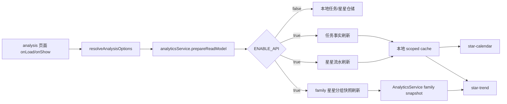

# 里程碑-19C：分析读模型治理 详细设计文档

> **设计状态**：🟢 评审通过，待实施
> **创建日期**：2026-04-04
> **设计者**：GPT5 Codex
> **审核者**：GPT5 Codex
> **预计工期**：3-5天

---

## 📋 目录

- [需求分析](#需求分析)
- [技术方案](#技术方案)
- [代码结构](#代码结构)
- [实施步骤](#实施步骤)
- [测试方案](#测试方案)
- [风险评估](#风险评估)
- [替代方案](#替代方案)
- [审核要点自检](#审核要点自检)
- [审核记录](#审核记录)

---

## 需求分析

### 功能描述

`M18` 已经把分析页“看谁”的范围语义收口为单孩子 / 多孩子两套稳定规则，`M19B` 又把任务写路径进一步收口为后端权威。但分析页本身仍然没有形成一套正式的“读模型权威边界”：页面壳层只负责解析 `analysisOptions`，真正的数据保鲜和聚合却分散在 `star-calendar`、`star-trend` 和 `services/analytics-service.js` 里，各自直接访问 `taskService` / `starService` / 本地仓储。

这导致当前分析页虽然“结果大体可用”，但底层仍是典型的混合读链路：有的组件会先刷新云端事实，有的直接读本地缓存；单用户趋势图会用 `star_groups` 锚定当前余额，family 模式却只能基于 `star_records` 近似推导，并直接跳过过期预测；分析页入口没有统一的保鲜入口，因此同一次进入页面，组件之间也可能拿到不同新鲜度的数据。`M19C` 的目标就是把这条读链路治理清楚，形成“云端模式下分析页读取哪份权威事实、由谁统一保鲜、family 余额如何锚定、本地模式如何降级，以及月份/趋势范围切换时由谁重新准备读模型”的正式方案。

### 业务价值

- [x] 用户价值：分析页显示的数据范围和新鲜度更稳定，减少“为什么今天看到的趋势和日历不一致”的困惑。
- [x] 技术价值：把分析页从“组件各自拉数 + 本地聚合”收口为统一读模型，降低后续继续治理消息 / 离线时的耦合成本。
- [x] 业务价值：为多孩子家庭下的分析结果提供更可解释的权威口径，同时保留本地模式和失败降级能力。

### 事实基线（2026-04-04）

#### 1. 分析页范围语义已初步对齐，但读链路仍是分散式

`utils/view-scope.js#resolveAnalysisOptions()` 现在已经支持：

- 孩子视角返回单孩子 `userId`
- 家长单孩子场景返回该孩子 `userId`
- 家长多孩子场景返回 `{ scope: 'family', childUserIds }`

但 `packageChart/pages/analysis/analysis.js` 当前只负责把这份 `analysisOptions` 写到页面状态，并没有统一负责“读模型保鲜”。

#### 2. 分析页两个核心组件仍各自直接拉任务 / 星星

当前实际使用的分析页只包含两个核心组件：

- `packageChart/components/star-calendar/star-calendar.js`
- `packageChart/components/star-trend/star-trend.js`

它们都会在自己的生命周期里直接调用：

- `starService.refreshStarsFromCloud(...)`
- `taskService.getTasksByDateRange(...)`
- `analyticsService.calculateHistoricalBalance(...)`

这意味着即使分析页壳层已经进入，也没有“一次进入页面只保鲜一次”的主入口，组件之间仍可能重复请求。

#### 3. `TaskService.getTasksByDateRange()` 在云端模式下会再次直接发云请求

`services/task-service/task-query.js#getTasksByDateRange()` 在云端模式下会调用 `_fetchTasksFromCloud(...)`。  
因此当前 `star-calendar` 并不是“只读本地已保鲜缓存”，而是每次进入 / 翻月都可能再拉一轮云端任务数据。

#### 4. 分析服务仍是前端主导聚合，没有后端分析读模型

`services/analytics-service.js` 当前负责：

- 任务星星日历事实转换
- 历史余额趋势计算
- 即将过期预测
- 任务完成统计

但它聚合时依赖的是本地 `taskService` / `starService` 可读到的任务、星星流水和分组，并没有后端分析接口或正式读模型快照。

#### 5. 单用户与 family 分析当前使用的余额锚定语义并不一致

当前 `calculateHistoricalBalance()` 中：

- 单用户模式：会读取 `star_groups`，以当前活跃分组余额作为趋势图最后一个点锚定
- family 模式：只读取 family `star_records`，不读取 family `star_groups`，并直接跳过过期预测

结果是：

- 单用户趋势图表示“当前可用余额 + 未来过期预测”
- family 趋势图表示“基于流水近似反推的历史净额”，而不是正式家庭可用余额

这种差异已经超出“展示风格不同”，属于读模型语义不一致。

#### 6. 后端当前缺少 family 星星分组快照能力

后端已有：

- `GET /api/stars?userId=...`
- `GET /api/stars/records?scope=family`

但没有“family 活跃孩子集合的当前可用余额 / 分组快照”读取能力。  
这正是 family 分析无法锚定当前余额、无法做过期预测的直接原因。

#### 7. `M19A` 已明确分析页是后续单独治理对象

`docs/design/milestone-19a-authority-boundary-audit-report.md` 已明确指出：

- 分析页仍是前端读模型，不是后端权威视图
- 当前需要先决定“继续前端聚合，还是补后端聚合接口”

`M19C` 就是针对这一条结论的正式落地设计。

### 功能范围

**包含**：
- ✅ 明确分析页云端模式下的正式读模型边界，定义“谁负责保鲜、谁负责聚合、谁负责 fallback”
- ✅ 为 family 分析补齐“当前可用余额 / 分组快照 / 过期预测基线”的权威读取能力
- ✅ 将分析页收口为页面级统一保鲜入口，避免 `star-calendar` / `star-trend` 各自重复拉云数据
- ✅ 让 `AnalyticsService` 以“权威原始事实 + 前端轻聚合”为正式策略，而不是继续依赖任意本地缓存状态
- ✅ 保留 `ENABLE_API=false` 或云端失败时的本地降级能力

**不包含**：
- ❌ 不重做分析页 UI，不新增多孩子 picker 或新的图表卡片
- ❌ 不新增完整的后端图表聚合 API；本期仍保留前端图表算法和日历渲染逻辑
- ❌ 不改变首页、消息页、奖池页的范围语义
- ❌ 不设计统一离线队列，这属于后续 `M19E`
- ❌ 不处理历史脏数据清洗，只收口新读取链路

### 优先级

- **优先级**：P1
- **理由**：分析页不是最高频主链路，但它是当前最明显的“读模型仍前端主导”的领域。如果不先把读模型边界治理清楚，后续 family 分析、多孩子解释性和离线语义都会持续漂移。

---

## 技术方案

### 方案概述

`M19C` 采用“页面级统一保鲜 + 后端补齐 family 星星快照能力 + 前端保留轻聚合”的渐进方案。

核心选择是：**本期不直接新增完整后端分析聚合接口**，而是先把“分析页使用的权威原始事实”治理清楚。原因是当前分析页只有星星日历和趋势图两张卡片，且现有前端 `AnalyticsService` 已经承载了稳定的图表聚合与日期处理逻辑。若此时把所有聚合算法整体搬到后端，改动面会显著扩大，还会和 M19E 的离线方案耦合。

因此本期的正式边界定义为：

1. 云端模式下，分析页进入后先由页面壳层统一触发一次“分析读模型保鲜”。
2. 后端继续提供任务 / 星星原始事实，其中新增 family 星星分组快照能力。
3. 前端 `AnalyticsService` 不再让组件各自决定是否刷新云端，而是统一消费“已保鲜的 scoped facts”做轻聚合。
4. 本地模式或云端失败时，继续回退到现有本地聚合逻辑。
5. 页面壳层同时接管“当前可见月份”“当前趋势天数”两类分析态；组件只通过事件上报交互变化，不再自行决定主刷新时机。

### 正式决策：M19C 继续保留前端聚合，但原始事实以后端权威快照为准

这也是 `M19A` 提出的“先明确方向”的正式答案：

- **不选择**：当前就新增完整后端分析聚合接口，把趋势图 / 日历 / 统计全部搬到后端
- **选择**：保留前端聚合，但要求聚合的输入必须是“统一保鲜后的权威原始事实”

原因：

- 当前前端聚合逻辑已经覆盖任务日历、趋势锚定、惩罚 / 补做退星等特殊事实，直接重写风险过高
- 分析页当前 UI 简单，更大的问题在“读到哪份数据”，而不是“图怎么画”
- family 模式当前缺的主要是 `star_groups` 类快照能力，而不是后端不会算曲线
- 保留前端轻聚合后，本期仍可显著降低漂移，同时避免过早进入“分析 API 大重构”

### 技术选型

| 技术点 | 选择方案 | 替代方案 | 选择理由 |
|--------|---------|---------|---------|
| 分析入口保鲜 | 页面壳层统一调用 `analyticsService.prepareReadModel()` | 继续让组件各自刷新 | 组件分散拉数是当前重复请求和新鲜度不一致的根因 |
| family 当前余额锚定 | 后端补充 family 星星分组 / 汇总快照读取能力 | 继续只用 family 流水近似推导 | 近似净额不能代表“当前可用余额”，也无法做过期预测 |
| 聚合位置 | 前端 `AnalyticsService` 继续负责图表轻聚合 | 全量迁到后端分析 API | 当前先治理输入事实边界，风险更低、收益更直接 |
| 交互状态归属 | `analysis.js` 持有 `visibleMonthKey` / `trendDays`，组件通过事件上报变化 | 组件内部各自持有并触发主刷新 | 否则“页面统一保鲜”在翻月和切换趋势范围时无法成立 |
| 缓存策略 | `AnalyticsService` 内部按 `analysisOptions + monthKey + days` 做 in-flight 复用和 30 秒短时缓存，组件只保留渲染缓存 | 直接每个组件各自请求 | 避免分析页进入时同域重复发云请求，同时避免组件缓存与权威快照脱节 |
| 失败兜底 | 云端失败回退现有本地聚合 | 失败即空态 | 当前项目仍保留本地模式与降级语义，不能直接砍掉 |

### DDD分层设计

**领域层（models/）**：
- [ ] 本轮不新增模型
- [ ] 本轮不修改模型
- 说明：本期不新增分析领域实体，继续复用 `Task` / `StarRecord` / `StarGroup`

**服务层（services/、backend/services/）**：
- [x] 修改服务：`services/analytics-service.js`
- [x] 修改服务：`services/star-service.js`
- [x] 修改服务：`backend/services/starService.js`
- 说明：前端负责统一保鲜、聚合和 fallback；后端补齐 family 分组快照与活跃孩子汇总读取能力

**仓储层（repositories/）**：
- [ ] 本轮不新增仓储
- [ ] 本轮不修改仓储
- 说明：仍复用现有任务 / 星星仓储，不引入新的分析仓储表

**适配器层（adapters/、utils/）**：
- [x] 修改工具：`utils/view-scope.js`
- 说明：如实施时需要补充分析作用域签名或 `subjectUserIds` 规范，统一收口在现有 scope 工具里

**表现层（pages/、components/）**：
- [x] 修改页面：`packageChart/pages/analysis/analysis.js`
- [x] 修改组件：`packageChart/components/star-calendar/star-calendar.js`
- [x] 修改组件：`packageChart/components/star-trend/star-trend.js`
- 说明：页面壳层负责统一准备读模型；组件改为消费 `AnalyticsService` 的统一读结果，不再各自决定是否刷新云端

### 架构图



### 数据模型

```typescript
interface AnalysisReadModelOptions {
  userId?: string | null;
  scope?: 'family';
  childUserIds?: string[];
}

interface AnalysisPreparedSnapshot {
  scope: 'user' | 'family';
  subjectUserIds: string[];
  monthKey: string;
  days: number;
  signature: string;
  refreshedAt: number;
  expiresAt: number;
  currentBalance: number;
  mode: 'authoritative' | 'fallback';
  fallbackReason?: 'local_mode' | 'cloud_failed' | 'pending_local_overlay';
  familyGroupSnapshots?: Record<string, StarGroupDTO[]>;
}

interface FamilyStarSummaryResponse {
  scope: 'family';
  subjectUserIds: string[];
  totalPoints: number;
  groups: Array<StarGroupDTO & { userId: string }>;
}
```

### 接口设计

**新增后端 REST 能力**：

| 接口 | 说明 | 关键参数 | 返回值 |
|------|------|---------|--------|
| `GET /api/stars/family-summary` | 返回家庭活跃孩子的当前可用星星汇总与分组快照 | 无，默认取登录家长家庭 | `{ subjectUserIds, totalPoints, groups }` |

**认证与实现约束**：

- 复用现有登录态 / JWT 鉴权，不新增 `familyId` 查询参数
- family 上下文直接取 `req.user.familyId`，与现有 `scope=family` 星星流水接口保持一致
- 当前领域模型默认“一名用户只属于一个家庭”，本期不扩展多家庭归属模型
- 后端实现以单次 SQL 聚合为主，不引入额外后端缓存；本期只要求前端 `prepareReadModel()` 层做 in-flight + 30 秒短缓存

**新增前端服务接口**：

| 方法 | 说明 | 参数 | 返回值 |
|------|------|------|--------|
| `analyticsService.prepareReadModel()` | 统一刷新分析页所需权威事实，并建立 scoped snapshot | `{ analysisOptions, monthKey?, days?, force? }` | `{ success, snapshot, fallback? }` |
| `analyticsService.getPreparedFamilyGroupSnapshot()` | 返回最近一次 family 分组快照 | `analysisOptions` | `{ currentBalance, groupsByUser }` |

**新增页面/组件事件契约**：

| 事件 / 状态 | 归属 | 说明 |
|------------|------|------|
| `visibleMonthKey` | `analysis.js` | 页面持有当前日历月份，首次进入默认当月 |
| `trendDays` | `analysis.js` | 页面持有当前趋势范围，默认 7 天 |
| `monthchange` | `star-calendar` -> `analysis.js` | 翻月 / 回到今天后只上报月份变化，由页面决定是否重新准备读模型 |
| `rangechange` | `star-trend` -> `analysis.js` | 切换 7/30 天后只上报范围变化，由页面决定是否重新准备读模型 |
| `readModelVersion` | `analysis.js` -> 组件 | 页面每次成功准备读模型后递增版本号，组件据此刷新渲染缓存 |

### 关键设计结论

#### 1. 分析页壳层必须成为唯一保鲜入口

`analysis.js#loadData()` 不能继续只是“转圈 500ms”。  
它要正式承担：

- 解析当前 `analysisOptions`
- 持有 `visibleMonthKey` 和 `trendDays`
- 调用 `analyticsService.prepareReadModel(...)`
- 等待保鲜完成后再让子组件刷新渲染
- `onShow` 时决定是否 `force=true` 重新保鲜

这样才能把分析页从“组件各自刷新”收口为“页面统一准备一次，组件只消费”。  
也就是说，翻月和切换趋势范围不再由组件自己直接发主链路请求，而是先通过事件把状态变化上报给页面，再由页面统一调用 `prepareReadModel()`。

#### 2. 组件不再直接决定是否刷新云端

`star-calendar` 和 `star-trend` 当前都直接触发：

- `starService.refreshStarsFromCloud(...)`
- `taskService.getTasksByDateRange(...)`

`M19C` 后：

- 组件优先读 `AnalyticsService` 已准备好的 scoped facts / snapshot
- 组件保留的 `monthCache` / `_monthTaskCache` / 图表实例缓存只用于渲染，不再承担“决定是否拉云”的职责
- 仅在页面壳层未准备或本地模式下，才走兼容兜底分支

这一步不是为了“少一两个请求”，而是为了让分析页所有卡片共享同一份新鲜度边界。

兼容策略也需要写清：

- `star-calendar.smartRefresh()` 不再直接触发云刷新；实施后它退化为“清理组件渲染缓存 + 请求页面重新准备当前月份”的兼容包装，避免现有事件回调立即失效
- `loadStarRecords()` 保留，但职责收缩为“从已准备的 read model 取当前月份结果并更新日历”
- `analyticsUtils.summarizeTaskStarRecords()` 继续保留，定位为组件渲染阶段的日粒度汇总工具，而不是事实层刷新入口

#### 3. family 分析必须补齐当前余额锚定和过期预测基线

当前 family 趋势图既没有正式 `currentBalance`，也没有 `forecastData`。  
本期通过新增 `GET /api/stars/family-summary` 解决：

- `subjectUserIds` 明确 family 分析实际包含哪些孩子
- `totalPoints` 作为 family 当前正式余额
- `groups` 作为前端 family 过期预测的正式输入

之后 `AnalyticsService.calculateHistoricalBalance()` 在 family 模式下也要像单用户模式一样，用正式余额做最后一点锚定，而不是继续直接取流水净额。

`family-summary` 的正式语义需额外写死：

- 只统计当前登录家长家庭下 `role='child'` 且 `status='active'` 的成员
- 只返回当前仍可用、未过期、非空的 `star_groups`
- 在云端主路径下，`prepareReadModel()` 先执行 `starService.syncExpiryAuthorityIfNeeded({ scope })`，再读取 summary / records，避免把尚未结算的过期分组当成当前余额

#### 4. 继续保留本地模式和失败降级，但它们不再是默认主路径

如果：

- `ENABLE_API=false`
- family summary 读取失败
- 任务 / 星星刷新失败
- 检测到本地待同步流水，无法安全用云端 summary 覆盖本地状态

则 `AnalyticsService.prepareReadModel()` 返回 `fallback=true`，并继续使用现有本地聚合逻辑。  
但在云端正常可用时，分析页的正式主路径不再允许跳过这一步。

为了避免“半新半旧”的混用，fallback 还需要满足两条约束：

- 单次 `prepareReadModel()` 要么产出完整 authoritative snapshot，要么整体回退为 fallback snapshot，不允许任务、星星、family summary 混用不同新鲜度
- 组件只消费当前 `readModelVersion` 对应的结果；旧版本异步返回后不得回写界面

#### 5. 缓存和失效策略必须按页面状态和领域事件显式定义

`M19C` 的缓存不只是“有没有 Map”问题，而是要明确谁可以复用、谁必须失效：

- 页面 onLoad：以当前 `analysisOptions + visibleMonthKey + trendDays` 调一次 `prepareReadModel(force=true)`
- 页面 onShow：默认再次调 `prepareReadModel(force=true)`，正式替代当前 `_scheduleLoadData(true) + smartRefresh()` 组合
- 翻月：`star-calendar` 触发 `monthchange`，页面只为新 `monthKey` 补准备一次；旧月份 snapshot 在 `30s TTL` 内允许直接复用，超时则重新准备
- 切换 7/30 天：`star-trend` 触发 `rangechange`，页面用同一 `monthKey`、新 `days` 重跑 `prepareReadModel()`
- 用户切换 / `analysisOptions` 变化：页面丢弃旧 signature 全量重建
- 任务创建、任务状态变更、星星增减、星星到期结算事件：只标记当前页面 signature 失效；页面可见时再统一 refresh，不要求隐藏组件自己抢跑

`force` 语义也在本期固定：

- `force=true`：页面 onLoad / onShow、显式手动刷新、用户切换后首次进入
- `force=false`：翻月后命中 30 秒有效 snapshot、切换 7/30 天但 signature 已有未过期 snapshot 时

---

## 代码结构

### 文件变更清单

**新增文件**：
- `docs/design/milestone-19c-analysis-read-model-governance.md` - M19C 设计文档

**修改文件**：
- `docs/development/ROADMAP.md` - 回写 M19C 设计已通过、待实施
- `packageChart/pages/analysis/analysis.js` - 页面级统一保鲜入口，持有 `visibleMonthKey` / `trendDays` / `readModelVersion`
- `packageChart/components/star-calendar/star-calendar.js` - 改为消费统一读模型，向页面上报 `monthchange`
- `packageChart/components/star-trend/star-trend.js` - 改为消费统一读模型与 family 当前余额锚定，向页面上报 `rangechange`
- `services/analytics-service.js` - 新增读模型准备、family 快照与统一 fallback
- `services/star-service.js` - 新增 family summary 拉取与本地快照适配能力
- `utils/view-scope.js` - 如需要，补分析范围签名 / subjectUserIds 标准化
- `backend/routes/stars.js` - 挂出 `GET /api/stars/family-summary`
- `backend/controllers/starController.js` - family summary 鉴权与响应包装
- `backend/services/starService.js` - family 活跃孩子分组快照聚合
- `test/services/analytics-service.test.js` - 补分析读模型准备与 family 锚定测试
- `test/pages/analysis.page.test.js` - 补页面统一保鲜与组件刷新契约测试
- `test/pages/star-calendar.component.test.js` - 补统一读模型消费和兜底分支测试
- `test/pages/star-trend.component.test.js` - 补 family 当前余额锚定与预测测试
- `backend/test/unit/starController-*.test.js` / `backend/test/unit/starService-*.test.js` - 补 family summary 单测

### 核心代码结构

```javascript
// analysis.js
async function loadData({ force = true } = {}) {
  const analysisOptions = this._resolveAnalysisOptions();
  const analyticsService = app.getAnalyticsService();
  const visibleMonthKey = this.data.visibleMonthKey;
  const trendDays = this.data.trendDays;

  const result = await analyticsService.prepareReadModel({
    analysisOptions,
    monthKey: visibleMonthKey,
    days: trendDays,
    force
  });

  this.setData({
    loading: false,
    analysisOptions,
    readModelVersion: this.data.readModelVersion + 1,
    readModelReadyAt: result.snapshot?.refreshedAt || Date.now(),
    readModelFallback: result.fallback === true
  });
}

function onCalendarMonthChange(e) {
  this.setData({ visibleMonthKey: e.detail.monthKey, loading: true });
  this.loadData({ force: false });
}

function onTrendRangeChange(e) {
  this.setData({ trendDays: e.detail.days, loading: true });
  this.loadData({ force: false });
}

// analytics-service.js
async function prepareReadModel({ analysisOptions, monthKey, days, force }) {
  if (!this.enableCloudStorage) {
    return { success: true, fallback: true, snapshot: buildLocalSnapshot(...) };
  }

  const signature = buildAnalysisSignature(analysisOptions, monthKey, days);
  const cachedSnapshot = this._preparedSnapshots.get(signature);
  if (!force && cachedSnapshot && cachedSnapshot.expiresAt > Date.now()) {
    return { success: true, snapshot: cachedSnapshot };
  }

  return reuseInflight(signature, async () => {
    await syncExpiryAuthorityIfNeeded(...);
    await refreshScopedTasks(...);
    await refreshScopedStarRecords(...);
    const familySummary = await refreshFamilySummaryIfNeeded(...);
    return buildPreparedSnapshot({ ..., expiresAt: Date.now() + 30 * 1000 });
  });
}
```

### 关键函数

**函数1**：`prepareReadModel`
- **输入**：`{ analysisOptions, monthKey, days, force }`
- **输出**：`{ success, snapshot, fallback? }`
- **职责**：统一刷新分析页所需权威事实并生成 scoped snapshot
- **依赖**：`taskService`、`starService`、`view-scope`

**函数2**：`getFamilyStarSummary`
- **输入**：`familyId`
- **输出**：`{ subjectUserIds, totalPoints, groups }`
- **职责**：返回当前家庭活跃孩子的可用星星汇总与分组快照；结果只包含 active children 的未过期非空分组
- **依赖**：`backend/services/starService.js`

**函数3**：`calculateHistoricalBalance`
- **输入**：`days, userId, options`
- **输出**：`{ historyData, forecastData }`
- **职责**：基于 prepared snapshot 计算单用户或 family 趋势数据；family 模式直接使用“family 全量流水净变动 + family 当前总余额锚定”生成总趋势，不要求先拆成逐孩子子曲线再二次聚合
- **依赖**：`_calculateAnchoredDailyBalance`、family 分组快照

**函数4**：`loadStarRecords`
- **输入**：当前月份、`analysisOptions`
- **输出**：`Promise<void>`
- **职责**：从 `AnalyticsService` 已准备好的读模型中获取月份数据，而不是组件自己直接刷新云端；若月份变化则先上报页面触发 `prepareReadModel()`
- **依赖**：`analyticsService.prepareReadModel`

**函数5**：`onShow -> loadData`
- **输入**：无
- **输出**：`Promise<void>`
- **职责**：替代当前 `_scheduleLoadData(true) + smartRefresh()` 组合，页面显示时由壳层统一决定是否 `force=true` 重新准备读模型
- **依赖**：`analyticsService.prepareReadModel`

---

## 实施步骤

### 第1步：定义分析读模型边界与页面主入口（预计6小时）

- [ ] **任务**：为分析页建立统一的 `prepareReadModel()` 入口，并让 `analysis.js` 真正负责准备数据
- [ ] **验证**：分析页首次进入和再次显示时，只存在一条分析读模型保鲜主路径
- [ ] **依赖**：无

**实施要点**：
1. 在 `analysis.js` 显式引入 `visibleMonthKey`、`trendDays`、`readModelVersion`
2. 在 `AnalyticsService` 中引入按 `analysisOptions + monthKey + days` 维度的 in-flight 复用
3. `analysis.js#loadData()` 改为真实等待 `prepareReadModel()` 完成，并替代当前 `_scheduleLoadData(true) + smartRefresh()` 组合
4. 明确 `star-calendar` 通过 `monthchange`、`star-trend` 通过 `rangechange` 上报页面，不再各自决定是否先刷云端

---

### 第2步：补齐 family 星星分组快照能力（预计8小时）

- [ ] **任务**：后端提供 family 当前余额和分组快照能力
- [ ] **验证**：family 模式下趋势图可得到正式 `currentBalance` 与过期预测输入，不再直接返回空预测
- [ ] **依赖**：第1步完成后可并行实施

**实施要点**：
1. 新增 `GET /api/stars/family-summary`
2. 仅允许家长访问，subject 集合只包含 active children
3. 返回值字段对齐现有星星接口命名，使用 `totalPoints + groups`
4. `prepareReadModel()` 在云端主路径下先执行 `syncExpiryAuthorityIfNeeded({ scope })`，再读取 family summary，保证余额和过期预测基线一致
5. 分组结果保留 `userId`，前端可按孩子做聚合和解释

---

### 第3步：分析组件切换到统一读模型消费（预计8小时）

- [ ] **任务**：让 `star-calendar` / `star-trend` 改为依赖 `AnalyticsService` 准备好的 scoped facts
- [ ] **验证**：分析页进入时不再出现组件各自重复刷新任务 / 星星的链路
- [ ] **依赖**：第1步、第2步

**实施要点**：
1. `star-trend` 去掉组件内直接 `refreshStarsFromCloud` 的主路径，改为由页面先准备读模型
2. `star-calendar` 去掉组件内直接决定任务 / 星星云刷新时机的主路径，翻月后只向页面上报 `monthchange`
3. family 模式下趋势图改为和单用户模式一样使用正式余额锚定
4. 组件内部缓存改成渲染缓存，统一挂在 `readModelVersion` 之下，避免旧版本异步结果回写
5. `smartRefresh()` 暂保留为兼容包装，待现有事件调用方全部迁移后再评估是否删除

---

### 第4步：保留 fallback 并补测试（预计6小时）

- [ ] **任务**：补本地模式、云端失败和 family 聚合的回归测试
- [ ] **验证**：云端失败时分析页仍可回退可用，本地模式不回归
- [ ] **依赖**：第1~3步

**实施要点**：
1. 补 `AnalyticsService` 的 user / family / fallback 三类单测
2. 补页面层“统一入口 + 组件不再重复拉云”的契约测试
3. 补 `monthchange` / `rangechange` 事件链路测试，确认翻月和切换范围时仍由页面统一保鲜
4. 补后端 family summary 的鉴权、active children 过滤和未过期分组结果测试

---

## 测试方案

### 单元测试

| 测试项 | 测试方法 | 预期结果 |
|--------|---------|---------|
| 分析页统一保鲜入口 | `analysis.page.test.js` | `loadData()` 会等待 `prepareReadModel()`，首次进入不重复调度 |
| 页面状态归属 | `analysis.page.test.js` | 翻月和切换趋势范围时由页面重新准备读模型，而不是组件自己发主请求 |
| AnalyticsService 缓存策略 | `analytics-service.test.js` | 30 秒 TTL、in-flight 复用与 `force` 语义符合设计 |
| AnalyticsService user 模式 | `analytics-service.test.js` | 单用户仍以 `star_groups` 锚定当前余额 |
| AnalyticsService family 模式 | `analytics-service.test.js` | family 使用 `family-summary` 当前余额和分组快照，不再直接跳过预测 |
| star-calendar 消费路径 | `star-calendar.component.test.js` | 组件不再主导重复云刷新，月份数据来自统一读模型 |
| star-trend 消费路径 | `star-trend.component.test.js` | 组件消费统一快照，family 趋势与预测口径一致，图表在数据就绪后再 init/update |
| family summary 鉴权 | 后端 controller/unit | 家长可访问，孩子拒绝，subject 仅 active children，groups 仅未过期非空分组 |

### 集成测试

- [ ] 场景1：单孩子视角进入分析页，只发生一条分析数据保鲜主路径
- [ ] 场景2：多孩子 family 分析下，趋势图当前值等于所有活跃孩子当前可用星星总和
- [ ] 场景3：family 模式下若某孩子有即将过期星星，趋势图能给出聚合后的过期预测
- [ ] 场景4：云端失败时分析页回退本地，不空白、不崩溃
- [ ] 场景5：翻月和切换 7/30 天时，由页面统一重新准备读模型，组件不重复自行发起主请求

### 手动测试

1. **单孩子分析**：
   - [ ] 家长看单孩子分析页，日历和趋势图结果与孩子实际余额一致
   - [ ] 孩子独立设备进入分析页，结果与当前孩子任务 / 星星一致

2. **多孩子 family 分析**：
   - [ ] 家长在多孩子家庭进入分析页，只统计活跃孩子
   - [ ] 家长本人历史星星不应再进入 family 趋势
   - [ ] family 趋势图当前值应等于所有活跃孩子当前余额之和

3. **失败降级**：
   - [ ] 云端不可用时分析页可回退本地
   - [ ] `ENABLE_API=false` 时分析页不回归

### 测试覆盖率目标

- 最低要求：85%
- 推荐目标：90%

---

## 风险评估

### 技术风险

| 风险项 | 影响 | 概率 | 应对措施 |
|--------|------|------|---------|
| family 模式需要多次拉取孩子星星分组，增加请求量 | 中 | 中 | 使用 `prepareReadModel()` in-flight 复用，并仅在分析页进入时统一拉取 |
| 组件改为统一读模型后遗漏历史兜底分支 | 中 | 中 | 保留 fallback 标记，并补页面 / 组件契约测试 |
| family 当前余额锚定后与历史旧截图不一致 | 低 | 中 | 明确这是口径修正，变更日志与设计文档写清楚 |
| `analysis.js` 真正等待数据后，页面首进耗时变长 | 中 | 中 | 页面层显示 loading，且只保留一条主刷新链路，避免组件级重复请求 |
| 页面和组件状态归属拆分不清，实施后又回到组件直接拉云 | 高 | 中 | 设计中写死 `visibleMonthKey` / `trendDays` / `readModelVersion` 归页面持有，并以事件契约约束组件 |

### 业务风险

| 风险项 | 影响 | 概率 | 应对措施 |
|--------|------|------|---------|
| 家长看到的 family 趋势数值与此前认知变化 | 中 | 中 | 在设计和回归中把“排除家长本人、只看活跃孩子”写为正式口径 |
| 本地模式下分析语义与云端模式仍有差异 | 低 | 中 | 接受为当前架构现实，并明确这是 fallback 语义，不作为云端主路径基线 |

---

## 替代方案

### 方案A：保持当前组件各自刷新，只补 family 过期预测

**优点**：
- 改动最小
- 不需要重新梳理分析页入口职责

**缺点**：
- 组件重复拉数问题仍在
- 分析页仍没有统一读模型边界
- 后续继续治理时还会反复遇到“到底谁负责保鲜”的问题

**结论**：
- 不采用

### 方案B：直接新增完整后端分析聚合接口

**优点**：
- 后端权威最彻底
- 前端几乎只剩渲染

**缺点**：
- 需要把趋势图 / 日历 / 统计等聚合算法整体搬到后端
- 改动面明显超过当前分析页实际复杂度
- 会和离线策略、前端 fallback 语义强耦合

**结论**：
- 当前不采用，留作后续更重阶段的候选方向

### 方案C：页面统一保鲜 + 后端补 family 快照 + 前端保留轻聚合

**优点**：
- 能直接解决当前最大问题：输入事实边界不清、family 余额无法锚定、组件重复拉数
- 与当前项目“后端权威事实 + 前端轻呈现 + fallback 保留”的整体节奏一致
- 改动面可控，可作为 M19 后续阶段的稳定中间态

**缺点**：
- 前端仍保留部分分析聚合逻辑
- family 模式下请求数仍可能高于单用户

**结论**：
- 采用

---

## 审核要点自检

- [x] 已明确 `M19C` 聚焦分析读模型，不越界到消息或离线总方案
- [x] 已明确回答“继续前端聚合还是补后端分析接口”的方向选择
- [x] 已写清当前分析页重复拉数和 family 锚定缺失的事实基线
- [x] 已说明为何本期只补 family 快照能力，而不直接新增完整后端分析聚合 API
- [x] 已保留本地模式和云端失败 fallback 语义
- [x] 已写清月份切换、趋势范围切换的页面/组件职责边界
- [x] 已明确 family summary 的正式口径与星星到期权威结算关系

---

## 审核记录

### 审核要点

- [ ] 是否准确反映当前分析页仍是“组件各自拉数 + 前端聚合”的现状
- [ ] 是否清楚解释了 family 当前余额锚定缺失的根因
- [ ] 是否明确给出 M19C 的方向选择，而不是继续停留在“二选一未定”
- [ ] 是否控制了里程碑边界，没有直接扩展成完整后端分析 API 重构
- [ ] 是否兼顾云端主路径和本地 fallback

### 审核意见

**审核者**：GPT5 Codex  
**审核日期**：2026-04-04  
**审核结果**：🟢 通过（已修正）

**意见**：
- 已补齐页面持有 `visibleMonthKey` / `trendDays` 的交互契约，避免“页面统一保鲜”在翻月和切换范围时失效。
- 已明确 `family-summary` 只统计 active children 的未过期非空分组，并要求云端主路径先经过星星到期权威结算同步。
- 已补充缓存与失效规则，避免组件渲染缓存再次演变成事实层缓存。

---

**最后更新**：2026-04-04
