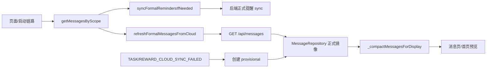

# 里程碑-19D：消息语义与降级治理 详细设计文档

> **设计状态**：✅ 已完成
> **创建日期**：2026-04-04
> **完成日期**：2026-04-04
> **设计者**：GPT5 Codex
> **审核者**：项目维护者
> **预计工期**：3-4天

---

## 📋 目录

- [需求分析](#需求分析)
- [技术方案](#技术方案)
- [代码结构](#代码结构)
- [实施步骤](#实施步骤)
- [测试方案](#测试方案)
- [风险评估](#风险评估)
- [替代方案](#替代方案)

---

## 需求分析

### 功能描述

`M10` 已把消息域纳入云端主链路，`M15A` 又补过一轮消息语义审计，因此当前项目并不是“消息还没云端化”，而是“消息已经部分权威化，但正式消息、provisional 兜底、本地兼容逻辑仍混在同一个前端服务里”。从真实代码看，`services/message-service.js` 既负责云端正式消息读取、已读/删除同步、提醒保鲜，又保留大量本地事件监听与 provisional 创建逻辑；这些逻辑多数已经靠 `if (enableCloudStorage)` 进行隐式分流，但边界没有被正式定义。

`M19D` 的目标不是重做消息系统，也不是引入新的消息渠道，而是把现有“已经基本成型但靠约定维持”的消息边界正式治理清楚：云端正式消息仍然是主路径，前端 provisional 只保留为受控失败降级，本地 legacy/兼容消息不再混入正式主流；同时把“读前同步正式提醒”的语义固定下来，避免它继续被误解为一条普通的本地消息创建链路。这样做的目的，是在进入 `M19E` 配置与离线队列治理前，先把消息域里哪些逻辑应该保留、哪些逻辑只是过渡兼容说清楚。

### 业务价值

- [x] 用户价值：避免消息中心在云端模式下继续出现“有些消息来自云端、有些消息只是本机兜底、但用户无法分辨”的隐性漂移。
- [x] 技术价值：把 `M10/M15A` 已确定的正式消息主路径、失败降级和 legacy 归档语义固化成可维护设计，减少后续实现继续靠隐式守卫分流。
- [x] 业务价值：为 `M19E` 的配置与离线治理提供前置边界，避免离线策略还没定时就误删 provisional 或误把本地兼容逻辑继续留在云端主路径里。

### 功能范围

**包含**：
- ✅ 明确 formal / provisional / legacy 三类消息在云端模式和本地模式下的职责边界
- ✅ 收口前端 `MessageService` 的事件监听职责，区分“正式主路径”“失败兜底”“本地模式兼容”
- ✅ 明确 `syncFormalRemindersIfNeeded()` 的正式语义、调用时机和兼容保留策略
- ✅ 明确消息读取、已读、全部已读、删除在 formal/provisional 共存时的处理规则
- ✅ 补齐消息域测试矩阵，覆盖提醒保鲜、scope 读取、provisional 回收、降级保留和 legacy 归档

**不包含**（明确边界）：
- ❌ 新增微信订阅消息、系统推送、WebSocket/SSE
- ❌ 重做消息中心 UI 或首页消息预览样式
- ❌ 引入独立离线队列、后台重放或通用失败补偿系统，这属于 `M19E`
- ❌ 改造后端为“统一消息读模型聚合服务”，本期仍复用现有消息 API 与提醒 sync 端点

### 优先级

- **优先级**：P1
- **理由**：消息域已经有后端正式权威能力，但前端仍保留明显的降级/兼容包袱。如果在 `M19E` 之前不先厘清这层边界，后续做配置和离线治理时很容易误伤现有消息行为，或者继续把本地 provisional 当成半正式能力长期保留。

---

## 技术方案

### 方案概述

`M19D` 采用“固化现有主路径 + 显式标注降级路径 + 收缩前端监听职责”的方案，不推翻 `M10/M15A` 的既有决策。核心原则如下：

1. **云端正式消息仍然是唯一权威主路径**。在 `ENABLE_API=true` 时，任务/奖励/星星相关正式消息继续由后端事务生成，前端只负责读取、缓存镜像、已读/删除同步和展示压缩。
2. **provisional 只允许作为失败降级消息存在**。它只能由明确的“云同步失败”信号触发，不再允许由普通业务事件提前创建。它只在本机可见，不伪装成已同步正式消息。
3. **legacy / 本地兼容消息退出主流**。历史本地消息继续归档保留，但不再参与正式主消息流读取；当前本地模式下仍允许旧链路继续工作，但这属于 `ENABLE_API=false` 的兼容责任，不影响云端模式主路径。
4. **`syncFormalRemindersIfNeeded()` 明确定位为“正式提醒保鲜入口”**。它的职责不是创建本地消息，而是在正式读取前按 scope 节流触发 upcoming / star expiring 这两类正式提醒同步，再读取云端正式消息镜像。

在这个方案里，不新增后端 REST 接口，也不新增新的消息存储模型；而是复用当前的 `syncedToCloud / isProvisional / isLegacy` 标记体系，但把它们从“实现细节”提升为正式语义。前端服务层新增一组显式 helper，统一判断某条消息属于 formal、provisional 还是 legacy，并以此决定读取、已读、删除、显示压缩和云端同步行为。

### 消息语义矩阵

| 类型 | 判定条件 | 云端模式主路径 | 本地模式 | 已读/删除 | 展示口径 |
|------|----------|---------------|---------|----------|---------|
| Formal | `syncedToCloud=true && isProvisional!==true && isLegacy!==true` | ✅ 主路径，来自后端正式消息 | 可无 | API-first，同步成功后再写本地 | 参与主消息流与压缩 |
| Provisional | `isProvisional=true && syncedToCloud!==true` | ✅ 仅失败兜底 | 可作为本地兼容提醒 | 仅本地写入，不调云端 | 参与主消息流，等待后续正式消息回收 |
| Legacy | `isLegacy=true` 或迁移归档集合 | ❌ 不参与主消息流 | 仅历史兼容 | 本地只读/归档 | 不参与主流展示 |
| Local-only compatibility | 非 formal/provisional，且 `ENABLE_API=false` | ❌ 云端模式不进入主路径 | ✅ 本地模式正式能力 | 本地写入 | 参与本地模式主消息流 |

### 云端模式下的正式读取链路

云端模式读取统一收敛为以下流程：

1. 页面或 bootstrap 通过 `view-scope` 解析出 `scope=user/family` 和 `targetUserId/familyId`
2. 调用 `messageService.getMessagesByScope({ requireFresh })`
3. 如果 `requireFresh=true`：
   - 调用 `syncFormalRemindersIfNeeded(resolvedScope)`
   - 按 scope 节流、in-flight 复用、必要时先做星星到期权威同步
   - 并行触发 `tasks/upcoming/sync` 与 `stars/expiring-reminders/sync`
4. 调用 `refreshFormalMessagesFromCloud(resolvedScope)`：
   - `GET /api/messages`
   - `archiveLegacyMessages(scope, userId)`
   - `replaceSyncedMessagesByScope(scope, userId, cloudMessages)`
   - `cleanupStaleMessages(scope, userId, validIds)`
5. 再从本地仓储按 scope 读取消息，并在服务层显式过滤为“formal 镜像 + provisional 本地降级”组合
6. 最后通过 `_compactMessagesForDisplay()` 输出展示列表

这条链路里，**提醒 sync 属于正式消息保鲜，仓储 replace/cleanup 属于正式镜像回灌，provisional 只是读取时被并入展示视图**。三者职责必须明确拆开。

额外约束：

- 云端模式下，主流展示读取不能直接等同于 `messageRepository.getMessagesByScope()` 的原始返回值。
- 服务层必须显式过滤，只允许 `formal + provisional` 进入云端模式主消息流。
- 任何“既不是 formal、也不是 provisional、也未被标记为 legacy”的历史本地兼容消息，在云端模式下都不能继续混入主流展示。
- `archiveLegacyMessages()` 仍保留首次迁移职责，但它不是云端模式主流过滤的唯一防线。

补充约束：

- `scope=user/family` 是云端模式下唯一正式业务读取口径
- `scope=all` 只保留给“无用户上下文的兼容调用、应用启动初始化和测试场景”，不作为页面正式读取模型
- 现有 `getAllMessages()`、`getUnreadCount()` 兼容接口可以继续存在，但内部仍应委托到 scope 解析后的正式读取逻辑或受控兼容分支
- `message:changed` 事件继续传递“当前有效 scope 的消息快照”，不扩展成真正 all-scope 事件负载，避免首页预览和未读数串入非当前视角消息

### 事件监听治理策略

前端 `MessageService` 现有监听器需要按职责拆成三组：

1. **Cloud fallback listeners**
   - `TASK_CLOUD_SYNC_FAILED`
   - `REWARD_CLOUD_SYNC_FAILED`
   - 仅在 `ENABLE_API=true` 时生效
   - 唯一职责：创建 provisional 消息

2. **Local mode business listeners**
   - `TASK_CREATED / UPDATED / DELETED / COMPLETED / UPCOMING / PENALTY / REQUIRED`
   - `REWARD_CREATED / CLAIMED / DELIVERED / UNCLAIMED`
   - 仅在 `ENABLE_API=false` 时生效
   - 职责：维持本地模式的旧消息能力，不再承担云端模式主路径职责

3. **Domain observers**
   - `DOMAIN_MESSAGE_CREATED / UPDATED / READ / ALL_READ / DELETED`
   - 两种模式都保留
   - 职责：发布 `message:changed` 之类的域内刷新事件，不负责决定消息来源

实现上不要求引入新的服务类，但要把注册逻辑和 handler 命名显式化，例如：

- `_registerCloudFallbackListeners()`
- `_registerLocalModeListeners()`
- `_registerDomainObservers()`

这样后续再看 `MessageService` 时，不需要继续靠一串 `if (this.enableCloudStorage) return;` 反推语义边界。

### `syncFormalRemindersIfNeeded()` 的兼容策略

该方法已被多个调用方依赖：

- `message page` 的 `requireFresh` 读取
- `utils/app/post-login-bootstrap.js`
- `pages/rewards/rewards.js`

因此本期不建议直接删除或改名。`M19D` 只做两件事：

1. 保留公开方法名，避免打断现有调用方
2. 在实现和文档里明确它的正式职责：
   - 它是“正式提醒保鲜入口”
   - 只负责触发后端正式提醒同步
   - 不负责创建 provisional 消息
   - 默认继续保留 10 秒节流和按 scope 的 in-flight 复用

如果后续 `M19E` 需要进一步统一命名，可在兼容别名保留前提下再做收口。

### `refreshMessagesFromCloud()` 与 `_refreshFormalMessagesFromCloud()` 的关系

当前代码中已存在公开方法 `refreshMessagesFromCloud(userId, options)`。本设计草案中的 `_refreshFormalMessagesFromCloud(resolved)` 是为了表达“正式镜像刷新”这一被收口后的内部职责，不表示必须新建一套平行公开 API。

本期实施要求如下：

1. 对外兼容入口继续保留 `refreshMessagesFromCloud(...)`，避免打断现有潜在调用方。
2. 实现上允许两种等价落地方式：
   - 方案A：保留 `refreshMessagesFromCloud(...)` 作为公开兼容包装，内部委托给 `_refreshFormalMessagesFromCloud(resolved)`
   - 方案B：直接在现有 `refreshMessagesFromCloud(...)` 内完成职责收口，不新增同名私有 helper
3. 无论采用哪种方式，设计意图都不变：
   - 公开兼容入口保留
   - 正式提醒保鲜、正式镜像回灌、展示读取过滤三段职责明确拆开

### 仓储与展示职责划分

`MessageRepository` 本期不重做为单独读模型仓储，但职责需要明确：

- 仓储负责保存和查询消息状态
- formal 镜像替换、legacy 归档、stale cleanup 仍由仓储承接
- 是否压缩显示、是否触发提醒保鲜、是否合并 formal/provisional 读取视图，继续由 `MessageService` 决定

这样可以避免把“存储真相”和“页面展示策略”继续混成一个通用仓储接口。

### 技术选型

| 技术点 | 选择方案 | 替代方案 | 选择理由 |
|--------|---------|---------|---------|
| 正式消息权威 | 继续以后端消息 API 为准 | 前端重新接管消息生成 | 已有后端正式消息事务与授权，没必要回退 |
| 失败降级 | 保留 provisional 本地兜底 | 直接移除 provisional | `M19E` 尚未定义离线/重放，当前不能直接取消兜底 |
| 提醒保鲜 | 保留 `syncFormalRemindersIfNeeded()` 公开入口 | 直接改名或下沉为私有方法 | bootstrap 和奖励页已有调用，强改名会扩大改动面 |
| 监听治理 | 在现有服务内按职责拆 listener 注册 | 新建独立 message fallback service | 当前复杂度不足以支持再次拆服务，先把边界明确更务实 |
| 存储策略 | 延续仓储本地镜像 + provisional 共存 | 新建正式/降级双仓储 | 现有仓储已可表达三类状态，本期不值得做存储重构 |

### DDD分层设计

**领域层（models/）**：
- [ ] 修改模型：`models/message.js`
- 说明：
  - 不新增全新消息模型
  - 如实现期有必要，可补少量 helper 或注释来显式表达 formal/provisional/legacy 语义
  - 不改变现有 `syncedToCloud / isProvisional / isLegacy` 基础字段契约

**服务层（services/）**：
- [ ] 修改服务：`services/message-service.js`
- [ ] 修改服务：`utils/app/post-login-bootstrap.js`
- [ ] 修改服务：`pages/rewards/rewards.js`
- 说明：
  - `message-service.js` 是本期核心改造点，负责显式区分正式读取、失败降级、本地模式兼容三条路径
  - `post-login-bootstrap.js`、`rewards.js` 只做调用语义对齐，不改业务目标
  - 不新增后端消息服务接口，继续复用现有 REST 能力

**仓储层（repositories/）**：
- [ ] 修改仓储：`repositories/message-repository.js`
- 说明：
  - 以现有 formal 镜像替换、legacy 归档、stale cleanup 能力为基础
  - 如实现期需要，可补充更清晰的 helper 或注释，但不重构为新仓储

**适配器层（adapters/）**：
- [ ] 无新增适配器
- 说明：
  - 沿用现有 `HttpClient + API_CONFIG`
  - 本期不新增消息新端点

**表现层（pages/、components/）**：
- [ ] 修改页面：`packageMessage/pages/message/message.js`
- 说明：
  - 页面保持轻量，只消费 `getMessagesByScope / mark read / delete`
  - 若服务层语义澄清后无需页面改动，可只补注释与测试

**测试层（test/、backend/test/）**：
- [ ] 修改测试：`test/services/message-service.test.js`
- [ ] 修改测试：`test/repositories/message-repository.test.js`
- [ ] 修改测试：`test/pages/message-page.behavior.test.js`
- [ ] 修改测试：`test/pages/message-page.extra-behavior.test.js`
- [ ] 修改测试：`backend/test/unit/messageService.test.js`
- 说明：
  - 以前端服务层矩阵测试为主
  - 后端以现有授权、已读、删除契约锁定为辅

### 架构图



### 数据模型

```typescript
interface MessageSemantics {
  id: string;
  syncedToCloud?: boolean;
  isProvisional?: boolean;
  isLegacy?: boolean;
  visibilityScope: 'user' | 'family';
  userId?: string | null;
  familyId?: string | null;
  messageEventKey?: string | null;
}

interface MessageReadScope {
  scope: 'user' | 'family' | 'all';
  userId: string | null;
  familyId: string | null;
  requireFresh: boolean;
}

interface FormalReminderSyncResult {
  success: boolean;
  skipped: boolean;
  reason?: 'throttled';
  upcoming?: boolean;
  stars?: boolean;
}
```

### 接口设计

**不新增后端 REST 接口**。

**保留并澄清的前端服务接口**：

| 方法 | 说明 | 参数 | 返回值 |
|------|------|------|--------|
| `getAllMessages` | 兼容入口；内部委托到 scope 解析后的读取逻辑 | `{ scope?, userId?, familyId?, requireFresh? }` | `Message[]` |
| `getUnreadCount` | 兼容入口；优先复用 scope 读取结果计算未读数，并保留“无用户上下文时直接走仓储未读数”的早返回兼容分支 | `{ scope?, userId?, familyId?, requireFresh? }` | `number` |
| `getMessagesByScope` | 按 scope 读取主消息流；必要时先保鲜正式提醒并刷新正式镜像 | `{ scope, userId, familyId, requireFresh }` | `Message[]` |
| `refreshMessagesFromCloud` | 公开兼容刷新入口；内部可委托到正式镜像刷新 helper | `{ userId?, scope?, familyId? }` | `Message[]` |
| `syncFormalRemindersIfNeeded` | 正式提醒保鲜入口，非 provisional 创建入口 | `{ scope, userId, familyId, skipExpiryAuthoritySyncBeforeFormalReminders }` | `FormalReminderSyncResult` |
| `markMessageAsRead` | formal 消息 API-first；provisional 本地已读 | `{ messageId, scope... }` | `boolean` |
| `markAllMessagesAsRead` | formal 批量 API-first；provisional 本地已读 | `{ scope, userId, familyId }` | `number` |
| `deleteMessage` | formal 消息 API-first；provisional 本地删除 | `{ messageId }` | `boolean` |

---

## 代码结构

### 文件变更清单

**新增文件**：
- `docs/design/milestone-19d-message-degradation-governance.md` - M19D 设计文档

**修改文件**：
- `services/message-service.js` - 明确 formal/provisional/legacy 语义、拆分 listener 注册、收口读取主路径
- `repositories/message-repository.js` - 巩固 formal 镜像替换与 provisional 保留语义
- `packageMessage/pages/message/message.js` - 保持轻量消费，必要时仅做调用语义对齐
- `utils/app/post-login-bootstrap.js` - 保持 `syncFormalRemindersIfNeeded()` 的兼容调用
- `pages/rewards/rewards.js` - 保持奖励页即将过期提醒读取前的正式提醒保鲜调用
- `test/services/message-service.test.js` - 补齐 formal/provisional/fallback 行为矩阵
- `test/repositories/message-repository.test.js` - 补齐 formal 镜像替换与 provisional 保留测试
- `test/pages/message-page.behavior.test.js` - 锁定消息页读取与交互契约
- `test/pages/message-page.extra-behavior.test.js` - 锁定错误处理和空态行为
- `backend/test/unit/messageService.test.js` - 锁定后端授权、已读、删除契约

### 核心代码结构

```javascript
class MessageService {
  _registerListeners() {
    this._registerCloudFallbackListeners();
    this._registerLocalModeListeners();
    this._registerDomainObservers();
  }

  async getMessagesByScope(options = {}) {
    const resolved = this._resolveScopeOptions(options);

    if (resolved.requireFresh && this.enableCloudStorage) {
      await this.syncFormalRemindersIfNeeded(resolved);
      await this._refreshFormalMessagesFromCloud(resolved);
    }

    const scopedMessages = await this._getScopedMessagesForDisplay(resolved);
    return this._compactMessagesForDisplay(scopedMessages);
  }

  async getAllMessages(options = {}) {
    return this.getMessagesByScope(options);
  }

  async getUnreadCount(options = {}) {
    const messages = await this.getMessagesByScope(options);
    return messages.filter(message => !message.isRead).length;
  }

  async _refreshFormalMessagesFromCloud(resolved) {
    const cloudMessages = await this._fetchFormalMessages(resolved);
    await this.messageRepository.archiveLegacyMessages(resolved.scope, resolved.userId);
    await this.messageRepository.replaceSyncedMessagesByScope(resolved.scope, resolved.userId, cloudMessages);
    await this.messageRepository.cleanupStaleMessages(resolved.scope, resolved.userId, cloudMessages.map(m => m.id));
  }

  async refreshMessagesFromCloud(userId = null, options = {}) {
    const resolved = this._resolveScopeOptions({ ...options, userId });
    return this._refreshFormalMessagesFromCloud(resolved);
  }

  async _getScopedMessagesForDisplay(resolved) {
    const rawMessages = resolved.scope === 'all'
      ? await this.messageRepository.getAll()
      : await this.messageRepository.getMessagesByScope(resolved);

    if (!this.enableCloudStorage || resolved.scope === 'all') {
      return rawMessages;
    }

    return rawMessages.filter(message => (
      this._isFormalMessage(message) || this._isProvisionalMessage(message)
    ));
  }

  _isFormalMessage(message) {}
  _isProvisionalMessage(message) {}
  _isLegacyMessage(message) {}
}
```

### 关键函数

**函数1**：`getMessagesByScope(options)`
- **输入**：`{ scope, userId, familyId, requireFresh }`
- **输出**：展示用消息数组
- **职责**：统一消息页、首页预览和其他调用方的正式主读取路径
- **依赖**：`syncFormalRemindersIfNeeded`、`_refreshFormalMessagesFromCloud`、`_getScopedMessagesForDisplay`

**函数2**：`getAllMessages(options)` / `getUnreadCount(options)`
- **输入**：兼容参数 `{ scope?, userId?, familyId?, requireFresh? }`
- **输出**：消息数组 / 未读数
- **职责**：维持旧调用方和内部事件分发兼容，不再承载独立语义；默认继续代表“当前有效 scope”，并保留无用户上下文时的仓储早返回兼容路径
- **依赖**：`getMessagesByScope`

**函数3**：`refreshMessagesFromCloud(userId, options)` / `_refreshFormalMessagesFromCloud(resolved)`
- **输入**：兼容参数或已解析 scope
- **输出**：刷新后的消息数组
- **职责**：维持旧刷新入口兼容，同时把正式镜像回灌职责显式收口
- **依赖**：`_resolveScopeOptions`、`_refreshFormalMessagesFromCloud`

**函数4**：`_getScopedMessagesForDisplay(resolved)`
- **输入**：已解析 scope 选项
- **输出**：允许进入展示层的消息数组
- **职责**：在云端模式下显式过滤出 formal + provisional，阻止历史本地兼容消息继续混入主流
- **依赖**：`messageRepository.getMessagesByScope`、`_isFormalMessage`、`_isProvisionalMessage`

**函数5**：`syncFormalRemindersIfNeeded(options)`
- **输入**：`{ scope, userId, familyId, skipExpiryAuthoritySyncBeforeFormalReminders }`
- **输出**：`{ success, skipped, upcoming, stars }`
- **职责**：在正式读取前按 scope 做提醒保鲜，不参与 provisional 创建
- **依赖**：`_syncExpiryAuthorityBeforeFormalReminders`、`HttpClient.post`

**函数6**：`_createProvisionalMessages(eventType, payload)`
- **输入**：`eventType + pendingSyncMeta + task/reward snapshot`
- **输出**：本地 provisional 消息数组
- **职责**：只在云同步失败信号下创建本机兜底消息
- **依赖**：`messageRepository.batchAddMessages`

**函数7**：`replaceSyncedMessagesByScope(scope, userId, cloudMessages)`
- **输入**：scope、userId、正式云消息数组
- **输出**：替换后的正式镜像数组
- **职责**：用正式云消息覆盖本地正式镜像，同时保留未匹配的 provisional
- **依赖**：`MessageRepository`

---

## 实施步骤

### 第1步：固化消息语义边界（预计4小时）

- [ ] **任务**：在 `message-service.js` 中显式定义 formal/provisional/legacy 判定与读取主路径 helper
- [ ] **验证**：云端模式下正式读取、已读、删除逻辑不再依赖散落判断
- [ ] **依赖**：现有 `MessageService` 与 `MessageRepository` 能正常通过定向单测

**实施要点**：
1. 把现有隐式 flag 判断抽成显式 helper，避免条件分支散落在多个方法里。
2. 把 listener 注册按 `cloud fallback / local mode / domain observers` 三组拆开。
3. 保留 `syncFormalRemindersIfNeeded()` 公开方法名，但补清正式语义和注释。
4. 补 `getAllMessages()`、`message:changed` 的“当前有效 scope”兼容语义，避免误扩成 all-scope。

---

### 第2步：收口正式镜像与降级读取（预计6小时）

- [ ] **任务**：梳理 `refreshMessagesFromCloud()`、仓储 replace/cleanup/legacy 归档和展示压缩的职责分界
- [ ] **验证**：formal 镜像刷新后仍能保留 unmatched provisional，legacy 不再混入主流
- [ ] **依赖**：第1步已形成统一语义 helper

**实施要点**：
1. 让“正式保鲜”“正式镜像回灌”“主流展示合并”三段职责分开。
2. 页面层继续保持轻量，不把保鲜或压缩逻辑下放到页面。
3. 保持 `post-login-bootstrap.js` 与 `rewards.js` 的兼容调用，不扩大外部调用改动面。
4. 云端模式主流读取必须显式过滤 formal + provisional，不能只依赖仓储原始返回。

---

### 第3步：补齐测试矩阵与页面契约（预计5小时）

- [ ] **任务**：补齐前端服务层、仓储层、消息页和后端单元测试
- [ ] **验证**：formal/provisional/legacy、scope、已读、删除、提醒保鲜矩阵都有回归测试
- [ ] **依赖**：前两步主链路已稳定

**实施要点**：
1. 重点覆盖云端模式成功路径与失败降级路径的分界，而不是只测 happy path。
2. 锁定 `syncFormalRemindersIfNeeded()` 的节流和 in-flight 复用行为。
3. 锁定 formal/provisional 共存时的 read/delete 契约，避免后续回归。

---

### 第4步：文档与路线图收口（预计2小时）

- [ ] **任务**：实施完成后同步更新设计状态、`ROADMAP.md` 和 `CHANGELOG.md`
- [ ] **验证**：文档状态与代码事实一致
- [ ] **依赖**：代码与测试已完成

**实施要点**：
1. `ROADMAP` 只记录阶段状态，不展开实现细节。
2. `CHANGELOG` 只记录已完成事实。
3. 如实施中发现必须偏离本设计，需先回写设计再继续编码。

---

## 测试方案

### 单元测试

| 测试项 | 测试方法 | 预期结果 |
|--------|---------|---------|
| formal 读取主路径 | `message-service.test.js` mock `HttpClient + repository` | `requireFresh=true` 时先保鲜再刷新正式镜像 |
| 兼容入口委托 | `message-service.test.js` | `getAllMessages/getUnreadCount` 继续委托到正式读取主路径或受控兼容分支 |
| 无用户上下文未读早返回 | `message-service.test.js` | `getUnreadCount()` 在无用户上下文且无显式 scope 时继续直连仓储未读数 |
| 公开刷新入口兼容 | `message-service.test.js` | `refreshMessagesFromCloud()` 仍保留兼容入口，并正确委托到正式镜像刷新职责 |
| 云端模式展示过滤 | `message-service.test.js` | 云端模式下只允许 formal + provisional 进入展示结果，历史本地兼容消息被排除 |
| provisional 降级创建 | `message-service.test.js` 触发 `TASK_CLOUD_SYNC_FAILED/REWARD_CLOUD_SYNC_FAILED` | 仅失败事件生成 provisional |
| formal/provisional 已读删除 | `message-service.test.js` | formal 走 API-first，provisional 只写本地 |
| 正式镜像替换 | `message-repository.test.js` | 匹配 `messageEventKey` 的 provisional 被后续正式消息替换，未匹配 provisional 保留 |
| legacy 归档 | `message-repository.test.js` | 历史本地正式消息被归档，不再参与主流读取 |
| 提醒保鲜节流 | `message-service.test.js` | 同 scope 10 秒内复用/跳过，不重复打后端 |
| listener 注册条件 | `message-service.test.js` | cloud fallback / local mode / domain observers 的注册与运行条件符合设计，不出现主路径串用 |

### 集成测试

- [ ] 场景1：后端 `messageService` 在 `family/user` scope 下的授权、读取、已读、删除契约保持不变
- [ ] 场景2：前端消息页在 `requireFresh` 下读取消息，不破坏现有分页、Tab 过滤和详情面板行为
- [ ] 场景3：登录后 bootstrap、`message:changed` 和奖励页调用兼容入口时，仍保持当前有效 scope 语义，不会误扩为 all-scope

### 手动测试

参考 `docs/development/coding_standards.md` 中的测试流程：

1. **功能测试**：
   - [ ] 家长进入消息页，读取家庭流正式消息，标记单条已读、全部已读、删除均正常
   - [ ] 孩子进入消息页，读取个人流正式消息，scope 不串流
   - [ ] 制造任务/奖励补云失败后，确认只生成 provisional，本机可见，后续成功补云后能收敛
   - [ ] 登录启动、奖励页读取即将过期星星提示时，正式提醒仍能保鲜

2. **回归测试**：
   - [ ] 本地模式下旧消息链路仍可工作
   - [ ] 首页消息预览与消息页主链路未被破坏
   - [ ] 现有消息压缩、日期分组和分页展示未回归

### 测试覆盖率目标

- 最低要求：85%
- 推荐目标：90%

### 实施结果（2026-04-04）

- ✅ `MessageService` 已按设计拆分为：
  - 本地模式业务监听
  - 云端失败降级监听
  - 领域观察者
- ✅ 云端模式主消息流已显式过滤为 `formal + provisional`
- ✅ `refreshMessagesFromCloud()` 兼容入口已保留，并与正式镜像刷新职责收口对齐
- ✅ `getUnreadCount()` 保留了无用户上下文的仓储早返回兼容分支
- ✅ `message:changed` 继续沿用“当前有效 scope 快照”语义，没有扩成 all-scope 事件负载

### 验证结果（2026-04-04）

- 前端消息域定向测试通过：
  - `npx jest test/services/message-service.test.js --runInBand`
  - `npx jest test/repositories/message-repository.test.js --runInBand`
  - `npx jest test/pages/message-page.behavior.test.js test/pages/message-page.extra-behavior.test.js --runInBand`
- 首页与启动链路回归通过：
  - `npx jest test/app/post-login-bootstrap.test.js --runInBand`
  - `npx jest test/pages/index* -i`

---

## 风险评估

### 技术风险

| 风险项 | 影响 | 概率 | 应对措施 |
|--------|------|------|---------|
| `syncFormalRemindersIfNeeded()` 语义收口影响 bootstrap / 奖励页现有调用 | 中 | 中 | 保留方法名和返回结构，只收口语义与内部职责 |
| formal/provisional 判定收口后误删现有兼容消息 | 高 | 中 | 先补 helper 与测试矩阵，再做逻辑收缩 |
| 过度裁剪 listener 导致本地模式消息功能退化 | 高 | 中 | 明确区分 cloud fallback 与 local mode listeners，并补本地模式回归测试 |
| 正式镜像替换与展示压缩交织导致消息丢失或重复 | 高 | 中 | 将“镜像替换”和“展示压缩”拆开测试，避免只测最终数组 |

### 兼容性风险

| 风险项 | 影响 | 概率 | 应对措施 |
|--------|------|------|---------|
| 现有页面依赖 `getAllMessages()` 等兼容接口 | 中 | 低 | 兼容接口继续委托到 `getMessagesByScope()`，不在 M19D 删除 |
| 历史 legacy 数据仍存在旧字段或共享消息 | 中 | 中 | 保持 legacy 归档策略，不强行迁移旧本地历史 |

### 范围风险

| 风险项 | 影响 | 概率 | 应对措施 |
|--------|------|------|---------|
| 把 M19D 扩大成离线队列或后端读模型重构 | 高 | 中 | 明确 M19E 才处理配置/离线队列，本期只治理消息语义与降级边界 |

---

## 替代方案

### 方案A：直接移除 provisional，只保留正式云消息

**优点**：
- 语义最纯粹
- 前端消息服务会显著变简单

**缺点**：
- 当前还没有 `M19E` 的离线队列、失败重放和恢复设计
- 一旦云同步失败，用户会完全失去本机兜底消息体验

**结论**：
- 当前不采用。必须先完成 `M19E`，才能评估是否彻底移除 provisional。

### 方案B：新增独立 MessageReadModel / MessageFallbackService

**优点**：
- 从结构上彻底拆开正式读取和降级创建
- 长期边界最清晰

**缺点**：
- 现有消息域复杂度还不足以证明需要新增服务
- 会把本期从“语义治理”扩大成“服务拆分重构”

**结论**：
- 当前不采用。先在现有 `MessageService` 内完成职责显式化，若后续消息读模型继续膨胀，再评估拆服务。

### 方案C：把提醒保鲜完全下沉到后端统一消息读取接口

**优点**：
- 前端读取更简单
- “读前 sync” 语义完全后端化

**缺点**：
- 需要新增或改造现有消息接口行为
- 会改变 `bootstrap`、奖励页和消息页的调用契约
- 超出本期“治理边界”的目标

**结论**：
- 当前不采用。本期继续保留前端 `syncFormalRemindersIfNeeded()` 入口，只把其职责固定清楚。
