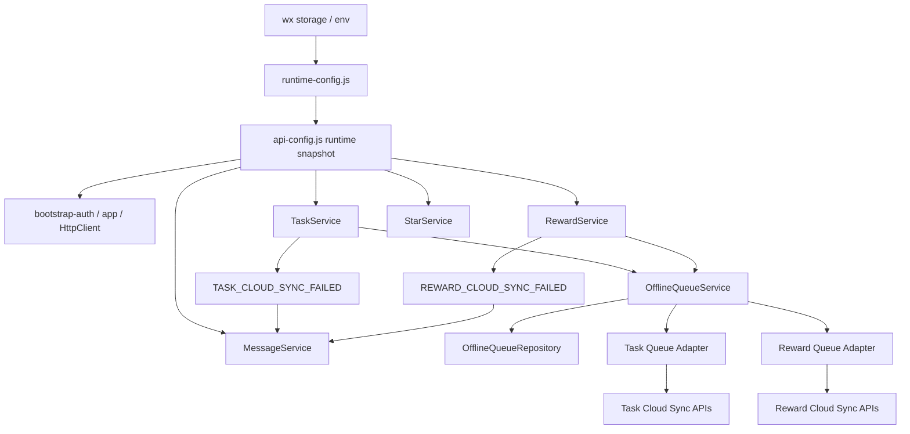

# 里程碑-19E：配置与离线队列治理 详细设计文档

> **设计状态**：✅ 已实施完成
> **创建日期**：2026-04-05
> **设计者**：GPT5 Codex
> **审核者**：项目维护者
> **预计工期**：4-6天

---

## 📋 目录

- [需求分析](#需求分析)
- [技术方案](#技术方案)
- [代码结构](#代码结构)
- [实施步骤](#实施步骤)
- [测试方案](#测试方案)
- [风险评估](#风险评估)
- [替代方案](#替代方案)

---

## 需求分析

### 功能描述

`M19A` 已把“配置与降级边界”定义为跨域根开关，`M19B/M19C/M19D` 又分别收口了任务写路径、分析读模型和消息降级语义。当前 `M19` 主线里剩下的最大未治理项，是“云端模式到底由谁正式决定”以及“本地待同步写入到底由谁正式承接”。

从真实代码看，这两个问题目前都处于“能跑，但靠约定维持”的状态。`ENABLE_API / API_BASE_URL` 仍由 `api-config.js + wx storage` 直接决定，并被启动链路、`HttpClient` 和多个服务实例在构造时展开消费；同时任务域和奖励域各自维护 `pendingSyncMeta + delete tombstone + 读取前补云 flush`，星星域又有另一套“检测本地待同步流水后跳过云端覆盖”的逻辑。它们共同构成了当前项目的离线/补云能力，但没有统一的结构化表达。

`M19E` 的目标不是把项目重做成“完整离线优先架构”，也不是引入后端任务队列，而是先把这两条横切能力正式治理清楚：

1. 运行模式配置需要有明确的持久化来源、校验规则和启动时解析语义。
2. 本地待同步写入需要有明确的统一队列模型，而不是继续散落在各个域服务里各自扫描、各自补云。

### 业务价值

- [x] 用户价值：离线或弱网场景下，本地写入的“稍后同步”语义更稳定，减少不同页面读取时行为不一致的问题。
- [x] 技术价值：把 `ENABLE_API` 根开关和 `pendingSyncMeta / tombstone` 补云链路收口为正式能力，为后续权威边界治理和故障恢复奠定基线。
- [x] 业务价值：降低跨域补云逻辑继续膨胀的风险，避免未来某个域修复离线问题时破坏其他域的既有语义。

### 功能范围

**包含**：
- ✅ 明确 API 运行模式配置的来源、校验规则、启动时解析和消费边界
- ✅ 引入统一的离线队列模型，正式承接任务域和奖励域的本地待同步写入
- ✅ 将任务/奖励现有 `pendingSyncMeta` 与删除 `tombstone` 迁移到统一队列语义
- ✅ 固化离线队列的 drain 入口、顺序、重试/退避和兼容事件语义
- ✅ 明确星星域现有“本地待同步流水”与统一离线队列的关系
- ✅ 补齐迁移策略、测试矩阵和回滚策略

**不包含**：
- ❌ 不实现“应用运行中热切换本地/云端模式”
- ❌ 不新增独立后台守护进程、系统级网络监听重放或后端任务队列
- ❌ 不在本期把星星域完整迁移到统一离线队列，只保留兼容治理说明
- ❌ 不修改消息域 `provisional` 的已定语义；消息只继续消费既有失败事件
- ❌ 不新增后端 REST 接口或数据库表结构

### 优先级

- **优先级**：P1
- **理由**：这不是当前最直接的用户显性功能，但它是 `M19` 主线剩余最关键的横切技术债。如果继续延后，任务/奖励/星星三套离线逻辑会继续分叉，后续任何“弱网一致性”修复都会越来越难评估。

---

## 技术方案

### 方案概述

`M19E` 采用“双主线收口”方案：

1. **配置治理**：把当前散落的 `ENABLE_API / API_BASE_URL` 读取逻辑收敛为“持久化配置 + 启动时快照”的正式结构，明确哪些代码只能读运行时快照，哪些代码负责写入配置来源。
2. **离线队列治理**：新增统一 `OfflineQueue` 模型、仓储和服务，正式承接任务/奖励域的 pending 写入与删除待同步动作；域服务不再各自扫描 `pendingSyncMeta + tombstone`，而是通过离线队列服务做 drain。

核心原则如下：

1. **运行模式仍然是启动时决策，而不是会话内热开关**。当前多个服务会在构造时缓存 `enableCloudStorage`，本期不强行改成运行时动态切换，只明确“配置如何落盘”和“启动时如何解析成快照”。
2. **统一离线队列先收口任务域和奖励域**。这两域已经有完整的 `pendingSyncMeta / tombstone / CLOUD_SYNC_FAILED` 事实基础，迁移收益最高。
3. **星星域先保留现有本地待同步保护逻辑**。本期只把它纳入治理文档和兼容入口，不在同一里程碑内做完整队列迁移，避免范围失控。
4. **消息域兼容事件不变**。`TASK_CLOUD_SYNC_FAILED / REWARD_CLOUD_SYNC_FAILED` 仍然保留，用于 provisional message 兜底；离线队列只改变这些事件的来源，不改变它们的对外语义。
5. **读取前 drain 暂时保留为兼容入口**。当前任务/奖励读取前会顺手补云，这个行为在本期不删除，但改为统一委托到 `OfflineQueueService.drain()`，从“分散 flush”收口为“统一 queue drain”。

### 技术选型

| 技术点 | 选择方案 | 替代方案 | 选择理由 |
|--------|---------|---------|---------|
| 运行模式配置 | `utils/runtime-config.js` + `utils/api-config.js` 启动时快照 | 把 `ENABLE_API` 直接并入 `ConfigService` | `M19A` 已明确这是权威边界根开关，不应和普通偏好配置混用 |
| 离线待同步承接 | `OfflineQueueService + OfflineQueueRepository` | 继续保留 task/reward 各自 pending 扫描 | 当前分散链路已经出现重复与边界漂移，必须正式收口 |
| 队列处理方式 | App 驱动 drain + 读取前兼容 drain | 引入后台定时器/守护线程 | 微信小程序环境不适合复杂后台机制，当前主链路也已存在读取前补云事实 |
| 域集成方式 | 队列服务 + 域适配器回调 | 队列服务直接内置任务/奖励业务逻辑 | 保持 DDD 边界，队列只负责编排，不接管业务模型 |
| 星星域处理 | 先保留现有待同步保护逻辑，队列接口预留扩展位 | 本期一起迁到统一离线队列 | 星星域已被 M16 系列权威化较深，一次性迁移风险过高 |

### DDD分层设计

**领域层（models/）**：
- [x] 新建模型：`models/offline-queue-item.js`
- [x] 修改模型：任务/奖励模型继续保留过渡期兼容镜像字段，不额外扩散星星模型
- 说明：`OfflineQueueItem` 作为离线待同步动作的统一表达，承载 domain、operation、payload、snapshot、attempt 元数据。

**服务层（services/）**：
- [x] 新建服务：`services/offline-queue-service.js`
- [x] 修改服务：`services/task-service.js`
- [x] 修改服务：`services/reward-service.js`
- [x] 修改服务：`services/star-service.js`
- [x] 修改服务：`services/message-service.js`
- [x] 修改服务：`services/service-manager.js`
- 说明：
  - `OfflineQueueService` 负责编排队列入队、去重、drain、重试退避和迁移
  - `TaskService / RewardService` 负责把本地写操作转为 queue item，并提供 adapter 执行云端同步
  - `StarService` 本期仅提供“是否存在待同步星星流水”的兼容信息，暂不完整迁移
  - `MessageService` 继续消费失败事件，不新增离线队列职责

**仓储层（repositories/）**：
- [x] 新建仓储：`repositories/offline-queue-repository.js`
- [x] 修改仓储：`repositories/task-repository.js`
- [x] 修改仓储：`repositories/reward-repository.js`
- 说明：
  - `OfflineQueueRepository` 持久化 queue item
  - `TaskRepository / RewardRepository` 保留业务实体存储，但不再作为 pending/tombstone 的最终权威来源

**适配器层（adapters/、utils/）**：
- [x] 新建工具：`utils/runtime-config.js`
- [x] 修改工具：`utils/api-config.js`
- [x] 修改工具：`utils/http-client.js`
- [x] 修改工具：`utils/app/bootstrap-auth.js`
- [x] 修改工具：`utils/app/post-login-bootstrap.js`
- 说明：
  - `runtime-config.js` 负责读写原始 API 模式配置并做校验
  - `api-config.js` 只负责把原始配置解析为当前会话快照
  - 启动链路只消费解析后的快照，不再直接访问 `wx.getStorageSync('ENABLE_API'/'API_BASE_URL')`

**表现层（pages/、components/）**：
- [x] 修改页面：首页/奖励等读取链路继续保持页面无感知，仅消费统一后的服务行为
- 说明：M19E 不新增 UI，页面层原则上不直接感知离线队列内部细节。

### 架构图



### 数据模型

```javascript
class OfflineQueueItem {
  constructor(data) {
    this.id = data.id;
    this.domain = data.domain; // task | reward
    this.entityId = data.entityId;
    this.operation = data.operation; // create | update | delete | complete | reset | required | unrequired | exchange | unclaim
    this.operationKey = data.operationKey;
    this.payload = data.payload || {};
    this.snapshot = data.snapshot || null;
    this.context = data.context || {};
    this.source = data.source || 'live_write'; // live_write | legacy_migration
    this.legacyMigrationKey = data.legacyMigrationKey || '';
    this.suppressFailureEvents = data.suppressFailureEvents === true;
    this.status = data.status || 'pending'; // pending | processing
    this.retryCount = Number(data.retryCount || 0);
    this.lastAttemptAt = Number(data.lastAttemptAt || 0);
    this.nextRetryAt = Number(data.nextRetryAt || 0);
    this.createdAt = Number(data.createdAt || Date.now());
    this.updatedAt = Number(data.updatedAt || this.createdAt);
  }
}

interface RuntimeApiConfig {
  enableApiRaw: string | boolean | null;
  baseUrlRaw: string;
  explicitlyEnabled: boolean;
  hasBaseUrl: boolean;
  enabled: boolean;
  baseUrl: string;
  source: 'env' | 'wechat_storage' | 'default_local';
}

interface OfflineQueueContext {
  familyId: string;
  loginUserId: string;
  actorUserId: string;
  actorRole: 'parent' | 'child';
  targetUserId?: string;
  exchangeUserId?: string;
}
```

### 接口设计

**新增服务接口**：

| 方法 | 说明 | 参数 | 返回值 |
|------|------|------|--------|
| `resolveRuntimeApiConfig` | 解析当前会话 API 配置快照 | `none` | `RuntimeApiConfig` |
| `persistRuntimeApiConfig` | 持久化原始 API 配置 | `{ enableApi, baseUrl }` | `{ success, requiresRestart }` |
| `enqueueMutation` | 将本地待同步动作写入离线队列 | `{ domain, entityId, operation, payload, snapshot, context }` | `OfflineQueueItem` |
| `drain` | 顺序执行离线队列中的待同步项 | `{ domains, reason, force, limit }` | `{ success, processed, skipped, failed, partial, remaining }` |
| `migrateLegacyPendingState` | 把历史 `pendingSyncMeta / tombstone` 迁入统一队列 | `none` | `{ success, migratedCount, skippedCount }` |
| `getPendingSummary` | 返回当前离线待同步概览 | `{ domain? }` | `{ total, byDomain }` |

### 运行模式治理

#### 1. 原始配置和运行时快照分离

本期把配置分成两层：

1. **原始持久化配置**  
   - 来源：`process.env` 或微信存储
   - 责任：保存用户/环境写入的原始 `ENABLE_API / API_BASE_URL`
   - 访问入口：`utils/runtime-config.js`

2. **运行时快照**  
   - 来源：启动时由原始配置解析得到
   - 责任：供 `HttpClient / bootstrap / 各服务` 在当前会话中读取
   - 访问入口：`utils/api-config.js`

这样可以避免两类问题：

- `app.js` 继续直接读写 `wx.getStorageSync('ENABLE_API')`
- 业务服务把普通偏好配置和运行模式根开关混在一起

配置解析口径固定为：

1. `process.env` 显式值优先
2. 微信存储中的 `ENABLE_API / API_BASE_URL` 次之
3. 两者都缺失时回落到 `default_local`

`API_BASE_URL` 的校验规则在 `runtime-config.js` 中集中定义：

- 空值或全空白字符串视为未配置
- 非 `http://` 或 `https://` 开头的值视为非法
- 非法地址不会抛出热错误，而是解析为 `enabled=false、baseUrl=''`，并记录告警日志

即使只是日志用途，`app.js` 里的环境检查也改为通过 `runtime-config.js` / `api-config.js` 取值，避免继续保留“顺手直接读 wx storage”的入口。

`ConfigService` 继续只负责 `config_` 命名空间下的普通偏好和系统标记，不负责 `ENABLE_API / API_BASE_URL`。这两个键属于运行模式根开关，必须留在独立的 runtime config 入口中治理。

#### 2. 热切换不作为本期目标

当前多个服务在构造时缓存 `enableCloudStorage = API_CONFIG.ENABLE_API`。如果在本期强行支持“运行中改开关即时生效”，就必须同步重建服务实例、刷新 token、重新解释本地待同步状态，改动面过大。

因此本期明确：

- 配置写入可以发生在运行中
- 但**生效时机按下一次冷启动 / 显式重启应用**处理
- 设计文档中要把这一点写成正式语义，避免后续被误认为“运行时热切换能力”

### 离线队列治理

#### 1. 当前问题

当前离线补云的事实状态是：

- 任务域：`pendingSyncMeta + taskDeleteTombstones + _flushPendingTaskSyncs()`
- 奖励域：`pendingSyncMeta + rewardDeleteTombstones + _flushPendingRewardSyncs()`
- 星星域：`syncedToCloud !== true` 的流水保护 + `refreshStarsFromCloud()` 跳过覆盖

这会带来三个问题：

1. 每个域都要自己决定“什么时候 flush”
2. 删除动作和普通变更动作使用两套不同承载结构
3. `MessageService`、读取节流、启动链路等横切能力都要和多个域内实现同时耦合

#### 2. 统一队列的承接范围

统一离线队列本期先覆盖：

- 任务：
  - create / update / delete
  - complete / reset
  - required / unrequired
- 奖励：
  - create / update / delete
  - exchange / unclaim

星星域本期不做完整迁移，只做两件事：

1. 把“本地待同步星星流水会阻止云端覆盖”写成正式兼容规则
2. 为后续可能的队列扩展预留接口，不再把星星域遗漏在设计之外

#### 3. 队列入队规则

当任务/奖励在云端模式下发生写操作且无法立即走通正式 API 时：

1. 先完成本地持久化
2. 生成 `OfflineQueueItem`
3. 同步保留业务实体上的过渡期兼容保护三件套：`pendingSyncMeta`、`syncedToCloud=false`、本地 `modifyTime` 保护，供过渡期页面和旧逻辑使用
4. 继续发出既有失败事件：
   - `TASK_CLOUD_SYNC_FAILED`
   - `REWARD_CLOUD_SYNC_FAILED`

这样可以保证：

- 本地数据不丢
- `MessageService` 现有 provisional 兜底语义不变
- 队列成为新的正式待同步承载

补充约束：

- `context` 必须至少包含 `familyId + loginUserId + actorUserId + actorRole`
- 涉及任务归属或奖励兑换对象时，额外记录 `targetUserId / exchangeUserId`
- 队列隔离的判断键是“登录会话上下文”，不是当前页面正在查看的 `currentUser`
- 这保证同一设备切换查看对象时不会错误消费别的登录会话遗留队列
- 对历史迁移导入的 legacy item，允许 `loginUserId` 为空；新写入的 live item 则必须写全上述上下文字段

#### 4. 队列冲突消解规则

`operationKey` 去重只能解决“完全同语义重复入队”，还不足以覆盖同一实体的连续写入。本期补充同实体折叠规则如下：

| 连续动作 | 结果 |
|----------|------|
| `create -> update` | 折叠为同一条 `create`，把最新字段并入 `payload/snapshot` |
| `create -> delete` | 若实体从未成功上云，则折叠为 `no-op` 并移除队列项；若该实体原本已存在云端，则保留 `delete` |
| `update -> update` | 合并为最后一条 `update` |
| `update -> complete` | 保留两条，按顺序执行；避免把状态动作错误吞并到字段更新里 |
| `complete -> reset` | 折叠为最后一条 `reset` |
| `required -> unrequired` | 折叠为最后一条 `unrequired` |
| `exchange -> unclaim` | 保留两条，按顺序执行；`unclaim` 不能吞并掉已发生的兑换语义 |
| `update/complete/reset/required/unrequired/exchange/unclaim -> delete` | 若该实体已上云，最终保留 `delete`；若仅本地存在，则折叠为 `no-op` |

说明：

- `no-op` 不是持久化状态，而是入队阶段直接移除或不创建 queue item
- “实体是否已上云”通过现有业务实体上的 `syncedToCloud / cloudId / pendingSyncMeta` 兼容信息判断
- 消解逻辑统一封装在 `OfflineQueueService.enqueueMutation()`，域服务不各自实现

#### 5. 删除动作统一入队，不再依赖独立 tombstone

删除动作本期不再由独立 `taskDeleteTombstones / rewardDeleteTombstones` 作为正式承载，而是统一转换为：

- `domain = task/reward`
- `operation = delete`
- `entityId = 被删实体 ID`
- `snapshot/context = 删除时需要的最小补云上下文`

历史 tombstone 数据通过迁移步骤导入 queue item，迁移完成后旧 tombstone 只保留兼容读取窗口，不再作为主路径写入目标。

#### 6. drain 规则

`OfflineQueueService.drain()` 的规则：

1. 按 `createdAt` 顺序串行执行
2. live item 只处理与当前 `familyId + loginUserId` 匹配的队列项；上下文不匹配的项标记为 `skipped`
3. legacy migration item 若缺少 `loginUserId`，则退化为按 `familyId + actorUserId` 兼容匹配；仍无法确认归属时保持 `pending` 并记告警，不做猜测性回放
4. 对失败项记录：
   - `retryCount`
   - `lastAttemptAt`
   - `nextRetryAt`
5. 未到 `nextRetryAt` 的项在普通 drain 中跳过；`force=true` 才忽略退避窗口
6. 退避公式固定为：`nextRetryAt = lastAttemptAt + min(max(1, retryCount) * 10000, 300000)`
7. 首次入队时可以触发 provisional 兜底事件；后续重试失败不重复发同一条失败消息
8. 单个 item 执行失败后不终止整轮 drain；后续 item 继续按顺序尝试，最终通过 `failed/partial/remaining` 汇总结果

单次 drain 上限：

- `post_login_bootstrap`：默认 `limit=50`
- `before_task_read`：默认 `limit=10`
- `before_reward_read`：默认 `limit=10`
- `force=true` 只忽略退避窗口，不自动取消 `limit`

返回语义：

- 当 `processed + skipped + failed < totalMatched` 时，返回 `partial=true`
- `remaining` 表示本次未处理完且仍满足当前会话上下文的剩余数量
- 读取前 drain 遇到 `partial=true` 不视为错误，允许页面继续读取，剩余项留给后续 bootstrap 或下一次读取再处理
- 之所以允许继续读取，是因为过渡期仍保留业务实体上的兼容保护三件套：`pendingSyncMeta` 镜像、`syncedToCloud=false`、本地 `modifyTime` 保护
- 对仍未 drain 完成的实体，后续云端刷新不能直接覆盖本地版本；任务域继续沿用 `modifyTime` 保护，奖励域继续沿用 `syncedToCloud !== true` 的本地保留规则

#### 7. drain 触发时机与初始化顺序

本期正式 drain 入口：

1. `post-login-bootstrap` 成功后
2. 任务云读取前
3. 奖励云读取前

说明：

- 这沿用了当前“读取前顺手 flush”的兼容事实
- 但逻辑上不再是域服务私有扫描，而是统一交给 `OfflineQueueService`
- 暂不在本期新增复杂定时器或后台网络恢复监听

启动顺序必须锁定为：

1. `serviceManager.initialize()` 创建 `OfflineQueueService`
2. `OfflineQueueService.initialize()`，内部依次完成 `loadFromStorage + migrateLegacyPendingState + ready`
3. 再允许任务/奖励首次云端读取

这样可以避免“迁移尚未完成，读取前已经开始走新 drain 或旧 flush”的半迁移窗口。

#### 8. 迁移策略

M19E 落地时必须考虑已经存在的本地 pending 数据：

1. 扫描任务实体上的 `pendingSyncMeta`
2. 扫描奖励实体上的 `pendingSyncMeta`
3. 扫描历史 `taskDeleteTombstones`
4. 扫描历史 `rewardDeleteTombstones`
5. 按统一格式迁移到 `offlineQueueData`
6. 写入一个迁移完成标记，避免重复迁移

迁移补充语义：

- 迁移写入的 queue item 统一标记 `source=legacy_migration`
- 历史导入必须设置 `suppressFailureEvents=true`，禁止再次发出 `TASK_CLOUD_SYNC_FAILED / REWARD_CLOUD_SYNC_FAILED`
- 这样可以避免升级后把旧 pending 数据重新解释成一轮新的 provisional message
- 迁移幂等键使用 `legacyMigrationKey`，格式为 `domain:sourceType:entityId[:operation]`
- 若迁移过程中中断，下一次启动允许重跑；已存在相同 `legacyMigrationKey` 的项直接跳过
- 旧 `pendingSyncMeta / tombstone` 在确认成功写入 queue 后才允许清理；迁移窗口内保留只读兼容，不再新增写入
- 历史 `pendingSyncMeta` 若缺少 `loginUserId`，迁移时不伪造该字段；queue item 标记为 legacy compat item，并在 drain 时走兼容匹配规则
- 若 legacy item 既无法从 `familyId` 也无法从 `actorUserId/targetUserId/exchangeUserId` 推断到当前会话，则保留为未消费状态并输出诊断日志，等待后续用户重新触发相关业务或人工清理

双写退出条件：

- `pendingSyncMeta` 兼容镜像只在 M19E 过渡期存在
- 只有当任务域、奖励域、启动链路和读取前 drain 全部切到 queue，且 M19E 回归验证通过后，才允许在后续里程碑中移除双写
- M19E 本身不删除兼容字段读取，但必须把它从“正式承载”降级为“兼容镜像”
- 在双写退出前，`pendingSyncMeta` 不能单独存在，必须和 `syncedToCloud=false`、本地 `modifyTime` 保护一起维持读路径兼容

迁移后的过渡规则：

- 队列是正式待同步来源
- 实体上的过渡期兼容保护三件套保留一段兼容窗口：`pendingSyncMeta`、`syncedToCloud=false`、本地 `modifyTime` 保护
- 旧 `_flushPendingTaskSyncs / _flushPendingRewardSyncs` 改为委托 `OfflineQueueService.drain()`

---

## 代码结构

### 文件变更清单

**新增文件**：
- `docs/design/milestone-19e-config-offline-queue-governance.md` - M19E 设计文档
- `utils/runtime-config.js` - 运行模式原始配置读写与校验
- `models/offline-queue-item.js` - 离线队列项模型
- `repositories/offline-queue-repository.js` - 离线队列持久化
- `services/offline-queue-service.js` - 队列编排、迁移、drain、重试
- `test/utils/runtime-config.test.js` - 配置治理测试
- `test/services/offline-queue-service.test.js` - 队列核心测试

**修改文件**：
- `utils/api-config.js` - 改为消费 `runtime-config.js`，只生成运行时快照
- `app.js` - 不再直接读取原始 API 存储键
- `utils/app/bootstrap-auth.js` - 使用统一运行时快照和 queue drain 入口
- `utils/app/post-login-bootstrap.js` - 增加统一离线队列 drain
- `services/service-manager.js` - 注入 `OfflineQueueService`
- `services/task-service.js` - 移除分散 pending/tombstone 主路径，改为队列接入
- `services/task-service/task-write.js` - 写失败后改为入统一队列
- `services/task-service/task-sync.js` - 读取前 flush 改为队列 drain
- `services/reward-service.js` - 写失败和读取前补云改为队列接入
- `services/star-service.js` - 固化本地待同步星星流水兼容规则
- `services/message-service.js` - 保持失败事件兼容，必要时仅补测试/注释
- `test/services/task-service*.test.js` - 任务域离线队列接入测试
- `test/services/reward-service*.test.js` - 奖励域离线队列接入测试

### 核心代码结构

```javascript
// utils/runtime-config.js
function readPersistedRuntimeApiConfig() {
  // 统一读取 env / wx storage 原始值
}

function resolveRuntimeApiConfig() {
  // 统一解析 enabled/baseUrl/source
}

// services/offline-queue-service.js
class OfflineQueueService {
  async initialize() {
    await this.repository.loadFromStorage();
    await this.migrateLegacyPendingState();
  }

  async enqueueMutation(input) {
    // 去重、冲突消解、持久化 queue item
  }

  async drain(options = {}) {
    // 按当前登录上下文过滤，顺序执行 pending item，按 adapter 分发
  }
}

// task/reward adapter
async function executeTaskQueueItem(item) {
  // 复用现有云端同步函数
}
```

### 关键函数

**函数1**：`resolveRuntimeApiConfig`
- **输入**：none
- **输出**：`RuntimeApiConfig`
- **职责**：把原始 API 配置解析为当前会话可消费的运行时快照
- **依赖**：`wx storage / process.env`

**函数2**：`enqueueMutation`
- **输入**：`{ domain, entityId, operation, payload, snapshot, context }`
- **输出**：`OfflineQueueItem`
- **职责**：把本地待同步动作写入统一离线队列，并做去重/冲突消解/上下文封装
- **依赖**：`OfflineQueueRepository`

**函数3**：`drain`
- **输入**：`{ domains, reason, force, limit }`
- **输出**：`{ success, processed, skipped, failed, partial, remaining }`
- **职责**：按当前登录上下文顺序执行离线队列项并更新重试状态
- **依赖**：`Task/Reward queue adapters`

**函数4**：`migrateLegacyPendingState`
- **输入**：none
- **输出**：`{ success, migratedCount, skippedCount }`
- **职责**：把历史 `pendingSyncMeta / tombstone` 静默迁移到统一队列，且保证幂等
- **依赖**：`TaskRepository`, `RewardRepository`, `OfflineQueueRepository`

---

## 实施步骤

### 第0步：补齐现状基线测试（预计4小时）

- [x] **任务**：为现有任务/奖励 pendingSyncMeta、tombstone、读取前 flush 行为补齐基线测试
- [x] **验证**：在未引入统一队列前，现有离线语义被测试固化
- [x] **依赖**：当前 M19D 主干已稳定

**实施要点**：
1. 固化任务域 create/update/delete/status/reset/required/unrequired 的待同步行为。
2. 固化奖励域 create/update/delete/exchange/unclaim 的待同步行为。
3. 固化消息 provisional 继续由失败事件驱动的兼容语义。

---

### 第1步：运行模式配置治理（预计6小时）

- [x] **任务**：新增 `runtime-config.js`，收敛原始 API 配置读写与校验
- [x] **验证**：`api-config.js` 只负责生成运行时快照；运行时代码不再直接读 `wx` 原始键
- [x] **依赖**：现有 `api-config.js`、`app.js`、`bootstrap-auth.js`

**实施要点**：
1. 区分“原始持久化配置”和“运行时快照”。
2. 保持当前显式配置才启用 API 的口径不变。
3. 明确配置写入后需要下次启动生效，不做热切换。
4. `app.js` 的日志性环境检查也走统一入口，不保留直接 `wx.getStorageSync` 读取。
5. `ConfigService` 不接管 `ENABLE_API / API_BASE_URL`。

---

### 第2步：统一离线队列核心能力（预计8小时）

- [x] **任务**：新增 `OfflineQueueItem / OfflineQueueRepository / OfflineQueueService`
- [x] **验证**：能完成 queue item 持久化、去重、退避和按 adapter drain
- [x] **依赖**：第0步基线测试已存在

**实施要点**：
1. 队列项要能覆盖普通变更和删除变更两类场景。
2. 首次失败入队与后续重试失败要区分，避免重复 provisional。
3. 迁移函数必须能导入历史 `pendingSyncMeta / tombstone`。
4. 上下文过滤、静默迁移、退避公式和 drain limit 都要先用测试固化。

---

### 第3步：任务域接入统一队列（预计6小时）

- [x] **任务**：把任务域的离线补云主路径切到统一队列
- [x] **验证**：任务写失败后由 queue 接管，读前 flush 改为 queue drain
- [x] **依赖**：第2步队列核心能力完成

**实施要点**：
1. `taskDeleteTombstones` 不再作为主路径新写入。
2. `_flushPendingTaskSyncs` 改为委托 queue。
3. 继续兼容既有失败事件与过渡期兼容保护三件套：`pendingSyncMeta`、`syncedToCloud=false`、本地 `modifyTime` 保护。
4. 优先验证 `create/update/delete/complete/reset/required/unrequired` 的冲突消解矩阵。

---

### 第4步：奖励域接入统一队列（预计4小时）

- [x] **任务**：把奖励域的离线补云主路径切到统一队列
- [x] **验证**：奖励写失败后由 queue 接管，读前 flush 改为 queue drain
- [x] **依赖**：第3步任务域已稳定

**实施要点**：
1. `rewardDeleteTombstones` 不再作为主路径新写入。
2. `_flushPendingRewardSyncs` 改为委托 queue。
3. 继续兼容 `REWARD_CLOUD_SYNC_FAILED` 事件与奖励实体上的过渡期兼容保护三件套：`pendingSyncMeta`、`syncedToCloud=false`、本地 `modifyTime` 保护。
4. 单独验证 `create/update/delete/exchange/unclaim` 的冲突消解与静默迁移。

---

### 第5步：启动链路与星星域兼容治理（预计6小时）

- [x] **任务**：把 post-login/bootstrap 的补云入口统一接入 queue，并固化星星域兼容规则
- [x] **验证**：应用启动后能统一 drain；星星域不被错误纳入 task/reward 队列
- [x] **依赖**：第4步完成

**实施要点**：
1. `serviceManager.initialize()` 后必须先完成 `OfflineQueueService.initialize()`。
2. `post-login-bootstrap` 负责应用级 drain，并在首次 task/reward 云读取前保证 queue ready。
3. 星星域保留 `hasPendingLocalStarRecords()` 规则并写入正式设计/测试。
4. 不引入后台定时器，保持微信环境下的可控复杂度。

---

### 第6步：文档、测试与真实场景验证（预计6小时）

- [x] **任务**：补齐设计回写、API 文档、CHANGELOG/ROADMAP 和手工验证清单
- [x] **验证**：定向测试、模拟器手工验证、真实链路日志复核通过
- [x] **依赖**：前 5 步已完成

**实施要点**：
1. 设计文档要回写“迁移策略”“兼容窗口”“双写退出条件”。
2. 服务文档要明确 queue 是待同步正式承载，过渡期兼容保护依赖三件套：`pendingSyncMeta`、`syncedToCloud=false`、本地 `modifyTime` 保护。
3. 手工验证必须覆盖离线写入、重启后恢复、重新联网 drain、上下文不匹配跳过。

---

## 测试方案

### 实际验证结果

- 全量前端测试通过：`npm test`
  - 结果：`73 suites / 1686 tests` 全绿
- M19E 关键定向测试通过：
  - `npx jest test/utils/runtime-config.test.js test/utils/api-config.test.js test/services/offline-queue-service.test.js`
  - `npx jest test/app/bootstrap-services.test.js test/app/post-login-bootstrap.test.js`
  - `npx jest test/services/task-service.test.js test/services/reward-service.test.js`
- 模拟器与日志复核通过：
  - 本地模式：启动、首页、奖励页、消息页主链路正常
  - 云端模式：登录后离线队列补偿、首页、奖励页、消息页主链路正常
  - 历史问题复核：`user-switcher` 类型告警消失，`currentUser` 占位态误报警告已消失

### 单元测试

| 测试对象 | 场景 | 断言 |
|----------|------|------|
| `runtime-config.js` | 无配置 / 只开 ENABLE_API / 只配 URL / 完整配置 / 非法 URL | 运行时快照解析结果正确，非法地址回落本地模式 |
| `offline-queue-service.js` | 入队、去重、退避、drain、迁移、partial drain | queue 状态与输出正确 |
| `offline-queue-service.js` | `create->update` / `create->delete` / `update->update` / `update->complete` / `complete->reset` / `required->unrequired` / `exchange->unclaim` / `delete` 折叠 | 冲突消解矩阵符合设计 |
| `offline-queue-service.js` | 上下文不匹配 | `familyId/loginUserId` 不匹配的项被跳过，不会误消费 |
| `offline-queue-service.js` | legacy item 缺少 `loginUserId` | 退化为 `familyId + actorUserId` 兼容匹配；无法确认归属时不回放 |
| `offline-queue-service.js` | 迁移重跑 / 中途重启 | `legacyMigrationKey` 幂等生效，不重复入队 |
| `task-service` | 写失败后入队 | 任务本地保存、queue item 创建、失败事件触发 |
| `reward-service` | 删除/兑换失败后入队 | queue item 与兼容事件正确 |
| `message-service` | queue 入队后继续接收到失败事件 | provisional 行为不回归 |
| `message-service` | 历史 pending 迁移到 queue | 静默迁移不会重复生成 provisional |
| `task-service/reward-service` | partial drain 后继续读取 | `pendingSyncMeta + syncedToCloud + modifyTime` 兼容保护仍然成立 |
| `star-service` | 本地待同步星星流水存在时刷新云端 | 继续跳过覆盖 |

### 集成测试

| 测试对象 | 场景 | 断言 |
|----------|------|------|
| 启动链路 | 存在历史 pendingSyncMeta/tombstone | 初始化时迁移到 queue，且先于首个 task/reward 云读取完成 |
| 启动链路 | 历史 pending 数据缺少 `loginUserId` | 迁移为 legacy compat item，后续 drain 按兼容规则处理 |
| 任务云读取 | 读取前触发 queue drain | drain 成功后再读取正式结果 |
| 奖励云读取 | 读取前触发 queue drain | drain 成功后再读取正式结果 |
| 奖励删除迁移 | 存在 `rewardDeleteTombstones` | 迁移后生成正确 delete queue item |
| 部分成功 drain | 多条 queue item 中部分失败 | 后续项可继续处理，返回 `partial/failed/remaining` 正确 |
| partial 后继续读取 | 仍有未 drain 的 pending item | 云端刷新不会覆盖本地 pending 实体 |
| 重启恢复 | 本地有 queue item，重启后重新进入 | queue 数据仍存在并可继续 drain |

### 手工验证清单

1. 云端模式下创建/更新/删除任务时断网，确认本地写入成功并进入待同步。
2. 重新联网后进入首页/任务页，确认 queue 自动 drain，任务与消息状态收敛。
3. 奖励创建/兑换/取消兑换断网后，确认本地结果保留并可在后续 drain 成功。
4. 重启应用后，历史 pending 数据仍可恢复并继续同步。
5. 切换当前查看孩子但不切换登录会话，确认 queue 不会因 `currentUser` 变化而误跳过或误回放。
6. 同设备切换到另一登录用户/家庭后，确认上下文不匹配的 queue item 被跳过。
7. 本地存在未同步星星流水时，确认云端刷新不会错误覆盖本地记录。

### 覆盖率目标

- 最低要求：85%
- 推荐目标：90%

---

## 风险评估

| 风险 | 影响 | 概率 | 缓解措施 |
|------|------|------|----------|
| 统一队列迁移时遗漏历史 `pendingSyncMeta / tombstone` | 高 | 中 | 先补基线测试，再做迁移工具与幂等迁移标记 |
| 删除动作从 tombstone 切换到 queue 后出现重复删除或漏删 | 高 | 中 | delete item 单独建模，迁移后旧 flush 全部委托 queue |
| 失败事件来源变化导致 provisional message 重复或缺失 | 高 | 中 | 明确“仅首次入队触发失败事件”，补 message 回归测试 |
| 同设备多家庭/多登录切换时误回放他人 queue item | 高 | 中 | queue item 记录 `familyId + loginUserId`，drain 时按会话过滤 |
| 启动阶段先读云再迁移 queue，导致出现半迁移窗口 | 高 | 中 | 锁定 `initialize -> migrate -> first read` 顺序，并补启动链路测试 |
| 运行模式配置治理被误解为“支持热切换” | 中 | 中 | 在设计和实现中明确“下一次启动生效” |
| 星星域未完整迁移导致口径不一致 | 中 | 中 | 在本期正式写明兼容规则和非目标，避免隐形遗漏 |
| 队列 drain 挂在读取前导致页面体感变慢 | 中 | 中 | 保持串行但可跳过退避未到项，并优先在 post-login bootstrap 预先 drain |
| `pendingSyncMeta` 双写长期保留，导致永久双轨复杂度 | 中 | 中 | 在设计中明确其仅为过渡期兼容镜像，并设置后续移除条件 |
| task/reward 同步切换过大导致回归面失控 | 中 | 中 | 实施步骤拆为先 task 后 reward，分阶段验收 |

---

## 替代方案

### 方案A：只做配置治理，不做统一离线队列

**优点**：
- 范围小，实现快
- 不会动到任务/奖励现有补云主路径

**缺点**：
- 离线补云的最大结构性问题完全保留
- `pendingSyncMeta / tombstone / provisional` 的跨域耦合继续存在

**结论**：
- 不采用。`M19E` 名称里已经明确包含离线队列治理，不能只做半套。

### 方案B：把任务/奖励/星星三域一次性迁到完整统一队列

**优点**：
- 结构最整齐
- 后续离线能力扩展更统一

**缺点**：
- 星星域已经叠加了到期结算、family summary、authority sync 等复杂语义
- 本期改动面过大，极易把 `M16` 与 `M19` 既有稳定链路一起拖进来

**结论**：
- 当前不采用。M19E 先完成配置治理 + task/reward 队列统一，星星域保留兼容治理说明和后续扩展位。
- 当 task/reward 统一队列稳定、且后续明确需要把星星域离线 replay 也纳入同一模型时，再重新评估该方案。

### 方案C：引入后端离线重放接口或后台作业系统

**优点**：
- 服务端可以统一重试与幂等控制

**缺点**：
- 需要新增后端接口/表结构/运维语义
- 与当前小程序前端本地持久化事实不匹配，超出本期范围

**结论**：
- 当前不采用。本期只做前端侧配置与离线队列治理，不扩大为后端基础设施重构。

---

## 审核要点自检

- [x] 已承接 M19A 对“配置与降级边界”的原始审计结论
- [x] 已明确 M19E 的包含范围与非目标，避免拖成全域重构
- [x] 已明确任务/奖励统一离线队列与星星域兼容保留的边界
- [x] 已明确消息 provisional 语义继续保持兼容
- [x] 已给出迁移策略、测试矩阵和回滚考量

---

**最后更新**：2026-04-05（已实施完成并通过回归）
