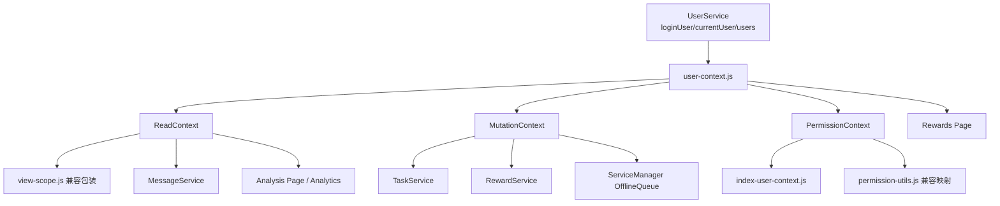

# 里程碑-20A：用户上下文与权限边界治理 详细设计文档

> **设计状态**：🟢 审核通过
> **创建日期**：2026-04-05
> **设计者**：GPT5 Codex
> **审核者**：项目维护者
> **预计工期**：4-6天

---

## 📋 目录

- [需求分析](#需求分析)
- [技术方案](#技术方案)
- [代码结构](#代码结构)
- [实施步骤](#实施步骤)
- [测试方案](#测试方案)
- [风险评估](#风险评估)
- [替代方案](#替代方案)

---

## 需求分析

### 功能描述

`M19A` 已明确把“用户上下文与权限边界”列为横切基础问题：很多看似分散在任务、奖励、消息、分析页里的争议，根因其实不是单一业务规则写错，而是不同模块对“当前是谁、谁在看、谁在操作、谁是目标孩子、当前应该读 user 还是 family”这组语义各自推导、各自兜底。

当前代码并不是完全没有上下文模型，而是已经存在多套并行模型：

- `services/user-service.js` 持有 `loginUser / currentUser`
- `utils/view-scope.js` 推导消息与分析页读范围
- `services/task-service.js` / `services/reward-service.js` 各自推导 `actor / target / family`
- `services/service-manager.js` 为离线队列再推一套上下文
- `services/message-service.js` 重新推导默认 `scope`
- `pages/rewards/rewards.js` 再单独推导“当前有效孩子”和“奖励归属人”

这些逻辑多数能工作，但它们并不是同一个正式模型的不同投影，而是多份相似但不完全一致的规则副本。`M20A` 的目标，就是把这层语义正式治理为单一用户上下文模型，并让任务、奖励、消息、分析和离线队列都改为复用同一套解析结果。

### 业务价值

- [x] 用户价值：降低多孩子、多视角、家长代操作场景下“页面看的是一种身份、写入记的是另一种身份”的隐性错误。
- [x] 技术价值：把 `loginUser / currentUser / actor / target / family / scope` 收口为正式模型，为后续 `M20B`、`M20E` 的边界治理和存量清理提供统一基线。
- [x] 业务价值：减少同类权限争议在不同域反复出现，后续新增页面或服务时可以直接复用统一解析，不再重复造上下文逻辑。

### 功能范围

**包含**：
- ✅ 定义统一的用户上下文术语、字段和判定规则
- ✅ 明确 `loginUser`、`viewUser`、`actorUser`、`subjectUser`、`familyId`、`readScope` 的正式边界
- ✅ 引入单一上下文解析入口，统一服务层和页面层的上下文推导
- ✅ 收口任务域、奖励域、消息域、分析页、离线队列的上下文使用方式
- ✅ 为现有 `view-scope.js`、`currentUser` 等保留兼容包装，避免一次性大爆炸改名
- ✅ 补齐上下文矩阵测试，锁定家长视角、孩子视角、多孩子、无家庭等关键场景

**不包含**：
- ❌ 不重做后端鉴权模型或 JWT 结构
- ❌ 不在本期重构用户切换 UI 或家庭成员管理 UI
- ❌ 不新增后端 REST 接口
- ❌ 不把星星域、消息域、任务域全部做大规模业务重写，本期重点是“统一上下文解析与使用边界”
- ❌ 不清理所有历史兼容代码；兼容删减留给 `M20E`

### 优先级

- **优先级**：P1
- **理由**：这不是一个独立显性功能，但它已经是多个业务分歧的共同根因。继续在现有分散模型上增量修修补补，只会让“谁在看、谁在操作、谁是目标”的语义继续漂移。

---

## 技术方案

### 方案概述

`M20A` 采用“用户会话状态保留在 `UserService`，统一上下文解析收口到单一 resolver，并把权限入口显式纳入同一正式来源”的方案。

核心思想如下：

1. `UserService` 继续负责保存真实会话事实，例如 `loginUser`、`currentUser`、用户列表缓存和切换行为。
2. 新增正式的用户上下文解析模块，负责把这些原始事实解析成一份标准化 `UserContextSnapshot`。
3. 所有读路径、写路径和权限入口都改为基于这份标准化快照继续推导，而不是每个服务再自己拼一套 `actor / target / scope / familyId / readonly / permissions`。
4. 现有 `view-scope.js`、`_getOperatorContext()`、奖励页孩子选择 helper、首页 `isReadonlyView / canManageMembers / userPermissions` 等入口不立即全部删除，但会改成兼容包装或直接委托统一 resolver。

本期的关键不是“换一个新名字”，而是把下面这件事定成正式规则：

- `loginUser`：设备真实登录者，代表真实操作人
- `viewUser`：当前页面查看视角，由用户切换器决定
- `managementActor`：管理类动作的操作者，默认锚定 `loginUser`
- `executionActor`：执行类动作在业务记述上的操作者，允许锚定当前孩子视角
- `subjectUser`：本次读/写实际作用到的业务主体，通常是当前查看的孩子或显式传入的目标孩子
- `familyId`：当前上下文所属家庭锚点，优先来自 `loginUser`
- `readScope`：当前读模型使用 `user` 还是 `family`
- `permissionContext`：页面权限、只读态、成员管理能力的正式来源

一旦这组边界固定，任务、奖励、消息、分析、离线队列就都不应再各自重新猜测。

### 现状问题矩阵

| 模块 | 当前做法 | 主要问题 |
|------|---------|---------|
| `user-service.js` | 定义 `loginUser / currentUser` | 只提供会话状态，不负责统一解释执行态和读范围态 |
| `view-scope.js` | 只处理消息/分析读范围 | 只能解决 read-side scope，无法表达 actor/subject |
| `task-service.js` | `_getOperatorContext(targetUserId, mode)` | 当前已存在 `manage/execute` 分流，但没有被提升为正式共享模型 |
| `reward-service.js` | 自己维护 `_getOperatorContext()` | 与任务域相似但不完全一致，规则副本化 |
| `service-manager.js` | `_resolveOfflineQueueContext()` | 离线队列再推一套 actor/target，上下游不保证一致 |
| `message-service.js` | `_resolveScopeOptions()` | scope 默认规则与页面已有解析逻辑重复 |
| `pages/rewards/rewards.js` | `_getEffectiveChildUserId()` / `_getRewardOwnerUserId()` | 页面层自己处理 subject/owner，长期容易偏离服务层契约 |
| `pages/index/modules/index-user-context.js` / `pages/index/index.js` | 自己推 `isReadonlyView / canManageMembers / userPermissions / lastActiveChildId` | 权限边界仍散落在首页模块与工具层，不是统一正式来源 |
| `utils/permission-utils.js` | 只接收 `userRole` 做角色权限映射 | 无法表达“家长登录但处于孩子视角”的只读态和成员管理态 |

### 统一术语与正式模型

#### 1. 会话态

会话态仍然由 `UserService` 维护，但对外正式命名改为：

- `loginUser`：设备实际登录者，整个应用会话内稳定
- `currentUser`：当前切换器选中的用户，作为原始输入继续保留
- `viewUser`：统一 resolver 对外暴露的正式查看对象，语义为 `currentUser || loginUser`

`currentUser` 保留是为了兼容旧代码；从 `M20A` 开始，新的设计文档和新代码都不再直接把 `currentUser` 当成最终业务语义，而是优先消费 `viewUser`。

#### 2. 读范围态

读路径统一只认 `ReadContext`：

```javascript
{
  scope: 'user' | 'family',
  subjectUserId: string | null,
  childUserIds: string[],
  familyId: string | null
}
```

规则固定为：

1. 孩子视角：`scope='user'`，`subjectUserId=viewUser.id`
2. 家长视角且有 `familyId`：`scope='family'`，`subjectUserId=null`，`childUserIds=活跃孩子集合`
3. 无家庭回退：`scope='user'`，`subjectUserId=viewUser.id`

这套规则同时服务消息和分析页；差别只在于不同调用方是否需要 `childUserIds`。

#### 3. 写入执行态

写路径统一只认 `MutationContext`：

```javascript
{
  loginUserId: string | null,
  managementActorUserId: string | null,
  managementActorRole: 'parent' | 'child' | 'system',
  executionActorUserId: string | null,
  executionActorRole: 'parent' | 'child' | 'system',
  subjectUserId: string | null,
  targetUserId: string | null,
  familyId: string | null,
  operationMode: 'manage' | 'execute',
  viewUserId: string | null,
  viewUserRole: 'parent' | 'child' | null
}
```

核心规则：

1. `managementActorUserId` 默认锚定 `loginUser`，用于创建、编辑、删除、奖励维护等管理类动作。
2. `executionActorUserId` 采用现有正式契约：
   - `mode='execute'` 且当前 `viewUser` 是孩子时，优先取 `viewUser`
   - 否则回退到 `loginUser`
   - 这样可以继续承接当前“共享设备切到孩子视角后，执行类动作按孩子身份记述”的正式契约
3. 对外兼容字段 `actorUserId / actorRole` 不直接消失，而是按 `operationMode` 投影：
   - `manage` 动作投影 `managementActor*`
   - `execute` 动作投影 `executionActor*`
4. `subjectUserId` 代表本次业务作用对象，优先级为：
   - 显式传入的 `targetUserId`
   - 当前 `viewUser` 为孩子时的 `viewUser.id`
   - 孩子设备登录自身时的 `loginUser.id`
   - 否则为 `null`
5. `targetUserId` 作为现有前后端契约兼容字段，默认等于 `subjectUserId`
6. `familyId` 优先取 `loginUser.familyId`，避免视角切换时家庭锚点漂移

补充约束：

- `subjectUserId === null` 不表示“没有目标主体”，而是表示 resolver 不做隐式猜测，必须由调用方显式提供目标孩子
- 家长处于自己视角时，首页、任务编辑页、奖励页等现有页面如果本来就依赖 `lastActiveChildId / targetUserId / effectiveChildId` 选中孩子，则继续由页面显式传入 `targetUserId`
- resolver 负责统一规则，不负责替页面臆造“默认第一个孩子”这类带 UX 偏好的选择

这意味着从正式语义上，`currentUser/viewUser` 不再直接等同于“唯一 actor”。  
家长切到孩子视角时：

- `viewUser` 仍是孩子
- `subjectUserId` 默认是孩子
- 管理类动作：`managementActorUserId=家长`
- 执行类动作：`executionActorUserId=孩子`

这样才能同时承接现有两条正式契约：

1. 创建/编辑/删除等管理动作按家长本人记述
2. 完成/重置/兑换/取消兑换等执行动作在共享设备孩子视角下按当前孩子身份记述

### 技术选型

| 技术点 | 选择方案 | 替代方案 | 选择理由 |
|--------|---------|---------|---------|
| 上下文统一入口 | 新增 `utils/user-context.js` 纯解析模块 | 继续把逻辑留在 `UserService` | `UserService` 应负责会话状态，不应继续膨胀为跨域上下文工厂 |
| 现有兼容入口 | `view-scope.js` 变为兼容包装 | 直接删掉旧工具并全量替换 | 可降低一次性回归面，便于分步骤接入 |
| 会话事实来源 | 继续由 `UserService` 提供 | 在各页面重新读存储/JWT | 既有单一事实源已经存在，不应绕开 |
| 页面接入方式 | 页面只读取统一 resolver 结果 | 页面继续自写孩子/owner 推导 | 页面层是最容易再次分叉的地方，必须收口 |
| actor 语义 | 区分 `management actor` 与 `execution actor` | 把所有动作都统一为 `loginUser` 或统一为 `currentUser` | 真实代码和后端契约已经证明这两类语义不同，强压成一个字段会破坏现有链路 |
| 权限入口来源 | 新增统一 `permissionContext` 解析 | 继续由首页和 `permission-utils` 分散推导 | 设计标题已包含“权限边界”，必须把权限入口一起正式化 |

### DDD分层设计

**领域层（models/）**：
- [ ] 不新增领域模型
- 说明：本期是上下文边界治理，不需要新增任务/奖励/消息领域对象

**服务层（services/）**：
- [ ] 修改服务：`services/user-service.js`
- [ ] 修改服务：`services/task-service.js`
- [ ] 修改服务：`services/reward-service.js`
- [ ] 修改服务：`services/message-service.js`
- [ ] 修改服务：`services/service-manager.js`
- 说明：
  - `UserService` 继续提供会话事实和少量快照接口
  - 各业务服务改为消费统一 resolver 的结果，而不是保留各自 `_getOperatorContext` 私有规则副本

**仓储层（repositories/）**：
- [ ] 无新增仓储
- 说明：本期不涉及数据访问模型变更

**适配器层（utils/）**：
- [ ] 新建工具：`utils/user-context.js`
- [ ] 修改工具：`utils/view-scope.js`
- [ ] 修改工具：`utils/permission-utils.js`
- 说明：
  - `user-context.js` 是正式解析入口
  - `view-scope.js` 退化为读范围兼容包装，内部委托新工具
  - `permission-utils.js` 继续保留角色权限表，但页面正式消费入口改为统一的 `PermissionContext`

**表现层（pages/、components/）**：
- [ ] 修改页面：`pages/index/index.js`
- [ ] 修改模块：`pages/index/modules/index-user-context.js`
- [ ] 修改页面：`pages/rewards/rewards.js`
- [ ] 修改页面：`packageChart/pages/analysis/analysis.js`
- [ ] 视实现情况评估：首页等其他直接读取用户上下文的页面
- 说明：
  - 页面不再自行拼装“当前孩子 / owner / family scope / readonly / manageMembers”
  - 首页权限入口、只读态和最近孩子记忆正式纳入本期治理范围
  - 页面只读取服务层或统一 resolver 的结果

**测试层（test/）**：
- [ ] 新增测试：`test/utils/user-context.test.js`
- [ ] 修改测试：`test/utils/view-scope.test.js`
- [ ] 修改测试：`test/pages/index.user-context.test.js`
- [ ] 修改测试：`test/services/task-service.test.js`
- [ ] 修改测试：`test/services/reward-service.test.js`
- [ ] 修改测试：`test/services/message-service.test.js`
- [ ] 修改测试：`test/services/user-service.test.js`
- [ ] 修改测试：奖励页 / 分析页相关页面测试
- 说明：测试重点是锁定统一语义矩阵，而不是只测单个 helper 返回什么。

### 架构图



### 数据模型

```javascript
interface UserContextSnapshot {
  loginUser: Object | null;
  viewUser: Object | null;
  familyId: string | null;
  loginUserId: string | null;
  loginUserRole: 'parent' | 'child' | null;
  viewUserId: string | null;
  viewUserRole: 'parent' | 'child' | null;
  activeChildUserIds: string[];
  isParentDevice: boolean;
  isChildDevice: boolean;
  isParentView: boolean;
  isChildView: boolean;
}

interface ReadContext {
  scope: 'user' | 'family';
  subjectUserId: string | null;
  childUserIds: string[];
  familyId: string | null;
}

interface MutationContext {
  loginUserId: string | null;
  managementActorUserId: string | null;
  managementActorRole: 'parent' | 'child' | 'system';
  executionActorUserId: string | null;
  executionActorRole: 'parent' | 'child' | 'system';
  subjectUserId: string | null;
  targetUserId: string | null;
  familyId: string | null;
  operationMode: 'manage' | 'execute';
  viewUserId: string | null;
  viewUserRole: 'parent' | 'child' | null;
}

interface PermissionContext {
  loginUserId: string | null;
  loginUserRole: 'parent' | 'child' | null;
  viewUserId: string | null;
  viewUserRole: 'parent' | 'child' | null;
  canManageMembers: boolean;
  isReadonlyView: boolean;
  userPermissions: Object;
  lastActiveChildId: string | null;
}
```

### 接口设计

**新增工具接口**：

| 方法 | 说明 | 参数 | 返回值 |
|------|------|------|--------|
| `createUserContextSnapshot` | 基于 `loginUser/currentUser/availableUsers` 生成统一上下文快照 | `{ loginUser, currentUser, availableUsers }` | `UserContextSnapshot` |
| `resolveReadContext` | 生成标准化读范围 | `{ loginUser, currentUser, availableUsers }` 或 `UserContextSnapshot` | `ReadContext` |
| `resolveMutationContext` | 生成标准化写入上下文 | `{ loginUser, currentUser, availableUsers, targetUserId, operationMode }` 或 `UserContextSnapshot` | `MutationContext` |
| `resolvePermissionContext` | 生成正式权限上下文 | `{ loginUser, currentUser, availableUsers, lastActiveChildId }` 或 `UserContextSnapshot` | `PermissionContext` |
| `resolveDefaultSubjectUserId` | 解析默认业务主体 | `{ loginUser, currentUser, availableUsers }` | `string \| null` |

**兼容接口调整**：

| 现有接口 | 调整方式 | 说明 |
|---------|---------|------|
| `view-scope.resolveMessageScopeOptions` | 保留，对内委托 `resolveReadContext` | 继续输出旧结构 `{ scope, userId }` |
| `view-scope.resolveAnalysisOptions` | 保留，对内委托 `resolveReadContext` | 继续输出旧结构 `{ userId }` 或 `{ scope, childUserIds }` |
| `task-service._getOperatorContext` | 保留兼容名或改为私有包装 | 最终只返回统一 `MutationContext` 的兼容投影 |
| `reward-service._getOperatorContext` | 同上 | 避免奖励域继续维护独立逻辑 |
| `service-manager._resolveOfflineQueueContext` | 改为直接委托统一 resolver | 不再单独拼 actor/target |
| `index-user-context.initializeMultiUserSystem` | 保留入口，对内委托 `resolvePermissionContext` | 继续 setData，但不再自己拼 `isReadonlyView / canManageMembers / userPermissions` |

### 核心判定规则

#### 1. 家长视角与孩子视角

| 场景 | loginUser | viewUser | readScope | manageActor | executeActor | subjectUser |
|------|-----------|----------|-----------|-------------|--------------|-------------|
| 家长设备，家长视角 | parent | parent | family 或 user fallback | parent | parent | null 或显式目标 |
| 家长设备，切到孩子视角 | parent | child | user(child) | parent | child | child |
| 孩子设备，孩子视角 | child | child | user(child) | child | child | child |
| 无家庭家长 | parent | parent | user(parent) | parent | parent | null |

#### 2. 奖励页正式语义

奖励域当前至少有三层不同语义，本期不再试图压成一个 `owner` 概念：

| 维度 | 正式含义 | 当前/目标来源 |
|------|---------|--------------|
| `poolScope` | 当前奖励池可见范围 | family 模式下锚定 `familyId`，无家庭时回退个人 |
| `ownerUserId` | 奖励记录归属者 / 历史兼容字段 | 继续兼容现有 `reward.userId`，不在本期重定义 |
| `exchangeSubjectUserId` | 本次兑换/取消兑换真正作用到的孩子 | 锚定 `subjectUserId` |
| `managerView` | 当前页面是否处于可管理视角 | 锚定 `PermissionContext.isReadonlyView` 的反义 |

设计约束：

- 页面层不再自己推“最近活跃孩子 + 第一个孩子 + 当前视角孩子”后直接发给不同服务，而是先拿统一的 `UserContextSnapshot / MutationContext / PermissionContext`
- 如果奖励页仍需要“最近活跃孩子”作为 UI 默认值，它只能作为 `subjectUserId` 的候选值来源，不能再充当独立正式语义
- `poolScope / ownerUserId / exchangeSubjectUserId` 三者在文档、实现和测试中必须分开命名，避免再次混写成“奖励归属”

#### 3. 消息和分析页正式语义

消息与分析页统一使用相同的 `ReadContext`，不再各自单独解释“家长视角是不是 family”。

差异只保留在消费层：

- 消息页消费 `scope + subjectUserId`
- 分析页消费 `scope + subjectUserId + childUserIds`

这样可避免未来再出现“消息是 family，但分析页还是 child”这类并行漂移。

---

## 代码结构

### 文件变更清单

**新增文件**：
- `utils/user-context.js` - 用户上下文统一解析入口
- `test/utils/user-context.test.js` - 统一上下文矩阵测试

**修改文件**：
- `pages/index/index.js` - 首页权限入口改为消费统一 `PermissionContext`
- `pages/index/modules/index-user-context.js` - 首页上下文初始化改为委托统一 resolver
- `utils/view-scope.js` - 改为读范围兼容包装
- `utils/permission-utils.js` - 角色权限表保留，输出入口改为被 `PermissionContext` 驱动
- `services/user-service.js` - 增补上下文快照相关辅助接口或注释，明确 `viewUser` 语义
- `services/task-service.js` - 写路径上下文统一委托
- `services/reward-service.js` - 写路径上下文统一委托
- `services/message-service.js` - 默认 scope 解析统一委托
- `services/service-manager.js` - 离线队列上下文统一委托
- `pages/rewards/rewards.js` - 页面层移除自写 subject/owner 推导主路径
- `packageChart/pages/analysis/analysis.js` - 统一消费标准读范围
- `test/utils/view-scope.test.js` - 更新为兼容包装断言
- `test/services/task-service.test.js` - 更新任务域上下文语义断言
- `test/services/reward-service.test.js` - 更新奖励域上下文语义断言
- `test/services/message-service.test.js` - 更新消息域读范围语义断言
- `test/pages/analysis.page.test.js` - 更新分析页读范围语义断言
- `test/pages/rewards.behavior.test.js` - 更新奖励页 subject/owner 语义断言

### 核心代码结构

```javascript
// utils/user-context.js
function createUserContextSnapshot({ loginUser, currentUser, availableUsers = [] }) {
  const viewUser = currentUser || loginUser || null;
  const familyId = loginUser?.familyId || viewUser?.familyId || null;
  const activeChildUserIds = availableUsers
    .filter((user) => user && user.role === 'child' && user.status !== 'inactive')
    .map((user) => user.userId || user.id)
    .filter(Boolean);

  return {
    loginUser,
    viewUser,
    familyId,
    loginUserId: loginUser?.userId || loginUser?.id || null,
    loginUserRole: loginUser?.role || null,
    viewUserId: viewUser?.userId || viewUser?.id || null,
    viewUserRole: viewUser?.role || null,
    activeChildUserIds,
    isParentDevice: loginUser?.role === 'parent',
    isChildDevice: loginUser?.role === 'child',
    isParentView: viewUser?.role === 'parent',
    isChildView: viewUser?.role === 'child'
  };
}

function resolveReadContext(input) {
  const snapshot = normalizeSnapshot(input);

  if (snapshot.isChildView) {
    return {
      scope: 'user',
      subjectUserId: snapshot.viewUserId,
      childUserIds: snapshot.viewUserId ? [snapshot.viewUserId] : [],
      familyId: snapshot.familyId
    };
  }

  if (snapshot.familyId) {
    return {
      scope: 'family',
      subjectUserId: null,
      childUserIds: snapshot.activeChildUserIds,
      familyId: snapshot.familyId
    };
  }

  return {
    scope: 'user',
    subjectUserId: snapshot.viewUserId,
    childUserIds: snapshot.viewUserId ? [snapshot.viewUserId] : [],
    familyId: null
  };
}

function resolveDefaultSubjectUserId(input) {
  const snapshot = normalizeSnapshot(input);

  if (snapshot.isChildView && snapshot.viewUserId) {
    return snapshot.viewUserId;
  }

  if (snapshot.isChildDevice && snapshot.loginUserId) {
    return snapshot.loginUserId;
  }

  // 家长处于自己视角时不做隐式猜测，由调用方显式传 targetUserId
  return null;
}

function resolveMutationContext(input, options = {}) {
  const snapshot = normalizeSnapshot(input);
  const subjectUserId = options.targetUserId || resolveDefaultSubjectUserId(snapshot);
  const operationMode = options.operationMode === 'manage' ? 'manage' : 'execute';
  const executionActorUserId = operationMode === 'execute' && snapshot.isChildView
    ? snapshot.viewUserId
    : (snapshot.loginUserId || snapshot.viewUserId || null);
  const executionActorRole = operationMode === 'execute' && snapshot.isChildView
    ? (snapshot.viewUserRole || 'system')
    : (snapshot.loginUserRole || snapshot.viewUserRole || 'system');

  return {
    loginUserId: snapshot.loginUserId,
    managementActorUserId: snapshot.loginUserId || snapshot.viewUserId || null,
    managementActorRole: snapshot.loginUserRole || snapshot.viewUserRole || 'system',
    executionActorUserId,
    executionActorRole,
    subjectUserId,
    targetUserId: subjectUserId,
    familyId: snapshot.familyId,
    operationMode,
    viewUserId: snapshot.viewUserId,
    viewUserRole: snapshot.viewUserRole
  };
}

function resolvePermissionContext(input, options = {}) {
  const snapshot = normalizeSnapshot(input);
  const canManageMembers = snapshot.loginUserRole === 'parent';
  const isReadonlyView = snapshot.loginUserRole === 'child' || (
    snapshot.loginUserId &&
    snapshot.viewUserId &&
    snapshot.loginUserId !== snapshot.viewUserId
  );

  return {
    loginUserId: snapshot.loginUserId,
    loginUserRole: snapshot.loginUserRole,
    viewUserId: snapshot.viewUserId,
    viewUserRole: snapshot.viewUserRole,
    canManageMembers,
    isReadonlyView,
    userPermissions: getUserPermissions(snapshot.loginUserRole),
    lastActiveChildId: options.lastActiveChildId || null
  };
}
```

### 关键函数

**函数1**：`createUserContextSnapshot`
- **输入**：`loginUser / currentUser / availableUsers`
- **输出**：标准化 `UserContextSnapshot`
- **职责**：把用户服务的原始会话事实整理成统一上下文快照
- **依赖**：无业务服务依赖，为纯函数

**函数2**：`resolveReadContext`
- **输入**：`UserContextSnapshot` 或其原始输入
- **输出**：`ReadContext`
- **职责**：统一消息与分析页的读范围判定
- **依赖**：`createUserContextSnapshot`

**函数3**：`resolveMutationContext`
- **输入**：`UserContextSnapshot` 或其原始输入 + `targetUserId`
- **输出**：`MutationContext`
- **职责**：统一任务、奖励、离线队列对 `manage actor / execute actor / subject` 的写入语义
- **依赖**：`createUserContextSnapshot`、`resolveDefaultSubjectUserId`

**函数4**：`resolvePermissionContext`
- **输入**：`UserContextSnapshot` 或其原始输入 + `lastActiveChildId`
- **输出**：`PermissionContext`
- **职责**：统一首页与其他页面对 `isReadonlyView / canManageMembers / userPermissions` 的正式来源
- **依赖**：`createUserContextSnapshot`、`permission-utils`

---

## 实施步骤

### 第1步：定义正式术语与解析入口（预计6小时）

- [ ] **任务**：新增 `utils/user-context.js`，落地统一上下文快照、读范围、写入上下文解析函数
- [ ] **任务**：同时定义 `PermissionContext`，明确首页权限入口的正式来源
- [ ] **验证**：新增 `test/utils/user-context.test.js`，覆盖上下文矩阵
- [ ] **依赖**：无

**实施要点**：
1. 先把术语和字段定死，再接入具体域服务。
2. 解析逻辑必须保持纯函数，避免和 `wx`、仓储、网络调用耦合。
3. 首轮测试至少覆盖家长设备/孩子设备/多孩子/无家庭四大类场景。
4. actor 相关测试必须区分 `manage` 与 `execute` 两种模式，不能只测一个统一 actor。

---

### 第2步：兼容包装与读路径接入（预计6小时）

- [ ] **任务**：改造 `utils/view-scope.js`、`message-service.js`、`analysis.js`，统一委托标准 `ReadContext`
- [ ] **任务**：改造首页权限入口与 `permission-utils` 使用点，统一委托 `PermissionContext`
- [ ] **验证**：`test/utils/view-scope.test.js`、消息服务测试、分析页测试通过
- [ ] **依赖**：第1步完成

**实施要点**：
1. `view-scope.js` 只保留兼容输出，不再私自维护读范围规则。
2. `message-service.js` 的 `_resolveScopeOptions()` 只做参数包装，不再重推默认 scope。
3. `analysis.js` 必须与消息页使用同一套 parent/child 读语义，避免再次分叉。
4. `index-user-context.js`、`pages/index/index.js`、`permission-utils.js` 需一起收口，避免“新上下文 + 旧权限入口”双轨并存。

---

### 第3步：写路径和离线队列接入（预计8小时）

- [ ] **任务**：改造 `task-service.js`、`reward-service.js`、`service-manager.js`，统一消费 `MutationContext`
- [ ] **验证**：任务/奖励/离线队列相关单测通过
- [ ] **依赖**：第1步完成

**实施要点**：
1. `_getOperatorContext()` 可保留兼容方法名，但实现必须完全委托统一 resolver。
2. 明确 `manage actor` 与 `execute actor` 的模式切换规则，兼容字段 `actorUserId` 必须按 `operationMode` 投影。
3. `targetUserId` 锚定 `subjectUserId`，但 parent self-view 下允许 resolver 返回 `null`，由页面显式提供目标孩子。
4. 任务域、奖励域、离线队列三处必须使用同一套上下文，不允许再各自 fallback。

---

### 第4步：页面层上下文收口（预计6小时）

- [ ] **任务**：改造奖励页等页面，移除自写孩子/owner 推导主路径
- [ ] **验证**：奖励页和相关页面行为测试通过
- [ ] **依赖**：第1步和第3步完成

**实施要点**：
1. 页面可以保留 UI 默认值选择逻辑，但不能直接绕过统一上下文模型。
2. 奖励页的“最近活跃孩子”只能作为 subject 默认候选，不是新的独立语义源。
3. 首页的 `isReadonlyView / canManageMembers / userPermissions / lastActiveChildId` 必须一并收口到统一 `PermissionContext`。
4. 如其他页面仍直接读取 `currentUser` 做业务判断，需同步补收口。

---

### 第5步：回归验证与兼容清单收口（预计4小时）

- [ ] **任务**：补齐定向测试、整理兼容入口清单、完成手工场景说明
- [ ] **验证**：前端定向测试通过，关键模拟器清单可执行
- [ ] **依赖**：前四步完成

**实施要点**：
1. 明确保留的兼容入口有哪些，哪些只是过渡包装。
2. 重点验证多孩子、家长切孩子视角、奖励兑换、消息/分析范围一致性，以及首页权限入口一致性。
3. 本期不删大批历史代码，但要为 `M20E` 留下清晰的后续清理边界。

---

## 测试方案

### 单元测试

| 测试项 | 测试方法 | 预期结果 |
|--------|---------|---------|
| 家长设备家长视角快照 | `createUserContextSnapshot` | `viewUser=parent`、`isParentView=true` |
| 家长设备孩子视角快照 | `createUserContextSnapshot` | `viewUser=child`、`isChildView=true` |
| 多孩子家庭 family 读范围 | `resolveReadContext` | 返回 `scope='family'` 和全部活跃孩子 |
| 家长切孩子视角 user 读范围 | `resolveReadContext` | 返回 `scope='user'`、`subjectUserId=child` |
| 家长代孩子执行动作 | `resolveMutationContext({ operationMode: 'execute' })` | `executionActorUserId=child`、`subjectUserId=child` |
| 家长代孩子管理动作 | `resolveMutationContext({ operationMode: 'manage' })` | `managementActorUserId=parent`、`subjectUserId=child` |
| 孩子自操作写入 | `resolveMutationContext` | 管理/执行 actor 都为 `child` |
| 无家庭家长回退 | `resolveReadContext` | 返回 `scope='user'`、`subjectUserId=parent` |
| 未登录/无上下文降级 | `createUserContextSnapshot / resolveReadContext / resolvePermissionContext` | 返回空快照或安全降级结果，不抛异常 |
| 首页权限上下文 | `resolvePermissionContext` | 正确输出 `isReadonlyView / canManageMembers / userPermissions` |
| `view-scope` 兼容输出 | `resolveMessageScopeOptions / resolveAnalysisOptions` | 输出保持兼容但来源于统一 resolver |

### 集成测试

- [ ] `task-service` 在家长切孩子视角时，`execute` 动作为 `actor=child, target=child`，`manage` 动作为 `actor=parent, target=child`
- [ ] `reward-service` 与 `service-manager` 应消费同一套 `MutationContext`
- [ ] `message-service` 与 `analysis` 应消费同一套 `ReadContext`
- [ ] 奖励页不再自行推导与服务层冲突的孩子/owner 语义
- [ ] 首页权限入口与页面只读态应消费同一套 `PermissionContext`

### 手动测试

1. **多视角验证**：
   - [ ] 家长设备进入消息页，家长视角应读取家庭消息
   - [ ] 家长切到孩子后进入消息页，应只读该孩子个人消息
   - [ ] 家长进入分析页，家长视角应读家庭范围；切到孩子视角后应读孩子范围

2. **代操作验证**：
   - [ ] 家长切到孩子视角后创建任务，日志中的 actor 应是家长，target 应是孩子
   - [ ] 家长切到孩子视角后完成/重置任务，日志中的 actor 应是孩子，target 应是孩子
   - [ ] 家长切到孩子视角后兑换/取消兑换奖励，扣星目标应是孩子，执行 actor 应是孩子
   - [ ] 孩子设备自己操作时，actor 与 target 均应为孩子

3. **回归验证**：
   - [ ] 用户切换后首页、奖励页、消息页都能正常刷新
   - [ ] 首页管理入口、菜单过滤、只读态与用户切换保持一致
   - [ ] 本地模式和云端模式都不应出现上下文空值导致的异常

### 测试覆盖率目标

- 最低要求：85%
- 推荐目标：90%

---

## 风险评估

### 技术风险

| 风险项 | 影响 | 概率 | 应对措施 |
|--------|------|------|---------|
| 未区分 manage actor 和 execute actor，导致任务/奖励/消息契约回归 | 高 | 高 | 在设计中先固定双 actor 语义，并以现有测试为基线逐步接入 |
| 奖励页仍保留 UI 层默认孩子逻辑，容易和正式 subject 语义混淆 | 中 | 中 | 明确“默认值选择”与“正式业务上下文”分层 |
| 兼容包装未完全替换，可能造成新旧规则并存 | 高 | 中 | 实施后用 `rg` 全局搜索 `_getOperatorContext / currentUser / view-scope` 使用点逐个核对 |
| 多孩子或无家庭场景测试不足，导致回归遗漏 | 高 | 中 | 把上下文矩阵测试作为本期第一优先级 |
| 页面层仍直接用 `currentUser` 做业务判断 | 中 | 中 | 第4步集中扫页面入口，明确哪些只是 UI 展示、哪些属于正式业务语义 |
| 权限边界仍停留在首页/permission-utils 旧入口，形成“新上下文 + 旧权限”双轨 | 高 | 中 | 把首页权限入口和 `permission-utils` 正式纳入本期改造范围 |

### 回滚策略

1. 统一 resolver 先以兼容包装方式接入，不立即删除旧接口名称。
2. 若接入某一域后回归面过大，可先只保留 `user-context.js + view-scope.js` 收口，域服务暂时回滚为兼容包装。
3. 本期不做大规模删除，确保可以通过恢复调用路径快速回退。

---

## 替代方案

### 方案A：只补注释和测试，不做统一 resolver

优点：
- 改动最小
- 风险最低

缺点：
- 上下文规则仍然分散在多个服务和页面中
- 只能“解释现状”，不能阻止未来继续分叉

结论：
- 不采用。当前问题已经不是“没人理解”，而是“代码里确实有多套语义副本”。

### 方案B：把全部上下文逻辑并入 `UserService`

优点：
- 所有上下文都集中在一个服务里

缺点：
- `UserService` 会从会话服务膨胀成跨域上下文总控
- 纯解析逻辑更难独立测试，也更容易和服务依赖耦合

结论：
- 不采用。`UserService` 保留为会话事实源更合理，解析逻辑应放在独立纯函数模块。

### 方案C：直接重构后端契约，彻底改成单一 actor/subject API

优点：
- 语义最彻底

缺点：
- 范围远超本期
- 会引入后端接口、鉴权、消息落库等连锁改动

结论：
- 不采用。`M20A` 先做前端上下文边界治理，并通过兼容字段与现有后端契约对齐。
