# 里程碑-20C：前端复杂度治理 2.0 详细设计文档

> **设计状态**：🟢 已完成
> **创建日期**：2026-04-06
> **设计者**：GPT5 Codex
> **审核者**：项目维护者
> **预计工期**：4-6天
> **完成日期**：2026-04-07

---

## 📋 目录

- [需求分析](#需求分析)
- [技术方案](#技术方案)
- [代码结构](#代码结构)
- [实施步骤](#实施步骤)
- [实施结果](#实施结果)
- [测试方案](#测试方案)
- [风险评估](#风险评估)
- [替代方案](#替代方案)

---

## 需求分析

### 功能描述

经过 `M20A` 和 `M20B` 后，当前仓库最突出的“前端复杂度”问题已经不再是权限语义或星星域边界不清，而是少数页面壳层与应用服务体量过大、职责过宽，后续每次改动都容易扩大回归面。

基于现状调研，复杂度热点主要集中在三类对象：

- `pages/index/index.js`：虽然已经拆出部分模块，但 page shell 仍超过 2000 行，继续承载日期导航、消息预览、搜索、菜单、多用户切换、奖励弹层等多类 UI 子域
- `pages/rewards/rewards.js`：仍是单文件页面，生命周期、云端保鲜、空态策略、兑换流程、动画、Tab、用户视角解析混在一起
- `services/message-service.js`：超过 2300 行，内部同时承担 scope 解析、formal/provisional/legacy 兼容、云端 sync、事件监听、消息构造和批量操作

因此，`M20C` 的目标不是再做一轮业务边界治理，也不是机械地把大文件拆成更多小文件，而是做一轮“前端复杂度治理 2.0”：

1. 优先瘦身 page shell，让首页和奖励页只保留页面生命周期、状态桥接和少量委托
2. 将 `MessageService` 改造成“门面 + 内部职责模块”的结构，但不改变公开接口和既有语义
3. 用模块化与测试把复杂度收敛下来，为后续质量收口与存量清理工作打基础

### 前置状态

- `M20A` 已完成并落地，用户上下文与权限边界以已实施版本为准。
- `M20B` 当时仍处于设计治理范围内，本期实现不依赖其单独落地状态，而是以当前仓库中的正式星星域行为为准。
- `M20C` 不重新打开既有稳定语义，只在此前提下做结构治理。

### 业务价值

- [x] 用户价值：降低首页、奖励页、消息域在后续迭代中出现行为回归、刷新异常和交互串扰的风险。
- [x] 技术价值：把“过重 page shell”和“过宽应用服务”拆成可维护、可测试的内部边界。
- [x] 维护价值：为后续前端存量清理提供依据，区分“正式页面 owner”与“历史遗留杂糅逻辑”。

### 功能范围

**包含**：
- ✅ 继续拆分首页 page shell，补齐剩余高耦合 UI 子域模块
- ✅ 首次为奖励页建立 `modules/` 结构，拆分同步编排、兑换流程、用户上下文与动画逻辑
- ✅ 将 `MessageService` 重构为“主文件门面 + 内部 helper 模块”结构
- ✅ 保持现有公开页面入口、服务接口和业务语义不变
- ✅ 为新增内部模块补齐定向测试，并保留现有 contract / behavior 测试

**不包含**：
- ❌ 不重新设计首页、奖励页或消息页的 UI 视觉和交互产品方案
- ❌ 不重开 `M20A` 的用户上下文治理或 `M20B` 的星星域治理
- ❌ 不大改 `StarService`、`RewardService`、`AnalyticsService` 的核心业务计算
- ❌ 不新增后端 REST 接口、存储模型或离线队列机制
- ❌ 不把 `MessageService` 改成新的领域模型或独立子系统，本期只做内部结构切片

### 优先级

- **优先级**：P2
- **理由**：这是工程治理项，不是直接面向用户的新功能；但当前热点文件的复杂度已经足够影响后续迭代成本，继续推迟会让每次改动都在高复杂度文件上叠加风险。

---

## 技术方案

### 方案概述

`M20C` 采用“页面壳层优先瘦身、服务内部职责切片、对外接口保持稳定”的保守治理方案。

核心原则：

1. **先拆 page shell，再碰服务内部结构**  
   页面壳层是最直观的复杂度来源，也是最容易继续恶化的入口。首页已有 `modules/` 结构，奖励页没有，这两类页面要分别处理。

2. **对外契约不变，内部组织重构**  
   页面对外仍保留现有生命周期方法、事件入口和页面方法名；`MessageService` 继续对外暴露同一套公开方法，不把本期变成 API 重设计。

3. **按子域切，而不是按行数切**  
   不是把一个大文件平均拆成几个小文件，而是按“日期导航”“消息预览”“兑换流程”“消息 scope/sync/handlers”等子域切分。

4. **用现有成功样板约束新拆法**  
   `analysis.js` 在 `M19C` 后已经演进为薄页面 + 服务 read model 的健康结构；`task-service.js` 也已经采用 facade + 子模块目录。`M20C` 应沿用这种模式，而不是发明第三套结构。

### 当前复杂度结论

| 对象 | 当前现状 | M20C 判断 |
|------|---------|-----------|
| `pages/index/index.js` | 2105 行，已有部分模块但 page shell 仍过重 | 高优先级，继续模块化 |
| `pages/rewards/rewards.js` | 1127 行，仍为单文件页面 | 高优先级，首次模块化 |
| `services/message-service.js` | 2336 行，职责范围明显过宽 | 高优先级，但仅做内部职责切片 |
| `packageMessage/pages/message/message.js` | 531 行，复杂度中等 | 跟随项，不作为首刀 |
| `packageChart/components/star-calendar.js` | 1087 行，组件复杂度较高 | 暂不优先，保留既有边界 |
| `packageChart/pages/analysis/analysis.js` | 121 行，已是薄页面 | 作为正向对照样板 |

### 治理目标结构

#### 1. 首页 page shell 继续瘦身

首页已存在模块目录，本期继续按 UI 子域补齐拆分：

- `index-date-navigation.js`
  - 负责日期导航、翻周、选日、视图状态更新
- `index-message-preview.js`
  - 负责消息预览、未读数更新、即将到期提醒、消息中心跳转
- `index-search-panel.js`
  - 负责搜索输入、过滤条件、搜索结果生成
- `index-user-switcher.js`
  - 负责切换用户、成员管理、头像入口与相关 UI 状态
- 现有模块继续保留：
  - `index-lifecycle.js`
  - `index-refresh-coordinator.js`
  - `index-user-context.js`
  - `index-task-actions.js`
  - `index-reward-flow.js`

补充约束：

- 当前仍留在 `index.js` 中的 reward UI 壳层逻辑，需要正式收口到 `index-reward-flow.js`，包括但不限于：
  - 奖励达成后的对话框开关
  - 奖励提示文案
  - 奖励指示器准备与点击跳转
  - 设置奖励提示弹层与跳转
  - `viewRewardPool / onRewardIndicatorTap / showAllRewards / _prepareRewardIndicators / showSetupRewardTip / closeSetupRewardTip / navigateToRewardManage`
- 本期不再新增 `index-reward-ui.js`，避免把首页 reward 子域再次切成两层 owner；统一由现有 `index-reward-flow.js` 承接。

首页 page shell 的目标形态：

- 保留 `Page({ ... })` 作为唯一页面 owner
- 页面层保留 data、生命周期和对 WXML 必需的壳层入口
- 绝大多数非 trivial 逻辑改为 `return module.method(this, ...)`

首页现有模块边界补充约束：

- `index-user-context.js` 继续负责多用户初始化、权限上下文落盘与 `initializeMultiUserSystem*` 相关逻辑
- `index-refresh-coordinator.js` 继续负责 `refreshDataForCurrentUser()` 等刷新编排
- `index-user-switcher.js` 只承接当前仍留在 `index.js` 中的切换器显隐、切换动作、成员管理入口、头像/资料跳转、菜单权限刷新等 UI 交互壳层
- 本期不得把已经稳定委托到 `index-user-context.js` / `index-refresh-coordinator.js` 的薄壳方法重新迁移到新的 owner，避免制造第二套归属

#### 2. 奖励页首次模块化

奖励页当前没有 `modules/` 结构，本期新增如下内部模块：

- `rewards-sync.js`
  - 负责 `onShow`、`onPullDownRefresh`、`loadRewardsData`、`getExpiringPoints` 等读侧同步与数据装配
- `rewards-exchange-flow.js`
  - 负责 `claimReward`、`_performClaimReward`、`_handleExchangeSuccess`
- `rewards-animation.js`
  - 负责进度条完成锁、计时器清理、星星数动画、进度条事件监听注册/解绑
- `rewards-user-context.js`
  - 负责把已统一的用户上下文/权限结果适配为奖励页所需的页面侧读取入口

奖励页 page shell 的目标形态：

- 继续由 `pages/rewards/rewards.js` 暴露生命周期和页面事件
- 复杂的同步链路、兑换链路、上下文解析和动画逻辑迁到模块文件
- 页面对外行为不变，不改现有页面路由、WXML 绑定和公开方法名
- 当前进度条完成事件监听必须顺手收口为正式策略：
  - 注册时保存稳定 listener 引用，例如 `page._progressBarCompleteListener`
  - `onUnload` 时使用同一引用精确 `off`
  - 不再使用“注册时 bind、解绑时直接传原方法”的不对称写法

补充约束：

- `rewards-user-context.js` 只能消费 `M20A` 已统一的 resolver / snapshot / permission context 结果，作为页面适配层封装。
- 它不得重新定义孩子/owner/readonly 语义，也不得引入第二套与 `userContextUtils` 冲突的推导规则。
- 如果评估后只剩很薄的一层转发，该模块仍可保留，但应保持为轻量适配层，而不是新的语义 owner。

#### 3. MessageService 内部职责切片

本期不改变 `services/message-service.js` 的对外门面类，但将切片分为“必做切片”和“条件切片”两层，参考 `task-service` 现有模式。

**必做切片**：

- `services/message-service/message-provisional.js`
  - 负责 provisional 构造与 task/reward pending fallback 创建
- `services/message-service/message-domain.js`
  - 负责领域模型消息构造、领域模型批量操作、任务消息数据准备与历史迁移 helper
- `services/message-service/message-handlers.js`
  - 负责 task/reward/domain 事件处理函数，以及 listener map 构造

**条件切片**：

- `services/message-service/message-scope.js`
  - 负责 scope 解析、展示压缩、formal refresh 相关读路径 helper
- `services/message-service/message-sync.js`
  - 负责 formal reminder sync、已读/删除/全部已读等云端同步 helper
- `services/message-service/message-operations.js`
  - 负责 getUnreadCount / getMessages / markRead / delete / batch 等公共操作委托

条件切片进入本期的前提：

1. 抽出后单文件目标体量应控制在 `<= 450` 行
2. 不引入难以理解的跨 helper 扇出依赖
3. 不为了“拆文件”而把完整 `service` 实例不加约束地穿透给多个超大 helper

若以上任一条件不满足，则 `scope/sync/operations` 保留在 facade 主文件中，延期到后续治理项处理；本期以完成“必做切片”为交付下限。

共享 helper 归属补充约束：

1. `message-domain.js` 只收口“消息构造/迁移/领域读写批量操作”这一组强内聚逻辑，不吞并所有读侧展示 helper。
2. `_resolveScopeOptions()`、`_getScopedMessagesForDisplay()`、`_compactMessagesForDisplay()`、`_mapCloudMessage()` 等 scope/display/cloud read helper，不属于 `message-domain.js`；它们应保留在 facade，或在条件满足时下沉到 `message-scope.js` / `message-operations.js`。
3. `_buildTaskLocalMessageMeta()`、`_prepareTaskMessageData()` 这类直接服务于领域消息构造的 helper，可以跟随 `message-domain.js`。
4. `_buildTaskMessageCopy()` 这类 pending/provisional 文案 helper，应优先跟随 `message-provisional.js`，避免把 provisional 语义重新耦合回 domain。
5. helper 之间优先通过 facade 协调，不要求 helper 彼此直接引用；本期主要避免环依赖和难以理解的高扇出依赖。

`services/message-service.js` 继续承担：

- 构造与依赖注入
- 事件监听注册入口
- 对外公共 API 门面
- 必要的跨 helper 协调

但不再继续堆积所有内部实现细节。

`MessageService` 的监听注册策略必须显式改为：

1. 在构造阶段由 `message-handlers.js` 生成稳定 listener map，例如：
   - `this._listenerMap.taskCreated`
   - `this._listenerMap.rewardClaimed`
   - `this._listenerMap.domainMessageRead`
2. `_registerLocalModeListeners()` / `_registerCloudFallbackListeners()` / `_registerDomainObservers()` 只负责把这些稳定闭包注册到 `eventBus`
3. helper 内部函数统一使用 `fn(service, payload)` 约定
4. 本期不要求保留几十个 `_handleXxx` 实例方法壳层，否则 facade 体量不会真正下降

这样可以同时满足：

- 保持构造与注册路径清晰
- 避免 `bind(this)` 分散在多个注册点
- 让主文件不再继续承载全部事件处理细节

补充约束：

- 当前 `MessageService` 中与领域模型有关的大段实现，不得作为“暂不处理”继续遗留在 facade，包括但不限于：
  - `_createMessageWithDomainModel`
  - `_createTaskMessageWithDomainModel`
  - `_createSystemMessageWithDomainModel`
  - `_createPenaltyMessageWithDomainModel`
  - `_createRewardMessageWithDomainModel`
  - `_prepareTaskMessageData`
  - `_migrateMessageData`
- 这些逻辑本期统一收口到 `message-domain.js`，避免只切掉 handlers 后主文件仍保留另一大块核心实现。
- 若 `message-domain.js` 最终明显超过推荐的 `<= 450` 行阈值，但其内容仍保持“领域消息构造 + 迁移 + 批量领域读写”的单一高内聚职责，则允许作为单模块保留；前提是完成说明中必须明确解释为何继续保持单模块，而不是继续机械拆分。

### 量化验收标准

本期完成标准不是“看起来更清爽”，而是以下指标至少满足大部分硬约束：

1. `pages/index/index.js` 从 2105 行下降到 `<= 1400` 行
2. `pages/rewards/rewards.js` 从 1127 行下降到 `<= 700` 行
3. `services/message-service.js` facade 主文件从 2336 行下降到 `<= 1600` 行
4. 新增模块/ helper 推荐控制在 `<= 450` 行；若超过该阈值，必须在完成说明中解释为何仍保持单模块
5. 首页搜索只保留一套正式核心实现；`performSearch()` 与 `searchTasks()` 若同时保留，只允许一者为兼容壳层
6. 奖励页进度条监听必须改为稳定 listener 引用注册与解绑
7. `MessageService` 至少完成 `message-provisional.js`、`message-domain.js`、`message-handlers.js` 三个必做切片；`scope/sync/operations` 仅在满足条件时进入本期

#### 4. 首页搜索子域统一 owner

首页当前同时存在一套正式搜索实现和一个遗留公开方法：

- `performSearch()`：当前页面内实际使用的正式搜索路径，按当前视图孩子过滤并支持筛选
- `searchTasks()`：遗留公开页面方法，当前主要作为兼容/测试入口存在，逻辑上重新获取全量任务后做关键词搜索

本期必须明确为单一 owner：

1. `index-search-panel.js` 负责首页全部搜索相关行为
2. `performSearch()` 作为正式搜索核心保留，或由新的统一实现替代；`searchTasks()` 不再保留为独立核心逻辑
3. 对外若仍需保留 `searchTasks()` 方法名，只允许其作为兼容壳层，内部统一委托到正式搜索实现
4. 搜索结果口径统一按当前首页正式任务视角解析，不允许正式路径与兼容路径分别使用不同过滤口径

### 技术选型

| 技术点 | 选择方案 | 不采用方案 | 理由 |
|--------|---------|-----------|------|
| 首页治理方式 | 继续扩展 `pages/index/modules/` | 直接重写 `index.js` | 现有模块结构已建立，增量拆分风险最低 |
| 奖励页治理方式 | 新建 `pages/rewards/modules/` | 保持单文件，只加注释 | 当前复杂度已超过“注释可解”的范围 |
| MessageService 治理方式 | facade + 子模块 helper + 稳定 listener map | 直接拆成多个公开服务 | 需要保持外部调用稳定，同时避免事件注册和领域模型实现继续堆在超大主文件上 |
| 模块组织方式 | 按子域职责拆分 | 按行数平均拆分 | 子域边界更稳定、更容易测试 |
| 页面对外方法 | 继续保留原方法名 | 改名并同步修改所有调用点 | 本期目标是降复杂度，不是重新定义页面接口 |
| 风险控制 | 先补/复用现有测试，再逐步委托 | 一次性大批量搬运 | 当前热点文件回归面大，必须阶段化推进 |

### DDD分层设计

**领域层（models/）**：
- [ ] 不新增领域模型
- 说明：本期是前端复杂度治理，不改变任务、奖励、消息领域对象。

**服务层（services/）**：
- [ ] 修改服务：`services/message-service.js`
- [ ] 新增内部 helper：`services/message-service/*.js`
- 说明：保持 `MessageService` 公共门面不变，只拆内部职责。

**仓储层（repositories/）**：
- [ ] 无新增仓储
- 说明：本期不涉及持久化模型重构。

**适配器层（utils/）**：
- [ ] 原则上不新增通用工具
- 说明：优先把逻辑留在页面模块或消息服务内部 helper，避免把页面逻辑错误下沉到全局 utils。

**表现层（pages/、components/）**：
- [ ] 修改页面：`pages/index/index.js`
- [ ] 新增模块：`pages/index/modules/index-date-navigation.js`
- [ ] 新增模块：`pages/index/modules/index-message-preview.js`
- [ ] 新增模块：`pages/index/modules/index-search-panel.js`
- [ ] 新增模块：`pages/index/modules/index-user-switcher.js`
- [ ] 修改页面：`pages/rewards/rewards.js`
- [ ] 新增模块：`pages/rewards/modules/rewards-sync.js`
- [ ] 新增模块：`pages/rewards/modules/rewards-exchange-flow.js`
- [ ] 新增模块：`pages/rewards/modules/rewards-animation.js`
- [ ] 新增模块：`pages/rewards/modules/rewards-user-context.js`
- 说明：页面仍是 owner，模块承担子域逻辑。

### 架构图

```mermaid
graph TD
    A[pages/index/index.js] --> B[index-lifecycle]
    A --> C[index-refresh-coordinator]
    A --> D[index-date-navigation]
    A --> E[index-message-preview]
    A --> F[index-search-panel]
    A --> G[index-user-switcher]
    A --> H[index-task-actions]
    A --> I[index-reward-flow]

    J[pages/rewards/rewards.js] --> K[rewards-sync]
    J --> L[rewards-exchange-flow]
    J --> M[rewards-animation]
    J --> N[rewards-user-context]

    O[services/message-service.js] --> R[message-provisional]
    O --> S[message-domain]
    O --> T[message-handlers]
    O --> P[message-scope 可选]
    O --> Q[message-sync 可选]
    O --> U[message-operations 可选]
```



### 数据模型

本期不新增持久化数据模型，只新增内部模块约定。

```javascript
// 页面模块约定
// function someAction(page, ...args) { ... }

// MessageService helper 约定
// async function someHelper(service, ...args) { ... }
```

### 接口设计

本期不新增对外公共接口，但约定以下内部组织方式：

| 对象 | 约定 | 说明 |
|------|------|------|
| 页面模块 | `fn(page, ...args)` | 通过 `page` 访问 `data`、`setData` 和现有页面方法 |
| MessageService helper | `fn(service, ...args)` | 通过 `service` 访问仓储、事件总线、用户服务和公共 helper |
| 页面公开方法 | 原名称保留 | 只改内部委托目标 |
| MessageService 公开方法 | 原名称保留 | 只改内部实现分发 |

补充约束：

1. 页面模块不得直接 new 服务实例，继续通过 `serviceManager` 或 page 已有入口获取依赖。
2. 页面模块不得绕开 M20A/M20B 既有正式边界。
3. `MessageService` helper 之间不得互相形成环依赖，公共协调仍由主门面文件负责。

---

## 代码结构

### 文件变更清单

**新增文件**：
- `docs/design/milestone-20c-frontend-complexity-governance-2.md` - M20C 设计文档
- `pages/index/modules/index-date-navigation.js` - 首页日期导航与翻周逻辑
- `pages/index/modules/index-message-preview.js` - 首页消息预览与 upcoming 相关逻辑
- `pages/index/modules/index-search-panel.js` - 首页搜索与筛选逻辑
- `pages/index/modules/index-user-switcher.js` - 首页用户切换与成员管理逻辑
- `pages/rewards/modules/rewards-sync.js` - 奖励页同步与数据装配逻辑
- `pages/rewards/modules/rewards-exchange-flow.js` - 奖励页兑换流程逻辑
- `pages/rewards/modules/rewards-animation.js` - 奖励页动画与锁定控制逻辑
- `pages/rewards/modules/rewards-user-context.js` - 奖励页用户上下文适配逻辑
- `services/message-service/message-provisional.js` - provisional 消息构造 helper
- `services/message-service/message-domain.js` - 领域模型消息构造、批量领域读写、任务消息数据准备与迁移 helper
- `services/message-service/message-handlers.js` - 事件处理 helper

**按条件新增文件**：
- `services/message-service/message-scope.js` - 消息 scope / display / refresh helper
- `services/message-service/message-sync.js` - 消息云同步 helper
- `services/message-service/message-operations.js` - 公共读写操作 helper

**修改文件**：
- `pages/index/index.js` - 继续瘦身为 page shell + delegate
- `pages/rewards/rewards.js` - 改为 page shell + delegate
- `services/message-service.js` - 改为 facade + helper 分发
- 相关测试文件 - 拆分后补齐模块级测试并保留 contract/behavior 测试

### 核心代码结构

```javascript
// pages/index/index.js
const dateNavigationModule = require('./modules/index-date-navigation');
const messagePreviewModule = require('./modules/index-message-preview');

Page({
  onDateButtonTap(e) {
    return dateNavigationModule.onDateButtonTap(this, e);
  },

  loadMessageData(options = {}) {
    return messagePreviewModule.loadMessageData(this, options);
  }
});
```

```javascript
// services/message-service.js
const messageDomain = require('./message-service/message-domain');
const messageHandlers = require('./message-service/message-handlers');

class MessageService {
  _createListenerMap() {
    return messageHandlers.createListenerMap(this);
  }

  async _createRewardMessageWithDomainModel(reward, action, options = {}) {
    return messageDomain.createRewardMessage(this, reward, action, options);
  }
}
```

### 关键函数

**函数1**：`indexDateNavigation.onDateButtonTap(page, e)`
- **输入**：首页 page 实例、日期按钮事件
- **输出**：`Promise<void>`
- **职责**：处理日期切换、加载目标日期任务并刷新 upcoming 状态
- **依赖**：`page.loadTaskDataOnly()`、`page.checkUpcomingTasks()`

**函数2**：`rewardsSync.loadRewardsData(page, forceRefresh)`
- **输入**：奖励页 page 实例、是否强制刷新
- **输出**：`Promise<void>`
- **职责**：统一奖励页的星星、奖励、空态、Tab 和即将过期信息装配
- **依赖**：`StarService`、`RewardService`、`MessageService`

**函数3**：`rewardsAnimation.setupProgressBarListener(page)`
- **输入**：奖励页 page 实例
- **输出**：`void`
- **职责**：创建稳定 listener 引用并注册到 `eventBus`
- **依赖**：`page._progressBarCompleteListener`、`EVENTS.PROGRESS_BAR_COMPLETE`

**函数4**：`messageHandlers.createListenerMap(service)`
- **输入**：`MessageService` 实例
- **输出**：监听器映射对象
- **职责**：生成稳定的 task/reward/domain listener 闭包，供注册函数复用
- **依赖**：`handleTaskCreated`、`handleRewardClaimed`、`handleDomainMessageRead` 等 helper

**函数5**：`messageDomain.createRewardMessage(service, reward, action, options)`
- **输入**：`MessageService` 实例、奖励对象、动作类型、附加选项
- **输出**：`Promise<Message | null>`
- **职责**：统一承接奖励消息领域模型构造，不再把相关实现留在 facade 主文件中
- **依赖**：`service.messageRepository`、`service.eventBus`

**函数6**：`messageHandlers.handleTaskCompleted(service, data)`
- **输入**：`MessageService` 实例、事件数据
- **输出**：`Promise<void> | void`
- **职责**：集中处理 task 域事件到消息域的映射
- **依赖**：`message-provisional`、`service.eventBus`

---

## 实施步骤

### 第0步：补齐复杂度基线与保护测试（预计4小时）

- [ ] **任务**：复核热点文件现状，补齐缺失的 contract / behavior 测试基线
- [ ] **验证**：首页、奖励页、消息服务现有测试全通过
- [ ] **依赖**：无

**实施要点**：
1. 不先改结构再补测试，避免拆分时失去行为锚点。
2. 若发现页面方法缺少现成测试，先补 contract 测试再拆。
3. `MessageService` 新 helper 提取前，先确保现有测试能锁住 formal/provisional/scope 行为。
4. 奖励页需要先补 listener 注册/解绑保护测试，再拆动画模块。
5. 记录本轮复杂度治理基线：`index.js=2105`、`rewards.js=1127`、`message-service.js=2336`，并将最终结果与量化验收标准对照。

---

### 第1步：首页 page shell 继续瘦身（预计8小时）

- [ ] **任务**：为首页新增日期导航、消息预览、搜索、用户切换模块，并把对应逻辑迁出 `index.js`
- [ ] **验证**：`pages/index/index.js <= 1400`，首页相关页面测试通过
- [ ] **依赖**：第0步

**实施要点**：
1. 维持首页公开方法名不变，只改内部委托。
2. 不把 `data` 结构随意拆散，先保行为稳定，再看是否进一步整理状态。
3. 继续复用现有 `index-lifecycle / refresh-coordinator / task-actions / reward-flow / user-context` 模块，不重复造 owner。
4. 当前仍留在 `index.js` 的 reward UI 壳层逻辑，本期统一并入 `index-reward-flow.js`，不得遗留一大块在 shell 中。
5. 搜索相关逻辑本期统一收口到 `index-search-panel.js`，`searchTasks()` 不再保留为独立核心实现；如需兼容方法名，只允许其委托到正式搜索路径。
6. `index-user-switcher.js` 不接管 `initializeMultiUserSystem*` 或 `refreshDataForCurrentUser()`；这些逻辑继续留在既有 owner 中。

---

### 第2步：奖励页首次模块化（预计8小时）

- [ ] **任务**：建立 `pages/rewards/modules/`，拆出同步、兑换、动画、用户上下文逻辑
- [ ] **验证**：奖励页自动化测试通过，`rewards.js <= 700`
- [ ] **依赖**：第0步

**实施要点**：
1. 先拆读侧同步和兑换流程，再拆动画与用户上下文 helper。
2. 奖励页的 `onShow` / `onPullDownRefresh` 语义必须保持当前已落地正式行为，不得顺手改业务逻辑。
3. 页面仍然是唯一 owner，模块不直接操作页面路由之外的全局职责。
4. `setupProgressBarListener()` / `onUnload()` 必须改为使用同一 listener 引用，作为本步显式验收项。
5. `rewards-user-context.js` 只做页面适配层，统一消费 `M20A` 已落地的上下文与权限结果，不新增第二套语义推导。

---

### 第3步：MessageService 内部职责切片（预计10-16小时）

- [ ] **任务**：为 `MessageService` 建立 helper 目录，先完成 provisional/domain/handlers 必做切片，再评估可选切片是否进入本期
- [ ] **验证**：`message-service.test.js` 通过，公共接口行为无变化，facade 主文件 `<= 1600`
- [ ] **依赖**：第0步

**实施要点**：
1. 主文件保留 `class MessageService` 和现有导出，不变更外部引用路径。
2. helper 只做内部函数提取，不新增新的跨服务公开层。
3. 事件监听改为“构造 listener map + 注册稳定闭包”，不再依赖大量 `_handleXxx.bind(this)` 注册。
4. 领域模型消息构造、批量消息操作和迁移 helper 统一迁到 `message-domain.js`，不再保留一大段在 facade 主文件。
5. `message-provisional.js`、`message-domain.js`、`message-handlers.js` 是本步最小交付，不因 `scope/sync/operations` 的抽取难度而阻塞整个里程碑。
6. `message-scope.js`、`message-sync.js`、`message-operations.js` 只有在单文件可控制在 `<= 450` 行、且不会制造高扇出依赖时才进入本期；scope/display helper 不得为追求“domain 更完整”而强行并入 `message-domain.js`。
7. 若某块 helper 抽出后反而增加循环依赖或状态耦合，应回退到更粗粒度切分，不强行拆细，并在完成说明中记录停留点。

---

### 第4步：回归、文档和复杂度复盘（预计4小时）

- [ ] **任务**：完成全量相关测试、人工复盘复杂度变化并同步文档状态
- [ ] **验证**：服务层、页面层、应用层相关测试通过；设计文档状态可更新
- [ ] **依赖**：第1步、第2步、第3步

**实施要点**：
1. 对比拆分前后的热点文件规模和职责分布，确认不是“移动代码”式伪优化。
2. 重点回归首页、奖励页、消息中心、奖励兑换和多用户切换链路。
3. 如实施结果表明 `MessageService` 切片应延期，必须在设计与完成说明中明确记录原因和停留点。

---

## 实施结果

### 完成状态

- [x] 第0步：补齐复杂度基线与保护测试
- [x] 第1步：首页 page shell 继续瘦身
- [x] 第2步：奖励页首次模块化
- [x] 第3步：MessageService 内部职责切片
- [x] 第4步：回归、文档和复杂度复盘

### 实际交付结果

#### 1. 首页 page shell

- 已新增：
  - `pages/index/modules/index-date-navigation.js`
  - `pages/index/modules/index-message-preview.js`
  - `pages/index/modules/index-search-panel.js`
  - `pages/index/modules/index-user-switcher.js`
- 现有 `index-reward-flow.js` 已继续承接 reward UI 壳层
- `pages/index/index.js` 实际行数：`1183`
- 对照验收标准：满足 `<= 1400`

#### 2. 奖励页模块化

- 已新增：
  - `pages/rewards/modules/rewards-sync.js`
  - `pages/rewards/modules/rewards-exchange-flow.js`
  - `pages/rewards/modules/rewards-animation.js`
  - `pages/rewards/modules/rewards-user-context.js`
- `pages/rewards/rewards.js` 实际行数：`412`
- 对照验收标准：满足 `<= 700`
- 补充修复：
  - 进度条完成事件监听改为显示期注册、隐藏期解绑
  - 兑换成功后 `nextReward === null` 分支已补齐
  - `rewards-user-context.js` 已清理未使用的 `page` 参数

#### 3. MessageService 切片

- 已新增：
  - `services/message-service/message-provisional.js`
  - `services/message-service/message-domain.js`
  - `services/message-service/message-handlers.js`
- `services/message-service.js` 实际行数：`1526`
- 对照验收标准：满足 `<= 1600`
- 当前停留点：
  - `message-handlers.js` 已承担稳定 listener map
  - 22 个 `_handleXxx` 逻辑体仍保留在 facade 主文件，作为后续可继续治理的空间
  - `message-scope.js` / `message-sync.js` / `message-operations.js` 未进入本期

#### 4. 超阈值模块说明

- `message-domain.js` 实际约 `470` 行，超过设计中的推荐阈值 `<= 450`
- 保持单模块的原因：
  - 当前内容仍保持“领域消息构造 + 批量领域读写 + 迁移 helper”的高内聚职责
  - 若继续机械拆分，会把共享 helper 分散到更多模块，增加 facade 与 helper 间的扇出依赖
  - 本期优先满足 facade 主文件体量和稳定性目标，暂不为追求数字阈值继续细拆

#### 5. 量化验收对照

| 对象 | 基线 | 目标 | 实际 | 结果 |
|------|------|------|------|------|
| `pages/index/index.js` | 2105 | `<= 1400` | `1183` | ✅ |
| `pages/rewards/rewards.js` | 1127 | `<= 700` | `412` | ✅ |
| `services/message-service.js` | 2336 | `<= 1600` | `1526` | ✅ |

### 实际测试结果

- 页面大范围回归通过：
  - `npm run test:pages -- --runInBand`
  - 结果：`21 suites / 136 tests` 全绿
- MessageService 定向回归通过：
  - `npx jest test/services/message-service.test.js test/services/message-service.modules.test.js --runInBand`
- 首页与奖励页模块级回归通过：
  - `npx jest test/pages/index.modules.test.js test/pages/rewards.behavior.test.js test/pages/rewards.modules.test.js test/pages/rewards.page-contract.test.js --runInBand`

### 提交记录

- 实施提交：`d1a117c` `feat: complete M20C frontend complexity governance`

---

## 测试方案

### 单元测试

| 测试项 | 测试方法 | 预期结果 |
|--------|---------|---------|
| 首页日期导航模块 | 新增 `index-date-navigation` 模块测试 | 翻周、回到今天、切日逻辑与现有行为一致 |
| 首页消息预览模块 | 新增 `index-message-preview` 模块测试 | 消息预览、未读数、upcoming 提醒行为不回归 |
| 首页搜索模块 | 新增 `index-search-panel` 模块测试 | 即时搜索、筛选、兼容壳层委托统一走单一搜索实现 |
| 首页用户切换模块 | 新增 `index-user-switcher` 模块测试 | 切换用户、删除成员、昵称编辑行为不回归 |
| 首页 reward UI 收口 | 扩展 `index-reward-flow` 相关测试 | 奖励指示器、奖励提示弹层、奖池跳转行为不回归 |
| 奖励页同步模块 | 新增 `rewards-sync` 模块测试 | `onShow` / 下拉刷新 / `loadRewardsData` 语义保持稳定 |
| 奖励页兑换模块 | 新增 `rewards-exchange-flow` 模块测试 | 普通兑换、保护奖励、失败回退行为不回归 |
| 奖励页事件监听模块 | 新增 `rewards-animation` 模块测试 | 监听注册与卸载解绑使用同一引用，不重复泄漏 |
| MessageService 必做切片 | 为 provisional / domain / handlers 分别补测试 | 公开接口行为保持一致 |
| MessageService listener map | 新增 `message-handlers` 相关测试 | listener map 稳定、注册路径不回归 |
| MessageService domain helper | 新增 `message-domain` 相关测试 | 领域模型构造与批量操作迁出后行为不回归 |
| MessageService 条件切片 | 若 scope / sync / operations 进入本期则分别补测试 | 条件切片进入后仍不改变公开语义 |

### 集成测试

- [ ] 首页 page shell 继续保持现有 lifecycle / contract 测试通过
- [ ] 奖励页页面 contract / behavior 测试继续通过
- [ ] `MessageService` 事件监听、formal/provisional、scope 兼容测试继续通过
- [ ] `test:pages` 中与分析页、消息页、首页、奖励页相关测试通过
- [ ] `test:services` 中与消息服务、奖励服务、星星服务相关测试通过

### 手动测试

1. 首页：
   - [ ] 家长视角进入首页，翻周、切日期、任务刷新、消息预览、搜索、用户切换正常
   - [ ] 孩子视角进入首页，只读态、消息预览和今日任务打卡正常
2. 奖励页：
   - [ ] 家长视角进入奖励页，奖励空态、奖励池、兑换流程正常
   - [ ] 下拉刷新后星星和奖励状态保持一致
3. 消息链路：
   - [ ] 消息中心读取、已读、全部已读、删除消息正常
   - [ ] 任务/奖励操作后首页和消息页消息状态正常

### 测试覆盖率目标

- 最低要求：85%
- 推荐目标：90%

---

## 风险评估

### 技术风险

| 风险项 | 影响 | 概率 | 应对措施 |
|--------|------|------|---------|
| 首页继续拆分时误把既有薄壳委托重新迁到新 owner，造成模块归属冲突 | 中 | 中 | 先按现状梳理真实 owner，只迁仍留在 `index.js` 的逻辑体，不回收已稳定委托 |
| 首页拆分后 page 与 module 间重复封装过多 | 中 | 中 | 只抽真正独立子域，避免把简单壳层方法也强行外提 |
| 奖励页首次模块化引入生命周期顺序回归 | 高 | 中 | 保留 contract 测试，先拆同步链路，再拆兑换和动画 |
| 奖励页事件监听仍沿用不对称 bind/off 写法 | 中 | 中 | 将稳定 listener 引用纳入显式设计和测试验收 |
| `MessageService` helper 提取后出现 `this` 上下文错误 | 高 | 中 | 统一使用 `fn(service, ...)` 约定，不直接传裸方法引用 |
| `MessageService` 只拆 helper 但监听仍绑在主类方法上，导致收益不足 | 中 | 中 | 采用 listener map 方案，避免保留大量 `_handleXxx` 壳层 |
| 首页搜索仍保留两套核心实现，导致重复逻辑平移 | 中 | 中 | 设计中明确单一搜索 owner，并用模块测试约束兼容壳层 |
| `MessageService` 领域模型构造仍残留在 facade 主文件 | 中 | 中 | 将其显式纳入 `message-domain.js`，作为实施验收项 |
| `MessageService` 条件切片耦合度过高，强行抽取反而制造更难维护的扇出依赖 | 中 | 中 | 以必做切片为交付下限；条件切片不满足门槛时延期，不强行纳入本期 |
| 机械拆分导致文件变多但复杂度没有实质下降 | 中 | 中 | 以职责收敛和热点文件体量下降为验收条件，不以文件数为目标 |
| 在复杂度治理过程中顺手改业务语义 | 高 | 低 | 明确本期只做结构治理，业务边界继续以 M20A/M20B 为准 |

### 回滚策略

1. 页面拆分都保持页面对外接口稳定，可按模块逐步回退。
2. `MessageService` 维持主文件门面，helper 提取失败时可单独回滚某一类 helper。
3. 不涉及存储模型和后端接口，回滚成本主要是文件组织与委托关系。

---

## 替代方案

### 方案A：继续只修具体问题，不做结构治理

优点：
- 实施成本最低

缺点：
- 热点文件会继续增长
- 每次改动都要在超大文件里叠加逻辑
- 治理收益无法沉淀

结论：

- 不采用。

### 方案B：只治理首页，不覆盖奖励页和 MessageService

优点：
- 范围更小，交付更快

缺点：
- 奖励页和消息域的复杂度问题仍会持续累积
- 不能形成“页面壳层 + 服务门面”一体化治理样板

结论：

- 不采用；但实施顺序上仍以首页优先。

### 方案C：大规模同时重构首页、奖励页、消息页、星星域、分析域所有大文件

优点：
- 一次性处理所有复杂度热点

缺点：
- 范围过大，风险明显超出当前里程碑承受范围
- 会把工程治理项变成难以收口的大重构
- 极易误触已经稳定的业务边界

结论：

- 不采用。

### 方案D：当前方案，聚焦首页 + 奖励页 + MessageService

优点：
- 复杂度治理目标明确
- 能覆盖当前最主要的 page shell 和应用服务热点
- 对外接口保持稳定，适合渐进式重构

缺点：
- 仍然属于工程治理项，用户可感知收益有限
- 需要较强测试约束，不能粗暴搬代码

结论：

- 采用。
