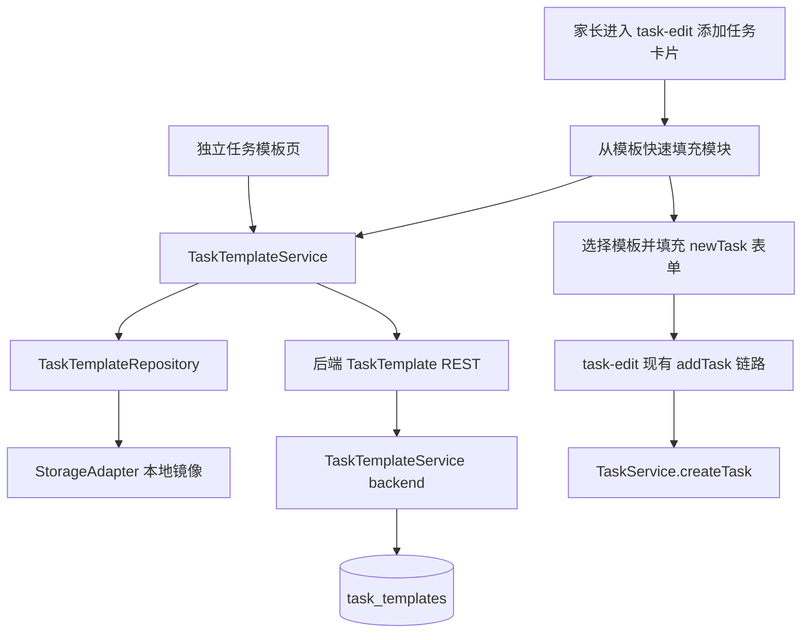

# 里程碑-21B1：模板基础闭环 详细设计文档

> **设计状态**：🟢 已通过
> **创建日期**：2026-04-07
> **设计者**：GPT5 Codex
> **审核者**：项目维护者
> **预计工期**：3-4天

---

## 📋 目录

- [需求分析](#需求分析)
- [技术方案](#技术方案)
- [代码结构](#代码结构)
- [实施步骤](#实施步骤)
- [测试方案](#测试方案)
- [风险评估](#风险评估)
- [替代方案](#替代方案)

---

## 需求分析

### 功能描述

`M21B1` 是“任务模板系统”主题下的第一阶段，目标是先把模板主链路做完整。核心场景不是生成新的任务实例，而是帮助家长在创建任务时减少重复录入：用户先维护一批常用任务模板，在新建任务时快速选择模板，系统自动填充表单，再由用户做少量调整后保存真实任务。

结合现有代码，当前任务创建入口就是 [task-edit.wxml](/Users/wangdafei/code/study_task_wechat/pages/task-edit/task-edit.wxml) 对应的“任务管理”页，页面内部包含“任务分布”和“添加任务”两块区域。`M21B1` 不再引入第二个平行的任务创建页面，而是在现有“添加任务”区域内增加“从模板快速填充”模块，并通过该模块进入独立的“任务模板页”完成模板管理和模板选择。

### 当前现状结论

| 类别 | 当前现状 | M21B1 判断 |
|------|---------|-----------|
| 任务创建入口 | 现有 [task-edit.js](/Users/wangdafei/code/study_task_wechat/pages/task-edit/task-edit.js) 只支持手工逐项录入 | 本期必须补“模板填充”能力 |
| 页面结构 | `task-edit` 已有“添加任务”主卡片，`card` 组件支持标题右侧插槽 | 可在现有卡片内部/标题区增量落位，无需重开页面 |
| 权限模型 | `task-edit` 已拦截孩子和家长切到孩子视角的直接进入 | 模板能力继续沿用“仅家长可管理”的既有权限模型 |
| 任务归属 | 当前任务归属不是表单字段，而是在创建时通过 `targetUserId` 注入 | 模板不应绑定孩子归属，应与孩子解耦 |
| 编辑语义 | 当前代码没有成熟的“编辑任务页复用同一表单”实现分支 | 模板第一版只服务“新建任务”，不扩到编辑已有任务 |
| 跨设备共享 | 用户已明确要求模板必须在家庭内家长间共享 | 必须走正式后端 REST + 同步语义，不能只做本地存储 |

### 业务价值

- [x] 用户价值：显著减少高频任务的重复录入成本，让“创建任务”从逐项填写变成“选模板后微调”。
- [x] 技术价值：把“任务模板”与“任务实例”分离为独立实体，避免继续用历史任务临时复制的方式叠功能。
- [x] 业务价值：为后续推荐、模板来源补齐和体验增强提供稳定基础。

### 功能范围

**包含**：
- ✅ 新增独立的任务模板实体，和任务实例分离
- ✅ 家长可进入独立的“任务模板页”进行模板管理
- ✅ 在现有 `task-edit` 页“添加任务”区域中新增“从模板快速填充”模块
- ✅ 新建任务时可选择模板并自动填充现有表单字段
- ✅ 模板跨设备同步，家庭内家长共享，孩子端不显示模板能力
- ✅ 模板支持手工创建
- ✅ 模板页支持搜索、按现有任务类型筛选、按最近使用/使用次数排序
- ✅ 模板支持启用/停用状态

**不包含**：
- ❌ 不把模板能力扩展到“编辑已有任务时重新覆盖整张表单”
- ❌ 不把模板与孩子归属绑定为固定字段
- ❌ 不在 `M21B1` 引入“从已有任务保存为模板”
- ❌ 不在 `M21B1` 引入“推荐保存为模板”和相似任务候选聚类
- ❌ 不在第一版引入批量创建任务、批量套用模板
- ❌ 不在第一版引入用户自定义分类作为必需交付项
- ❌ 不修改孩子端权限边界；孩子端仍完全不展示模板入口

### 优先级

- **优先级**：P1
- **理由**：这是当前明确的高频业务需求，直接影响家长创建任务时的操作负担，且需要连续几个里程碑集中收口。

---

## 技术方案

### 方案概述

`M21B1` 采用“单一使用入口 + 独立管理页面 + 独立模板实体 + 家庭共享同步”的方案。

前端入口只保留一个：在现有 [task-edit.wxml](/Users/wangdafei/code/study_task_wechat/pages/task-edit/task-edit.wxml) 的“添加任务”卡片内新增“从模板快速填充”模块。模块内展示最近/常用模板标签，并提供“查看全部/管理模板”操作。点击后进入独立的“任务模板页”，在该页面中统一承载模板查看、搜索、筛选、排序、启停、编辑、删除和新建。

模板不直接生成任务实例。模板只负责给现有 `newTask` 表单数据赋值，任务归属、当前家长操作上下文、最终保存逻辑仍继续沿用 [task-edit.js](/Users/wangdafei/code/study_task_wechat/pages/task-edit/task-edit.js) 现有 `addTask -> validateTaskForm -> taskService.createTask()` 链路。这样既能减少改动面，也能保持既有权限和同步语义稳定。

### 后续阶段边界

当前文档只覆盖 `M21B1`。后续两个阶段单独设计、单独评审，不与本期混写：

1. **M21B2：模板来源补齐**
   - 从已有任务保存为模板
   - 模板页展示“推荐保存为模板”
   - 轻量相似任务识别与候选聚类
2. **M21B3：体验增强**
   - 模板标签与最近使用体验优化
   - 更清晰的模板说明卡片
   - 自定义分类与推荐排序增强

`M21B2 / M21B3` 只作为本期边界说明存在，不纳入本设计文档的实施清单、测试清单和交付承诺。

### 技术选型

| 技术点 | 选择方案 | 不采用方案 | 选择理由 |
|--------|---------|-----------|---------|
| 模板实体 | 独立 `TaskTemplate` 模型 + 仓储 + 服务 | 直接复用历史任务对象 | 任务模板与任务实例语义不同，必须分离 |
| 页面入口 | `task-edit` “添加任务”卡片内单一模板模块 | 额外增加第二个并列主入口 | 用户理解成本更低，操作动线更顺 |
| 模板管理 | 独立“任务模板页” | 在 `task-edit` 页内塞完整模板管理面板 | 搜索、推荐、编辑、启停等管理动作需要独立页面承载 |
| 跨设备共享 | 后端 REST + 本地镜像缓存 | 仅本地存储 | 用户明确要求家庭内家长跨设备共享 |
| 模板归属 | 与孩子解耦，仅保留 family 级共享 | 模板直接绑定孩子 | 当前创建链路的归属由页面上下文决定，模板不应承载运行态归属 |

### DDD分层设计

**领域层（models/）**：
- [x] 新建模型：`models/task-template.js`
- 说明：`TaskTemplate` 承载模板静态内容、启用状态、使用统计和日期策略。

**服务层（services/）**：
- [x] 新建服务：`services/task-template-service.js`
- [x] 修改服务：`services/service-manager.js`
- [ ] 视情况修改：`services/task-service.js`
- 说明：`TaskTemplateService` 负责模板 CRUD、同步、模板应用到表单数据以及使用统计回写。

**仓储层（repositories/）**：
- [x] 新建仓储：`repositories/task-template-repository.js`
- [ ] 不修改现有任务仓储主路径
- 说明：前端仓储负责本地镜像缓存和排序读取；不把模板塞入现有 `taskData`。

**适配器层（adapters/）**：
- [ ] 不新增适配器
- [ ] 继续复用 `StorageAdapter` 和现有 HTTP client
- 说明：模板能力复用当前混合存储和 REST 调用基础设施，不引入新适配器体系。

**后端层（backend/）**：
- [x] 新增路由：`backend/routes/taskTemplates.js`
- [x] 新增控制器：`backend/controllers/taskTemplateController.js`
- [x] 新增服务：`backend/services/taskTemplateService.js`
- [x] 新增数据库迁移：`backend/database/migrations/013_create_task_templates.sql`
- 说明：后端负责家庭级模板存储、权限校验和使用统计落盘。

**表现层（pages/、components/）**：
- [x] 修改页面：`pages/task-edit/task-edit.js` / `.wxml` / `.wxss`
- [x] 新建页面：`packageManage/pages/task-template-manage/`
- [x] 新建页面：`packageManage/pages/task-template-edit/`
- [x] 视情况新增页面模块：`pages/task-edit/modules/task-template-entry.js`
- [ ] 可选新建组件：模板标签/模板卡片展示组件
- 说明：`task-edit` 只负责模板快速使用；完整管理放到独立模板页。推荐候选区留待 `M21B2` 再进入页面正式设计。

### 架构图



### 数据模型

```typescript
interface TaskTemplate {
  id: string;
  familyId: string;
  name: string;
  description: string; // 模板说明，用于帮助家长理解模板用途
  taskPayload: {
    title: string;
    type: 'habit' | 'study' | 'interest';
    points: number;
    pointsExpiry: 'permanent' | 'week' | 'month' | '3months' | '6months' | '12months';
    description?: string; // 真实任务描述，应用模板时填入任务表单
    isRequired: boolean;
    isAllDay: boolean;
    startDate: string;
    startTime: string;
    endDate: string;
    endTime: string;
    hasNoEndDate: boolean;
    repeat: {
      type: 'none' | 'daily' | 'weekly' | 'workdays' | 'weekends' | 'custom';
      days: number[];
      startDate: string;
      endDate: string;
    };
    reminder: {
      enabled: boolean;
      time: number;
    };
  };
  dateStrategy: {
    mode: 'today' | 'inherit-repeat-rule';
    autoShiftExpiredEndDate: boolean;
  };
  enabled: boolean;
  usageCount: number;
  lastUsedAt: number | null;
  createdAt: number;
  updatedAt: number;
}
```

### 接口设计

**前端服务接口**：

| 方法 | 说明 | 参数 | 返回值 |
|------|------|------|--------|
| `getTemplates(options)` | 获取模板列表 | `{ keyword, type, sortBy, enabledOnly }` | `{ templates }` |
| `getRecentTemplates(limit)` | 获取最近/常用模板标签 | `{ limit }` | `{ templates }` |
| `createTemplate(input)` | 创建模板 | `{ name, description, taskPayload, dateStrategy, enabled }` | `{ success, template }` |
| `updateTemplate(templateId, input)` | 更新模板 | `{ templateId, name?, description?, taskPayload?, dateStrategy?, enabled? }` | `{ success, template }` |
| `setTemplateEnabled(templateId, enabled)` | 启用/停用模板 | `{ templateId, enabled }` | `{ success }` |
| `deleteTemplate(templateId)` | 删除模板 | `{ templateId }` | `{ success }` |
| `applyTemplateToTaskForm(template, context)` | 将模板映射为 `task-edit` 表单数据 | `{ template, today }` | `{ formPatch }` |
| `recordTemplateUsage(templateId)` | 成功创建任务后回写使用统计 | `{ templateId }` | `{ success }` |

**模板持久化 canonical contract**：

- `taskPayload.repeat.type` 以当前任务创建表单和服务层已实际支持的值为准：
  - `'none' | 'daily' | 'weekly' | 'workdays' | 'weekends' | 'custom'`
- `taskPayload.pointsExpiry` 以当前前端表单和星星服务已实际支持的值为准：
  - `'permanent' | 'week' | 'month' | '3months' | '6months' | '12months'`
- 模板层不以 [models/task.js](/Users/wangdafei/code/study_task_wechat/models/task.js) 中的旧枚举覆盖上述持久化约定；如后续需要统一领域枚举，应在独立治理里程碑中完成，而不是在 `M21B1` 内临时改写业务语义。
- 创建/编辑模板时，若来源是 `task-edit` 表单，则按表单当前值原样入模板；不额外转换为旧领域枚举。
- 若后续出现历史模板值与当前 canonical contract 不一致，读取时由 `TaskTemplateService` 做兼容归一化。

**后端 REST 契约**（新增）：

| 方法 | 路径 | 说明 |
|------|------|------|
| `GET` | `/api/task-templates` | 获取家庭模板列表，支持搜索/筛选/排序 |
| `POST` | `/api/task-templates` | 创建模板 |
| `PUT` | `/api/task-templates/:templateId` | 更新模板 |
| `PATCH` | `/api/task-templates/:templateId/enabled` | 启用/停用模板 |
| `DELETE` | `/api/task-templates/:templateId` | 删除模板 |
| `POST` | `/api/task-templates/:templateId/usage` | 回写使用统计 |

### 页面与交互约束

1. `task-edit` 页面内只保留一个模板相关入口：`从模板快速填充` 模块。
2. 模块位置放在“添加任务”卡片内部顶部，即任务名称输入框上方。
3. 模块中展示 3-5 个最近/常用模板标签，并提供 `查看全部/管理模板` 动作。
4. 点击 `查看全部/管理模板` 后进入独立的 `任务模板页`。
5. 独立模板页包含：
   - 顶部搜索栏
   - 类型筛选与排序条
   - 已有模板区
   - 新建模板按钮
6. 模板第一版只服务“新建任务”流程，不覆盖“编辑任务”。
7. 当模板数为 `0` 时，`task-edit` 快速填充区不展示空标签轨道，而展示空态说明和 `创建第一个模板` 入口。
8. `M21B1` 阶段进入模板管理页的正式入口只有两种：
   - 快速填充区右上角 `查看全部`
   - 零模板空态中的 `创建第一个模板`
9. 两种入口都统一跳转到：
   - `packageManage/pages/task-template-manage/task-template-manage`
10. 模板的手工新建和编辑不在管理列表页内联展开，也不采用大弹窗；`M21B1` 统一使用独立模板编辑页承载表单编辑。

### 视觉与交互设计

1. **`task-edit` 快速填充模块**
   - 形态采用轻量卡片内嵌模块，不单独再起一个大面板。
   - 模块放在“添加任务”卡片顶部、任务名称输入框上方，保证在用户开始录入前先看到模板入口。
   - 模块头部包含：
     - 左侧标题：`从模板快速填充`
     - 下方说明：`选择常用模板，自动填充下方表单`
     - 右侧弱操作：`查看全部`
   - **密度控制规则**：
     - 快速填充区默认控制在“说明文 + 1 行标签区 + 1 个查看全部入口”的视觉高度内，不扩展成大段管理区域。
     - 标签区优先采用**单行横向滚动**，不做多行自动换行，避免把“添加任务”主表单继续向下挤压。
     - 模块与下方“任务名称”输入项之间保留明确留白，形成“先选模板，再填表”的视觉层次，但不能强过主表单。
     - 若没有任何模板，则该区域收缩为空态提示 + `创建第一个模板` 主入口，不保留空白容器，不展示假标签骨架。
   - 模板快捷项采用**胶囊标签（capsule chips）**，这是 `M21B1` 的正式推荐形态。
     - 单个标签只展示模板名，超长文本单行省略。
     - 单个标签宽度应受控，优先保证一眼扫过 3 个以上标签，而不是出现一个超长标签吞掉整行。
     - 标签颜色**跟随任务类型**，而不是统一使用全局主题蓝。
     - 默认状态为对应任务类型的浅底色/浅描边，选中状态为对应任务类型的浅填充 + 明确描边。
     - 最多展示 3-5 个，超过后不在此处堆叠，统一交给“查看全部/管理模板”。
   - 模块整体视觉应明显轻于下方表单，避免喧宾夺主。
   - **零模板空态设计**：
     - 标题仍保留：`从模板快速填充`
     - 说明文替换为：`还没有任务模板，先创建一个，后续可一键填充任务表单`
     - 主操作按钮：`创建第一个模板`
     - 不展示搜索、筛选、标签轨道或推荐区
     - 点击主操作后直接跳转模板管理页

2. **模板管理页**
   - 页面主体采用“顶部工具区 + 模板卡片列表 + 底部主按钮”的结构。
   - 顶部工具区包含搜索框、类型筛选、排序切换，优先保证查找效率。
   - **信息层级与密度规则**：
     - 搜索框单独占一行，避免和筛选/排序控件挤在同一行造成触控拥挤。
     - 类型筛选与排序条放在搜索框下方作为第二层工具区，保持查找动作的结构清晰。
     - 模板卡片默认应控制在一屏可见 3-4 张的密度，不做过高卡片，避免首屏只能看到 1-2 张导致浏览效率下降。
     - 每张卡片只保留 3 层信息：标题层、摘要层、操作层，不继续叠加第四层说明文字造成信息噪音。
     - 若模板说明较长，默认折叠或省略，不在列表首屏全文展开。
   - 模板列表使用**卡片**而不是纯文本行。
     - 卡片首行展示模板名、类型标签、启用状态。
     - 卡片次行展示摘要信息：星星、时间范围、重复规则。
     - 卡片底部展示最近使用/使用次数等弱信息，并提供编辑、启停、删除操作。
     - 卡片标题行不塞入过多操作按钮，避免标题区拥挤；危险操作如删除应保持为次级操作。
   - 主按钮固定为 `新建模板`，保持主次操作清晰。
   - 整体样式延续当前小程序蓝白主视觉和任务类型既有颜色，不额外引入新的高饱和配色体系。
   - 页面级主操作（如 `查看全部`、`新建模板`）继续使用全局主题蓝；模板标签和类型徽标使用任务类型色，避免语义混杂。
   - 搜索框占位文案建议固定为：`搜索模板名称或说明`，避免文案过长导致理解负担。
   - **零模板页空态设计**：
     - 当模板数为 `0` 时，页面优先展示空态说明而不是空列表。
     - 空态标题：`还没有任务模板`
     - 空态说明：`创建后可在“添加任务”时快速填充常用内容`
     - 主操作按钮：`新建模板`
     - 当模板数为 `0` 时，搜索框、筛选条、排序条默认隐藏，避免页面出现“空工具栏 + 空列表”的噪音布局。
     - 创建出第一个模板后，再切换为正常的“搜索/筛选/排序 + 卡片列表”布局。
   - 点击 `新建模板` 或卡片上的 `编辑` 后，统一跳转独立模板编辑页，不在当前页内联展开长表单。

3. **模板编辑页**
   - `M21B1` 正式采用独立模板编辑页，避免把模板管理页做成“列表 + 大表单”的高密度混合页面。
   - 编辑页结构采用与现有任务表单相同的分组式布局，但只保留模板真正需要的字段。
   - 建议字段分组：
     - 基础信息：模板名称、模板说明
     - 任务内容：任务标题、类型、星星、描述、必做
     - 时间与重复：全天、时间范围、日期策略、重复规则、无结束日期
     - 提醒与状态：提醒、启用状态
   - 页底固定主次操作：
     - 主操作：`保存模板`
     - 次操作：`取消`
   - 编辑页只负责模板内容编辑，不承担列表搜索、筛选、排序等管理动作。

4. **设计原则**
   - 快速使用看“标签”，完整理解看“卡片”，两层信息密度分离。
   - `task-edit` 只解决“快速选一个模板”，不承担复杂管理。
   - 模板页只解决“查找和维护模板”，不反向挤压创建任务主链路。
   - 首版优先清爽、可扫读、低认知成本，不追求复杂装饰。
   - 任何需要两次以上扫读才能理解的堆叠信息，都应优先下沉到模板管理页，而不是塞进快速填充区。
   - 页面视觉必须延续现有任务管理与奖励管理的留白、圆角、弱阴影和低噪音信息组织方式，避免出现与全局风格脱节的新视觉体系。
   - 首次使用时优先让用户明确“下一步该做什么”，因此零模板状态必须比正常列表态更直接，不让用户面对空白管理页。

### 关键规则

1. **模板与孩子解耦**  
   模板不保存 `userId / targetUserId`，任务归属继续由当前创建上下文决定。

2. **非重复任务日期策略**  
   默认填充“今天”。

3. **重复任务日期策略**  
   模板显式保存日期策略，默认继承固定重复规则；应用到表单时按以下确定性规则处理：
   - 保留模板的重复类型和星期配置；
   - 若模板 `startDate` 早于今天，则新表单 `startDate` 取今天；
   - 若模板存在 `endDate` 且早于新 `startDate`，则按原模板日期跨度向后顺延；
   - 这里的“原模板日期跨度”定义为：`模板 endDate - 模板 startDate` 的自然日差值。
   - 例如：模板 `startDate=2026-01-01`、`endDate=2026-03-31`，原跨度为 89 天；若新 `startDate=2026-04-08`，则新 `endDate=2026-07-06`。
   - `repeat.startDate` / `repeat.endDate` 必须和 `newTask.startDate` / `newTask.endDate` 保持一致，避免创建前后二义性。

4. **分类规则**  
   第一版模板分类只沿用现有任务类型，不把“用户自定义分类”作为首交付硬要求。

5. **字段语义规则**  
   - `TaskTemplate.description` 表示模板说明，用于模板管理页展示和理解模板。
   - `TaskTemplate.taskPayload.description` 表示真实任务描述，应用模板时填充到 `newTask.description`。
   - 两者语义不同，不能混用，也不能在应用模板时互相覆盖。
   - `pointsExpiryDate` 在 `M21B1` 中不作为模板持久化字段。首版模板只保存 `pointsExpiry` 档位值；任何展示文案或派生日期都在运行时计算。

6. **搜索语义规则**  
   - 搜索应进入第一版。因为模板管理页一旦只有筛选和排序，模板量上来后会明显影响查找效率。
   - 第一版搜索范围仅包含文字信息：
     - 模板名称 `name`
     - 模板说明 `description`
     - 模板任务标题 `taskPayload.title`
     - 模板任务描述 `taskPayload.description`
   - 第一版不将以下字段纳入自由模糊搜索：
     - 任务类型
     - 启用状态
     - 最近使用时间
     - 使用次数
     - 时间范围
     - 重复规则
   - 这些非文字语义应继续通过筛选和排序解决，而不是混入搜索结果，避免用户对“搜索到底在搜什么”产生认知混乱。

7. **枚举与兼容映射规则**  
   - `applyTemplateToTaskForm()` 和模板保存逻辑必须共同遵循模板层 canonical contract，不能各自猜测枚举。
   - `repeat.type` 兼容规则：
     - 模板存储值优先使用 `'none' | 'daily' | 'weekly' | 'workdays' | 'weekends' | 'custom'`
     - 已知旧值映射：
       - `'monthly' -> 'none'`，并记录兼容日志；`M21B1` 不为月重复模板提供自动迁移语义
     - 读取到未知值时，降级为 `'none'`
   - `pointsExpiry` 兼容规则：
     - 模板存储值优先使用 `'permanent' | 'week' | 'month' | '3months' | '6months' | '12months'`
     - 已知旧值映射：
       - `'quarter' -> '3months'`
     - 读取到未知值时，降级为 `'permanent'`
   - `applyTemplateToTaskForm()` 负责把 canonical value 映射成 `task-edit` 运行所需的：
     - `newTask.pointsExpiry`
     - `pointsExpiryText`
     - `newTask.repeat.type`
     - `repeatText`
     - `repeatPreviewText`
     - `weekdaySelection`
   - 模板保存时不反向存储 `pointsExpiryText / repeatText / reminderText / repeatPreviewText` 等纯展示态字段。
   - 显示文本派生逻辑必须走统一 helper，不允许模板填充链路和手工表单交互链路各自维护一套文案规则。
   - 推荐收口方式：
     - `pointsExpiryText`：复用 `Constants.POINTS_EXPIRY.TEXT`
     - `repeatPreviewText`：复用 `task-edit` 现有 `generateRepeatPreviewText()`，或抽取为共享 helper 后复用
     - `repeatText`：将当前页面内分散在重复选择回调中的生成逻辑抽取为共享 helper，再由模板填充和手工选择共同调用
     - `reminderText`：将当前提醒面板确认回调中的文案逻辑抽取为共享 helper，再由模板填充和手工选择共同调用

8. **删除策略**  
   - 删除模板不影响任何已通过该模板创建成功的历史任务。
   - `M21B1` 首版采用硬删除，不引入回收站和软删除恢复流。
   - 删除操作必须二次确认，确认文案需明确“删除后不会影响已创建任务”。

9. **离线策略**  
   - `M21B1` 支持离线读取本地镜像缓存的模板列表，用于快速填充已有模板。
   - `M21B1` 默认**不支持离线创建/编辑/删除/启停模板**，避免家庭共享模板在离线场景下产生冲突和双写复杂度。
   - 当页面处于离线状态时：
     - 模板管理页允许浏览本地缓存；
     - 新建、编辑、删除、启停等写操作入口应置灰或点击后直接提示“当前离线，暂不支持模板管理修改”。
   - 模板本地镜像缓存刷新时机：
     - 模板管理页首次进入时主动拉取；
     - 模板管理写操作成功后主动刷新；
     - `task-edit` 快速填充模块进入时优先读本地缓存，再按需后台刷新最近模板。

10. **零模板初始态规则**  
   - `M21B1` 不包含“系统推荐保存模板”，因此当系统中还没有任何模板时，不展示推荐保存区，也不展示伪推荐占位。
   - 首次使用主路径应为：
     - 家长进入 `task-edit`
     - 在“从模板快速填充”模块看到零模板空态
     - 点击 `创建第一个模板`
     - 跳转到模板管理页
     - 在模板管理页完成首个模板创建
     - 返回 `task-edit` 后开始使用快捷填充
   - 该路径是 `M21B1` 的正式首次使用体验，不依赖任何推荐能力。

---

## 代码结构

### 文件变更清单

**新增文件**：
- `docs/design/milestone-21b1-task-template-foundation.md` - M21B1 设计文档
- `models/task-template.js` - 任务模板领域模型
- `repositories/task-template-repository.js` - 前端模板仓储
- `services/task-template-service.js` - 前端模板服务
- `pages/task-edit/modules/task-template-entry.js` - `task-edit` 模板入口逻辑
- `packageManage/pages/task-template-manage/task-template-manage.js` - 模板管理页
- `packageManage/pages/task-template-manage/task-template-manage.wxml`
- `packageManage/pages/task-template-manage/task-template-manage.wxss`
- `packageManage/pages/task-template-manage/task-template-manage.json`
- `packageManage/pages/task-template-edit/task-template-edit.js` - 模板编辑页
- `packageManage/pages/task-template-edit/task-template-edit.wxml`
- `packageManage/pages/task-template-edit/task-template-edit.wxss`
- `packageManage/pages/task-template-edit/task-template-edit.json`
- `backend/routes/taskTemplates.js`
- `backend/controllers/taskTemplateController.js`
- `backend/services/taskTemplateService.js`
- `backend/database/migrations/013_create_task_templates.sql`
- `test/models/task-template.test.js`
- `test/repositories/task-template-repository.test.js`
- `test/services/task-template-service.test.js`
- `test/pages/task-template-manage.page.test.js`
- `test/pages/task-template-edit.page.test.js`

**重点修改文件**：
- `app.json` - 注册 `packageManage/pages/task-template-manage/task-template-manage`
- `app.json` - 注册 `packageManage/pages/task-template-edit/task-template-edit`
- `pages/task-edit/task-edit.js` - 接入模板快速填充与应用逻辑
- `pages/task-edit/task-edit.wxml` - 新增模板模块
- `pages/task-edit/task-edit.wxss` - 补模板模块样式
- `services/index.js` - 导出 `TaskTemplateService`
- `services/service-manager.js` - 注入 `taskTemplateService`
- `backend/server.js` - 挂载 `/api/task-templates` 路由
- `jest.quality.config.js` - 若决定把模板相关路径纳入正式质量闸门，则同步更新覆盖路径
- `docs/development/ROADMAP.md` - 里程碑状态同步

### 核心代码结构

```javascript
// models/task-template.js
class TaskTemplate {
  constructor(data = {}) {
    this.id = data.id || `tpl_${Date.now()}`;
    this.familyId = data.familyId || '';
    this.name = data.name || '';
    this.taskPayload = data.taskPayload || {};
    this.dateStrategy = data.dateStrategy || {
      mode: 'today',
      autoShiftExpiredEndDate: true
    };
    this.enabled = data.enabled !== false;
    this.usageCount = Number(data.usageCount || 0);
    this.lastUsedAt = data.lastUsedAt || null;
  }
}

// services/task-template-service.js
class TaskTemplateService {
  async getRecentTemplates(limit = 5) {}
  async getTemplates(options = {}) {}
  async createTemplate(input) {}
  async updateTemplate(templateId, input) {}
  applyTemplateToTaskForm(template, context = {}) {}
}

// pages/task-edit/modules/task-template-entry.js
function applyTemplateToTaskEditForm(page, template) {
  // 将模板映射为现有 newTask / repeatText / reminderText / pointsExpiryText 等字段
}

// pages/task-edit/task-edit.js
Page({
  data: {
    selectedTemplateId: null,
    selectedTemplateName: ''
  }
});

// packageManage/pages/task-template-edit/task-template-edit.js
Page({
  data: {
    mode: 'create', // create | edit
    templateId: null
  }
});
```

### 关键函数

**函数1**：`TaskTemplateService.applyTemplateToTaskForm(template, context)`
- **输入**：模板对象、当前日期上下文
- **输出**：适用于 `task-edit` 的表单 patch
- **职责**：把模板持久化字段映射为现有 `newTask` 表单，并派生 `repeatText / reminderText / pointsExpiryText`
- **依赖**：日期策略解析、提醒文本和重复文本生成逻辑

**字段映射细则**：

| 模板字段 | 目标字段 | 说明 |
|------|------|------|
| `taskPayload.title` | `newTask.title` | 原样填充 |
| `taskPayload.type` | `newTask.type` | 原样填充 |
| `taskPayload.points` | `newTask.points` | 原样填充 |
| `taskPayload.pointsExpiry` | `newTask.pointsExpiry` | 使用 canonical value |
| `taskPayload.pointsExpiry` | `pointsExpiryText` | 通过 `Constants.POINTS_EXPIRY.TEXT` 或等价映射派生 |
| `taskPayload.description` | `newTask.description` | 原样填充 |
| `taskPayload.isRequired` | `newTask.isRequired` | 原样填充 |
| `taskPayload.isAllDay` | `newTask.isAllDay` | 原样填充 |
| `taskPayload.startTime` | `newTask.startTime` | 原样填充 |
| `taskPayload.endTime` | `newTask.endTime` | 原样填充 |
| `taskPayload.hasNoEndDate` | `newTask.hasNoEndDate` | 原样填充 |
| `taskPayload.reminder` | `newTask.reminder` | 原样填充 |
| `taskPayload.reminder` | `reminderText` | 运行时派生显示文本 |
| `taskPayload.repeat` | `newTask.repeat` | 应用 canonical repeat 值并补齐 `days/startDate/endDate` |
| `taskPayload.repeat` | `repeatText` | 通过共享 repeat-text helper 派生 |
| `taskPayload.repeat.type` | `repeatPreviewText` | 复用现有 `generateRepeatPreviewText()` 或共享 helper 派生 |
| `dateStrategy.mode` | `newTask.startDate` / `newTask.endDate` | 按日期策略计算 |

**UI 状态同步细则**：

- `startDatePanel / endDatePanel / repeatPanel / reminderPanel / pointsExpiryPanel`：应用模板时一律重置为关闭。
- `weekdaySelection`：当 `repeat.type === 'custom'` 时由 `repeat.days` 派生；`workdays/weekends` 时按对应星期集派生；其他类型清空。
- `repeatPanelMode`：应用模板后一律回到 `'type'` 初始模式，不保留上次面板编辑态。
- `isRepeatOptionDisabled`：按新填入的 `startDate/endDate/hasNoEndDate` 重新计算，不继承旧页面状态。
- `selectedTemplateId / selectedTemplateName`：在模板应用成功后同步写入页面状态，供后续使用统计回写。
- `pointsExpiryText / repeatText / repeatPreviewText / reminderText`：必须在字段填充完成后，通过统一 helper 基于最终表单值重新计算，不能直接复用旧页面残留文本。

**函数2**：`TaskTemplateService.getRecentTemplates(limit)`
- **输入**：展示数量上限
- **输出**：最近/常用模板列表
- **职责**：为 `task-edit` 顶部模板标签区提供稳定数据
- **依赖**：模板仓储排序读取能力

**函数3**：`TaskTemplateService.recordTemplateUsage(templateId)`
- **输入**：模板 ID
- **输出**：`{ success }`
- **职责**：在真实任务创建成功后回写使用统计
- **依赖**：模板后端 REST 接口；仅在 `taskService.createTask()` 成功后以 best-effort 方式调用，不阻断成功提交流程

---

## 实施步骤

### 第1步：模板实体与同步基础落地（预计1.5天）

- [ ] **任务**：新增模板领域模型、前端仓储/服务、后端 REST 和数据库迁移
- [ ] **验证**：前后端能完成模板 CRUD、启停和列表读取
- [ ] **依赖**：无

**实施要点**：
1. 新建 `TaskTemplate` 独立实体，不复用 `Task` 模型。
2. 后端表结构按 `family_id` 共享，不绑定孩子 `user_id`。
3. 新增模板启用/停用状态、最近使用时间、使用次数字段。
4. 前端读取优先走正式服务接口，本地仓储只作为镜像缓存。
5. 模板持久化字段与 `task-edit` 的 `newTask` 结构保持对齐，不持久化 `repeatText / reminderText / pointsExpiryText` 这类纯展示态字段。
6. 数据库迁移文件名明确使用 `013_create_task_templates.sql`，与现有迁移序号保持连续。
7. 模板层不持久化 `pointsExpiryDate`；若读取到历史兼容字段，进入服务层后即做归一化，不继续回写为正式字段。

---

### 第2步：独立模板页与管理闭环（预计1.5天）

- [ ] **任务**：实现独立模板页，支持搜索、筛选、排序、创建、编辑、删除、启停
- [ ] **验证**：家长可在模板页完整维护模板，孩子端不可见
- [ ] **依赖**：第1步完成

**实施要点**：
1. 页面风格参考现有 `reward-manage` 的独立管理页模式，但视觉更简洁。
2. 页面结构固定为“已有模板区 + 新建模板按钮”。
3. 顶部固定搜索、类型筛选和排序条，优先解决“找模板”问题。
4. 模板列表使用信息卡片，不使用纯文本行；快捷标签只存在于 `task-edit` 页面。
5. 删除模板必须弹出二次确认，确认态明确告知“不会影响已创建任务”。
6. 离线状态下页面允许浏览缓存，但写操作统一禁用或直接提示不可用。
7. 当模板数为 `0` 时，页面切换为零模板空态，不展示搜索/筛选/排序工具栏。
8. 点击 `新建模板` 或 `编辑` 后统一跳转独立模板编辑页。

---

### 第2.5步：模板编辑页落地（预计1天）

- [ ] **任务**：实现独立模板编辑页，支持手工新建和编辑模板
- [ ] **验证**：家长可完成模板表单录入、编辑回显和保存；取消后返回管理页
- [ ] **依赖**：第1步完成

**实施要点**：
1. 编辑页采用分组表单，不在管理页内联展开长表单。
2. `create` 模式用于首个模板创建和普通新建；`edit` 模式用于修改现有模板。
3. 表单字段只覆盖 `M21B1` 正式支持的模板字段，不提前混入 `M21B2` 的来源推荐逻辑。
4. 保存时将页面表单值按模板层 canonical contract 归一化后写入 `TaskTemplateService`。
5. 取消编辑直接返回模板管理页，不产生草稿持久化语义。
6. 编辑页和 `task-edit` 页若存在同类文本派生逻辑，应优先抽到共享 helper，避免模板编辑、模板应用、手工交互三处文案规则分叉。

---

### 第3步：`task-edit` 页模板快速填充（预计1天）

- [ ] **任务**：在 `task-edit` 的“添加任务”卡片中新增模板模块，支持模板标签快速填充
- [ ] **验证**：用户选择模板后，现有任务表单被正确填充，仍由现有创建链路保存
- [ ] **依赖**：第1步完成

**实施要点**：
1. 模块位置固定在“添加任务”卡片内、任务名称输入框上方。
2. 展示 3-5 个最近/常用模板胶囊标签。
3. 模块提供 `查看全部/管理模板`，进入独立模板页。
4. `task-edit` 页面需新增 `selectedTemplateId` 状态，用于记录当前填表来源。
5. 只填表，不直接创建任务。
6. 模板应用后继续允许用户手工修改所有字段。
7. 真实任务创建成功后，若存在 `selectedTemplateId`，则异步回写 `recordTemplateUsage()`；回写失败仅记日志，不回滚创建成功结果。
8. 清空表单、创建成功或切换为手工录入时，需同步清空当前模板选择状态。
9. 模板应用必须同步重置面板展开态和辅助 UI 状态，避免沿用旧页面的 `repeatPanelMode / weekdaySelection / isRepeatOptionDisabled` 造成视觉与数据不一致。
10. 当模板数为 `0` 时，模块改为零模板空态，主操作按钮文案固定为 `创建第一个模板`，点击后直接导航到模板管理页。

---

## 测试方案

### 单元测试

| 测试项 | 测试方法 | 预期结果 |
|--------|---------|---------|
| 模板模型 | `test/models/task-template.test.js` | 默认值、启停状态、统计字段和日期策略正确 |
| 模板仓储 | `test/repositories/task-template-repository.test.js` | 列表读取、排序、缓存和本地镜像正确 |
| 模板服务 | `test/services/task-template-service.test.js` | CRUD、应用表单、使用统计回写逻辑正确 |
| `task-edit` 模板填表 | `test/pages/task-edit.page.test.js` 或新增模块测试 | 选择模板后 `newTask`、`repeatText`、`reminderText` 被正确填充 |
| 使用统计回写 | `test/pages/task-edit.page.test.js` 或服务测试 | 仅在创建成功后调用 `recordTemplateUsage()`，失败时不影响任务创建成功提示 |
| 枚举兼容映射 | `test/services/task-template-service.test.js` | `repeat.type`、`pointsExpiry` 的 canonical value 与降级逻辑正确 |
| 离线写保护 | `test/pages/task-template-manage.page.test.js` 或页面行为测试 | 离线时模板写操作不可用，缓存浏览仍可用 |
| 删除确认 | `test/pages/task-template-manage.page.test.js` | 删除前需要二次确认，且提示“不影响已创建任务” |
| 零模板空态 | `test/pages/task-edit.page.test.js` / `test/pages/task-template-manage.page.test.js` | 无模板时展示空态和首个创建入口，而不是空列表或空标签区 |
| 模板编辑页 | `test/pages/task-template-edit.page.test.js` | 支持 create/edit 模式、字段回显、保存与取消返回 |

### 集成测试

- [ ] 家长在设备 A 创建模板后，设备 B 的家长能看到同一家庭模板
- [ ] 在 `task-edit` 选择模板后，真实创建任务仍走现有 `taskService.createTask()` 成功保存
- [ ] 孩子端访问时不显示模板入口

### 手动测试

参考 `docs/development/testing-strategy.md` 的手工回归原则：

1. **模板管理**
   - [ ] 家长能进入独立模板页
   - [ ] 可手工创建、编辑、删除、启用/停用模板
   - [ ] 搜索、任务类型筛选、最近使用/使用次数排序可用

2. **模板使用**
   - [ ] `task-edit` 页“从模板快速填充”模块展示最近模板标签
   - [ ] 选择模板后表单字段正确填充
   - [ ] 用户修改后仍可正常添加真实任务

3. **共享与权限**
   - [ ] 同家庭家长多设备间模板保持一致
   - [ ] 孩子端不显示模板入口或模板页入口

### 最小验证集

- `test/models/task-template.test.js`
- `test/repositories/task-template-repository.test.js`
- `test/services/task-template-service.test.js`
- `test/pages/task-edit.page.test.js`
- `test/pages/task-template-manage.page.test.js`
- 后端 `taskTemplateService` / `taskTemplateController` 定向测试
- `npm test -- --runInBand`

补充说明：

- 当前正式 `test:quality` 覆盖范围不包含 `pages/task-edit/**`、`packageManage/**` 和 `services/task-template-service.js`，见 [jest.quality.config.js](/Users/wangdafei/code/study_task_wechat/jest.quality.config.js)。
- 因此 `M21B1` 默认阻塞标准应为：`npm test -- --runInBand` + 新增定向测试全部通过。
- `npm run test:quality -- --runInBand` 在本期默认作为回归补充项，不作为新增模板页面和模板服务的唯一正式阻塞标准。
- 若实施时决定把模板相关路径纳入正式质量闸门，则必须同步修改 `jest.quality.config.js`，并把该变更纳入本里程碑提交范围。

---

## 风险评估

| 风险 | 概率 | 影响 | 应对措施 |
|------|------|------|---------|
| 模板与任务实例语义混淆 | 中 | 高 | 文案统一使用“模板填充”“保存为模板”，不使用“复制任务”表述 |
| 模板持久化字段与 `task-edit` 表单字段不一致 | 中 | 高 | 模板 `taskPayload` 与 `newTask` 对齐，展示态字段统一运行时派生，不入库 |
| 枚举契约分裂导致模板读写不一致 | 中 | 高 | 明确模板层 canonical value，由 `TaskTemplateService` 统一做兼容归一化和显示态派生 |
| `task-edit` 页继续变重 | 中 | 中 | 将模板入口逻辑下沉到独立模块，不在主文件里继续堆叠长函数 |
| 日期策略与重复规则顺延不符合预期 | 中 | 高 | 显式建模 `dateStrategy`，并补足单测与手测场景 |
| 家庭共享模板权限处理错误 | 低 | 高 | 后端按 `familyId + parent role` 校验，补集成测试 |
| 模板过多时查找效率差 | 中 | 中 | 搜索进入第一版，且首屏展示最近/常用模板标签 |
| 模板使用统计回写污染成功链路 | 低 | 中 | 使用统计仅在创建成功后 best-effort 回写，失败不影响用户成功结果 |
| 离线写模板造成共享状态冲突 | 中 | 中 | 首版仅支持离线读缓存，不支持离线写模板 |

---

## 替代方案

### 方案A：当前方案 - 独立模板实体 + 单一表单入口 + 独立模板页

**描述**：模板作为独立对象存在，在 `task-edit` 页只保留模板快速使用入口，完整管理放到独立模板页。

**优点**：
- 语义清晰，模板与任务实例分离
- 贴合当前 `task-edit` 页的创建动线
- 能先满足模板管理和模板使用两类核心需求
- 更适合后续跨设备共享和推荐增强

**缺点**：
- 需要新增后端 REST 和数据库表
- 首次实现范围比“简单复制任务”更大

**结论**：采用。

### 方案B：直接从历史任务临时复制到表单，不建立模板实体

**描述**：不做模板管理，只在创建任务时从历史任务列表里找一个相似任务快速填表。

**不采用原因**：
- 无法稳定管理常用模板
- 不能支持启停、统计、推荐、共享等能力
- 任务实例和模板语义混在一起，后续扩展成本高

### 方案C：把模板管理和模板使用都塞进 `task-edit` 当前页面

**描述**：不新增独立模板页，直接在“添加任务”区域展开模板管理面板。

**不采用原因**：
- 页面信息密度会明显过高
- 搜索、推荐、编辑、启停、删除等动作会挤压创建表单
- 不利于保持界面清爽与操作动线清晰

### 方案D：先只做本地模板，后续再补同步

**描述**：第一版只把模板存本地，不做后端共享。

**不采用原因**：
- 与“家庭内家长跨设备共享模板”的明确需求冲突
- 先做本地版后再改共享版，返工成本高
