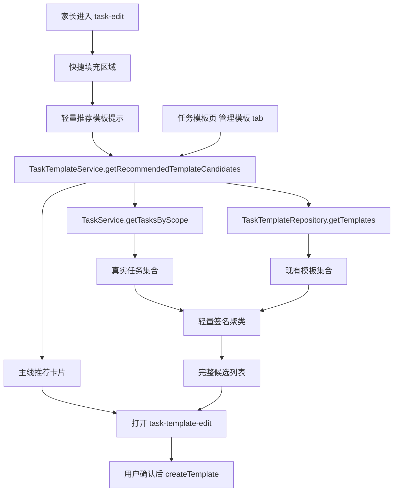

# 里程碑-21B2：模板来源补齐 详细设计文档

> **设计状态**：🟢 审核通过
> **创建日期**：2026-04-09
> **设计者**：GPT5 Codex
> **审核者**：项目维护者
> **依赖文档**：`docs/design/milestone-21b1-task-template-foundation.md`、`docs/design/milestone-21b1-ux-refinement.md`
> **预计工期**：2-3天

---

## 📋 目录

- [需求分析](#需求分析)
- [技术方案](#技术方案)
- [代码结构](#代码结构)
- [实施步骤](#实施步骤)
- [测试方案](#测试方案)
- [风险评估](#风险评估)
- [替代方案](#替代方案)

---

## 需求分析

### 功能描述

`M21B1 / M21B1-UX` 已经完成了模板的基础闭环和体验收敛，用户现在可以手工维护模板，并在创建任务时快捷填充。但模板体系仍缺一个关键问题的答案：模板从哪里来。

当前模板池的唯一正式来源仍然是“手工新建模板”。这会导致首版模板系统在真实使用中遇到明显阻力：用户知道模板有价值，但不知道第一批模板应该怎么积累；用户已经维护过很多真实任务，但这些任务和模板体系没有打通；模板管理页也没有告诉用户“哪些真实任务值得沉淀为模板”。因此 `M21B2` 的目标不是继续做模板展示，而是补齐模板来源链路，让模板能从真实任务中自然长出来。

### 当前现状结论

| 类别 | 当前现状 | M21B2 判断 |
|------|---------|-----------|
| 模板入口 | `task-edit` 已支持快捷填充，模板管理页已支持选择/管理双 tab | 入口足够，不需要新开模板域页面 |
| 模板来源 | 只有手工新建，没有从任务生成模板能力 | 本期必须补 |
| 任务主线入口 | `task-edit` 已有快捷填充区和无模板空态 | 适合作为“推荐模板”主感知入口 |
| 模板页内容 | 管理 tab 只有搜索、分类、新建和模板列表 | 需要增加“推荐保存候选”区作为完整承接 |
| 任务数据能力 | `TaskService.getAllTasks / getTasksByScope` 已能拿到真实任务集合 | 可优先做前端轻量推荐，不必先扩后端 |
| 模板持久化 | 前后端模板 CRUD、同步、启停、删除已完备 | 本期应复用既有写接口，不重开表结构 |
| 表单复用 | `task-edit` 与 `task-template-edit` 仍是两套表现层 | 本期不阻塞性重构，只补纯函数和数据流复用 |

### 业务价值

- [x] 用户价值：让用户在任务主线上自然感知“这些常做任务值得存成模板”，减少模板冷启动阻力。
- [x] 技术价值：把“模板来源”从纯手工录入扩展为“主线推荐 + 模板页承接 + 手工创建”，形成可持续增长的模板池。
- [x] 业务价值：为 `M21B3` 的模板排序增强、常用模板优化和更强推荐能力提供真实候选基础。

### 功能范围

**包含**：
- ✅ 在 `task-edit` 主线中增加轻量“推荐模板”感知区
- ✅ 推荐卡片支持一键进入“预填好的模板编辑页”
- ✅ 在模板页 `管理模板` tab 中新增“推荐保存候选”区
- ✅ 基于真实任务做轻量相似任务识别，将相似任务聚合为少量候选
- ✅ 推荐逻辑自动过滤已被现有模板覆盖的候选，避免重复推荐
- ✅ `task-edit` 无模板空态按是否存在高置信推荐分流：无推荐时直达创建，有推荐时在主线展示推荐卡片，并通过 `查看全部推荐 >` 进入 `管理模板` tab
- ✅ 推荐候选和主线轻提示都进入同一套模板草稿确认页，不直接静默建模板
- ✅ 明确“推荐候选”与“正式模板”是两类对象，推荐候选在保存确认前不进入正式模板池

**不包含**：
- ❌ 不新增独立的“模板推荐中心”页面
- ❌ 不做机器学习、向量检索、自然语言相似度等重方案
- ❌ 不新增后端推荐服务、聚类表或额外数据库结构
- ❌ 不支持“从任务一键静默保存模板而不经过编辑确认”
- ❌ 不把 `task-heatmap` 显式“保存为模板”入口作为本期必做项
- ❌ 不让推荐候选参与正式模板的启用/停用、选择、排序和数量统计
- ❌ 不在本期做 `task-edit / task-template-edit` 的完整共享表单内核重构
- ❌ 不引入模板与具体孩子绑定的专属模板能力

### 优先级

- **优先级**：P1
- **理由**：`M21B1` 已经把模板“能不能用”解决了，`M21B2` 需要解决“模板从哪里来”。如果这层不补，模板体系会长期停留在低使用率状态。

---

## 技术方案

### 方案概述

`M21B2` 采用“任务主线被动推荐 + 模板页完整承接 + 轻量聚类 + 复用现有模板编辑确认页”的方案。

核心思路是：不把“模板来源”主要放在低频菜单动作里，而是优先放到用户正在创建/管理任务的主线上。系统在 `task-edit` 的快捷填充区域附近轻量提示“这些常做任务适合存成模板”，并在模板页 `管理模板` tab 中提供完整候选列表。用户点击后进入已经预填好的模板编辑页，做少量调整后保存。

同时必须明确一条边界：推荐只是“候选”，不是“模板实体”。在用户确认保存前，推荐候选不进入正式模板池，不参与启用/停用、不出现在 `选择模板` tab、不参与正式模板排序。只有用户在模板编辑页确认保存后，它才变成真正可用的模板。

### 技术选型

| 技术点 | 选择方案 | 替代方案 | 选择理由 |
|--------|---------|---------|---------|
| 模板来源主入口 | `task-edit` 快捷填充区附近增加轻量推荐 | `task-heatmap` 菜单入口 / 新开推荐页 | 用户高频停留在任务主线，感知成本最低 |
| 候选推荐完整入口 | 现有模板页 `管理模板` tab 增加推荐区 | 新建推荐页面或塞进选择 tab | 管理模板与沉淀模板属于同一低频维护场景 |
| 候选识别 | 前端服务层轻量签名聚类 | 后端推荐服务 | 当前任务与模板数据已足够，先做轻量方案更稳妥 |
| 草稿传递 | `eventChannel` 传入模板编辑页 | query 参数拼接 / 全局缓存 | 数据结构较大，`eventChannel` 更清晰且已有同类模式 |
| 最终保存 | 复用现有模板编辑页与模板 CRUD | 主线内直接保存 | 保留用户确认步骤，避免错误模板进入模板池 |

### 交互方案

#### 1. `task-edit` 主线被动推荐

在 [task-edit.wxml](/Users/wangdafei/code/study_task_wechat/pages/task-edit/task-edit.wxml) 的“快捷填充”区域附近，新增轻量 `推荐模板` 提示区。

交互目标：

- 让用户在高频任务主线里自然知道“系统发现了一些适合存成模板的任务”
- 不打断现有快捷填充主链路
- 不把推荐区做成比现有模板胶囊更重的主视觉

展示规则：

#### 1.1 `task-edit` 4 档展示规则

| 当前状态 | 主线展示 | 设计判断 |
|---------|---------|---------|
| 无正式模板 + 无高置信推荐 | 保持 `还没有模板，去创建 >` | 当前最简单直接，不为推荐强造入口 |
| 无正式模板 + 少量推荐（1-2个） | 展示 1-2 张轻量推荐卡片，区块底部同时保留 `手动创建模板` 次级入口 | 用户既能看到推荐，也不会失去“我就手工建一个”的直接路径 |
| 无正式模板 + 很多推荐（3个及以上） | 主线只展示最可信的 1-2 个，再给 `查看全部推荐 >`，并保留 `手动创建模板` 次级入口 | 主线负责感知，不负责消费全部推荐 |
| 已有少量正式模板 + 少量推荐（1-2个） | 正式模板优先展示；推荐统一降为一条弱提示 `发现 1 个可补充模板 >` | 保留推荐感知，但不破坏已有快捷填充节奏 |
| 已有少量正式模板 + 存在很多推荐 | 正式模板继续优先展示；推荐统一收敛为一条弱提示 `发现 4 个可补充模板 >` | 不让推荐压过已有快捷填充主线 |

补充约束：

- “少量推荐”定义为高置信候选 `<= 2`
- “很多推荐”定义为高置信候选 `>= 3`
- 主线无论何种状态，都不展示超过 `2` 个推荐候选
- 若已有正式模板数量已足以铺满首屏快捷填充区域，推荐应降权为一条摘要入口，而不是并排卡片
- 当主线已展示推荐卡片时，`task-edit` 内仍保留可直接触达的 `手动创建模板` 次级入口，不要求用户必须再跳转 `管理模板` tab 才能创建
- 当主线展示弱提示 `发现 X 个可补充模板 >` 时，点击行为统一为：打开 `任务模板` 页面、激活 `管理模板` tab，并滚动到推荐候选区
- 推荐内容必须放在现有 `快捷填充` 容器内部，不新增第二个重标题分区
- 已有正式模板时，只允许出现一条弱提示文本，不再出现额外推荐卡片
- 无正式模板但有推荐时，推荐项必须使用紧凑轻样式，视觉权重低于正式模板胶囊，不得使用更深标题色、更强底色或整块高饱和背景
- `手动创建模板` 只能是次级文本入口，不得做成与主推荐动作同权重的主按钮

点击推荐后的行为：

1. 读取候选对应的聚合结果
2. 通过 `TaskTemplateService` 生成模板草稿
3. `navigateTo` 打开模板编辑页 `mode=create`
4. 通过 `eventChannel` 传入草稿与来源元数据
5. 模板编辑页显示“系统推荐：xxx”的轻提示，表单已预填
6. 用户确认后走现有 `createTemplate` 保存链路

这样用户不需要先想到“去管理模板”，而是在主线上被动感知并顺滑进入模板确认页。

#### 1.2 推荐候选与正式模板的边界

推荐候选和正式模板必须严格分层：

- 推荐候选：
  - 只是派生出来的候选视图
  - 保存确认前不落为 `TaskTemplate` 实体
  - 不进入 `选择模板` tab
  - 不参与启用/停用
  - 不参与正式模板数量、排序、最近使用统计
- 正式模板：
  - 必须由用户在模板编辑页确认保存后创建
  - 创建成功后才进入现有模板 CRUD、启用/停用、选择填充故事线

产品语义上应理解为：

- 推荐候选 = “系统建议你可以存成模板”
- 正式模板 = “你已经确认并创建好的模板”

不能把推荐候选仅仅当成“未启用模板”。因为“未启用模板”仍然是模板，而候选在用户确认前还不是模板。

#### 2. 模板页推荐保存候选

在 [task-template-manage.js](/Users/wangdafei/code/study_task_wechat/packageManage/pages/task-template-manage/task-template-manage.js) 的 `管理模板` tab 顶部，新增 `推荐保存候选` 区块。

区块结构：

- 区块标题：`推荐保存`
- 说明文案：`这些任务最近经常出现，适合沉淀成模板`
- 候选卡片：最多展示 `5` 个
- 每张卡片默认只展示：
  - 候选名称
  - 推荐理由：如 `近60天出现 4 次`、`已跨多个重复周期`
  - 辅助胶囊：最多 `2` 个，优先展示 `重复`、`时间`
  - 主动作：`保存为模板`
- 卡片点击主动作后，同样进入“预填好的模板编辑页”

#### 2.1 管理模板页条件式布局

`管理模板` tab 不采用固定顺序，而是按“是否已有正式模板”切换布局层级。

**无正式模板时**：

- 推荐候选区放在最上方
- `手动新建模板` 放在推荐区之后
- 模板列表为空时不强调列表容器
- 不展示搜索框和分类筛选

理由：

- 当前页面核心问题是“模板从哪里来”
- 应优先回答“你可以直接把这些常做任务存成模板”
- `手动新建模板` 作为并列备选路径即可
- 此时没有正式模板列表，搜索和筛选只会放大页面噪音，形成“头重脚轻”

**已有正式模板时**：

- 页面级主动作 `新建模板` 放在最上方
- 正式模板列表作为页面主体
- 推荐候选不再整块压在最上方，而是降为一条摘要入口：
  - `发现 3 个可补充模板 >`
- 点击摘要入口后，再展开推荐区或滚动到推荐区
- 当正式模板数量较少且用户未主动搜索/筛选时，默认不展示搜索框和分类筛选
- 当正式模板数量较多，或用户已主动触发搜索/筛选时，页面顺序固定为：
  - `新建模板`
  - `推荐摘要入口`
  - `搜索框`
  - `分类筛选`
  - `正式模板列表`

理由：

- 这时页面主任务已经从“模板从哪里来”切换成“管理我已有的模板”
- 推荐应作为次级补充，而不是压过已有模板列表

这里不是主感知入口，而是完整承接页：当用户从主线点击“查看更多推荐”时，可以在这里看到完整候选列表；但在已有模板场景下，不应让推荐区继续抢占页面主体。

补充约束：

- 候选区和正式模板列表必须分区显示，不能混排为同一组卡片
- 候选区标题和文案必须明确说明“推荐保存”，不能让用户误解为这些已经是正式模板
- 当没有候选时，候选区整体不占位
- 当已有正式模板时，推荐区默认折叠为摘要入口，不直接占据页面首屏主体
- 搜索和筛选是“查找正式模板”的辅助工具，不是页面默认主视觉；只有在正式模板列表已具备查找价值时才出现

#### 2.2 推荐候选卡片视觉减负

推荐候选卡片必须明显轻于正式模板卡片，避免页面出现“两套模板列表并排竞争”的视觉问题。

候选卡片默认信息层级固定为：

- 主标题：候选名称
- 次级说明：一条推荐理由，如 `近60天出现 4 次` / `已跨多个重复周期`
- 辅助胶囊：最多 `2` 个，优先展示 `重复`、`时间`
- 主动作：`保存为模板`

不默认展开的信息：

- `提醒`
- `星星有效期`
- `最近一次时间`

设计约束：

- 候选卡片不复用正式模板卡片的完整信息密度
- 候选卡片不展示启用状态、使用次数、最近使用等正式模板语义
- 候选卡片的说明文字和辅助胶囊应弱于正式模板标题，不可使用比正式模板更强的颜色和更重的装饰
- 候选区的目标是“让用户看懂为什么被推荐，并愿意点进去确认”，不是在列表页完成全部信息展示

#### 3. `task-edit` 无模板空态入口调整

当前 `task-edit` 无模板时，空态入口改为按推荐状态分流，而不是统一跳转：

- 若当前没有高置信推荐：
  - 继续保持现有直达模板创建页的路径
  - 文案保持 `还没有模板，去创建 >`
- 若当前存在高置信推荐：
  - 不再使用单一空态链接承载全部动作
  - 主线直接展示 1-2 个推荐卡片
  - 同一区块底部保留 `手动创建模板` 次级入口
  - 若用户点击 `查看全部推荐 >`，再打开 `任务模板` 页面并激活 `管理模板`

这样可以同时满足两种真实场景：

- 没有历史任务可推荐时，不强行绕路，仍走最短创建路径
- 已经存在高置信推荐时，优先在主线上感知；只有当用户想看完整推荐时，才进入“模板从哪里来”的承接页

#### 4. 相似任务识别与候选聚类

候选推荐不是展示原始任务列表，而是展示“相似任务聚合后的候选”。

候选签名采用轻量规则，忽略实例字段，只保留与模板结构相关的稳定字段：

- `title`：去首尾空格、转小写、压缩连续空白
- `type`
- `isRequired`
- `points`
- `pointsExpiry`
- `isAllDay`
- `startTime / endTime`（全天任务不参与）
- `repeat.type`
- `repeat.days`
- `reminder.enabled / reminder.time`
- `repeatSpanKey`（仅对重复任务参与，用于表达源任务的时间范围语义，而不是绝对日期）

其中 `repeatSpanKey` 的设计约束为：

- 不直接使用模板侧 `dateStrategy.endMode / durationDays` 参与聚合
- 不纳入任何绝对开始/结束日期
- 只保留从源任务自身可稳定提炼的粗粒度范围语义，例如：
  - `no-end`
  - `week-window`
  - `month-window`
  - `duration:7`

这样候选聚合比较的是“这类任务通常持续到哪里”，而不是“某次实例刚好从哪天到哪天”。

与正式模板做覆盖判断时，不直接拿候选的 `repeatSpanKey` 和模板原始字段硬比，而是要求模板侧先推导出同一语义层级的 `templateCoverageKey`。

`templateCoverageKey` 由模板的 `repeat.type + dateStrategy` 映射得到，映射口径必须与候选 `repeatSpanKey` 保持一致，例如：

- `endMode='no-end'` -> `no-end`
- `endMode='week-end'` -> `week-window`
- `endMode='month-end'` -> `month-window`
- `endMode='duration' + durationDays=7` -> `duration:7`

只有当候选签名中的基础结构字段与模板结构字段一致，且 `repeatSpanKey === templateCoverageKey` 时，才可认为“该候选已被现有模板覆盖”。

明确忽略的字段：

- `id`
- `date`
- `userId`
- `status`
- `completionTime`
- `createTime / modifyTime`
- `syncedToCloud / pendingSyncMeta`

`description` 也不纳入签名。原因是描述文本轻微变化不应该把本质相同的任务拆成多个候选。候选草稿默认取“最近一次任务”的非空描述，用户可在模板编辑页自行调整。

#### 5. 候选入选规则

候选计算窗口固定为“近 `60` 天任务”，并按签名聚合。候选入选不再仅看“是否有重复规则”或“实例数够不够”，而是要求该任务已经表现出足够稳定的可复用性。

入选规则调整为：

- 一次性任务：仅“单天一次性任务”允许参与推荐，且要求同一签名在近 `60` 天内出现次数 `>= 2`
- 重复任务：必须满足“已跨过至少 `2` 个重复周期”后才可入选
- `hasNoEndDate === true` 的重复任务可直接视为长期规则，允许入选
- `monthly` 重复任务本期不进入推荐候选，原因是当前模板域不支持月重复，避免把月重复错误降级成一次性模板
- 一次性多天任务本期不进入推荐候选，原因是当前模板域对 `repeat.type='none'` 仍是单天语义，推荐后会静默丢失持续天数

“至少 `2` 个重复周期”的判断口径：

- `daily`：结束日期至少晚于开始日期 `1` 天
- `weekly / workdays / weekends / custom`：结束日期需跨入下一自然周；若 `hasNoEndDate === true` 则直接满足

不采用“近 `60` 天实例数 `>= 2` 即可推荐”作为重复任务门槛。原因是：

- 一个只持续一周的周重复任务，也可能在统计窗口中出现多条实例，但这并不等于它已经形成稳定模板
- 本期目标是高精度推荐，宁可少推，也不把短期重复任务过早推荐成模板

推荐排序按以下顺序：

1. 已证明跨周期的重复任务优先
2. 出现次数高的优先
3. 最近一次出现时间新的优先

候选去重规则：

- 若某候选签名已被现有模板覆盖，则不进入推荐列表
- 现有模板比对时，需先从模板推导 `templateCoverageKey`，再与候选 `repeatSpanKey` 对齐比对
- 不比较模板别名、说明和使用次数

这样推荐列表只保留“值得沉淀，且还没被模板覆盖”的真实候选。

#### 5.1 推荐准确度目标

本期推荐不是“尽量把所有可能的模板都猜出来”，而是“只给出少量高置信候选”。

准确度目标定义为：

- **高精度、低召回**
  - 宁可少推，也不要把明显不适合沉淀为模板的任务推给用户
- 对以下场景追求高置信：
  - 已跨过多个重复周期的重复任务
  - `hasNoEndDate === true` 的长期重复任务
  - 近 `60` 天内多次出现且结构几乎一致的任务
- 对以下场景主动保守：
  - 标题相近但时间/提醒/积分差异明显的任务
  - 仅出现过一次、没有重复规则的任务
  - 一次性多天任务
  - 只持续单个周期的短期重复任务
  - 当前模板域尚不支持的 `monthly` 重复任务

因此本期推荐的预期不是“覆盖所有潜在模板来源”，而是让用户在主线上看到少量、看起来“确实像模板”的候选。

#### 6. 模板草稿生成规则

“从任务生成模板”不会照搬任务实例日期，而是转换为模板语义草稿。

规则如下：

- 模板名称默认取任务标题
- 模板说明默认留空
- `taskPayload` 复制任务的稳定配置：
  - 标题、类型、积分、星星有效期、描述、必做、全天、时间、重复、提醒
- 与实例绑定的字段做语义化转换：
  - 一次性任务：仅处理单天任务，`dateStrategy.mode='today'`，默认当日生效
  - 重复任务：
    - 若原任务无结束日期，转为 `endMode='no-end'`
    - 若原任务结束日在该起始周期的周末，转为 `endMode='week-end'`
    - 若原任务结束日在该起始周期的月末，转为 `endMode='month-end'`
    - 其他情况按起止差值推导 `endMode='duration' + durationDays`

补充约束：

- 一次性多天任务不在本期“推荐保存”范围内，因此不进入模板草稿生成链路
- 若未来产品要支持“一次性持续 N 天模板”，应作为独立日期能力扩展单独设计，而不是在 M21B2 中隐式塞入

目标是让“从任务生成模板”得到的是一份可复用规则，而不是某一次任务实例的日期快照。

### DDD分层设计

**领域层（models/）**：
- [ ] 新建模型：无
- [ ] 修改模型：无
- 说明：候选是派生视图数据，不引入新的持久化领域实体。模板实体仍沿用 `TaskTemplate`。

**服务层（services/）**：
- [ ] 新建服务：无
- [x] 修改服务：`services/task-template-service.js`
- [x] 修改服务：`services/task-service.js` / `services/task-service/task-query.js`
- 说明：
  - `TaskTemplateService` 新增“从任务构建模板草稿”“获取推荐保存候选”能力
  - `TaskService` 仅在必要时补齐家庭 scope 下的本地任务合并语义，保证候选来源尽量完整

**仓储层（repositories/）**：
- [ ] 新建仓储：无
- [ ] 修改仓储：原则上无
- 说明：本期不新增模板候选持久化；候选由现有任务数据实时派生。

**适配器层（adapters/）**：
- [ ] 新建适配器：无
- [ ] 修改适配器：无
- 说明：复用现有存储与 HTTP 适配器。

**表现层（pages/、components/）**：
- [x] 修改页面：`packageManage/pages/task-template-manage/`
- [x] 修改页面：`packageManage/pages/task-template-edit/`
- [x] 修改页面：`pages/task-edit/`
- 说明：
  - `task-edit` 提供主线轻量推荐入口
  - `task-template-manage` 展示推荐候选
  - `task-template-edit` 接收来源草稿并预填表单
  - `task-edit` 调整无模板空态的跳转目标

### 架构图



### 数据模型

```typescript
interface TemplateSourceCandidate {
  candidateKey: string;
  displayName: string;
  sourceTaskId: string;
  taskPayload: TaskTemplate['taskPayload'];
  dateStrategy: TaskTemplate['dateStrategy'];
  occurrences: number;
  lastSeenAt: number;
  reasonCode: 'stable-repeat' | 'high-frequency';
  reasonText: string;
  signature: string;
  repeatSpanKey: string | null;
}

interface TemplateDraftSourcePayload {
  sourceType: 'task-edit-recommendation' | 'template-manage-candidate';
  sourceTaskId?: string;
  candidateKey?: string;
  sourceTitle: string;
  draftInput: {
    name: string;
    description: string;
    taskPayload: TaskTemplate['taskPayload'];
    dateStrategy: TaskTemplate['dateStrategy'];
    enabled: boolean;
  };
}
```

### 接口设计

**前端 `TaskTemplateService` 新增接口**：

| 方法 | 说明 | 参数 | 返回值 |
|------|------|------|--------|
| `buildTemplateDraftFromTask(task, options)` | 从真实任务生成模板草稿 | `{ task, today }` | `{ draftInput, sourceMeta, signature }` |
| `buildTemplateDraftFromCandidate(candidate, options)` | 从推荐候选生成模板草稿 | `{ candidate }` | `{ draftInput, sourceMeta, signature }` |
| `getRecommendedTemplateCandidates(options)` | 获取推荐保存候选 | `{ limit, lookbackDays, scope }` | `{ candidates }` |

**现有接口复用**：

| 方法 | 复用方式 |
|------|---------|
| `createTemplate(input)` | 保存最终确认后的模板 |
| `getTemplates(options)` | 读取现有模板，用于候选去重 |
| `applyTemplateToTaskForm(template, context)` | 保持既有快捷填充链路不变 |

**辅助纯函数建议**：

新增纯函数模块 `utils/task-template-source.js`，集中收口：

- `normalizeTemplateSourceSignature(taskLike)`
- `deriveRepeatSpanKey(taskLike)`
- `deriveTemplateCoverageKey(templateLike)`
- `hasStableRepeatCycles(taskLike)`
- `buildTemplateDraftFromTask(task, options)`
- `buildTemplateDraftFromCandidate(candidate, options)`
- `groupTasksToTemplateCandidates(tasks, templates, options)`
- `isCandidateCoveredByTemplate(candidate, templates)`

这样可把 M21B2 的核心规则放到纯函数层测试，而不是散落在页面里。

### 关键交互约束

1. 主线推荐必须是轻量提示，不能抢过现有快捷填充主流程。
2. 所有推荐入口都必须经过模板编辑页确认，不允许直接静默写模板。
3. 推荐候选只出现在 `task-edit` 主线轻提示和 `管理模板` tab，不进入 `选择模板` tab，避免干扰高频选模板主线。
4. 推荐候选卡片必须是“候选聚合结果”，不能退化成原始任务列表。
5. 推荐候选在保存确认前不是正式模板，不使用启用/停用语义，也不进入正式模板列表。
6. 当无模板且有推荐时，主线必须同时给出“推荐保存”和“手动创建”两种来源；只有用户主动点 `查看全部推荐 >` 时才进入 `管理模板` tab。
7. 本期不新增数据库字段、不新增后端 REST 接口；若实现中发现任务 family scope 读取不完整，优先在前端 `TaskService` 读路径补齐。
8. 推荐计算在前端服务层按需执行，只在页面初始化或显式刷新时触发，不在每次表单输入时重算。
9. `TaskTemplateService` 需对候选结果做短时缓存，建议 `30-60s` TTL，同一轮页面往返复用结果，避免重复扫描近 `60` 天任务。
10. 当前模板域不支持 `monthly` 重复，相关任务不进入推荐候选，避免语义降级。
11. 一次性多天任务本期不进入推荐候选，避免被错误压缩成单天模板。
12. 模板 CRUD 成功后必须立即失效推荐缓存；任务新增/编辑/删除成功后也应清空或标脏推荐缓存，避免用户刚操作完仍看到过期候选。
13. 推荐缓存失效的实现归属统一放在 `TaskTemplateService`：
    - 模板 CRUD 成功后，由 `TaskTemplateService` 自身直接调用 `invalidateRecommendationCache()`
    - 任务新增/编辑/删除成功后，通过既有任务写事件或显式服务调用，统一触发 `TaskTemplateService.invalidateRecommendationCache()`
    - 页面层不得自行维护第二套推荐缓存状态，避免失效规则分散

---

## 代码结构

### 文件变更清单

**新增文件**：
- `utils/task-template-source.js` - 模板来源与候选聚类纯函数

**修改文件**：
- `services/task-template-service.js` - 新增草稿生成与候选推荐接口
- `services/task-service/task-query.js` - 视实现需要补齐 family scope 本地任务合并
- `services/task-service/` 写路径模块 - 在任务新增/编辑/删除成功后触发推荐缓存失效
- `packageManage/pages/task-template-manage/task-template-manage.js` - 加载并展示推荐候选
- `packageManage/pages/task-template-manage/task-template-manage.wxml` - 推荐候选区与手动新建层级调整
- `packageManage/pages/task-template-manage/task-template-manage.wxss` - 候选区样式
- `packageManage/pages/task-template-edit/task-template-edit.js` - 接收 opener 传入的模板草稿并预填
- `pages/task-edit/task-edit.js` - 加载主线推荐候选并调整无模板空态跳转
- `pages/task-edit/task-edit.wxml` - 新增轻量推荐模板提示区
- `pages/task-edit/task-edit.wxss` - 主线推荐区样式
- `test/services/task-template-service.test.js` - 新增来源草稿与候选逻辑测试
- `test/pages/task-template-manage.page.test.js` - 新增推荐候选展示与动作测试
- `test/pages/task-template-edit.page.test.js` - 新增来源草稿预填测试
- `test/pages/task-edit.page.test.js` - 新增主线推荐展示与无模板空态跳转测试

### 核心代码结构

```javascript
// utils/task-template-source.js
function normalizeTemplateSourceSignature(taskLike) {}
function deriveRepeatSpanKey(taskLike) {}
function deriveTemplateCoverageKey(templateLike) {}
function buildTemplateDraftFromTask(task, options = {}) {}
function groupTasksToTemplateCandidates(tasks, templates, options = {}) {}

// services/task-template-service.js
class TaskTemplateService {
  buildTemplateDraftFromTask(task, options = {}) {}
  async getRecommendedTemplateCandidates(options = {}) {}
  invalidateRecommendationCache() {}
}

// packageManage/pages/task-template-manage/task-template-manage.js
Page({
  async loadTemplates() {},
  async loadRecommendedCandidates() {},
  onCreateTemplateFromCandidate() {}
});
```

### 关键函数

**函数1**：`buildTemplateDraftFromTask`
- **输入**：真实任务对象、`today`
- **输出**：`draftInput + sourceMeta + signature`
- **职责**：把任务实例字段转换成模板语义草稿
- **依赖**：`TaskTemplate`、`task-template-utils`、`task-template-source`

**函数2**：`groupTasksToTemplateCandidates`
- **输入**：任务列表、现有模板列表、推荐参数
- **输出**：候选数组
- **职责**：按签名聚合任务，过滤已覆盖项并排序
- **依赖**：`normalizeTemplateSourceSignature`

**函数2.1**：`deriveTemplateCoverageKey`
- **输入**：模板对象或模板草稿
- **输出**：与候选 `repeatSpanKey` 同语义层级的覆盖 key
- **职责**：为候选去重提供模板侧可比对语义，避免“候选 key”和“模板 key”不在同一层导致误判
- **依赖**：`normalizeDateStrategy`

**函数3**：`buildTemplateDraftFromCandidate`
- **输入**：推荐候选对象
- **输出**：`draftInput + sourceMeta + signature`
- **职责**：复用候选已聚合的 `taskPayload/dateStrategy`，生成模板草稿，避免再次回查原任务重建
- **依赖**：`task-template-source`

**函数4**：`openTemplateEditorWithDraft`
- **输入**：来源草稿 payload
- **输出**：页面跳转
- **职责**：通过 `eventChannel` 打开模板编辑页并传入草稿
- **依赖**：`wx.navigateTo`

**函数5**：`pickTaskEditRecommendations`
- **输入**：候选数组、当前页面模板状态
- **输出**：用于 `task-edit` 的轻量推荐数组
- **职责**：控制主线只展示少量高置信推荐，避免过重
- **依赖**：`getRecommendedTemplateCandidates`

---

## 实施步骤

### 第1步：补齐模板来源纯函数与服务层接口（预计0.5天）

- [ ] **任务**：新增 `utils/task-template-source.js`，在 `TaskTemplateService` 中接入草稿生成与候选推荐
- [ ] **验证**：服务层单测覆盖一次性任务、跨周期重复任务、已有模板去重、候选排序、`monthly` 排除、缓存行为
- [ ] **验证**：服务层单测还需覆盖一次性多天任务排除、模板覆盖 key 映射正确性、模板/任务写操作后的缓存失效
- [ ] **依赖**：现有 `TaskTemplate`、`TaskService`、`task-template-utils`

**实施要点**：
1. 所有候选规则都放在纯函数层，避免页面里拼业务判断。
2. 候选签名必须与模板覆盖判断共享一套规则，但不能直接使用模板侧 `dateStrategy.*`，而应使用源任务提炼出的 `repeatSpanKey`。
3. 若 `family scope` 读取存在本地缺口，在服务层统一补齐，不在页面兜底。
4. 推荐计算只在进入页面或显式刷新时执行，并做短时缓存，避免无意义重复计算。
5. 模板覆盖判断必须通过 `deriveTemplateCoverageKey` 和候选 `repeatSpanKey` 对齐，不能直接比较原始模板字段。
6. 一次性多天任务与 `monthly` 重复任务必须在候选层直接排除，不进入后续推荐展示和草稿生成。
7. 推荐缓存失效统一收口在 `TaskTemplateService.invalidateRecommendationCache()`；模板写路径直接调用，任务写路径通过服务事件或显式调用接入，页面层不允许各自维护失效逻辑。

---

### 第2步：补齐 `task-edit` 主线轻量推荐入口（预计0.5天）

- [ ] **任务**：在 `task-edit` 接入轻量推荐区与无模板空态跳转调整
- [ ] **验证**：主线推荐卡片点击后能进入已预填的模板编辑页
- [ ] **依赖**：第1步服务层草稿生成接口

**实施要点**：
1. 主线只展示 1-2 个高置信候选，避免压过快捷填充。
2. 跳转必须经过模板编辑页确认。
3. 使用 `eventChannel` 传入草稿，避免临时全局缓存。

---

### 第3步：在模板页接入完整推荐候选（预计0.5-1天）

- [ ] **任务**：在 `管理模板` tab 增加推荐候选区，并实现 `task-edit` 无模板空态的条件化分流
- [ ] **验证**：有候选时正确展示；无候选时不占位；无推荐空态直达创建；有推荐时主线显示推荐卡片并可进入管理 tab
- [ ] **依赖**：第1步候选推荐接口

**实施要点**：
1. 无正式模板时，推荐候选区位于手动新建之前。
2. 已有正式模板时，新建模板和正式模板列表优先，推荐降为摘要入口。
3. 选择模板 tab 不引入候选推荐，保持高频使用链路纯净。
4. 模板页是完整承接页，允许展示最多 5 个候选，但不回流到选择模板 tab。

---

### 第4步：测试、回归与废弃代码清理（预计0.5天）

- [ ] **任务**：补齐测试并删除旧直达创建分支中不再使用的冗余代码
- [ ] **验证**：相关页面/服务定向测试通过，主模板链路手工回归通过
- [ ] **依赖**：前3步全部完成

**实施要点**：
1. 清理无模板直达创建遗留的旧跳转辅助函数和无效状态。
2. 若菜单动作/页面状态有旧枚举失效，必须一并删除。
3. 不把 `M21B2` 实施残留成“主线推荐 + 旧空白直达创建”并存的双轨状态。

---

## 测试方案

### 单元测试

| 测试项 | 测试方法 | 预期结果 |
|--------|---------|---------|
| 一次性任务转模板草稿 | 调用 `buildTemplateDraftFromTask` | 输出 `today` 语义草稿，不携带源任务绝对日期 |
| 重复任务转模板草稿 | 输入不同结束语义的重复任务 | 正确推导 `no-end / week-end / month-end / duration` |
| 候选签名聚类 | 多个相似任务输入 `groupTasksToTemplateCandidates` | 聚合成单一候选，出现次数正确 |
| 重复周期门槛 | 输入仅持续单周期与已跨周期的重复任务 | 仅已跨周期任务进入候选 |
| 一次性多天排除 | 输入一次性多天任务 | 不进入候选，避免被压缩成单天模板 |
| 模板覆盖 key 映射 | 输入候选与不同 `dateStrategy` 模板 | 仅语义一致的模板才覆盖候选 |
| 已有模板覆盖过滤 | 输入现有模板与相同签名候选 | 候选被过滤，不再推荐 |
| 候选与正式模板边界 | 输入候选与模板列表状态 | 候选不会进入正式模板集合或启停语义 |
| 推荐排序 | 混合重复任务/高频任务 | 按设计顺序排序 |
| `monthly` 排除 | 输入 `monthly` 重复任务 | 不进入候选，避免错误推荐 |
| 缓存复用 | 连续两次获取候选 | TTL 内复用结果，不重复全量计算 |
| 缓存失效 | 模板 CRUD 或任务写操作后再获取候选 | 不复用旧结果，能看到最新推荐状态 |

### 集成测试

- [ ] 场景1：`task-edit` 主线轻量推荐正确展示，并能进入已预填的模板编辑页
- [ ] 场景2：模板页 `管理模板` tab 在无正式模板时优先展示推荐区，在已有正式模板时优先展示新建与正式模板列表
- [ ] 场景3：`task-edit` 无模板且无推荐时直达创建；无模板且有推荐时主线展示推荐并可通过 `查看全部推荐 >` 进入 `管理模板` tab
- [ ] 场景4：候选来源与最终创建模板打通，创建成功后模板能在选择页正常使用
- [ ] 场景5：推荐候选在保存前不出现在 `选择模板` tab，也不出现在正式模板列表
- [ ] 场景6：无正式模板时，`管理模板` tab 不显示搜索和分类筛选；有较多正式模板或已激活查找时才显示
- [ ] 场景7：`task-edit` 有正式模板时推荐只显示弱提示，不出现重卡片；无正式模板时推荐样式仍弱于正式模板胶囊
- [ ] 场景8：仅持续单周期的重复任务不进入推荐；已跨周期或无结束日期的重复任务才可进入推荐
- [ ] 场景9：同一轮页面往返内重复进入 `task-edit` / `管理模板`，候选计算命中缓存，不产生明显性能抖动
- [ ] 场景10：一次性多天任务不会进入推荐候选
- [ ] 场景11：保存模板、删除模板或新增/编辑任务后，推荐缓存立即失效，页面重新进入后不显示过期候选

### 手动测试

1. **任务沉淀模板**：
   - [ ] 主线推荐候选进入模板编辑页时，字段预填正确
   - [ ] 候选来自重复任务时，结束语义正确
2. **推荐候选**：
   - [ ] `task-edit` 只展示少量高置信推荐，不抢快捷填充主视觉
   - [ ] 无正式模板且无推荐时，仍只显示 `去创建`
   - [ ] 无正式模板且少量推荐时，主线展示 1-2 个推荐卡片，并保留 `手动创建模板`
   - [ ] 无正式模板且推荐很多时，主线只显示 1-2 个候选和 `查看全部推荐 >`
   - [ ] 有少量正式模板且少量推荐时，正式模板优先，推荐只保留一条弱提示，点击后进入 `管理模板` tab 推荐区
   - [ ] 有少量正式模板且推荐很多时，正式模板优先，推荐只保留一条弱提示
   - [ ] 一次性多天任务不会被推荐保存
   - [ ] 仅持续单个自然周的周重复任务不会被直接推荐
   - [ ] 已跨入下一自然周的周重复任务、以及无结束日期的重复任务可以被推荐
   - [ ] 无正式模板时，管理 tab 的顺序为“推荐候选 → 手动新建”
   - [ ] 有正式模板但数量不多且未主动查找时，管理 tab 的顺序为“新建模板 → 正式模板列表 → 推荐摘要入口”
   - [ ] 有较多正式模板或主动查找时，管理 tab 的顺序为“新建模板 → 推荐摘要入口 → 搜索框/分类筛选 → 正式模板列表”
   - [ ] 无正式模板时，管理 tab 默认不显示搜索和筛选
   - [ ] 有正式模板但数量不多时，管理 tab 默认不显示搜索和筛选
   - [ ] 有较多正式模板或主动查找时，搜索和筛选才出现且位于正式模板列表之前
   - [ ] 近60天有重复/高频任务时，管理 tab 显示候选
   - [ ] `monthly` 重复任务不会出现在推荐候选中
   - [ ] 已存在相同模板后，该候选不再显示
   - [ ] 候选数大于 5 时，只展示前 5 个
   - [ ] 推荐候选卡片默认只显示标题、推荐理由和少量辅助胶囊，不与正式模板卡片同密度
   - [ ] `task-edit` 推荐区在视觉上弱于正式模板胶囊，不出现比“快捷填充”更重的第二视觉中心
3. **主链路回归**：
   - [ ] 选择模板快速回填仍然正常
   - [ ] 手动新建模板仍然正常
   - [ ] 模板启停、删除、搜索和分类筛选不回归

---

## 风险评估

### 风险1：候选聚类过于激进，误把不同任务合并

- **风险说明**：如果签名字段过少，可能把标题相近但实际配置不同的任务合并成一个候选。
- **缓解措施**：签名保留时间、提醒、积分、重复规则等结构字段；描述不入签名，但最终仍进入编辑页确认。

### 风险2：候选过多，模板页再次变重

- **风险说明**：如果候选区不控量，管理模板页会被推荐卡片淹没。
- **缓解措施**：`task-edit` 主线只展示 1-2 个高置信候选；模板页固定 `limit=5`，且仅在 `管理模板` tab 展示，不进入 `选择模板` tab。

### 风险2.1：把候选误当成正式模板，导致用户理解混乱

- **风险说明**：如果候选和正式模板混排，或让候选使用启用/停用语义，用户会误以为“系统替我建好了模板”。
- **缓解措施**：候选区与正式模板列表分区展示；候选在保存前不进入模板实体、不参与正式模板状态和排序。

### 风险3：云端家庭视角任务与本地未同步任务不一致

- **风险说明**：若 family scope 读取只拿到云数据，刚创建但未同步的本地任务可能暂时不进候选。
- **缓解措施**：优先在 `TaskService` 读路径补齐 family scope 本地合并；即使遗漏，也不影响手动新建模板与已存在模板的主功能。

### 风险4：前端实时计算推荐导致重复扫描，首屏出现性能抖动

- **风险说明**：若每次进入页面或每次表单变更都重新扫描近 `60` 天任务，可能造成无意义的重复计算。
- **缓解措施**：候选计算仅在页面初始化或显式刷新时触发；在 `TaskTemplateService` 做 `30-60s` TTL 缓存；主线只消费前 `1-2` 个候选。

### 风险5：候选与模板覆盖判断不在同一语义层，导致去重失真

- **风险说明**：若候选使用 `repeatSpanKey`，模板却直接拿原始 `dateStrategy` 字段参与比较，会出现“已有模板却继续推荐”或“误判已覆盖”的问题。
- **缓解措施**：统一通过 `deriveTemplateCoverageKey` 把模板转换到与候选一致的语义层，再做覆盖比较。

### 风险6：一次性多天任务被错误推荐，保存后静默丢失持续天数

- **风险说明**：当前模板域对 `repeat.type='none'` 仍是单天语义，若把一次性多天任务纳入推荐，会在保存时被压缩成单天模板。
- **缓解措施**：本期显式排除一次性多天任务推荐；后续若需要支持，应单独扩展模板日期能力。

### 风险7：来源草稿传递失败导致编辑页空白

- **风险说明**：若 `eventChannel` 未正确传入，模板编辑页可能退回空白创建态。
- **缓解措施**：模板编辑页对来源 payload 做显式校验；失败时回退为空白创建并提示“未读取到来源任务，请手动补充”。

### 风险8：继续放大表单双轨结构

- **风险说明**：如果在页面层复制太多草稿映射代码，会进一步加剧 `task-edit` 与 `task-template-edit` 的双轨分叉。
- **缓解措施**：把来源草稿和候选聚类尽量收口到 `TaskTemplateService + utils/task-template-source.js`，不在页面堆业务逻辑。

### 风险9：不支持的重复语义被错误推荐，导致模板语义降级

- **风险说明**：任务域仍存在 `monthly` 重复，但模板域当前不支持。如果不排除这类任务，推荐保存后会发生语义丢失。
- **缓解措施**：本期明确排除 `monthly` 重复任务的候选推荐；若未来模板域补齐月重复，再单独开放。

---

## 替代方案

### 方案A：新建后端推荐接口

- **做法**：由后端按家庭任务数据生成模板候选，前端只消费接口。
- **不选原因**：当前任务与模板数据规模不大，前端服务层已具备足够数据和规则能力；过早做后端推荐会增加接口、测试和部署成本。

### 方案B：把 `task-heatmap` 菜单“保存为模板”作为本期主方案

- **做法**：在任务卡片更多菜单中增加“保存为模板”，作为用户沉淀模板的主入口。
- **不选原因**：该入口离真实任务近，但不是用户理解“模板来源”的最佳主感知点。很多用户很少进入任务菜单，也不会主动把菜单动作联想到模板维护；更合理的是先在 `task-edit` 主线上做被动高置信推荐，再把模板页作为完整承接页。

### 方案C：先完成共享表单内核重构，再做 M21B2

- **做法**：先统一 `task-edit` 与 `task-template-edit`，再补模板来源。
- **不选原因**：这是更理想的结构方向，但会把 `M21B2` 从业务补齐拖成结构治理。当前更合理的做法是先用纯函数与服务层收口规则，避免阻塞业务目标。
