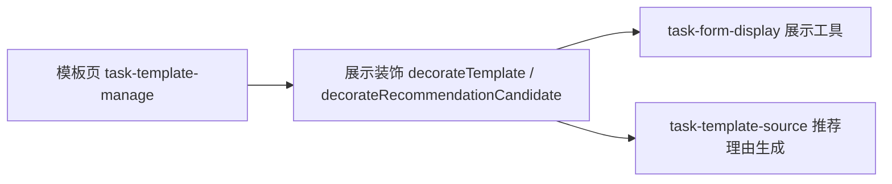

# 里程碑-21B3：模板页视觉语义与信息理解优化 详细设计文档

> **设计状态**：🟢 审核通过
> **创建日期**：2026-04-11
> **设计者**：GPT5 Codex
> **审核者**：项目维护者
> **依赖文档**：`docs/design/milestone-21b1-task-template-foundation.md`、`docs/design/milestone-21b1-ux-refinement.md`、`docs/design/milestone-21b2-template-source-completion.md`
> **预计工期**：1-2天

---

## 📋 目录

- [需求分析](#需求分析)
- [技术方案](#技术方案)
- [代码结构](#代码结构)
- [实施步骤](#实施步骤)
- [测试方案](#测试方案)
- [风险评估](#风险评估)
- [替代方案](#替代方案)

---

## 需求分析

### 功能描述

`M21B1 / M21B1-UX / M21B2` 已经完成任务模板主链路、模板来源补齐和多轮局部体验修正，但模板页在“筛选器长相”“卡片信息层级”“推荐理由表达”上仍存在明显的理解成本。用户进入模板页时，容易把筛选器误认为可直接点击使用的模板胶囊；模板卡片底部的“0次使用 / 最近未使用”对选择行为帮助很弱，反而稀释了真正重要的重复、时间、提醒等信息；推荐卡片中的“已连续2周按照这个节奏出现”表达过于抽象，用户难以理解“这个节奏”具体指什么。

本轮 `M21B3` 不新增模板能力，不扩推荐算法，不引入自定义分类，只聚焦模板页和推荐卡片的视觉语义、信息层级与可理解性收口。目标是让用户一眼看懂“这是筛选器还是模板”“这张卡片里什么信息最重要”“系统为什么推荐我保存它”。

### 业务价值

- [x] 用户价值：降低模板查找与理解成本，让选择模板和判断推荐价值更直接。
- [x] 技术价值：收口模板页表现层语义，减少后续围绕文案、卡片层级和样式反复零散修补。
- [x] 业务价值：提升模板主线的完成度，避免模板功能“能用但不够顺”的体验拖累后续 adoption。

### 功能范围

**包含**：
- ✅ 将模板页筛选器从“胶囊样式”改为与模板标签明显区分的二级筛选控件
- ✅ 重构模板卡片的信息层级，移除或弱化低价值统计信息
- ✅ 统一模板卡片与推荐卡片的关键属性展示语言，向模板编辑页“当前预览”靠拢
- ✅ 重写推荐卡片理由文案，让理由表达更具体、更易懂
- ✅ 补充对应页面测试、展示逻辑测试和推荐理由测试

**不包含**：
- ❌ 不修改推荐候选识别算法、聚类规则和排序策略
- ❌ 不新增自定义分类、收藏模板、置顶模板等新能力
- ❌ 不重做 `task-edit` 页面快捷填充区的信息架构
- ❌ 不把“任务表单共享内核重构”并入本里程碑

### 优先级

- **优先级**：P1
- **理由**：问题不影响功能正确性，但直接影响模板功能的理解成本和整体质感，属于高频体验收口项。

---

## 技术方案

### 方案概述

本方案采用“只改表现层 + 少量展示文案生成逻辑”的轻量收口方案。页面结构仍以现有 `task-template-manage` 为中心，不增加新页面、不扩服务接口，只调整筛选器样式、卡片内容组织方式以及推荐理由文本生成方式。这样可以在不扩大边界的前提下，精确解决用户已经确认的 3 个问题。

核心原则：

1. **筛选器看起来必须像筛选器**，不能再与任务编辑页中的可点击模板胶囊相似。
2. **卡片先展示用户选模板最关心的信息**，弱化“0次使用 / 最近未使用”这类低价值噪音。
3. **同类语义用同类表达**，模板页卡片中的关键属性展示语言与模板编辑页“当前预览”保持一致。
4. **推荐理由说人话**，说明“为什么被推荐”，而不是复述一个抽象判断结果。

### 技术选型

| 技术点 | 选择方案 | 替代方案 | 选择理由 |
|--------|---------|---------|---------|
| 筛选器视觉 | 二级分段筛选控件 | 保留当前胶囊筛选 | 当前胶囊与模板标签过于接近，语义混淆 |
| 卡片元信息展示 | 统一为 `label · value` 样式的轻量属性标签 | 保留当前纯值 `meta-chip` | 模板编辑页预览已验证更清晰，适合复用其语言模式 |
| 使用统计信息 | 选择页移除；管理页仅在有真实值时弱展示 | 两个 tab 都保留 `0次使用 / 最近未使用` | 零值统计没有选择价值，只会占据视觉注意力 |
| 推荐理由表达 | 按推荐来源输出可理解的中文句式 | 保留“按这个节奏出现” | 当前表达抽象，用户不理解“节奏”所指 |

### DDD分层设计

**领域层（models/）**：
- [ ] 新建模型：无
- [ ] 修改模型：无
- 说明：本期不改模板实体与候选数据结构。

**服务层（services/）**：
- [ ] 新建服务：无
- [ ] 修改服务：无
- 说明：`TaskTemplateService` 不新增接口，不调整推荐算法。

**仓储层（repositories/）**：
- [ ] 新建仓储：无
- [ ] 修改仓储：无
- 说明：不涉及存储、查询和排序口径调整。

**适配器层（adapters/）**：
- [ ] 新建适配器：无
- [ ] 修改适配器：无
- 说明：无适配器变更。

**表现层（pages/、components/）**：
- [ ] 新建页面：无
- [x] 修改页面：`packageManage/pages/task-template-manage`
- [ ] 新建组件：无
- 说明：模板页是本期唯一 UI 主改动面；同时修改少量展示工具函数以支撑一致的文案输出。

### 架构图



### 数据模型

```typescript
interface TemplateMetaItem {
  key: string;
  label: string;
  value: string;
}

interface TemplateCardViewModel {
  id?: string;
  candidateKey?: string;
  displayName: string;
  primaryDescription?: string;
  metaItems: TemplateMetaItem[];
  usageSummary?: string;
  reasonText?: string;
}
```

### 接口设计

本期不新增服务接口，仅调整前端装饰字段：

| 字段/函数 | 说明 |
|------|------|
| `decorateTemplate()` | 输出新的 `metaItems`、`primaryDescription`、`usageSummary` |
| `decorateRecommendationCandidate()` | 输出与模板卡片一致的 `metaItems`，并保留重写后的 `reasonText` |
| `buildCandidateReason()` | 将推荐理由改为可理解表达，不改候选算法 |

### 关键设计决策

#### 1. 筛选器改为二级分段筛选条

当前 `filter-pill` 与任务管理页的模板胶囊都使用圆角胶囊样式，导致用户容易误判“这也是能直接点来填充的模板”。

目标调整为：

- 搜索框下方保留筛选区，但固定改为“二级分段筛选条”，不保留其他变体
- 具体形态固定为：
  - 同一行横向排列的 3 个筛选项：`习惯 / 学习 / 兴趣`
  - 每项为圆角矩形，不使用 999rpx 胶囊
  - 高度低于任务编辑页模板胶囊，且不使用任务类型色作为默认底色
  - 未选中态：浅灰底 + 细描边 + 中性文字
  - 选中态：更深一点的浅色底 + 强一点的描边 + 深色文字
- 当屏幕较窄时允许换行，但仍保持“筛选条”形态，不得退化为模板标签式胶囊流
- 与模板胶囊的最小视觉差异要求固定为：
  - 筛选器必须带描边
  - 筛选器默认不使用类型色块
  - 筛选器圆角半径小于模板胶囊

#### 2. 模板卡片重排信息层级

当前卡片问题：

- 标题、描述、属性、使用统计都挤在同一张卡片里，但对“选择模板”最重要的是标题和关键属性
- `0次使用 / 最近未使用` 在首版模板或首次进入时几乎没有信息价值
- `template.description` 和 `taskPayload.description` 可能连续出现，信息密度偏重

目标调整为：

- **选择模板 tab**
  - 保留：模板名、类型、关键属性、必要的一行说明
  - 移除：`0次使用 / 最近未使用`
  - 描述字段只显示一行：
    - 优先 `template.description`
    - 若为空则回退 `taskPayload.description`
    - 单行省略，不允许换成两行
    - 两种说明都为空时整块不占位
    - 不再同时显示两行不同说明
- **管理模板 tab**
  - 保留：模板名、状态、类型、关键属性、必要的一行说明、更多动作
  - 使用统计改为弱摘要，并按以下规则显示：
    - `usageCount > 0 && lastUsedAt 有值`：`已使用 3 次 · 最近使用 2026-04-10`
    - `usageCount > 0 && lastUsedAt 为空`：`已使用 3 次`
    - `usageCount = 0 && lastUsedAt 有值`：`最近使用 2026-04-10`
    - `usageCount = 0 && lastUsedAt 为空`：整行不展示

#### 3. 关键属性展示语言向“当前预览”对齐

当前模板页卡片使用纯值 `meta-chip`，如“每周一三五 / 全天 / 无提醒 / 本周结束”；模板编辑页“当前预览”则使用 `label · value` 的结构，如“重复 · 每周一三五”。后者更容易理解。

本期统一为：

- `重复 · 每周一三五`
- `时间 · 09:00 - 10:00`
- `提醒 · 不提醒`
- `有效期 · 本周结束`

控制规则：

- 选择模板卡片固定展示：
  - `重复`
  - `时间`
  - 第三个属性按优先级补充：`提醒（仅在已开启时展示）` → `有效期`
- 管理模板卡片最多展示 4 个关键属性：`重复 / 时间 / 提醒 / 有效期`
- 推荐卡片与正式模板卡片使用同一套属性标签语言
- 模板编辑页“当前预览”不重做，但保持语言一致，不再形成两套说法

#### 4. 推荐理由改写为可理解句式

当前 `stable-repeat` 候选理由为：`已连续 N 周按这个节奏出现`。问题不在判断规则，而在“这个节奏”无法指向用户可理解的对象。

改写规则：

- 高频一次性任务：
  - `近60天出现了 4 次`
- 长期重复任务：
  - `这是一个长期重复任务`
- 连续自然周重复任务：
  - `近2周都出现了相同的重复安排`

说明：

- 不把具体 `repeatLabel` 硬编码进理由句子，避免与属性标签重复
- 具体重复方式继续由属性标签承载，如 `重复 · 每周一三五`
- 理由只回答“为什么推荐”，属性标签回答“它是什么”

---

## 代码结构

### 文件变更清单

**新增文件**：
- `docs/design/milestone-21b3-template-page-clarity.md` - M21B3 设计文档

**修改文件**：
- `docs/development/ROADMAP.md` - 更新 M21B3 目标与状态
- `packageManage/pages/task-template-manage/task-template-manage.js` - 调整模板/推荐卡片装饰字段
- `packageManage/pages/task-template-manage/task-template-manage.wxml` - 调整筛选器与卡片结构
- `packageManage/pages/task-template-manage/task-template-manage.wxss` - 调整筛选器和卡片样式
- `utils/task-template-source.js` - 改写推荐理由文案
- `test/pages/task-template-manage.page.test.js` - 补齐页面展示逻辑测试
- `test/utils/task-template-source.test.js` - 补齐推荐理由文案测试

### 核心代码结构

```javascript
function decorateTemplate(template, options = {}) {
  return {
    displayName,
    primaryDescription,
    metaItems,
    usageSummary
  };
}

function decorateRecommendationCandidate(candidate) {
  return {
    displayName,
    metaItems,
    reasonText
  };
}

function buildCandidateReason(latestTask, occurrences, lookbackDays, stableWeeks) {
  // 高频一次性 / 长期重复 / 连续自然周重复
}
```

### 关键函数

**函数1**：`decorateTemplate`
- **输入**：模板实体、当前 tab
- **输出**：模板卡片展示模型
- **职责**：根据选择/管理语境输出不同的信息层级
- **依赖**：`task-form-display`、`normalizeDateStrategy`

**函数2**：`decorateRecommendationCandidate`
- **输入**：推荐候选
- **输出**：推荐卡片展示模型
- **职责**：输出与正式模板卡片一致的关键属性标签
- **依赖**：`task-form-display`

**函数3**：`buildCandidateReason`
- **输入**：候选任务、出现次数、回看窗口、连续周数
- **输出**：`{ reasonCode, reasonText }`
- **职责**：生成用户可理解的推荐理由
- **依赖**：现有推荐判断结果

---

## 实施步骤

### 第1步：重写 roadmap 与锁定范围（预计0.5小时）

- [ ] **任务**：更新 `ROADMAP.md` 中 M21B3 的名称、状态和目标摘要
- [ ] **验证**：路线图不再出现“常用模板/推荐排序增强”等泛化描述
- [ ] **依赖**：无

**实施要点**：
1. 目标必须直接对应本轮 3 个真实体验问题
2. 状态切换为 `设计中`
3. 不提前写实施结果

---

### 第2步：调整模板页筛选器和卡片结构（预计4小时）

- [ ] **任务**：调整 `task-template-manage` 的 WXML/WXSS/装饰逻辑
- [ ] **验证**：筛选器与模板胶囊视觉明显区分；选择/管理两个 tab 卡片层级符合设计
- [ ] **依赖**：第1步完成

**实施要点**：
1. 筛选器改成二级筛选控件，不再使用模板胶囊式表现
2. 选择 tab 去掉低价值统计项
3. 管理 tab 的统计信息仅在真实存在时弱展示
4. 描述行单一化，避免模板说明与任务描述双层堆叠

---

### 第3步：统一关键属性语言与推荐理由（预计2小时）

- [ ] **任务**：把模板/推荐卡片关键属性统一为 `label · value` 风格，并重写推荐理由
- [ ] **验证**：模板页卡片与模板编辑页当前预览语言一致；不再出现“这个节奏”表达
- [ ] **依赖**：第2步完成

**实施要点**：
1. 优先复用现有展示工具，避免手写多套文案
2. 推荐理由只说明“为什么推荐”
3. 重复方式、时间、提醒、有效期由属性标签负责表达

---

### 第4步：补测试与回归验证（预计2小时）

- [ ] **任务**：更新页面测试和推荐理由测试
- [ ] **验证**：页面展示逻辑、推荐理由和隐藏逻辑均有自动化覆盖
- [ ] **依赖**：第2步、第3步完成

**实施要点**：
1. 覆盖选择 tab / 管理 tab 展示差异
2. 覆盖零值统计隐藏逻辑
3. 覆盖推荐理由三种句式

---

## 测试方案

### 自动化测试

- `test/pages/task-template-manage.page.test.js`
  - 选择 tab 中不再渲染 `0次使用` / `最近未使用`
  - 管理 tab 在 `usageCount = 0` 且 `lastUsedAt` 为空时隐藏统计摘要
  - 描述优先级为 `template.description > taskPayload.description`
  - 筛选器结构和卡片元信息字段符合新渲染规则
- `test/utils/task-template-source.test.js`
  - 高频一次性任务理由：`近60天出现了 N 次`
  - 长期重复任务理由：`这是一个长期重复任务`
  - 连续自然周重复任务理由：`近N周都出现了相同的重复安排`

### 手动测试

1. 打开模板页 `选择模板` tab，确认筛选器不会再被误解为可直接使用的模板标签
2. 浏览 3 张以上模板卡片，确认能先看到标题和关键属性，底部不再有无价值的 `0次使用 / 最近未使用`
3. 进入 `管理模板` tab，确认已使用过的模板可以看到弱化后的统计摘要，未使用模板不展示空统计
4. 对比模板编辑页“当前预览”和模板页卡片，确认关键属性语言一致
5. 查看推荐卡片，确认理由表达能被直接理解，不再出现“这个节奏”

### 回归测试

- 模板搜索与类型筛选仍可用
- 选择模板回填任务表单主链路不回归
- 管理模板中的更多操作、新建模板、编辑模板链路不回归
- 推荐保存为模板链路不回归

---

## 风险评估

| 风险 | 影响 | 概率 | 应对措施 |
|------|------|------|---------|
| 筛选器改样式后与顶部 `tab` 过于相似 | 中 | 中 | 使用更轻的二级控件样式，尺寸和激活态弱于顶部主 `tab` |
| `label · value` 属性标签在卡片中占宽过多 | 中 | 中 | 控制默认展示数量为 2-4 个，并允许换行 |
| 选择 tab 移除统计后，少量用户失去历史感知 | 低 | 低 | 管理 tab 仍保留有值时的弱摘要，管理语境下仍可感知使用历史 |
| 推荐理由改写后与现有测试断言不一致 | 低 | 高 | 同步更新 `task-template-source` 和页面测试断言 |

---

## 替代方案

### 方案A：只改推荐理由文案

- **优点**：改动最小，风险最低
- **缺点**：无法解决筛选器与卡片层级问题，用户仍会在模板页首屏困惑
- **结论**：不采用，收益过窄

### 方案B：继续沿用当前卡片结构，只做视觉微调

- **优点**：实现快
- **缺点**：`0次使用 / 最近未使用`、描述堆叠和属性表达不一致的问题仍在
- **结论**：不采用，不能真正解决信息理解成本

### 方案C：本期方案，聚焦模板页视觉语义和信息理解收口

- **优点**：范围可控，直接对应用户已确认的 3 个问题
- **缺点**：不解决推荐算法和模板主线其他潜在问题
- **结论**：采用，最符合当前阶段目标
