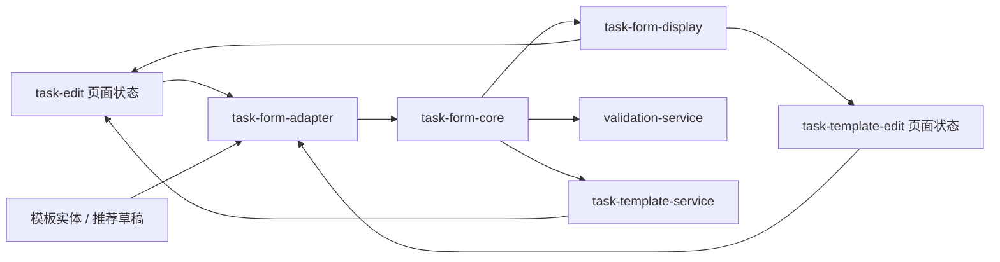

# 里程碑-21B4：任务表单共享内核重构 详细设计文档

> **设计状态**：🟢 已完成
> **创建日期**：2026-04-11
> **设计者**：GPT5 Codex
> **审核者**：项目维护者
> **依赖文档**：`docs/design/milestone-21b1-task-template-foundation.md`、`docs/design/milestone-21b1-ux-refinement.md`、`docs/design/milestone-21b2-template-source-completion.md`、`docs/design/milestone-21b3-template-page-clarity.md`
> **预计工期**：3-4天
> **完成日期**：2026-04-11

---

## 📋 目录

- [需求分析](#需求分析)
- [技术方案](#技术方案)
- [代码结构](#代码结构)
- [实施步骤](#实施步骤)
- [测试方案](#测试方案)
- [风险评估](#风险评估)
- [实施结果](#实施结果)
- [替代方案](#替代方案)

---

## 需求分析

### 功能描述

`M21B1 ~ M21B3` 已完成任务模板主链路、推荐模板和模板页体验收口，但在实现层面，`pages/task-edit/task-edit.js` 与 `packageManage/pages/task-template-edit/task-template-edit.js` 仍分别维护各自的表单草稿、默认值、校验规则、日期/重复推导和预览文案。两者业务语义高度同构，却没有统一内核，导致“同一件事在两处各写一遍”。

最近暴露的 `startTime >= endTime` 缺陷已经证明，这不是抽象重构诉求，而是会直接影响业务正确性的结构性问题。继续沿用双轨演进模式，后续每次修任务表单、模板表单、模板回填、推荐草稿时，都可能只修到其中一条链路，形成新的规则漂移。

`M21B4` 的目标不是重做 UI，也不是为了抽象而抽象，而是建立一个可复用、可测试、边界清晰的“任务表单共享内核”，把真正共通的表单语义收拢到同一个地方，让任务创建、模板编辑、模板回填和推荐草稿在同一套规则下工作。

### 业务价值

- [x] 用户价值：减少任务表单与模板表单之间的行为不一致，降低隐藏 bug 进入真实使用场景的概率。
- [x] 技术价值：统一默认值、校验、显示语义和部分交互规则，降低后续功能迭代时的双份修改成本。
- [x] 业务价值：为后续 `M21F` 前端业务后移与更多模板能力扩展打底，避免在不稳定内核上继续加功能。

### 功能范围

**包含**：
- ✅ 设计并落地共享的任务表单规范草稿模型（canonical draft）
- ✅ 抽离 `task-edit` 与 `task-template-edit` 共用的默认值、归一化与基础校验
- ✅ 抽离共用的显示语义与预览派生状态，统一“重复 / 提醒 / 星星有效期 / 结果提示”口径
- ✅ 为两个页面分别提供从页面状态到共享草稿、再从共享草稿回写页面状态的适配层
- ✅ 让 `services/validation-service.js` 与 `services/task-template-service.js` 改为消费共享内核，而不是继续保留第三套规则
- ✅ 清理迁移后废弃的重复 helper、重复校验和冗余派生逻辑
- ✅ 补齐共享内核单测、页面回归测试和模板服务回归测试

**不包含**：
- ❌ 不新增任务字段、模板字段或新的业务能力
- ❌ 不重做任务编辑页、模板编辑页的视觉和交互动线
- ❌ 不把业务逻辑整体迁移到后端，该项属于后续 `M21F`
- ❌ 不要求在本期把 `task-edit.js` 完整拆成多个页面模块，只处理与共享内核直接相关的重复职责
- ❌ 不重写推荐算法、任务热力图、首页今日任务卡片等其他模块

### 优先级

- **优先级**：P0
- **理由**：该问题已影响正确性，并且会持续放大后续模板与任务表单迭代的维护风险，属于必须先收口的底层问题。

---

## 技术方案

### 方案概述

本期采用“建立共享内核 + 双页面适配接入 + 分阶段替换旧逻辑”的方案，而不是大爆炸式把两个页面直接揉成一个页面模型。原因很明确：`task-edit` 当前仍承载大量页面级 UI 状态，`task-template-edit` 则有模板别名、说明、日期策略等模板特有字段，如果强行一次性把页面 `data` 改成完全同形，风险高且不利于回归。

依赖关系补充：

- `M21B3` 当前已完成，主要收口模板页的视觉语义与信息层级
- `M21B4` 虽会继续触及 `task-template-manage.js`，但重点是 JS 侧的数据归一化和显示输入契约，不重做 `M21B3` 已稳定的 WXML/WXSS 结构
- 因此两者不是设计上的互斥里程碑；实施时只需注意不要顺手破坏 `M21B3` 已确认通过的页面结构与样式

因此，`M21B4` 的核心设计是引入一套独立于页面 `data` 结构的共享草稿模型：

1. 页面仍保留各自的 UI 控制字段和少量场景特有字段。
2. 共通的任务语义统一映射为 `TaskFormDraft`。
3. 默认值、归一化、时间校验、重复规则、提醒文案、预览派生状态都基于 `TaskFormDraft` 计算。
4. `task-edit`、`task-template-edit`、`validation-service`、`task-template-service` 只做场景编排，不再各自保存一份规则实现。

这样做可以把“共通业务语义”和“页面展示控制”清晰分层：前者进入共享内核，后者继续留在页面。

### 现状问题拆解

#### 1. 默认值与草稿模型分裂

- `task-edit` 维护 `newTask` 默认结构，且默认重复类型为 `daily`
- `task-template-edit` 维护独立的 `createDefaultForm()`，默认重复类型为 `none`
- 两边字段命名不同：一边是嵌套 `repeat/reminder`，一边是平铺 `repeatType/repeatDays/reminderEnabled/reminderTime`

这说明“页面状态”已经代替了“业务草稿模型”，导致共享困难。

#### 2. 校验规则分裂

- `task-edit` 有页面即时校验、`validateTaskFormLocal()` 和 `ValidationService.validateTaskForm()` 三层
- `task-template-edit` 有独立 `validateForm()`
- 最近 `startTime >= endTime` 缺陷就是规则漂移的直接结果

如果继续增量修补，只会继续堆更多分叉判断。

#### 3. 显示与预览语义只共享了一半

- `utils/task-form-display.js` 已经承接了重复、提醒、星星有效期和预览文案
- 但表单草稿的默认值、归一化、时间范围判断、提醒可选项、模板日期策略解析仍分散在不同文件

结果是“显示共享了，输入规则没共享”。

#### 4. 模板服务已形成第三条规则链

- `TaskTemplateService.applyTemplateToTaskForm()` 会解析模板日期策略、回填任务表单并生成 `formPatch`
- 这条链路并不直接复用页面默认值与页面校验逻辑

如果共享内核只改页面，不改服务，仍然会保留第三套规则口径。

### 技术选型

| 技术点 | 选择方案 | 替代方案 | 选择理由 |
|--------|---------|---------|---------|
| 共享抽象层位置 | `utils/` 下新增共享表单内核模块 | 放在 `services/` 中 | 该逻辑本质是前端本地纯函数规则，页面和服务都要消费，不适合作为流程型 service |
| 共享方式 | canonical draft + adapter | 直接强制两个页面使用同一份 `data` 结构 | 渐进迁移风险更低，也更符合当前页面现实结构 |
| 显示语义收口 | 保留并扩展 `task-form-display` | 新起一套显示模块 | 该文件已被多处复用，是现成切入点，继续扩展收益更高 |
| 迁移策略 | 分阶段替换旧 helper，并在完成后删除废弃代码 | 一次性大改所有相关文件 | 当前任务编辑页体量过大，一次性改造回归风险过高 |
| 校验接入 | `ValidationService` 变为共享内核的薄包装 | 保留页面层与服务层双份实现 | 统一规则入口，避免继续漂移 |

### DDD分层设计

**领域层（models/）**：
- [ ] 新建模型：无
- [ ] 修改模型：无
- 说明：本期不新增领域实体，不改变 `Task` / `TaskTemplate` 的持久化结构。

**服务层（services/）**：
- [x] 修改服务：`services/validation-service.js`
- [x] 修改服务：`services/task-template-service.js`
- 说明：前者改为消费共享校验；后者改为通过共享内核完成模板回填草稿与显示态派生。

**仓储层（repositories/）**：
- [ ] 新建仓储：无
- [ ] 修改仓储：无
- 说明：本期不涉及存储读写口径变更。

**共享工具层（utils/）**：
- [x] 新建模块：`utils/task-form-core.js`
- [x] 新建模块：`utils/task-form-adapter.js`
- [x] 修改模块：`utils/task-form-display.js`
- [x] 修改模块：`utils/task-template-utils.js`
- 说明：共享内核、适配器和显示派生都放在 `utils/` 层，以纯函数形式提供可复用能力。

**表现层（pages/、components/）**：
- [x] 修改页面：`pages/task-edit/task-edit.js`
- [x] 修改页面：`packageManage/pages/task-template-edit/task-template-edit.js`
- [ ] 新建页面：无
- [ ] 新建组件：无
- 说明：页面只保留 UI 事件编排、面板开关和场景特有字段，不再维护重复业务规则。

### 架构图



### 数据模型

```typescript
interface TaskFormDraft {
  title: string;
  description: string;
  type: 'habit' | 'study' | 'interest';
  points: number;
  pointsExpiry: 'permanent' | 'week' | 'month' | 'quarter';
  isRequired: boolean;
  isAllDay: boolean;
  startDate: string;
  endDate: string;
  hasNoEndDate: boolean;
  startTime: string;
  endTime: string;
  repeatType: 'none' | 'daily' | 'weekly' | 'workdays' | 'weekends' | 'custom';
  repeatDays: number[];
  reminderEnabled: boolean;
  reminderTime: number;
  dateStrategy: {
    mode: 'today' | 'inherit-repeat-rule';
    autoShiftExpiredEndDate: boolean;
    endMode: 'same-day' | 'week-end' | 'month-end' | 'duration' | 'no-end';
    durationDays: number | null;
  };
}

interface TaskFormValidationResult {
  valid: boolean;
  errorMsg: string;
}

interface TaskFormDisplayState {
  repeatText: string;
  reminderText: string;
  pointsExpiryText: string;
  repeatPreviewText: string;
  repeatTypeWarning: boolean;
  resultPrimaryText: string;
  resultSecondaryText: string;
  weekdaySelection: boolean[];
  isRepeatOptionDisabled: boolean;
  previewChips: Array<{ key: string; label: string; value: string }>;
}
```

说明：

- `TaskFormDraft.dateStrategy` 在共享草稿中表示“标准化后的日程策略视图”，不是说任务实体未来也要持久化这个字段
- 对任务场景，它是一个派生后的规范字段，用来统一单次任务、重复任务、模板预览和模板回填时的结束语义
- 对模板场景，它同时承担模板保存时 `dateStrategy` 的输出来源
- 这样做的目的，是避免把“结束方式/持续天数/长期有效”这套语义拆散到多个函数额外传参，重新制造另一种分叉

### 接口设计

**新增共享内核接口**：

| 方法 | 说明 | 参数 | 返回值 |
|------|------|------|--------|
| `createTaskFormDraft(scene, options)` | 生成场景默认草稿 | `('task' \| 'template', { today? })` | `TaskFormDraft` |
| `normalizeTaskFormDraft(input, options)` | 把不完整输入归一化为标准草稿 | `{...}` | `TaskFormDraft` |
| `validateTaskFormDraft(draft, options)` | 执行共享校验 | `(draft, { scene })` | `TaskFormValidationResult` |
| `buildTaskPayloadFromDraft(draft)` | 生成任务创建 payload | `TaskFormDraft` | `taskPayload` |
| `buildTemplatePayloadFromDraft(draft, meta)` | 生成模板 payload + dateStrategy | `TaskFormDraft` | `{ taskPayload, dateStrategy }` |
| `resolveTaskScheduleFromDraft(draft, context)` | 按给定参考日解析真实任务日期区间 | `(TaskFormDraft, { today })` | `{ startDate, endDate, hasNoEndDate, repeatStartDate, repeatEndDate }` |
| `buildReminderOptionsFromDraft(draft)` | 生成提醒选项 | `TaskFormDraft` | `Array<{ label, enabled, time }>` |
| `resolveDefaultTimeRange(options)` | 生成非全天默认时间范围 | `{ now? }` | `{ startTime, endTime }` |
| `resolveAdjustedEndTime(startTime, currentEndTime, options)` | 在开始时间变化后推导结束时间 | `{ startTime, currentEndTime }` | `{ endTime, adjusted }` |

**共享显示接口**：

| 方法 | 说明 | 参数 | 返回值 |
|------|------|------|--------|
| `buildTaskFormDisplayState(draft, options)` | 生成统一显示态 | `TaskFormDraft` | `TaskFormDisplayState` |

**新增适配器接口**：

| 方法 | 说明 |
|------|------|
| `adaptTaskEditStateToDraft(newTask)` | `task-edit` 的 `newTask` -> `TaskFormDraft` |
| `adaptTemplateEditFormToDraft(form)` | `task-template-edit` 的 `form` -> `TaskFormDraft` |
| `adaptTemplateEntityToDraft(template)` | 模板实体 -> `TaskFormDraft` |
| `buildTaskEditPatchFromDraft(draft)` | `TaskFormDraft` -> `task-edit` 所需 `newTask` 补丁 |
| `buildTemplateEditPatchFromDraft(draft, meta)` | `TaskFormDraft` -> `task-template-edit` 所需 `form` 补丁 |

### 关键设计决策

#### 1. 不直接统一页面 `data`，而是统一 canonical draft

原因：

- `task-edit` 有大量页面级临时状态，如面板显隐、撤销入口、模板入口、热力图等
- `task-template-edit` 还有模板别名、模板说明、启用状态、推荐来源提示等模板特有字段

这类字段不属于共享内核。如果为了“字段完全一致”而把页面 `data` 强行揉平，只会增加噪音。共享内核只统一真正的任务表单语义。

#### 2. 共享内核只产出纯函数结果，不直接操作页面实例

共享模块只负责：

- 创建默认草稿
- 归一化输入
- 校验
- 生成任务 / 模板 payload
- 生成显示态
- 生成必要的派生值，如提醒选项、重复匹配结果、结束策略描述

页面层仍负责：

- `setData`
- 面板开关
- toast、导航、弹窗
- 页面埋点与日志

这样可以保证共享内核单测稳定，不被页面框架耦合。

补充约束：

- 前端现有重复的 `parseTimeToSeconds` 逻辑，在本期前端侧统一收敛到 `task-form-core` 内部 helper
- `pages/task-edit/task-edit.js` 与 `services/validation-service.js` 不再各自持有独立的时间解析实现
- 后端 `backend/models/Task.js` 保持独立实现，不与前端共享代码文件；原因是前后端运行时和发布边界不同，本期不做跨端公共包治理

#### 3. 共用规则与场景特有规则分开建模

共享规则：

- 标题必填
- 非全天任务必须有开始/结束时间
- 结束时间必须晚于开始时间
- 自定义重复必须至少选择一个星期
- 星星、提醒、重复类型、时间格式归一化
- 预览文案、重复结果、提醒文字、有效期文字

任务场景特有规则：

- 必须有 `startDate`
- 重复任务在非“无结束日期”时必须有 `endDate`
- `endDate >= startDate`

模板场景特有规则：

- 模板别名和模板说明长度限制
- 当 `repeatType !== none` 且 `endMode = duration` 时，`durationDays >= 1`
- 模板日期策略输出必须完整，供后续回填任务使用

#### 4. `ValidationService` 降级为共享校验包装层

`services/validation-service.js` 仍保留对页面的调用接口，避免本期波及过大，但内部不再自己维护任务时间、重复和日期判断，而是转调共享内核。这样旧调用点不需要全部重写，同时规则真正统一。

#### 5. `TaskTemplateService` 必须并入共享内核消费方

`TaskTemplateService.applyTemplateToTaskForm()` 当前会自行解析模板日期策略并拼装任务编辑页的显示补丁。如果这里不跟随共享内核一起改造，仍会保留“页面一套、模板服务一套”的隐患。

本期要求它改为：

1. 模板实体 -> `TaskFormDraft`
2. 只能通过 `resolveTaskScheduleFromDraft(draft, { today })` 解析实际日期
3. 用共享显示态生成 `repeatText / reminderText / repeatPreviewText / weekdaySelection`
4. 回写为 `task-edit` 能直接消费的补丁

禁止继续在 `TaskTemplateService` 内保留独立的日期解析私有实现；如果实施中仍需要私有 helper，也必须退化为对共享接口的薄包装。

#### 6. 本期要显式清理废弃代码

迁移完成后必须删除以下重复职责，不保留“新旧两套长期并存”：

- `task-template-edit.js` 内部的 `createDefaultForm`
- `task-template-edit.js` 内部的 `buildFormPayload`
- `task-template-edit.js` 内部的 `buildDateStrategyFromForm`
- `task-template-edit.js` 内部与共享内核重复的 `validateForm` 细节实现
- `task-edit.js` 内部与共享校验重复的时间范围判断片段
- `ValidationService` 中与共享校验重复的具体规则分支

#### 7. 交互规则责任必须显式拆分

本期不仅统一“提交前校验”，还要统一最容易漂移的编辑态规则。责任边界固定如下：

| 规则 | 归属 | 说明 |
|------|------|------|
| 提醒选项生成 | shared-core | 两页当前各维护一套，必须统一为 `buildReminderOptionsFromDraft()` |
| 非全天默认时间范围 | shared-core | 由 `resolveDefaultTimeRange()` 产出；页面只负责在合适时机调用 |
| 开始时间变化后的结束时间自动调整 | shared-core | 由 `resolveAdjustedEndTime()` 产出；页面决定是否 toast |
| 重复预览、星期匹配、结束策略说明 | shared display | 继续由 `task-form-display` 承担，但输入统一为 canonical draft |
| 面板显隐、toast、导航、埋点 | 页面层 | 明确不进入共享内核 |
| 模板别名/说明、推荐来源提示 | 模板页面层 | 明确不进入共享内核 |

这样可以避免实施后只统一了提交逻辑，却继续保留两页不同的编辑态行为。

#### 8. `task-form-display` 的输入契约改为严格 `TaskFormDraft`

本期 `buildTaskFormDisplayState()` 的目标输入不再是当前“松散 form 对象”，而是标准化后的 `TaskFormDraft`。这意味着：

1. `task-edit`、`task-template-edit`、`task-template-manage`、`task-template-service` 在进入显示层前，必须先通过 adapter 或兼容归一化入口得到 `TaskFormDraft`
2. `task-form-display` 内部不再承担“猜字段形态”的职责
3. 老调用点若暂未直接改成 adapter，也必须至少经过兼容入口归一化后再调用显示层

这样做的目的，是让显示层建立稳定输入契约，避免继续接受多种半结构化对象。

---

## 代码结构

### 文件变更清单

**新增文件**：
- `utils/task-form-core.js` - 共享草稿模型、默认值、归一化、校验、payload 构建
- `utils/task-form-adapter.js` - 页面状态、模板实体与共享草稿之间的双向适配
- `test/utils/task-form-core.test.js` - 共享内核单测
- `test/utils/task-form-adapter.test.js` - 适配层单测

**修改文件**：
- `utils/task-form-display.js` - 改为围绕 canonical draft 生成显示态
- `utils/task-template-utils.js` - 改为模板专有兼容入口；保留现有导出名，但内部委托共享内核，避免打断既有消费者
- `utils/task-template-source.js` - 改为消费共享归一化/显示语义，不再复制模板草稿相关规则
- `services/validation-service.js` - 改为调用共享校验
- `services/task-template-service.js` - 改为通过共享内核完成模板回填和显示态派生
- `models/task-template.js` - 改为通过兼容入口消费共享归一化，保持模型层行为不回归
- `pages/task-edit/task-edit.js` - 接入 adapter + core，删除重复默认值/校验/派生逻辑
- `packageManage/pages/task-template-edit/task-template-edit.js` - 接入 adapter + core，删除重复默认值/校验/payload 构建逻辑
- `packageManage/pages/task-template-manage/task-template-manage.js` - 改为继续通过兼容入口/共享显示消费模板展示所需归一化结果
- `test/pages/task-edit.page.test.js` - 调整任务编辑页回归测试
- `test/pages/task-template-edit.page.test.js` - 调整模板编辑页回归测试
- `test/pages/task-template-manage.page.test.js` - 验证管理页对兼容导出与共享显示的消费不回归
- `test/services/validation-service.test.js` - 验证包装层未丢失行为
- `test/services/task-template-service.test.js` - 验证模板回填与共享显示态一致
- `test/models/task-template.test.js` - 验证模型层仍能通过兼容归一化入口工作

**兼容说明**：
- `normalizeTaskPayload / normalizeDateStrategy / createEmptyTaskPayload` 这组既有导出在本期不删除
- 其内部实现可迁移到 `task-form-core`，但 `models/task-template.js`、`task-template-manage.js`、`task-template-source.js` 等调用点在本期不强制全部改名
- 待 `M21B4` 落地并稳定后，再评估是否在后续里程碑中继续收口导出层
- `task-form-display` 对外的主输入契约改为 `TaskFormDraft`；对尚未直接接入 adapter 的消费者，通过兼容归一化入口过渡，不再直接传入松散对象

### 核心代码结构

```javascript
// utils/task-form-core.js

function createTaskFormDraft(scene, options = {}) {}
function normalizeTaskFormDraft(input, options = {}) {}
function validateTaskFormDraft(draft, options = {}) {}
function buildTaskPayloadFromDraft(draft) {}
function buildTemplatePayloadFromDraft(draft, meta = {}) {}
function resolveTaskScheduleFromDraft(draft, context = {}) {}
function buildReminderOptionsFromDraft(draft) {}
function resolveDefaultTimeRange(options = {}) {}
function resolveAdjustedEndTime(startTime, currentEndTime, options = {}) {}

module.exports = {
  createTaskFormDraft,
  normalizeTaskFormDraft,
  validateTaskFormDraft,
  buildTaskPayloadFromDraft,
  buildTemplatePayloadFromDraft,
  resolveTaskScheduleFromDraft,
  buildReminderOptionsFromDraft,
  resolveDefaultTimeRange,
  resolveAdjustedEndTime
};
```

```javascript
// utils/task-form-adapter.js

function adaptTaskEditStateToDraft(newTask) {}
function adaptTemplateEditFormToDraft(form) {}
function adaptTemplateEntityToDraft(template) {}
function buildTaskEditPatchFromDraft(draft) {}
function buildTemplateEditPatchFromDraft(draft, meta = {}) {}
```

```javascript
// pages/task-edit/task-edit.js

const draft = taskFormAdapter.adaptTaskEditStateToDraft(this.data.newTask);
const validation = taskFormCore.validateTaskFormDraft(draft, { scene: 'task' });
const displayState = taskFormDisplay.buildTaskFormDisplayState(draft);
```

### 关键函数

**函数1**：`createTaskFormDraft(scene, options)`
- **输入**：场景类型、可选 `today`
- **输出**：标准化默认草稿
- **职责**：统一任务表单与模板表单的默认业务值，不再让页面各自维护默认语义
- **依赖**：`dateUtils`、常量枚举

**函数2**：`validateTaskFormDraft(draft, { scene })`
- **输入**：标准草稿、场景类型
- **输出**：统一校验结果
- **职责**：执行共享规则和场景规则，作为任务表单与模板表单的唯一业务校验入口
- **依赖**：时间解析工具、重复规则工具

**函数3**：`buildTemplatePayloadFromDraft(draft, meta)`
- **输入**：标准草稿、模板元信息
- **输出**：`{ taskPayload, dateStrategy }`
- **职责**：统一模板保存输出，替换 `task-template-edit` 中本地拼装逻辑
- **依赖**：日期策略规则、payload 归一化

**函数4**：`resolveTaskScheduleFromDraft(draft, { today })`
- **输入**：标准草稿、参考日
- **输出**：解析后的真实日期区间
- **职责**：作为模板回填到任务页时的唯一日期物化入口，替换 `TaskTemplateService` 私有日期解析逻辑
- **依赖**：日期策略规则、自然周/月结束规则

**函数5**：`buildTaskFormDisplayState(draft, options)`
- **输入**：标准草稿
- **输出**：预览胶囊、重复提示、提醒文字、星期选中状态等显示态
- **职责**：统一所有表单相关显示语义
- **依赖**：`task-form-display` 内部格式化函数；该函数继续保留在显示模块中，不并入 `task-form-core`

---

## 实施步骤

### 第1步：建立共享草稿与基础校验（预计0.5天）

- [ ] **任务**：新增 `task-form-core`，定义 canonical draft、默认值、归一化和共享校验
- [ ] **验证**：新增核心单测覆盖任务/模板两场景的默认值与校验矩阵
- [ ] **依赖**：无

**实施要点**：
1. 先把默认值、时间解析、重复归一化、提醒归一化放入纯函数
2. 在这一步同时定义 `resolveTaskScheduleFromDraft / resolveDefaultTimeRange / resolveAdjustedEndTime`
3. 兼容导出策略先设计好，避免第二步接页面时又临时返工
4. 校验结果保持简单稳定，只返回 `valid/errorMsg`
5. 先不接页面，先把核心规则单测跑稳
6. 本步完成后先跑共享内核与兼容层测试，再进入下一步，不跨步并行堆改动

---

### 第2步：建立 adapter 并接管显示态（预计1天）

- [ ] **任务**：新增 `task-form-adapter`，并让 `task-form-display` 改为消费标准草稿
- [ ] **验证**：适配层单测覆盖 task-edit / task-template-edit / template entity 三种输入来源
- [ ] **依赖**：第1步完成

**实施要点**：
1. 页面状态与共享草稿的映射必须可逆
2. 保持现有显示文案不发生无意变化
3. `task-template-service` 需要能够基于模板实体直接生成草稿
4. `task-template-utils` 在此步完成兼容委托，保证既有调用点先不断裂
5. 本步完成后先跑 adapter / display / 模板管理页相关测试，再进入第3步

---

### 第3步：迁移 `task-edit` 与 `ValidationService`（预计1天）

- [ ] **任务**：让任务编辑页和 `ValidationService` 统一走共享校验与显示派生
- [ ] **验证**：任务编辑页单测、`validation-service` 单测全部通过
- [ ] **依赖**：第1步、第2步完成

**实施要点**：
1. 保留现有页面交互入口，不改变用户动线
2. `getReminderOptions / toggleAllDay / onStartTimeChange / checkAndAdjustEndTime` 改为调用共享 helper
3. 删除或收缩 `validateTaskFormLocal` 内部重复业务判断
4. 明确“页面级即时反馈”和“共享业务校验”之间的责任边界
5. 本步完成后必须先跑任务编辑页相关回归和当前全量测试，再进入第4步

---

### 第4步：迁移 `task-template-edit` 与 `TaskTemplateService`（预计1天）

- [ ] **任务**：模板编辑页、模板回填服务改为共享草稿编排，并删除旧 helper
- [ ] **验证**：模板编辑页、模板服务、模板回填回归测试通过
- [ ] **依赖**：前3步完成

**实施要点**：
1. 模板编辑页不再维护独立 payload/dateStrategy 拼装逻辑
2. 模板服务必须通过 `resolveTaskScheduleFromDraft` 和共享显示态生成逻辑完成回填
3. `models/task-template`、`task-template-manage`、`task-template-source` 的兼容消费者必须完成回归验证
4. 迁移后清理废弃代码，避免长期保留双轨实现
5. 本步结束后再跑一次全量测试，作为里程碑实施收口门槛

---

## 测试方案

### 单元测试

- `test/utils/task-form-core.test.js`
  - 任务场景默认值
  - 模板场景默认值
  - 非全天时间校验
  - 自定义重复星期校验
  - 模板 `durationDays` 校验
  - 日期策略输出
  - `resolveTaskScheduleFromDraft` 的自然周/自然月/持续天数解析
  - `resolveDefaultTimeRange / resolveAdjustedEndTime / buildReminderOptionsFromDraft`
- `test/utils/task-form-adapter.test.js`
  - `task-edit` -> draft -> patch
  - `task-template-edit` -> draft -> patch
  - 模板实体 -> draft

### 页面测试

- `test/pages/task-edit.page.test.js`
  - 任务编辑页提交流程仍能正确创建 payload
  - 全天/非全天、重复/不重复、模板回填后的显示态不回归
  - 全天切换默认时间、开始时间变化后的结束时间自动调整不回归
- `test/pages/task-template-edit.page.test.js`
  - 模板默认值与预览胶囊不回归
  - 保存模板输出的 `taskPayload/dateStrategy` 与预期一致
- `test/pages/task-template-manage.page.test.js`
  - 管理页消费兼容归一化入口后，模板卡片显示不回归

### 服务测试

- `test/services/validation-service.test.js`
  - 包装层对外返回格式不变
  - 共享校验错误信息正确透出
- `test/services/task-template-service.test.js`
  - `applyTemplateToTaskForm` 的 `formPatch` 仍与页面期望一致
  - 模板日期策略与共享显示态一致
  - 真实日期区间必须来自 `resolveTaskScheduleFromDraft`

### 模型与兼容测试

- `test/models/task-template.test.js`
  - 模板模型继续通过兼容导出完成任务 payload / dateStrategy 归一化
- `test/utils/task-template-source.test.js`（如已有则补充，否则新增）
  - 推荐草稿构建继续复用兼容归一化，不因共享内核落地而改坏

### 回归重点

- `startTime >= endTime` 不能再次漏校验
- 重复任务的日期范围、自然周/自然月结束语义不能回归
- 模板推荐草稿进入编辑页后，预览文案与正式模板编辑态必须一致
- 页面撤销、快速填充、模板回填后的显示状态不能因共享适配改造而错乱

---

## 风险评估

### 风险1：共享抽象过度，反而让页面可读性变差

- **风险说明**：如果把页面级交互也硬塞进共享内核，会形成一个新的“大而全工具文件”
- **缓解措施**：只抽纯业务规则与草稿适配，不抽面板开关、toast、导航和埋点

### 风险2：模板场景与任务场景被错误地“一刀切”

- **风险说明**：模板有日期策略，任务有绝对日期，两者不能简单混为一个保存模型
- **缓解措施**：统一 canonical draft，但保留 `scene` 和 `dateStrategy`，通过 adapter 做场景转换

### 风险3：迁移过程中新旧逻辑同时存在，产生隐藏分叉

- **风险说明**：如果共享内核接入后没有删除旧 helper，后续仍可能误改旧逻辑
- **缓解措施**：本期把“删除冗余代码”作为明确交付项，并在 code review 中重点检查

### 风险4：页面测试覆盖不够，导致行为回归

- **风险说明**：任务编辑页体量大，页面单测不足时容易出现局部交互回归
- **缓解措施**：优先补核心矩阵测试，并保留最近暴露问题的回归用例

### 风险5：`task-edit.js` 在本期后仍然偏大

- **风险说明**：`M21B4` 主要目标是统一共享规则，不是彻底拆解 `task-edit.js`。即使完成共享内核接入，页面文件仍可能维持较大体量
- **缓解措施**：本期接受这一残余风险，但要求至少删除与共享内核重复的默认值、校验和派生逻辑；页面模块化拆分留待后续文件治理型里程碑处理

---

## 实施结果

### 实际落地

- 已新增 `utils/task-form-core.js`，统一默认值、归一化、时间校验、日期策略解析、提醒选项和 payload 构建
- 已新增 `utils/task-form-adapter.js`，承接 `task-edit`、`task-template-edit` 与模板实体之间的 draft/patch 转换
- `pages/task-edit/task-edit.js`、`packageManage/pages/task-template-edit/task-template-edit.js`、`services/validation-service.js`、`services/task-template-service.js` 已接入共享内核
- `utils/task-template-utils.js` 已改为兼容导出层，内部委托共享内核
- `task-edit` 与 `task-template-edit` 现已统一为“先校验原始输入，再构建归一化结果”的提交流程，避免无效输入被静默默认化

### 实际验证

- 定向回归通过：
  - `test/utils/task-form-core.test.js`
  - `test/utils/task-form-adapter.test.js`
  - `test/pages/task-edit.page.test.js`
  - `test/pages/task-template-edit.page.test.js`
  - `test/services/validation-service.test.js`
- 全量前端测试通过：
  - `npm test -- --runInBand`
  - 结果：`88 suites / 1869 tests` 全绿
- 手工验收通过：
  - 全天任务、非全天任务、重复任务、推荐模板转正式模板的主链路正常
  - 重复任务缺结束日期、非全天任务缺时间、模板 `durationDays=0/空值` 的失败拦截已确认生效

---

## 替代方案

### 方案A：继续沿用现有结构，只做点状修补

**优点**：
- 改动小，短期见效快

**缺点**：
- 不能解决双轨规则漂移
- 后续每次改任务表单或模板表单都还要双份修改
- 很容易再次出现“一个入口修了，另一个入口没修”的问题

**结论**：
- 不采用。近期真实 bug 已证明该方案不可持续。

### 方案B：一次性把两个页面改成完全同一份 `data` 结构

**优点**：
- 理论上最统一

**缺点**：
- 任务编辑页与模板编辑页的 UI 状态和特有字段差异仍然客观存在
- 改动面过大，回归风险高
- 会把页面控制字段和业务草稿字段混在一起

**结论**：
- 不采用。本期更适合用 canonical draft + adapter 渐进重构。

### 方案C：只把显示态继续下沉，不处理默认值与校验

**优点**：
- 改动最小

**缺点**：
- 只能解决文案一致，不能解决正确性问题
- `startTime >= endTime` 一类问题仍可能在其他入口重复出现

**结论**：
- 不采用。本期必须覆盖默认值、校验和 payload 生成。
