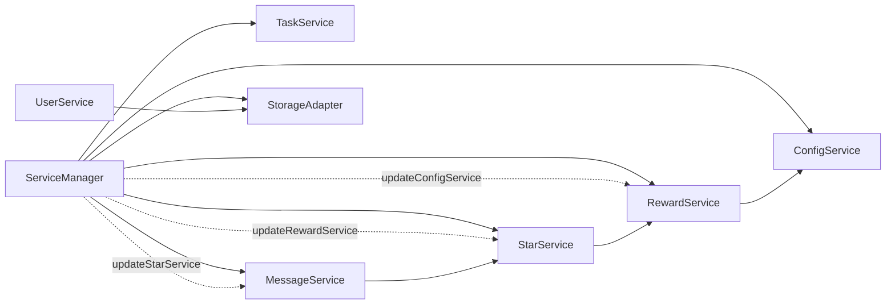

# 里程碑-21D：服务层依赖边界收口 详细设计文档

> **设计状态**：🟢 已审核（可实施）
> **创建日期**：2026-04-15
> **设计者**：GPT5 Codex
> **审核者**：项目维护者
> **预计工期**：2-3天

---

## 📋 目录

- [需求分析](#需求分析)
- [技术方案](#技术方案)
- [代码结构](#代码结构)
- [实施步骤](#实施步骤)
- [测试方案](#测试方案)
- [风险评估](#风险评估)
- [替代方案](#替代方案)
- [审核要点自检](#审核要点自检)
- [审核记录](#审核记录)

---

## 需求分析

### 功能描述

经过最近几轮治理，当前项目的主分层已经基本守住：页面和组件没有明显直接越过服务层去操作仓储，任务域和消息域也已经形成了 `facade + 内部模块` 的可维护结构。当前最值得处理的结构问题，不在页面层，而在服务层内部仍残留少量“反向依赖”和“基础设施泄漏”。

基于实际代码复核，前端服务层目前还存在以下几类问题：

1. 个别 service 在运行过程中动态 `require('./service-manager')`，再回头拿别的 service。
2. 个别 service 仍直接调用 `wx.getStorageSync / wx.setStorageSync`，没有统一走 `StorageAdapter / ConfigService`。
3. `task-service.js` 顶部存在仅为类型注释服务的 `require('./index')`，引入了没必要的运行时索引耦合。

这些问题现在未必会立刻造成功能 bug，但它们会持续抬高以下成本：

- 初始化时序和循环依赖的定位成本
- 单元测试 mock 成本
- 后续继续拆分 `star-service.js`、`reward-service.js` 时的迁移复杂度

因此，`M21D` 的目标不是新增业务能力，也不是立即大拆所有大文件，而是先把“服务层依赖边界”收口干净，为后续 `M21E` 的内部模块化拆分打地基。

### 事实基线（2026-04-15，设计前）

#### 1. `reward-service.js` 仍会反向依赖 `service-manager`

[`services/reward-service.js`](/Users/wangdafei/code/study_task_wechat/services/reward-service.js) 初始化逻辑里会动态 `require('./service-manager')`，再取 `configService` 读取 `has_custom_rewards`。  
这意味着：

- `RewardService` 不是纯粹依赖注入
- service 自己回头找 manager，形成 service ← manager 的反向路径
- 未来继续拆 `reward-service` 时，很容易把这种耦合继续扩散

#### 2. `star-service.js` 仍会反向依赖 `service-manager`

[`services/star-service.js`](/Users/wangdafei/code/study_task_wechat/services/star-service.js) 的 `protectRewardsByExpiry()` 中，会动态 `require('./service-manager')`，再取 `rewardService`。  
这说明 `StarService` 在部分路径下没有显式依赖边界，而是运行时临时回头取另一个 service。

#### 3. `message-service.js` 仍会反向依赖 `service-manager`

[`services/message-service.js`](/Users/wangdafei/code/study_task_wechat/services/message-service.js) 的 `_syncExpiryAuthorityBeforeFormalReminders()` 中，会动态 `require('./service-manager')` 获取 `starService`。  
这导致消息域在正式提醒同步前，又临时引入了 manager 作为中介，而不是通过构造或更新方法显式接入依赖。

#### 4. `reward-service.js` 与 `user-service.js` 仍有 `wx storage` 直连

实际代码确认：

- [`services/reward-service.js`](/Users/wangdafei/code/study_task_wechat/services/reward-service.js) 在降级路径直接 `wx.getStorageSync('has_custom_rewards')`
- [`services/user-service.js`](/Users/wangdafei/code/study_task_wechat/services/user-service.js) 在会话恢复和持久化中仍有 `wx.getStorageSync('currentUserId')`、`wx.setStorageSync('currentUserId', ...)`

这与当前仓库已经存在的：

- [`services/config-service.js`](/Users/wangdafei/code/study_task_wechat/services/config-service.js)
- [`adapters/storage-adapter.js`](/Users/wangdafei/code/study_task_wechat/adapters/storage-adapter.js)

形成了重复入口，也让 service 层继续带着平台实现细节。

#### 5. `task-service.js` 有没必要的运行时索引依赖

[`services/task-service.js`](/Users/wangdafei/code/study_task_wechat/services/task-service.js) 顶部 `const { StarService } = require('./index');` 当前只用于 JSDoc 注释。  
这不是功能 bug，但它引入了 service 主文件对 `services/index.js` 的运行时依赖，没有实际收益，反而增加潜在环依赖风险。

#### 6. `service-manager.js` 已具备注入收口条件

[`services/service-manager.js`](/Users/wangdafei/code/study_task_wechat/services/service-manager.js) 当前已经支持：

- 在初始化时统一创建各 service
- 在初始化后调用 `updateUserService()`、`updateStarService()`、`updateTaskService()`、`updateOfflineQueueService()`

这说明本期不需要引入新的 DI 框架，也不需要重写 service manager。  
只要继续沿用现有“构造注入 + updateXxxService 补注入”的模式，就能完成本期边界收口。

### 业务价值

- [x] 用户价值：不直接新增用户可见功能，但能降低后续治理引入回归的概率。
- [x] 技术价值：降低 service 层环依赖、初始化时序耦合和 mock 成本。
- [x] 维护价值：为 `M21E` 继续拆分 `star-service.js`、`reward-service.js` 提供稳定边界。

### 功能范围

**包含**：
- ✅ 收口 `RewardService / StarService / MessageService` 对 `service-manager` 的反向依赖
- ✅ 收口 `RewardService / UserService` 中仍残留的 `wx storage` 直连
- ✅ 去掉 `task-service.js` 对 `services/index.js` 的无效运行时依赖
- ✅ 在 `service-manager.js` 中补齐必要的显式 service 注入
- ✅ 保持现有 service 对外公开 API、返回结构和业务语义不变
- ✅ 为本期新增或修改的依赖注入路径补齐单元测试与回归测试

**不包含**：
- ❌ 不在本期拆分 `star-service.js` 或 `reward-service.js` 内部大文件实现
- ❌ 不修改页面、组件或 WXML 绑定
- ❌ 不新增后端 REST 接口
- ❌ 不重写 `service-manager.js` 为通用容器
- ❌ 不统一前后端 service 层抽象

### 优先级

- **优先级**：P1
- **理由**：这是当前结构治理里 ROI 最高的一步。它不改业务规则、不动页面主流程，但能显著降低后续 `M21E` 拆分和日常维护的风险。

---

## 技术方案

### 方案概述

`M21D` 采用“依赖注入补齐 + 平台访问收口 + 保持 facade 不动”的保守治理方案。

核心原则如下：

1. **不改公开 API，只改依赖获得方式**  
   `RewardService / StarService / MessageService / UserService / TaskService` 的对外方法名、参数和返回结构都保持不变。

2. **service 不再反向拿 manager**  
   service 间依赖要么在构造时注入，要么通过 `updateXxxService()` 在 manager 初始化后补齐，不允许在业务流程里动态 `require('./service-manager')`。

3. **service 不再直接碰 `wx storage`**  
   普通配置和会话持久化统一走 `ConfigService` 或 `StorageAdapter`。本期纳入范围的前端 service 不再保留 `wx storage` 直连分支。

4. **本期不拆大文件，只先清边界**  
   `M21D` 是 `M21E` 的前置治理，不在本期同时做内部模块切片，避免“边收口边搬家”增加回归面。

### 关键设计决策

#### 决策1：`service-manager` 继续保留单例，但只做显式注入

本期不重做 `service-manager`，也**不重排现有稳定的服务创建顺序**。  
继续沿用当前模式：

- 构造阶段注入已有稳定依赖
- 初始化完成后，补齐跨 service 的 `updateXxxService()`

新增/补齐的注入关系：

- `RewardService.updateConfigService(configService)`
- `StarService.updateRewardService(rewardService)`
- `MessageService.updateStarService(starService)`

这样做的原因：

- 仓库里已经有 `updateUserService / updateStarService / updateTaskService / updateOfflineQueueService`
- 延续同一模式，学习成本和实现风险都最低
- 当前 `service-manager` 启动主链路已经稳定，本期只补注入，不改既有创建顺序

#### 决策2：`RewardService` 不再在初始化中反向查 `configService`

当前 `RewardService.initialize()` 为了判断 `has_custom_rewards`，会：

1. 动态 `require('./service-manager')`
2. 再从 manager 里拿 `configService`
3. 最后在更差的降级路径直连 `wx.getStorageSync`

本期改为：

- `RewardService` 新增 `configService` 依赖
- 优先使用 `this.configService.hasCustomRewards()`
- 如未注入，则退化到 `this.storageAdapter.get('has_custom_rewards')`
- 不再在 service 中动态拿 manager，也不再直接访问 `wx`

补充约束：

- `service-manager` 必须在首次调用 `RewardService.initialize()` 之前，通过构造参数或 `updateConfigService()` 完成注入
- 本期不允许为了这项注入去重排整体启动链路，只在现有创建顺序后补一次显式注入

#### 决策3：`StarService` 显式持有 `rewardService`

当前 `StarService.protectRewardsByExpiry()` 需要调用奖励域能力，因此会临时通过 manager 获取 `rewardService`。  
本期改为：

- `StarService` 构造参数允许注入 `rewardService`
- 增加 `updateRewardService(rewardService)`
- `service-manager` 在初始化完成后统一补齐

这样后续 `StarService` 再拆模块时，相关逻辑仍可以围绕显式依赖展开，而不是继续埋动态 require。

#### 决策4：`MessageService` 显式持有 `starService`

当前 `MessageService` 在正式提醒前触发星星到期权威同步时，会临时从 manager 拿 `starService`。  
本期改为：

- `MessageService` 构造参数允许注入 `starService`
- 增加 `updateStarService(starService)`
- `_syncExpiryAuthorityBeforeFormalReminders()` 只消费实例属性

注意：

- 这里不改变消息域的正式提醒口径
- 只改变 `starService` 的获得方式

#### 决策5：`UserService` 会话读写统一走 `StorageAdapter`

`UserService` 当前已经有稳定的 `storageAdapter` 创建路径，因此本期不新增 `ConfigService` 依赖。  
只做最小但彻底的收口：

- 把 `wx.getStorageSync('currentUserId')` 改为统一走 `this.storageAdapter.get('currentUserId')`
- 把 `wx.setStorageSync('currentUserId', ...)` 改为统一走现有 `_persistCurrentUserId()` / `this.storageAdapter.set(...)`
- 删除 `UserService` 中与 `currentUserId` 相关的 `wx` fallback 分支

目标不是重写 `UserService`，而是把“会话读写入口”收口成单一基础设施路径。

#### 决策6：移除 `task-service.js` 对 `services/index.js` 的无效运行时依赖

`task-service.js` 顶部对 `StarService` 的引用只用于 JSDoc。  
本期改为：

- 删除运行时 `require('./index')`
- JSDoc 改为普通类型说明，或改为不依赖运行时变量的注释形式

这一步虽小，但可以顺手去掉一个完全没必要的运行时索引耦合。

### 技术选型

| 技术点 | 选择方案 | 替代方案 | 选择理由 |
|--------|---------|---------|---------|
| service 间协作 | 构造注入 + `updateXxxService()` | 动态 `require('./service-manager')` | 现有模式已存在，风险最低 |
| service 配置读取 | `ConfigService` | 在 service 里回头找 manager | 边界更清晰，便于测试 |
| 会话持久化 | `StorageAdapter` | 直接 `wx storage` | 统一平台访问入口 |
| 本期复杂度控制 | 只做边界收口 | 顺手拆大文件 | 防止范围膨胀到 `M21E` |

### DDD分层设计

**领域层（models/）**：
- [ ] 新建模型：无
- [ ] 修改模型：无
- 说明：本期不改变领域模型。

**服务层（services/）**：
- [x] 修改服务：`services/service-manager.js`
- [x] 修改服务：`services/reward-service.js`
- [x] 修改服务：`services/star-service.js`
- [x] 修改服务：`services/message-service.js`
- [x] 修改服务：`services/user-service.js`
- [x] 修改服务：`services/task-service.js`
- 说明：只收口依赖获得方式与平台访问入口，不改业务语义。

**仓储层（repositories/）**：
- [ ] 新建仓储：无
- [ ] 修改仓储：无
- 说明：本期不触碰仓储模型。

**适配器层（adapters/）**：
- [ ] 新建适配器：无
- [ ] 修改适配器：无
- 说明：继续复用既有 `StorageAdapter`。

**表现层（pages/、components/）**：
- [ ] 新建页面：无
- [ ] 修改页面：无
- [ ] 新建组件：无
- 说明：页面和组件不感知本次治理。

### 架构图



### 接口设计

**新增/补齐的服务注入接口**：

| 方法 | 说明 | 参数 | 返回值 |
|------|------|------|--------|
| `RewardService.updateConfigService` | 注入配置服务 | `configService` | `void` |
| `StarService.updateRewardService` | 注入奖励服务 | `rewardService` | `void` |
| `MessageService.updateStarService` | 注入星星服务 | `starService` | `void` |

说明：

- 这些接口都是内部治理接口，不对页面层开放新的调用责任
- 不新增新的业务公开 API

---

## 代码结构

### 文件变更清单

**新增文件**：
- 无

**修改文件**：
- `docs/design/milestone-21d-service-layer-boundary-governance.md` - 本设计文档
- `services/service-manager.js` - 补齐 service 间显式注入
- `services/reward-service.js` - 删除 manager 反向依赖与 `wx storage` 直连
- `services/star-service.js` - 删除 manager 反向依赖，改走显式 `rewardService`
- `services/message-service.js` - 删除 manager 反向依赖，改走显式 `starService`
- `services/user-service.js` - 会话读写统一走 `StorageAdapter`
- `services/task-service.js` - 去掉无效运行时索引依赖
- `test/services/service-manager.test.js` - 补注入路径测试
- `test/services/reward-service.test.js` - 补 `ConfigService` 注入和降级测试
- `test/services/star-service.test.js` - 补 `rewardService` 注入测试
- `test/services/message-service.modules.test.js` 或相关测试 - 补 `starService` 注入测试
- `test/services/user-service.test.js` - 补 storage adapter 单一路径测试
- `test/app/bootstrap-services.test.js` - 补 service-manager 启动注入回归
- `test/app/post-login-bootstrap.test.js` - 补登录后启动链路回归

### 核心代码结构

```javascript
class RewardService {
  constructor(options = {}) {
    this.configService = options.configService || null;
  }

  updateConfigService(configService) {
    this.configService = configService || null;
  }
}

class StarService {
  constructor(options = {}) {
    this.rewardService = options.rewardService || null;
  }

  updateRewardService(rewardService) {
    this.rewardService = rewardService || null;
  }
}

class MessageService {
  constructor(options = {}) {
    this.starService = options.starService || null;
  }

  updateStarService(starService) {
    this.starService = starService || null;
  }
}

class ServiceManager {
  async init() {
    this.services.starService = new StarService(...);
    this.services.messageService = new MessageService(...);
    this.services.rewardService = new RewardService(...);
    this.services.taskService = new TaskService(...);
    this.services.configService = new ConfigService(...);

    this.services.rewardService.updateConfigService(this.services.configService);
    this.services.starService.updateRewardService(this.services.rewardService);
    this.services.messageService.updateStarService(this.services.starService);
  }
}
```

### 关键函数

**函数1**：`RewardService.initialize`
- **输入**：无
- **输出**：`Promise<void>`
- **职责**：初始化奖励服务并决定默认奖励初始化路径
- **依赖**：`this.configService`、`this.storageAdapter`

**函数2**：`StarService.protectRewardsByExpiry`
- **输入**：`expiredStars`, `userId`
- **输出**：`{ success, protectedCount, protectedRewards }`
- **职责**：在星星到期时判断并保护可兑换奖励
- **依赖**：`this.rewardService`

**函数3**：`MessageService._syncExpiryAuthorityBeforeFormalReminders`
- **输入**：`resolved`
- **输出**：`Promise<void>`
- **职责**：正式提醒同步前触发星星到期权威同步
- **依赖**：`this.starService`

**函数4**：`UserService._restoreSession`
- **输入**：无
- **输出**：`Promise<void>`
- **职责**：恢复 currentUser 会话并执行非法会话回正
- **依赖**：`this.storageAdapter`

---

## 实施步骤

### 第1步：收口 service 注入边界（预计0.5天）

- [ ] **任务**：补齐 `RewardService / StarService / MessageService` 的显式依赖注入接口
- [ ] **验证**：`service-manager` 初始化后，各 service 能正常读取对应依赖
- [ ] **依赖**：无

**实施要点**：
1. 先补构造参数和 `updateXxxService()` 方法
2. 再在 `service-manager.js` 现有创建顺序后补齐注入调用
3. 不在这一步变更业务实现细节

---

### 第2步：替换反向依赖与 `wx storage` 直连（预计0.5-1天）

- [ ] **任务**：删掉动态 `require('./service-manager')` 和直接 `wx.getStorageSync / setStorageSync`
- [ ] **验证**：原业务路径行为不变，测试仍通过
- [ ] **依赖**：第1步完成

**实施要点**：
1. `reward-service` 改用 `configService / storageAdapter`
2. `star-service` 改用 `this.rewardService`
3. `message-service` 改用 `this.starService`
4. `user-service` 会话读写统一走 `StorageAdapter`，移除 `currentUserId` 的 `wx` fallback
5. `task-service` 删除无效索引依赖

---

### 第3步：补齐定向测试并跑回归（预计0.5-1天）

- [ ] **任务**：为注入路径和降级路径补测试
- [ ] **验证**：定向测试和现有高风险页面回归通过
- [ ] **依赖**：前两步完成

**实施要点**：
1. service 层测试优先覆盖“依赖已注入 / 未注入降级”两类路径
2. 保留现有公开 API contract 测试
3. 回归覆盖奖励、消息、任务、启动链路、会话恢复相关测试

---

## 测试方案

### 单元测试

| 测试项 | 测试方法 | 预期结果 |
|--------|---------|---------|
| `RewardService` 配置依赖 | 注入 `configService` 后初始化 | 不再调用 `service-manager` 或 `wx storage` |
| `StarService` 奖励保护 | 注入 `rewardService` 后调用 `protectRewardsByExpiry` | 保护路径正常 |
| `MessageService` 正式提醒前同步 | 注入 `starService` 后执行同步 | 正常触发 authority sync |
| `UserService` 会话恢复 | 通过 `storageAdapter` 模拟 `currentUserId` | 会话恢复逻辑保持不变 |
| `TaskService` 顶部依赖清理 | 移除索引依赖后运行现有测试 | 不影响任务服务行为 |
| `ServiceManager` 注入链路 | 初始化后检查 service 间依赖 | 所有依赖可用 |
| 启动链路注入时序 | 运行 app bootstrap / post-login bootstrap 测试 | 不因补注入导致启动回归 |

### 集成测试

- [ ] 奖励页读链路不因 `RewardService` 配置收口而回归
- [ ] 消息正式提醒链路不因 `MessageService` 依赖收口而回归
- [ ] 星星到期保护链路不因 `StarService` 依赖收口而回归

### 手动测试

1. **功能测试**：
   - [ ] 奖励页正常加载、下拉刷新、兑换主链路正常
   - [ ] 消息中心进入后正式提醒仍正常同步
   - [ ] 首页 / 奖励页 / 消息页在云端模式下无初始化异常

2. **回归测试**：
   - [ ] 确保现有任务完成、奖励兑换、消息读取未破坏

### 建议执行命令

```bash
npx jest --runInBand test/services/service-manager.test.js test/services/reward-service.test.js test/services/star-service.test.js test/services/message-service.modules.test.js test/services/user-service.test.js test/services/task-service.test.js

npx jest --runInBand test/pages/rewards.modules.test.js test/pages/rewards.page-contract.test.js test/pages/rewards.behavior.test.js

npx jest --runInBand test/app/bootstrap-services.test.js test/app/post-login-bootstrap.test.js
```

### 测试覆盖率目标

- 最低要求：85%
- 推荐目标：90%

---

## 风险评估

### 技术风险

| 风险项 | 影响 | 概率 | 应对措施 |
|--------|------|------|---------|
| service 注入时序错误导致初始化空依赖 | 高 | 中 | 保持既有创建顺序不变，先补 `service-manager` / app bootstrap 测试，再替换业务实现 |
| 删除 `wx storage` 直连后降级路径失效 | 中 | 中 | 保留 `storageAdapter` 降级路径，补单测 |
| `MessageService` 正式提醒路径出现静默失败 | 高 | 低 | 为 `_syncExpiryAuthorityBeforeFormalReminders()` 单独补测试 |
| 小改动诱发大文件回归 | 中 | 中 | 本期不拆文件，只改依赖边界 |

### 范围风险

| 风险项 | 影响 | 概率 | 应对措施 |
|--------|------|------|---------|
| 顺手把 `M21E` 的大文件拆分混入本期 | 高 | 中 | 文档中明确禁止，本期只做边界收口 |
| 为了“更优雅”重写 service-manager | 高 | 低 | 明确不重写，只沿用现有注入模式 |

---

## 替代方案

### 方案A：本期直接进入 `star-service / reward-service` 大拆分

**描述**：
- 一边处理依赖边界，一边把两个 2k 行级 service 直接拆成多文件

**优点**：
- 一次性看到更明显的文件体量下降

**缺点**：
- 范围过大
- 很难区分“边界收口问题”和“搬运实现问题”的回归来源
- 评审和回滚成本显著提高

**结论**：
- 不采用。`M21D` 要先把边界收口干净，再进入 `M21E`。

### 方案B：继续容忍动态 `require('./service-manager')`

**描述**：
- 不动现有 service 之间的反向依赖，只等未来有空再一起整理

**优点**：
- 短期内不用动 service 初始化路径

**缺点**：
- 会继续增加后续大文件拆分和测试的复杂度
- 当前已经有显式注入样板，继续拖延没有实际收益

**结论**：
- 不采用。当前已经具备低风险收口条件。

### 方案C：重写 `service-manager` 为通用容器

**描述**：
- 引入更完整的依赖图和自动装配策略

**优点**：
- 从理论上更统一

**缺点**：
- 远超本项目现阶段所需
- 实施风险高
- 容易把一个低风险治理项做成大重构

**结论**：
- 不采用。保持现有 manager 模式，做最小必要收口。

---

## 审核要点自检

- [x] 是否基于真实代码事实，而不是抽象假设提出问题
- [x] 是否明确把 `M21D` 与 `M21E` 的范围切开
- [x] 是否保持页面、组件和 service 对外公开 API 不变
- [x] 是否优先选择低风险高收益的治理项
- [x] 是否给出明确实施顺序和测试策略
- [x] 是否避免把 `service-manager` 重写成高风险大重构

---

## 审核记录

### 第1轮

- **审核状态**：已通过
- **审核意见**：
  1. 保持 `service-manager` 既有创建顺序，不做启动链路重排，只补显式注入。
  2. `UserService` 的 `currentUserId` 会话读写统一走 `StorageAdapter`，移除对应 `wx storage` fallback。
  3. 测试闸门补齐到 `user-service`、`bootstrap-services`、`post-login-bootstrap`。
- **修改记录**：根据正式评审意见完成收口，设计冻结，可进入实施。
