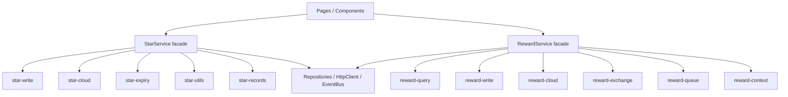

# 里程碑-21E：星星域与奖励域前端服务内部模块化 详细设计文档

> **设计状态**：🟢 已审核（可实施）
> **创建日期**：2026-04-15
> **设计者**：GPT5 Codex
> **审核者**：项目维护者
> **预计工期**：3-4天

---

## 📋 目录

- [需求分析](#需求分析)
- [技术方案](#技术方案)
- [代码结构](#代码结构)
- [实施步骤](#实施步骤)
- [测试方案](#测试方案)
- [风险评估](#风险评估)
- [替代方案](#替代方案)
- [审核要点自检](#审核要点自检)
- [审核记录](#审核记录)

---

## 需求分析

### 功能描述

`M21D` 已经完成服务层依赖边界收口，当前前端 service 层最突出的结构问题，不再是“反向依赖”或“平台细节泄漏”，而是 `StarService` 与 `RewardService` 本体过大，内部同时承载了查询、写路径、云同步、缓存、到期/保护、离线补偿和格式化工具等多类职责。

基于 2026-04-15 的实际代码审计：

- [`services/star-service.js`](/Users/wangdafei/code/study_task_wechat/services/star-service.js) 当前约 `2016` 行
- [`services/reward-service.js`](/Users/wangdafei/code/study_task_wechat/services/reward-service.js) 当前约 `1938` 行
- 对应测试文件 [`test/services/star-service.test.js`](/Users/wangdafei/code/study_task_wechat/test/services/star-service.test.js) 约 `1819` 行、[`test/services/reward-service.test.js`](/Users/wangdafei/code/study_task_wechat/test/services/reward-service.test.js) 约 `2027` 行

这说明当前已经具备做“内部模块化重构”的两个关键前提：

1. **依赖边界足够清晰**，不会一拆就回到 `service-manager` 反查。
2. **测试保护网足够厚**，可以支撑低风险搬移内部实现。

因此，`M21E` 的目标不是改业务，不是变 API，也不是继续做跨层治理，而是参考既有 [`services/task-service.js`](/Users/wangdafei/code/study_task_wechat/services/task-service.js) 和 [`services/message-service.js`](/Users/wangdafei/code/study_task_wechat/services/message-service.js) 的成功模式，把星星域和奖励域拆成“主 facade + 内部 helper 模块”的可维护结构。

### 事实基线（2026-04-15，设计前）

#### 1. `StarService` 当前至少混合了 6 类职责

结合方法分布，当前 [`services/star-service.js`](/Users/wangdafei/code/study_task_wechat/services/star-service.js) 同时包含：

1. 星星查询与记录读取
2. 加星 / 扣星 / 任务完成奖励写路径
3. 有效期计算与展示格式化
4. 一致性校验与修复
5. 云端 refresh / authority sync / record 补云
6. 到期提醒、奖励保护、过期清理

这些职责之间并非全部强耦合；其中“格式化 / 有效期工具”“云同步”“本地写路径”“过期治理”已经具备较清晰的自然边界。

#### 2. `RewardService` 当前至少混合了 5 类职责

结合方法分布，当前 [`services/reward-service.js`](/Users/wangdafei/code/study_task_wechat/services/reward-service.js) 同时包含：

1. 初始化与读前上下文解析
2. 离线队列 / 待同步 / tombstone 管理
3. 奖励 CRUD 与列表查询
4. 云端 refresh / create / update / delete / exchange / unclaim 同步
5. 兑换 / 取消兑换 / 下一个奖励推荐等核心业务流程

目前最重的不是 CRUD，而是“离线补偿 + 云同步 + 兑换主流程”混在一个文件中，阅读和修改成本都偏高。

#### 3. 现有仓库已经有成熟的 service 内部切片范式

当前仓库不是第一次做这类收口：

- [`services/task-service.js`](/Users/wangdafei/code/study_task_wechat/services/task-service.js) 已拆成 `task-query / task-repeat / task-sync / task-write / task-penalty`
- [`services/message-service.js`](/Users/wangdafei/code/study_task_wechat/services/message-service.js) 已拆成 `message-provisional / message-handlers / message-domain`

这两处都采用同一种保守模式：

- 主文件保留 class 与公开 API
- helper 模块导出纯函数
- helper 通过 `service` 实例访问仓储、依赖和 logger

`M21E` 应直接复用这套模式，不另起新范式。

#### 4. 当前仍有一个值得顺手清掉的残余死分支

实际代码确认，[`services/reward-service.js`](/Users/wangdafei/code/study_task_wechat/services/reward-service.js):1319 仍有：

- `const starService = this.serviceManager?.getStarService?.();`

全仓库没有任何地方给 `RewardService` 注入 `serviceManager` 实例，因此这里是未生效的历史残留，不是正式依赖链路。  
`M21E` 可以在不改变业务语义的前提下，把这类已确认死分支一并清理。

### 业务价值

- [x] 用户价值：不直接新增用户可见功能，但能降低后续修复和扩展时引入回归的概率。
- [x] 技术价值：降低星星域与奖励域的单文件复杂度，改善可读性、可测试性与局部修改成本。
- [x] 维护价值：让后续对“星星到期 / 奖励兑换 / 云同步 / 离线补偿”等热点逻辑的变更更容易做局部定位。

### 功能范围

**包含**：
- ✅ 将 `StarService` 拆成主 facade + 内部 helper 模块
- ✅ 将 `RewardService` 拆成主 facade + 内部 helper 模块
- ✅ 保持 service 对外方法名、参数和返回结构不变
- ✅ 保持页面、组件和其他 service 的调用入口不变
- ✅ 在 touched path 上清理已确认无效的内部死分支
- ✅ 按切片边界补齐或调整单元测试，确保搬移后回归稳定

**不包含**：
- ❌ 不新增业务功能
- ❌ 不修改页面、组件和 WXML 交互
- ❌ 不重写 `service-manager`
- ❌ 不调整前后端协议
- ❌ 不在本期统一 `StarService` / `RewardService` 的对外 API 设计
- ❌ 不把 `M21C` 的文档统一工作混入本期

### 优先级

- **优先级**：P1
- **理由**：这是当前代码结构治理里收益最高的下一步。用户面风险低、代码热点明确、测试保护较好，适合在 `M21D` 后立即推进。

---

## 技术方案

### 方案概述

`M21E` 采用“保留 facade、搬移内部实现、逐步切片”的方案。

核心思想：

1. `StarService` / `RewardService` 继续保留为主入口 class。
2. 把同类职责的方法迁移到 `services/star-service/*`、`services/reward-service/*` helper 模块。
3. 主文件只保留：
   - 构造函数
   - 依赖注入更新方法
   - 对外公开 API 的轻量委托
   - 极少量跨 helper 共用的状态初始化
4. helper 模块统一采用：
   - `function xxx(service, ...)`
   - 不持有单例状态
   - 不绕过 service 直接找 manager

这使得：

- 页面与调用方完全无感
- 大多数测试可沿用原有 service public API
- 后续继续微调局部逻辑时，不必再在 2k 行文件里定位

### 关键设计决策

#### 决策1：复用 `task-service / message-service` 既有切片模式

`M21E` 不引入新的基类、装饰器或 class 继承层次，只复用现有 helper 模式。

原因：

- 团队已经接受这种结构
- 当前仓库已有成功案例
- 风险低于“子类化 service”或“prototype 注入”

#### 决策2：`StarService` 先按“写路径 / 云同步 / 有效期工具 / 一致性”切

首轮建议切成以下 helper：

- `services/star-service/star-write.js`
  - `addStars`
  - `consumeStars`
  - `consumeStarsFromSpecificType`
  - `consumeStarsUnified`
  - `handleTaskCompletion`
- `services/star-service/star-cloud.js`
  - `hasPendingLocalStarRecords`
  - `refreshStarsFromCloud`
  - `getFamilyStarSummary`
  - `_fetchStarsFromCloud`
  - `syncExpiryAuthorityIfNeeded`
  - `_syncStarRecordToCloud`
  - `_syncConsumeToCloud`
  - `_replaceSyncedStarGroups`
  - `_replaceSyncedStarRecords`
  - `_mapCloudGroup`
  - `_mapCloudRecord`
  - `_buildConsumeIdempotencyKey`
  - `_buildGroupMergeKey`
- `services/star-service/star-expiry.js`
  - `getExpiringStarsInfo`
  - `calculatePendingExpiry`
  - `protectRewardsByExpiry`
  - `cleanupExpiredStars`
  - `_isGroupWithinReminderWindow`
  - `_buildExpiryAuthorityScopeKey`
- `services/star-service/star-utils.js`
  - `_getExpiryTypeDescription`
  - `calculateExpiryDate`
  - `getExpiryText`
  - `_formatExpiryDate`
  - `_buildEndOfDayDate`
  - `_parseExpiryDateValue`
  - `_normalizeExpiryDateValue`
  - `_resolveExpiryMetadata`
  - `_calculateExpiryDate`
  - `formatStarCount`
- `services/star-service/star-records.js`
  - `getStarGroups`
  - `getTotalStars`
  - `getStarRecords`
  - `getStarRecordsByMonth`
  - `getStarRecordsByDateRange`
  - `getStarRecordsByDate`
  - `calculateRecordBalance`
  - `calculateMonthSummary`
  - `groupRecordsByMonth`
  - `filterRecords`
  - `clearCache`
  - `validateConsistency`
  - `repairStarRecordBalances`
  - `checkAndRepairDataConsistency`
  - `verifyOperationConsistency`

说明：

- `StarService` 的“查询/格式化”和“写路径/云同步”边界相对清晰，适合一次切干净。
- `protectRewardsByExpiry` 与 `cleanupExpiredStars` 虽然都是到期相关，但前者有奖励域依赖，后者没有；仍归为同一个 `star-expiry` helper，避免把“时效治理”拆散。

#### 决策3：`RewardService` 先按“CRUD / 云同步 / 兑换主流程 / 队列补偿”切

首轮建议切成以下 helper：

- `services/reward-service/reward-query.js`
  - `getAllRewards`
  - `getClaimedRewards`
  - `getAvailableRewards`
  - `getExchangeableRewards`
  - `calculateNextAvailableReward`
  - `hasOnlyExampleRewardsSync`
  - `_isExampleReward`
  - `getLastExchangeTime`
  - `getLastExchangeTimeByUser`
- `services/reward-service/reward-write.js`
  - `createReward`
  - `updateReward`
  - `deleteReward`
  - `toggleRewardStatus`
  - `duplicateReward`
  - `deleteRewards`
- `services/reward-service/reward-cloud.js`
  - `refreshRewardsFromCloud`
  - `_fetchRewardsFromCloud`
  - `_syncRewardToCloud`
  - `_syncDeleteRewardToCloud`
  - `_syncExchangeToCloud`
  - `_syncCancelExchangeToCloud`
  - `_mapCloudReward`
- `services/reward-service/reward-exchange.js`
  - `exchangeReward`
  - `cancelRewardExchange`
  - `_rollbackStarDeduction`
  - `_getUserAvailableStars`
- `services/reward-service/reward-queue.js`
  - `_buildOfflineQueueContextFromPendingSyncMeta`
  - `_enqueueRewardMutation`
  - `_executeRewardQueueItem`
  - `buildLegacyQueueCandidates`
  - `_markRewardSynced`
  - `_emitRewardCloudSyncFailure`
  - `_getDeleteTombstones`
  - `_saveDeleteTombstone`
  - `_removeDeleteTombstone`
  - `_flushPendingRewardSyncs`
- `services/reward-service/reward-context.js`
  - `_createOperationKey`
  - `_getUserContextInput`
  - `_getOperatorContext`
  - `_buildRewardPendingSyncMeta`

说明：

- `initialize()` 暂时仍保留在主文件，原因是它同时依赖仓储、配置和类级静态状态，先不拆最稳。
- `updateOfflineQueueService()` 也保留在主文件，原因是它会写入 `this.offlineQueueService` 并完成 adapter 注册；首轮不把这种“状态写入 + 注册动作”再拆散到 helper。
- 如果首轮切完后主文件仍显著偏大，再决定第二轮是否把 `initialize()` 与 config 读取单独下沉到 `reward-init.js`。

#### 决策4：主文件只保留“状态”和“委托”

切片后主文件保留：

- 构造函数
- `initialize()`（至少首轮如此）
- `updateUserService / updateStarService / updateConfigService / updateOfflineQueueService`
- `clearCache()`
- 常量与实例级状态初始化
- 对 helper 的轻量委托方法

不把复杂业务逻辑留在主文件里“半拆不拆”。

#### 决策5：`M21E` 可以顺手清理 touched path 上已确认死分支

当前已确认的顺手清理项：

- `RewardService.exchangeReward()` 本地路径里的 `this.serviceManager?.getStarService?.()` 一致性检查残留

处理原则：

- 只清理“已确认无注入、无调用、无行为影响”的死分支
- 不把这类清理扩大成新一轮全仓库 dead-code 治理

### 技术选型

| 技术点 | 选择方案 | 替代方案 | 选择理由 |
|--------|---------|---------|---------|
| service 内部切片方式 | 主 class + helper 模块 | 新建子类/抽象基类 | 与现有 `task-service`、`message-service` 一致，风险最低 |
| helper 调用方式 | `helper(service, ...)` | prototype 混入 | 易测、直观、无需改 class 层次 |
| 外部 API 兼容 | 主文件继续暴露原方法 | 同步改所有调用方 | 本期目标是内部重构，不是接口重塑 |
| 结构治理范围 | 仅 star/reward 两个 service | 顺带改页面/manager | 控制改动面，避免漂移 |

### DDD分层设计

**领域层（models/）**：
- [ ] 新建模型：无
- [ ] 修改模型：无
- 说明：本期不改领域模型，不改业务实体语义。

**服务层（services/）**：
- [ ] 新建服务：无
- [x] 修改服务：`StarService`、`RewardService`
- [x] 新建内部 helper 模块：`services/star-service/*`、`services/reward-service/*`
- 说明：只做前端 service 内部结构重组，保留 facade 对外契约。

**仓储层（repositories/）**：
- [ ] 新建仓储：无
- [ ] 修改仓储：原则上无
- 说明：仓储接口不在本期变更目标内。

**适配器层（adapters/）**：
- [ ] 新建适配器：无
- [ ] 修改适配器：无
- 说明：适配器边界已在前序里程碑收口，本期不动。

**表现层（pages/、components/）**：
- [ ] 新建页面：无
- [ ] 修改页面：原则上无
- [ ] 新建组件：无
- 说明：页面与组件不感知本期结构变更。

### 架构图



### 接口设计

**新增内部 helper 接口**（仅服务内部使用）：

| 方法 | 说明 | 参数 | 返回值 |
|------|------|------|--------|
| `starWrite.addStars` | 处理加星主路径 | `(service, points, expiryType, source, options)` | 与现有 `addStars` 保持一致 |
| `starCloud.refreshStarsFromCloud` | 处理星星云刷新 | `(service, userId, options)` | 与现有 `refreshStarsFromCloud` 保持一致 |
| `rewardWrite.createReward` | 处理奖励创建 | `(service, rewardData)` | 与现有 `createReward` 保持一致 |
| `rewardExchange.exchangeReward` | 处理奖励兑换 | `(service, rewardId, userId)` | 与现有 `exchangeReward` 保持一致 |
| `rewardCloud.refreshRewardsFromCloud` | 处理奖励云刷新 | `(service, options)` | 与现有 `refreshRewardsFromCloud` 保持一致 |

说明：

- 上述 helper 都是内部实现接口，不暴露给页面层。
- 对外仍由 `StarService` / `RewardService` 的同名 public method 代理调用。

---

## 代码结构

### 文件变更清单

**新增文件**：
- `services/star-service/star-write.js` - 星星写路径 helper
- `services/star-service/star-cloud.js` - 星星云同步与 refresh helper
- `services/star-service/star-expiry.js` - 星星到期治理与保护 helper
- `services/star-service/star-utils.js` - 有效期与格式化工具 helper
- `services/star-service/star-records.js` - 星星查询、一致性与记录整理 helper
- `services/reward-service/reward-query.js` - 奖励查询与推荐 helper
- `services/reward-service/reward-write.js` - 奖励 CRUD helper
- `services/reward-service/reward-cloud.js` - 奖励云同步 helper
- `services/reward-service/reward-exchange.js` - 奖励兑换/取消兑换 helper
- `services/reward-service/reward-queue.js` - 奖励离线队列与待同步 helper
- `services/reward-service/reward-context.js` - 奖励上下文和 pendingSync 元数据 helper

**修改文件**：
- `services/star-service.js` - 改为 facade + helper 委托
- `services/reward-service.js` - 改为 facade + helper 委托
- `test/services/star-service.test.js` - 按新 helper 边界补充/调整验证
- `test/services/reward-service.test.js` - 按新 helper 边界补充/调整验证
- `test/services/service-manager.test.js` - 如有必要，仅验证注入与 facade 契约未回归

### 核心代码结构

```javascript
// services/star-service.js
const starWrite = require('./star-service/star-write');
const starCloud = require('./star-service/star-cloud');

class StarService {
  async addStars(points, expiryType, source, options = {}) {
    return starWrite.addStars(this, points, expiryType, source, options);
  }

  async refreshStarsFromCloud(userId = null, options = {}) {
    return starCloud.refreshStarsFromCloud(this, userId, options);
  }
}

module.exports = StarService;
```

```javascript
// services/reward-service.js
const rewardWrite = require('./reward-service/reward-write');
const rewardExchange = require('./reward-service/reward-exchange');

class RewardService {
  clearCache() {
    this.rewardRepository.invalidateCache();
  }

  async createReward(rewardData) {
    return rewardWrite.createReward(this, rewardData);
  }

  async exchangeReward(rewardId, userId = null) {
    return rewardExchange.exchangeReward(this, rewardId, userId);
  }
}

module.exports = RewardService;
```

### 关键函数

**函数1**：`starWrite.addStars`
- **输入**：`service, points, expiryType, source, options`
- **输出**：现有 `addStars()` 返回结构
- **职责**：完成加星分组更新、流水创建、事件发布与补云触发
- **依赖**：`starGroupRepository`、`starRecordRepository`、`eventBus`、`star-utils`

**函数2**：`rewardExchange.exchangeReward`
- **输入**：`service, rewardId, userId`
- **输出**：现有 `exchangeReward()` 返回结构
- **职责**：完成奖励兑换的本地/云端双路径编排
- **依赖**：`rewardRepository`、`starService`、`starGroupRepository`、`starRecordRepository`、`reward-cloud`、`reward-context`

**函数3**：`rewardQueue._flushPendingRewardSyncs`
- **输入**：`service`
- **输出**：`Promise<void>`
- **职责**：统一补偿待同步奖励和 tombstone
- **依赖**：`offlineQueueService`、`rewardRepository`、`reward-cloud`

**函数4**：`starCloud._buildGroupMergeKey`
- **输入**：`service, group`
- **输出**：`String`
- **职责**：统一构造云端 group 合并键，供 group 替换/归并路径复用
- **依赖**：`group.userId / expiryType / expiryDate`

---

## 实施步骤

### 第1步：拆分 `StarService` helper（预计1-1.5天）

- [ ] **任务**：创建 `services/star-service/*` helper，并把 `StarService` 公开方法改为委托
- [ ] **验证**：`test/services/star-service.test.js` 通过，`StarService` 外部调用不需要改
- [ ] **依赖**：无

**实施要点**：
1. 先迁“纯工具”和“纯查询”方法，再迁“写路径”和“云同步”方法。
2. helper 只通过 `service` 实例访问状态，不引入新的全局单例。
3. 保持 `StarService` 构造函数、实例属性和 update 方法不变。

---

### 第2步：拆分 `RewardService` helper（预计1.5-2天）

- [ ] **任务**：创建 `services/reward-service/*` helper，并把 `RewardService` 公开方法改为委托
- [ ] **验证**：`test/services/reward-service.test.js` 通过，兑换/取消兑换/refresh 主链路不回归
- [ ] **依赖**：第1步完成后继续

**实施要点**：
1. 先拆 `reward-context / reward-query / reward-write`，再拆 `reward-cloud / reward-queue / reward-exchange`。
2. `initialize()` 首轮留在主文件，避免和类级静态状态一起搬迁。
3. 顺手清理 `this.serviceManager?.getStarService?.()` 这类已确认死分支，但不扩大到全仓库清理。

---

### 第3步：测试补强与回归（预计0.5-1天）

- [ ] **任务**：补齐 helper 切片后的测试与必要的定向回归
- [ ] **验证**：定向 service 测试、`service-manager` 测试和必要页面回归通过
- [ ] **依赖**：第1-2步完成

**实施要点**：
1. 不追求“每个 helper 新建单独测试文件”，优先复用既有 `StarService / RewardService` 行为测试。
2. 对高风险链路额外补断言：兑换、取消兑换、refresh、离线补偿、到期保护。
3. 至少执行一次全量 `npm test`，确认切片未造成全局回归。

---

## 测试方案

### 单元测试

**重点回归文件**：
- [`test/services/star-service.test.js`](/Users/wangdafei/code/study_task_wechat/test/services/star-service.test.js)
- [`test/services/reward-service.test.js`](/Users/wangdafei/code/study_task_wechat/test/services/reward-service.test.js)
- [`test/services/service-manager.test.js`](/Users/wangdafei/code/study_task_wechat/test/services/service-manager.test.js)

**必要时补充的定向测试**：
- `test/pages/index.reward-flow.test.js`
- `test/pages/rewards.modules.test.js`
- `test/app/bootstrap-services.test.js`
- `test/app/post-login-bootstrap.test.js`

### 回归关注点

- `StarService` 的公开方法返回结构不变
- `RewardService` 的公开方法返回结构不变
- `service-manager` 的注入链路不变
- 云端 refresh / force / in-flight 复用不回归
- 离线队列、pendingSyncMeta、delete tombstone 行为不回归
- 本地兑换、取消兑换、部分保护、完全保护语义不回归

### 计划执行命令

```bash
npx jest --runInBand test/services/star-service.test.js test/services/reward-service.test.js test/services/service-manager.test.js
npx jest --runInBand test/pages/index.reward-flow.test.js test/pages/rewards.modules.test.js test/app/bootstrap-services.test.js test/app/post-login-bootstrap.test.js
npm test
```

---

## 风险评估

| 风险 | 等级 | 说明 | 缓解方案 |
|------|------|------|---------|
| helper 搬移时漏带实例状态 | 中 | `service` 上有较多实例属性和 in-flight cache | helper 全部显式通过 `service.xxx` 访问；每一组搬移后立即跑定向测试 |
| 奖励兑换链路回归 | 中 | `exchangeReward` 同时覆盖本地/云端/保护/回滚/事件 | 把兑换逻辑集中到单 helper，先保留原行为，再做极小清理 |
| 云同步节流/补偿语义被拆散 | 中 | `RewardService` 的 queue/cloud 逻辑耦合较深 | `reward-cloud` 与 `reward-queue` 分模块但保持方法边界成组搬迁 |
| 结构重构顺手改太多 | 高 | 容易把 `M21E` 做成“顺手优化业务” | 设计明确不改业务口径；只允许 touched path 上已确认死分支清理 |
| 主文件仍然过大 | 低 | 首轮切片后 `initialize()` 仍留主文件 | 若首轮完成后仍不理想，再在评审中决定是否做第二轮微切片 |

---

## 替代方案

### 方案A：继续维持现状，不做模块化

**优点**：
- 无短期改动风险

**缺点**：
- 两个 2k 行 service 继续成为维护热点
- 后续任何结构治理都更难落地
- 新问题与新业务还会继续堆进单体文件

**结论**：
- 不采用。当前已经具备依赖边界和测试基础，再拖延收益不高。

### 方案B：直接重写 `StarService / RewardService` 公共 API

**优点**：
- 理论上可以一次性把接口也统一干净

**缺点**：
- 改动面会扩散到页面、组件、测试和 `service-manager`
- 与本期“低风险内部模块化”目标冲突

**结论**：
- 不采用。本期只做内部重构，不做对外 API 重塑。

### 方案C：只拆一个 service，另一个后续再做

**优点**：
- 单次改动更小

**缺点**：
- 路线不完整，另一个热点仍继续累积复杂度
- 两个域本来就共享一套切片模式，拆一半收益有限

**结论**：
- 不优先采用。仍建议同一里程碑内完成 star/reward 两个 service 的同构切片。

---

## 审核要点自检

- [x] 已基于实际代码审计，而非凭印象列方案
- [x] 已明确 `M21E` 只做内部模块化，不改对外 API
- [x] 已明确复用现有 `task-service / message-service` 切片模式
- [x] 已列出具体 helper 切片边界，而不是抽象口号
- [x] 已说明已确认死分支只做 touched path 内顺手清理
- [x] 已给出实施顺序、风险点和测试回归计划

---

## 审核记录

### 第1轮设计稿（2026-04-15）

- 结论：待审核
- 说明：基于 `StarService / RewardService` 真实代码结构、现有 service 切片范式与测试覆盖现状形成首版设计稿，待项目维护者评审。

### 第2轮终审（2026-04-15）

- 结论：审核通过
- 说明：已复核实施范围、helper 切片边界、主文件保留项、测试回归范围与 touched-path 清理约束；允许作为 `M21E` 实施冻结基线。
