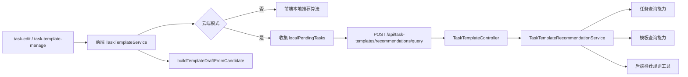

# 里程碑-21F：前端业务后移总体审计与第一阶段 详细设计文档

> **设计状态**：✅ 已审核通过，进入实施阶段
> **创建日期**：2026-04-12
> **设计者**：GPT5 Codex
> **审核者**：项目维护者
> **依赖文档**：`docs/design/milestone-21b2-template-source-completion.md`、`docs/design/milestone-21b3-template-page-clarity.md`、`docs/design/milestone-21b4-task-form-shared-core.md`
> **预计工期**：3-4天

---

## 📋 目录

- [需求分析](#需求分析)
- [技术方案](#技术方案)
- [代码结构](#代码结构)
- [实施步骤](#实施步骤)
- [测试方案](#测试方案)
- [风险评估](#风险评估)
- [替代方案](#替代方案)

---

## 需求分析

### 功能描述

`M21F` 的目标不是“随便找一段前端代码搬到后端”，而是先对当前项目做一次前后端职责边界审计，再从中挑出第一批最适合后移、收益最高、风险可控的业务逻辑。

本次审计后，结论已经明确：

1. 当前前端仍然承担了多类“聚合读模型 / 规则引擎 / 跨端一致性要求高”的业务逻辑。
2. 这些逻辑并不都适合立刻迁移，必须按收益、风险和现有后端基础排序。
3. 第一阶段不应该从“页面交互强耦合”或“离线写链路深耦合”的逻辑动手，而应该优先选择边界清晰、可独立验证、迁移后收益立刻可见的一段。

因此，`M21F` 先完成总体审计，再在此基础上确定第一阶段范围。经审计后的第一阶段选择是：**模板推荐候选生成链路后移到后端**。

### 业务价值

- [x] 职责收敛：把更适合后端承载的聚合规则放回服务端，明确前端只负责页面态、草稿态和本地降级。
- [x] 一致性提升：模板推荐结果从“单端临时计算”升级为“服务端权威输出 + 前端补丁降级”，减少多端不一致。
- [x] 首阶段前端减负：主路径复杂度明显下降，但因保留本地降级算法，本期净删码收益为中等，不承诺一次性大幅瘦身。
- [x] 为后续阶段打样：给分析读模型、家庭聚合读路径等后续候选建立统一迁移方法，而不是继续各自为政。

### 功能范围

**本期包含两层内容**：

- ✅ 完成“前端业务后移候选项”总体审计和优先级排序
- ✅ 明确第一阶段只迁移“模板推荐候选生成”链路
- ✅ 新增后端模板推荐查询接口
- ✅ 将候选聚类、稳定周期识别、模板覆盖抑制、推荐理由生成、排序迁移到后端
- ✅ 前端 `TaskTemplateService.getRecommendedTemplateCandidates()` 改为云端优先获取
- ✅ 支持把本地未同步任务快照作为本次推荐计算的补丁输入提交给后端
- ✅ 当前端处于本地模式或后端查询失败时，保留前端本地降级能力

**本期不包含**：

- ❌ 不在本期迁移分析页读模型
- ❌ 不在本期重做家庭聚合查询体系
- ❌ 不在本期重写星星 / 奖励 / 消息的离线同步编排
- ❌ 不在本期迁移模板草稿构建、候选转模板草稿、页面显示态组装
- ❌ 不在本期删除所有前端降级实现；本地模式和网络失败时仍需可用

### 优先级

- **优先级**：P1
- **理由**：这是一次“边界治理 + 首个迁移样板”里程碑，目标不是做最大范围，而是先做最值得、最稳、最能证明方向正确的那一段。

---

## 技术方案

### 方案概述

`M21F` 采用“两步式”方案：

1. 先做全量职责审计，明确哪些前端业务逻辑更适合后端承载。
2. 再基于审计结果，收敛第一阶段范围，只迁移模板推荐候选生成链路。

最终职责边界如下：

- 前端继续负责：
  - 页面交互
  - 表单草稿与编辑态
  - 候选转模板草稿
  - 本地模式 / 网络失败时的降级推荐
  - 将本地未同步任务作为查询补丁提交给后端
- 后端正式负责：
  - 家庭任务集合上的模板推荐候选计算
  - 稳定周期识别
  - 模板覆盖抑制
  - 推荐理由生成
  - 候选排序与返回契约

### 当前代码审计结论

#### 1. 前端热点并不都属于同一类问题

| 区域 | 前端现状 | 是否适合后移 | 结论 |
|------|---------|-------------|------|
| 模板推荐链路 | `services/task-template-service.js` + `utils/task-template-source.js` 共 1176 行，完整承载候选聚类、推荐理由、模板覆盖抑制、排序 | 高 | 第一阶段 |
| 分析读模型 | `services/analytics-service.js` 1249 行，承担 prepared snapshot、家庭/个人读模型拼装、预测 | 高，但跨域更宽 | 后续阶段 |
| 家庭聚合查询 | family scope 读路径仍有前端混合云端与本地未同步任务的逻辑 | 中高 | 后续阶段 |
| 星星 / 奖励 / 消息 | 前端文件大，但大量复杂度来自离线同步、缓存、视角切换、UI 场景编排 | 中 | 暂不作为第一阶段 |

#### 2. 模板推荐是“业务后移第一阶段”的最佳候选

原因不是“之前刚做过模板”，而是它同时满足以下条件：

- 它本质上是读模型聚合，不是页面即时交互规则。
- 它天然要求跨设备一致性，放在前端权威性最弱。
- 它已经形成独立链路，边界清晰，便于单独迁移和验证。
- 它依赖的数据主要是任务集合和已存在模板，后端已有相应域能力基础。
- 它不直接卡在离线写路径主链路上，比分析、星星、奖励、消息都更容易作为第一批迁移样板。

#### 3. 其他候选为何不排第一

| 候选 | 不排第一的原因 |
|------|---------------|
| 分析读模型 | 后端适配度很高，但牵涉任务、星星、家庭 summary、过期权威同步、预测数据，影响面明显更大；适合作为第二阶段，而不是首个样板 |
| 家庭聚合查询 | 当前 family scope 仍混入本地未同步数据，若先整体迁移，容易把“读模型迁移”与“离线补丁语义”搅在一起，边界不够干净 |
| 星星 / 奖励 / 消息 | 后端核心写路径已经较强，前端剩余复杂度主要是本地缓存、pendingSync、离线补偿、视角编排；这类问题更像基础设施治理，不适合做第一阶段后移样板 |

### 候选排序依据

本期统一使用以下六个维度给候选项排序：

| 维度 | 说明 |
|------|------|
| 后端权威适配度 | 这段逻辑是否本质上属于服务端更适合承载的聚合规则或权威读模型 |
| 跨端一致性收益 | 迁移后是否能明显减少不同设备/会话之间结果不一致 |
| 前端减负收益 | 是否能直接降低前端复杂度和主包膨胀压力 |
| 本地交互耦合度 | 是否强耦合页面即时交互；越低越适合优先迁移 |
| 后端现成基础 | 后端是否已有相近的模型、查询能力或域服务可以复用 |
| 迁移风险 | 是否会触碰离线写链路、核心用户主线、跨域事务；风险越低越适合作为第一阶段 |

### 候选排序结果

| 候选项 | 后端权威适配度 | 一致性收益 | 前端减负收益 | 本地交互耦合度 | 后端现成基础 | 迁移风险 | 结论 |
|-------|---------------|-----------|-------------|---------------|-------------|---------|------|
| 模板推荐候选生成 | 高 | 高 | 中高 | 低 | 中高 | 中 | 第一阶段 |
| 分析读模型 prepared snapshot | 高 | 高 | 中高 | 中 | 中 | 高 | 第二阶段优先候选 |
| family 聚合读路径 | 中高 | 中高 | 中 | 中 | 中 | 高 | 暂不进入第一阶段 |
| 星星 / 奖励 / 消息前端编排 | 中 | 中 | 中 | 高 | 高 | 高 | 不作为第一阶段 |

### 第一阶段范围

第一阶段只迁移以下职责：

1. 家庭任务集合聚类为模板推荐候选
2. 稳定重复周期识别
3. 推荐理由生成
4. 与正式模板的覆盖关系判定
5. 候选排序与分页裁剪

继续保留在前端的职责：

1. 推荐卡片点击后的“转模板草稿”
2. 模板编辑页表单草稿生成
3. 页面展示文案、空态、展开收起等交互
4. 本地模式 / 接口失败时的降级推荐
5. 本地未同步任务的收集与补丁提交

### 第一阶段核心设计

#### 1. 新增后端推荐查询接口

`POST /api/task-templates/recommendations/query`

请求体：

```json
{
  "today": "2026-04-12",
  "lookbackDays": 60,
  "limit": 20,
  "localPendingTasks": []
}
```

返回体：

```json
{
  "candidates": [],
  "total": 0
}
```

选择 `POST` 而不是 `GET`，是因为第一阶段必须支持前端附带 `localPendingTasks` 补丁快照。

#### 2. 后端负责权威推荐计算

后端新增 `taskTemplateRecommendationService`，负责：

- 读取家庭任务集合
- 合并前端提交的本地未同步任务补丁
- 读取当前家庭已有模板
- 执行候选聚类、稳定周期识别、推荐理由生成、模板覆盖抑制和排序

这里的输出契约尽量与现有前端 candidate 结构保持一致，避免重写消费层。

#### 2.1 候选契约必须精确兼容现有消费层

这次迁移的核心不是“后端也返回个差不多的数据”，而是后端返回结构必须满足现有前端消费契约。

后端返回的 `TemplateRecommendationCandidate` 至少必须覆盖以下字段：

- `candidateKey`
- `displayName`
- `sourceTaskId`
- `taskPayload`
- `dateStrategy`
- `occurrences`
- `stableWeeks`
- `reasonCode`
- `reasonText`
- `signature`
- `coverageSignature`
- `repeatSpanKey`
- `lastSeenAt`

其中 `taskPayload / dateStrategy / displayName / sourceTaskId / candidateKey / signature / repeatSpanKey` 必须保证能被现有 `buildTemplateDraftFromCandidate()` 直接消费，而不需要页面侧再做兼容分支。

测试上必须增加“契约一致性对比”：

1. 准备同一组输入任务和模板数据
2. 分别运行前端旧算法与后端新规则
3. 对比 candidate 数量、排序和关键字段
4. 至少保证进入模板编辑页所需字段完全一致

#### 3. 本地未同步任务只作为“查询补丁”

这是本期最关键的边界约束。

当前前端 `TaskService.getTasksByScope({ scope: 'family' })` 在云端模式下会把本地未同步任务混入云端结果。如果后端只基于云端已同步任务计算推荐，会直接出现推荐减少的体验回退。

因此第一阶段必须保留这条体验线，但方式要改成：

- 前端识别本地未同步任务
- 查询推荐接口时一并提交 `localPendingTasks`
- 后端只把这些任务作为本次只读计算输入
- 不把补丁任务写入数据库，也不改变后端权威写链路

这样可以同时满足两件事：

1. 推荐结果不倒退
2. 后端仍然保持存储权威，不被前端临时补丁污染

#### 3.1 PendingTaskSnapshot 收敛为最小必要字段

第一阶段允许前端附带本地未同步任务，但不应该直接上传完整任务实体。补丁快照必须收敛为推荐算法实际需要的字段。

`PendingTaskSnapshot` 第一阶段最小必要字段如下：

- `id`
- `title`
- `description`
- `type`
- `date`
- `startDate`
- `endDate`
- `startTime`
- `endTime`
- `hasNoEndDate`
- `isAllDay`
- `isRequired`
- `points`
- `pointsExpiry`
- `repeat`
- `reminder`
- `modifyTime`
- `createdAt`

明确不进入第一阶段补丁快照的字段：

- `pendingSyncMeta`
- `syncedToCloud`

原因：

- 这两个字段属于前端同步状态，不参与推荐候选聚类、覆盖判定、推荐理由生成和模板草稿构建。
- 第一阶段的补丁目标是“让推荐结果不退化”，不是把本地同步元信息也传到后端。

#### 4. 前端改为云端优先 + 本地降级

`TaskTemplateService.getRecommendedTemplateCandidates()` 的正式路径调整为：

1. 云端模式下先刷新模板缓存
2. 收集本地未同步任务补丁
3. 调用后端推荐接口
4. 接口成功则直接消费后端 candidate
5. 本地模式或接口失败时，再回退到现有 `groupTasksToTemplateCandidates()` 本地算法

这意味着前端推荐算法在第一阶段仍保留，但职责变为：

- 本地模式兜底
- 网络失败兜底
- 与服务端结果对照验证期的保险实现

#### 4.1 缓存策略

第一阶段缓存策略采用“前端继续负责短 TTL 缓存，后端先不强制引入跨请求缓存”的保守方案。

前端：

- 继续保留现有 `30s TTL` 推荐缓存
- 继续保留基于任务变更事件的缓存失效
- 原因是本地未同步任务仍由前端补丁提供，前端仍需要对本地即时变化敏感

后端：

- 第一阶段不把服务端缓存设为必做项
- 先以正确性和职责迁移为主
- 若联调或压测发现推荐查询成为热点，再补短 TTL 服务端缓存

触发后端缓存 / 索引优化的条件：

- 推荐接口 `P95` 响应时间持续超出 `500ms`
- 多端并发请求导致重复计算成本明显上升

#### 5. 候选消费链路保持不动

`buildTemplateDraftFromCandidate()` 以及推荐卡片进入模板编辑页的链路本期不迁移。

原因很简单：这部分是页面草稿准备，不是权威业务聚合。它跟推荐“算什么”是两回事，不应该为了“后移”而把前端页面输入准备也搬走。

#### 6. 错误响应设计

推荐接口沿用项目既有 `success/error` 响应包装，并明确以下错误语义：

| 状态码 | 错误码 | 场景 |
|-------|-------|------|
| `400` | `INVALID_PARAMS` | `today / lookbackDays / limit / localPendingTasks` 参数非法 |
| `403` | `PERMISSION_DENIED` | 非家长或无家庭上下文访问推荐接口 |
| `500` | `TASK_TEMPLATE_RECOMMENDATION_FAILED` | 推荐计算失败、数据库查询失败、内部异常 |

第一阶段不单独定义推荐接口的业务超时状态码；若后端超时，统一按服务异常处理，并由前端直接降级到本地算法。

前端处理原则：

- 云端推荐接口失败不阻断页面
- 直接切换到本地算法降级
- 仅记录日志，不对用户展示强错误态弹窗

### DDD 分层设计

**领域层（models/）**

- [ ] 新建模型：无
- [ ] 修改模型：无强制要求
- 说明：推荐候选是查询结果 DTO，不进入独立持久化实体

**服务层（services/）**

- [x] 新建服务：`backend/services/taskTemplateRecommendationService.js`
- [x] 修改服务：`services/task-template-service.js`
- [x] 修改服务：`backend/services/taskTemplateService.js`
- 说明：后端新增推荐查询编排；前端模板服务改为云端优先消费；现有后端模板 service 仅提供模板域辅助能力，不演变成大而全 service

**仓储层（repositories/）**

- [ ] 新建仓储：无
- [ ] 修改仓储：无
- 说明：第一阶段优先复用现有任务/模板查询能力，不新增仓储

**适配器层（adapters/）**

- [ ] 新建适配器：无
- [x] 修改适配器：接口配置与 endpoint 常量

**推荐规则模块归属**

- [x] 新增私有规则模块：`backend/services/task-template-recommendation/rules.js`
- 说明：推荐聚类、覆盖抑制、推荐理由、排序规则属于推荐查询服务的内部实现，不放到通用 `backend/utils/`，避免被误解为全局公共工具

**表现层（pages/、components/）**

- [x] 间接受影响页面：`pages/task-edit/`
- [x] 间接受影响页面：`packageManage/pages/task-template-manage/`
- 说明：页面 UI 目标是不改主交互，只切换推荐数据来源与错误/降级态

### 架构图



### 后续阶段建议

`M21F` 不是“一次性把所有逻辑都后移”，而是分阶段推进。基于本轮审计，后续顺序建议如下：

1. 第一阶段：模板推荐候选生成后移
2. 第二阶段：分析读模型 prepared snapshot / 聚合图表数据后移
3. 第三阶段：family 聚合读路径和本地补丁语义继续收口
4. 之后再视收益决定是否处理星星 / 奖励 / 消息剩余前端编排

---

## 代码结构

### 文件变更清单

**新增文件**：

- `backend/services/taskTemplateRecommendationService.js` - 模板推荐候选查询编排
- `backend/services/task-template-recommendation/rules.js` - 候选聚类、推荐理由、覆盖抑制与排序规则
- `backend/test/unit/taskTemplateRecommendationService.test.js` - 后端推荐服务单测
- `backend/test/unit/taskTemplateController.recommendation.test.js` - 后端推荐接口测试

**修改文件**：

- `backend/routes/taskTemplates.js` - 新增推荐查询路由
- `backend/controllers/taskTemplateController.js` - 新增推荐查询入口
- `backend/services/taskTemplateService.js` - 暴露模板域读取辅助能力
- `utils/api-config.js` - 新增推荐接口 endpoint
- `services/task-template-service.js` - 改为云端优先 + 本地降级
- `utils/task-template-source.js` - 降为本地兜底与候选转草稿工具
- `test/services/task-template-service.test.js` - 调整为云端优先 / 失败降级测试
- `test/utils/task-template-source.test.js` - 调整为本地兜底能力测试

### 核心函数设计

**后端新增：**

- `queryRecommendations({ userId, familyId, today, lookbackDays, limit, localPendingTasks })`
- `mergePendingTasks(cloudTasks, localPendingTasks)`
- `groupTasksToRecommendationCandidates(tasks, templates, options)`
- `filterCoveredCandidates(candidates, templates)`
- `buildRecommendationReason(candidate, stats)`

**前端调整：**

- `TaskTemplateService.getRecommendedTemplateCandidates(options)`
- `TaskTemplateService._buildPendingLocalTaskSnapshots()`
- `TaskTemplateService._queryRecommendationCandidatesFromCloud(options)`

### 数据模型

```typescript
interface TemplateRecommendationQuery {
  today?: string;
  lookbackDays?: number;
  limit?: number | null;
  localPendingTasks?: PendingTaskSnapshot[];
}

interface PendingTaskSnapshot {
  id?: string | null;
  title: string;
  description?: string;
  type: 'habit' | 'study' | 'interest';
  date: string;
  startDate?: string;
  endDate?: string;
  startTime?: string;
  endTime?: string;
  hasNoEndDate?: boolean;
  isAllDay?: boolean;
  isRequired?: boolean;
  points?: number;
  pointsExpiry?: string;
  repeat?: {
    type: string;
    days?: number[];
    startDate?: string;
    endDate?: string;
  };
  reminder?: {
    enabled: boolean;
    time: number;
  };
  modifyTime?: number;
  createdAt?: number;
}

interface TemplateRecommendationCandidate {
  candidateKey: string;
  displayName: string;
  sourceTaskId: string | null;
  taskPayload: object;
  dateStrategy: object;
  occurrences: number;
  stableWeeks: number;
  reasonCode: 'high-frequency' | 'stable-repeat';
  reasonText: string;
  signature: string;
  coverageSignature: string;
  repeatSpanKey: string | null;
  lastSeenAt: number;
}
```

---

## 实施步骤

### 步骤1：实现后端推荐规则迁移

1.1 新增 `backend/services/task-template-recommendation/rules.js`

1.2 迁移候选聚类规则：

- 任务过滤
- monthly / 多日单次任务过滤
- signature 归一化

1.3 迁移稳定周期识别：

- `weekKeys` 收集
- `stableWeeks` 计算
- `hasStableRepeatCycles` 判定

1.4 迁移模板覆盖抑制：

- `coverageSignature`
- 与正式模板的覆盖关系判定

1.5 迁移候选排序与裁剪：

- `reasonCode`
- `reasonText`
- `occurrences / stableWeeks / lastSeenAt` 排序
- `limit` 裁剪

1.6 实现 `localPendingTasks` 合并逻辑：

- 收敛 DTO 字段
- 与云端家庭任务做只读合并
- 不写数据库

### 步骤2：实现后端接口与控制器

2.1 新增 `taskTemplateRecommendationService`

2.2 在 service 中编排：

- 读取家庭任务
- 读取家庭模板
- 合并本地补丁
- 调用 rules 生成候选

2.3 在 `taskTemplateController` 中新增推荐查询入口

2.4 在 `backend/routes/taskTemplates.js` 注册 `POST /api/task-templates/recommendations/query`

2.5 实现参数校验与错误响应映射

### 步骤3：切换前端模板推荐主路径

3.1 在 `services/task-template-service.js` 中新增云端推荐查询逻辑

3.2 新增本地未同步任务快照构建逻辑，并按最小必要字段发送

3.3 保留现有前端算法作为本地模式 / 接口失败降级路径

3.4 保留现有前端 `30s TTL + task event` 缓存失效策略

3.5 不修改推荐卡片消费层和模板草稿构建层

### 步骤4：补齐契约与回归测试

4.1 后端单测覆盖：

- 候选聚类
- 稳定周期识别
- 覆盖抑制
- 推荐理由
- `localPendingTasks` 合并

4.2 控制器测试覆盖：

- 鉴权
- 参数校验
- 错误响应

4.3 前端测试覆盖：

- 云端优先
- 接口失败降级
- 本地模式降级
- 缓存命中和失效

4.4 增加契约一致性测试：

- 同一数据集下，后端输出与前端旧算法关键字段一致

### 步骤5：性能验证与文档收口

5.1 联调阶段记录推荐接口响应时间，验证 `P95 < 500ms`

5.2 若不达标，再评估是否补任务日期索引或短 TTL 服务端缓存

5.3 更新本设计文档实施状态

5.4 完成后同步 `docs/api/backend-rest-api.md`

5.5 完成后同步 `docs/development/ROADMAP.md` 与 `docs/development/CHANGELOG.md`

---

## 测试方案

### 单元测试

**后端：**

- 候选聚类结果与现有前端规则一致
- 已有模板覆盖时候选被正确过滤
- `stableWeeks / occurrences / reasonText` 输出符合现有契约
- `localPendingTasks` 能参与本次推荐计算，但不会写入数据库
- `limit / lookbackDays / today` 参数生效
- 候选输出字段完全覆盖前端 `buildTemplateDraftFromCandidate()` 消费所需字段

**前端：**

- 云端模式优先调用推荐接口
- 本地模式直接走前端算法
- 接口失败时降级到前端算法
- 云端结果结构可被现有推荐卡片直接消费
- 缓存与事件失效行为保持正确
- 本地补丁快照仅包含约定字段，不夹带同步元信息

### 集成测试

- 前端保存推荐模板主链路不变
- 从推荐卡片进入模板编辑页的草稿内容不变
- 已保存为正式模板后，不再重复出现在推荐列表
- 家庭场景下，本地未同步任务仍能影响本次推荐结果

### 手工验证

1. 云端模式下进入任务管理页，推荐列表正常展示
2. 新建本地未同步任务后，推荐结果仍能及时体现
3. 网络失败时推荐列表仍可通过本地算法展示
4. 推荐保存为模板后，推荐列表与正式模板列表表现正确
5. 切换设备后，已同步任务产生的推荐结果保持一致

---

## 风险评估

### 风险1：忽略本地未同步任务导致体验回退

**风险等级**：高

**说明**：
当前推荐链路默认会吃到本地未同步任务。如果第一阶段只让后端读取云端任务，会直接让用户感觉“推荐变少了”。

**缓解措施**：

- 第一阶段明确支持 `localPendingTasks`
- 把它定义成查询补丁，而不是存储写入
- 用测试覆盖“本地未同步任务能影响推荐”

### 风险2：后端候选规则与前端现有结果漂移

**风险等级**：中

**说明**：
这是一次契约迁移，不只是搬代码。若后端输出和前端旧算法不一致，页面行为会漂移。

**缓解措施**：

- 以现有前端推荐结果为迁移基线
- 对关键案例补齐后端单测
- 第一阶段保留前端降级算法，便于对照与回退
- 增加“后端输出 vs 前端旧算法输出”的契约一致性测试

### 风险3：第一阶段做大，重新打开过多域

**风险等级**：中

**说明**：
如果在第一阶段顺手把分析、family 聚合、离线同步一起改，会显著抬高风险。

**缓解措施**：

- 只做模板推荐候选生成
- 不改页面草稿逻辑
- 不改任务 / 星星 / 奖励 / 消息主链路

### 风险4：后端 service 边界再次膨胀

**风险等级**：中

**说明**：
若把推荐逻辑直接堆进现有 `backend/services/taskTemplateService.js`，会把 CRUD service 做成新的热点文件。

**缓解措施**：

- 独立新建 `taskTemplateRecommendationService.js`
- 推荐规则放入推荐 service 私有模块，而非通用 utils
- CRUD service 只保留模板实体管理职责

### 风险5：后端推荐查询性能不达标

**风险等级**：中

**说明**：
第一阶段把 60 天窗口内的推荐计算迁到后端后，数据库查询和规则计算都从“单端内存处理”变成“接口查询 + 服务端计算”，需要明确性能预算。

**缓解措施**：

- 第一阶段联调时记录接口耗时
- 以 `P95 < 500ms` 作为目标
- 若达不到目标，再补索引评估或短 TTL 服务端缓存

---

## 替代方案

### 方案A：继续维持前端推荐主实现，不做后移

**优点**：

- 实施成本最低
- 不需要新增后端接口

**缺点**：

- 前端继续承担聚合读模型和规则引擎
- 跨设备一致性仍然弱
- 主包和前端服务复杂度继续上涨

**结论**：不采纳

### 方案B：第一阶段直接迁移分析读模型

**优点**：

- 后端权威收益大
- 分析页读模型确实更适合服务端聚合

**缺点**：

- 横跨任务、星星、家庭汇总、预测逻辑，范围明显更大
- 与已有本地回退、authority sync 逻辑耦合深
- 不适合作为首个迁移样板

**结论**：暂不采纳，作为第二阶段优先候选

### 方案C：第一阶段先动星星 / 奖励 / 消息前端编排

**优点**：

- 表面上热点文件更大

**缺点**：

- 这些区域剩余复杂度很多来自离线同步和视角编排，而不是单纯“该放后端的业务规则”
- 一上来就动主链路，回归面过大

**结论**：不采纳

---

## 结论

`M21F` 的正确打开方式不是“默认模板推荐先做”，而是：

1. 先完成全量职责审计
2. 给出迁移排序理由
3. 选择第一阶段样板

本轮审计后的结论是：**模板推荐候选生成** 是当前最适合作为“前端业务后移第一阶段”的范围；而分析读模型是下一阶段最强候选，但不应与第一阶段捆绑启动。
