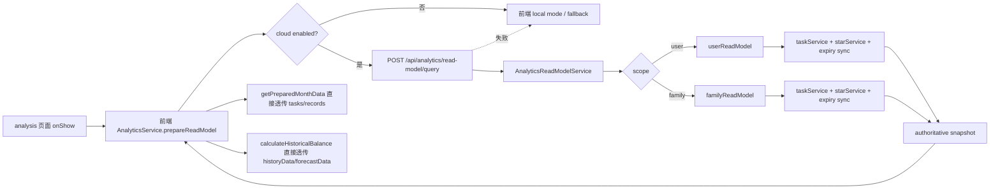

# 里程碑-21F2：analytics 云端正式读模型后移与前端收口 详细设计文档

> **设计状态**：🟢 审核通过
> **创建日期**：2026-04-12
> **设计者**：GPT5 Codex
> **审核者**：项目维护者
> **依赖文档**：`docs/design/milestone-21f-frontend-business-backend-migration.md`
> **预计工期**：5-6天

---

## 📋 目录

- [需求分析](#需求分析)
- [技术方案](#技术方案)
- [代码结构](#代码结构)
- [实施步骤](#实施步骤)
- [测试方案](#测试方案)
- [风险评估](#风险评估)
- [替代方案](#替代方案)

---

## 需求分析

### 功能描述

`M21F2` 的目标不再只是把 family 分析主路径迁到后端，而是把 analytics 领域里**两条云端正式读模型主链路**一起迁正：

1. `scope === 'family'` 的家庭分析正式读模型
2. `scope === 'user'` 的个人分析正式读模型

当前 `services/analytics-service.js` 在这两条链路上都承担了不该长期留在前端的职责：

1. 编排任务、星星汇总、星星流水等后端权威数据源
2. 在前端拼 `prepared snapshot`
3. 在前端计算正式 `historyData / forecastData`

这导致前端既像页面层，又像半个读模型服务。`M21F2` 这次要解决的不是“某一条 family 特例”，而是 analytics 云端正式结果的归属问题，并同步清理前端 cloud 正式路径冗余。

### 业务价值

- [x] 职责收敛：analytics 云端正式结果改由后端 authoritative read model 输出，前端回到页面消费、缓存、展示和兜底职责。
- [x] 一致性提升：个人和家庭分析的月度任务、月度流水、当前余额锚点、趋势图与过期预测改为单一权威来源，减少口径漂移。
- [x] 前端减负：前端不再在 cloud 正式路径下并行拉任务、星星汇总、流水并二次聚合，analytics 主路径明显变薄。
- [x] 清理收益更大：不仅清 family 正式路径冗余，也同步清掉 user 正式路径冗余，前端体积收益明显高于只做 family。
- [x] 后续扩展更稳：后续任务统计、星星日历或 fallback 收口时，可以建立在统一的后端 read model 结构上推进。

### 功能范围

**包含**：
- ✅ 新增后端统一 analytics 读模型查询接口
- ✅ 后端承接 `scope === 'family'` 的正式 `prepareReadModel()` 主路径
- ✅ 后端承接 `scope === 'user'` 的正式 `prepareReadModel()` 主路径
- ✅ 后端承接两种 scope 下 `calculateHistoricalBalance()` 所需的 `historyData / forecastData`
- ✅ 前端 `AnalyticsService` 在 cloud 模式下统一切到后端 analytics read model 接口
- ✅ 清理前端 cloud 正式路径上的 family/user 重复聚合逻辑
- ✅ 将前端 analytics 保留边界收敛为：页面消费、缓存、本地模式、后端失败兜底
- ✅ 保留 `scope === 'user'` 下 `pending_local_overlay` 的现有语义
- ✅ 明确 `scope`、`userId`、`childUserIds`、缓存元数据和趋势口径契约

**不包含**：
- ❌ 不迁移 `getTaskCompletionStats()`
- ❌ 不迁移 `getUpcomingExpiryStars()`
- ❌ 不迁移 `getTaskStarCalendarData()`
- ❌ 不重写分析页页面结构和组件交互
- ❌ 不删除本地模式本身
- ❌ 不删除后端失败场景所需的最小必要 fallback

### 优先级

- **优先级**：P1
- **理由**：这是 analytics 领域里最适合后移、也最能直接改善前后端职责和前端体积的一次切片。若只做 family，收口力度仍偏保守；这次同时覆盖 family + user，才能更接近“前端做前端该做的事，后端做后端该做的事”的目标。

---

## 技术方案

### 方案概述

`M21F2` 采用“统一后端 read model + 前端薄适配 + 最小必要兜底”的方案。

核心思路：

1. 后端新增统一 analytics 读模型查询接口，按 `scope` 返回 `user` 或 `family` 的 authoritative snapshot。
2. 后端接口直接返回分析页所需的月度 `tasks / records`、当前余额锚点、`historyData / forecastData`。
3. 前端 `AnalyticsService` 在 cloud 模式下统一调用该接口，并继续沿用现有 30 秒内存缓存。
4. 在 `cloud + authoritative` 场景下，前端不再保留一套等价正式聚合链路。
5. 前端仍保留本地模式和后端失败场景的最小必要 fallback。

这里的“最小必要 fallback”指**职责边界最小**，不是“代码行数最少”：

1. 只允许服务于本地模式和后端失败兜底
2. 不允许继续承担 cloud 正式路径
3. 可以继续复用 `_buildLocalPreparedSnapshot()`、`_calculateAnchoredDailyBalance()`、`_calculateExpiryForecast()` 等 helper，只要它们不再被 cloud 正式链路命中

### 技术选型

| 技术点 | 选择方案 | 替代方案 | 选择理由 |
|--------|---------|---------|---------|
| 接口形态 | 新增 `/api/analytics/read-model/query` | 分别新增 user/family 两个接口 | 一个统一接口更符合当前前端 `analysisOptions` 和 `AnalyticsService` 入口结构 |
| HTTP 方法 | `POST` | `GET` | 请求体需要承载 `scope`、`monthKey`、`trendDays`、`childUserIds`，`POST` 更稳定 |
| 后端分层归属 | `backend/services/analyticsReadModelService.js` + scope helper | 放到 `utils/` | 这是查询编排服务，不是通用工具 |
| 前端迁移方式 | 一次切换 user/family cloud 正式路径，并同步清理冗余 | 先 family，再 user | 本期目标包含职责内聚和前端体积下降，同时切两条云端正式链路更符合目标 |
| 缓存策略 | 保留前端 30s TTL，后端首期不加缓存 | 前后端双缓存 | 先保证正确性和边界清晰，避免过早复杂化 |

### DDD分层设计

**领域层（models/）**：
- [ ] 新建模型：无
- [ ] 修改模型：无
- 说明：本期是聚合读模型迁移，不新增持久化实体。

**服务层（services/）**：
- [x] 新建后端服务：`backend/services/analyticsReadModelService.js`
- [x] 新建后端内部模块：`backend/services/analytics-read-model/userReadModel.js`
- [x] 新建后端内部模块：`backend/services/analytics-read-model/familyReadModel.js`
- [x] 修改前端服务：`services/analytics-service.js`
- 说明：后端服务负责 orchestrate 任务、星星汇总、星星流水与趋势计算；前端服务负责请求、缓存、消费和 fallback。

**仓储层（repositories/）**：
- [ ] 新建仓储：无
- [x] 修改既有查询服务：`backend/services/taskService.js`
- [x] 修改既有查询服务：`backend/services/starService.js`
- 说明：优先在既有后端服务中补 read helper，而不新建额外 repository。

**适配器层（adapters/）**：
- [ ] 新建适配器：无
- [x] 修改前端 API 配置：`utils/api-config.js`
- 说明：仅补新 endpoint，不引入新适配器。

**表现层（pages/、components/）**：
- [ ] 新建页面：无
- [ ] 新建组件：无
- [ ] 修改页面：原则上无
- 说明：分析页和组件外部契约尽量不变，透过现有 `AnalyticsService` 读取数据。

### 架构图



### 当前代码审计结论

#### 1. 真正需要后移的是“云端正式分析结果”，不是所有 analytics helper

当前前端 cloud 正式路径下的重逻辑主要集中在：

- `prepareReadModel()` / `_prepareReadModelInternal()`
- `calculateHistoricalBalance()` 的 authoritative 分支

而 `_buildLocalPreparedSnapshot()`、`_calculateAnchoredDailyBalance()`、`_calculateExpiryForecast()` 等 helper 目前仍同时服务于：

- `user` 分析
- `family` fallback
- `local mode`

所以本期清理目标必须写准：

- 要删除的是 **cloud 正式路径专属** 冗余
- 不是机械删除所有 analytics helper

#### 2. 当前 user / family 云端正式链路本质一致

两条链路虽然 scope 不同，但结构高度相似：

- 先做 expiry authority sync
- 拉取任务、星星流水、星星汇总/分组
- 在前端拼 snapshot
- 在前端根据 current balance 计算趋势和预测

这意味着本期一并后移 `user + family` 是合理的，不会变成完全不同的两套设计。

#### 3. 当前 family 语义必须保留

`family` 分析不是“无条件看全家”，而是“看当前分析上下文里的孩子集合”。

当前来源是 `utils/view-scope.js#resolveAnalysisOptions()`：

- 家长家庭视角：`{ scope: 'family', childUserIds: activeChildUserIds }`
- 孩子或单用户视角：`{ userId }`

所以 unified read model 接口必须支持：

- `scope: 'user'` + `userId`
- `scope: 'family'` + `childUserIds`

### 第一阶段迁移范围

`M21F2` 本期迁移的是 **analytics 云端正式读模型**，包括：

1. `scope === 'user'` 的月度任务集合
2. `scope === 'user'` 的月度星星流水集合
3. `scope === 'user'` 的当前余额锚点
4. `scope === 'user'` 的 `historyData / forecastData`
5. `scope === 'family'` 的月度任务集合
6. `scope === 'family'` 的月度星星流水集合
7. `scope === 'family'` 的当前余额锚点
8. `scope === 'family'` 的 `familyGroupSnapshots`
9. `scope === 'family'` 的 `historyData / forecastData`

继续保留在前端的职责：

1. 页面触发与 30 秒内存缓存
2. `getPreparedMonthData()` 对组件的读取分发
3. 本地模式和后端失败场景的最小必要 fallback
4. 页面展示拼装
5. 非本期范围内的统计类接口

### 收口原则

本期不只要求“后端能返回结果”，还要求 analytics cloud 正式路径完成职责收口。

收口原则只有一条：

**在 cloud 模式下，analytics 的正式结果必须只由后端聚合接口产出；前端不能再保留一套等价的正式聚合实现。**

据此，前端允许保留的仅有两类逻辑：

1. 本地模式专用逻辑
2. 后端失败时的最小必要 fallback 逻辑

前端不允许继续保留的逻辑：

1. `scope === 'user'` 的 cloud 正式路径前端聚合实现
2. `scope === 'family'` 的 cloud 正式路径前端聚合实现
3. 与后端 authoritative 结果等价、但只在“为了保险”而保留的第二套正式算法

说明：

- `_buildLocalPreparedSnapshot()`、`_calculateAnchoredDailyBalance()`、`_calculateExpiryForecast()` 等 helper 是否保留，取决于它们是否仍承担 local mode / fallback 职责
- 本期清理目标是移除或收敛 **user + family cloud 正式路径专属** 的前端聚合实现，而不是机械删除所有可复用 helper

### 本期完成定义

`M21F2` 本期完成必须同时满足：

1. `user + family` 的 cloud 正式主路径切换到后端 read model 接口
2. 前端 `user + family` 正式路径上的重复聚合实现被删除或明确降级为 fallback-only
3. 前端调用链能清楚区分：
   - authoritative result
   - local/fallback result
4. 单测和手工回归可以证明：
   - cloud user 正式路径不再走旧的前端正式聚合链
   - cloud family 正式路径不再走旧的前端正式聚合链
   - fallback 仍然可用

### 接口设计

#### 新增接口

`POST /api/analytics/read-model/query`

请求体：

```json
{
  "scope": "family",
  "monthKey": "2026-04",
  "trendDays": 7,
  "childUserIds": ["child-1", "child-2"]
}
```

或：

```json
{
  "scope": "user",
  "monthKey": "2026-04",
  "trendDays": 7,
  "userId": "child-1"
}
```

字段规则：

- `scope`：必填，仅允许 `user` / `family`
- `monthKey`：必填，格式 `YYYY-MM`
- `trendDays`：可选，仅允许 `7` 或 `30`，默认 `7`
- `userId`：
  - `scope === 'user'` 时必填
  - 必须由前端按当前分析上下文显式传入，不允许后端自行猜测当前视角 subject
  - 传入时必须通过现有家庭成员权限校验
- `childUserIds`：
  - `scope === 'family'` 时可选
  - 未传：默认当前家庭全部 active child
  - 传空数组：返回空范围结果
  - 传非空数组：仅允许同家庭 active child 子集

成功响应：

```json
{
  "success": true,
  "data": {
    "snapshot": {
      "scope": "family",
      "scopeKey": "family:child-1,child-2",
      "subjectUserIds": ["child-1", "child-2"],
      "monthKey": "2026-04",
      "days": 7,
      "signature": "{\"scope\":\"family\",\"childUserIds\":[\"child-1\",\"child-2\"],\"monthKey\":\"2026-04\",\"days\":7}",
      "refreshedAt": 1775956800000,
      "expiresAt": 1775956830000,
      "currentBalance": 12,
      "mode": "authoritative",
      "fallbackReason": null,
      "tasks": [],
      "records": [],
      "familyGroupSnapshots": {
        "child-1": [],
        "child-2": []
      },
      "historyData": [],
      "forecastData": []
    }
  },
  "message": "获取成功"
}
```

`scope === 'user'` 时：

- `familyGroupSnapshots` 返回 `undefined` 或不返回
- `subjectUserIds` 为 `[userId]`
- `scopeKey` 为 `user:${userId}`

#### Snapshot 契约

后端返回的 `snapshot` 必须完整覆盖前端当前消费的关键字段：

- `scope`
- `scopeKey`
- `subjectUserIds`
- `monthKey`
- `days`
- `signature`
- `refreshedAt`
- `expiresAt`
- `currentBalance`
- `mode`
- `fallbackReason`
- `tasks`
- `records`
- `historyData`
- `forecastData`

`scope === 'family'` 额外要求：

- `familyGroupSnapshots`

设计要求：

1. `tasks / records / familyGroupSnapshots` 的字段结构必须能被现有前端 `getPreparedMonthData()`、日历组件、趋势组件直接消费。
2. `historyData / forecastData` 的结构必须与现有 `calculateHistoricalBalance()` 返回结构保持一致。
3. `mode` 在后端成功场景固定为 `authoritative`；前端 fallback 时仍沿用现有 `fallback`。
4. 为兼容现有前端缓存语义，`signature / expiresAt` 必须存在；其中 `signature` 允许后端返回，但前端在写入 `_preparedSnapshots` 前仍以本地 `_buildAnalysisSignature()` 结果覆盖为准，`expiresAt` 也以前端 `prepareSnapshotTtlMs` 重新盖章，避免前后端 TTL 漂移。

#### 错误响应

统一复用后端 `success()/error()` 响应格式：

```json
{
  "success": false,
  "data": null,
  "message": "monthKey 参数非法",
  "error_code": "INVALID_PARAMS"
}
```

需要明确的错误码：

- `INVALID_PARAMS`
- `PERMISSION_DENIED`
- `FAMILY_MEMBER_ACCESS_DENIED`
- `ANALYTICS_READ_MODEL_QUERY_FAILED`

### 数据模型

```typescript
interface AnalyticsReadModelQuery {
  scope: 'user' | 'family';
  monthKey: string;
  trendDays?: 7 | 30;
  userId?: string;
  childUserIds?: string[];
}

interface PreparedAnalyticsSnapshot {
  scope: 'user' | 'family';
  scopeKey: string;
  subjectUserIds: string[];
  monthKey: string;
  days: number;
  signature: string;
  refreshedAt: number;
  expiresAt: number;
  currentBalance: number;
  mode: 'authoritative' | 'fallback';
  fallbackReason?: 'local_mode' | 'cloud_failed' | 'pending_local_overlay';
  tasks: TaskLike[];
  records: StarRecordLike[];
  familyGroupSnapshots?: Record<string, StarGroupLike[]>;
  historyData: Array<{
    date: string; // M/D，例如 4/12
    value: number;
    earned: number;
    spent: number;
    penalty: number;
  }>;
  forecastData: Array<{
    date: string; // M/D，例如 4/12
    value: number;
    expiring: number;
  }>;
}
```

### 核心计算口径

#### 1. scope 解析口径

- `scope === 'user'`：基于单用户 subject 读取
- `scope === 'family'`：基于当前家庭 active child 集合读取
- `scope` 的权限解析必须复用现有用户/家庭访问控制，不允许前端绕过权限直接指定任意 subject
- `scope === 'user'` 时必须显式传 `userId`，避免家长设备在“当前查看某个孩子”场景下被后端误判为登录人自己

#### 2. 当前余额锚点口径

- `user`：继续以 `getStarGroups(userId)` 求和后的当前活跃分组余额为准
- `family`：继续以 `getFamilyStarSummary().totalPoints` 作为 authoritative `currentBalance`
- 不再用流水净额直接推当前余额
- 如果流水净额与 `currentBalance` 不一致，趋势图最后一个点仍必须以 `currentBalance` 为准

#### 2.1 user scope 当前余额数据来源

- `user` authoritative 主路径直接复用现有单用户星星分组读取能力：`getStarGroups(userId)`
- `currentBalance` 继续通过分组求和得到，不新增第二套 user summary 查询
- 这样可与当前前端 `_sumStarGroups(starGroups)` 口径保持一致，减少迁移偏差

#### 3. familyGroupSnapshots 数据来源

- `family` authoritative 主路径直接复用 `starService.getFamilyStarSummary()` 返回的 `groups`
- 再按 `group.userId` regroup 为 `familyGroupSnapshots`
- 不需要像 fallback 那样逐个孩子调用 `getStarGroups(userId)`

#### 4. 任务与流水日期口径

- 月度 `tasks` 继续按任务 `date` 落在 `monthKey` 所属区间内筛选
- 月度 `records` 和趋势 `historyData` 在归属日期上必须保留现有规则：
  - 普通流水按记录时间归属
  - 任务惩罚流水按 `originalTaskDate` 归属
- `historyData[].date` 与 `forecastData[].date` 必须继续按当前前端口径使用 `getMonth() + 1 + '/' + getDate()` 生成，不使用 locale 相关格式化，也不引入第三方日期格式化差异

#### 5. fallback 口径

- 后端接口本身不做“伪 fallback 成功”
- 只要后端聚合链失败，前端 `AnalyticsService` 就走既有本地 fallback
- fallback 的定位是兜底，不再承担 cloud 正式路径
- 这里的“最小必要”指职责边界最小，而不是回退行为最弱；本期仍保留本地数据兜底体验，而不是简单返回错误提示

#### 5.1 user scope 的 `pending_local_overlay` 保留规则

- 当前 `scope === 'user'` 存在一条特殊保护语义：若本地仍有未同步到云端的星星流水，则不能直接使用云端 authoritative 结果
- 原因是云端结果不包含这些本地最新变更，直接展示会出现“星星突然变少/数据回退”
- 本期必须保留这条语义，采用前端前置判断方案：
  1. 前端在调用后端 read model 之前，先检查当前 `userId` 是否存在 `pending_local_records`
  2. 若存在，则直接走 `_buildLocalPreparedSnapshot()`，并沿用 `pending_local_overlay` 作为 fallback reason
  3. 此场景下不发起后端 read model 请求
- `scope === 'family'` 不需要此特殊分支，保持正常 authoritative 调用路径

#### 6. calculateHistoricalBalance 的命中与回退规则

- 当 authoritative snapshot 存在且未过期时，`calculateHistoricalBalance()` 直接返回 snapshot 中的 `historyData / forecastData`
- 当 authoritative snapshot 不存在、已过期，或当前命中的是 `fallback` snapshot 时，继续沿用现有前端本地计算逻辑
- `calculateHistoricalBalance()` 自身不额外触发新的网络查询；它只消费已准备好的 snapshot，或回退到本地计算

### 缓存与性能策略

#### 1. 第一阶段缓存策略

- 保留前端现有 30 秒 TTL prepared snapshot 缓存
- 继续沿用任务/星星事件失效机制
- 后端第一阶段不额外引入服务端缓存

理由：

1. 当前分析页读取频率低，先保证口径正确
2. 前端已有 TTL，可避免页面抖动和重复请求
3. 服务端缓存会引入额外失效设计，第一阶段不必提前复杂化

#### 2. 第一阶段查询效率预期

后端聚合接口主路径预期包含：

1. 校验 scope 与 subject 参数
2. 执行对应 scope 的星星到期结算
3. 查询月度任务
4. 查询当前余额锚点
5. 查询月度星星流水
6. 查询趋势图所需星星流水或分组
7. 计算 `historyData / forecastData`

频率策略：

1. `queryReadModel()` 每次 authoritative 查询都会先尝试执行 expiry authority sync
2. 服务端实现应补一层与前端现状一致的最小间隔节流与 in-flight 去重
3. `user` scope 按 `userId` 节流，`family` scope 按 `familyId + childUserIds` 节流
4. 即便并发绕过节流，底层到期结算也必须保持幂等，重复调用最多带来额外查询开销，不应造成重复扣减

---

## 代码结构

### 文件变更清单

**新增文件**：
- `backend/routes/analytics.js` - 注册 analytics 读模型查询接口
- `backend/controllers/analyticsController.js` - 处理 read model HTTP 请求
- `backend/services/analyticsReadModelService.js` - 后端读模型应用服务入口
- `backend/services/analytics-read-model/userReadModel.js` - user snapshot / trend 纯计算与聚合 helper
- `backend/services/analytics-read-model/familyReadModel.js` - family snapshot / trend 纯计算与聚合 helper
- `backend/test/unit/analyticsReadModelService.test.js` - 后端读模型服务测试
- `backend/test/integration/analytics-read-model-api.test.js` - 接口集成测试

**修改文件**：
- `backend/server.js` - 注册 analytics 路由
- `backend/services/taskService.js` - 视需要补 user/family 读 helper
- `backend/services/starService.js` - 视需要补 user/family 读 helper
- `services/analytics-service.js` - user/family cloud 主路径切换到后端聚合接口，并删除/收敛正式路径冗余
- `utils/api-config.js` - 新增 analytics 接口 endpoint
- `test/services/analytics-service.test.js` - 更新前端 analytics user/family 主路径测试
- `test/pages/analysis.page.test.js` - 页面层调用契约保持不变

### 核心代码结构

```javascript
// backend/services/analyticsReadModelService.js
class AnalyticsReadModelService {
  async queryReadModel(input = {}, viewer = {}) {
    // 1. 参数与权限校验
    // 2. scope 路由：user / family
    // 3. 执行 expiry authority sync
    // 4. 读取任务 / summary / records
    // 5. 生成 authoritative snapshot
  }
}

// services/analytics-service.js
class AnalyticsService {
  async prepareReadModel(options = {}) {
    // cloud + resolved analysisOptions -> 优先调用后端 read model
    // 失败 -> 现有 local/fallback
  }

  async calculateHistoricalBalance(days, userId, options = {}) {
    // 命中 authoritative snapshot -> 直接返回 snapshot.historyData / forecastData
    // local mode / fallback -> 最小本地计算逻辑
    // 不再保留第二套 cloud 正式计算
  }
}
```

### 关键函数

**函数1**：`analyticsReadModelService.queryReadModel(input, viewer)`
- **输入**：`{ scope, monthKey, trendDays, userId?, childUserIds? }` + 登录人上下文
- **输出**：`{ snapshot }`
- **职责**：返回 user 或 family 的 authoritative read model
- **依赖**：`taskService`、`starService`、`starExpiryGovernanceService`

**函数2**：`userReadModel.buildSnapshot(params)`
- **输入**：任务、流水、groups、日期参数
- **输出**：user scope 标准化 `snapshot`
- **职责**：统一 user scope 契约
- **依赖**：user read model 内部纯函数；`currentBalance` 来自 `getStarGroups(userId)` 的求和结果

**函数3**：`familyReadModel.buildSnapshot(params)`
- **输入**：任务、流水、summary、group snapshots、日期参数
- **输出**：family scope 标准化 `snapshot`
- **职责**：统一 family scope 契约
- **依赖**：family read model 内部纯函数

**函数4**：`calculateAnchoredDailyBalance(records, days, currentBalance)`
- **输入**：星星流水、趋势天数、当前余额锚点
- **输出**：`historyData`
- **职责**：复刻现有前端趋势口径
- **依赖**：record date 归属 helper

**函数5**：`calculateExpiryForecast(currentBalance, groups)`
- **输入**：当前余额、星星分组
- **输出**：`forecastData`
- **职责**：复刻现有前端过期预测口径
- **依赖**：expiry grouping helper

---

## 实施步骤

### 第1步：后端 unified analytics read model 落地（预计1.5天）

- [ ] **任务**：新增 `analyticsReadModelService`、`userReadModel`、`familyReadModel`，完成参数校验、权限解析、snapshot/trend 计算
- [ ] **验证**：后端单元测试覆盖 user/family 两个 scope、趋势锚点与惩罚日期归属
- [ ] **依赖**：现有 `taskService`、`starService`、`starExpiryGovernanceService`

**实施要点**：
1. `scope === 'user'` 复用现有家庭成员访问控制
2. `scope === 'family'` 的 `childUserIds` 必须验证为当前家庭 active child 子集
3. `currentBalance` 必须继续以现有 authoritative 锚点为准
4. 惩罚流水必须按 `originalTaskDate` 归属

---

### 第2步：后端 HTTP 接口与路由接入（预计0.5天）

- [ ] **任务**：新增 controller / route / server 注册，暴露 `/api/analytics/read-model/query`
- [ ] **验证**：接口测试覆盖 user/family 正常返回、参数非法、权限错误
- [ ] **依赖**：第1步完成

**实施要点**：
1. 响应格式必须复用 `success()/error()`
2. `INVALID_PARAMS` 与 `FAMILY_MEMBER_ACCESS_DENIED` 语义要稳定
3. route 不应绕过既有 auth / family permission 体系

---

### 第3步：前端 AnalyticsService 切 user/family cloud 主路径（预计1天）

- [ ] **任务**：在 cloud 场景下统一接入后端 read model 接口；将 `historyData / forecastData` 从 prepared snapshot 直接分发给趋势图
- [ ] **验证**：前端单测覆盖 TTL 复用、user/family authoritative 读取、后端失败 fallback、本地模式不受影响
- [ ] **依赖**：第2步完成

**实施要点**：
1. `prepareReadModel()` 的外部调用签名不变
2. `getPreparedMonthData()` 的消费契约不变
3. `calculateHistoricalBalance()` 在命中 authoritative snapshot 时优先返回 snapshot 内趋势数据
4. `scope === 'user'` 调后端前必须先检查 `pending_local_records`；若命中则直接走本地 `pending_local_overlay` fallback，不请求后端

---

### 第4步：前端 cloud 正式路径冗余清理与 fallback 收口（预计1天）

- [ ] **任务**：删除或下沉 user/family authoritative 正式路径上不再需要的前端重复聚合逻辑，只保留本地模式和最小必要 fallback
- [ ] **验证**：代码层不存在“双份正式实现”；测试能证明 cloud user/family 都不再走旧正式链路
- [ ] **依赖**：第3步完成

**实施要点**：
1. 明确哪些 helper 仍为 local mode / fallback 服务，哪些应删除
2. 不允许保留“云端也能走一遍旧正式链路”的隐藏分支
3. 删除后若出现测试空洞，必须补上行为断言

---

### 第5步：回归与口径对比（预计0.5-1天）

- [ ] **任务**：补齐 analytics 相关测试和手工回归
- [ ] **验证**：分析页、趋势图、星星日历在 user/family 场景下行为稳定
- [ ] **依赖**：第4步完成

**实施要点**：
1. 至少准备 1 组“流水净额与当前余额不一致”的用例
2. 至少准备 1 组“惩罚流水按原始任务日期归属”的用例
3. 至少准备 1 组“后端失败 -> 前端 fallback”的用例
4. 至少准备 1 组“cloud user authoritative 不再命中旧正式链路”的用例
5. 至少准备 1 组“cloud family authoritative 不再命中旧正式链路”的用例

---

## 测试方案

### 单元测试

**后端**：
- `analyticsReadModelService`
  - `scope === 'user'`
  - `scope === 'family'`
  - 非法 `monthKey`
  - `trendDays` 非 7/30
  - 非法 `userId`
  - 非法 `childUserIds`
  - 余额锚点与流水净额不一致
  - 惩罚流水 `originalTaskDate` 归属
- `userReadModel` helper
  - `historyData` 反推
  - `forecastData` 过期计算
  - `scopeKey / subjectUserIds` 生成
- `familyReadModel` helper
  - `historyData` 反推
  - `forecastData` 过期计算
  - `familyGroupSnapshots` regroup

**前端**：
- `analytics-service.test.js`
  - user + cloud 走后端聚合接口
  - family + cloud 走后端聚合接口
  - user + cloud 且存在 `pending_local_records` 时，不请求后端并直接回退本地 `pending_local_overlay`
  - TTL 内复用 snapshot
  - authoritative snapshot 直接返回 `historyData / forecastData`
  - 接口失败 fallback 到本地逻辑
  - cloud user 正式路径不再命中旧正式聚合 helper
  - cloud family 正式路径不再命中旧正式聚合 helper
  - local mode 不受影响
- 本期新增和修改的相关测试继续遵守项目现有质量闸门，受影响服务层的覆盖率目标不低于 85%

### 集成测试

- `POST /api/analytics/read-model/query`
  - user scope 正常请求返回 snapshot
  - family scope 正常请求返回 snapshot
  - 非家长访问 family 返回 403
  - 非法 `userId` / `childUserIds` 返回 403/400
  - 非法参数返回 400

### 页面回归测试

- `analysis.page.test.js`
  - `prepareReadModel(force=true)` 调用契约不变
  - `readModelFallback` 标记仍正确
- `star-trend` 相关测试
  - user authoritative snapshot 下可直接绘图
  - family authoritative snapshot 下可直接绘图
- `star-calendar` 相关测试
  - `getPreparedMonthData()` 仍能提供月度任务与流水

### 手工回归清单

1. 孩子或单用户视角进入分析页，确认趋势图和月度数据正常
2. 家长家庭视角进入分析页，确认趋势图和月度数据正常
3. 没有 active child 时，family 分析为空而不报错
4. 任务惩罚发生后，趋势图日期归属与星星日历一致
5. 断网或后端异常时，分析页仍能回退到本地数据
6. 单用户场景下若本地存在待同步星星流水，分析页继续优先展示本地数据而不是请求后端

---

## 风险评估

### 风险1：scope 扩大后实现体量上升

**说明**：
这次同时覆盖 user + family，体量明显大于只做 family。

**应对**：
- 复用 unified service + scope helper 结构
- 优先迁移现有口径，不在本期顺手改规则
- 用明确测试矩阵压住回归范围
- 为 `user` scope 额外保留 `pending_local_overlay` 特殊分支，避免因统一接口而吞掉现有保护语义

### 风险2：前端收益被高估

**说明**：
即使同时覆盖 user + family，本期仍保留 local mode / fallback，因此不可能一次性删空所有 analytics helper。

**应对**：
- 把“cloud 正式路径清理完成”纳入本期完成定义
- 对删码收益保持诚实预期：会明显下降，但不是清空

### 风险3：后端查询性能不稳定

**说明**：
统一接口要聚合任务、星星汇总和星星流水，若历史数据增长，可能影响响应时间。

**应对**：
- 第一阶段先把数据读取封装在单服务里
- 若实际测试发现压力，再追加 read helper / 服务端缓存优化

### 风险4：接口失败导致体验回退

**说明**：
聚合接口失败时，如果前端切换不完整，分析页会直接空白。

**应对**：
- 保留现有前端 fallback
- 单测和手工回归必须覆盖接口失败场景

---

## 替代方案

### 方案A：继续维持前端多接口编排

**优点**：
- 不需要新增后端接口
- 变更面最小

**缺点**：
- user/family authoritative read model 仍留在前端
- 趋势、余额锚点、月度 snapshot 继续分散
- 与 `M21F`“前后端职责收敛 + 前端减负”目标不一致

**结论**：
不采用。它几乎没有解决根问题。

### 方案B：只做 family，不做 user

**优点**：
- 范围更小
- 风险更低

**缺点**：
- analytics 云端正式职责仍有一半留在前端
- 前端体积下降有限
- 还需要很快再做下一轮 user 后移

**结论**：
不采用。对“职责内聚 + 前端体积下降”目标仍偏保守。

### 方案C：只迁主路径，不做前端清理

**优点**：
- 改动更小

**缺点**：
- 后端一套、前端还藏着一套
- 前端职责仍不干净
- 后续清理很容易被无限延期

**结论**：
不采用。这不符合本期收口目标。

### 方案D：一次性迁移整个 analytics-service 并删除所有 fallback

**优点**：
- 看起来最彻底

**缺点**：
- 会直接影响本地模式和后端失败兜底体验
- 范围过大，回归风险高
- 不符合“先迁正式职责，再视稳定性收兜底”的节奏

**结论**：
不采用。超出本期合理边界。
