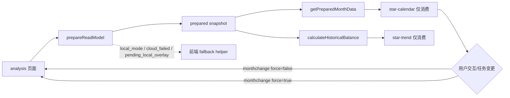

# 里程碑-21F3：analysis 读链路 fallback 收口与前端瘦身 详细设计文档

> **设计状态**：🟢 审核通过
> **创建日期**：2026-04-13
> **设计者**：GPT5 Codex
> **审核者**：项目维护者
> **依赖文档**：`docs/design/milestone-21f2-analytics-readmodel-backend-migration.md`
> **预计工期**：3-4天

---

## 📋 目录

- [需求分析](#需求分析)
- [技术方案](#技术方案)
- [代码结构](#代码结构)
- [实施步骤](#实施步骤)
- [测试方案](#测试方案)
- [风险评估](#风险评估)
- [替代方案](#替代方案)

---

## 需求分析

### 功能描述

`M21F2` 已经把 analytics 的云端 authoritative read model、任务完成统计、即将过期星星、任务星星日历查询后移到后端，前端主职责已经从“正式聚合”下降为“页面触发、缓存、消费、展示和兜底”。

但当前分析页前端仍保留一批历史兼容代码，尤其集中在 `packageChart/components/star-calendar/star-calendar.js` 和 `services/analytics-service.js`：

1. `star-calendar` 仍保留“非统一读模型”直连拉任务/星星、主动 refresh 云端的旧链路。
2. `analytics-service.calculateHistoricalBalance()` 仍保留 `scope === 'all'` 的本地-only 分支，而当前分析页根本不会走到这个 scope。
3. `groupRecordsByDate()`、`getPreparedFamilyGroupSnapshot()` 等代码已经没有产品调用，却仍残留在正式服务内。

这使得当前状态虽然“主路径已经迁正”，但前端职责边界仍不够干净：组件还能自己拉数，服务里还挂着一批不再属于当前正式链路的壳子，导致“前后端职责内聚”和“前端明显变瘦”这两个目标还没有完全兑现。

`M21F3` 的目标就是把分析页正式链路继续收口为：

1. 页面统一调用 `prepareReadModel()`
2. 组件只消费 prepared snapshot
3. 本地模式 / 后端失败 / `pending_local_overlay` 仍由前端兜底
4. 删除已经不再属于当前正式链路的前端兼容和死代码

### 业务价值

- [x] 职责更清晰：分析页正式链路进一步收口为“页面 prepare，组件消费”，组件不再承担服务编排职责。
- [x] 前端减负：删除分析页当前主路径不再需要的兼容分支、死代码和无产品调用壳子，继续缩小 `analytics-service.js` / `star-calendar.js` 体积。
- [x] 一致性更强：任务状态变化、翻月、趋势范围切换等刷新动作都回到页面统一入口，避免组件各自刷新导致的数据新鲜度漂移。
- [x] 为后续继续清理铺路：将兼容 API 与正式主链路明确分层，为后续 `M21F4` 继续退役 compatibility-only 查询接口创造条件。

### 当前代码审计结论（2026-04-13）

#### 1. 当前分析页真实产品链路已经非常单一

实际产品代码中，分析页主链路已收口到：

1. `packageChart/pages/analysis/analysis.js`
2. `services/analytics-service.js#prepareReadModel()`
3. `services/analytics-service.js#getPreparedMonthData()`
4. `services/analytics-service.js#calculateHistoricalBalance()`

组件侧真实消费路径为：

- `star-calendar` 只通过 `getPreparedMonthData()` 取当月 tasks / records
- `star-trend` 只通过 `calculateHistoricalBalance()` 取 `historyData / forecastData`

#### 2. 当前分析页不会再产生 `scope === 'all'`

`utils/view-scope.js#resolveAnalysisOptions()` 当前只返回两类分析上下文：

- `{ userId }`
- `{ scope: 'family', childUserIds }`

所以 `calculateHistoricalBalance()` 中的 `scope === 'all'` 本地-only 分支，已经不是当前分析页的正式产品 contract。

#### 3. `star-calendar` 的大量非 prepared 分支已变成历史兼容代码

当前 `analysis.wxml` 已固定传入：

- `currentMonthKey`
- `readModelVersion`

这意味着当前分析页实际始终运行在 prepared read model 模式。但 `star-calendar` 仍保留：

- `loadStarRecords()` 的非 prepared 直连拉数分支
- `updateTodayDataOnly()` 的非 prepared 直连分支
- `_refreshStarsForAnalysis()` 兼容 helper
- observer / `smartRefresh()` / 翻月导航中的 prepared / non-prepared 双分支

这些逻辑目前更像历史兼容负担，而不是当前分析页正式需求。

#### 4. 两个 service API 已是明确死代码候选

全仓 grep 结果显示：

- `groupRecordsByDate()` 没有任何调用
- `getPreparedFamilyGroupSnapshot()` 没有任何产品代码调用

这两处具备本期直接删除条件。

#### 5. 三个 analytics 公开查询 API 当前没有产品调用

当前无产品代码直接调用：

- `getTaskCompletionStats()`
- `getUpcomingExpiryStars()`
- `getTaskStarCalendarData()`

但它们仍有服务层测试，因此本期将它们明确降级为 compatibility-only 能力，不纳入 `M21F3` 的主路径收口范围；若实施前再次确认仍无调用，可在后续 `M21F4` 单独退役。

### 功能范围

**包含**：
- ✅ 删除 `groupRecordsByDate()` 死代码
- ✅ 删除 `getPreparedFamilyGroupSnapshot()` 无调用壳子
- ✅ 删除 `star-calendar` 当前分析页主路径不再需要的非 prepared 直连拉数 / 直连 refresh 分支
- ✅ 让 `star-calendar` 的刷新动作统一回到页面 `loadData()` 主入口
- ✅ 为 `monthchange` 增加 `force` 语义，支持任务状态变化时强制重新 prepare snapshot
- ✅ 删除 `calculateHistoricalBalance()` 中当前分析页不再使用的 `scope === 'all'` 分支
- ✅ 保留 `local mode`、`cloud_failed`、`pending_local_overlay` 的前端 fallback 语义
- ✅ 明确 compatibility-only analytics 查询接口不属于当前正式主链路

**不包含**：
- ❌ 不删除 `getTaskCompletionStats()`、`getUpcomingExpiryStars()`、`getTaskStarCalendarData()` 三个 compatibility-only 接口
- ❌ 不删除 `user` / `family` fallback 所需的 `_calculateAnchoredDailyBalance()`、`_calculateExpiryForecast()`、`_buildLocalPreparedSnapshot()` 等 helper
- ❌ 不改变分析页 UI 结构
- ❌ 不改变本地模式能力
- ❌ 不把所有 analytics helper 一次性全部后移到后端

### 优先级

- **优先级**：P1
- **理由**：`M21F2` 已把“谁产出正式结果”迁正；`M21F3` 要解决的是“前端主链路是否真的只剩前端该做的事”。这是兑现职责内聚和前端瘦身收益的必要收尾步骤。

---

## 技术方案

### 方案概述

`M21F3` 采用“页面统一刷新 + 组件纯消费 + fallback 保留 + compatibility 分层”的收口方案。

核心原则：

1. **当前分析页正式链路只允许页面 prepare，不允许组件自行拉云/拉本地事实**
2. **保留 fallback，但 fallback 只能服务于 local mode / 后端失败 / pending local overlay**
3. **兼容 API 和正式主链路分开对待**

也就是说，本期不是“继续迁更多算法”，而是把已迁正后的前端剩余职责再压实一层：

- 页面：唯一刷新入口
- 组件：只消费 prepared snapshot，并通过事件上报交互变化
- 服务：缓存、消费 authoritative 结果、执行最小必要 fallback

### 正式决策

#### 决策1：`star-calendar` 不再保留分析页主路径下的非 prepared 直连拉数能力

当前真实分析页已固定传入 `currentMonthKey` 和 `readModelVersion`，所以 `star-calendar` 在产品链路中应被视为 prepared-only consumer。

本期改造后：

1. `loadStarRecords()` 只负责从 `getPreparedMonthData()` 读取 snapshot
2. 不再直接调用 `taskService.getTasksByDateRange()`
3. 不再直接调用 `starService.getStarRecordsByDateRange()`
4. 不再自己调用 `_refreshStarsForAnalysis()`

这意味着“组件自己拉数”的职责从当前正式链路中被移除。

#### 决策2：组件触发的刷新统一回到页面 `loadData()`，并显式区分 `force`

删除组件直连拉数后，任务状态变化、新建任务、回到今天等场景不能再由组件自己完成数据保鲜。

本期统一采用页面主入口刷新：

- 普通翻月：`triggerEvent('monthchange', { monthKey, force: false })`
- 回到今天：`triggerEvent('monthchange', { monthKey, force: true })`
- 任务状态变化 / 新建任务 / 今日局部刷新：`triggerEvent('monthchange', { monthKey, force: true })`

`analysis.js#onCalendarMonthChange()` 接收 `force` 并透传到 `loadData()`：

- `force: false` 允许复用 30 秒 prepared snapshot
- `force: true` 强制重新 prepare，确保任务刚变化时分析页不会继续展示 TTL 内旧数据

`force=true` 的触发场景在本期必须显式收口为：

1. `goToToday()`
2. `smartRefresh()`
3. `refresh()`
4. `updateTodayDataOnly()`
5. `TASK_STATUS_UPDATED` 命中当前月份
6. `TASK_CREATED` 命中当前月份

#### 决策3：`star-calendar` 继续保留渲染缓存，但不再保留事实获取缓存语义

`monthCache` 仍可继续保留，用于避免同一 prepared snapshot 内重复做日历渲染拼装。

但它的职责仅限：

1. 缓存当前月份记录的展示态
2. 避免重复计算 `calendarDays`

它不再承担“事实数据新鲜度管理”的职责；数据新鲜度统一由页面 `prepareReadModel()` 控制。

#### 决策4：`_calculateEarnedStarsFromTasks()` 不再为分析页主路径兜底发任务查询

当前 prepared snapshot 已提供月度 tasks，`loadStarRecords()` 也会在消费 snapshot 时写入 `_monthTaskCache`。

因此本期将 `_calculateEarnedStarsFromTasks()` 收口为：

1. 优先使用 `_monthTaskCache`
2. 只有在 `loadStarRecords()` 已命中 prepared snapshot 并完成 `_monthTaskCache` 回填后，才允许进入基于 task cache 的 earned 计算
3. prepared snapshot 尚未就绪或 `_monthTaskCache` 尚未回填时，组件保持等待页面完成 prepare，不以 `0` 覆盖真实 earned 展示
4. 在已有 task records 的情况下，仍优先使用 records 汇总结果
5. 不再为了分析页主路径发起 `taskService.getTasksByDate()` 单日查询

这样可以继续去掉一层“组件为展示自己补拉任务”的历史逻辑。

补充约束：

1. `loadStarRecords()` 未命中 prepared snapshot 时，继续维持“等待页面完成 prepare”的显式行为
2. 组件此时只允许保留现有 loading 状态或已缓存展示态，不主动渲染新的空事实数据

#### 决策5：`calculateHistoricalBalance()` 删除 `scope === 'all'` 分支，但保留 user/family fallback

当前分析页只会产生 `user` / `family` 两类 scope，因此：

- 删除 `scope === 'all'` 本地-only 分支
- 删除它对 `_calculateDailyBalance()` 的正式依赖

但以下 fallback 仍必须保留：

1. `scope === 'user'` 下基于 `star_groups` 锚定当前余额
2. `scope === 'family'` 下基于 `familyGroupSnapshots` 或本地分组做锚定
3. `local mode`
4. `cloud_failed`
5. `pending_local_overlay`

说明：

- `_calculateAnchoredDailyBalance()` 继续保留
- `_calculateExpiryForecast()` 继续保留
- `_buildLocalPreparedSnapshot()` 继续保留

#### 决策6：compatibility-only analytics 查询接口本期不删，但正式降级

以下接口当前没有产品调用，但仍有测试覆盖：

- `getTaskCompletionStats()`
- `getUpcomingExpiryStars()`
- `getTaskStarCalendarData()`

本期不在 `M21F3` 内直接删除它们，原因：

1. `M21F3` 的核心目标是收口当前分析页主路径
2. 这三个接口已经脱离分析页主路径，应作为单独 compatibility 清理项处理
3. 这样可以让 `M21F3` 维持低风险、可快速交付

但文档和实现都必须明确：它们不再代表 analytics 正式主路径职责。

### DDD分层设计

**领域层（models/）**：
- [ ] 新建模型：无
- [ ] 修改模型：无
- 说明：本期是前端职责收口，不新增领域模型。

**服务层（services/）**：
- [x] 修改前端服务：`services/analytics-service.js`
- 说明：删除死代码、收口趋势 fallback 边界、保留 local mode / cloud failure / pending overlay 所需 helper。

**仓储层（repositories/）**：
- [ ] 新建仓储：无
- [ ] 修改仓储：无
- 说明：本期不新增或修改底层数据仓储。

**适配器层（adapters/）**：
- [ ] 新建适配器：无
- [ ] 修改适配器：无
- 说明：本期不改 API 适配器。

**表现层（pages/、components/）**：
- [x] 修改页面：`packageChart/pages/analysis/analysis.js`
- [x] 修改组件：`packageChart/components/star-calendar/star-calendar.js`
- [ ] 修改组件：`packageChart/components/star-trend/star-trend.js`（原则上无逻辑改造，仅测试口径受影响）
- 说明：页面重新成为唯一刷新入口，组件只消费 snapshot 并上报交互事件。

### 架构图



### 数据模型

#### `monthchange` 事件契约

```typescript
interface AnalysisMonthChangeDetail {
  monthKey: string;
  force?: boolean;
}
```

约束：

1. 翻月导航传 `force: false`
2. 回到今天传 `force: true`
3. 任务状态变化、新建任务、手动强刷、今日局部刷新传 `force: true`

### 接口设计

本期不新增后端接口。

前端页面事件契约调整：

| 事件 | 说明 | detail |
|------|------|--------|
| `monthchange` | 月份变化或请求重新 prepare | `{ monthKey, force?: boolean }` |

---

## 代码结构

### 文件变更清单

**新增文件**：
- 无

**修改文件**：
- `docs/design/milestone-21f3-analytics-fallback-convergence.md` - 本设计文档
- `packageChart/pages/analysis/analysis.js` - 接收 `monthchange.force`，统一驱动 prepare reload
- `packageChart/components/star-calendar/star-calendar.js` - 删除非 prepared 直连拉数分支，刷新动作回到页面入口
- `services/analytics-service.js` - 删除死代码 / 无调用壳子 / `scope === 'all'` 残余分支
- `test/pages/analysis.page.test.js` - 补 `force` 透传测试
- `test/pages/star-calendar.component.test.js` - 改为 prepared-only 组件契约测试
- `test/pages/star-trend.component.test.js` - 确认 `readModelVersion` 驱动趋势加载契约无回归
- `test/services/analytics-service.test.js` - 删除死代码相关测试，补收口后趋势 fallback 边界测试

### 关键函数

**函数1**：`analysis.js#onCalendarMonthChange`
- **输入**：`{ detail: { monthKey, force } }`
- **输出**：无
- **职责**：接收组件交互或刷新请求，统一调用 `loadData({ force })`
- **依赖**：`loadData()`

**函数2**：`star-calendar.js#loadStarRecords`
- **输入**：当前 `currentMonthKey`、`readModelVersion`
- **输出**：组件内部 `calendarDays` / `monthCache`
- **职责**：只从 prepared snapshot 读取月份数据并更新日历展示
- **依赖**：`analyticsService.getPreparedMonthData()`

**函数3**：`star-calendar.js#smartRefresh`
- **输入**：无
- **输出**：`monthchange` 事件
- **职责**：请求页面重新 prepare 当前月份，而不是组件自己拉数
- **依赖**：`triggerEvent('monthchange', { monthKey, force: true })`

**函数4**：`analytics-service.js#calculateHistoricalBalance`
- **输入**：`days`, `userId`, `analysisOptions`
- **输出**：`{ historyData, forecastData }`
- **职责**：优先消费 authoritative snapshot；必要时仅对 `user` / `family` fallback 重新计算
- **依赖**：`_findPreparedSnapshot()`、`_calculateAnchoredDailyBalance()`、`_calculateExpiryForecast()`

---

## 实施步骤

### 第1步：analysis 页面刷新契约收口（预计0.5天）

- [ ] **任务**：让页面成为 analysis 数据唯一刷新入口，接收 `monthchange.force`
- [ ] **验证**：翻月不强制刷新；任务变更可强制重新 prepare
- [ ] **依赖**：无

**实施要点**：
1. `analysis.js#onCalendarMonthChange()` 读取 `detail.force`
2. 普通翻月仍走 `force: false`
3. 被组件请求的强刷场景走 `force: true`
4. `goToToday()`、`refresh()`、`smartRefresh()`、`updateTodayDataOnly()`、`TASK_STATUS_UPDATED`、`TASK_CREATED` 的当前月份刷新统一收口到 `monthchange(force=true)`

---

### 第2步：`star-calendar` prepared-only 收口（预计1-1.5天）

- [ ] **任务**：删除当前分析页主路径不再需要的直连拉数 / 直连 refresh 分支
- [ ] **验证**：组件在 prepared snapshot 缺失时不自行拉云；任务变化时通过页面强刷获取新 snapshot
- [ ] **依赖**：第1步

**实施要点**：
1. 删除 `loadStarRecords()` 非 prepared 分支
2. 删除 `_refreshStarsForAnalysis()`
3. 删除 `updateTodayDataOnly()` 中的直连拉数分支
4. 收口 `smartRefresh()` / `refresh()` / observer / 翻月导航 / 事件监听到统一事件模式
5. `_calculateEarnedStarsFromTasks()` 不再单日查询任务
6. prepared snapshot 缺失时保持等待页面 prepare，不主动渲染空事实

---

### 第3步：`analytics-service` fallback 边界收口（预计1天）

- [ ] **任务**：删除死代码和不再属于当前分析页 contract 的残余分支
- [ ] **验证**：authoritative、`local_mode`、`cloud_failed`、`pending_local_overlay` 均保持正确
- [ ] **依赖**：建议在第1-2步完成后执行，避免页面/组件测试仍按旧 contract 运行时出现短暂不通过窗口

**实施要点**：
1. 删除 `groupRecordsByDate()`
2. 删除 `getPreparedFamilyGroupSnapshot()`
3. 删除 `calculateHistoricalBalance()` 的 `scope === 'all'` 分支
4. 保留 user/family fallback 所需的锚定与预测 helper
5. 对 compatibility-only 查询接口只补 owner 注释，不在本期删除

---

### 第4步：测试与回归收口（预计1天）

- [ ] **任务**：同步修正组件/页面/服务测试，补齐 force 刷新与 prepared-only 契约
- [ ] **验证**：目标测试集通过，手工回归覆盖分析页关键交互
- [ ] **依赖**：第1-3步

**实施要点**：
1. `star-calendar.component.test.js` 改为 prepared-only 契约
2. `analysis.page.test.js` 增加 `monthchange.force` 透传断言
3. `star-trend.component.test.js` 确认 `readModelVersion` 驱动趋势加载契约无回归
4. `analytics-service.test.js` 删除死代码相关测试并补 fallback 边界断言
5. 手工验证翻月、任务变更、回到今天、今日刷新、`pending_local_overlay`、云端失败 fallback

---

## 测试方案

### 自动化测试

| 模块 | 测试文件 | 关注点 |
|------|---------|-------|
| 页面刷新入口 | `test/pages/analysis.page.test.js` | `monthchange.force` 是否正确透传到 `prepareReadModel(force)` |
| 日历组件 | `test/pages/star-calendar.component.test.js` | 组件是否只消费 prepared snapshot；缺 snapshot 时不自行拉数；强刷是否上报页面 |
| 趋势组件 | `test/pages/star-trend.component.test.js` | `readModelVersion` 推进后才重新加载趋势，避免组件抢跑 |
| 趋势服务 | `test/services/analytics-service.test.js` | authoritative snapshot 直返、user/family fallback 保留、`scope === 'all'` 分支删除后无回归 |

建议执行：

```bash
npm test -- --runInBand test/pages/analysis.page.test.js test/pages/star-calendar.component.test.js test/pages/star-trend.component.test.js test/services/analytics-service.test.js
```

### 手工回归

1. 进入分析页，确认日历与趋势正常显示。
2. 左右翻月，确认页面触发重新 prepare，且无组件自行拉数日志。
3. 在分析页停留期间完成/新建任务，确认页面强刷后日历与趋势同步更新。
4. 切换 7 天 / 30 天趋势，确认页面重新 prepare 后图表更新。
5. 人为制造云端失败，确认仍能走 fallback。
6. 有 `pending_local_overlay` 的 user 视角下，确认继续优先本地 snapshot。

### 预期覆盖率

- 本期新增/修改代码的相关测试覆盖率目标：`>= 85%`

---

## 风险评估

| 风险 | 级别 | 说明 | 缓解措施 |
|------|------|------|---------|
| 删除组件直连拉数后，任务变更场景显示 TTL 内旧数据 | 高 | 页面若仍按 `force=false` prepare，会复用旧 snapshot | 引入 `monthchange.force`；任务变化和手动强刷统一走 `force=true` |
| 误删 fallback 所需 helper | 中 | `_calculateAnchoredDailyBalance()`、`_calculateExpiryForecast()` 仍服务于 local/fallback | 设计中明确 only 删除 `scope === 'all'` 与死代码，不删 user/family fallback helper |
| `star-calendar` 收口过度导致特殊场景无数据 | 中 | prepared snapshot 若未准备好，组件不再自行拉数 | 保留“未命中 prepared snapshot 时等待页面完成准备”的显式行为，并用页面测试覆盖 |
| compatibility-only 接口后续被新调用点重新使用 | 低 | 当前无产品调用，但未来可能被新增代码误用 | 本期不删除，先在文档与代码 owner 注释中明确其兼容层属性 |

---

## 替代方案

### 方案A：维持现状，只接受“主路径已经后移”

优点：

1. 不需要继续动分析页代码
2. 风险最低

缺点：

1. 组件仍保留自己拉数的历史能力，前后端职责仍不够干净
2. 前端瘦身收益兑现不足
3. 新同学阅读代码时，仍难分清哪条是正式链路、哪条只是历史兼容

结论：不采用。`M21F2` 只解决了“结果归属”，没有完成“前端主链路真正变薄”。

### 方案B：本期连 compatibility-only API 一起全部删除

优点：

1. 前端减量更大
2. `analytics-service.js` 更瘦

缺点：

1. 当前里程碑目标会从“分析页主链路收口”扩大到“兼容 API 退役”
2. 变更面和测试面都会明显增大
3. 会增加本期评审复杂度

结论：本期不采用，留作 `M21F4` 候选。

### 方案C：继续把剩余 fallback 全量迁到后端，并删除前端 fallback

优点：

1. 理论上边界最极致
2. 前端还能继续变瘦

缺点：

1. 直接牺牲本地模式 / 后端失败降级能力
2. 与当前项目“本地优先 + 混合存储 + 可降级”的定位冲突
3. 这不是当前项目接受的产品策略

结论：不采用。当前项目仍必须保留前端 fallback，只能继续缩小其边界。
