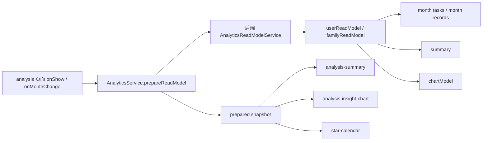

# 里程碑-21G：分析页指标重构与轻图表收口 详细设计文档

> **设计状态**：🟢 审核通过
> **创建日期**：2026-04-13
> **设计者**：GPT5 Codex
> **审核者**：项目维护者
> **依赖文档**：`docs/design/milestone-21f2-analytics-readmodel-backend-migration.md`、`docs/design/milestone-21f3-analytics-fallback-convergence.md`
> **预计工期**：4-5天

---

## 📋 目录

- [需求分析](#需求分析)
- [技术方案](#技术方案)
- [代码结构](#代码结构)
- [实施步骤](#实施步骤)
- [测试方案](#测试方案)
- [风险评估](#风险评估)
- [替代方案](#替代方案)
- [审核记录](#审核记录)

---

## 需求分析

### 功能描述

当前分析页仍然是“任务星星日历 + 星星余额趋势图”的旧结构，存在三类根问题：

1. 页面价值偏离。首页已经回答“今天要做什么”，奖池页已经回答“能换什么”；分析页继续展示“星星余额怎么变”，对家长和孩子都不够直接。
2. 工程投入失衡。`echarts` 仅服务一个趋势图组件，包体和接线复杂度明显过高。
3. 历史包袱过重。分析页状态、服务契约、测试命名都围绕 `trendDays / historyData / forecastData / star-trend` 展开，已经不符合当前产品目标。

因此，`M21G` 的目标不是“给旧趋势图换一个轻量图库”，而是：

1. 重做分析页产品定位，让页面围绕“统计分析与行为洞察”工作。
2. 按角色区分家长/孩子最值得看的少量核心指标。
3. 保留高解释力的事实层组件 `star-calendar`。
4. 删除旧趋势图和相关正式产品链路。
5. 将图表收缩为一个可选的轻量比较图，并统一改用 `wxcharts-min`。

### 业务价值

- [x] 用户价值：家长更快看到需要关注的孩子和风险类型，孩子更快看到自己这一周做得怎么样、哪里需要补。
- [x] 技术价值：删除 `echarts / ec-canvas / star-trend` 旧链路，降低分析分包体积与维护复杂度。
- [x] 业务价值：分析页从“看起来像分析”转为“真的能支持判断和行动”，提高页面存在意义。

### 功能范围

**包含**：
- ✅ 重构分析页信息架构，明确家长/孩子两套展示语义
- ✅ 保留 `star-calendar` 作为事实层，下沉到页面后半部分
- ✅ 删除旧 `star-trend` 趋势预测图
- ✅ 删除 `echarts / ec-canvas` 及相关正式依赖
- ✅ 接入 `wxcharts-min`，但只承接一个简单比较图
- ✅ 调整 prepared read model contract，输出 `summary + chartModel + month facts`
- ✅ 清理 `trendDays / historyData / forecastData / calculateHistoricalBalance()` 的正式产品链路
- ✅ 同步清理旧分析页文案、状态、测试和文档契约

**不包含**：
- ❌ 不重做首页和奖池页
- ❌ 不新增 BI 报表系统、筛选器矩阵或多维自定义看板
- ❌ 不保留“旧趋势图 + 新轻图表”双轨并存
- ❌ 不把今日任务列表或奖池兑换事实再搬进分析页
- ❌ 不在本期扩展更多角色体系，仅处理家长/孩子

### 优先级

- **优先级**：P1
- **理由**：这次重构同时解决产品价值不足、前端包体过重和旧职责残留问题，ROI 明显高于继续优化旧趋势图。

---

## 技术方案

### 方案概述

`M21G` 采用“**summary read model + 角色化洞察页 + 轻图表最小化**”方案。

本期的正式产品结构收口为：

1. 顶部指标总览卡
2. 角色化洞察模块
3. 一个轻量比较图
4. 任务星星日历事实层

旧的 `star-trend`、`trendDays`、`historyData / forecastData`、`echarts / ec-canvas` 不再属于分析页正式产品路径。

### 现状审计

结合现有实现，当前问题可以明确量化：

1. `packageChart/pages/analysis/analysis.js` 仍保留 `trendDays` 和 `onTrendRangeChange`，页面状态明显围绕旧趋势图组织。
2. `packageChart/components/star-trend/star-trend.js` 约 772 行，是分析页最重的表现层组件。
3. `packageChart/pages/analysis/analysis.json` 仍直接依赖 `star-trend` 和 `ec-canvas`。
4. `packageChart/ec-canvas/echarts.js` 约 502KB，而用户新增的 `wxcharts-min.js` 约 30KB，替换收益明确。
5. `services/analytics-service.js` 与 `backend/services/analyticsReadModelService.js` 仍保留 `trendDays / historyData / forecastData` 契约，这条旧趋势链路已经穿透到服务层。

因此，这个里程碑必须同时解决产品、页面和服务契约三层问题，不能只做前端换库。

### 产品信息架构

#### 决策1：分析页只展示“统计与洞察”，不重复首页/奖池页事实

分析页不再重复以下信息：

- 今日任务列表
- 奖励可兑换事实
- 单纯的当前余额变化预测

这些事实分别由首页和奖池页承接。分析页只保留跨天、跨成员、可支持判断的统计指标与洞察。

#### 决策2：孩子视角只保留 4 个核心指标 + 3 个洞察

孩子视角核心指标：

1. 本周完成率
2. 连续达标天数
3. 本周净得星星
4. 7 天内即将过期星星

孩子视角洞察：

1. 最强任务类型
2. 最弱任务类型
3. 今日必做未完成数量

设计原则：

1. 所有指标都要能被孩子理解。
2. 不展示抽象预测，不让孩子面对“未来余额曲线”。
3. 指标要能直接转成行为，例如“今天还差几个必做”。

#### 决策3：家长视角只保留 4 个核心指标 + 3 个洞察

家长视角核心指标：

1. 家庭本周完成率
2. 需关注孩子数
3. 本周扣星/风险事件数
4. 7 天内即将过期星星总数

家长视角洞察：

1. 风险孩子列表
2. 家庭最弱任务类型
3. 孩子完成率对比

设计原则：

1. 家长要先知道“谁需要关注”，而不是先看抽象曲线。
2. 洞察要支持干预和沟通，不追求展示花哨图表。
3. 页面默认是一屏内看出重点，日历用于下钻核对事实。

#### 决策4：图表只保留一个简单比较图，统一改用 `wxcharts-min`

本期保留的唯一图表能力：

- 孩子视角：最近 7 天完成率柱状图
- 家长视角：孩子本周完成率对比柱状图

不再保留：

- 历史余额曲线
- 未来余额预测
- 虚线预测段
- 过期点高亮预测图
- 7/30 天趋势切换

说明：

1. `wxcharts-min` 足以承接本期所需的简单比较图。
2. 本期目标不是复刻 ECharts 视觉能力，而是主动放弃低价值复杂图。
3. 如果实施后评估发现简单图也价值不足，可以继续降级为纯 summary 页面，但绝不回退到 ECharts。

#### 决策5：`star-calendar` 保留，但降级为事实层而非主角

`star-calendar` 的价值依然成立，因为它回答的是：

- 哪天完成了什么任务
- 哪天得星、扣星、退星
- 具体事实发生在哪一天

所以页面顺序改为“先 summary，再图表，再 calendar”。用户先看结论，再需要时看日历事实。

#### 决策6：prepared read model 继续保留，但契约改为 summary-first

本期仍保留页面统一入口 `prepareReadModel()`，因为它已在 `M21F2 / M21F3` 中形成正式语义。

但 snapshot 正式 contract 调整为：

- `month tasks`
- `month records`
- `summary`
- `chartModel`

明确移除：

- `trendDays`
- `historyData`
- `forecastData`
- `calculateHistoricalBalance()` 的正式产品职责

这意味着前端不再拿旧趋势数据做二次解释，后端也不再为分析页正式返回预测曲线。

#### 决策7：页面状态遵循“先 loading，再内容；失败不闪空白”

分析页在新结构下必须显式区分 4 种页面状态：

1. `loading`
2. `ready`
3. `empty`
4. `error/fallback`

表现规则：

1. `prepareReadModel()` 尚未完成时，页面保持 loading skeleton，不渲染空白 summary 卡。
2. 存在 snapshot 且 `summary/cards/tasks/records` 全部为空时，展示空态文案，不渲染空图。
3. 后端失败但存在 fallback snapshot 时，允许展示 fallback 内容，并以弱提示文案说明“当前展示的是本地兜底数据”。
4. 后端失败且无可用 snapshot 时，展示错误空态与重试入口，不回退旧趋势图，也不渲染误导性的 0 指标。

这样可以避免页面在 loading 和失败场景中出现“卡片一闪而空”或“0 指标误导用户”的体验问题。

#### 决策8：导航标题与视觉语气统一为“成长分析”

`analysis` 页导航标题本期统一调整为：

- `成长分析`

原因：

1. 比“分析”更具体，也比“星星日历”更符合新页面定位。
2. 与孩子视角的成长反馈、家长视角的成长观察更贴合。
3. 可以作为页面文案语气的上位约束，避免最终实现偏向冷冰冰的 BI 面板。

视觉语气约束：

1. 孩子视角文案偏鼓励和进展感。
2. 家长视角文案偏关注点和提醒，但避免焦虑化表达。
3. 页面只允许少量语义色，不做高饱和大屏报表风格。

### 技术选型

| 技术点 | 选择方案 | 替代方案 | 选择理由 |
|--------|---------|---------|---------|
| 页面数据入口 | 继续使用 `prepareReadModel()` | 新增 `prepareDashboard()` | 保留统一 prepare/caching 入口，避免多一套主链路 |
| snapshot 契约 | `summary + chartModel + month facts` | 保留 `historyData / forecastData` | 新契约更符合新页面目标，且能彻底清理旧趋势链 |
| 图表库 | `wxcharts-min` | 继续保留 `echarts` | 本期只剩简单比较图，`echarts` 明显过重 |
| 页面结构 | `summary -> chart -> calendar` | `calendar -> trend` | 先给洞察，再给事实，更符合分析页定位 |
| 旧链处理 | 同期删除正式趋势链路 | 先兼容保留，后续再删 | 用户明确要求旧分析页重做并清理，分两期清理会降低 ROI |
| 页面状态 | `loading/ready/empty/error` 显式区分 | 复用旧页面隐式状态 | 新页面以 summary 为主，必须避免 0 指标和空白闪烁误导 |

### DDD分层设计

**领域层（models/）**：
- [ ] 新建模型：无
- [ ] 修改模型：无
- 说明：本期新增的是 read model contract，不新增持久化实体。

**服务层（services/）**：
- [x] 修改前端服务：`services/analytics-service.js`
- [x] 修改后端服务：`backend/services/analyticsReadModelService.js`
- [x] 修改后端内部模块：`backend/services/analytics-read-model/userReadModel.js`
- [x] 修改后端内部模块：`backend/services/analytics-read-model/familyReadModel.js`
- 说明：后端负责聚合 summary 和 chartModel，前端负责页面编排、缓存和展示；旧趋势 helper 进入删除范围。

**仓储层（repositories/）**：
- [ ] 新建仓储：无
- [ ] 修改仓储：无
- 说明：优先复用现有任务、星星和家庭查询能力，不为本期新增专用仓储。

**适配器层（adapters/）**：
- [ ] 新建适配器：无
- [ ] 修改适配器：无
- 说明：本期不新增适配器，图表库以 vendored 文件方式接入。

**表现层（pages/、components/）**：
- [x] 修改页面：`packageChart/pages/analysis/analysis`
- [x] 修改组件：`packageChart/components/star-calendar/star-calendar`
- [x] 新建组件：`packageChart/components/analysis-summary`
- [x] 新建组件：`packageChart/components/analysis-insight-chart`
- [x] 删除组件：`packageChart/components/star-trend`
- 说明：表现层目标是“瘦页面 + 明确职责”，不保留旧趋势图兼容壳。

### 架构图



### 数据模型

```typescript
type InsightTone = 'neutral' | 'good' | 'warning' | 'risk';

interface SummaryCard {
  label: string;
  value: string | number;
  tone?: InsightTone;
  hint?: string;
}

interface AttentionItem {
  userId?: string;
  title: string;
  summary: string;
  level: 'warning' | 'risk';
}

interface ChildInsightSummary {
  roleView: 'child';
  cards: SummaryCard[];
  highlights: {
    strongestType: 'study' | 'habit' | 'interest' | null;
    weakestType: 'study' | 'habit' | 'interest' | null;
    todayRequiredPendingCount: number;
  };
  attentionItems: AttentionItem[];
}

interface FamilyChildSummary {
  userId: string;
  displayName: string;
  weekCompletionRate: number;
  todayRequiredPendingCount: number;
  weekPenaltyCount: number;
  weekNetStars: number;
  weakestType: 'study' | 'habit' | 'interest' | null;
  riskLevel: 'normal' | 'warning' | 'risk';
}

interface ParentInsightSummary {
  roleView: 'parent';
  cards: SummaryCard[];
  highlights: {
    weakestType: 'study' | 'habit' | 'interest' | null;
  };
  attentionItems: AttentionItem[];
  childSummaries: FamilyChildSummary[];
}

interface AnalysisChartModel {
  kind: 'daily_completion_rate' | 'child_completion_compare';
  categories: string[];
  series: Array<{ name: string; data: number[] }>;
  unit: '%' | '次';
}

interface PreparedAnalyticsSnapshot {
  scope: 'user' | 'family';
  monthKey: string;
  tasks: object[];
  records: object[];
  summary: ChildInsightSummary | ParentInsightSummary;
  chartModel: AnalysisChartModel | null;
  refreshedAt: number;
  mode: 'authoritative' | 'fallback';
}
```

说明：

1. `currentBalance` 不再作为分析页主展示字段进入正式 contract。
2. 如果后端内部计算 summary 仍需用到余额，可保留为内部中间值，但不再向页面暴露为主指标。

### 接口设计

本期继续沿用：

- `POST /api/analytics/read-model/query`

但会同步调整 REST contract：

**请求体**：

```json
{
  "scope": "user | family",
  "monthKey": "2026-04",
  "userId": "child-id",
  "childUserIds": ["child-1", "child-2"]
}
```

明确删除请求字段：

- `trendDays`

**成功响应核心结构**：

```json
{
  "success": true,
  "data": {
    "snapshot": {
      "scope": "user",
      "monthKey": "2026-04",
      "tasks": [],
      "records": [],
      "summary": {},
      "chartModel": null,
      "refreshedAt": 1770000000000,
      "mode": "authoritative"
    }
  }
}
```

明确删除响应字段：

- `historyData`
- `forecastData`

**前端服务接口**：

| 方法 | 说明 | 参数 | 返回值 |
|------|------|------|--------|
| `prepareReadModel` | 统一准备分析页 snapshot | `{ analysisOptions, monthKey, force }` | `{ success, snapshot, fallback }` |
| `getPreparedMonthData` | 返回 calendar 所需 facts | `{ analysisOptions, monthKey }` | `{ tasks, records, refreshedAt, fallback } \| null` |
| `getPreparedSummary` | 返回 summary 与轻图表模型 | `{ analysisOptions, monthKey }` | `{ summary, chartModel, refreshedAt, fallback } \| null` |

明确进入删除范围的前端公开接口：

- `calculateHistoricalBalance()`

说明：

1. 这次 contract 变更属于正式接口调整，实施时必须同步更新 `docs/api/backend-rest-api.md` 与 `docs/api/services-guide.md`。
2. 本期目标不是兼容旧趋势图，所以不保留 `historyData / forecastData` 的兼容返回。

---

## 代码结构

### 文件变更清单

**新增文件**：
- `docs/design/milestone-21g-analytics-dashboard-redesign.md` - 本设计文档
- `packageChart/components/analysis-summary/analysis-summary.js` - 指标卡与洞察列表组件
- `packageChart/components/analysis-summary/analysis-summary.wxml` - summary 结构
- `packageChart/components/analysis-summary/analysis-summary.wxss` - summary 样式
- `packageChart/components/analysis-insight-chart/analysis-insight-chart.js` - 轻量比较图组件
- `packageChart/components/analysis-insight-chart/analysis-insight-chart.wxml` - 图表结构
- `packageChart/components/analysis-insight-chart/analysis-insight-chart.wxss` - 图表样式
- `packageChart/vendor/wxcharts-min.js` - vendored 轻量图表库

**删除文件**：
- `packageChart/components/star-trend/star-trend.js`
- `packageChart/components/star-trend/star-trend.wxml`
- `packageChart/components/star-trend/star-trend.wxss`
- `packageChart/components/star-trend/star-trend.json`
- `packageChart/ec-canvas/echarts.js`
- `packageChart/ec-canvas/ec-canvas.js`
- `packageChart/ec-canvas/ec-canvas.wxml`
- `packageChart/ec-canvas/ec-canvas.wxss`
- `packageChart/ec-canvas/wx-canvas.js`

**修改文件**：
- `packageChart/pages/analysis/analysis.js` - 删除 `trendDays` 状态和趋势交互，改为 summary-first 页面编排
- `packageChart/pages/analysis/analysis.wxml` - 删除旧趋势图区域，改为 summary + chart + calendar 布局
- `packageChart/pages/analysis/analysis.json` - 删除 `star-trend/ec-canvas` 依赖，并将导航标题收口为“成长分析”
- `packageChart/components/star-calendar/star-calendar.js` - 保持事实层职责，适配新的页面结构与刷新节奏
- `services/analytics-service.js` - 输出 `summary/chartModel`，删除 `calculateHistoricalBalance()` 和旧趋势正式契约
- `backend/services/analyticsReadModelService.js` - 调整 read model contract，删除 `trendDays/historyData/forecastData`
- `backend/services/analytics-read-model/userReadModel.js` - 生成孩子视角 summary 和 chartModel
- `backend/services/analytics-read-model/familyReadModel.js` - 生成家长视角 summary 和 chartModel
- `test/pages/analysis.page.test.js` - 更新页面结构、角色分化和刷新契约测试
- `test/pages/star-calendar.component.test.js` - 确认日历事实层无回归
- `test/services/analytics-service.test.js` - 改为验证 summary/chartModel 读取，不再测试旧趋势接口
- `backend/test/unit/analyticsReadModelService.test.js` - 补 summary 聚合和 chartModel 测试
- `docs/api/backend-rest-api.md` - 更新 read model REST contract
- `docs/api/services-guide.md` - 更新前端 `AnalyticsService` 服务契约

### 核心代码结构

```javascript
// services/analytics-service.js
async prepareReadModel({ analysisOptions = {}, monthKey, force = false } = {}) {
  const result = await this._queryReadModel({ analysisOptions, monthKey, force });
  this._cachePreparedSnapshot(result.snapshot);
  return {
    success: true,
    snapshot: result.snapshot,
    fallback: result.snapshot.mode === 'fallback'
  };
}

getPreparedSummary({ analysisOptions = {}, monthKey } = {}) {
  const snapshot = this._findPreparedSnapshot(analysisOptions, monthKey);
  if (!snapshot) return null;

  return {
    summary: snapshot.summary,
    chartModel: snapshot.chartModel,
    refreshedAt: snapshot.refreshedAt,
    fallback: snapshot.mode === 'fallback'
  };
}

// backend/services/analytics-read-model/userReadModel.js
function buildUserAnalyticsSnapshot(input) {
  return {
    scope: 'user',
    monthKey: input.monthKey,
    tasks: input.monthTasks,
    records: input.monthRecords,
    summary: buildChildSummary(input),
    chartModel: buildChildCompletionChart(input),
    refreshedAt: input.nowTimestamp,
    mode: 'authoritative'
  };
}
```

### 关键函数

**函数1**：`buildChildSummary(input)`
- **输入**：`summaryTasks`、`records`、`groups`、`nowTimestamp`
- **输出**：`ChildInsightSummary`
- **职责**：聚合孩子视角的核心指标和行为洞察
- **依赖**：完成率、连续达标、类型统计、到期星星聚合

**函数2**：`buildParentSummary(input)`
- **输入**：`summaryTasks`、`records`、`childGroups`、`childUsers`
- **输出**：`ParentInsightSummary`
- **职责**：聚合家庭视角的总览、风险列表和孩子对比
- **依赖**：按孩子维度的任务与星星聚合

**函数3**：`buildChartModel(input)`
- **输入**：角色视角对应 summary 原始数据
- **输出**：`AnalysisChartModel | null`
- **职责**：生成简单比较图所需的统一模型
- **依赖**：`wxcharts-min`

**函数4**：`getPreparedSummary({ analysisOptions, monthKey })`
- **输入**：分析范围和月份
- **输出**：`summary + chartModel + 缓存元数据`
- **职责**：向 summary 组件和图表组件暴露统一已准备数据
- **依赖**：prepared snapshot 缓存

---

## 实施步骤

### 第1步：冻结新分析页产品边界与契约（预计0.5天）

- [ ] **任务**：确认家长/孩子最终指标清单、图表数量和新 snapshot contract
- [ ] **验证**：设计文档中明确写出“删什么、保留什么、谁看什么”
- [ ] **依赖**：无

**实施要点**：
1. 明确本期目标是重做分析页，不是换库复刻旧趋势图。
2. 明确分析页不再展示今日任务事实、奖池兑换事实、余额预测曲线。
3. 明确 `trendDays / historyData / forecastData / calculateHistoricalBalance()` 进入删除范围。

---

### 第2步：后端 read model 改为 summary-first（预计1.5天）

- [ ] **任务**：在后端生成 `summary + chartModel + month facts`，删除趋势字段输出
- [ ] **验证**：`user / family` 两种 scope 均能输出稳定结构
- [ ] **依赖**：第1步

**实施要点**：
1. `month tasks/records` 继续服务 `star-calendar`。
2. `summary` 所需数据窗口以“当前周/最近7天”为主，不与翻月事实窗口混淆。
3. 家长视角必须一次性输出 `childSummaries` 和 `attentionItems`，不允许前端循环拼。
4. REST contract 同步删除 `trendDays / historyData / forecastData`。

---

### 第3步：前端页面重做为 summary-first（预计1天）

- [ ] **任务**：重构分析页布局，接入 summary 组件和轻图表组件
- [ ] **验证**：页面不再引用 `star-trend`、`trendDays`、`rangechange`
- [ ] **依赖**：第2步

**实施要点**：
1. `analysis.js` 继续持有统一 `prepareReadModel()` 入口和翻月刷新。
2. `analysis.wxml` 页面顺序改为 `summary -> chart -> calendar`。
3. `analysis.json` 导航标题从“星星日历”收口为“成长分析”。
4. 页面必须实现 `loading/ready/empty/error` 四种显式状态。
5. `star-calendar` 只负责 month facts 展示，不再承担 summary 或趋势职责。

---

### 第4步：删除旧趋势链并接入 `wxcharts-min`（预计1天）

- [ ] **任务**：删除 `star-trend / echarts / ec-canvas`，用 `wxcharts-min` 承接单一简单图
- [ ] **验证**：分析分包中不再存在 ECharts 依赖
- [ ] **依赖**：第3步

**实施要点**：
1. 将用户提供的 `wxcharts-min.js` 规范落位到 `packageChart/vendor/`。
2. 轻图表只支持本期定义的两种 chartModel。
3. 不保留旧趋势图 fallback，也不保留 `ec-canvas` 兼容壳。

---

### 第5步：契约与测试收口（预计1天）

- [ ] **任务**：清理旧趋势相关服务方法、测试与 API 文档
- [ ] **验证**：代码、测试、接口文档和设计文档语义一致
- [ ] **依赖**：第4步

**实施要点**：
1. 删除 `AnalyticsService.calculateHistoricalBalance()` 及对应测试。
2. 更新 `docs/api/backend-rest-api.md` 和 `docs/api/services-guide.md`，确保单一数据源准确。
3. grep 确认仓库内正式实现不再引用 `star-trend / ec-canvas / trendDays / historyData / forecastData`。

---

## 测试方案

### 单元测试

| 测试项 | 测试方法 | 预期结果 |
|--------|---------|---------|
| 孩子 summary 聚合 | `backend/test/unit/analyticsReadModelService.test.js` | 正确输出孩子 4 张指标卡、洞察和图表模型 |
| 家长 summary 聚合 | `backend/test/unit/analyticsReadModelService.test.js` | 正确输出家庭指标、风险列表和孩子对比数据 |
| 前端 prepared summary 读取 | `test/services/analytics-service.test.js` | `prepareReadModel/getPreparedSummary` 正确消费新 contract |
| 页面角色分化渲染 | `test/pages/analysis.page.test.js` | 家长/孩子两种布局与文案正确切换 |
| 轻图表适配 | 组件测试或页面测试 | `wxcharts-min` 能正确渲染本期两种简单图 |

### 集成测试

- [ ] 场景1：孩子视角进入分析页，看到孩子版 summary、轻图表和日历
- [ ] 场景2：家长视角进入分析页，看到家庭版 summary、孩子对比图和日历
- [ ] 场景3：翻月只刷新 `calendar facts`，summary 保持其当前周统计语义
- [ ] 场景4：任务状态变化后，summary 与日历都刷新，不再出现趋势范围切换逻辑
- [ ] 场景5：后端失败时，页面展示 fallback 或空态，不回退到旧趋势图
- [ ] 场景6：prepared snapshot 未就绪时，页面保持 loading，不闪空白卡片或 0 指标

### 手动测试

1. **孩子视角**
   - [ ] 可看到 4 个核心指标，文案对孩子友好
   - [ ] 轻图表展示最近 7 天完成率
   - [ ] 星星日历仍支持翻月和回到今天

2. **家长视角**
   - [ ] 可看到家庭总览指标
   - [ ] 风险孩子列表能指出需要关注的对象
   - [ ] 孩子对比图与列表数据一致

3. **清理回归**
   - [ ] 页面不再出现旧趋势图
   - [ ] 分包不再加载 `echarts / ec-canvas`
   - [ ] 真机与开发者工具中的 `wxcharts-min` 均可正常显示

4. **状态体验**
   - [ ] loading 状态下 summary、图表和日历骨架层级清楚
   - [ ] 空态不出现误导性的 0 指标和空图
   - [ ] fallback/错误态有明确提示和重试入口

### 测试覆盖率目标

- 最低要求：85%
- 推荐目标：90%

---

## 风险评估

### 技术风险

| 风险项 | 影响 | 概率 | 应对措施 |
|--------|------|------|---------|
| 新 summary contract 改动面较大 | 中 | 高 | 第1步先冻结 contract，再集中改服务、页面和测试 |
| 旧趋势链残留引用导致回归 | 中 | 中 | 第5步以 grep 和定向测试做清理闸门 |
| `wxcharts-min` 真机表现不如预期 | 中 | 中 | 图表类型限定为简单柱状图，并做真机专项回归 |
| 家长视角字段继续膨胀 | 中 | 中 | 固定 4 卡 + 3 洞察，不允许继续堆叠指标 |
| 周指标和月日历窗口混淆 | 中 | 中 | contract 中显式拆分 `summary` 与 `month facts` 语义 |

### 业务风险

| 风险项 | 影响 | 概率 | 应对措施 |
|--------|------|------|---------|
| 指标仍与首页/奖池重复 | 中 | 中 | 设计中写死“分析页不重复已有事实”约束 |
| 删除趋势图后部分用户不适应 | 低 | 中 | 用更清晰的指标卡和风险列表替代，不做文案迁就 |
| 图表仍然价值不足 | 低 | 中 | 图表组件与 summary 解耦，可后续继续降级为纯文本版 |

### 收益预估

本期实施后的收益应诚实表述为：

1. **前端包体减重明确**：删除约 502KB 的 `echarts.js` 和整套 `ec-canvas` 适配层。
2. **表现层复杂度明显下降**：删除 `star-trend` 这一整块约 772 行的旧趋势组件，并去掉页面层 `trendDays` 交互状态。
3. **职责边界更清晰**：分析页正式职责从“趋势预测展示”收口为“summary 洞察 + calendar 事实”；后端正式职责从“给前端喂趋势点”收口为“提供分析页所需 summary 读模型”。
4. **前端真正变瘦**：不只是换库，而是删除一条完整旧链路。

---

## 替代方案

### 方案A：只把 `echarts` 替换成 `wxcharts-min`，其他不动

**不选原因**：

1. 只能解决包体问题，不能解决页面价值问题。
2. 旧趋势图语义仍然低价值，前端仍背着一整套老状态和老契约。
3. 最终只会变成“换了库但页面没变好”。

### 方案B：保留旧趋势图，同时新增 summary 区域

**不选原因**：

1. 页面会变得更重，信息重复更严重。
2. 前端不会变瘦，只会继续叠加复杂度。
3. 与用户“旧分析页要重做，旧的可以清理”的诉求相悖。

### 方案C：彻底删图表，只做 summary + calendar

**本期暂不选原因**：

1. 孩子最近 7 天表现和家长孩子间对比，仍值得保留一个轻量图。
2. 但本期会把图表缩到只有一个组件，且后续可继续降级，不影响主体信息架构。

### 方案D：保留 `historyData / forecastData` 兼容返回，等下期再删

**不选原因**：

1. 会把旧链路继续拖入下一里程碑，收益被摊薄。
2. 当前调用链显示这套契约几乎只为 `star-trend` 服务，同期删除更划算。
3. 不符合“前后端职责内聚、冗余彻底清理”的目标。

---

## 审核记录

### 审核要点清单

- [x] 已明确本期目标是重做分析页，而不是换库复刻旧趋势图
- [x] 已明确家长/孩子两套核心指标和洞察
- [x] 已明确分析页不重复首页/奖池页事实
- [x] 已明确 `star-trend / echarts / ec-canvas` 进入删除范围
- [x] 已明确 `trendDays / historyData / forecastData / calculateHistoricalBalance()` 进入正式产品删除范围
- [x] 已明确 `wxcharts-min` 只承接单一简单比较图
- [x] 已明确实施后需同步更新 REST/API 文档
- [x] 已明确 loading/empty/fallback/error 状态表现规则
- [x] 已明确导航标题与整体视觉语气约束

### 本版修改记录

- 基于当前分析页真实实现补充了现状审计，避免设计脱离代码现状。
- 将本期目标从“轻图表替换”收紧为“分析页产品重构 + 旧趋势链退役”。
- 明确写死家长/孩子各 4 个核心指标和 3 个洞察，防止指标再次膨胀。
- 将 `trendDays / historyData / forecastData / calculateHistoricalBalance()` 从“弱化”提升为“正式删除范围”。
- 将前端收益改为诚实表述：不仅是包体减重，更是删除 `star-trend + ec-canvas + 旧趋势契约` 整条链路。
- 补充了 `loading/empty/fallback/error` 四种页面状态表现规则，避免新页面在数据未就绪或失败时误导用户。
- 将导航标题和整体视觉语气统一为“成长分析”，避免实现回到旧“星星日历”语义。
