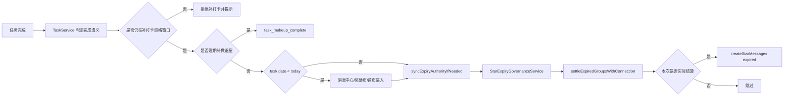

# 里程碑-21H：任务补打卡资格与消息语义治理 详细设计文档

> **设计状态**：🟢 审核通过
> **创建日期**：2026-04-14
> **设计者**：GPT5 Codex
> **审核者**：项目维护者
> **预计工期**：3-4天

---

## 📋 目录

- [需求分析](#需求分析)
- [技术方案](#技术方案)
- [代码结构](#代码结构)
- [实施步骤](#实施步骤)
- [测试方案](#测试方案)
- [风险评估](#风险评估)
- [替代方案](#替代方案)
- [审核要点自检](#审核要点自检)
- [审核记录](#审核记录)

---

## 需求分析

### 功能描述

当前项目在“任务有效期”“历史补打卡”“消息中心文案”这三个点上，代码链路已经能跑通，但产品语义并不清晰。真实代码复核后确认，系统现在只有“星星即将过期提醒”，没有“星星已实际到期并扣减”的正式消息；任务完成消息也只区分“普通完成”和“逾期补做”，并不会把“今天完成”和“补打卡完成历史任务”区分开来。更关键的是，当前代码把 `本周有效 / 本月有效 / 本季度有效` 理解成“完成当天再按当前时间计算奖励过期日”，这与用户对“这条任务只能在所属自然周期内补打卡”的直觉不一致。

这不是单个函数的实现 bug，而是一个跨任务域、星星域、消息域的规则治理问题。M21H 的目标，是在保持主链稳定的前提下，把以下三件事正式收口：第一，把 `本周结束 / 本月结束 / 本季度结束` 从“获星后有效期”改成“任务补打卡资格窗口”；第二，补齐“真实到期扣减”消息；第三，把完成消息拆成用户能理解的三种正式语义，让家长和孩子能看懂“今天完成”“历史补打卡完成”“逾期后补做并退星”的区别。

### 业务价值

- [x] 用户价值：用户能明确知道哪些历史任务还能补打卡，哪些已经过了补做窗口，以及星星为什么减少。
- [x] 技术价值：把 M16B、M16C、M19D 已落地但仍分散的语义收敛成一套正式契约，减少后续继续靠文案猜行为。
- [x] 业务价值：降低“为什么跨周还能补打卡”“为什么允许点完成却不给星”“为什么余额变了没解释”的争议。

### 事实基线（2026-04-14，设计前）

#### 1. 当前只有“即将过期提醒”，没有“已到期扣减通知”

后端 `messageService.createStarMessages()` 目前只支持 `action === 'expiring'`，生成 `notificationType = 'star_expiring'` 的正式消息。  
但后端 `starService.settleExpiredGroupsWithConnection()` 在删除过期分组、写入 `star_expiry_settlement` 流水后，并不会生成任何“已扣减”消息。

这意味着：

- 用户可能先看到余额已减少
- 再进入消息中心时只能看到旧的“即将过期”提醒
- 但没有一条明确解释“这批星星已经真的到期并扣除了”

#### 2. 当前“本周有效 / 本月有效”是按实际获星时间计算，不是按任务所属自然周期限制补打卡

前端任务完成时，`task-write.js` 调用 `starService.calculateExpiryDate(task.pointsExpiry)`，该函数内部以当前 `now` 计算本周日 / 本月末 / 本季度末。  
因此，用户在第二周去补打卡第一周的任务时，仍会按照“补打卡当天所在周”获得“本周有效”星星。

这说明当前真实语义其实是：

- “本周有效” = 完成后至本周日有效
- 不是“任务只允许在所属自然周内补打卡”

#### 3. 当前消息只区分普通完成和逾期补做，不区分历史补打卡

前端本地消息模型只有：

- `NotificationType.COMPLETED`
- `NotificationType.MAKEUP_COMPLETED`

后端正式消息动作也只有：

- `task_complete`
- `task_makeup_complete`

如果一个孩子今天完成了今天的任务，同时又补打卡完成了上周某个历史任务，但那条历史任务并没有发生过必做惩罚，那么两条消息都会表现为“完成任务”，用户无法直接理解它们对应的是不同日期的两次完成。

#### 4. 当前“跨周后仍能补打卡并加星”与用户预期冲突

现有实现里，历史补打卡是否加星，取决于：

- 这条任务是否尚未奖励过星
- 是否是必做惩罚退星场景

而不是取决于任务原计划日期是否已经跨周 / 跨月 / 跨季度。  
换句话说，代码没有“历史日期一旦过了其所属自然周期，就禁止继续补打卡”的规则。

#### 5. 当前必做任务虽然不发普通奖励星，但用户心智仍会把它理解为受同一补打卡时效控制

从代码实现上看，必做任务完成时不会发普通奖励星，因此当前并不存在“必做任务奖励星有效期”这个独立概念。  
但从产品心智上看，用户不会把普通任务和必做任务理解成两套完全不同的“补打卡时效规则”。如果任务表单里已经配置了统一的时效类型，那么用户会自然认为：

- 本周结束：这条任务只能在本周内补打卡
- 本月结束：这条任务只能在本月内补打卡

因此本期需要把“补打卡资格窗口”统一定义到任务层，而不是只定义到普通奖励星层。

#### 6. 当前正式提醒读取前，会先触发到期权威结算

前端 `MessageService.syncFormalRemindersIfNeeded()` 在触发 `star_expiring` 正式提醒同步前，会先调用 `starService.syncExpiryAuthorityIfNeeded()`。  
因此用户很容易遇到这样的时序：

1. 进入消息中心
2. 先执行到期权威结算，余额变化
3. 再拉正式消息
4. 但正式消息里依旧只有 `star_expiring`，没有 `star_expired`

这也是“看上去像系统偷偷扣星”的直接原因。

### 功能范围

**包含**：
- ✅ 把 `本周结束 / 本月结束 / 本季度结束` 正式定义为任务补打卡资格窗口
- ✅ 统一普通任务与必做任务的补打卡资格判断
- ✅ 在资格窗口外禁止补打卡，并返回明确提示
- ✅ 新增“星星已到期扣减”正式消息语义
- ✅ 新增“历史补打卡完成”消息语义，并与“今天完成”“逾期补做”区分
- ✅ 统一后端正式消息与前端本地/降级消息的文案口径
- ✅ 补齐对应单元测试、集成测试和手工验收场景

**不包含**：
- ❌ 修改 M16B 的星星权威结算主流程
- ❌ 调整永久有效任务的历史补打卡规则
- ❌ 新增微信订阅消息、Push 推送或站外通知
- ❌ 重做消息中心 UI 结构
- ❌ 补录历史旧消息数据

### 优先级

- **优先级**：P1
- **理由**：这不是资金级数据错账，但它已经直接影响用户对余额变化、补打卡奖励和消息可信度的理解，属于高频体验治理问题。

---

## 技术方案

### 方案概述

M21H 采用“前移补打卡资格判断 + 保留既有结算主链 + 补齐正式解释层”的方案。核心原则如下：

1. **任务时效先控制补打卡资格，再谈是否发星**。`本周结束 / 本月结束 / 本季度结束` 不再理解为“完成当天再计算获星有效期”，而是理解为“任务只能在所属自然周期内补打卡”。
2. **资格窗口外直接禁止补打卡**。不采用“允许完成但不给星”的中间态，避免用户困惑。
3. **普通任务与必做任务统一受补打卡资格窗口控制**。区别只体现在是否有普通奖励星、是否涉及 M16C 退星，而不是是否受时效控制。
4. **到期提醒与到期扣减分开表达**。`star_expiring` 仍表示未来将到期，新增 `star_expired` 表示已经结算扣减。
5. **完成消息拆成三种正式语义**。普通当天完成、历史补打卡完成、逾期补做退星，三者分别表达。
6. **后端正式链路与前端本地链路都要对齐**。云端模式不能只有后端有新语义，本地模式和云端失败降级也必须能给出一致解释。

这个方案的价值在于：它一方面把用户最在意的“还能不能补打卡”前置成明确规则，另一方面不推翻 M16B/M16C 已稳定的结算主逻辑，只对补打卡入口和消息解释层做收口。

### 关键设计决策

#### 决策1：`本周结束 / 本月结束 / 本季度结束` 定义为任务补打卡资格窗口

本期正式改规则如下：

- `week`：任务只允许在任务所属自然周内补打卡
- `month`：任务只允许在任务所属自然月内补打卡
- `quarter`：任务只允许在任务所属自然季度内补打卡
- `permanent`：任务始终允许历史补打卡

也就是说，补打卡资格的判断锚点从“完成当天的当前时间”改成“任务原始日期所属的自然周期”。

口径补充：

- 自然周统一按**周一到周日**计算，与 M17 首页自然周导航口径保持一致
- 自然月统一按当月 1 日到月末计算
- 自然季度统一按自然季度首月 1 日到季度末计算
- 判定窗口时，统一比较业务日期字符串，不直接比较运行环境本地时区下的原始时间戳

#### 决策2：资格窗口外直接禁止补打卡，不采用“允许完成但不给星”

对于超出补打卡资格窗口的任务：

- 前端不应再允许用户成功补打卡
- 后端也必须兜底拒绝
- 返回明确提示，而不是允许标记完成但不给星

原因：

- “允许完成但不给星”会制造新的认知分叉
- 用户无法理解为什么界面允许操作、结果却没有奖励或没有退星
- 对必做任务而言，还会进一步污染 M16C 的逾期补做退星语义

错误契约补充：

- 后端对“补打卡资格窗口已过”返回稳定业务错误码，例如 `TASK_BACKFILL_WINDOW_EXPIRED`
- 前端收到该错误码时，必须直接提示并终止，不得再降级为本地待同步
- 该错误属于**业务拒绝**，不是“云同步失败”

#### 决策3：普通任务与必做任务统一受补打卡资格窗口控制

本期统一任务层规则：

- 普通任务受补打卡资格窗口控制
- 必做任务也受补打卡资格窗口控制

区别只在于：

- 普通任务在窗口内补打卡后，仍按原规则决定是否发普通奖励星
- 必做任务在窗口内补打卡后，若命中 M16C 条件，则走逾期补做退星

一旦跨出资格窗口：

- 普通任务不能再补打卡
- 必做任务也不能再补打卡
- 必做任务也不能再触发逾期补做退星

离线/延迟同步补充：

- 云端模式下，补打卡资格窗口统一按**用户实际操作时刻**判定
- 实现上继续复用现有 `modifyTime` 作为操作时刻来源
- 后端不得改用“请求到达服务端的当前时间”重算窗口
- 因此，用户在窗口内离线完成、稍后恢复网络同步时，只要本次操作的 `modifyTime` 仍落在窗口内，就应视为合法补打卡

#### 决策4：新增正式消息类型 `star_expired`

后端在完成到期权威结算后，若本次确实结算了正数星星，应新增正式消息：

- `notificationType = 'star_expired'`

消息语义：

- 用户流：你的 X 颗星星已于 YYYY-MM-DD 到期并扣除
- 家庭流：小明有 X 颗星星已于 YYYY-MM-DD 到期并扣除

设计边界：

- `star_expiring` 与 `star_expired` 不是互斥替代关系
- 前者是预告，后者是事实
- 只有实际发生结算时才生成 `star_expired`
- 没有结算结果时不能生成空消息
- `star_expired` 不能按“单用户一次性汇总”粗暴聚合

聚合口径补充：

- `star_expired` 以 `subjectUserId + normalizedExpiryDate` 为聚合键生成消息
- 同一用户若本次结算覆盖多个到期日，可生成多条 `star_expired`
- 这样文案里的“已于 YYYY-MM-DD 到期并扣除”才与事实一致

#### 决策5：新增正式消息类型 `task_history_complete`

对于 `task.date < 操作当天业务日期` 且本次完成并非“逾期补做退星”的场景，消息不再继续使用普通 `task_complete`，而是改为：

- `notificationType = 'task_history_complete'`

语义示例：

- 用户流：你补打卡完成了 2026-04-07 的任务“数学练习”，获得 2 颗星星
- 家庭流：小明补打卡完成了 2026-04-07 的任务“数学练习”，获得 2 颗星星

这样可以直接解决“看起来像同一个任务加了两次星”的困惑。

#### 决策6：保留 `task_complete` 表示“当天任务完成”，保留 `task_makeup_complete` 表示“逾期补做退星”

完成消息正式拆成三类：

- `task_complete`：当天任务完成
- `task_history_complete`：历史补打卡完成，但不是惩罚退星
- `task_makeup_complete`：逾期补做完成，并退回此前已扣星

其中 `task_makeup_complete` 优先级最高。只要命中 M16C 的“补做退星”条件，就继续走这条专属语义，不再降级为 `task_history_complete`。

#### 决策7：所有完成类消息都补充任务日期信息

即使是 `task_complete`，本期也建议统一把任务日期显式写入消息摘要或详情数据中。  
这样能进一步降低下面这类误会：

- 今天完成今天任务
- 又补打卡完成前几天的同名循环任务

即使标题相似，用户也能从日期直接分辨它们不是同一次完成。

#### 决策8：新增语义必须同时覆盖云端正式消息和前端本地消息

本期不是只改后端文案。以下两条链路都必须对齐：

- 云端正式消息：`backend/services/messageService.js`
- 前端本地/降级消息：`services/message-service/message-domain.js`

否则会出现：

- 联网时消息一种说法
- 离线时又是另一种说法

这种不一致本身会继续制造困惑。

### 技术选型

| 技术点 | 选择方案 | 替代方案 | 选择理由 |
|--------|---------|---------|---------|
| 补打卡资格判定 | 按任务日期所属自然周期判断 | 按完成当天重新计算有效期 | 更符合用户对“本周结束 / 本月结束”的直觉 |
| 窗口外处理 | 前后端直接拒绝补打卡 | 允许完成但不给星 | 拒绝更清晰，避免成功语义与奖励结果分叉 |
| 业务拒绝传递 | 稳定错误码并禁止前端 fallback | 把 4xx 当普通云失败降级本地 | 否则云端模式下规则会被本地降级绕过 |
| 窗口判定时刻 | 使用操作 `modifyTime` | 使用服务端接收请求时刻 | 兼容离线后补同步，避免用户窗口内操作被误判超窗 |
| 到期扣减消息触发点 | 复用 `starExpiryGovernanceService` 所在权威事务 | 另起独立异步补消息任务 | 权威结算与正式消息应同一事实提交，避免余额改了但消息丢失 |
| 到期扣减消息粒度 | 按 `subjectUserId + expiryDate` 聚合 | 按用户一次性总聚合 | 避免单日文案与多日结算事实冲突 |
| 历史补打卡识别 | 在任务完成链路按 `task.date < today` 判定 | 仅靠文案里附带日期不拆类型 | 只附日期不足以表达正式语义，后续统计和测试也不清晰 |
| 新消息类型 | 新增 `star_expired`、`task_history_complete` | 继续复用旧类型，仅调整文案 | 旧类型语义已固定，继续复用会让分支含义混乱 |
| 端点策略 | 复用既有消息/任务/星星 API | 新开消息治理专用端点 | 本期是规则与语义治理，不值得扩 REST 面 |

### DDD分层设计

**领域层（models/）**：
- [ ] 修改模型：`models/message.js`
- [ ] 修改模型：`backend/models/Message.js`（如存在类型约束或辅助方法）
- 说明：
  - 补充新的消息通知类型常量或兼容辅助判断
  - 不新增新的领域实体

**服务层（services/）**：
- [ ] 修改服务：`backend/services/starExpiryGovernanceService.js`
- [ ] 修改服务：`backend/services/starService.js`
- [ ] 修改服务：`backend/services/messageService.js`
- [ ] 修改服务：`backend/services/taskService.js`
- [ ] 修改服务：`services/task-service/task-query.js`（如页面读取层需要统一暴露“是否允许补打卡”）
- [ ] 修改服务：`services/message-service.js`
- [ ] 修改服务：`services/message-service/message-domain.js`
- [ ] 修改服务：`services/task-service/task-write.js`
- 说明：
  - 后端负责补打卡资格兜底、正式语义与事务内消息生成
  - 前端负责交互前置拦截、本地模式和云端失败降级时的语义对齐

**仓储层（repositories/）**：
- [ ] 无新增仓储
- [ ] 视实现需要修改：`repositories/message-repository.js`
- 说明：
  - 现有消息仓储足以承载新增类型
  - 若测试或筛选逻辑需要，仅补最小兼容

**适配器层（adapters/）**：
- [ ] 无新增适配器

**表现层（pages/、components/）**：
- [ ] 修改页面：`packageMessage/pages/message/message.js`（仅在前端显示层存在类型分支时）
- 说明：
  - 预期主要无需 UI 结构改动
  - 若消息页对类型图标或标题有硬编码，再做最小补齐

**测试层（test/、backend/test/）**：
- [ ] 修改测试：`backend/test/unit/messageService.test.js`
- [ ] 修改测试：`backend/test/unit/taskService-m16c-makeup.test.js`
- [ ] 修改测试：`backend/test/unit/starService.test.js`
- [ ] 修改测试：`backend/test/integration/star-expiry-authority-m16b-real.test.js`
- [ ] 修改测试：`test/services/message-service.test.js`
- [ ] 修改测试：`test/services/task-service.test.js`

### 架构图



### 数据模型

```typescript
interface StarExpiredMessagePayload {
  reminderCategory: 'stars_expired';
  expiryDate: string;
  expiryDateText: string;
  points: number;
}

interface TaskCompletionSemantic {
  action: 'complete' | 'history_complete' | 'makeup_complete';
  taskDate: string;
  completionDate: string;
  rewardPoints?: number;
  refundPoints?: number;
}

interface TaskBackfillWindow {
  expiryType: 'permanent' | 'week' | 'month' | 'quarter';
  taskDate: string;
  operationDate: string;
  allowedUntilDate?: string;
  isExpired: boolean;
  reason?: 'week_closed' | 'month_closed' | 'quarter_closed';
}

interface TaskBackfillWindowError {
  code: 'TASK_BACKFILL_WINDOW_EXPIRED';
  message: string;
  reason: 'week_closed' | 'month_closed' | 'quarter_closed';
  taskDate: string;
  allowedUntilDate: string;
}
```

### 接口设计

本期不新增 REST 接口，复用现有：

| 方法 | 说明 | 参数 | 返回值 |
|------|------|------|--------|
| `POST /api/stars/expiry-authority/sync` | 到期权威结算并补齐正式到期消息 | `{ scope, targetUserId, modifyTime, operationKey }` | 继续返回现有 settlement summary |
| `PATCH /api/tasks/:id/status` | 任务完成状态更新，窗口外拒绝，窗口内生成对应正式消息 | 现有参数不变 | 成功返回结构不变；窗口外返回 `TASK_BACKFILL_WINDOW_EXPIRED` |
| `GET /api/messages` | 读取正式消息 | 现有参数不变 | 返回中可能新增 `star_expired` / `task_history_complete` |

---

## 代码结构

### 文件变更清单

**新增文件**：
- 无

**修改文件**：
- `backend/services/starExpiryGovernanceService.js` - 在权威结算事务中补齐 `star_expired` 正式消息编排
- `backend/services/starService.js` - 返回更完整的结算明细，供消息聚合使用
- `backend/services/messageService.js` - 支持 `expired` 与 `history_complete` 两类新语义
- `backend/services/taskService.js` - 完成任务前先校验补打卡资格窗口，再区分 `complete / history_complete / makeup_complete`
- `models/message.js` - 补充本地消息通知类型常量
- `services/message-service/message-domain.js` - 本地/降级消息文案与类型对齐
- `services/message-service.js` - 如有云端消息类型映射或 helper，补兼容
- `services/task-service/task-write.js` - 本地模式下补打卡资格判定与完成语义对齐，并识别业务拒绝码避免错误 fallback
- `services/task-service/task-query.js` - 如有需要，向页面暴露统一的补打卡资格判断
- `test/services/message-service.test.js` - 覆盖本地消息语义
- `test/services/task-service.test.js` - 覆盖窗口内/窗口外补打卡与完成消息语义
- `backend/test/unit/messageService.test.js` - 覆盖后端正式消息文案
- `backend/test/integration/star-expiry-authority-m16b-real.test.js` - 覆盖到期结算后消息生成

### 核心代码结构

```javascript
// backend/services/taskService.js
_validateTaskBackfillWindow(task, nowTimestamp) {
  if (this._isBackfillWindowExpired(task, nowTimestamp)) {
    const error = new Error('该任务补打卡期限已结束');
    error.code = 'TASK_BACKFILL_WINDOW_EXPIRED';
    throw error;
  }
}

_resolveCompletionMessageAction(task, nowTimestamp) {
  if (this._shouldUseMakeupCompletion(task)) {
    return 'makeup_complete';
  }
  if (this._isHistoryCompletion(task, nowTimestamp)) {
    return 'history_complete';
  }
  return 'complete';
}

// backend/services/messageService.js
_buildStarContent({ action, ...meta }) {
  if (action === 'expiring') { ... }
  if (action === 'expired') { ... }
}

// services/message-service/message-domain.js
switch (notificationType) {
  case NotificationType.HISTORY_COMPLETED:
  case NotificationType.MAKEUP_COMPLETED:
  case NotificationType.COMPLETED:
}
```

### 关键函数

**函数1**：`backend/services/taskService.js::_validateTaskBackfillWindow`
- **输入**：`task`, `nowTimestamp`
- **输出**：无；不允许补打卡时抛出或返回业务错误
- **职责**：统一定义任务是否仍处于可补打卡资格窗口
- **依赖**：任务日期、任务时效类型、操作 `modifyTime` 对应业务日期

**函数2**：`backend/services/taskService.js::_resolveCompletionMessageAction`
- **输入**：`task`, `nowTimestamp`
- **输出**：`'complete' | 'history_complete' | 'makeup_complete'`
- **职责**：统一定义任务完成正式语义，避免前后端再次各自判断
- **依赖**：任务日期、补做退星判定、当前业务日期

**函数3**：`backend/services/starExpiryGovernanceService.js::syncExpiryAuthority`
- **输入**：`{ viewerUserId, viewerRole, familyId, scope, targetUserId, modifyTime }`
- **输出**：现有 settlement summary
- **职责**：在同一权威事务内完成到期结算与 `star_expired` 消息生成
- **依赖**：`starService.settleExpiredGroupsWithConnection()`、`messageService.createStarMessages()`

**函数4**：`services/message-service/message-domain.js::buildTaskLocalMessageMeta`
- **输入**：`task`, `notificationType`, `options`
- **输出**：本地消息标题/摘要/icon/priority
- **职责**：在本地模式和降级模式下对齐正式消息语义
- **依赖**：当前操作用户、任务日期、任务标题

---

## 实施步骤

### 第1步：收口补打卡资格窗口（预计1天）

- [ ] **任务**：在前后端统一实现 `week / month / quarter / permanent` 的补打卡资格判断
- [ ] **验证**：跨周/跨月/跨季度任务不能再补打卡，且提示明确
- [ ] **依赖**：无

**实施要点**：
1. 资格窗口要基于 `task.date` 所属自然周期，而不是基于“当前完成时间”重新算奖励有效期。
2. 普通任务与必做任务统一套用该校验。
3. 失败提示要区分周/月/季度结束，不要使用模糊的“操作失败”。
4. 云端模式下窗口判断统一基于本次操作的 `modifyTime`，不能改成服务端当前时间。
5. 需要同步定义稳定错误码 `TASK_BACKFILL_WINDOW_EXPIRED`。

---

### 第2步：收口后端到期扣减消息（预计0.5天）

- [ ] **任务**：在 `expiry-authority/sync` 所在事务内补齐 `star_expired` 正式消息
- [ ] **验证**：同一批星星只会结算一次，也只会生成一次对应到期消息
- [ ] **依赖**：无

**实施要点**：
1. `settleExpiredGroupsWithConnection()` 需要返回可供消息聚合的最小结算明细，而不只返回总数。
2. `starExpiryGovernanceService.syncExpiryAuthority()` 在单用户事务里先结算，再按 `subjectUserId + expiryDate` 聚合生成 `star_expired`。
3. 若本次 `settledPoints === 0`，不能创建空扣减消息。

---

### 第3步：收口后端任务完成语义（预计1天）

- [ ] **任务**：在后端任务完成链路里区分 `complete / history_complete / makeup_complete`
- [ ] **验证**：同样的完成动作在正式消息中能区分今天完成、历史补打卡和逾期补做
- [ ] **依赖**：依赖第1步

**实施要点**：
1. 先做补打卡资格窗口校验，窗口外直接返回失败。
2. `makeup_complete` 继续优先于其他完成语义。
3. `history_complete` 的判断条件是任务日期早于操作当天业务日期，而不是“有没有奖励”。
4. 所有完成类消息都透传 `task.date`，用于摘要展示和后续排查。
5. 窗口外失败必须保留稳定业务错误码，不能落入通用异常分支。

---

### 第4步：对齐前端本地/降级消息与提示语义（预计0.5天）

- [ ] **任务**：补齐前端本地消息类型、窗口外提示和文案，使其与后端正式语义一致
- [ ] **验证**：关闭云端或触发云端失败时，消息中心与补打卡提示语义仍一致
- [ ] **依赖**：第1步、第3步

**实施要点**：
1. `makeup_complete` 继续优先于其他完成语义。
2. `models/message.js` 需新增本地通知类型常量，避免魔法字符串散落。
3. `message-domain.js` 中的完成文案要与后端正式文案保持同一口径。
4. 本地模式下窗口外也必须直接拒绝补打卡，而不是允许完成后再静默不给星。
5. 若消息页存在基于 `notificationType` 的图标或分组判断，也要做最小兼容。
6. 云端模式下收到 `TASK_BACKFILL_WINDOW_EXPIRED` 时，前端不得写本地待同步任务，也不得触发“云同步失败降级”消息。

---

### 第5步：补齐自动化测试与手工回归（预计1天）

- [ ] **任务**：补齐单元测试、后端集成测试和手工验证矩阵
- [ ] **验证**：覆盖三类完成消息和到期扣减消息，不引入原有时效结算回归
- [ ] **依赖**：第1-4步完成

**实施要点**：
1. 后端单测先锁定窗口内/窗口外补打卡资格判断。
2. 后端集成测试重点覆盖 `expiry-authority/sync` 结算后是否新增 `star_expired`。
3. 前端服务测试重点覆盖本地模式/降级模式下的窗口外拒绝与 `history_complete` 文案。
4. 手工验收要覆盖“跨周禁止补打卡”“跨月禁止补打卡”“今天完成 + 历史补打卡同名任务”“到期提醒后再实际到期”。

---

## 测试方案

### 单元测试

| 测试项 | 测试方法 | 预期结果 |
|--------|---------|---------|
| 补打卡资格窗口判定 | `backend/test/unit/taskService*.test.js` | `week/month/quarter` 超窗后拒绝补打卡，`permanent` 允许 |
| 业务拒绝不降级 | `test/services/task-service.test.js` | 云端返回 `TASK_BACKFILL_WINDOW_EXPIRED` 时直接失败，不写本地待同步 |
| 后端 `star_expired` 文案生成 | `backend/test/unit/messageService.test.js` | 用户流与家庭流文案正确，且与结算事实一致 |
| 后端完成语义分流 | `backend/test/unit/taskService-m16c-makeup.test.js` 或新增 taskService 单测 | 同一天完成=complete，历史补打卡=history_complete，逾期补做=makeup_complete |
| 前端本地消息类型对齐 | `test/services/message-service.test.js` | 本地模式与云端正式语义一致 |
| 前端任务写链本地判定 | `test/services/task-service.test.js` | 超窗时拒绝补打卡，窗口内历史补打卡时创建 history_complete，本地逾期补做仍创建 makeup_complete |

### 集成测试

- [ ] `POST /api/stars/expiry-authority/sync` 首次结算成功后写入 `star_expired`，重复调用不重复生成
- [ ] `PATCH /api/tasks/:id/status` 完成历史任务时返回正式 `task_history_complete` 消息
- [ ] `PATCH /api/tasks/:id/status` 完成逾期惩罚任务时继续返回 `task_makeup_complete`
- [ ] `PATCH /api/tasks/:id/status` 跨周/跨月/跨季度补打卡时返回明确错误提示
- [ ] `PATCH /api/tasks/:id/status` 返回 `TASK_BACKFILL_WINDOW_EXPIRED` 时，前端不降级为本地待同步

### 手动测试

1. **星星到期链路**：
   - [ ] 先触发 `star_expiring`，待真正过期后进入消息中心，确认出现 `star_expired`
   - [ ] 余额减少与消息文案一致，且不会重复出现多条同义消息

2. **任务完成链路**：
   - [ ] 今天完成今天任务，消息应为“任务已完成”
   - [ ] 在同周内补打卡周任务，允许成功，消息应为“补打卡完成”
   - [ ] 跨周补打卡周任务，直接被拒绝，并提示“该任务补打卡期限已结束”
   - [ ] 在同月内补打卡月任务，允许成功；跨月后直接拒绝
   - [ ] 今天补做一条已发生惩罚且仍在资格窗口内的历史必做任务，消息应为“逾期补做并退星”
   - [ ] 跨资格窗口后的历史必做任务，不能再补打卡，也不能再退星
   - [ ] 云端模式下跨资格窗口补打卡，不会在本地生成待同步成功假象

3. **回归测试**：
   - [ ] 原有 `star_expiring` 提醒仍正常
   - [ ] 原有 `task_makeup_complete` 退星语义不回退
   - [ ] 本地模式与云端模式都能正常读取消息

### 测试覆盖率目标

- 最低要求：85%
- 推荐目标：90%

---

## 风险评估

### 技术风险

| 风险项 | 影响 | 概率 | 应对措施 |
|--------|------|------|---------|
| 到期消息与结算事务分离导致“扣了星没消息” | 高 | 低 | 必须把 `star_expired` 放进 `expiry-authority` 同一事务内 |
| 自然周/月/季度边界判定错误导致误拦截 | 高 | 中 | 统一封装周期结束日计算，并补齐边界测试 |
| 云端业务拒绝被误当成同步失败而降级本地 | 高 | 中 | 定义稳定业务错误码，并在前端写链显式短路 fallback |
| 按服务端当前时间判窗导致离线用户被误拒绝 | 高 | 中 | 明确统一使用操作 `modifyTime` 作为窗口判定时刻 |
| 历史补打卡判定使用错误时区导致消息分类错乱 | 中 | 中 | 统一按业务日期字符串比较，不直接比较原始时间戳 |
| 前后端消息文案再次分叉 | 中 | 中 | 设计中明确同一语义、同一命名，并用测试锁定 |
| 旧测试大量依赖 `complete` 语义 | 中 | 高 | 提前梳理并批量更新断言，避免实施后出现假红灯 |

### 业务风险

| 风险项 | 影响 | 概率 | 应对措施 |
|--------|------|------|---------|
| 用户对“为什么这周还能补、下周不能补”产生边界疑问 | 中 | 中 | 提示文案显式指出资格窗口已于上周日 / 上月末 / 本季度末结束 |
| 新增消息类型过多导致理解成本上升 | 低 | 中 | 只新增 2 个真正必要的语义，不继续细分更多变体 |

### 已知限制

- 本期不回填历史旧消息，因此历史消息流里仍可能保留旧的模糊文案
- 本期会收紧既有历史补打卡规则，属于有意的产品语义变更，需要手工重点验收

---

## 替代方案

### 方案A：继续沿用“完成当天再计算本周/本月有效”

不采用。  
原因：

- 与用户对“本周结束 / 本月结束”的直觉冲突
- 会继续保留“跨周了为什么还能补打卡”的核心困惑
- 也无法解决“允许点完成却不给星”的风险

### 方案B：不新增消息类型，只在现有完成消息中追加日期

不采用。  
原因：

- 只能缓解，不足以形成正式语义
- 测试、统计和后续治理中仍然无法明确区分“普通完成”和“历史补打卡完成”

### 方案C：只改前端文案，不改后端正式消息

不采用。  
原因：

- 云端正式消息才是主链路
- 只改前端本地文案会导致联网和离线语义继续分叉

---

## 审核要点自检

- [x] 是否明确区分了“真实 bug”和“业务语义问题”
- [x] 是否明确把规则收口为“补打卡资格窗口”，而不是“完成当天再算奖励有效期”
- [x] 是否说明了为何需要新增 `star_expired` 和 `task_history_complete`
- [x] 是否说明了普通任务与必做任务为何应统一受窗口控制
- [x] 是否覆盖了后端正式链路与前端本地/降级链路
- [x] 是否列出了不做项，避免范围继续膨胀
- [x] 是否提供了可执行的实施步骤和测试矩阵

---

## 审核记录

### 审核检查清单

- [x] **需求清晰**：问题边界限定在补打卡资格窗口、实际扣减消息、历史补打卡消息语义
- [x] **方案合理**：在不重做 M16B 主链路的前提下，统一任务层补打卡规则并补齐正式解释层
- [x] **实施步骤清晰**：窗口判定、后端到期消息、后端完成语义、前端对齐、测试补齐五步可独立执行
- [x] **风险评估充分**：已覆盖事务一致性、日期判定和前后端语义分叉风险

### 审核结论

- 2026-04-14：终审通过，可进入实施阶段
- 当前版本已明确业务拒绝码、离线 `modifyTime` 判窗、自然周口径与 `star_expired` 聚合粒度
- 实施时必须先落“业务拒绝不降级”这条约束，再进入具体补打卡与消息语义编码

### 修改记录

- 2026-04-14：初稿创建，等待正式评审
- 2026-04-14：根据终审意见补齐业务拒绝码、判窗时刻、自然周边界与到期消息聚合口径，并翻转为审核通过
