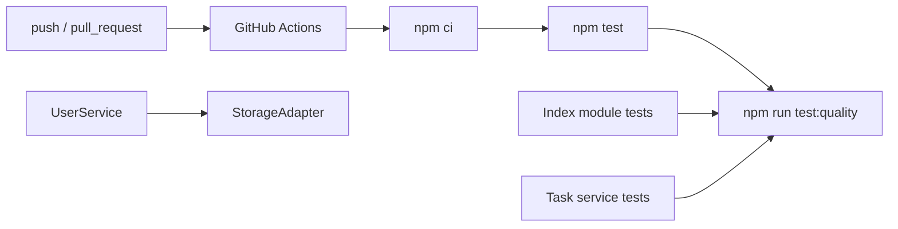

# 里程碑-21I：质量闸门与自动化收口 详细设计文档

> **设计状态**：✅ 已完成
> **创建日期**：2026-04-15
> **设计者**：GPT5 Codex
> **审核者**：项目维护者
> **预计工期**：1-1.5天

---

## 📋 目录

- [需求分析](#需求分析)
- [技术方案](#技术方案)
- [代码结构](#代码结构)
- [实施步骤](#实施步骤)
- [测试方案](#测试方案)
- [风险评估](#风险评估)
- [替代方案](#替代方案)
- [审核要点自检](#审核要点自检)
- [审核记录](#审核记录)

---

## 需求分析

### 功能描述

`M21D` 和 `M21E` 完成后，当前项目最主要的结构性技术债已经明显下降：`StarService`、`RewardService` 已完成模块化切片，`develop` 主干测试也保持全绿。基于当前代码和测试实际复核，接下来最高 ROI 的工作已经不是继续拆大文件，也不是优先做文档统一，而是把还在持续报警的质量闸门收干净。

设计前确认的事实如下：

1. `npm test` 当前已通过，结果为 `85 suites / 1878 tests` 全绿。
2. `npm run test:coverage` 仍存在 5 个分支覆盖率缺口：
   - `pages/index/modules/index-user-context.js`：`60.86%`
   - `pages/index/modules/index-search-panel.js`：`61.7%`
   - `pages/index/modules/index-user-switcher.js`：`61.7%`
   - `pages/index/modules/index-message-preview.js`：`68.42%`
   - `services/task-service.js`：`65.46%`
3. 仓库当前不存在 `.github/workflows/`，还没有最小 CI 自动化入口。
4. [`services/user-service.js`](/Users/wangdafei/code/study_task_wechat/services/user-service.js) 的 `_saveUserState()` 里仍保留 `wx.setStorageSync('currentUserId', userId)` fallback，说明 `M21D` 的平台访问收口还有最后一处残留未闭环。

因此，`M21I` 的目标非常明确：不做新的业务能力，不扩大到 UI 调整，也不混入更大范围的重构，只做“覆盖率缺口补齐 + 最小 GitHub Actions + UserService 残留平台访问收尾”这 3 件事，让项目回到“零覆盖率告警 + 基础自动化质量闸门”的稳定状态。

### 业务价值

- [x] 用户价值：不直接新增用户可见功能，但能降低后续迭代把回归问题带进主干的概率。
- [x] 技术价值：恢复覆盖率门禁可信度，并补上最小自动化执行链路。
- [x] 维护价值：完成 `M21D` 的最后收尾，避免平台访问边界再次回退。

### 功能范围

**包含**：
- ✅ 为 5 个当前低于阈值的文件补齐测试分支覆盖
- ✅ 新增最小 GitHub Actions workflow，自动执行主测试与质量测试
- ✅ 删除 `UserService` 中剩余的 `wx.setStorageSync('currentUserId', ...)` fallback
- ✅ 保持现有业务规则、页面交互和服务对外 API 不变
- ✅ 对新增或修改的测试链路做定向回归和质量门禁验证

**不包含**：
- ❌ 不修改覆盖率阈值，不通过“降标准”消除告警
- ❌ 不把 `task-edit.js` 大文件治理混入本期
- ❌ 不新增 E2E、部署流水线或 preview 环境
- ❌ 不统一 UI 视觉规范
- ❌ 不推进 `M21C` 文档统一工作
- ❌ 不抽取通用 `CloudSyncService`

### 优先级

- **优先级**：P1
- **理由**：当前这是最小投入、最确定收益的一组工作。完成后项目会从“测试全绿但质量门禁仍有告警、且无 CI”进入“主干零告警 + 基础自动化”的稳定状态。

---

## 技术方案

### 方案概述

`M21I` 采用“小步快收口”的方案：

1. **只补测试，不放宽阈值**  
   质量问题出在分支未覆盖，不在阈值设置本身。本期通过补测试把 5 个文件拉回门槛之上。

2. **CI 只上最小必要链路**  
   新增 1 个 GitHub Actions workflow，先跑 `npm test` 和 `npm run test:quality`。不在本期引入部署、矩阵、缓存优化、后端真实集成或复杂 PR 规则。

3. **UserService 不再直接访问平台存储**  
   `_saveUserState()` 统一复用现有 `_persistCurrentUserId()`。正式持久化继续只走 `StorageAdapter`，不再回退到 `wx`。

这样可以在极小风险下完成三个目标：

- 覆盖率告警归零
- 自动化测试入口落地
- 服务层平台访问边界彻底收口

### 关键设计决策

#### 决策1：覆盖率缺口通过补测试修复，不调整 `jest.quality.config.js`

当前 [`jest.quality.config.js`](/Users/wangdafei/code/study_task_wechat/jest.quality.config.js) 已经明确要求：

- `pages/index/modules/**/*.js` 分支覆盖率至少 `70%`
- `services/task-service.js` 分支覆盖率至少 `70%`

本期不降低标准，也不通过 `coveragePathIgnorePatterns` 排除文件来“消警”。  
原因：

- 这 5 个文件都属于真实业务路径，不是历史死文件
- 当前缺口不大，补测成本远低于调整规范带来的长期损害

实施约束：

- 覆盖率补齐前，先对单文件执行精确 coverage 定位，而不是凭感觉补用例
- 建议优先使用：
  - `npm run test:coverage -- --collectCoverageFrom='pages/index/modules/index-user-context.js'`
  - `npm run test:coverage -- --collectCoverageFrom='pages/index/modules/index-search-panel.js'`
  - `npm run test:coverage -- --collectCoverageFrom='pages/index/modules/index-user-switcher.js'`
  - `npm run test:coverage -- --collectCoverageFrom='pages/index/modules/index-message-preview.js'`
  - `npm run test:coverage -- --collectCoverageFrom='services/task-service.js'`
- 先拿到未命中行号，再做最小必要补测，避免盲猜分支

#### 决策2：首页模块缺口优先补到现有测试文件，不拆新测试架子

设计前确认的现有测试入口：

- [`test/pages/index.user-context.test.js`](/Users/wangdafei/code/study_task_wechat/test/pages/index.user-context.test.js)
- [`test/pages/index.modules.test.js`](/Users/wangdafei/code/study_task_wechat/test/pages/index.modules.test.js)

因此本期做法是：

- `index-user-context.js` 优先在 `index.user-context.test.js` 内补齐分支场景
- `index-search-panel.js`、`index-user-switcher.js`、`index-message-preview.js` 优先在 `index.modules.test.js` 内补齐分支场景

这样可以保持首页模块测试入口集中，不引入多余测试文件。

#### 决策3：`task-service.js` 覆盖率缺口优先补到既有 service 测试

设计前确认的现有测试入口：

- [`test/services/task-service.test.js`](/Users/wangdafei/code/study_task_wechat/test/services/task-service.test.js)
- [`test/services/task-service.helpers.test.js`](/Users/wangdafei/code/study_task_wechat/test/services/task-service.helpers.test.js)

设计前复核确认：[`services/task-service.js`](/Users/wangdafei/code/study_task_wechat/services/task-service.js) 当前仍约 `952` 行，并不只是“纯 facade 委托壳”；主文件里依然承载了用户上下文构建、离线队列接入、云同步编排和若干防御性分支。

因此本期策略是：

- 先对 `services/task-service.js` 做精确 coverage 定位
- 优先在 `test/services/task-service.test.js` 中补 facade 层和主文件自有逻辑的缺口
- 只有当未命中分支明确落在 helper 协作边界上时，才补到 `test/services/task-service.helpers.test.js`

本期不为覆盖率单独新建“纯门禁测试壳”，保证测试仍然围绕既有业务语义组织，可读、可维护。

#### 决策4：GitHub Actions 只建立最小质量闸门

本期新增 `.github/workflows/test.yml`，触发条件为：

- `push`
- `pull_request`

执行内容限定为：

1. `npm ci`
2. `npm test`
3. `npm run test:quality`

运行环境约束：

- 使用 `actions/setup-node@v4`
- 明确固定 `node-version: '20'`

本期明确不纳入：

- 后端真实数据库集成测试
- 自动部署
- 构建产物发布
- 多 Node 版本矩阵
- 复杂缓存和分阶段 job 编排

原因很简单：当前目标是先把“没人手动跑就没人拦”的问题堵上，而不是在 CI 上一次性做大。

补充原因：

- 仓库当前根级 `package.json` 未声明 `engines`
- 项目既有文档和现网后端运行基线已长期使用 Node 20
- 若不显式固定版本，GitHub runner 默认版本漂移会把质量闸门变成不稳定因素

#### 决策5：`UserService` fallback 删除后保持“非阻断、可观测”

[`services/user-service.js`](/Users/wangdafei/code/study_task_wechat/services/user-service.js) 当前 `_saveUserState()` 在 `storageAdapter` 缺失时会退回平台 API。  
本期改为：

- `_saveUserState()` 统一委托现有 `_persistCurrentUserId(userId)`
- `_persistCurrentUserId()` 继续作为 `currentUserId` 持久化的唯一正式入口
- 删除 `_saveUserState()` 中最后一处 `wx storage` fallback，不再新增第二套判断分支

原因：

- `UserService` 正式构造路径已具备 `StorageAdapter`
- `UserService` 当前已经有 `_persistCurrentUserId()` 封装，重复写一套 set 逻辑只会制造双轨语义
- 当前 fallback 继续存在，只会让“平台访问边界已收口”这一事实失真
- 该持久化失败当前本来也被定义为“不影响核心功能，仅记录错误”

### 技术选型

| 技术点 | 选择方案 | 替代方案 | 选择理由 |
|--------|---------|---------|---------|
| 覆盖率修复 | 补测试用例 | 下调阈值 / 排除文件 | 不牺牲质量标准 |
| 首页模块测试 | 复用现有测试文件 | 为每个模块新建单测文件 | 修改面更小，可读性更稳 |
| CI | GitHub Actions 最小 workflow | 暂不自动化 | 一次投入，长期收益最高 |
| 会话持久化 | 复用 `_persistCurrentUserId()` + `StorageAdapter` | 保留 `wx` fallback | 保持服务层边界一致且避免双轨语义 |

### DDD分层设计

**领域层（models/）**：
- [ ] 新建模型：无
- [ ] 修改模型：无
- 说明：本期不调整领域模型。

**服务层（services/）**：
- [x] 修改服务：`services/user-service.js`
- [x] 修改服务：`services/task-service.js`（仅在必要时为可测性做极小修正，否则只补测试）
- 说明：不改业务规则，只完成边界收尾或为现有分支补上测试覆盖。

**仓储层（repositories/）**：
- [ ] 新建仓储：无
- [ ] 修改仓储：无
- 说明：本期不涉及仓储。

**适配器层（adapters/）**：
- [ ] 新建适配器：无
- [ ] 修改适配器：无
- 说明：继续复用现有 `StorageAdapter`。

**表现层（pages/、components/）**：
- [x] 修改页面测试：`test/pages/index.user-context.test.js`
- [x] 修改页面测试：`test/pages/index.modules.test.js`
- 说明：只补测试，不改首页实际页面交互。

**工程层（CI / 配置）**：
- [x] 新增工作流：`.github/workflows/test.yml`
- [x] 修改测试：`test/services/task-service.test.js`
- [x] 修改测试：`test/services/task-service.helpers.test.js`
- 说明：建立最小自动化质量闸门。

### 架构图



### 数据模型

本期不新增数据模型。

### 接口设计

本期不新增对外业务接口。

---

## 代码结构

### 文件变更清单

**新增文件**：
- `.github/workflows/test.yml` - 最小 GitHub Actions 测试工作流
- `docs/design/milestone-21i-quality-gate-automation-convergence.md` - 本期设计文档

**修改文件**：
- `services/user-service.js` - 删除 `currentUserId` 会话持久化的 `wx` fallback
- `test/pages/index.user-context.test.js` - 补齐 `index-user-context.js` 的分支场景
- `test/pages/index.modules.test.js` - 补齐首页模块的剩余分支场景
- `test/services/task-service.test.js` - 补齐 `task-service.js` 覆盖率缺口
- `test/services/task-service.helpers.test.js` - 如需要，承接 helper 侧遗漏分支

### 核心代码结构

```javascript
// services/user-service.js
async _saveUserState() {
  try {
    const userId = this.currentUser.id;

    this._persistCurrentUserId(userId);
    logger.debug('UserService', '保存用户会话成功', { userId });
  } catch (error) {
    logger.error('UserService', '保存用户会话失败', error);
  }
}
```

```yaml
# .github/workflows/test.yml
name: test

on:
  push:
  pull_request:

jobs:
  test:
    runs-on: ubuntu-latest
    steps:
      - uses: actions/checkout@v4
      - uses: actions/setup-node@v4
        with:
          node-version: '20'
      - run: npm ci
      - run: npm test
      - run: npm run test:quality
```

### 关键函数

**函数1**：`UserService._saveUserState()`
- **输入**：当前实例上的 `currentUser.id`
- **输出**：无显式返回
- **职责**：通过 `StorageAdapter` 持久化当前用户会话
- **依赖**：`storageAdapter`、`logger`

**函数2**：首页模块相关测试用例
- **输入**：模块 mock 状态和页面上下文
- **输出**：断言不同分支行为
- **职责**：覆盖目前未命中的 guard、空态、权限态和异常分支
- **依赖**：现有 `index.modules.test.js`、`index.user-context.test.js`

---

## 实施步骤

### 第1步：补齐覆盖率缺口（预计4-6小时）

- [ ] **任务**：为 4 个首页模块和 `task-service.js` 补齐当前缺失的分支测试
- [ ] **验证**：`npm run test:coverage` 不再输出分支阈值告警
- [ ] **依赖**：现有测试夹具和 mock 工具可复用

**实施要点**：
1. 先对 5 个目标文件逐个执行 `collectCoverageFrom` 定位未命中分支，再补最小必要用例
2. 优先复用既有测试文件，不额外铺开新的测试架子
3. `task-service.js` 先补主文件和 facade 层缺口，只有确认未命中分支落在 helper 协作边界时才补 helper 测试
4. 若发现个别分支因可测性问题必须轻微调整源码，只允许做不改变语义的最小修正

---

### 第2步：收掉 `UserService` 平台访问残留（预计1小时）

- [ ] **任务**：让 `_saveUserState()` 统一复用 `_persistCurrentUserId()`，并删除最后一处 `wx.setStorageSync` fallback
- [ ] **验证**：`rg "setStorageSync\\('currentUserId'" services/user-service.js` 无结果
- [ ] **依赖**：`StorageAdapter` 仍为正式路径

**实施要点**：
1. 保持“会话保存失败不影响核心功能”的现有语义
2. 不在 `_saveUserState()` 里新增第二套存储判断，统一复用现有 `_persistCurrentUserId()` 封装
3. 补齐对应单测，防止边界回退

---

### 第3步：新增最小 GitHub Actions（预计1小时）

- [ ] **任务**：新增 `.github/workflows/test.yml`
- [ ] **验证**：workflow 语法正确，命令与本地测试入口一致
- [ ] **依赖**：仓库可使用标准 npm 安装和 Jest 命令

**实施要点**：
1. 先保证能自动跑通，不追求一开始就做复杂 job 切分
2. 只引入项目已验证的命令入口
3. workflow 名称和触发条件保持简洁，便于后续扩展

---

### 第4步：回归与收口（预计1小时）

- [ ] **任务**：执行定向测试和全量质量闸门检查
- [ ] **验证**：`npm test`、`npm run test:quality`、必要的定向 Jest 命令全部通过
- [ ] **依赖**：前 3 步实施完成

**实施要点**：
1. 定向先跑 touched path，避免问题定位范围过大
2. 通过后再跑全量测试与质量闸门
3. 完成后同步更新对应设计状态和 `ROADMAP/CHANGELOG`

---

## 测试方案

### 单元测试

| 测试项 | 测试方法 | 预期结果 |
|--------|---------|---------|
| `index-user-context.js` 分支补齐 | 扩充 `test/pages/index.user-context.test.js` | 分支覆盖率达到 70%+ |
| 首页模块分支补齐 | 扩充 `test/pages/index.modules.test.js` | `search-panel / user-switcher / message-preview` 均达到 70%+ |
| `task-service.js` 分支补齐 | 扩充既有 service 测试 | `services/task-service.js` 分支覆盖率达到 70%+ |
| `UserService` 会话保存边界 | 补充 `test/services/user-service.test.js` | 仅走 `StorageAdapter`，无 `wx` fallback |

### 集成测试

- [ ] `npm run test:quality` 全量通过，覆盖率阈值零告警
- [ ] `npm test` 全量通过，确保本期测试补充未引入回归
- [ ] GitHub Actions workflow 命令与本地命令保持一致

### 手动测试

1. **代码与配置检查**：
   - [ ] `.github/workflows/test.yml` 已存在且结构清晰
   - [ ] `services/user-service.js` 中不再直接写 `wx.setStorageSync('currentUserId', ...)`

2. **质量门禁检查**：
   - [ ] 本地执行 `npm run test:coverage` 不再出现当前 5 个分支告警
   - [ ] 本地执行 `npm run test:quality` 通过

3. **回归检查**：
   - [ ] 登录/切换用户相关测试未受影响
   - [ ] 首页模块测试与任务服务测试均保持通过

### 测试覆盖率目标

- 最低要求：`M21I` 触达文件全部回到当前阈值线以上
- 推荐目标：对当前 5 个缺口文件至少预留少量余量，避免临界值脆弱

---

## 风险评估

### 技术风险

| 风险项 | 影响 | 概率 | 应对措施 |
|--------|------|------|---------|
| 为追覆盖率而写出低价值测试 | 中 | 中 | 只补真实业务分支，不写纯实现细节断言 |
| 首页模块需要特定 mock 才能命中分支 | 中 | 中 | 先跑单文件 coverage，按未命中行号构造最小场景，不盲猜 |
| `task-service.js` 个别分支难以命中 | 中 | 中 | 先定位未命中行，优先补主文件测试，再决定是否做最小可测性修正或 helper 补测 |
| GitHub Actions 首次运行环境与本地差异 | 中 | 低 | 只使用本地已验证命令，不引入额外依赖 |
| `storageAdapter` 缺失场景被忽略 | 低 | 低 | 明确保留日志并补齐单测，确保非阻断语义稳定 |

### 范围风险

- 若把 `task-edit.js`、UI 规范、文档统一等内容混入本期，会显著拉大范围并降低 ROI。
- 若试图顺手加入后端集成测试或部署流程，会让“最小自动化”变成新的大里程碑。

### 回滚策略

- 覆盖率补测如引入不稳定断言，可按文件粒度回滚新增测试块
- GitHub Actions workflow 为独立文件，可单独回滚
- `UserService` 改动仅限单点方法，必要时可独立回滚

---

## 替代方案

### 方案A：直接降低覆盖率阈值

**优点**：
- 实施最快

**缺点**：
- 只是把告警藏起来，没有解决真实缺口
- 会削弱 `jest.quality.config.js` 的可信度

**结论**：不采用。

### 方案B：只加 GitHub Actions，不先修覆盖率

**优点**：
- 自动化可以更早落地

**缺点**：
- CI 会持续红灯，无法形成稳定门禁
- 仍然没有解决当前最明确的质量告警

**结论**：不采用。CI 必须建立在覆盖率缺口已收口的基础上。

### 方案C：把 `task-edit.js` 大文件治理一起做

**优点**：
- 可以顺手推进另一个结构治理话题

**缺点**：
- 任务边界明显膨胀
- 会把“1天内可完成”的高 ROI 收口拖成更大的重构

**结论**：不采用，留待后续独立里程碑。

---

## 审核要点自检

- [x] 范围是否只包含 3 个高 ROI 项，未混入其他治理主题
- [x] 是否明确承诺“不降阈值，只补测试”
- [x] 是否延续现有测试组织方式，而不是新铺复杂测试结构
- [x] 是否保证 `UserService` 只做边界收尾，不改业务语义
- [x] 是否把 GitHub Actions 控制在最小可用范围内

---

## 审核记录

### 第1轮

- 2026-04-15：完成首轮设计评审，确认范围聚焦为“覆盖率缺口补齐 + 最小 GitHub Actions + UserService 平台访问残留收尾”

### 第2轮

- 2026-04-15：补充 Node 20 固定版本约束，并将 `UserService` 方案收敛为复用 `_persistCurrentUserId()`，消除双轨持久化语义

### 第3轮

- 2026-04-15：结合实际测试入口与代码结构，补充单文件 coverage 定位策略，修正 `task-service.js` 非纯 facade 的事实描述，设计终审通过，可进入实施

### 第4轮

- 2026-04-15：完成 `UserService` 平台访问残留收口、首页模块与 `task-service` 覆盖率补齐、最小 GitHub Actions 落地；`npm run test:quality` 与 `npm test` 均已通过
