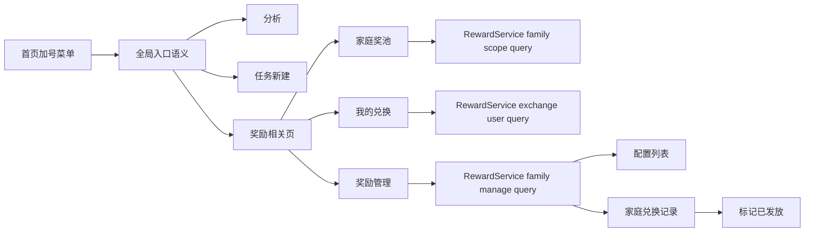

# 里程碑-21K：首页入口与奖励信息架构收口 详细设计文档

> **设计状态**：✅ 已实施并完成自动化验证
> **创建日期**：2026-04-16
> **最后修订**：2026-04-16
> **设计者**：GPT5 Codex
> **审核者**：项目维护者
> **预计工期**：3-4天（已按实施范围落地）

---

## 📋 目录

- [需求分析](#需求分析)
- [实施结论](#实施结论)
- [技术方案](#技术方案)
- [代码结构](#代码结构)
- [实施步骤](#实施步骤)
- [测试方案](#测试方案)
- [风险评估](#风险评估)
- [替代方案](#替代方案)

---

## 需求分析

### 功能描述

最近一轮验收暴露出三个连续的体验问题：

1. 首页切换到“非今天”日期后，右下角加号菜单只剩“分析”，但“任务”“奖励”本质上都不是只服务当前日期列表的入口，语义出现断裂。
2. 奖励页、奖励管理页、我的兑换页对“示例奖励”“正式奖励”“已兑换记录”“已发放记录”的边界不一致，用户很难判断当前看到的到底是奖池、配置项，还是历史事实。
3. 奖励链路里存在“兑换”和“后续发放”两种现实场景，但当前文案只用“待领取/已领取”粗暴表达，既没有说明谁来操作，也没有说明什么情况下兑换即完成，什么情况下还需家长处理。

本轮不是单独修某个按钮或某个文案，而是统一：

- 首页入口语义
- 家庭奖池的奖励归属模型
- 奖励配置、兑换记录、我的兑换三类页面职责
- 奖励履约语义与状态文案

目标是让用户一眼就能分清：

- 哪些是“全局入口”
- 哪些是“家庭奖池里的可兑换奖励”
- 哪些是“家长管理的奖励配置”
- 哪些是“某个孩子自己的兑换记录”
- 哪些奖励兑换后立刻完成，哪些奖励仍需要家长发放

### 业务价值

- [x] 用户价值：降低首页与奖励域的理解成本，让用户能预测点击后的结果。
- [x] 技术价值：统一奖励域不同页面的查询语义、状态语义和文案口径，减少页面层各自拼接判断。
- [x] 业务价值：让“家庭管理视角”和“孩子使用视角”形成连续产品故事，提升整体的高级感、易懂度和可信度。

### 功能范围

**包含**：
- ✅ 重定义首页加号菜单与日期视图之间的关系
- ✅ 明确家庭奖池语义，奖励不再按“家长 owner”做单人归属理解
- ✅ 统一奖励页、奖励管理页、我的兑换页三类页面职责
- ✅ 引入 `fulfillmentMode`，区分“即时生效”和“家长发放”
- ✅ 统一奖励状态文案为“可兑换 / 已兑换 / 待发放 / 已发放”
- ✅ 重构“星星过期保护”语义，改为兑换时动态抵扣快过期星星
- ✅ 明确家长管理页中的发放动作入口与可见范围
- ✅ 补齐上述展示语义和履约语义对应的页面、服务层和模型测试

**不包含**：
- ❌ 修改星星过期本身的结算周期规则
- ❌ 修改任务补打卡规则
- ❌ 改造多用户权限体系底层模型
- ❌ 新增独立奖励详情页或复杂审批流
- ❌ 重新设计全站导航结构

### 优先级

- **优先级**：P1
- **理由**：问题集中在首页高频入口和奖励域高频路径，当前主链路虽能工作，但心智混乱明显影响产品品质。

---

## 实施结论

### 实际交付结果

本方案已完成实施，核心结果如下：

1. 首页加号菜单已从“受日期标签误伤的局部入口”收口为稳定的全局入口。
2. 奖励页、我的兑换、奖励管理三页职责已按设计拆分，奖励页不再承载历史记录。
3. `fulfillmentMode` 已落地为正式奖励履约语义，前台统一显示 `已兑换 / 待发放 / 已发放`。
4. 快过期星星已改为兑换时动态抵扣，不再把“保护奖励 / 免费 / 盾牌”作为主展示语义。
5. 奖励取消兑换已按真实兑换流水退款，并修复退款归属到正确孩子账户。
6. 奖励事件与消息桥接已对齐 `exchangeUserId / actualCost / pointsRefunded`，避免消息继续错误展示原价。

### 自动化验证结果

- 定向回归通过：
  - `npm test -- --runTestsByPath test/services/reward-service.test.js test/services/message-service.test.js`
  - `npm test -- --runTestsByPath test/app/post-login-bootstrap.test.js test/services/star-service.test.js test/pages/rewards.modules.test.js`
- 全量前端测试通过：
  - `npm test`
  - 结果：`89 suites / 1937 tests` 全绿
- 手工体验验收：
  - 待在真实手机端继续执行奖励主链路验收

---

## 技术方案

### 方案概述

本轮采用“先收口页面职责，再收口奖励履约语义”的方案，不做零散修补。

核心原则：

1. 首页日期标签只约束“当前任务列表及其直接操作”，不应误伤全局入口。
2. 奖励采用“家庭奖池”语义，不再把家长视为奖励归属人。
3. 奖励页只负责“家庭奖池当前可兑换内容”，不承载历史记录。
4. 我的兑换只负责“当前孩子自己的兑换历史”，不承载家庭管理动作。
5. 奖励管理页只负责“家庭奖励配置 + 家庭兑换记录 + 家长发放动作”。
6. 引入 `fulfillmentMode` 区分两类奖励履约路径：
   - `instant`：兑换即完成，用户看到的是“已兑换”
   - `manual`：兑换后待家长处理，用户看到的是“待发放 / 已发放”
7. 不新增新的底层奖励状态枚举层级；保留现有 `available / claimed / delivered`，由 `fulfillmentMode` 决定展示语义。
8. 统一所有展示文案，不再使用“待领取”这一容易误解的表述。
9. “快过期星星补偿”属于兑换成本规则，不属于奖励类型或奖励状态，不再以盾牌和“免费”作为主语义暴露。

关键决策记录：

- 已确认采用 `A方案`：奖励池改为家庭奖池，孩子消费、家长管理。
- 已确认不再沿用“rewardOwnerId 单人归属”作为页面主语义，统一改为家庭范围读取。
- 已确认不新增新的低层状态如 `redeemed`，而是在现有 `claimStatus` 之上增加 `fulfillmentMode`。
- 已确认仅家长管理视角可执行“标记已发放”动作。
- 已确认奖励页移除历史记录承载职责；孩子历史记录统一落在“我的兑换”。
- 已确认当前“保护奖励 / 免费 / 盾牌”表达不可继续沿用，本轮要一起收口。
- 已确认“快过期星星”应从“预先写进奖励的保护状态”改为“兑换时实时抵扣规则”。
- 已确认文案改为：
  - `instant + delivered` 展示为 `已兑换`
  - `manual + claimed` 展示为 `待发放`
  - `manual + delivered` 展示为 `已发放`

### 页面职责定义

| 页面 | 面向谁 | 展示内容 | 不展示内容 | 关键动作 |
|------|--------|----------|------------|----------|
| 首页加号菜单 | 家长 / 孩子 | 分析、任务、奖励等全局入口 | 不因非今天日期误隐藏全局入口 | 进入分析、新建任务、进入奖励相关页 |
| 奖励页 `pages/rewards` | 家长 / 孩子 | 家庭奖池当前奖励 | 历史兑换记录、示例奖励常驻列表 | 孩子视角直接兑换；家长自己视角可代孩子兑换，也可进入管理 |
| 我的兑换 `packageManage/pages/my-exchanges` | 当前孩子 | 当前孩子自己的兑换记录 | 其他孩子记录、家庭管理动作 | 查看自己的兑换结果 |
| 奖励管理 `packageManage/pages/reward-manage` | 家长管理视角 | 家庭正式奖励配置、家庭兑换记录、发放动作 | 孩子个人视角入口、重复历史列表 | 创建/编辑奖励、启停用、标记已发放 |

补充说明：

1. “孩子视角”与“家长代操作”不是一回事：
   - 家长设备切到孩子后，属于孩子视角，执行语义等同于孩子本人操作
   - 家长保持自己视角直接去操作，才属于家长代孩子操作
2. 奖励页在孩子视角下提供直接兑换动作；在家长自己视角下，也允许代孩子兑换，但必须先明确主体孩子。
3. 这样可保证页面故事连续：
   - 奖励页：看目标 / 换奖励
   - 我的兑换：看我换过什么
   - 奖励管理：家长管理奖励和处理发放

### 共享设备下的兑换主体语义

#### 1. 基本定义

奖励兑换属于 `execute` 类动作，应沿用任务执行动作的共享设备主体语义。

| 场景 | 执行主体 | 是否属于代操作 |
|------|----------|----------------|
| 孩子设备，孩子自己视角 | 孩子 | 否 |
| 家长设备切到孩子视角 | 孩子 | 否 |
| 家长设备，家长自己视角直接发起兑换 | 被解析出来的目标孩子 | 是 |

#### 2. 主体孩子解析优先级

当处于家长自己视角且直接发起兑换时，按以下顺序解析目标孩子：

1. 最近活跃孩子 `lastActiveChildId`
2. 家庭中唯一孩子
3. 若存在多个孩子且无法唯一确定，则弹出轻量孩子选择，不允许静默猜测

#### 3. 为什么这样定义

1. 共享手机切到孩子视角时，孩子就是当前使用者，不应被误标记为“家长代操作”。
2. 家长自己视角下直接操作，才是真正的代孩子操作。
3. 多孩子家庭里若无最近活跃孩子，静默默认第一个孩子风险过高，容易误兑错人。

#### 4. 对记录和文案的影响

1. 孩子视角兑换：
   - `exchangeUserId = 孩子`
   - 执行文案按孩子自己兑换处理
2. 家长自己视角代兑换：
   - `exchangeUserId = 目标孩子`
   - `operatorUserId = 家长`
   - 文案需明确为“家长代你兑换了奖励”或等价表达
3. 家庭兑换记录应同时支持：
   - 看出是哪个孩子兑换的
   - 在必要时保留是否为家长代操作的上下文

#### 5. 奖励页按钮文案

为保持动作可预测性，奖励页主按钮文案按主体解析结果固定为：

1. 孩子视角：
   - `兑换奖励`
2. 家长自己视角，且已命中目标孩子：
   - `为小明兑换`
3. 家长自己视角，且需要先选孩子：
   - `选择孩子兑换`

说明：

- 不再在家长自己视角继续使用泛化的 `兑换奖励`。
- 这样能让用户在点击前就知道这次动作是“自己换”还是“为哪个孩子换”。

### 快过期星星抵扣语义

#### 1. 要解决的真实问题

产品希望同时满足两件事：

1. 星星仍然有过期规则，维持节奏感和消费动机。
2. 用户在“快攒够奖励”时，不会因为临期星星失效而产生强烈的“努力白费”感。

因此需要的不是“保护型奖励”，而是一条更温和的兑换成本规则：

- 快过期星星在兑换时优先抵扣
- 前台主要展示“这次实际要花多少”
- 必要时再解释“为什么是这个价格”

#### 2. 新规则定义

将原有“reward-level 保护状态”改为“exchange-level 动态抵扣”：

```typescript
interface RewardExchangeCostBreakdown {
  originalPoints: number;
  expiringStarDeduction: number;
  actualCost: number;
  hasExpiringDeduction: boolean;
}
```

规则说明：

1. 只在用户发起兑换时，根据“当前可用星星快照”实时计算。
2. `expiringStarDeduction` 来自保护窗口内的快过期星星。
3. `actualCost = max(0, originalPoints - expiringStarDeduction)`。
4. 不再预先把折扣写入奖励实体，不再把奖励展示为“保护奖励”。
5. 保护窗口仍沿用现有星星域定义；本轮不改窗口长度本身，只改表达和结算落点。

#### 3. 用户可见表达

前台统一只表达三件事：

1. 原价多少
2. 本次抵扣了多少快过期星星
3. 这次实际要花多少

示例：

- 普通奖励：
  - `20颗`
- 部分抵扣：
  - 主文案：`本次12颗`
  - 次级文案：`已抵扣8颗快过期星星`
- 全额抵扣：
  - 主文案：`本次0颗`
  - 次级文案：`已抵扣20颗快过期星星`

明确废弃：

- `🛡️` 作为主语义
- `免费`
- `保护奖励`
- `部分保护奖励`
- `完全保护奖励`

#### 4. 页面落点

| 位置 | 展示原则 |
|------|----------|
| 奖池列表 | 只展示最终成本；有抵扣时给轻量次级说明 |
| 奖励详情 / 确认弹窗 | 展示原价、抵扣、实付的三段式结算 |
| 星星总览区 | 继续提示有多少星星即将过期，并说明兑换时会优先使用 |
| 奖励设置页 | 不展示抵扣结果；只展示稳定原价 |

#### 5. 为什么不继续保留旧实现

旧实现存在三个产品问题：

1. 它把“动态结算规则”做成了“奖励属性”，用户会误解成奖励本身被打折。
2. 它主要在启动链路预先写入，和用户真正发起兑换的时刻脱节。
3. 它使用盾牌、免费、保护等系统视角词汇，不符合孩子和家长的自然心智。

#### 6. 旧字段退役策略

为避免新旧两套语义长期并存，本轮明确：

1. `protectedByExpiry / partialProtection` 进入 deprecated 状态。
2. 它们不再作为前端展示语义来源。
3. 新写路径不再写入这两个字段。
4. 新云端同步不再依赖这两个字段作为正式 contract。
5. 历史数据读取时，如存在旧字段，只允许用于兼容归一化，不允许继续透传成页面主视图数据。
6. 若实施阶段评估成本可控，应在一次性迁移或读时清洗中将其归零；若先保留存储字段，也必须在代码注释和测试中明确“只读兼容、禁止新增写入”。

### 奖励履约语义

#### 1. 新增字段

```typescript
type RewardFulfillmentMode = 'instant' | 'manual';
```

- `instant`：用于“兑换后立刻完成”的奖励，例如额外玩 20 分钟、今天看一集动画、周末加一次点餐等。
- `manual`：用于“兑换后还需家长后续交付”的奖励，例如买玩具、周末出游、小礼物等。

#### 2. 底层状态保持不变

```typescript
type RewardClaimStatus = 'available' | 'claimed' | 'delivered';
```

状态语义重解释如下：

| fulfillmentMode | claimStatus | 用户可见文案 | 说明 |
|-----------------|------------|-------------|------|
| `instant` | `available` | 可兑换 / 未解锁 | 尚未兑换 |
| `instant` | `delivered` | 已兑换 | 兑换即完成，终态 |
| `manual` | `available` | 可兑换 / 未解锁 | 尚未兑换 |
| `manual` | `claimed` | 待发放 | 已兑换，等待家长处理 |
| `manual` | `delivered` | 已发放 | 家长已完成交付 |

补充规则：

- `instant` 奖励在兑换成功后直接进入终态，不再停留在“待处理”状态。
- `manual` 奖励在兑换成功后进入 `claimed`，由家长后续标记为 `delivered`。
- 若历史数据或云端回写中出现 `instant + claimed`，读写层应归一化为 `instant + delivered`，避免页面出现未定义状态。
- 为兼容历史数据，旧数据迁移默认策略为：
  - 旧的示例奖励：按预设模板决定 `fulfillmentMode`
  - 旧的自定义奖励：默认 `manual`

### 技术选型

| 技术点 | 选择方案 | 替代方案 | 选择理由 |
|--------|---------|---------|---------|
| 首页菜单收口 | 在现有 `menuItems` 过滤逻辑上重构能力判定 | 新增独立菜单状态机 | 当前实现稳定，修正语义绑定即可 |
| 家庭奖池读取 | 在服务层新增 family-scope 查询语义 | 页面层先全量读取后各自过滤 | 奖励范围属于领域读模型，不应散落在页面层 |
| 履约模式表达 | 新增 `fulfillmentMode` 字段 | 新增更细的底层状态枚举 | 复用现有状态机，降低兼容和迁移成本 |
| 快过期星星补偿 | 兑换时动态结算抵扣 | 启动时预写奖励保护状态 | 动态结算更符合用户心智，也避免静态改价残留 |
| 发放动作入口 | 奖励管理页兑换记录项内联动作 | 新增详情页或隐藏手势 | 交互更直接，符合极简和低跳转目标 |

### DDD分层设计

**领域层（models/）**：
- [x] 修改模型：`Reward`
- 说明：新增 `fulfillmentMode`，并定义 `instant/manual` 的默认值与兼容策略。

**服务层（services/）**：
- [x] 修改服务：`reward-service`
- 说明：
  - 新增家庭范围奖励查询与孩子兑换记录查询
  - 新增履约模式相关读写逻辑
  - 新增兑换成本拆分逻辑，统一快过期星星抵扣结算
  - 统一“奖励页 / 管理页 / 我的兑换”的视图数据来源

**仓储层（repositories/）**：
- [x] 修改仓储：`reward-repository`
- 说明：补充按家庭范围、按兑换人、按履约状态的查询支撑；不再依赖奖励实体持久保存保护折扣。

**适配器层（adapters/）**：
- [ ] 新建适配器：无
- [ ] 修改适配器：无

**表现层（pages/、components/）**：
- [x] 修改页面：`pages/index/`、`pages/rewards/`、`packageManage/pages/reward-manage/`、`packageManage/pages/my-exchanges/`
- [ ] 新建页面：无
- 说明：重构页面职责和文案语义，不增加新的页面层级。

### 架构图



### 数据模型

```typescript
interface Reward {
  id: string;
  userId: string;
  familyId: string | null;
  exchangeUserId: string | null;
  fulfillmentMode: 'instant' | 'manual';
  claimStatus: 'available' | 'claimed' | 'delivered';
}

interface RewardExchangeCostBreakdown {
  originalPoints: number;
  expiringStarDeduction: number;
  actualCost: number;
  hasExpiringDeduction: boolean;
}

interface RewardDisplayModel {
  statusLabel: string;
  actionLabel: string;
  canExchange: boolean;
  primaryCostText: string;
  secondaryCostText: string;
  recordStatusLabel?: string;
  recordTimeLabel?: string;
  targetChildLabel?: string;
}

interface RewardFamilyScope {
  familyId: string | null;
  memberUserIds: string[];
  childUserIds: string[];
  loginUserId: string | null;
  viewUserId: string | null;
}

interface RewardManageFamilyViewModel {
  familyId: string | null;
  memberUserIds: string[];
  childUserIds: string[];
  manageableRewards: Reward[];
  exchangeRecords: Reward[];
  exampleTemplates: Reward[];
}
```

补充约束：

- 奖励管理页、奖励页必须使用同一套 `family scope` 解析规则。
- 我的兑换必须按“当前孩子自己”过滤，不展示兄弟姐妹兑换记录。
- 无家庭场景下退化为单用户奖励池，不因为 `familyId=null` 导致奖励不可读不可写。
- `manageableRewards` 只包含未兑换的正式奖励，可保留 `enabled=false` 的未兑换项，便于继续编辑或重新启用。
- `exchangeRecords` 承担家庭历史事实，不再让已兑换奖励回流到“奖励设置”主列表。
- 快过期星星抵扣只在兑换时计算，不持久写入奖励本身。
- 奖励设置页始终展示原价，不展示某个孩子当前视角下的动态抵扣结果。
- 奖励页在孩子视角下直接兑换；在家长自己视角下允许代孩子兑换，但必须先明确主体孩子。
- 页面层不得自行拼接状态文案、成本文案、按钮文案，必须复用统一 presenter/helper。
- 家长自己视角下的奖励按钮文案必须显式带出目标孩子或“选择孩子”，不得退回泛化文案。

### 接口设计

建议新增/收口服务接口：

| 方法 | 说明 | 参数 | 返回值 |
|------|------|------|--------|
| `getRewardsByFamily` | 获取家庭范围奖励 | `{ familyId, memberUserIds, childUserIds }` | `Reward[]` |
| `getFamilyClaimedRewards` | 获取家庭兑换记录 | `{ familyId, memberUserIds, childUserIds }` | `Reward[]` |
| `getClaimedRewardsByExchangeUser` | 获取某个孩子自己的兑换记录 | `{ exchangeUserId, familyScope }` | `Reward[]` |
| `getRewardManageFamilyViewModel` | 获取奖励管理页数据 | `{ familyScope }` | `{ manageableRewards, exchangeRecords, exampleTemplates }` |
| `previewRewardExchangeCost` | 预览某奖励当前兑换成本 | `{ rewardId, userId }` | `RewardExchangeCostBreakdown` |
| `resolveRewardExecutionSubject` | 解析奖励兑换主体孩子 | `{ userContext }` | `{ targetChildUserId, requiresPicker }` |
| `buildRewardDisplayModel` | 构建统一展示视图模型 | `{ reward, context }` | `RewardDisplayModel` |
| `markRewardAsDelivered` | 家长标记手动奖励已发放 | `{ rewardId, operatorUserId }` | `Reward` |

说明：

1. `getRewardManageFamilyViewModel` 返回值中应直接包含 `exchangeRecords`，避免管理页自行二次拼装。
2. `markRewardAsDelivered` 只对 `manual + claimed` 生效。
3. `exchangeReward` 在 `instant` 模式下应直接返回终态奖励，不再留下待处理状态。
4. `previewRewardExchangeCost` 与 `exchangeReward` 必须共用同一套成本计算逻辑，避免展示价和实际扣费不一致。
5. `resolveRewardExecutionSubject` 必须与任务 execute 类动作使用同一套主体解析优先级，保持共享设备心智一致。
6. `buildRewardDisplayModel` 应成为奖励页、奖励详情、我的兑换、奖励管理的唯一展示语义来源，避免页面重复拼装。
7. `buildRewardDisplayModel` 在家长自己视角下必须产出明确的 `actionLabel`：
   - 已命中孩子：`为{childName}兑换`
   - 需选择孩子：`选择孩子兑换`

---

## 代码结构

### 文件变更清单

**新增文件**：
- 暂无强制新增文件；如履约逻辑继续扩大，可新增 `services/reward-service/reward-fulfillment.js`

**修改文件**：
- `pages/index/modules/index-user-switcher.js` - 调整加号菜单与日期限制的绑定规则
- `pages/index/index.js` - 透传非今天新建任务入口上下文
- `pages/task-edit/task-edit.js` - 消费首页透传的入口上下文并显示一次性轻提示
- `pages/rewards/modules/rewards-user-context.js` - 统一家庭奖池与孩子兑换主体的解析
- `pages/rewards/modules/rewards-sync.js` - 奖励页只读取家庭奖池正式奖励，并根据视角与主体孩子解析决定是否可兑换
- `pages/rewards/modules/rewards-exchange-flow.js` - 处理 `instant/manual` 兑换结果展示与动态抵扣确认文案
- `pages/rewards/rewards.js` / `pages/rewards/rewards.wxml` - 移除历史职责，仅保留奖池消费视图
- `packageManage/pages/my-exchanges/my-exchanges.js` - 仅加载当前孩子自己的兑换记录
- `packageManage/pages/reward-manage/reward-manage.js` - 加载家庭配置视图、家庭兑换记录、发放动作
- `packageManage/pages/reward-manage/reward-manage.wxml` - 精简为“奖励设置 / 兑换记录”两类职责明确的界面
- `packageManage/pages/reward-manage/reward-manage.wxss` - 对齐新的列表结构和动作布局
- `models/reward.js` - 新增 `fulfillmentMode` 与兼容默认值
- `utils/reward-status.js` - 收口 `instant/manual` 状态映射与文案
- `utils/reward-display.js` - 收口状态、成本、动作三类展示模型，避免页面重复拼装
- `services/reward-service/reward-query.js` - 收口 family-scope / exchange-user 查询语义
- `services/reward-service/reward-exchange.js` - 根据 `fulfillmentMode` 区分兑换后状态，并统一动态抵扣结算
- `services/reward-service/reward-write.js` - 创建、编辑、发放等写操作补齐 `fulfillmentMode`
- `services/reward-service/reward-cloud.js` - 同步 `familyId`、`exchangeUserId`、`fulfillmentMode`，并停止依赖旧保护字段
- `services/star-service/star-expiry.js` - 保留快过期星星窗口与提醒逻辑，但移除“预写奖励保护状态”

### 核心代码结构

```javascript
function updateMenuItemsWithPermissions(page) {
  // 分离“日期上下文限制”和“全局入口能力”
}

function getRewardFamilyScope(serviceManager) {
  // 解析家庭奖池范围，供奖励页和管理页共享
}

function getMyExchangeUserId(serviceManager) {
  // 解析当前孩子自己的兑换主体
}

async function getRewardManageFamilyViewModel(service, familyScope) {
  // 返回家庭正式奖励配置、家庭兑换记录、示例模板
}

async function previewRewardExchangeCost(service, rewardId, userId) {
  // 返回原价、快过期星星抵扣、实付金额
}

function buildRewardDisplayModel(reward, context) {
  // 返回统一状态标签、动作标签、主次成本文案、是否可兑换
  // 家长自己视角下的动作文案需显式带出目标孩子或选择孩子
}

function resolveRewardExecutionSubject(userContext) {
  // 孩子视角直接返回当前孩子
  // 家长自己视角优先 lastActiveChildId，再唯一孩子，否则要求先选孩子
}

async function exchangeReward(service, rewardId, options) {
  // 先实时计算兑换成本，再执行 instant/manual 状态流转
}

async function markRewardAsDelivered(service, rewardId, operatorUserId) {
  // 仅家长管理视角可调用，仅处理 manual + claimed
}
```

### 关键函数

**函数1**：`updateMenuItemsWithPermissions`
- **输入**：`page.data.currentUser / isReadonlyView / isViewingToday / isViewingFuture`
- **输出**：`menuItems`
- **职责**：将日期限制只作用于任务列表相关操作，不误伤奖励等全局入口

**函数2**：`getRewardFamilyScope`
- **输入**：登录用户、当前视角用户、家庭成员集合
- **输出**：`RewardFamilyScope`
- **职责**：统一奖励页和奖励管理页的家庭读取范围

**函数3**：`getMyExchangeUserId`
- **输入**：当前多用户上下文
- **输出**：当前孩子用户 ID
- **职责**：保证“我的兑换”只展示当前孩子自己的记录

**函数4**：`getRewardManageFamilyViewModel`
- **输入**：`familyScope`
- **输出**：家庭配置和家庭兑换记录视图模型
- **职责**：让管理页不再自行拼装“哪些属于配置、哪些属于记录”

**函数5**：`resolveRewardDisplayStatus`
- **输入**：`reward.fulfillmentMode + reward.claimStatus`
- **输出**：页面展示文案和动作文案
- **职责**：全局统一“已兑换 / 待发放 / 已发放”等展示语义

**函数6**：`previewRewardExchangeCost`
- **输入**：`rewardId / userId`
- **输出**：`RewardExchangeCostBreakdown`
- **职责**：统一奖池卡片、详情弹窗、确认弹窗的兑换成本展示

**函数7**：`buildRewardDisplayModel`
- **输入**：`reward / context`
- **输出**：`RewardDisplayModel`
- **职责**：统一奖励页、我的兑换、奖励管理、详情弹窗的展示语义，避免页面层重复拼接，并收口家长自己视角下的兑换按钮文案

**函数8**：`resolveRewardExecutionSubject`
- **输入**：`userContext`
- **输出**：`{ targetChildUserId, requiresPicker }`
- **职责**：统一奖励兑换主体解析，区分“孩子视角自己操作”和“家长自己视角代操作”

**函数9**：`markRewardAsDelivered`
- **输入**：`rewardId / operatorUserId`
- **输出**：更新后的奖励记录
- **职责**：提供家长履约动作闭环

---

## 实施步骤

### 第1步：修正展示语义与页面职责（预计0.5天）

- [x] **任务**：将首页、奖励页、我的兑换、奖励管理四类页面职责固化
- [x] **验证**：页面职责与自动化回归结果已对齐设计口径
- [ ] **依赖**：无

**实施要点**：
1. 首页非今天日期下保留全局入口语义
2. 奖励页只展示家庭奖池正式奖励
3. 孩子视角兑换等同于孩子本人操作，不标记为家长代操作
4. 家长自己视角下允许代孩子兑换，但必须遵循主体孩子解析规则
5. 我的兑换只展示当前孩子自己的兑换记录
6. 奖励管理页承担家庭配置、家庭记录和发放动作
7. 家长自己视角下的兑换按钮文案必须显式说明目标孩子或要求先选孩子

### 第2步：首页入口收口（预计0.5天）

- [x] **任务**：重构首页加号菜单判定规则
- [x] **验证**：今天/过去/未来/家长/孩子五类场景菜单已由页面测试覆盖
- [ ] **依赖**：第1步

**实施要点**：
1. `分析` 保持稳定入口
2. `奖励` 在家长管理视角下不再受日期标签影响
3. `任务` 作为全局新建入口保留，但通过入口上下文消除误解
4. `task-edit` 仅在 `entry=index_non_today_create` 场景显示一次性轻提示

### 第3步：奖励域 family-scope 查询收口（预计1天）

- [x] **任务**：统一家庭奖池、家庭兑换记录、孩子个人兑换记录三套查询语义
- [x] **验证**：奖励页、我的兑换、奖励管理读取结果已通过自动化回归验证
- [ ] **依赖**：第1步

**实施要点**：
1. 奖励页不再读取历史记录
2. 我的兑换只按 `exchangeUserId` 过滤当前孩子记录
3. 奖励管理页读取家庭范围记录，并可展示兑换人
4. 无家庭场景退化为单用户范围，保持本地模式体验连续
5. 示例奖励只在空状态或创建流程中作为辅助来源

### 第4步：重构快过期星星抵扣语义（预计0.5-1天）

- [x] **任务**：将“保护奖励”改为兑换时动态抵扣规则
- [x] **验证**：前台已移除盾牌/免费主语义，展示价与实际扣费已对齐
- [ ] **依赖**：第3步

**实施要点**：
1. 保留快过期星星窗口和提醒逻辑
2. 移除启动时预写 `protectedByExpiry / partialProtection` 到奖励的流程
3. 引入 `previewRewardExchangeCost` 供列表、详情、确认弹窗共用
4. `exchangeReward` 统一按实时成本结算
5. 奖励设置页只展示原价，不展示动态抵扣
6. 旧保护字段停止新增写入，并在兼容层做只读归一化

### 第5步：引入 `fulfillmentMode` 与履约闭环（预计1天）

- [x] **任务**：落地 `instant/manual` 奖励履约模式
- [x] **验证**：即时奖励兑换即完成，手动奖励可进入待发放并被家长标记已发放
- [ ] **依赖**：第3步、第4步

**实施要点**：
1. `Reward` 模型新增 `fulfillmentMode`
2. 创建/编辑奖励时增加轻量选择控件：
   - `立即生效`
   - `家长发放`
3. `instant` 奖励兑换成功后直接进入终态
4. `manual` 奖励兑换成功后进入待发放
5. 奖励管理页兑换记录项对 `manual + claimed` 展示 `标记已发放`
6. 家长自己视角代兑换时，记录与消息文案需保留“代操作”语义

### 第6步：文案与测试收口（预计1天）

- [x] **任务**：统一展示文案并补齐自动化测试
- [x] **验证**：相关 Jest 测试通过，页面语义无冲突
- [ ] **依赖**：第2步、第3步、第4步、第5步

**实施要点**：
1. 全量替换 `待领取`
2. `reward-status + reward-display` 成为唯一展示语义来源
3. 全量移除 `免费 / 保护奖励 / 部分保护 / 完全保护` 作为主展示语义
4. 覆盖家庭范围、孩子范围、动态抵扣、即时履约、手动履约五类关键路径
5. 奖励页如需保留现有“星星宝典”等静态说明区，应同步做减法，避免和新的成本说明重复堆叠

---

## 测试方案

### 单元测试

| 测试项 | 测试方法 | 预期结果 |
|--------|---------|---------|
| 首页菜单过滤 | 覆盖今天/过去/未来/只读/管理视角下的行为 | 全局入口不再被日期误伤 |
| 非今天任务创建提示 | 覆盖 `task-edit` 对入口上下文的消费 | 仅特定入口显示一次性轻提示 |
| 家庭奖池读取 | 覆盖 `getRewardsByFamily` 和奖励页加载逻辑 | 奖励页只显示家庭正式奖励 |
| 我的兑换过滤 | 覆盖 `getClaimedRewardsByExchangeUser` | 只显示当前孩子自己的兑换记录 |
| 家庭兑换记录 | 覆盖 `getFamilyClaimedRewards` 与管理页加载 | 家长可看到家庭记录及兑换人 |
| 动态抵扣成本预览 | 覆盖 `previewRewardExchangeCost` | 原价、抵扣、实付三者一致 |
| 动态抵扣实际扣费 | 覆盖 `exchangeReward` | 展示的实付金额与真实扣星一致 |
| 兑换主体解析 | 覆盖 `resolveRewardExecutionSubject` | 孩子视角、最近活跃孩子、唯一孩子、需选择孩子四类分支正确 |
| 展示模型收口 | 覆盖 `buildRewardDisplayModel` | 多页面复用同一展示口径，不再散落拼装 |
| 家长视角按钮文案 | 覆盖 `buildRewardDisplayModel` 在家长自己视角下的输出 | 命中孩子时显示“为某个孩子兑换”，否则显示“选择孩子兑换” |
| 履约模式状态映射 | 覆盖 `reward-status` 对 `instant/manual` 的文案 | 不再出现 `待领取`，状态映射一致 |
| 即时奖励兑换 | 覆盖 `exchangeReward` 的 `instant` 分支 | 兑换后直接进入终态 |
| 手动奖励发放 | 覆盖 `manual + claimed -> delivered` | 仅家长可执行发放动作 |

### 集成测试

- [ ] 场景1：家长在非今天日期下仍可进入任务新建和奖励管理
- [ ] 场景2：奖励页只展示家庭奖池，不再展示历史记录
- [ ] 场景3：家长设备切到孩子视角时，兑换按孩子本人操作处理
- [ ] 场景4：我的兑换只展示当前孩子自己的记录
- [ ] 场景5：家长自己视角下若存在最近活跃孩子，可直接代该孩子兑换
- [ ] 场景6：家长自己视角下若仅有一个孩子，可直接代该孩子兑换
- [ ] 场景7：家长自己视角下若有多个孩子且无法唯一确定，先弹出孩子选择
- [ ] 场景8：奖励管理页可看到家庭兑换记录，并能区分兑换人
- [ ] 场景9：有快过期星星时，奖池列表与确认弹窗显示相同的实付成本
- [ ] 场景10：原价不变，但实付会因快过期星星抵扣而变化
- [ ] 场景11：`instant` 奖励兑换后直接显示为 `已兑换`
- [ ] 场景12：`manual` 奖励兑换后先显示 `待发放`，家长操作后变为 `已发放`
- [ ] 场景13：示例奖励在已有正式奖励时不再常驻主列表
- [ ] 场景14：家长自己视角下的奖励按钮文案会随主体解析结果切换为“为某个孩子兑换 / 选择孩子兑换”

### 手动测试

1. **功能测试**：
   - [ ] 家长在今天/过去/未来日期下打开首页加号菜单，确认全局入口语义一致
   - [ ] 非今天日期下点击 `任务`，确认进入的是全局新建任务
   - [ ] 奖励页只展示家庭奖池，不出现历史记录入口混淆
   - [ ] 家长设备切到孩子视角时，兑换语义等同孩子本人操作
   - [ ] 家长自己视角下直接兑换时，默认主体孩子解析符合 lastActiveChild / 唯一孩子 / 先选孩子 规则
   - [ ] 家长自己视角下的奖励卡片按钮不再显示泛化的“兑换奖励”
   - [ ] 有快过期星星时，奖池卡片优先展示“本次实付”，而不是盾牌或免费
   - [ ] 奖励详情和确认弹窗能解释“原价 / 抵扣 / 实付”
   - [ ] 孩子在“我的兑换”中只能看到自己的兑换历史
   - [ ] 家长在奖励管理页能看到家庭记录和兑换人
   - [ ] 创建奖励时可清楚选择 `立即生效` 或 `家长发放`
   - [ ] 即时奖励兑换后直接完成
   - [ ] 手动奖励兑换后，家长可在奖励管理页执行 `标记已发放`

2. **回归测试**：
   - [ ] 奖励创建、编辑、启停用、删除链路未破坏
   - [ ] 奖励兑换、取消兑换、星星扣减链路未破坏
   - [ ] 家庭视角和孩子视角切换未破坏
   - [ ] 首页日期导航与未来日期只读任务操作未破坏

### 测试覆盖率目标

- 最低要求：85%
- 推荐目标：90%

---

## 风险评估

### 技术风险

| 风险项 | 影响 | 概率 | 应对措施 |
|--------|------|------|---------|
| 首页菜单调整误伤只读权限 | 高 | 中 | 将“日期限制”和“角色/只读限制”分开测试 |
| family-scope 与 exchange-user 过滤不一致 | 高 | 中 | 抽取统一上下文 helper，并在三页共用 |
| 动态抵扣展示与实际扣费不一致 | 高 | 中 | `previewRewardExchangeCost` 与 `exchangeReward` 共用同一逻辑 |
| 旧的保护字段残留导致页面继续出现旧文案 | 高 | 中 | 本轮移除前台对 `protectedByExpiry / partialProtection` 的主展示依赖 |
| 旧保护字段继续被新写路径使用 | 高 | 中 | 明确 deprecated 策略：只读兼容，禁止新增写入与上云依赖 |
| `fulfillmentMode` 与历史数据兼容不完整 | 高 | 中 | 在模型层提供默认值和兼容归一化 |
| 无家庭场景被 family-scope 逻辑误伤 | 中 | 中 | 明确 `familyId=null` 时退化为单用户奖励池 |
| 页面继续各自维护文案映射 | 中 | 中 | 强制收口到 `utils/reward-status.js` |
| 页面继续各自维护展示 VM，导致重复代码回潮 | 中 | 中 | 新增统一 `reward-display` helper，页面只消费 view-model |
| 家长自己视角下静默猜错孩子主体 | 高 | 中 | 仅允许 lastActiveChild 或唯一孩子自动命中，否则强制先选孩子 |
| `instant` 奖励仍意外停留在待处理状态 | 高 | 低 | 在服务层测试中明确断言兑换后终态 |

### 业务风险

| 风险项 | 影响 | 概率 | 应对措施 |
|--------|------|------|---------|
| 用户不理解“立即生效 / 家长发放”的差异 | 中 | 中 | 采用轻量直白文案，不引入术语化说明 |
| 用户继续把抵扣理解成“奖励免费/被打折” | 中 | 中 | 前台统一表达“本次实付”，不把抵扣做成奖励标签 |
| 共享设备下“孩子视角自己操作”和“家长代操作”被混为一谈 | 中 | 中 | 明确两种语义的记录和文案差异，并在主体解析规则中区分 |
| 家长忘记处理 `待发放` 奖励 | 中 | 中 | 奖励管理页兑换记录中对待处理项突出操作按钮 |
| 示例奖励被收起后，新用户不知道如何开始 | 中 | 中 | 在空状态和添加流程中保留示例入口 |
| 页面职责变化后老用户短期不适应 | 低 | 中 | 通过更纯粹的页面角色划分降低迁移成本 |

---

## 替代方案

### 方案A：仅修首页入口

优点：
- 改动小
- 风险低

缺点：
- 奖励域混乱完全保留
- 体验问题只被局部掩盖

### 方案B：仅替换奖励文案

优点：
- 实施快
- 改动小

缺点：
- 页面职责仍重叠
- “谁能操作、在哪里操作”依旧不清晰

### 方案C：统一入口、家庭奖池和履约语义收口（本方案）

优点：
- 一次性解决首页入口、奖励归属、历史记录、履约语义四类问题
- 页面职责稳定，后续更易维护
- 更符合极简、易懂、精致的产品目标

缺点：
- 涉及模型、服务、页面、测试的联动调整
- 需要先完成设计审核，再进入实施
