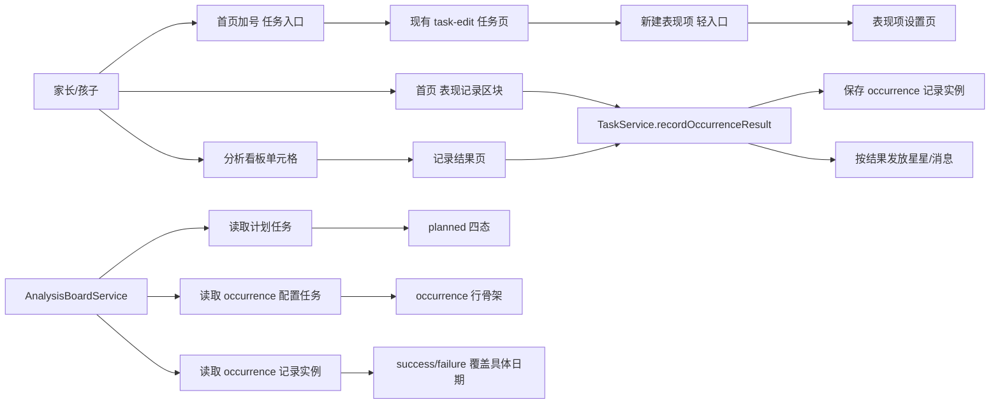

# 里程碑-21L：按发生记录任务与分析看板空白语义治理 详细设计文档

> **设计状态**：🔴 待审核
> **创建日期**：2026-04-16
> **设计者**：GPT5 Codex
> **审核者**：项目维护者
> **预计工期**：3-4 天

---

## 📋 目录

- [需求分析](#需求分析)
- [技术方案](#技术方案)
- [代码结构](#代码结构)
- [实施步骤](#实施步骤)
- [测试方案](#测试方案)
- [风险评估](#风险评估)
- [替代方案](#替代方案)

---

## 需求分析

### 功能描述

当前任务系统默认把“任务当天存在安排但没有完成”解释成失败。这个逻辑对“每天都应该做”的习惯/学习任务是成立的，但对“老师当天是否安排完全不可预知”的学校场景任务不成立。

典型例子是“听写全对”“考试全对”。这类任务真实语义是：

1. 当天老师安排了，且孩子达成目标，则应记录为成功
2. 当天老师安排了，但孩子未达成，则应记录为失败
3. 当天老师没有安排，则不应被视为失败，而应保持空白

在没有分析看板前，这个缺口并不显著，因为家长只在“确实发生”时才会手动打勾；但在 `M21G` 月度履约看板落地后，系统会把这些“未发生”的日期也推导为失败态，导致一整行连续打叉。对孩子和家长来说，这既不真实，也有明显的负面心理影响。

本质问题不是看板视觉，而是任务建模当前只有“按计划执行”这一种模式，没有表达“按发生记录”的能力。

### 核心产品判断

这类任务不应继续被建模成“固定排程任务”，而应新增一种与 `study / habit / interest` 正交的执行方式：

- `按计划执行`：当前默认模式，适用于作业、练琴、阅读、打扫等有明确安排的任务
- `按发生记录`：新模式，适用于听写、考试、课堂表现、体育测试等只有在事件发生时才记录结果的任务

这里**不是新增任务类型**，而是新增“执行方式/记录方式”。因为“学习 / 习惯 / 兴趣”描述的是任务内容类别，而“按计划 / 按发生记录”描述的是任务如何产生每天的状态，这两个维度不能混在一起。

### 业务价值

- [x] 用户价值：让孩子看到真实的月度表现，不再被“其实没发生”的打叉打击
- [x] 产品价值：补齐分析看板对现实学校场景的适配能力，避免看板语义失真
- [x] 技术价值：把“未发生”和“未完成”拆开，减少未来在任务、统计、消息、首页上的语义冲突

### 功能范围

**包含**：

- [x] 新增任务执行方式：`按发生记录`
- [x] 新增“记录结果”主入口
- [x] 分析看板支持“成功 / 失败 / 空白”三态展示
- [x] 统计口径按“发生过的记录”计入分母
- [x] 兼容已有周重复非必做任务向新模式迁移
- [x] 为“记录型任务”补齐最小数据模型和服务接口设计

**不包含**：

- [x] 不接入学校课表、老师通知、OCR 或自动识别
- [x] 不尝试自动推断历史上哪些“未完成”其实属于“未发生”
- [x] 不在本期扩展到奖励、消息之外的复杂成就体系
- [x] 不做独立的“校园表现中心”页面

### 优先级

- **优先级**：P1
- **理由**：当前行为会系统性误伤分析看板的真实性和孩子体验，但不影响主链路可用性，属于强体验优先级

---

## 技术方案

### 方案概述

`M21L` 采用“**任务执行方式双轨制**”方案：

1. 保留现有 `按计划执行` 任务，不改默认行为
2. 新增 `按发生记录` 任务，用于表达“只有发生时才记录”的学校事件
3. 为 `按发生记录` 任务引入“配置任务 + 当日记录”双层结构
4. 首页提供低负担“表现记录”入口，跟随当前选中日期记录结果
5. 分析看板对该模式改为 `✓ / ✕ / 空白` 三态，不再把空白解释为失败

目标不是让家长每天维护任务，而是让家长继续维持“发生了才记”这一低负担习惯，只是把系统语义改正确。

### 产品设计结论

#### 决策1：新增的是“执行方式”，不是“任务类型”

正式新增字段：

- `planned`：按计划执行
- `occurrence`：按发生记录

任务 `type` 仍保持：

- `study`
- `habit`
- `interest`

例如“听写全对”仍然是 `study`，只是 `executionMode = occurrence`。

这样可以保证：

- 不破坏现有按类别着色、排序和统计的心智
- 后续如果出现“习惯类但按发生记录”的任务，也不需要再拆模型

#### 决策2：按发生记录任务不进入首页“今日待做任务”主列表

这类任务当天是否发生不可预知，因此不应该出现在首页待办列表中，否则仍然会形成“今天应该做但没做”的压力。

正式口径：

- 首页待做列表只展示 `planned` 任务
- `occurrence` 任务只通过“记录结果”入口产生记录
- 已记录的结果不反向插入今日待做列表

#### 决策3：任务入口保持不变，表现项从现有任务页轻量分流

结合当前实际实现，[`pages/index/index.js`](/Users/wangdafei/code/study_task_wechat/pages/index/index.js) 里的首页加号 `任务` 会直接跳到 [`pages/task-edit/task-edit.js`](/Users/wangdafei/code/study_task_wechat/pages/task-edit/task-edit.js)，而这个页面当前同时承载：

- 顶部 `任务分布` 热力图卡片
- 模板快捷填充
- 日常任务完整创建表单

因此本期正式冻结：

- 首页加号里的 `任务` 入口保持不变
- 不在首页点击 `任务` 时弹 `action sheet`
- 不把整个任务页改成 `日常任务 / 表现项` 标签页

表现项创建入口改为：

- 在当前任务页“添加任务”卡片标题行右侧增加一个轻量文本动作：`新建表现项 >`
- 点击后进入独立轻量页 `pages/task-occurrence-edit/task-occurrence-edit`

放置位置冻结为：

- 在“添加任务”卡片标题行右侧
- 不放在标题下面
- 不插到快捷填充区域上方

这样可以最大程度保持现有任务页的视觉节奏和用户习惯。

#### 决策4：首页新增 `表现记录` 区块，跟随当前日期标签作为 occurrence 主记录面

occurrence 任务的主记录入口不放在加号菜单，而放在首页主内容区，作为最低成本的单日记录面，并与首页现有日期导航保持同一套时间语义。

正式口径：

- 在首页当前日期任务区块之后新增一个独立区块：`表现记录`
- 区块固定标题为 `表现记录`
- 区块头部右侧展示当前选中日期标签：`今天` / `昨天` / `4月16日`
- 区块内容跟随首页 `currentViewDate` 切换
- 仅当当前视角下存在至少一个对该日期有效的 `occurrence` 配置任务时显示
- 区块辅助文案使用：
  - `有结果时再记录，没有发生就留空`

区块语义冻结为：

- `当前日期任务`：当前选中日期原本安排要做的事
- `表现记录`：当前选中日期如果有结果，就顺手记一下

交互冻结为：

- 今天：可直接记录今天发生的结果
- 过去日期：可直接补录过去某天的结果
- 未来日期：区块进入只读禁用态，显示 `未来日期不能记录表现`

这样可以避免把 occurrence 任务误塞回“今日待办”，也能让家长在首页最低成本完成当天记录与补录，同时和任务日期标签保持一致。

#### 决策4A：首页顶部圆环改为 `当前进度`，并纳入已记录表现项

如果 occurrence 达成会发放星星，但首页圆环完全不变化，用户会认为系统没有把这次结果算进去。因此首页顶部圆环不能继续只表达传统 planned 任务进度。

正式口径：

- 首页顶部标题从 `任务完成进度` 改为 `当前进度`
- 圆环统计跟随首页当前选中日期
- `planned` 任务：沿用当前规则，进入对应类型分母
- `occurrence` 表现项：只有该日期已经记录结果时才进入分母
- `occurrence = success`：计入完成
- `occurrence = failure`：计入未完成
- `occurrence = blank`：不进入分母
- 未来日期预览场景下，`occurrence` 不进入分母

这样首页的记录动作、星星奖励和圆环反馈会保持一致，不会出现“拿到了星星但进度没变”的割裂感。

#### 决策4B：表现记录必须沿用现有目标孩子解析规则，不能让家长猜“这次记给谁”

表现记录和任务补打卡、奖励兑换一样，都是围绕“当前正在为哪个孩子操作”展开。若首页或记录页没有冻结解析规则，家长在多孩子家庭里很容易把结果记错孩子。

正式口径：

- 孩子自己设备 / 孩子视角：直接记录给自己
- 家长切到孩子视角：直接记录给当前孩子
- 家长自己视角且只有一个孩子：默认记录给唯一孩子
- 家长自己视角且多个孩子：
  - 若存在 `lastActiveChild`，默认记录给该孩子
  - 若不存在可用的 `lastActiveChild`，首次记录前弹轻量选择
- 一旦本次首页已确定目标孩子，当页 `表现记录` 区块内后续点击都沿用该目标，避免一页内反复询问
- 记录页顶部必须明确显示当前记录对象，且允许在需要时切换

这样可以保证：

- 与现有任务/奖励操作保持同一套共享设备心智
- 家长不需要每次都重新理解“现在是替谁记”
- 多孩子家庭下不会出现误记后才发现星星记错人的问题

#### 决策5：分析看板对 occurrence 行只保留三态

对于 `planned` 行，沿用现有四态：

- `✓`：完成
- `✕`：已过期未完成
- `○`：未开始
- 空白：无安排

对于 `occurrence` 行，正式改为：

- `✓`：当天发生且达成
- `✕`：当天发生但未达成
- 空白：当天没有发生，或尚未记录

`occurrence` 行**不显示 `○` 未开始态**。未来日期与过去未发生日期都保持空白。

#### 决策6：分析看板对 occurrence 行增加轻量模式标识

为了让“整行空白”不被误读为系统没加载，`occurrence` 行的任务标题后补一个非常克制的轻量标识：

- 文案：`表现`
- 视觉：小号中性色描边胶囊

例如：

- `听写全对 [表现]`
- `考试全对 [表现]`

这样用户一眼就知道，这行不是“每天有安排”，而是“发生时才记录”。

#### 决策7：统计分母只算“发生过的记录”

`occurrence` 任务的统计口径正式冻结为：

- `成功数`：记录为成功的次数
- `失败数`：记录为失败的次数
- `空白`：不进入分母

因此：

- 看板顶部 `已完成 / 未完成 / 未开始` 摘要中
  - `occurrence` 行的成功计入 `已完成`
  - `occurrence` 行的失败计入 `未完成`
  - `occurrence` 行的空白不计入任何摘要
- `occurrence` 行不贡献 `未开始`

这样“这个月只听写了 4 次，3 次全对 1 次没全对”才能被真实表达为 `3 ✓ / 1 ✕`，而不是 `3 ✓ / 27 ✕ / 0 ○`。

#### 决策8：记录结果按“日期 + 任务”唯一，不做多次累积

同一个孩子、同一个 `occurrence` 任务、同一天，最多只允许保留一条记录：

- 成功
- 失败

如果家长当天第一次记错了，可以编辑覆盖；不允许一日多次累积多条结果。

这样可以避免：

- 同一天同一任务发多次星星
- 看板单元格无法决定展示哪种状态

#### 决策9：occurrence 任务不能标记为“必做”

“必做 + 逾期惩罚”的成立前提是任务本身一定有安排。对于 `occurrence` 任务，这个前提不成立。

正式规则：

- `occurrence` 模式下隐藏 `必做` 开关
- 已有任务切换到 `occurrence` 时，如果原来是 `isRequired=true`，保存时自动回退为 `false`

#### 决策10：表现记录走首页日期导航内联，分析看板点击进入记录页

正式交互路径冻结为：

1. **配置入口**：首页加号 -> `任务` -> 进入现有任务页 -> 点击“添加任务”卡片标题行右侧 `新建表现项 >`
2. **首页主记录入口**：首页 `表现记录` 区块中直接点 `达成 / 未达成`，并跟随日期标签支持今天与过去日期补录
3. **分析页定点补录入口**：分析看板点击某个 `occurrence` 行的过去/今天单元格 -> 进入记录页并带任务 + 日期预填

因此不采用：

- 首页加号菜单直接新增 `记录`
- 首页点 `任务` 后弹 `action sheet`
- 任务页用标签切换 `日常任务 / 表现项`

页面职责收口为：

- 任务页：配置 occurrence 任务
- 首页：按当前选中日期记录结果
- 分析页：按月回看，并从具体缺口定点进入补录

#### 决策10A：`新建表现项 >` 进入的是“表现项设置页”，不是一次性创建页

如果用户只能“新建”，却没有稳定的后续维护入口，那么第一次创建后就会失去对表现项的管理能力。对“听写全对”“考试全对”这类会随学期变化的项目，这会很快变成真实使用问题。

正式口径：

- `新建表现项 >` 的落点仍为 `pages/task-occurrence-edit/task-occurrence-edit`
- 但该页产品定位改为：`表现项设置页`
- 首屏优先展示当前孩子/当前作用域下已有表现项列表
- 页内支持三类动作：
  - 新建表现项
  - 编辑已有表现项
  - 停用/删除已有表现项
- 新建表单默认折叠在列表之后，或通过页内主按钮展开
- 若当前还没有任何表现项，可直接进入轻量空态 + 新建表单

这样可以保证：

- “创建”和“维护”在同一处闭环
- 不额外新增新的管理页面，避免入口膨胀
- 符合当前任务页“轻入口分流”的节制策略

#### 决策11：旧周重复任务不做静默历史重写

当前已有一批“周重复、非必做、实际只在发生时才打勾”的老任务。系统无法安全区分：

- 哪些日期是真的“老师安排了但没达成”
- 哪些日期其实是“根本没安排”

因此正式冻结：

- 不对历史数据做自动重写
- 只支持“从现在开始切换为按发生记录”
- 切换后只影响未来日期和新产生的记录

这样可以避免系统擅自篡改历史事实。

### 数据模型

#### 任务执行方式

```javascript
const TaskExecutionMode = {
  PLANNED: 'planned',
  OCCURRENCE: 'occurrence'
};
```

#### occurrence 记录结果

```javascript
const TaskRecordOutcome = {
  NONE: 'none',
  SUCCESS: 'success',
  FAILURE: 'failure'
};
```

#### Task 扩展字段

```javascript
interface TaskActiveRange {
  startDate: string;
  endDate: string;
  hasNoEndDate: boolean;
}

interface Task {
  id: string;
  userId: string;
  title: string;
  type: 'study' | 'habit' | 'interest';
  executionMode?: 'planned' | 'occurrence';

  // 仅 occurrence 配置任务使用
  activeRange?: TaskActiveRange | null;

  // 仅 occurrence 记录实例使用
  isOccurrenceRecord?: boolean;
  occurrenceOutcome?: 'none' | 'success' | 'failure';
  recordedAt?: number;
}
```

#### 双层结构

`occurrence` 任务采用“配置任务 + 记录实例”模式：

1. **配置任务**
   - 由家长创建/编辑
   - 决定标题、类型、积分、有效时间范围
   - 不参与首页今日待办
   - 不自动生成每天实例

2. **记录实例**
   - 仅在用户点击“记录结果”时产生
   - 每条实例对应一个具体日期
   - 用于分析看板、消息与星星奖励
   - 通过 `parentTaskId` 指回配置任务

该结构复用现有“父任务 + 子实例”的心智，但不走重复任务自动展开链路。

### 服务接口设计

#### 新增/扩展接口

| 方法 | 说明 | 参数 | 返回值 |
|------|------|------|--------|
| `TaskService.getOccurrenceTasks(scope)` | 获取当前视角下可记录的 occurrence 配置任务 | `{ userId, date, includeInactive }` | `Task[]` |
| `TaskService.recordOccurrenceResult(taskId, options)` | 为 occurrence 任务记录某天结果 | `{ userId, date, outcome }` | `{ success, task?, record?, starsAwarded?, message? }` |
| `TaskService.getOccurrenceRecordsByDateRange(scope)` | 获取 occurrence 记录实例 | `{ userId, startDate, endDate }` | `Task[]` |
| `TaskService.convertTaskToOccurrenceMode(taskId, options)` | 将既有计划任务切换为 occurrence 模式 | `{ effectiveFromDate }` | `{ success, convertedTask?, archivedFutureInstances?, message? }` |

#### 分析看板聚合接口调整

| 方法 | 调整 | 说明 |
|------|------|------|
| `AnalysisBoardService.buildMonthlyBoard()` | 扩展 | 同时读取 `planned` 任务与 `occurrence` 配置/记录，并按不同行为生成行状态 |

### 页面与交互设计

#### 1. 任务页（现有 `task-edit`）只做入口分流，不承载表现项表单

结合当前 [`pages/task-edit/task-edit.wxml`](/Users/wangdafei/code/study_task_wechat/pages/task-edit/task-edit.wxml) 的真实结构，本页当前是：

1. 顶部 `任务分布` 热力图卡片
2. 下方 `添加任务` 卡片
   - 模板快捷填充
   - 日常任务重表单
   - 时间、重复、提醒、必做等计划任务字段

因此本期冻结：

- 不在现有 `task-edit` 表单里加入 `planned / occurrence` 切换
- 不在“添加任务”表单内部通过隐藏字段硬切模式
- 不把“添加任务”标题行改成标签页

本页只新增一个非常轻的入口动作：

- 在“添加任务”卡片标题行右侧增加 `新建表现项 >`

视觉要求：

- 以次级文本按钮呈现，不与“添加任务”主标题争夺视觉重心
- 若当前 `card` 组件无法承载头部右侧动作，则将该卡片头部改为自绘标题行，但正文结构不变

#### 2. 表现项设置页

新增轻量页面：`pages/task-occurrence-edit/task-occurrence-edit`

这个页面负责“配置与维护 occurrence 任务”，不负责当天结果记录。

页面结构冻结为：

1. 表现项列表
   - 展示当前孩子/当前作用域下已有表现项
   - 列表项展示：名称、类型、星星、适用时间、状态
   - 列表项右侧提供 `编辑`
   - 次级动作收纳 `停用 / 删除`
2. 新建 / 编辑表单
   - 复用同一套最小字段
   - 新建时为空白草稿
   - 编辑时回填当前表现项

字段冻结为：

1. 表现项名称
2. 类别（学习 / 习惯 / 兴趣）
3. 星星
4. 适用时间
   - 开始日期
   - 结束日期 / 长期有效

这里的“适用时间”指：

- 这类表现项在什么时间段内有效
- 不是今天是否发生
- 也不是每周哪几天固定安排

例如：

- `听写全对`：一学期内有效
- `考试全对`：某个阶段内有效

设计原则：

- 不接模板
- 不放重复
- 不放提醒
- 不放必做
- 不放时间范围
- 用最小表单承载“配置 + 维护”动作，避免把日常任务的复杂结构复制过来

#### 3. 表现记录区块

首页新增 `表现记录` 区块，作为 occurrence 主记录入口，并跟随首页当前日期标签切换。

区块结构冻结为：

1. 区块标题：`表现记录`
2. 标题右侧：当前日期标签
   - 今天：`今天`
   - 过去日期：`昨天` / `4月16日`
   - 未来日期：`4月20日`
3. 辅助文案：`有结果时再记录，没有发生就留空`
4. occurrence 列表项
   - 左侧：表现项名称
   - 右侧：两个轻量动作 `达成` / `未达成`
5. 已记录态
   - `已记录：达成`
   - `已记录：未达成`
   - 右侧一个最轻量 `修改`
6. 未来日期态
   - 不展示 `达成 / 未达成`
   - 只展示轻量说明：`未来日期不能记录表现`

视觉原则：

- 与首页现有白底卡片体系保持一致
- 视觉重量低于当前日期任务列表，但高于空态提示
- 首页不使用大面积红叉或强刺激色块
- 首页负责“录入结果”，分析看板负责“展示事实”

#### 3A. 首页顶部当前进度圆环

首页顶部三枚圆环改为表达“当前选中日期下的有效完成进度”。

结构冻结为：

1. 标题：`当前进度`
2. 仍按三类展示：`习惯 / 学习 / 兴趣`
3. 统计口径：
   - planned 任务：沿用现有完成率计算
   - occurrence 表现项：只有该日期已有结果记录时进入分母
   - occurrence 达成：计入完成
   - occurrence 未达成：计入未完成
   - occurrence 留空：不进入分母

体验原则：

- 用户在首页记录一次表现结果后，圆环应立即刷新
- 星星奖励与圆环变化保持同一反馈方向
- 未来日期下不人为制造 occurrence 的 0 进度压力

#### 4. 记录结果页

新增轻量页面：`pages/task-record/task-record`

页面结构冻结为：

1. 顶部日期选择
   - 默认今天
   - 支持切到过去日期
2. 当前孩子提示
   - 家长自己视角下显示当前记录对象是谁
   - 多孩子场景允许切换当前记录对象
3. occurrence 任务列表
   - 每张卡片展示任务名、积分、类型
   - 两个主动作：`达成` / `未达成`
4. 已记录状态
   - 当天已记录时展示当前状态，并允许改为另一个结果

设计原则：

- 不做复杂表单
- 不要求家长逐项填写说明
- 一次点击完成记录

#### 5. 分析看板

新增行为：

- `occurrence` 行标题后展示 `表现` 胶囊
- 点击该行某一天的格子：
  - 今天或过去日期：进入记录页并带上任务 + 日期
  - 未来日期：不弹记录，只保持只读

视觉规则：

- `occurrence` 行空白格保持纯空，不画 `○`
- 图例文案从“空白=无安排”更新为更宽的解释：
  - `空白：无安排 / 无记录`
- 行标题区改为 `title + badge` 的单行布局
- 标题文本优先显示，badge 固定为超轻量描边胶囊
- 标题空间不足时优先截断标题，不压缩 badge 到难以识别
- 行选中态下，badge 只轻微提亮，不反客为主

### 视觉与交互稳定性要求

#### 1. 不在现有复杂表单中做大面积跳变

当前 `task-edit` 表单字段很多，若把 occurrence 模式硬塞进去，会导致：

- 模板区语义错位
- 时间频率区域整块消失
- 用户误以为页面异常或内容丢失

因此本期正式禁止：

- 在现有“添加任务”表单中做模式切换
- 通过字段隐藏制造大面积布局跳动

#### 2. 首页 `表现记录` 要安静，不要像第二个待办列表

首页的 occurrence 区块应和“当前日期任务列表”明显区分：

- 任务区是“当前日期该做什么”
- 记录区是“当前日期有什么结果就顺手记一下”

视觉上：

- 区块可使用同样的白底卡片
- 标题层级略低于页面主标题，和其他次级区块一致
- 日期标签使用低饱和中性色胶囊，不与主标题竞争
- 辅助文案用低对比灰色，不长期抢眼
- `达成 / 未达成` 按钮使用轻描边或极浅底色
- 结果态比按钮更安静，避免首页出现大片负向刺激

#### 3. `新建表现项 >` 是次入口，不是新主 CTA

在任务页中，`新建表现项 >` 的视觉权重必须低于 `添加任务` 主入口：

- 不做与主标题同权重的大按钮
- 不放成第二个大主按钮
- 不与模板区并列成第三层复杂操作带

推荐表现：

- 头部右侧文本按钮
- 中性色
- 小箭头收尾
- 只有一行，不增加额外说明块

#### 4. 表现项设置页要像“轻管理”，不能长成第二个重表单页

这个页面虽然承担维护闭环，但视觉上仍必须明显轻于现有 `task-edit`：

- 先列表、后表单，优先让用户感知“这是在管理已有表现项”
- 编辑动作默认从列表项进入，不在首屏同时堆满多个大表单
- 停用/删除收纳为次级动作，避免页面显得危险和嘈杂
- 空态只保留一条示例解释，不写长篇帮助文案

### 兼容与迁移策略

#### 老任务转换

允许家长在编辑既有任务时切换到 `按发生记录`。

保存时执行：

1. 保留历史已完成记录不变
2. 保留历史未完成记录不变，不自动洗白
3. 清理 `effectiveFromDate` 之后的未来自动生成实例（仅限未完成、未奖星、未锁定实例）
4. 生成新的 `occurrence` 配置任务或将原父任务切换为 `occurrence`

推荐默认：

- `effectiveFromDate = 今天`

#### 数据兼容原则

- 未设置 `executionMode` 的历史任务一律视为 `planned`
- 未设置 `occurrenceOutcome` 的实例一律视为非 occurrence 记录

### DDD 分层设计

**领域层（models/）**：

- [ ] 修改模型：`models/task.js`
- 说明：新增执行方式、记录结果、有效区间等领域属性

**服务层（services/）**：

- [ ] 修改服务：`services/task-service.js`
- [ ] 修改服务：`services/task-service/task-write.js`
- [ ] 修改服务：`services/task-service/task-query.js`
- 说明：新增 occurrence 任务查询、记录、转换，以及对首页/统计的过滤

**表现层（pages/、components/）**：

- [ ] 新建页面：`pages/task-occurrence-edit/`
- [ ] 新建页面：`pages/task-record/`
- [ ] 修改页面：`pages/task-edit/`
- [ ] 修改页面：`pages/index/`
- [ ] 修改页面：`packageChart/pages/analysis/`
- 说明：补齐表现项设置页、首页表现记录区块、分析看板点击补录

### 架构图



---

## 代码结构

### 文件变更清单

**新增文件**：

- `pages/task-occurrence-edit/task-occurrence-edit.js` - occurrence 配置任务轻量设置页逻辑
- `pages/task-occurrence-edit/task-occurrence-edit.wxml` - occurrence 配置与维护页视图
- `pages/task-occurrence-edit/task-occurrence-edit.wxss` - occurrence 配置与维护页样式
- `pages/task-record/task-record.js` - occurrence 结果记录页逻辑
- `pages/task-record/task-record.wxml` - 结果记录页视图
- `pages/task-record/task-record.wxss` - 结果记录页样式
- `test/pages/task-occurrence-edit.page.test.js` - occurrence 表现项设置页测试
- `test/pages/task-record.page.test.js` - 记录页行为测试

**修改文件**：

- `models/task.js` - 新增执行方式与 occurrence 结果字段
- `services/task-service.js` - 对外暴露 occurrence 查询/记录入口
- `services/task-service/task-write.js` - 记录 occurrence 结果、转换模式
- `services/task-service/task-query.js` - occurrence 查询与统计过滤
- `pages/task-edit/task-edit.*` - 在“添加任务”卡片头部新增 `新建表现项 >` 轻入口
- `pages/index/index.js` - 渲染 `表现记录` 区块、当前进度圆环并处理单日结果录入
- `packageChart/services/analysis-board-service.js` - occurrence 行状态聚合
- `packageChart/pages/analysis/analysis.*` - occurrence 行标识、点击记录
- `docs/api/services-guide.md` - 实施完成后同步 TaskService 对外接口

### 核心逻辑骨架

```javascript
function resolveBoardCellState(taskLike, monthContext) {
  if (taskLike.executionMode === 'occurrence') {
    if (taskLike.occurrenceOutcome === 'success') {
      return 'done';
    }
    if (taskLike.occurrenceOutcome === 'failure') {
      return 'missed';
    }
    return 'blank';
  }

  if (Number(taskLike.status) === TaskStatus.COMPLETED) {
    return 'done';
  }

  if (taskLike.date >= monthContext.todayString) {
    return 'upcoming';
  }

  return 'missed';
}

function resolveOccurrenceRecordUserId(context) {
  if (context.currentUserRole === 'child') {
    return context.currentUserId;
  }

  if (context.viewUserRole === 'child') {
    return context.viewUserId;
  }

  if (context.childUserIds.length === 1) {
    return context.childUserIds[0];
  }

  if (context.lastActiveChild && context.childUserIds.includes(context.lastActiveChild)) {
    return context.lastActiveChild;
  }

  return null;
}

async function recordOccurrenceResult(taskId, { userId, date, outcome }) {
  const parentTask = await taskRepository.getById(taskId);
  const existingRecord = await taskRepository.getOccurrenceRecord(taskId, userId, date);

  const record = existingRecord || createOccurrenceRecord(parentTask, userId, date);
  record.occurrenceOutcome = outcome;
  record.status = outcome === 'success' ? TaskStatus.COMPLETED : TaskStatus.PENDING;

  await taskRepository.save(record);

  if (outcome === 'success') {
    await starService.handleTaskCompletion(record, userId);
  }

  return { success: true, record };
}
```

---

## 实施步骤

### 第1步：任务建模与表现项设置页设计（预计0.5天）

- [ ] **任务**：为任务补齐 `executionMode / activeRange / occurrenceOutcome` 设计，并新增表现项设置页
- [ ] **验证**：表现项设置页字段与设计文档口径一致
- [ ] **依赖**：无

**实施要点**：

1. `type` 与 `executionMode` 拆成两个维度
2. 表现项设置页以“列表 + 最小表单”承载配置与维护，不复用现有重表单
3. 当前 `task-edit` 只增加轻入口，不做模式切换

---

### 第2步：记录结果主链路（预计1天）

- [ ] **任务**：实现首页 `表现记录` 区块、当前进度圆环、历史补录页与 TaskService 记录接口
- [ ] **验证**：首页可一键记录成功/失败，且支持覆盖修改
- [ ] **依赖**：第1步

**实施要点**：

1. 首页 occurrence 任务跟随当前日期直接给出 `达成 / 未达成`
2. 补录页默认带入当前孩子与日期，多孩子场景沿用既有目标孩子解析规则
3. 同任务同日期只保留一条记录，并即时刷新当前进度圆环

---

### 第3步：分析看板 occurrence 语义收口（预计1天）

- [ ] **任务**：让分析看板正确展示 occurrence 三态
- [ ] **验证**：空白不再被误判为失败，摘要统计口径正确
- [ ] **依赖**：第1步、第2步

**实施要点**：

1. 看板同时读取 occurrence 配置任务与记录实例
2. occurrence 行不再显示 `upcoming`
3. 增加 `表现` 胶囊与单元格点击补录

---

### 第4步：兼容转换与回归测试（预计1-1.5天）

- [ ] **任务**：补齐旧任务切换 occurrence 的转换策略与回归测试
- [ ] **验证**：旧计划任务可从今天起切换，不误改历史事实
- [ ] **依赖**：第1步、第2步、第3步

**实施要点**：

1. 仅清理未来未完成自动实例
2. 历史数据保持不动
3. 补齐任务、首页、分析页三层自动化测试

---

## 测试方案

### 单元测试

| 测试项 | 测试方法 | 预期结果 |
|--------|---------|---------|
| occurrence 任务建模 | Task 模型测试 | 新字段默认值与序列化兼容 |
| 记录结果写入 | TaskService 测试 | 同日期同任务只保留一条记录 |
| 成功/失败映射 | TaskService 测试 | 成功发星星，失败不发星星 |
| 分析看板聚合 | AnalysisBoardService 测试 | 空白不再进入 missed / upcoming |
| 任务页入口显示 | 任务页测试 | `新建表现项 >` 入口显示稳定，不扰动原表单 |
| 表现项维护闭环 | 表现项页面测试 | 可新建、编辑、停用/删除，不额外跳出新页面 |
| 首页表现记录区块 | 首页模块测试 | 跟随日期标签切换，今天/过去可录入，未来为只读禁用态 |
| 首页当前进度圆环 | 首页模块测试 | 已记录 occurrence 成功/失败会同步影响对应类型进度，空白不进分母 |
| 记录对象解析 | 首页/服务测试 | 多孩子场景下沿用当前孩子 / 唯一孩子 / lastActiveChild / 首次选择 规则 |
| 转换逻辑 | TaskService 测试 | 仅清理未来实例，不动历史记录 |

### 集成测试

- [ ] 家长自己视角下从任务页创建 occurrence 任务并为默认孩子记录结果
- [ ] 共享设备孩子视角下直接记录自己的 occurrence 结果
- [ ] 家长自己视角下多孩子首次记录时正确触发目标孩子选择
- [ ] 分析看板点击单元格进入记录页并回写成功

### 手动测试

1. **基础场景**：
   - [ ] 创建“听写全对” occurrence 任务
   - [ ] 今天记录成功，看板显示 `✓`
   - [ ] 明天未记录，单元格保持空白
   - [ ] 某天记录失败，看板显示 `✕`

2. **视角场景**：
   - [ ] 家长自己视角 + 多孩子
   - [ ] 家长自己视角 + 多孩子 + lastActiveChild 生效
   - [ ] 家长切到孩子视角
   - [ ] 孩子设备自己记录

3. **迁移场景**：
   - [ ] 既有周重复任务切换为 occurrence，从今天起不再生成未来计划实例

### 测试覆盖率目标

- 最低要求：85%
- 推荐目标：90%

---

## 风险评估

### 技术风险

| 风险项 | 影响 | 概率 | 应对措施 |
|--------|------|------|---------|
| occurrence 配置任务与记录实例混用后污染首页查询 | 高 | 中 | 首页任务查询默认排除 occurrence 配置与记录实例 |
| 多孩子家庭下把表现结果记错孩子 | 高 | 中 | 冻结目标孩子解析规则，并在记录页头部显式展示当前对象 |
| 历史老任务切换后用户期待“自动洗白”历史叉号 | 中 | 高 | 明确只从今天起转换，不隐式改写历史 |
| 看板同时展示 planned 与 occurrence 后图例理解不一致 | 中 | 中 | occurrence 行增加 `表现` 胶囊，图例补充“空白=无安排/无记录” |
| 记录失败使用 `status=pending` 带来兼容歧义 | 中 | 中 | 以 `occurrenceOutcome` 作为 occurrence 行主语义，避免继续靠 `status` 猜测 |
| 任务页新增入口后打破当前卡片节奏 | 中 | 中 | 只在卡片标题行右侧增加轻量文本动作，不新增一整行入口带 |

### 产品风险

| 风险项 | 影响 | 概率 | 应对措施 |
|--------|------|------|---------|
| 用户把 `表现记录` 误解成第二个待办列表 | 中 | 中 | 用“有结果时再记录，没有发生就留空”解释，并与任务区做视觉分层 |
| 用户不理解 `新建表现项 >` 和普通任务创建的差别 | 中 | 中 | 在表现项设置页首屏给出典型例子，不在任务页堆长说明 |
| 用户创建后找不到去哪里改表现项 | 中 | 中 | 把创建与维护统一到同一个“表现项设置页”，首屏优先展示已有列表 |
| 家长希望直接在看板里长按改结果 | 低 | 中 | 第一版统一跳转记录页，不做多手势交互 |
| 用户希望自动修复历史误判 | 中 | 高 | 记录为后续候选需求，不在本期承诺自动推断 |

---

## 替代方案

### 方案A：继续复用现有计划任务，只新增“忽略/未发生”状态

优点：

- 改动看起来较小
- 不需要新增记录入口

缺点：

- 本质上仍把 occurrence 任务当作计划任务
- 首页、提醒、必做、统计、分析都会长期带着大量特殊分支
- 家长仍要面对“今天到底要不要忽略一次”的额外心智负担

结论：

- 不采用。它只是给旧模型打补丁，不是正确建模。

### 方案B：把 occurrence 场景单独做成“校园表现模块”

优点：

- 语义独立，理论上最清晰

缺点：

- 入口、模型、看板、任务体系完全分叉
- 学习任务与校园表现任务会变成两套平行系统
- 成本过高，不符合当前产品极简原则

结论：

- 不采用。范围过大，也会破坏现有产品的连续性。

### 方案C：新增 `occurrence` 执行方式，并统一进入任务体系

优点：

- 最符合现实语义
- 最小化家长维护负担
- 与现有任务/积分/分析体系保持连续
- 能解释 blank、done、missed 的边界

缺点：

- 需要同时修改任务模型、首页入口和看板聚合

结论：

- **正式采用本方案**
