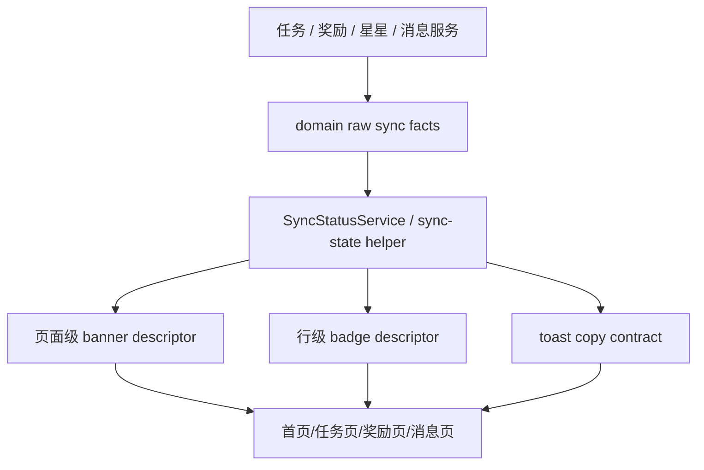

# 里程碑-21M：全局同步状态体验收口 详细设计文档

> **设计状态**：🟢 复审通过，可按 `M21M-A` 进入实施
> **创建日期**：2026-04-18
> **设计者**：GPT5 Codex
> **审核者**：项目维护者
> **预计工期**：`M21M-A` 1-1.5 天；`M21M-B` 7-8 天

---

## 📋 目录

- [需求分析](#需求分析)
- [现状问题复盘](#现状问题复盘)
- [技术方案](#技术方案)
- [代码结构](#代码结构)
- [实施步骤](#实施步骤)
- [测试方案](#测试方案)
- [风险评估](#风险评估)
- [替代方案](#替代方案)

---

## 需求分析

### 功能描述

项目已经具备“本地优先 + 云端同步 + authority refresh + 离线补偿”的基础能力，但用户在不同页面看到的同步状态仍然不统一：

- 首页与表现记录页会直接看到 `待同步 · 达成`
- 写入失败时常见 toast 是 `已暂存，等待同步`
- 消息中心会生成真正入库的 provisional 消息，如 `任务完成待同步`
- 奖励页和星星页多数情况下又不直接暴露 pending 状态，而是静默回退本地数据

这导致用户很难形成稳定心智：

1. “待同步”到底表示还没成功、还是已经成功但本机没刷新？
2. 哪些页面显示的是云端最终结果，哪些页面显示的是本地暂存结果？
3. 为什么同样是一个动作，有的地方是 badge，有的地方是 toast，有的地方是消息，有的地方完全不提示？

`M21M` 的目标不是新增同步能力，而是基于现有实现收口一套全局产品契约，让“云端最终结果 / 本地待同步”的表达在任务、表现项、奖励、星星、消息中心和汇总页面上保持一致。

### 业务价值

- [x] 用户价值：用户只需要理解“最终结果”和“本机已暂存，稍后自动同步”两层语义，不再被各域不同文案和不同状态层级打断
- [x] 产品价值：页面信息层级更稳定，减少 badge / toast / 消息的重复噪音，提升整体精致感和可信度
- [x] 技术价值：把同步状态从散落在页面和域内的条件判断，收口成可复用的统一契约与共享 helper

### 落地策略

结合当前代码现实、收益优先级与回归成本，本设计正式改为“两阶段落地”：

- `M21M-A`：低成本收口阶段，优先解决用户已经明显感知到的同步表达割裂问题
  - 首页 / 表现记录页 / 分析看板共用 pending 判定 helper
  - toast 文案统一为 `已暂存，联网后自动同步`
  - 消息中心 provisional 弱化展示，preview / unread formal 优先
  - 不引入新的页面级 banner、scope summary、后端契约变更
- `M21M-B`：增强收口阶段，在 `A` 稳定后再继续推进跨域统一视图契约
  - `SyncStatusService`
  - `PendingScopeSummary`
  - `sync-banner`
  - 任务 / 奖励 authoritative cleanup 进一步统一
  - 奖励 `operationKey` authoritative 回包契约闭环

正式交付原则：

- 本轮先以 `M21M-A` 为默认实施范围
- `M21M-B` 保留在同一设计文档中，作为后续增强阶段，不与 `A` 混在一次提交中硬上
- 只有当 `A` 验收后仍确认存在跨页同步表达割裂、且收益高于回归成本时，再启动 `B`

### 功能范围

**包含**：

- [x] `M21M-A`：收口首页、表现记录页、分析看板、消息中心、toast 文案的同步表达
- [x] `M21M-B`：统一“云端最终结果 / 本地待同步 / 本机临时投影”的全局术语和层级
- [x] `M21M-B`：收口任务、表现项、奖励、星星、消息中心的同步状态展示规则
- [x] `M21M-B`：定义页面级、行级、toast 级、消息级各自的适用边界
- [x] `M21M-B`：补齐语义去重与 authoritative 覆盖本地 pending 的共享模式
- [x] `M21M-B`：增加当前 scope 的待同步概览能力，支持页面头部轻提示
- [x] `M21M-A/B`：补齐相关自动化测试与跨设备/弱网回归场景

**不包含**：

- [x] 不把所有域都重写为统一底层离线队列协议
- [x] 不改变现有“本地优先、云端补偿”的总体架构
- [x] 不新增复杂的网络诊断页、同步中心或多层状态面板
- [x] 不在本轮改造消息域的全部生成逻辑，只收口它的展示和去重契约
- [x] `M21M-A` 不引入后端契约变更
- [x] `M21M-A` 不新增 `SyncStatusService`、`PendingScopeSummary`、`sync-banner`

### 优先级

- **优先级**：P1
- **理由**：该问题已经在表现记录链路中真实暴露为线上体验缺陷，且跨任务/奖励/消息/星星多域复现概率高

---

## 现状问题复盘

### 当前实现事实

基于当前代码，项目已经存在三类不同的“同步状态来源”：

#### 事实1：任务域与奖励域已经接入统一离线队列

- `ServiceManager` 当前只为 `task` 与 `reward` 注册了 `offlineQueueService` adapter
- 登录后 `post-login-bootstrap` 会先执行 `offlineQueueService.drain({ reason: 'post_login_bootstrap', force: true })`
- 任务与奖励的补云链路都支持 legacy `pendingSyncMeta` 迁移到统一队列

这说明统一队列是现有正式基础设施，但它目前只覆盖两个域。

#### 事实2：星星域没有接入统一离线队列，而是用 `syncedToCloud` + 本地流水保护

- 星星域通过 `starRecord.syncedToCloud !== true` 判断是否存在本地待同步流水
- 一旦存在待同步本地流水，`refreshStarsFromCloud()` 会跳过云端覆盖，保留本地结果
- 星星域更接近“读取保护型”同步，而不是“显式待同步展示型”同步

这意味着星星域与任务/奖励域的底层同步模型并不一致。

#### 事实3：表现记录页和首页直接消费实体上的 `pendingSyncMeta / syncedToCloud`

- 首页与表现记录页目前都使用 `Boolean(record.pendingSyncMeta || record.syncedToCloud === false)` 作为 pending 判定
- 最近已修复的真实问题说明：只要本地 stale pending 记录没有被 authoritative 结果正确覆盖，页面就会误报 `待同步`

这说明页面层直接读取域内原始同步字段，风险较高。

#### 事实4：消息中心使用 provisional message 作为“待同步投影”

- `message-provisional.js` 会在任务/奖励云同步失败时创建真正入库的 provisional 消息
- `MessageRepository.replaceSyncedMessagesByScope()` 会用 `messageEventKey` 在云端正式消息到来时替换 provisional 消息
- 但 `message-display.js` 当前只按时间排序，不区分 provisional 与 formal 的信息层级

这意味着消息中心里的“待同步”不是单纯 badge，而是一种独立投影实体。

#### 事实5：页面层同步提示文案和层级不统一

当前至少存在以下表达：

- toast：`已暂存，等待同步`
- 行级 badge：`待同步 · 达成`
- 行级 badge：`待同步：达成`
- 消息标题：`任务完成待同步`
- 奖励/星星页面则多数不主动暴露 pending，而是静默回退本地数据

用户会被迫重新学习每个页面自己的同步话术。

### 现有方案的主要问题

#### 问题1：缺少跨域统一的“状态层级”

当前实现把以下概念混在一起：

- 云端已确认的最终结果
- 本机尚未同步成功的局部更改
- 为了提示用户而生成的本地 provisional 投影

没有统一状态层级时，页面就会各自定义 badge、toast 和消息。

#### 问题2：页面直接读取底层同步字段，容易把基础设施状态误展示为产品状态

`pendingSyncMeta` 与 `syncedToCloud` 是底层补偿和缓存字段，不是用户术语。  
一旦页面直接消费它们，就容易出现：

- stale pending 覆盖 authoritative
- 云端对象未显式标记 `syncedToCloud: true` 时被误判
- 同一业务动作在不同页面展示出不同状态

#### 问题3：消息中心和实体页不是同一个语义层

实体页关心的是“这个任务/奖励当前是什么最终状态”，  
消息中心关心的是“发生了什么动态”。

当前 provisional 消息会把“待同步”带入 timeline，但没有和实体页明确区分“这是动态投影，不是最终状态本身”。

#### 问题4：星星域属于特例，如果硬套任务/奖励模型会引入错误设计

星星域存在到期权威结算、读前 authority sync 和本地流水保护：

- 它不是一个适合逐条显示 `待同步` badge 的域
- 用户真正关心的是余额和记录是否可信，而不是每条星星流水的同步状态

所以 `M21M` 不能简单要求所有域都统一到同一个 UI 形态。

---

## 技术方案

### 方案概述

本设计采用“**分阶段收口**”方案：

- `M21M-A`：先解决最影响用户理解的三类问题
  - 表现记录页与分析页 pending 判定重复且口径分散
  - toast 文案不统一
  - 消息 provisional 与 formal 竞争主语义
- `M21M-B`：再推进完整的“统一同步状态契约 + 各域按层消费 + 页面只消费视图状态，不直接消费底层字段”

核心原则：

1. **最终结果是读模型基线**
   - 页面读路径默认以云端最终结果，或经过 authoritative merge 后的当前可信结果为基线
   - 但在用户刚完成本地写入后，主列表应优先显示本地最新结果，再通过轻提示表达“尚未完成云端同步”
2. **待同步是局部补充，不是主状态替代**
   - 若同一语义实体同时存在 authoritative 与 local pending，主视图优先保留当前用户刚操作后的最新结果，历史 stale pending 只允许被清理或降为轻提示
3. **provisional 是投影，不是正式状态**
   - 消息中心可以保留 provisional 动态，但必须明确它属于“本机暂存提醒”，不应与正式结果同层竞争
4. **按层级表达**
   - 当前动作反馈用 toast
   - 当前页面 scope 存在待同步项，用页面级轻提示
   - 只有当某条记录当前确实仍无 authoritative 结果时，才使用行级 `待同步`
5. **不强行统一底层架构**
   - 任务/奖励继续使用离线队列
   - 星星保持 authority sync + 本地流水保护模型
   - 消息继续允许 provisional 实体，但统一展示契约

阶段适用说明：

- `M21M-A` 只落实其中与表现记录、分析页、消息页、toast 文案直接相关的部分
- `M21M-B` 才完整引入下文的 `SyncViewState / PageSyncDescriptor / PendingScopeSummary / sync-banner`

### 统一同步状态契约

从本节开始，以下 `SyncViewState / SyncScopeOptions / PendingScopeSummary / PageSyncDescriptor / sync-banner / reward.operationKey authoritative 回包` 等完整契约，均属于 `M21M-B` 增强阶段内容。

`M21M-A` 只实施轻量子集：

- `utils/sync-state.js` 中的共用 pending 判定 helper
- 统一 toast 文案 helper
- provisional / formal 的展示优先级收口

除非某段明确标注为 `M21M-A`，否则本节后续规则默认按 `M21M-B` 理解。

新增一套跨域共享的视图状态定义，供页面和服务层 helper 共同消费：

```typescript
type SyncViewState =
  | 'authoritative'      // 云端最终结果，或经 authoritative merge 后的可信结果
  | 'pending_local'      // 当前语义实体只有本地暂存结果，尚无 authoritative 对应
  | 'provisional'        // 仅用于消息等投影实体
  | 'not_applicable';    // 不应显示同步状态

interface EntitySyncDescriptor {
  state: SyncViewState;
  shouldShowBadge: boolean;
  badgeText: string;
  tone: 'neutral' | 'pending' | 'warning' | 'success';
}

interface PageSyncDescriptor {
  shouldShowBanner: boolean;
  primaryText: string;
  secondaryText: string;
  deletionSummaryText: string;
  tone: 'neutral' | 'pending' | 'warning';
  sourceDomains: Array<'task' | 'reward' | 'message' | 'star'>;
  hasPendingStarChanges: boolean;
}

interface SyncScopeOptions {
  scope: 'user' | 'family';
  userId: string | null;
  familyId: string | null;
  childUserIds?: string[];
  scene: 'index' | 'task-record' | 'rewards' | 'reward-manage' | 'my-exchanges' | 'message' | 'analysis';
}
```

注意：

- 这是**视图契约**，不是新的持久化字段
- 底层仍然可以保留 `pendingSyncMeta / syncedToCloud / isProvisional`
- 行级和页面级 descriptor 分开定义，避免把“实体状态”和“页面摘要”混成一个接口

### 统一 scope 契约

`M21M` 中的 `scope` 不引入全新语义，它与项目现有“读范围 / 视角范围”是同一层概念，但本轮要求把它统一包装成可跨域复用的 `SyncScopeOptions`，避免不同服务继续各自传半套参数。

上文 `SyncScopeOptions` 即为本轮唯一正式定义，不再重复声明第二份类型。

正式规则：

- `scope` 本身只表示一级范围类型：`user / family`
- `userId` 表示当前视图关注的主体用户；`scope='user'` 时必须可解析
- `familyId` 表示当前家庭边界；本地单用户模式允许为 `null`
- `childUserIds` 只在分析类 family scope 下需要，用于家庭汇总或孩子集合过滤
- `scene` 不是业务过滤条件，而是页面层表达差异的显式输入，例如奖励页与分析页虽然都可读取同一 scope，但 banner 策略不同

与现有工具的关系：

- 消息页沿用 `utils/view-scope.js` 中的 `resolveMessageScopeOptions()`，再补齐 `familyId / scene`
- 分析页沿用 `utils/view-scope.js` 中的 `resolveAnalysisOptions()`，再补齐 `familyId / scene`
- 任务、表现项、奖励页新增统一 resolver，把当前登录态 / 视角 / family 上下文收口为 `SyncScopeOptions`

因此，`getPendingScopeSummary` 与 `buildPageSyncDescriptor` 本轮正式只接收 `scopeOptions`，不再并列接受 `scope + userId + familyId` 这类松散参数。

### 语义 key 判定规则

`buildSemanticKey` 不是随意拼字符串，它必须输出“同一业务语义实体在本地 pending 与 authoritative 结果之间可稳定对齐”的 key。  
正式原则：

1. 优先使用业务稳定标识，不以 `modifyTime` 作为主 key
2. 时间戳只允许做并列去重的 tie-breaker，不作为跨端主身份
3. 同一 domain 必须先确定“实体 key”，必要时再叠加“动作阶段”

```typescript
function buildSemanticKey(entity, options = {}) {
  // options.domain: 'task' | 'occurrence' | 'reward' | 'reward-exchange'
  // options.action: 'create' | 'update' | 'delete' | 'exchange' | 'cancel' | 'deliver'
}
```

各域正式规则：

- 计划任务实例：
  - `task:${userId}:${taskId}:${date}:${executionMode}`
  - 其中 `userId = entity.userId || pendingSyncMeta.targetUserId`
  - `taskId = entity.id`
  - `executionMode` 默认 `planned`
- 表现记录：
  - `occurrence:${userId}:${parentTaskId}:${date}`
  - `parentTaskId = entity.parentTaskId || pendingSyncMeta.configTaskId`
  - 目标是把同一表现项在同一天的本地记录与 authoritative 记录稳定对齐
- 奖励定义实体：
  - `reward:${familyId || userId || 'local'}:${rewardId}`
  - 适用于奖励创建、编辑、启停、删除等管理语义
- 奖励兑换 / 取消兑换 / 标记发放：
  - 正式关联键：`reward-mutation:${rewardId}:${operationKey}`
  - 其中 `operationKey` 必须由本地写入生成，并通过兑换 / 取消兑换 / 标记发放云接口原样上传，再由 authoritative 写回结果原样回传
  - authoritative merge 只允许用 `rewardId + operationKey` 清理当前 in-flight pending mutation
  - `reward-state:${rewardId}:${exchangeUserId || 'none'}:${claimStatus}` 仅作为 legacy 兼容读路径的弱匹配提示，不用于自动 cleanup
  - 目的不是抽象“历史上所有兑换”，而是稳定识别“当前这次待同步 mutation”与其 authoritative 回写
- 消息 provisional：
  - 不复用 `buildSemanticKey`
  - 继续以现有 `messageEventKey` 作为 formal / provisional 替换键

补充约束：

- `modifyTime` 只用于同一 `semanticKey` 下挑选“谁更新”
- 若 `semanticKey` 缺失必要字段，则该记录不参与自动 cleanup，只允许保守降级为页面级轻提示，避免误删有效 pending
- 文档中的 `semanticKey + modifyTime + domain rule` 指的是：
  - 先用 `semanticKey` 找同语义实体
  - 再用 `modifyTime` 判定新旧
  - 最后用 domain rule 决定是否允许清理，例如奖励兑换需校验 `exchangeUserId / claimStatus`，表现记录需校验 `date / parentTaskId`
- 奖励兑换链路的额外要求：
  - `operationKey` 是 mutation 关联键，不是可选优化项
  - 若某条 authoritative 奖励记录无法带回对应 `operationKey`，该记录不得触发自动 cleanup，只能保守保留页面级 banner
  - `claimTime / deliveryTime` 只可用于展示与排序，不再承担 authoritative cleanup 的主匹配职责
  - 当前后端奖励链路已具备 `operationKey` 入参与内部流转基础，但现状并不能把它视为“回包契约已完成”
  - 代码事实是：`backend/controllers/rewardController.js` 当前返回 `reward.toJSON()`，而 `backend/models/Reward.js` 的 `toJSON()` 还未暴露 `operationKey`
  - 因此 `M21M` 必须把“reward authoritative 回包包含 `operationKey`”列为正式实施项，而不是默认后端已满足的隐含前提
  - 本轮不采用“缺字段时仅保守 banner、不做 cleanup”的降级交付；后端回包补齐是正式验收条件

### 产品规则

#### 规则1：toast 只表示“这次操作的即时结果”

统一口径：

- 云端成功：`已保存`
- 降级本地待同步：`已暂存，联网后自动同步`

不再在 toast 中混用：

- `等待同步`
- `已同步`
- `同步中`

因为 toast 只应告诉用户本次点击的直接结果。

#### 规则2：页面级 banner 表示“当前范围仍有待同步项”

新增 scope 级轻提示，只在白名单页面显示：

- 首页
- 任务页 / 表现记录页
- 奖励管理页 / 我的兑换
- 消息中心
- 分析页

明确不显示 `sync-banner` 的页面：

- 奖励池主列表页 `pages/rewards/`
- 星星记录页 / 星星明细页
- 其他只读详情页或纯表单页

文案示例：

- `当前有 2 项本机更改待同步，联网后会自动更新`

设计要求：

- 低层级、轻提示，不抢主内容
- 不影响主列表排序和主状态表达
- 页面白名单以本节为准，文件清单和测试清单必须与此保持一致

#### 规则3：行级 `待同步` 只出现在“还没有最终结果”的记录上

适用于：

- 当前本地新建/修改后，尚未获得 authoritative 结果的任务
- 当前本地新记录的表现项结果
- 当前本地新增的奖励管理项或兑换记录

不适用于：

- 已有 authoritative 结果，但本地还有旧 pending 镜像
- 星星余额摘要
- 奖励卡片主列表

#### 规则4：消息中心保留 provisional，但降为“本机动态提醒”

消息中心不再把 provisional 和正式消息视为完全等价层级：

- formal message：正式动态
- provisional message：本机暂存动态

展示要求：

- provisional 继续进入 timeline，但使用统一弱化样式
- preview / unread 统计优先 formal
- 若同 `messageEventKey` 的 formal 已到达，provisional 必须被移除，不允许双重展示

#### 规则5：星星域采用“可信余额优先，不逐条暴露待同步”

星星域在 `M21M` 中不新增逐条待同步 badge。

正式规则：

- 若存在本地待同步星星流水，读取层允许保留本地余额和本地记录
- 页面不展示 `待同步流水` 这类术语
- 必要时只在页面级展示轻提示，例如：
  - `当前余额已包含本机尚未同步的变更`

### DDD 分层设计

**领域层（models/）**：
- [ ] 不新增领域模型
- [ ] 可选补充现有模型注释与 helper
- 说明：本轮不新增持久化状态字段，重点是统一视图契约

**服务层（services/）**：
- [x] `M21M-A` 修改服务：`message-service.js`、`packageChart/services/analysis-board-service.js`
- [x] `M21M-B` 新建服务：`services/sync-status-service.js`
- [x] `M21M-B` 修改服务：`task-service.js`、`reward-service.js`、`star-service.js`、`message-service.js`、`packageChart/services/analysis-board-service.js`
- 说明：
  - `SyncStatusService` 负责生成 scope 级待同步概览与统一 descriptor
  - 任务/奖励继续在 authoritative merge 后清理 stale pending
  - 星星、消息与分析看板暴露给页面的状态入口统一收口

**仓储层（repositories/）**：
- [ ] 不新增独立仓储
- [x] `M21M-A` 修改仓储：`message-repository.js`
- [x] `M21M-B` 修改仓储：`message-repository.js`
- 说明：继续强化 provisional / formal 去重与 scope 替换规则

**适配器层（adapters/）**：
- [ ] 不新增适配器
- 说明：沿用现有 `StorageAdapter` / `HttpClient`

**表现层（pages/、components/）**：
- [x] `M21M-A` 修改页面：`pages/index/`、`pages/task-record/`、`packageMessage/pages/message/`、`packageChart/pages/analysis/`
- [x] `M21M-B` 修改页面：`pages/index/`、`pages/task-record/`、`packageManage/pages/reward-manage/`、`packageManage/pages/my-exchanges/`、`packageMessage/pages/message/`、`packageChart/pages/analysis/`
- [ ] 不新增独立页面
- 说明：`M21M-A` 统一消费共享 helper；`M21M-B` 再统一消费 `SyncStatusService` 或完整共享 helper

### 架构图



### 数据模型

```typescript
interface PendingScopeSummary {
  totalCount: number;
  byDomain: {
    task: number;
    reward: number;
    message: number;
  };
  hasPendingStarChanges: boolean;
  latestDeletionSummaryText: string;
}

interface EntitySyncDescriptor {
  state: 'authoritative' | 'pending_local' | 'provisional' | 'not_applicable';
  shouldShowBadge: boolean;
  badgeText: string;
  tone: 'neutral' | 'pending' | 'warning' | 'success';
}

interface PageSyncDescriptor {
  shouldShowBanner: boolean;
  primaryText: string;         // 主句：当前范围仍有待同步项
  secondaryText: string;       // 次级说明：自动同步、星星补充等
  deletionSummaryText: string; // 删除类追加摘要；没有则为空字符串
  tone: 'neutral' | 'pending' | 'warning';
  sourceDomains: Array<'task' | 'reward' | 'message' | 'star'>;
  hasPendingStarChanges: boolean;
}
```

### 操作类型状态矩阵

为避免实施阶段不同域再次各自解释，本轮正式定义“操作类型 × 页面显示策略”矩阵。

#### 1. 任务 / 表现项

| 操作类型 | 主列表显示 | 行级 badge | 页面级 banner | toast | provisional 消息 |
|------|------|------|------|------|------|
| 离线新建任务 | 显示本地新任务 | `待同步` | 显示 | `已暂存，联网后自动同步` | 生成 |
| 离线修改已有任务 | 显示本地修改后的最新内容 | 不显示 `待同步` 文本；必要时弱化角标 | 显示 | `已暂存，联网后自动同步` | 生成 |
| 离线删除已有任务 | 从主列表即时移除 | 不显示 | 显示，且 banner 需带最近删除摘要 | `已暂存，联网后自动同步` | 生成 |
| 离线完成 / 重置任务 | 主列表即时反映本地最新状态 | 不显示 `待同步` 文本 | 显示 | `已暂存，联网后自动同步` | 生成 |
| 离线新增表现记录 | 显示本地记录结果 | `待同步` | 显示 | `已暂存，联网后自动同步` | 可生成 |
| 离线修改已有表现记录 | 显示本地最新结果 | 仅当尚无 authoritative 覆盖时显示 `待同步` | 显示 | `已暂存，联网后自动同步` | 可生成 |

说明：

- 对“已有 authoritative 的实体发生本地修改”场景，主列表始终显示用户刚刚操作后的本地最新结果，而不是回退到旧 authoritative。
- `待同步` 行级文案只保留给“当前记录尚无 authoritative 对应”的场景，避免出现“看到新结果又看到待同步”的割裂感。
- 删除类操作本轮不新增撤销能力，但页面级 banner 需给出最近一项删除摘要，例如“任务‘数学练习’删除待同步，联网后会自动同步”。

#### 2. 奖励

| 操作类型 | 主列表显示 | 行级 badge | 页面级 banner | toast | provisional 消息 |
|------|------|------|------|------|------|
| 离线新建奖励 | 显示本地新奖励 | `待同步` | 显示 | `已暂存，联网后自动同步` | 生成 |
| 离线修改奖励 | 显示本地最新内容 | 不显示 `待同步` 文本 | 显示 | `已暂存，联网后自动同步` | 生成 |
| 离线删除奖励 | 从管理列表即时移除 | 不显示 | 显示，且 banner 需带最近删除摘要 | `已暂存，联网后自动同步` | 生成 |
| 离线兑换奖励 | 我的兑换 / 管理记录即时反映本地结果 | 仅新产生且无 authoritative 记录时显示 `待同步` | 显示 | `已暂存，联网后自动同步` | 生成 |
| 离线取消兑换 | 主列表即时反映取消后状态 | 不显示 `待同步` 文本 | 显示 | `已暂存，联网后自动同步` | 生成 |
| 离线标记发放 | 兑换记录即时反映发放状态 | 不显示 `待同步` 文本 | 显示 | `已暂存，联网后自动同步` | 生成 |

说明：

- 奖励卡片主列表不出现行级 `待同步`，避免破坏价格和可兑换信息主语义。
- 奖励相关待同步提示主要停留在页面级 banner 与记录页局部状态。
- 删除类操作同样不新增撤销能力，但管理页 banner 需带最近删除摘要，例如“奖励‘周末游戏’删除待同步，联网后会自动同步”。

#### 3. 消息中心

| 操作类型 | timeline 显示 | preview 显示 | unread 统计 |
|------|------|------|------|
| 仅 provisional 存在 | 允许显示，但弱化样式并标记为“本机暂存动态” | 允许在没有 formal 替代时显示 | 计入局部列表未读，不抬升为更高优先级 |
| provisional + formal 同时存在 | 只保留 formal | 只显示 formal | 只统计 formal |
| formal 到达后替换 provisional | provisional 必须移除 | preview 自动切到 formal | unread 重新按 formal 统计 |

说明：

- provisional 不是“正式结果”，而是“本机动态提醒”。
- 首页消息预览与消息页都以 formal 优先；只有在 formal 尚未到达时，provisional 才可短暂占位。

#### 4. 星星

| 场景 | 主视图 | 行级 badge | 页面级 banner | toast |
|------|------|------|------|------|
| 存在未同步本地星星流水 | 显示本地可信余额与本地记录 | 不显示 | 必要时显示“当前余额已包含本机尚未同步的变更” | 沿用当前动作 toast |
| authority sync 成功后 | 刷新为最新可信余额 | 不显示 | 消失 | 无额外提示 |

说明：

- 星星域不进入逐条 `待同步` 体系。
- 页面级提示默认隐藏，只在确有未同步本地流水且当前页面可能引起理解偏差时显示。

#### 5. 分析页

| 场景 | 看板显示 | 行级 badge | 页面级提示 |
|------|------|------|------|
| authoritative 已存在 | 只显示 authoritative 最终结果 | 不显示 | 不显示 |
| 仅存在本地 pending 记录 | 保留空白或既有 authoritative，不把 pending 当最终事实写进看板 | 不显示 | 必要时在页面级提示“部分最新变更待同步，统计结果以已同步数据为准” |

说明：

- 分析页属于汇总只读页，不显示逐条 `待同步`。
- 看板统计口径以最终结果为准，不把本地 pending 直接计入正式分析事实。

### 接口设计

**新增服务接口**：

| 方法 | 说明 | 参数 | 返回值 |
|------|------|------|--------|
| `getPendingScopeSummary` | 获取当前 scope 的待同步概览 | `scopeOptions: SyncScopeOptions` | `PendingScopeSummary` |
| `buildTaskSyncDescriptor` | 任务/表现项视图状态 | `{ entity, authoritativeEntity }` | `EntitySyncDescriptor` |
| `buildRewardSyncDescriptor` | 奖励视图状态 | `{ entity, scene }` | `EntitySyncDescriptor` |
| `buildMessageSyncDescriptor` | 消息 provisional/formal 视图状态 | `{ message }` | `EntitySyncDescriptor` |
| `buildPageSyncDescriptor` | 页面级同步提示状态 | `scopeOptions: SyncScopeOptions` | `PageSyncDescriptor` |

其中 `buildPageSyncDescriptor` 的正式输出约束为：

- `primaryText`：表达当前范围存在待同步事项
- `secondaryText`：自动同步说明、星星域补充说明等
- `deletionSummaryText`：仅当当前 scope 最近存在删除类 pending 时返回非空
- 这些文本由 `PendingScopeSummary + scene` 组合生成，而不是由页面自行拼接

主文案口径补充：

- 当 `totalCount > 0` 时，`primaryText` 使用计数型文案，例如“当前有 2 项本机更改待同步”
- 当 `totalCount === 0 && hasPendingStarChanges === true` 时，`primaryText` 不得显示“0 项待同步”，而应改为非计数文案，例如“当前余额包含本机尚未同步的变更”
- 当 `totalCount === 0 && hasPendingStarChanges === false` 时，`shouldShowBanner` 必须为 `false`

### 核心设计决策

#### 决策1：`offlineQueueService.getPendingSummary()` 扩展为页面可消费能力

当前 `offlineQueueService` 已有 `getPendingSummary({ domain })`，但缺少 scope 维度。  
本轮扩展为：

- 支持按当前上下文过滤
- 返回 `task/reward` 待同步计数
- 同时由 `SyncStatusService` 额外汇总：
  - star 本地未同步流水数
  - message provisional 数

这样页面才能用一套统一 summary，而不是自己拼。

正式计数口径：

- `task`：按当前 scope 下离线队列中的任务语义项计数；同一实体多次 mutation 不重复累计
- `reward`：按当前 scope 下离线队列中的奖励语义项计数；同一实体多次 mutation 不重复累计
- `star`：不进入 `byDomain` 计数；只通过 `hasPendingStarChanges` 暴露“当前 scope 是否存在未同步本地星星变更”
- `message`：按当前 scope 下 provisional message 的 `messageEventKey` 去重计数，而不是按消息条数累加

`hasPendingStarChanges` 的正式判定规则：

- 以 `StarRecord.syncedToCloud !== true` 的本地流水作为唯一主判定源
- `scope='user'` 时，只检查当前 `userId` 的本地星星流水
- `scope='family'` 时，检查当前家庭可见用户集合内的本地星星流水：
  - 若 `childUserIds` 非空，则只检查这些孩子
  - 否则按当前 family 视角下的可见成员集合解析
- 不以 `StarGroup` 的同步状态作为主判定依据，避免与现有“本地流水保护读模型”冲突
- 已完成到期权威结算且已写回 `syncedToCloud === true` 的流水不计入
- 若星星流水读取失败，允许保守降级为 `hasPendingStarChanges = true`，但不得伪造计数型文案

因此：

- `PendingScopeSummary.totalCount` 是用户可感知待同步事项数，不是底层队列 item 总数
- 页面不直接展示仓储条数、流水条数或 provisional 原始数量
- `hasPendingStarChanges` 是独立布尔位，用于决定是否追加星星域解释文案，不与其他域项数做横向比较
- `latestDeletionSummaryText` 只承载最近一条删除类待同步摘要，供 `buildPageSyncDescriptor` 组装 `deletionSummaryText`
- 当只有星星域 pending 时，`totalCount` 保持 `0`，由 `hasPendingStarChanges === true` 驱动非计数型 banner 主文案

执行策略：

- `getPendingScopeSummary` 只读取本地仓储、离线队列和本地消息/星星状态，不触发额外网络请求
- 页面默认在以下时机刷新：
  - `onShow` 首次进入页面
  - 当前页面完成一次写操作后
  - 登录后 `post-login-bootstrap` / 离线队列 drain 完成后
  - 收到对应 domain 的数据变更事件后
- 不在滚动、tab 切换、局部展开折叠等高频 UI 交互中重复实时扫描
- `SyncStatusService` 提供短时内存缓存，使用显式常量 `SCOPE_SUMMARY_CACHE_TTL = 3000`，并在以下事件发生时主动失效：
  - offline queue enqueue / drain / replace
  - task / reward / message / star 写入成功或失败
  - 登录用户、当前视角、familyId 发生变化
- 页面层优先复用最近一次已解析的 `PendingScopeSummary`，只有当 scope 或相关 domain 数据变更时才重新计算
- 性能预算：
  - 单次 `getPendingScopeSummary` 的本地读取应控制在 `50ms` 内
  - 仅允许扫描本地必要集合，不得在该函数内部触发云端刷新或全量跨域重算

#### 决策2：authoritative merge 后必须清理语义重复的旧本地 pending

最近的表现记录 bug 已证明：

- 仅靠页面“优先显示云端结果”不够
- stale pending 若留在本地，未来仍会通过别的读路径再次露出

因此本轮把“语义去重 + stale pending cleanup”沉淀为共享模式，优先应用在：

- 表现记录
- 任务实例
- 奖励兑换记录

#### 决策3：消息中心不取消 provisional，但要降级为辅助层

完全取消 provisional 消息会导致：

- 云端失败时，消息中心没有任何反馈
- 与当前消息域架构差异过大

因此本轮不推翻 provisional 机制，只要求：

- 正式消息优先
- provisional 弱化展示
- provisional 不抢正式 unread 语义
- provisional 仅在 formal 尚未到达时允许进入 preview 占位
- 全局更高层通知和主视图状态判断不以 provisional 为最终依据

#### 决策4：星星域本轮只统一产品契约，不统一到底层队列

星星域当前采用 authority sync + local record protection。  
如果强行纳入统一离线队列，会把 `M21M` 从体验收口扩大成底层架构改造，超出本里程碑边界。

因此本轮只统一：

- 页面提示层级
- 读取保护时的产品表达
- 与其他域汇总时的 summary 口径
- 分析页等汇总只读面的最终结果基线

#### 决策5：主列表对用户刚完成的本地修改，应优先显示“本地最新结果”

本轮不采用“已有 authoritative 时主列表回退显示旧 authoritative”的策略。

正式原因：

- 对用户而言，刚刚完成的修改/删除/完成/重置若立刻回退成旧状态，会被理解为“没生效”
- 用户能接受“已经暂存，联网后自动同步”，但不能接受“我明明改了，页面又变回去了”

因此正式规则是：

- 主列表优先展示本地最新结果
- 页面级 banner 告诉用户它尚未完成云端同步
- 只有当该实体尚无任何 authoritative 对应时，才用行级 `待同步` 补充标识

#### 决策6：页面级 banner 必须走统一轻组件，不允许页面各自内联实现

`M21M` 的核心目标之一是收口“同步状态体验”，因此页面级 banner 不能在各页分别手写一套样式。

正式实现约束：

- 新增共享轻组件，建议命名为 `components/sync-banner/`
- 组件只负责展示 `PageSyncDescriptor`，不直接读取 domain 字段
- 组件插入位置统一为：
  - 页面主内容区内
  - 首个主卡片或列表容器上方
  - 不固定吸顶，不遮挡原有标题、筛选器和分段控件
- 视觉层级参考现有轻提示样式，如任务模板页 `draft-source-banner` 与奖励页 `guide-tip`：
  - 背景使用低饱和浅色块
  - 文案字号 `24rpx`
  - 行高不低于 `1.6`
  - 内边距以 `20-24rpx` 为主
  - 圆角保持 `16-20rpx`
  - 不使用高饱和红底、整行闪烁、强警示图标
- 动效要求：
  - 仅允许淡入/高度展开这类低干扰过渡
  - 时长控制在 `160-220ms`
  - 不做持续脉冲、抖动、吸顶跟随
- 内容要求：
  - 首行只表达“当前范围仍有待同步项”，对应 `primaryText`
  - 自动同步说明、星星域补充解释等落在 `secondaryText`
  - 删除类摘要作为追加句，放在 `deletionSummaryText`，不单独再起一块红色提示
  - 星星域说明只在 `hasPendingStarChanges === true` 时附加到 `secondaryText`

---

## 代码结构

### 文件变更清单

#### `M21M-A` 默认实施范围

**新增文件**：

- `utils/sync-state.js` - 纯函数 helper，先承接表现记录 / 分析页 pending 判定与轻量同步文案 helper

**修改文件**：

- `pages/index/index.js` - 改为复用共享 pending 判定 helper，并统一首页相关 toast 文案
- `pages/task-record/task-record.js` - 改为复用共享 pending 判定 helper，并统一 toast 文案
- `packageChart/services/analysis-board-service.js` - 改为复用共享 pending 判定 helper，确保只读看板口径一致
- `packageMessage/pages/message/message.js` - provisional 弱化展示与 preview/unread formal 优先
- `services/message-service.js` / `repositories/message-repository.js` - provisional / formal 展示与优先级规则收口

#### `M21M-B` 增强实施范围

`B` 阶段在 `A` 验收后再启动，文件范围如下：

- `services/sync-status-service.js` - 统一同步状态视图服务
- `components/sync-banner/` - 页面级轻提示共享组件
- `services/service-manager.js` - 注册 `SyncStatusService`，注入 `offlineQueueService / starService / messageRepository / userService` 并约束初始化顺序
- `services/offline-queue-service.js` - 扩展 scope summary 能力
- `services/task-service.js` - 沉淀 authoritative cleanup 与任务/表现 descriptor 入口
- `services/reward-service.js` - 暴露奖励域统一 sync descriptor 与 summary 入口
- `backend/models/Reward.js` - 在 authoritative 奖励回包中显式暴露 `operationKey`
- `backend/controllers/rewardController.js` - 兑换/取消兑换/发放链路透传并回传 `operationKey`
- `backend/services/rewardService.js` - 奖励 authoritative 写回保留 `operationKey`，供前端 cleanup 稳定匹配
- `services/star-service.js` / `services/star-service/star-cloud.js` - 输出星星域 sync summary
- `utils/view-scope.js` - 暴露可被同步状态服务复用的统一 scope resolver
- `pages/index/index.js` - 首页 banner 和表现记录 badge 改造
- `packageChart/pages/analysis/analysis.js` - 分析页页面级同步提示与最终结果基线
- `packageManage/pages/reward-manage/` - 奖励管理页 banner、删除摘要与记录态收口
- `packageManage/pages/my-exchanges/` - 我的兑换页 banner 与兑换记录状态收口

### 核心代码结构

```javascript
// M21M-A: utils/sync-state.js
function isPendingSyncOccurrenceRecord(entity) {}
function getPendingSyncToastCopy() {}
function isProvisionalMessage(message) {}
```

`M21M-B` 再扩展为完整结构：

```javascript
// utils/sync-state.js
const SCOPE_SUMMARY_CACHE_TTL = 3000;

function buildSemanticKey(entity, options = {}) {}
function resolveEntitySyncState(entity, options = {}) {}
function buildEntityDescriptor(entity, options = {}) {}

// services/sync-status-service.js
class SyncStatusService {
  constructor(options = {}) {}
  async getPendingScopeSummary(scopeOptions) {}
  buildTaskSyncDescriptor(task, options = {}) {}
  buildRewardSyncDescriptor(reward, options = {}) {}
  buildMessageSyncDescriptor(message, options = {}) {}
  buildPageSyncDescriptor(scopeOptions, options = {}) {}
}
```

### 关键函数

**函数1**：`resolveEntitySyncState`
- **输入**：实体对象、当前域类型、是否存在 authoritative 对应
- **输出**：统一 `SyncViewState`
- **职责**：把底层 `pendingSyncMeta / syncedToCloud / isProvisional` 转成页面可消费状态
- **依赖**：语义 key helper、domain-specific rule

**函数2**：`getPendingScopeSummary`
- **输入**：`SyncScopeOptions`
- **输出**：scope 级待同步概览
- **职责**：统一收口 task/reward/star/message 各域 pending 数量
- **依赖**：`offlineQueueService`、`starService`、`messageRepository`

**函数3**：`cleanupSemanticDuplicates`
- **输入**：authoritative entity 列表
- **输出**：清理结果
- **职责**：清理同语义的旧 pending 镜像
- **依赖**：各域 repository

**函数4**：`buildSemanticKey`
- **输入**：实体对象、`{ domain, action }`
- **输出**：稳定语义 key 或 `null`
- **职责**：为 cleanup 和 pending 合并提供跨端一致的业务标识
- **依赖**：`pendingSyncMeta`、domain-specific rule

---

## 实施步骤

### 第1步：`M21M-A` 轻量收口（预计 1-1.5 天）

- [ ] **任务**：先解决最强用户感知问题，不引入跨域 summary 与后端变更
- [ ] **验证**：首页、表现记录、分析页、消息页、toast 文案达到统一轻量口径
- [ ] **依赖**：无

**实施要点**：
1. 把 `pages/index/index.js`、`pages/task-record/task-record.js` 与 `packageChart/services/analysis-board-service.js` 的 pending 判定提取到 `utils/sync-state.js`
2. 统一首页与表现记录相关 toast 文案为 `已暂存，联网后自动同步`
3. 消息中心 provisional 弱化展示，preview / unread formal 优先
4. 不引入 `SyncStatusService`
5. 不引入 `PendingScopeSummary`
6. 不引入 `sync-banner`
7. 不做后端契约变更

---

### 第2步：`M21M-B` 完整视图契约增强（预计 3-4 天）

- [ ] **任务**：在 `A` 验收通过后，再补齐跨域统一 descriptor、summary、banner 与奖励 cleanup 闭环
- [ ] **验证**：同语义实体不再出现“云端正式 + 本地旧 pending”双状态
- [ ] **依赖**：第1步

**实施要点**：
1. 先实现各域 `buildSemanticKey` 规则，再接入 cleanup
2. 将 shared cleanup 抽成公共 helper，而不是只在单一链路硬编码
3. 先在明确的 authoritative merge 入口挂接 cleanup：
   - 任务/表现项：authoritative task mutation 应用与云端刷新完成后
   - 奖励：`refreshRewardsFromCloud`、兑换/取消兑换/发放 authoritative 写回后
   - 消息不接入该 cleanup，继续沿用 `messageEventKey` 替换
4. 奖励兑换链路必须同时补齐后端回包契约：
   - `backend/models/Reward.js` 的 `toJSON()` 返回 `operationKey`
   - `backend/controllers/rewardController.js` 在兑换/取消兑换/发放响应中把 `reward.operationKey` 原样返回给前端
   - `backend/services/rewardService.js` 保证 authoritative 结果能携带本次 mutation 对应的 `operationKey`
5. 奖励兑换记录与任务实例都要验证跨设备读回场景

---

### 第3步：页面层同步提示分级收口（`M21M-B`，预计 1.5 天）

- [ ] **任务**：首页、任务页、表现记录页、奖励相关页、消息页改为消费统一 descriptor
- [ ] **验证**：不同页面对同类 pending 状态表达一致
- [ ] **依赖**：第1步、第2步

**实施要点**：
1. 先落地共享 `sync-banner` 轻组件，再接入各页面
2. 页面级提示优先，行级 badge 降噪
3. toast 文案统一为“已暂存，联网后自动同步”
4. 奖励页和星星页不增加高噪音 badge

---

### 第4步：消息中心与汇总口径收口（`M21M-B`，预计 1 天）

- [ ] **任务**：formal/provisional timeline 规则、preview/unread 口径统一
- [ ] **验证**：消息中心不再让 provisional 与正式消息争抢主语义
- [ ] **依赖**：第1步、第3步

**实施要点**：
1. provisional 样式弱化
2. preview 优先正式消息
3. 正式消息到来后保证 provisional 替换完整

---

### 第5步：自动化测试与手工回归补齐（预计 1-1.5 天）

- [ ] **任务**：补齐跨域同步状态测试与跨设备/弱网回归
- [ ] **验证**：主测试树与定向回归全绿
- [ ] **依赖**：第2步、第3步、第4步

**实施要点**：
1. 强化“同语义 pending + authoritative 共存”的回归用例
2. 强化消息 provisional → formal 替换用例
3. 强化星星域 pending local records 下的页面表达用例

---

## 测试方案

### 单元测试

#### `M21M-A`

- [ ] `utils/sync-state.test.js`
  - 首页 / 表现记录 / 分析页共用 pending 判定
  - 轻量同步文案 helper
- [ ] `test/pages/index.page-shell.behavior.test.js`
  - 首页表现记录改为复用共享 helper
  - 首页相关 toast 文案统一
- [ ] `test/services/analysis-board-service.test.js`
  - 分析看板不把待同步表现记录当成最终结果
- [ ] `test/pages/task-record.page.test.js`
  - 表现记录页状态与 toast 文案统一
- [ ] `test/pages/message-page.behavior.test.js`
  - provisional 弱化展示与 preview/unread formal 优先

#### `M21M-B`

- [ ] `utils/sync-state.test.js`
  - 状态归一化
  - `buildSemanticKey` 各域 key 规则
  - row/banner/toast 层级决策
- [ ] `services/sync-status-service.test.js`
  - scope summary
  - scope 缓存与失效
  - 各域 descriptor
- [ ] `services/task-service.test.js`
  - authoritative cleanup
  - 同语义 pending 去重
- [ ] `services/reward-service.test.js`
  - 奖励 pending summary 与 descriptor
- [ ] `backend/test/unit/rewardController.test.js`
  - 兑换/取消兑换/发放接口透传并回传 `reward.operationKey`
- [ ] `backend/test/unit/rewardService.test.js`
  - authoritative 奖励结果保留 `operationKey`，供前端 cleanup 匹配
- [ ] `backend/test/unit/models/reward.test.js`
  - `Reward.toJSON()` 显式包含 `operationKey`
- [ ] `test/services/analysis-board-service.test.js`
  - 分析看板仅读最终结果
  - 存在本地 pending 时的页面级提示口径
- [ ] `repositories/message-repository.test.js`
  - provisional / formal 替换与保留规则
- [ ] `test/utils/view-scope.test.js`
  - 同步状态服务复用的 scope 解析结果保持兼容

### 页面测试

#### `M21M-B`

- [ ] `test/pages/index.page-shell.behavior.test.js`
  - 首页表现记录 badge 与页面级 banner
- [ ] `test/pages/task-record.page.test.js`
  - 表现记录页状态统一
- [ ] `test/pages/reward-manage.page.test.js`
  - 奖励管理页 banner、删除摘要与记录态一致性
- [ ] `test/pages/my-exchanges.page.test.js`
  - 我的兑换页 banner 与兑换记录状态一致性
- [ ] `test/pages/message-page.behavior.test.js`
  - provisional 弱化展示与 preview/unread 口径
- [ ] `test/pages/analysis.page.test.js`
  - 分析页页面级同步提示与最终结果基线
- [ ] `test/components/sync-banner.test.js`
  - 不同 `PageSyncDescriptor` 的文案、层级和显隐

### 集成测试

#### `M21M-A`

- [ ] 场景A1：首页、表现记录页与分析看板对同一待同步表现使用同一判定 helper，不出现一处显示、一处误计入统计
- [ ] 场景A2：首页任务入口与表现记录失败后的 toast 统一为 `已暂存，联网后自动同步`
- [ ] 场景A3：消息 provisional 与 formal 同时存在时，preview / unread 只以 formal 为准

#### `M21M-B`

- [ ] 场景1：任务云端失败后本地暂存，首页展示页面级轻提示，列表不误报双状态
- [ ] 场景2：表现记录本地 pending 后云端成功，stale pending 被清理，历史日期页显示最终结果
- [ ] 场景3：奖励兑换本地待同步后云端成功，我的兑换页与奖励管理页只保留最终结果
- [ ] 场景3A：奖励兑换接口返回带 `reward.operationKey` 的 authoritative 结果，本地 pending 被按 `rewardId + operationKey` 清理
- [ ] 场景4：存在本地待同步星星流水时，星星余额仍可信，但页面不展示逐条待同步噪音
- [ ] 场景5：消息 provisional 到 formal 替换后，timeline 与 preview 不重复
- [ ] 场景6：跨设备下 device A 产生 pending、device B 拉取云端正式结果，不出现假 pending
- [ ] 场景7：分析页在存在本地 pending 时不把待同步结果误算为最终统计

### 手动测试

1. **弱网/断网写入**
   - [ ] 任务完成失败后 toast 统一
   - [ ] 表现记录失败后页面状态统一
   - [ ] 奖励相关失败后仅显示必要层级提示

2. **恢复联网后自动补偿**
   - [ ] 登录后离线队列自动 drain
   - [ ] 页面刷新后不再保留 stale pending

3. **消息中心**
   - [ ] provisional 消息样式弱化
   - [ ] 正式消息到来后 provisional 消失

4. **星星域**
   - [ ] 存在本地未同步流水时余额摘要稳定
   - [ ] 不出现“待同步流水”之类高噪音术语

---

## 风险评估

### 风险0：一次性推进完整方案，投入与收益不匹配

- **风险等级**：高
- **说明**：如果把轻量收口与完整跨域契约一次性交付，会把这轮从“压住用户强感知问题”扩大为“同步基础设施体验重构”
- **缓解措施**：
  1. 先交付 `M21M-A`
  2. 以 `A` 的验收结果决定是否继续启动 `B`
  3. `B` 不与 `A` 混在同一次提交中落地

### 风险1：把不同域强行拉成同一种底层同步模型

- **风险等级**：高
- **说明**：任务/奖励有离线队列，星星没有，消息是投影实体；若强行统一底层，会造成范围失控
- **缓解措施**：本轮只统一视图契约和 authoritative merge 规则，不统一所有底层实现

### 风险2：页面级 banner 与行级 badge 同时出现，造成新一轮信息噪音

- **风险等级**：中
- **说明**：如果 banner 和 row badge 使用边界不清，会比现在更杂
- **缓解措施**：明确“有最终结果时优先 banner，无最终结果才行级 badge”

### 风险3：消息中心 provisional 调整影响现有 unread 统计

- **风险等级**：中
- **说明**：preview / unread 逻辑较旧，调整层级可能引发回归
- **缓解措施**：先补测试，再收口排序与统计口径

### 风险4：authoritative cleanup 误删本地有效 pending

- **风险等级**：高
- **说明**：语义 key 设计不严谨时，可能误删尚未同步的合法本地实体
- **缓解措施**：
  1. 仅在 authoritative 已存在时清理重复 pending
  2. 使用 `semanticKey + modifyTime + domain rule` 联合判定
  3. 为任务/表现/奖励分别补集成测试

### 风险5：奖励兑换 `operationKey` 只进不出，导致前端 cleanup 无法闭环

- **风险等级**：高
- **说明**：如果后端只接收 `operationKey`，但 authoritative 响应不返回它，前端就无法稳定匹配“这次 mutation”与“这次 authoritative 回写”
- **缓解措施**：
  1. 把 `backend/models/Reward.js` 纳入正式实施范围，在 `toJSON()` 中显式返回 `operationKey`
  2. 为 controller / service / model 三层补单测，确保响应体中的 `reward.operationKey` 可见
  3. 把“前端按 `rewardId + operationKey` cleanup 成功”列入集成验收

---

## 替代方案

### 方案A-Prime：先做轻量收口，再决定是否进入完整收口

- **做法**：先落地 `M21M-A`，把表现记录、分析页、消息中心、toast 文案收口；后续再评估是否推进 `M21M-B`
- **优点**：投入更小、收益更快、回归面可控，符合当前代码现实
- **缺点**：不能一次性拿到 scope summary、统一 banner、奖励 cleanup 全闭环
- **结论**：采用，作为本设计的正式落地策略

### 方案A：只统一文案，不调整状态层级

- **做法**：把各页文案都改成“已暂存，联网后自动同步”
- **优点**：修改小，速度快
- **缺点**：无法解决 stale pending、message provisional、星星域特例和汇总口径混乱
- **结论**：不采用

### 方案B：把所有域都接入统一离线队列

- **做法**：星星、消息也全部接入 `offlineQueueService`
- **优点**：底层最整齐
- **缺点**：会把体验收口里程碑膨胀为底层架构重构，风险过高
- **结论**：本轮不采用

### 方案C：只做页面级 banner，不保留行级 `待同步`

- **做法**：任何 pending 都只显示页面头部 summary
- **优点**：最简洁
- **缺点**：当单条记录确实只有本地暂存结果时，用户无法知道是哪条
- **结论**：不采用，保留有限度的行级 badge

---

## 审核记录

### 审核要点

- [x] **符合DDD架构**：保持页面 -> 服务 -> 仓储分层，不在页面直接消费底层同步字段
- [x] **技术方案合理**：已调整为 `M21M-A / M21M-B` 两阶段落地，避免一次性扩大为底层离线架构重构
- [x] **实施步骤清晰**：已补齐 ServiceManager 注入、cleanup 触发点与前后端契约边界
- [x] **风险评估充分**：已识别 authoritative cleanup、信息噪音、消息统计与性能风险
- [x] **测试方案完整**：已覆盖前端、后端、跨设备、弱网与 banner 契约

### 审核意见

**审核者**：项目维护者 / AI 协作复审
**审核日期**：2026-04-19
**审核结果**：🟢 复审通过，可按 `M21M-A` 进入实施

**意见**：
- [x] 收口 `SyncScopeOptions` 重复定义
- [x] 明确 `operationKey` 的前后端契约与验收边界
- [x] 补充 `ServiceManager` 注入方式与初始化顺序
- [x] 明确 `hasPendingStarChanges` 判定口径
- [x] 明确白名单页面与星星-only banner 文案规则
- [x] 明确 `backend/models/Reward.js` 的回包闭环责任，消除 `operationKey` 隐含依赖
- [x] 调整为 `M21M-A / M21M-B` 两阶段落地，先做轻量高收益收口

**修改记录**：
- [x] 统一 `SyncScopeOptions` 为单一定义
- [x] 新增 `ServiceManager`、后端奖励 controller/service 到实施范围
- [x] 新增 `backend/models/Reward.js` 到 authoritative 回包实施范围
- [x] 新增 `SCOPE_SUMMARY_CACHE_TTL = 3000` 与性能预算
- [x] 补齐审核记录章节
- [x] 将设计范围拆分为默认实施的 `M21M-A` 与后续增强的 `M21M-B`

---

## 设计结论

`M21M` 的本质不是“多加几个同步提示”，而是把当前项目里已经存在的三层语义正式区分开：

1. **云端最终结果**
2. **本地待同步实体**
3. **本机动态投影**

当前正式落地策略为：

1. 先交付 `M21M-A`，用更小成本压住用户强感知问题
2. 再根据 `A` 的验收结果决定是否启动 `M21M-B`

因此，本设计当前并不要求“一次性做完整收口”，而是先完成轻量高收益阶段，再决定是否继续推进完整契约层收口。
