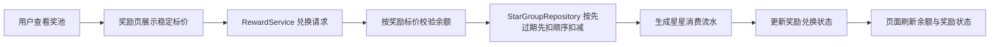

# 里程碑-21N：奖池余额心智简化与奖励兑换时效治理 详细设计文档

> **设计状态**：✅ 已完成
> **创建日期**：2026-04-18
> **设计者**：GPT5 Codex
> **审核者**：项目维护者
> **预计工期**：4-5 天
> **完成日期**：2026-04-18

---

## 📋 目录

- [需求分析](#需求分析)
- [现状问题复盘](#现状问题复盘)
- [技术方案](#技术方案)
- [代码结构](#代码结构)
- [实施步骤](#实施步骤)
- [测试方案](#测试方案)
- [风险评估](#风险评估)
- [替代方案](#替代方案)

---

## 完成结论

`M21N` 已按本设计完成落地，正式收口为以下事实：

- 奖池页回到“普通余额 + 全局到期提醒”心智，奖励卡片不再展示动态抵扣/保护定价
- 兑换确认统一展示“兑换需要 / 当前余额 / 兑换后剩余”
- 前后端正式兑换链路统一按奖励标价扣减余额
- 取消兑换按原消费桶退款，并增加到期后不可取消与本地退款失败补偿保护
- 多孩子场景下，奖励确认回退余额以实际目标孩子为准
- 奖励页列表不再为每个奖励重复读取同一孩子余额

### 最终验证结果

- 前端质量闸门通过：`npm run test:quality`
- 后端单元测试通过：`npm --prefix backend run test:unit`
- 奖励主链路定向测试通过：
  - `npx jest test/services/reward-service.test.js test/pages/rewards.behavior.test.js test/utils/reward-display.test.js test/pages/rewards.page-contract.test.js --runInBand`
  - `npx jest test/pages/rewards.behavior.test.js test/pages/rewards.page-contract.test.js test/pages/rewards.modules.test.js test/utils/reward-display.test.js --runInBand`

---

## 需求分析

### 功能描述

`M21K` 完成后，奖池已经具备家庭奖池、履约模式和快过期星星动态抵扣能力，但最新一轮产品讨论暴露出新的心智问题：

1. 页面顶部告诉用户“当前星星 19、明天到期 16”，这符合直觉。
2. 但奖励卡片又写“本次 0 颗”“已抵扣 10 颗快过期星星”，用户会自然推断：
   - 这 10 颗是不是已经扣掉了？
   - 我的真实余额到底是 19，还是 19 再加上所有“已抵扣”的总和？
   - 每个奖励都写“已抵扣”，是不是同一批星星被重复计算了？
3. 用户原本只关心“余额够不够换”，却被迫理解“保护 / 动态抵扣 / 实际消耗”这一整套系统内部结算机制。

这说明当前奖池虽然逻辑可运行，但产品表达仍然过度暴露了内部实现，破坏了“星星余额像零钱一样可理解”的基础心智。

本轮要解决的不是单个文案问题，而是把奖池重构为一套更稳定的产品契约：

- 余额就是余额
- 快到期是提醒，不是单个奖品的特殊价格系统
- 兑换是交易行为，必须在星星有效时完成
- 已兑换后的后续发放，可以晚于兑换发生

### 核心产品判断

#### 判断1：奖励兑换应回到“普通余额心智”

对孩子和家长来说，最自然的理解是：

- 我现在有多少星星
- 这个奖励标价多少星星
- 我现在够不够换
- 换完还剩多少

“快过期星星优先被消耗”属于系统结算顺序，不应成为奖励卡片主信息。

#### 判断2：任务补打卡和奖励补兑换不是同一类事情

任务补打卡本质上是对历史事实的补录，允许在规则窗口内修正；奖励兑换本质上是一次交易确认，不能在星星已过期后再回溯锁定旧价值。

因此本轮正式区分：

- 任务：允许按既有规则补打卡
- 奖励兑换：不支持到期后补兑
- 奖励发放：若奖励已在到期前完成兑换，则后续仍可发放

#### 判断3：必须同步修改前后端结算规则，不能只改展示

如果前台只隐藏“已抵扣 10 颗”，但后台仍按动态抵扣把 `actualCost` 算成 `0`，那么用户会看到：

- 奖励写着 `10颗`
- 兑换后余额却没有减少 10 颗

这会比现在更难理解。因此本轮不是展示层遮盖，而是前后端一起回到“按标价消费余额”的正式规则。

#### 判断4：取消兑换也必须服从时效规则，不能把临期星星洗成永久余额

如果 M21N 只把兑换改成按标价消费，但取消兑换仍像当前实现一样把星星退回永久分组，那么用户仍然可以：

1. 在星星过期前先兑换奖励
2. 再取消兑换
3. 把原本临期的星星洗成永久有效余额

这会直接破坏“到期前兑换锁定价值、到期后不补兑”的产品边界。

因此本轮必须同时收口取消兑换：

- 已过期的已消费时效星星，不允许通过取消兑换拿回来
- 未过期时允许取消的部分，也必须按原有效期退回，而不是统一退回永久星星

### 业务价值

- [x] 用户价值：让孩子和家长只需理解“余额 / 标价 / 到期提醒”，降低奖池理解负担
- [x] 产品价值：消除奖池里“已抵扣 / 本次 0 颗 / 保护奖励”等高噪音信息，提升高级感和可信度
- [x] 技术价值：删除奖励域对“动态保护定价”的跨层依赖，收敛前后端结算和展示口径

### 功能范围

**包含**：

- [x] 重构奖池页为“普通余额 + 全局到期提醒”心智
- [x] 奖励卡片改为只展示稳定标价，不再展示动态抵扣结果
- [x] 兑换确认改为围绕“标价 / 当前余额 / 兑换后剩余”组织信息
- [x] 后端兑换结算回到按奖励标价扣减星星余额
- [x] 系统内部继续优先消耗临近到期星星，但不再作为页面主语义暴露
- [x] 明确“到期后不可补兑、已兑换可后续发放”的正式边界
- [x] 明确取消兑换的时效校验与退款归桶规则，避免时效星星被洗成永久余额
- [x] 收口前后端字段、消息文案、自动化测试与兼容策略

**不包含**：

- [x] 不修改星星生成规则和星星自然到期周期
- [x] 不新增“钱包明细页”或复杂星星资产解释中心
- [x] 不把奖励兑换改造成审批流、预约流或占位锁价机制
- [x] 不改变任务补打卡窗口和表现项记录规则

### 优先级

- **优先级**：P1
- **理由**：问题位于高频奖池主链路，当前实现虽可用，但已经直接影响用户理解和产品品质

---

## 现状问题复盘

### 当前实现事实

基于当前代码，奖池“动态抵扣”不是单纯文案，而是一条真实的前后端链路：

1. 前端预览：
   - `services/reward-service/reward-exchange.js` 中的 `previewRewardExchangeCost()` 会读取可用星星快照里的 `expiringInfo.points`
   - `utils/reward-display.js` 会把它组装成 `expiringStarDeduction / actualCost`
   - `pages/rewards/modules/rewards-sync.js` 和 `pages/rewards/modules/rewards-exchange-flow.js` 再把这组信息渲染成 `本次X颗 / 已抵扣Y颗快过期星星`
2. 后端权威：
   - `backend/services/rewardService.js` 里的 `resolveEffectiveRewardProtection()` 和 `_buildEffectiveProtectionMapFromInputs()` 会基于家庭奖池和“48 小时内将到期”的星星重新计算每个奖励的有效保护额度
   - 实际兑换时返回 `consumedPoints` 与 `expiringStarDeduction`
3. 保护窗口事实：
   - `backend/services/starService.js` 的 `_isProtectionWindowGroup()` 当前定义的是“到期前 48 小时内”的保护窗口
   - 不是“到期后还能继续保护一段时间”

也就是说，当前产品并非“普通余额 + 提醒”，而是“余额 + 奖励级动态价格系统”。

### 现有方案的主要问题

#### 问题1：用户被迫理解系统内部结算机制

用户只想知道“够不够换”，但页面却要求他理解：

- 什么是快过期抵扣
- 为什么同一个奖励显示 `本次0颗`
- 为什么不是直接写 `10颗`
- 为什么顶部余额和卡片价格不是同一种口径

这会直接破坏奖励页的第一性理解。

#### 问题2：奖励卡片在表达“未来可能发生的抵扣”，却容易被理解成“已经发生的抵扣”

`已抵扣 10 颗快过期星星` 这类表述从汉语直觉上更像是既成事实，而不是“如果你现在兑换，系统会优先用临期星星支付”。

这会引发两个误读：

- 用户以为余额已经被扣减
- 用户以为同一批快过期星星同时抵扣了多个奖励

#### 问题3：当前规则不支持用户预期中的“过期后补救”

用户直觉上容易把“保护”理解为：

- 周日到期没来得及操作
- 周一还能用这批星星帮我撑住奖励一段时间

但实际代码不是这样。当前保护只发生在到期前 48 小时，过期后星星仍会正常清零，奖励不会被“保价保留”。

如果产品继续保留“保护 / 抵扣”语义，用户会天然期待一种实际并不存在的补救能力。

#### 问题4：只改展示不改结算会制造新的账感冲突

如果把卡片改回 `10颗`，但兑换仍可能只扣 `0颗` 或 `3颗`，那么：

- 价格和余额变化对不上
- 星星流水和兑换提示对不上
- 消息中心和奖池页会出现二次冲突

因此展示和结算必须同步调整。

---

## 技术方案

### 方案概述

本轮采用“**普通余额心智 + 系统内部先扣临期星星 + 兑换时效边界明确化**”方案。

核心原则：

1. 奖池对用户只表达一种价格：奖励标价
2. 奖池对用户只表达一种资产口径：当前可用余额
3. 快到期星星只在全局摘要/提醒层表达，不进入单个奖励卡片定价
4. 兑换成功后，余额按标价减少，保证账感闭环
5. 系统内部仍优先消耗临近到期星星，但不再把这种顺序透传成主视图信息
6. 奖励兑换不支持过期后补兑；奖励发放可以晚于已完成的兑换

### 正式产品契约

#### 决策1：奖池顶部保留“余额 + 到期提醒”，不再承担“保护定价解释”

顶部摘要保留两类信息：

- 当前可用星星：`19`
- 快到期提醒：`16 颗将于周日结束后清零`

顶部不再出现下列语义：

- 奖励已被保护
- 星星会自动帮你保价一段时间
- 某些奖励已经被临期星星预占

如果需要帮助理解，只保留极轻的一句辅助说明，例如：

- `兑换时会优先使用快到期的星星`

该说明不进入奖励卡片主信息，不参与价格展示。

#### 决策2：奖励卡片只展示稳定标价

奖励卡片正式口径：

- 主价格只显示 `10颗`
- 可兑换态按“当前余额 >= 标价”判断
- 不再显示：
  - `本次 0 颗`
  - `已抵扣 10 颗快过期星星`
  - `免费兑换`
  - `保护奖励`

卡片的重点重新回到：

- 奖励名
- 标价
- 是否可兑换
- 状态（可兑换 / 已兑换 / 待发放 / 已发放）

#### 决策3：兑换确认只解释交易结果，不解释内部扣减算法

兑换确认弹窗改为以下信息层级：

1. 奖励名称
2. 标价：`10颗`
3. 当前余额：`19颗`
4. 兑换后剩余：`9颗`

如果当前存在快到期星星，可选地在确认底部补一句低权重说明：

- `系统会优先使用快到期的星星`

但这句说明不是必填主信息，且不出现具体抵扣数字，避免再次把系统实现抬回主视图。

#### 决策4：兑换成功后的真实扣减必须等于奖励标价

新的正式结算规则：

- 兑换时按奖励标价扣减余额
- 星星分组层继续沿用“先过期先扣”的扣减顺序
- 因此：
  - 用户看到的奖励价格
  - 兑换后的余额变化
  - 星星流水中的消耗数
  - 消息中的兑换成本
  必须全部一致

这意味着：

- `actualCost` 不再作为“动态折后价”存在于主链路
- 若保留字段，只能作为兼容字段，且值应与标价一致
- `expiringStarDeduction` 不再作为正式前后端展示 contract

#### 决策5：过期后不可补兑，已兑换可延后发放

正式时效边界如下：

1. 星星在过期前属于可用余额，可以参与兑换
2. 一旦过期并完成权威结算，余额减少，不支持回溯补兑
3. 如果奖励已在过期前完成兑换：
   - `instant` 奖励：兑换即完成
   - `manual` 奖励：后续仍可由家长发放，不受星星是否过期影响

统一用户故事：

- “想保住价值，就在到期前兑换”
- “兑换之后的发放，可以后续再处理”

#### 决策6：取消兑换必须校验“本次消费的星星是否已经过期”

正式规则：

1. 奖励未发放，才有资格进入“可取消兑换”判定
2. 系统根据该次兑换的消费明细 `deductionBreakdown` 判断本次实际消耗了哪些星星桶
3. 若其中任一非永久星星桶已经跨过对应到期点，则拒绝取消兑换
4. 若本次仅消耗永久星星，且奖励尚未发放，则仍可取消兑换

用户侧只需要理解一条简化规则：

- `过期后不允许取消兑换`

系统内部更精确的实现语义是：

- 只要该笔兑换中已消费的时效星星已经过期，这笔兑换就不能再取消

#### 决策7：允许取消时，退款必须回原有效期桶，不能统一退永久星星

新的正式退款规则：

1. 取消兑换成功后，按该次兑换记录里的 `deductionBreakdown` 逐桶退款
2. 永久星星退回永久桶
3. 周有效/月有效/季有效星星退回原 `expiryType + expiryDate` 对应的桶
4. 不再出现“取消兑换后一律退永久星星”的路径

这样可确保：

- 兑换前后账务闭环
- 取消兑换不会制造额外价值
- 临期星星不会因为一进一出变成永久星星

#### 决策8：任务补打卡规则不映射到奖励补兑

本轮明确拒绝“像任务补打卡一样补兑换”的心智迁移，原因如下：

1. 任务补打卡是对历史事实的修正
2. 奖励兑换是当下发生的消费交易
3. 如果允许过期后补兑，本质上等于给已失效资产补建一笔新价值，账务边界会变得不清晰

因此产品只提供：

- 到期前提醒
- 到期前兑换锁定价值
- 到期后不补兑

不提供：

- 到期后补锁价
- 到期后“保护期补兑换”

### 页面与文案调整

#### 奖励页

1. 顶部摘要：
   - 保留当前余额
   - 保留快到期提醒
   - 弱化解释性文字
2. 奖励卡片：
   - 仅显示稳定价格
   - 移除所有“已抵扣 / 本次消耗 / 免费”文案
3. 奖励详情/确认：
   - 改为“标价 / 当前余额 / 兑换后剩余”

#### 视觉层级要求

为保证奖池页继续保持极简、易懂和高级感，本轮视觉基线冻结为：

1. 余额数字始终是奖池页最高层级信息
2. 快到期提醒降为辅助层级，不与余额抢主视觉
3. 奖励卡片价格只保留一行主价格，不再拆出第二行“抵扣说明”
4. 状态标签优先表达“可兑换 / 待发放 / 已发放”，不再混入成本解释
5. 确认弹窗信息控制在 3-4 行核心信息内，避免再次变成规则说明面板

#### 我的兑换 / 奖励管理

1. 兑换记录显示的消耗星星数应与奖励标价一致
2. 不再向用户展示“已抵扣 X 颗快过期星星”
3. `manual` 奖励继续保留 `待发放 / 已发放` 语义，不受本轮影响
4. 奖励管理页本期不新增新的“取消兑换”显式入口，继续保持当前信息架构稳定
5. 若现有调用方或后续恢复入口触发取消兑换，统一返回 `已过可取消时点`，不再出现模糊失败文案

#### 消息中心

奖励兑换消息改为只表达：

- 谁兑换了什么奖励
- 消耗了多少星星
- 是否待发放 / 已发放

不再表达：

- 本次抵扣了多少快过期星星
- 因为保护所以 0 颗兑换

### 领域与服务层设计

#### 前端

1. `utils/reward-display.js`
   - `normalizeRewardExchangeCost()` 收口为稳定标价模型
   - 删除面向主链路的 `expiringStarDeduction / hasExpiringDeduction` 展示组装
2. `services/reward-service/reward-exchange.js`
   - `previewRewardExchangeCost()` 不再根据快到期快照生成折后价
   - 本地兑换流水、提示文案、事件载荷改为基于奖励标价
3. `pages/rewards/modules/rewards-sync.js`
   - 奖励展示模型不再依赖动态抵扣预览
4. `pages/rewards/modules/rewards-exchange-flow.js`
   - 兑换确认内容改为余额心智版本
5. `services/message-service.js` / `services/message-service/message-domain.js`
   - 去掉面向用户的动态抵扣表述
6. `packageMessage/pages/star-records/*`
   - 星星记录页不再暴露 `protected_exchange / 0 颗兑换` 这类旧语义
7. `services/star-service/star-records.js`
   - 收口奖励兑换/退款流水的识别与标题语义
8. `repositories/star-group-repository.js`
   - 本地模式下返回正式 `deductionBreakdown` 结构，并支持按原桶退款

#### 后端

1. `backend/services/rewardService.js`
   - 删除或废弃 `resolveEffectiveRewardProtection()`、`_buildEffectiveProtectionMap()`、`_decorateRewardsWithEffectiveProtection()` 在正式读写链路中的消费
   - 兑换成本回到奖励标价
   - 取消兑换前新增“已消费时效星星是否已过期”的权威校验
2. `backend/services/starService.js`
   - 保留快到期汇总和到期结算能力
   - 不再为奖励域提供“保护定价”语义支撑
   - 升级 `deductionBreakdown` 正式结构，至少包含 `expiryType + expiryDate`
   - 复用 `deductionBreakdown` 能力，把退款准确回补到原有效期桶
3. `backend/models/Reward.js`
   - `protectedByExpiry / partialProtection` 转为历史兼容字段
   - 新写路径和展示路径不再依赖它们

### 数据与兼容策略

#### 兼容原则

1. 不做一次性历史数据重写
2. 先停用活跃读写路径中的保护字段
3. 数据库遗留列可短期保留，避免发布期额外迁移风险
4. 未来若确认无活跃依赖，再单独发起 schema 清理里程碑

#### 表结构策略

本里程碑默认不新增表、不新增列，也不要求先做数据库迁移。

原因：

1. 当前问题的根因在于产品契约和结算规则，而不是数据结构表达能力不足
2. 现有星星分组与奖励状态模型已足够支撑“普通余额 + 先过期先扣”
3. 兑换记录已经具备 `data` 扩展位，可承载升级后的 `deductionBreakdown` 与退款校验所需元数据
4. 先删除动态定价主链路，再决定是否在后续里程碑清理历史字段，发布风险更低

#### 发布策略

本里程碑以“发布后全端一致”为前提，不设计灰度方案，也不设计新旧客户端混跑兼容策略。

正式要求：

1. 前端与后端按同一产品契约一起发布
2. 发布后的正式链路只认 M21N 新规则
3. 本文档中的“兼容”仅指历史数据兼容，不指新旧版本行为并存

#### 兼容细则

1. 前端不再消费 `expiringStarDeduction / partialProtection / protectedByExpiry` 作为主视图价格信息
2. 后端接口可短期继续返回兼容字段，但其值不再驱动页面展示
3. 新生成的星星流水、奖励消息、兑换响应应以标价消费为准
4. 新生成的兑换流水必须写入正式版 `deductionBreakdown`
5. 对缺少 `deductionBreakdown` 的历史兑换记录，取消兑换采取保守策略：
   - 若无法可靠判断原消费桶及其时效状态，则默认不允许取消兑换
   - 不为了兼容历史脏口径而继续退回永久星星
6. 升级后若本地仍残留旧版待同步奖励操作或旧版兑换流水：
   - 统一按 M21N 新规则处理
   - 能补齐正式 `deductionBreakdown` 的补齐后继续处理
   - 无法补齐的按“不可取消兑换”保守策略处理

### 架构图



### 数据模型

```typescript
interface RewardExchangeDisplayModel {
  originalPoints: number;
  displayCost: number;
  currentBalance: number;
  remainingBalanceAfterExchange: number;
}

interface RewardDeductionBucket {
  groupId: string;
  expiryType: 'week' | 'month' | 'quarter' | 'permanent';
  expiryDate: string | null; // permanent 为 null，其余必须为规范化日期
  points: number;
}

interface RewardExchangeAuthorityResult {
  rewardId: string;
  consumedPoints: number; // 与奖励标价一致
  fulfillmentMode: 'instant' | 'manual';
  exchangeUserId: string;
  deductionBreakdown: RewardDeductionBucket[];
}
```

### 接口设计

#### 前端内部接口

| 方法 | 说明 | 参数 | 返回值 |
|------|------|------|--------|
| `previewRewardExchangeCost(rewardId, userId)` | 获取稳定价格与余额确认信息 | `rewardId, userId` | `{ originalPoints, actualCost, currentBalance, remainingBalance }` |
| `buildRewardDisplayModel(reward, context)` | 构建奖池展示模型 | `reward, context` | `{ costPrimaryText, poolStatusLabel, poolActionLabel }` |

#### 后端接口口径调整

| 方法/接口 | 调整 | 说明 |
|-----------|------|------|
| 奖励列表查询 | 移除保护定价依赖 | 不再按奖励计算动态折后价 |
| 奖励兑换 | 按标价消费 | `consumedPoints` 与奖励标价一致 |
| 奖励取消兑换 | 按消费桶校验与退款 | 已过期消费桶不可取消；允许取消时按原桶退款 |
| 星星快到期摘要 | 保留 | 仅用于顶部提醒与消息，不用于单奖励定价 |

---

## 代码结构

### 文件变更清单

**修改文件**：

- `pages/rewards/rewards.wxml` - 收口奖池卡片价格与确认区信息结构
- `pages/rewards/rewards.wxss` - 价格层级、提醒层级与间距调整
- `pages/rewards/modules/rewards-sync.js` - 移除动态抵扣展示依赖
- `pages/rewards/modules/rewards-exchange-flow.js` - 重写兑换确认文案与剩余余额展示
- `utils/reward-display.js` - 重建普通余额心智的展示模型
- `services/reward-service/reward-exchange.js` - 收口兑换预览、提示文案与事件载荷
- `packageMessage/pages/star-records/star-records.js` - 收口奖励兑换/退款记录展示语义
- `packageMessage/pages/star-records/star-records.wxml` - 视图层不再暴露旧保护语义
- `repositories/star-group-repository.js` - 本地模式输出正式 `deductionBreakdown` 并支持按原桶退款
- `services/message-service.js` - 收口奖励兑换消息文案
- `services/message-service/message-domain.js` - 收口奖励消息成本语义
- `services/star-service/star-records.js` - 收口奖励兑换/退款流水语义
- `backend/services/rewardService.js` - 删除奖励保护定价主链路
- `backend/services/rewardService.js` - 收口取消兑换时效校验与退款策略
- `backend/services/starService.js` - 升级 `deductionBreakdown` 数据结构并支持按原桶退款
- `backend/models/Reward.js` - 将旧保护字段降级为兼容字段

**测试文件**：

- `test/pages/rewards.behavior.test.js`
- `test/pages/rewards.modules.test.js`
- `test/pages/star-records*.test.js`
- `test/services/reward-service.test.js`
- `test/services/message-service.test.js`
- `test/services/star-service.test.js`
- `backend/test/unit/rewardService.test.js`
- 相关真实集成测试与回归测试文件

### 核心代码结构

```javascript
async function previewRewardExchangeCost(service, rewardOrId, userId) {
  const reward = await resolveReward(service, rewardOrId);
  const currentBalance = await service._getUserAvailableStars(userId, {
    refreshBeforeRead: true
  });
  const price = Number(reward?.points || 0);

  return {
    originalPoints: price,
    actualCost: price,
    currentBalance,
    remainingBalance: Math.max(0, currentBalance - price)
  };
}

async function exchangeReward(service, rewardId, userId) {
  const reward = await service.rewardRepository.getById(rewardId);
  const price = Number(reward.points || 0);
  const stars = await service._getUserAvailableStars(userId, { refreshBeforeRead: true });

  if (stars < price) {
    return { success: false, message: '星星不足' };
  }

  const deductionBreakdown = await service.starGroupRepository.deductStars(price, userId);
  await saveExchangeRecord({
    reward,
    userId,
    consumedPoints: price,
    deductionBreakdown
  });
  // 继续走奖励状态更新与消息链路
}

async function cancelRewardExchange(service, rewardId, userId) {
  const reward = await service.rewardRepository.getById(rewardId);
  const exchangeRecord = await getLatestRewardExchangeRecord(service, reward, userId);
  const deductionBreakdown = exchangeRecord?.data?.deductionBreakdown || [];

  if (hasExpiredConsumedBuckets(deductionBreakdown, Date.now())) {
    return { success: false, message: '已过可取消时点' };
  }

  await refundToOriginalBuckets(service, userId, deductionBreakdown, reward.name);
  // 再更新奖励状态与消息链路
}
```

### 关键函数

**函数1**：`previewRewardExchangeCost`
- **输入**：`rewardId | reward`, `userId`
- **输出**：稳定价格与余额确认信息
- **职责**：为奖池确认弹窗提供普通余额心智所需的数据
- **依赖**：`rewardRepository`、`_getUserAvailableStars`

**函数2**：`exchangeReward`
- **输入**：`rewardId`, `userId`
- **输出**：正式兑换结果
- **职责**：按奖励标价完成余额校验、星星扣减、奖励状态更新
- **依赖**：`rewardRepository`、`starGroupRepository`、正式 `deductionBreakdown`、消息事件桥

**函数3**：`buildRewardDisplayModel`
- **输入**：`reward`, `context`
- **输出**：卡片展示模型
- **职责**：保证奖励页只展示稳定价格和状态，不暴露内部扣减细节
- **依赖**：`reward-status`

**函数4**：`cancelRewardExchange`
- **输入**：`rewardId`, `userId`
- **输出**：取消兑换结果
- **职责**：校验该笔兑换消费的时效星星是否已过期，并在允许时按原桶退款
- **依赖**：兑换流水 `deductionBreakdown`、星星分组服务/仓储

---

## 实施步骤

### 第1步：冻结产品契约与页面信息层级（预计 0.5 天）

- [x] **任务**：确认奖池顶部、卡片、确认弹窗和消息文案的正式口径
- [x] **验证**：设计评审通过，明确哪些信息保留、哪些信息删除
- [x] **依赖**：无

**实施要点**：
1. 明确“余额 / 标价 / 剩余余额”为主信息
2. 明确“快到期提醒”为全局辅助信息
3. 明确“已抵扣 / 本次 0 颗 / 保护奖励”全部退出主链路

---

### 第2步：后端兑换权威逻辑收口（预计 1.5 天）

- [x] **任务**：移除奖励保护定价主链路，恢复按标价消费
- [x] **验证**：奖励兑换后 `consumedPoints === reward.points`
- [x] **依赖**：第1步

**实施要点**：
1. 停止奖励查询和兑换流程对 effective protection map 的正式依赖
2. 把后端 `deductionBreakdown` 升级为含 `expiryDate` 的正式结构
3. 保留星星快到期摘要，但不再影响奖励价格
4. 取消兑换改为“按消费桶校验 + 按原桶退款”
5. 保持 `manual / instant` 履约语义不变

---

### 第3步：前端奖励展示与本地模式收口（预计 1 天）

- [x] **任务**：奖池页、兑换弹窗、消息中心回到普通余额心智
- [x] **验证**：页面不再出现动态抵扣和保护文案
- [x] **依赖**：第2步

**实施要点**：
1. 卡片只展示稳定标价
2. 确认弹窗展示“当前余额 / 兑换后剩余”
3. 本地模式下 `StarGroupRepository` 也必须产出正式 `deductionBreakdown`
4. 星星记录页同步删除旧保护语义
5. 页面视觉继续保持极简，不新增解释负担

---

### 第4步：兼容清理与自动化测试补齐（预计 1-2 天）

- [x] **任务**：清理旧字段依赖，补齐前后端回归测试
- [x] **验证**：相关单测、集成测试、质量闸门通过
- [x] **依赖**：第2步、第3步

**实施要点**：
1. 清理前端对 `expiringStarDeduction` 的主动消费
2. 清理后端主链路对 `partialProtection / protectedByExpiry` 的依赖
3. 清理本地模式“退永久星星”的旧路径
4. 补齐取消兑换与退款归桶测试
5. 保留必要兼容层，但标注 deprecated

---

## 测试方案

### 单元测试

| 测试项 | 测试方法 | 预期结果 |
|--------|---------|---------|
| 奖励价格展示 | 构建展示模型 | 奖励卡片只显示稳定标价 |
| 兑换确认展示 | 构建确认文案 | 只显示标价、当前余额、兑换后剩余 |
| 兑换扣减逻辑 | 服务层测试 | `consumedPoints` 与奖励标价一致 |
| 临期优先扣减顺序 | 星星分组仓储测试 | 仍优先扣减最早到期分组 |
| 消息文案 | 消息域测试 | 不再出现“已抵扣 / 0颗兑换” |
| 取消兑换时效校验 | 服务层测试 | 已过期消费桶拒绝取消兑换 |
| 取消退款归桶 | 服务层/后端测试 | 退款回原有效期桶，不退永久 |
| 星星记录页语义 | 页面/服务测试 | 不再出现 `protected_exchange` 主视图语义 |
| 本地模式 bucket 明细 | 仓储/服务测试 | 本地 `deductionBreakdown` 与后端正式结构一致 |

### 集成测试

- [x] 场景1：余额足够，兑换成功后余额按标价减少
- [x] 场景2：存在快到期星星，兑换后优先消耗临期分组，但用户只看到正常余额变化
- [x] 场景3：周日到期前可正常兑换，周一到期后不可补兑
- [x] 场景4：`manual` 奖励在到期前已兑换，周一仍可正常发放
- [x] 场景5：多孩子家庭下不同孩子兑换记录与余额互不串扰
- [x] 场景6：周日到期前取消兑换，退款回原时效桶
- [x] 场景7：周日到期前兑换，周一星星过期后不可取消兑换
- [x] 场景8：升级后遇到旧版本地待同步兑换记录，按 M21N 保守规则处理

### 手动测试

1. **奖励页主链路**：
   - [x] 顶部仅展示余额与到期提醒
   - [x] 奖励卡片不再出现“已抵扣 / 本次 0 颗”
   - [x] 兑换确认能看懂“兑换后剩余”
2. **时效边界**：
   - [x] 到期前兑换成功
   - [x] 到期后无法补兑
   - [x] 已兑换待发放奖励仍可继续发放
   - [x] 到期后不可取消兑换
   - [x] 到期前取消兑换不会把临期星星变成永久星星
3. **回归测试**：
   - [x] 奖励管理页状态不回退
   - [x] 我的兑换页记录口径正确
   - [x] 星星记录与消息中心口径一致

### 测试覆盖率目标

- 最低要求：85%
- 推荐目标：90%

---

## 风险评估

### 技术风险

| 风险项 | 影响 | 概率 | 应对措施 |
|--------|------|------|---------|
| 后端仍残留保护定价分支 | 高 | 中 | 用定向搜索与回归测试确保主链路无残留消费 |
| 前后端价格口径短期不一致 | 高 | 中 | 先改后端权威，再改前端展示；定向验证 `consumedPoints` |
| 历史兼容字段被误删 | 中 | 中 | 先停用活跃依赖，不在本期直接删库字段 |
| 消息/记录旧文案残留 | 中 | 中 | 补齐消息域测试与关键词搜索清理 |
| 取消兑换仍可洗白临期星星 | 高 | 中 | 取消前校验过期状态，允许取消时按原桶退款 |

### 业务风险

| 风险项 | 影响 | 概率 | 应对措施 |
|--------|------|------|---------|
| 用户不再看到“临期抵扣”后误以为少了保护 | 中 | 低 | 顶部保留快到期提醒，必要时用一句轻提示说明会优先消耗临期星星 |
| 到期后不可补兑引发争议 | 中 | 中 | 在设计文档和后续提示文案中明确“兑换前锁定价值，兑换后可晚发放” |
| 与任务补打卡心智混淆 | 中 | 中 | 在产品说明和评审中明确两者一个是事实修正，一个是交易行为 |

---

## 替代方案

### 方案A：保留动态抵扣，只优化文案

**做法**：

- 保留 `actualCost / expiringStarDeduction`
- 只把“已抵扣”改成更温和的描述

**不选原因**：

1. 本质仍是双重价格体系
2. 仍然要求用户理解系统内部结算逻辑
3. 页面、消息、余额变化仍然容易出现账感冲突

### 方案B：保留保护定价，但只在确认弹窗展示

**做法**：

- 卡片只显示标价
- 弹窗再解释“本次已抵扣多少”

**不选原因**：

1. 用户在确认时仍要理解复杂机制
2. 一旦真实扣减不是标价，余额变化仍会让人困惑
3. 只是把复杂度后移，没有真正删除复杂度

### 方案C：允许过期后短期补兑

**做法**：

- 给快过期或刚过期星星增加短期锁价窗口

**不选原因**：

1. 会让奖励兑换和任务补录的边界混在一起
2. 需要额外的锁价、追溯、提示和对账逻辑
3. 会把奖池从“简单消费”重新带回“复杂资产规则”

### 最终选择

选择当前方案，是因为它同时满足三件事：

1. 对用户最容易理解：余额就是余额，价格就是价格
2. 对产品最稳定：到期提醒、兑换、取消、发放四条链路职责清晰
3. 对工程最可收口：可以复用现有星星分组的“先过期先扣”能力和 `deductionBreakdown` 能力，只删除奖励级动态定价这层多余复杂度
