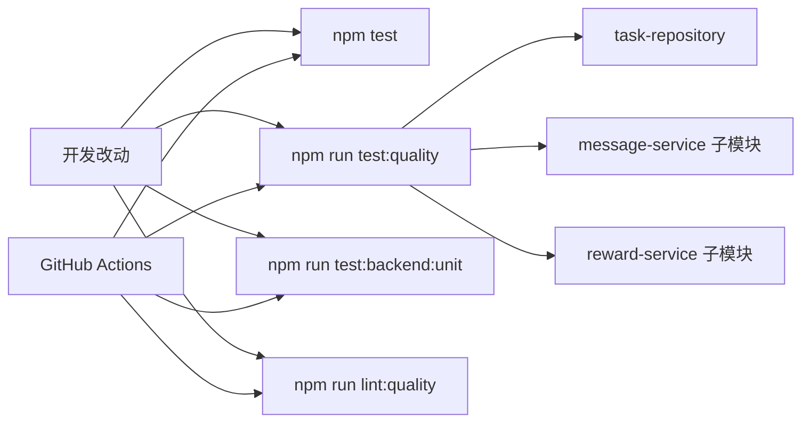

# 里程碑-21O：核心测试覆盖与质量闸门补强 详细设计文档

> **设计状态**：✅ 已完成
> **创建日期**：2026-04-19
> **设计者**：GPT5 Codex
> **审核者**：项目维护者
> **预计工期**：3-4天
> **完成日期**：2026-04-19

---

## 📋 目录

- [需求分析](#需求分析)
- [现状问题复盘](#现状问题复盘)
- [技术方案](#技术方案)
- [代码结构](#代码结构)
- [实施步骤](#实施步骤)
- [测试方案](#测试方案)
- [风险评估](#风险评估)
- [替代方案](#替代方案)
- [审核要点自检](#审核要点自检)
- [审核记录](#审核记录)

---

## 完成结论

`M21O` 已按本设计完成落地，正式收口为以下事实：

- `task-repository`、消息子模块、奖励子模块已进入正式前端质量闸门
- 目标文件弱覆盖分支已补齐，并全部满足单文件门槛
- 根级已补上仅覆盖本期范围的最小静态检查基线
- GitHub Actions 已纳入后端依赖安装、后端单元测试与 `lint:quality`
- `backend/package-lock.json` 已纳入版本控制，修复了 `npm --prefix backend ci` 的 CI 失败
- GitHub Actions 已从 `actions/checkout@v4`、`actions/setup-node@v4` 升级到 `v5`，消除 Node 20 运行时弃用告警

### 最终验证结果

- 前端主测试树通过：`npm test -- --runInBand`
- 前端质量闸门通过：`npm run test:quality`
- 后端单元测试通过：`npm run test:backend:unit`
- 最小静态检查通过：`npm run lint:quality`
- 合并后 `develop` 分支 GitHub Actions `test` workflow 通过：run `24619274374`

---

## 需求分析

### 功能描述

在 `M21N` 完成后，当前主线的用户可见能力已经基本稳定，下一阶段最值得投入的不是继续做新功能，而是先补齐几处已经确认的质量短板。基于当前代码结构和已有测试入口复核，项目现在的主要问题不是“完全没有测试”，而是“有大量测试，但关键弱点还没有进入正式门禁”。

具体事实如下：

1. 根级 [`test:quality`](/Users/wangdafei/code/study_task_wechat/package.json) 当前只覆盖 `app.js`、`storage-adapter`、首页、奖励页、消息页和 `task-service`，没有覆盖 [`repositories/task-repository.js`](/Users/wangdafei/code/study_task_wechat/repositories/task-repository.js) 与消息/奖励子模块。
2. 目标文件已经具备基础测试入口，但尚未形成正式门禁：
   - [`test/repositories/task-repository.test.js`](/Users/wangdafei/code/study_task_wechat/test/repositories/task-repository.test.js)
   - [`test/services/message-service.modules.test.js`](/Users/wangdafei/code/study_task_wechat/test/services/message-service.modules.test.js)
   - [`test/services/message-service.test.js`](/Users/wangdafei/code/study_task_wechat/test/services/message-service.test.js)
   - [`test/services/reward-service.test.js`](/Users/wangdafei/code/study_task_wechat/test/services/reward-service.test.js)
3. GitHub Actions 当前只跑 `npm test` 与 `npm run test:quality`，没有执行后端单元测试：
   - [test.yml](/Users/wangdafei/code/study_task_wechat/.github/workflows/test.yml)
   - 当前 workflow 只有根目录 `npm ci`，不会安装 `backend/package.json` 的依赖；如果直接追加 `npm run test:backend:unit`，CI 会因为缺少后端依赖而失败
4. 根级 `package.json` 当前没有 `lint` 脚本，仓库根目录也没有现成 ESLint 配置；如果直接上“全仓 lint 治理”，成本和扰动都会显著偏大。
5. 本轮用现有测试入口做了一次目标文件的精确覆盖率抽样，当前分支覆盖率基线如下：

| 文件 | 当前 Branches | 本期目标 | 差距 |
|------|---------------|----------|------|
| `repositories/task-repository.js` | `36.21%` | `70%` | `+33.79%` |
| `services/message-service/message-provisional.js` | `25.73%` | `70%` | `+44.27%` |
| `services/message-service/message-domain.js` | `58.47%` | `70%` | `+11.53%` |
| `services/message-service/message-handlers.js` | `100%` | `70%` | `已达标` |
| `services/reward-service/reward-query.js` | `44.07%` | `70%` | `+25.93%` |
| `services/reward-service/reward-queue.js` | `30.25%` | `70%` | `+39.75%` |

这组数据说明：`message-provisional`、`reward-queue`、`task-repository` 是本期真正的工期主风险来源，原先按 `2-3天` 估算偏乐观，需要上调。

因此，`M21O` 的目标是用最小范围、最高收益的方式补强正式质量门禁：

- 把已经确认的高价值弱点纳入前端质量闸门
- 为这些目标文件补齐缺口测试
- 把后端单元测试纳入 CI
- 补一个“只覆盖本期范围”的最小静态检查基线

这不是大规模重构，也不是风格统一工程，而是一轮明确聚焦“正确性防线”的工程治理。

### 业务价值

- [x] 用户价值：降低后续迭代把回归缺陷带到真实用户设备上的概率。
- [x] 技术价值：把现有“有测试但未入闸”的弱点纳入正式门禁，使质量结果更可信。
- [x] 维护价值：先补正确性防线，再推进后续复杂度治理，避免在薄弱基线上继续重构。

### 功能范围

**包含**：

- [x] 将 `task-repository`、消息子模块、奖励子模块纳入正式前端质量闸门
- [x] 为上述目标补齐测试缺口，并保持对外业务语义不变
- [x] 将 `npm run test:backend:unit` 纳入 GitHub Actions
- [x] 引入仅覆盖本期治理范围的最小静态检查脚本
- [x] 完成全量质量验证，确保前端/后端主门禁同时通过

**不包含**：

- [x] 不做 `task-heatmap`、`task-edit`、后端 `taskService` 的复杂度重构
- [x] 不引入全仓 ESLint 治理，不把历史风格问题一次性清仓
- [x] 不把后端集成测试、真实数据库测试纳入 GitHub Actions
- [x] 不修改任何用户可见业务规则、页面交互和数据模型
- [x] 不把 `M21P / M21Q / M21R` 的内容提前混入本期
- [x] 不把 [`utils/sync-state.js`](/Users/wangdafei/code/study_task_wechat/utils/sync-state.js) 一并纳入本期质量闸门；该文件虽已有测试，但不属于 `M21O` 当前锁定的最小目标集

### 优先级

- **优先级**：P1
- **理由**：这是当前投入产出比最高的一段工作。先补强正确性与门禁，再做复杂度治理，顺序才是稳的；如果在当前门禁盲区上直接继续拆热点文件，回归风险会被放大。

---

## 现状问题复盘

### 问题1：当前前端质量门禁覆盖面偏窄

[`jest.quality.config.js`](/Users/wangdafei/code/study_task_wechat/jest.quality.config.js) 当前只采集以下范围：

- `app.js`
- `adapters/storage-adapter.js`
- `utils/app/**/*.js`
- `pages/index/index.js`
- `pages/index/modules/**/*.js`
- `pages/rewards/rewards.js`
- `packageMessage/pages/message/message.js`
- `services/task-service.js`
- `services/task-service/**/*.js`

这意味着以下真实高价值文件即使覆盖率偏弱，也不会在正式门禁中暴露：

- [`repositories/task-repository.js`](/Users/wangdafei/code/study_task_wechat/repositories/task-repository.js)
- [`services/message-service/message-provisional.js`](/Users/wangdafei/code/study_task_wechat/services/message-service/message-provisional.js)
- [`services/message-service/message-domain.js`](/Users/wangdafei/code/study_task_wechat/services/message-service/message-domain.js)
- [`services/message-service/message-handlers.js`](/Users/wangdafei/code/study_task_wechat/services/message-service/message-handlers.js)
- [`services/reward-service/reward-query.js`](/Users/wangdafei/code/study_task_wechat/services/reward-service/reward-query.js)
- [`services/reward-service/reward-queue.js`](/Users/wangdafei/code/study_task_wechat/services/reward-service/reward-queue.js)

### 问题2：已有测试入口没有被正式质量门禁消费

这些文件并不是“没有测试基础”，而是“测试存在，但没有成为正式准入标准”。  
如果继续保持这种状态，后续改动时很容易出现：

- 用例仍然大体通过，但边界分支退化
- 回归问题在本地不易被感知
- 团队对“质量全绿”的信任度继续下降

补充判断：

- `message-handlers.js` 的分支覆盖率已经达到 `100%`，它不是当前 branch gap 的主风险源，后续更多是顺带收口 statements/lines
- `message-provisional.js`、`reward-queue.js` 与 `task-repository.js` 的 branch gap 明显更大，本期估算必须围绕这三个文件做保守处理

### 问题3：CI 对后端单元正确性的保护不足

当前 [test.yml](/Users/wangdafei/code/study_task_wechat/.github/workflows/test.yml) 只执行前端主测试树和前端质量闸门，没有执行 [`npm run test:backend:unit`](/Users/wangdafei/code/study_task_wechat/package.json)。  
这会导致一个很现实的问题：前端闸门全绿，不代表后端核心服务没有回归。

### 问题4：静态检查目前是空白，不适合直接升级成全仓治理

当前根级没有 `lint` 脚本，也没有 ESLint 配置。  
如果直接把“全仓 lint”塞进 `M21O`，这个里程碑会被扩成大规模风格改造，收益和风险不匹配。

所以本期应坚持一个保守原则：

- 只为本期纳入门禁的目标文件建立最小静态检查
- 只启用高信号、低争议规则
- 不在本期制造全仓样式噪音

---

## 技术方案

### 方案概述

`M21O` 采用“精确补强，不做泛化治理”的方案。

核心思路分四部分：

1. 扩大前端质量闸门，但只扩大到已经确认有价值的目标文件
2. 复用现有测试文件补齐缺口，而不是新建一套门禁专用测试架子
3. 在 CI 中补上后端单元测试，建立最小跨端保护
4. 增加一个范围受控的静态检查脚本，只检查本期治理目标，避免 scope 爆炸

这样可以把收益集中在“正确性与回归防线”上，不把里程碑扩成综合整治工程。

### 关键设计决策

#### 决策1：前端质量闸门采用“显式目标文件 + 单文件阈值”，不做全仓扩面

本期只把以下文件纳入 `jest.quality.config.js`：

- `repositories/task-repository.js`
- `services/message-service/message-provisional.js`
- `services/message-service/message-domain.js`
- `services/message-service/message-handlers.js`
- `services/reward-service/reward-query.js`
- `services/reward-service/reward-queue.js`

阈值策略：

- 分支覆盖率：`70%`
- 函数覆盖率：`75%`
- 行覆盖率：`75%`
- 语句覆盖率：`75%`

原因：

- 这些文件已经是确认过的真实弱点，纳入闸门收益明确
- 用显式文件阈值比“整个目录统一阈值”更稳，能避免后续目录新增文件时把闸门意外拉红
- 当前阶段目标是补强，不是把整个 `repositories/` 或 `services/` 一次性全部门禁化
- 虽然 `message-provisional.js`、`reward-queue.js`、`task-repository.js` 当前 gap 很大，但本期仍保持统一 `70%` 下限，不降标准；代价是把总工期上调为 `3-4天`，并把第2步视为不确定性最高的阶段

#### 决策2：优先复用现有测试文件，不额外制造测试入口碎片

本期优先在既有测试文件内补齐：

- [`test/repositories/task-repository.test.js`](/Users/wangdafei/code/study_task_wechat/test/repositories/task-repository.test.js)
- [`test/services/message-service.modules.test.js`](/Users/wangdafei/code/study_task_wechat/test/services/message-service.modules.test.js)
- [`test/services/message-service.test.js`](/Users/wangdafei/code/study_task_wechat/test/services/message-service.test.js)
- [`test/services/reward-service.test.js`](/Users/wangdafei/code/study_task_wechat/test/services/reward-service.test.js)

只有当某个模块的用例组织明显失控时，才允许拆出新的模块级测试文件。  
默认不新建“为了门禁而存在的测试壳文件”。

原因：

- 这些测试入口已经覆盖对应服务/仓储的上下文，改动成本最低
- 测试组织继续按业务语义归类，后续维护成本更低
- 避免把质量治理本身做成新的复杂度来源
- `message-handlers.js` 当前 branch 已达标，因此不需要为了它额外拆测试架子；主精力应放在 `message-provisional`、`reward-queue` 和 `task-repository`

#### 决策3：CI 先补后端单元测试，不把后端覆盖率门禁一起拉进来

本期修改 [test.yml](/Users/wangdafei/code/study_task_wechat/.github/workflows/test.yml)：

1. 保留 `npm test`
2. 保留 `npm run test:quality`
3. 新增 `npm --prefix backend ci`
4. 新增 `npm run test:backend:unit`
5. 新增 `npm run lint:quality`

明确不纳入：

- `test:backend:integration:memory`
- `test:backend:integration:real`
- 后端覆盖率阈值门禁

原因：

- `M21O` 的重点是先让“前端质量闸门 + 后端单元正确性 + 最小静态检查”形成闭环
- 如果同时把后端覆盖率门禁拉进来，里程碑会和 `M21P` 的后端热点治理强耦合
- 后端真实集成测试对 CI 环境和时长更敏感，不适合作为本期最小落地方案
- 后端依赖安装必须显式写入 workflow；不能假设根目录 `npm ci` 会顺带覆盖 `backend/`

#### 决策4：静态检查采用“最小 ESLint 基线 + 范围白名单”，不做全仓 lint

本期新增根级 ESLint 最小配置与 `lint:quality` 脚本，但只检查白名单范围：

- `repositories/task-repository.js`
- `services/message-service/message-provisional.js`
- `services/message-service/message-domain.js`
- `services/message-service/message-handlers.js`
- `services/reward-service/reward-query.js`
- `services/reward-service/reward-queue.js`
- `test/repositories/task-repository.test.js`
- `test/services/message-service.modules.test.js`
- `test/services/message-service.test.js`
- `test/services/reward-service.test.js`

规则只保留高信号项，例如：

- `no-undef`
- `no-unused-vars`
- `no-unreachable`
- `no-dupe-keys`
- `valid-typeof`

不引入：

- 大量格式规则
- 争议性风格规则
- 全仓扫描

原因：

- 当前仓库没有现成 lint 基线，直接上全仓 lint 会把里程碑推偏
- 本期只需要一个最小静态防线，拦住明显错误即可
- 受控白名单可以保证静态检查是“增强质量”，而不是“制造清理噪音”

实施约束：

- ESLint 仅作为 `devDependency` 新增，锁定版本，不作为运行时依赖
- `eslint.config.js` 作为本期唯一配置入口，避免实施时再引入第二套配置格式
- 源码白名单按 Node/CommonJS 解析
- 测试白名单显式启用 Jest globals（`describe / it / expect / jest`），避免 `no-undef` 误报

#### 决策5：本期不为测试而改业务语义，必要代码调整只允许做“可测性收口”

原则上 `M21O` 只补测试与门禁配置，不改业务规则。  
如果确实遇到“当前实现无法稳定测试”的问题，只允许做两类极小调整：

1. 提取已有隐式逻辑为纯函数，便于直接测试
2. 删除明显冗余、不可达或历史兼容残留分支

不允许：

- 顺手重写模块
- 改公开 API
- 把复杂度治理提前塞进本期

这条约束是为了防止“补测试”被借机扩成“顺便重构”。

可操作判定标准：

- 提取的纯函数必须保持相同输入输出契约，且只能从现有实现中抽出，不新增业务分支
- 删除的分支必须能证明不可达或历史失效；至少要在注释、测试或实现上下文中给出证据
- 单文件若因“可测性收口”产生明显超出补测所需的结构改动，应暂停并回到设计评审，而不是在 `M21O` 内顺手扩做

### 技术选型

| 技术点 | 选择方案 | 替代方案 | 选择理由 |
|--------|---------|---------|---------|
| 前端质量门禁 | 扩展现有 `jest.quality.config.js` | 新建第二套质量配置 | 复用现有入口，认知成本最低 |
| 目标文件策略 | 单文件显式阈值 | 目录级统一阈值 | 更稳，避免未来新增文件造成误伤 |
| 测试补齐方式 | 复用现有测试文件 | 另建门禁专用测试壳 | 修改面更小，语义更清晰 |
| 后端 CI | 补 `test:backend:unit` | 直接上集成/真实库测试 | 收益足够，风险最低 |
| 静态检查 | 最小 ESLint 白名单 | 全仓 lint 治理 | 避免里程碑范围爆炸 |
| 阈值策略 | 统一 `70/75/75/75` | 先降阈值再逐步收紧 | 保持门禁目标明确，但通过上调工期消化实现难度 |

### DDD分层设计

**领域层（models/）**：
- [ ] 新建模型：无
- [ ] 修改模型：无
- 说明：本期不调整领域模型和业务状态机。

**服务层（services/）**：
- [x] 修改服务：`services/message-service/message-provisional.js`
- [x] 修改服务：`services/message-service/message-domain.js`
- [x] 修改服务：`services/message-service/message-handlers.js`
- [x] 修改服务：`services/reward-service/reward-query.js`
- [x] 修改服务：`services/reward-service/reward-queue.js`
- 说明：仅在必要时做可测性收口；默认以补测试为主，不改对外行为。

**仓储层（repositories/）**：
- [x] 修改仓储：`repositories/task-repository.js`
- 说明：仅在必要时做可测性收口；核心工作是补齐测试和正式门禁。

**适配器层（adapters/）**：
- [ ] 新建适配器：无
- [ ] 修改适配器：无
- 说明：本期不调整适配器。

**表现层（pages/、components/）**：
- [ ] 新建页面：无
- [ ] 修改页面：无
- [ ] 新建组件：无
- 说明：本期不改任何用户可见页面与组件。

**工程层（测试/配置/CI）**：
- [x] 修改配置：`jest.quality.config.js`
- [x] 修改配置：`package.json`
- [x] 修改 CI：`.github/workflows/test.yml`
- [x] 新增配置：`eslint.config.js`
- [x] 修改测试：仓储、消息、奖励相关测试文件
- 说明：本期主要工作集中在质量门禁与测试基础设施。

### 架构图



### 数据模型

本期不新增业务数据模型。  
仅新增质量目标矩阵的工程配置约束：

```typescript
interface QualityTarget {
  path: string;
  branches: number;
  functions: number;
  lines: number;
  statements: number;
}
```

### 接口设计

本期不新增业务服务接口。  
仅新增工程脚本接口：

| 方法 | 说明 | 参数 | 返回值 |
|------|------|------|--------|
| `npm run lint:quality` | 对本期治理白名单执行最小静态检查 | 无 | 0 表示通过，非 0 表示失败 |

---

## 代码结构

### 文件变更清单

**新增文件**：

- `eslint.config.js` - 根级最小 ESLint 白名单配置
- `docs/design/milestone-21o-core-test-quality-gate-hardening.md` - 本设计文档

**修改文件**：

- `package.json` - 增加 `lint:quality` 脚本与必要依赖
- `.github/workflows/test.yml` - 将后端单元测试与静态检查纳入 CI
- `jest.quality.config.js` - 扩展正式质量门禁范围与阈值
- `repositories/task-repository.js` - 必要时做可测性收口
- `services/message-service/message-provisional.js` - 必要时做可测性收口
- `services/message-service/message-domain.js` - 必要时做可测性收口
- `services/message-service/message-handlers.js` - 必要时做可测性收口
- `services/reward-service/reward-query.js` - 必要时做可测性收口
- `services/reward-service/reward-queue.js` - 必要时做可测性收口
- `test/repositories/task-repository.test.js` - 补齐仓储边界与分支用例
- `test/services/message-service.modules.test.js` - 补齐消息模块分支用例
- `test/services/message-service.test.js` - 补齐消息服务协作场景
- `test/services/reward-service.test.js` - 补齐奖励查询/队列边界分支

### 核心代码结构

```javascript
// jest.quality.config.js
module.exports = {
  ...baseConfig,
  collectCoverageFrom: [
    // 既有范围
    // 新增 M21O 范围
    'repositories/task-repository.js',
    'services/message-service/message-provisional.js',
    'services/message-service/message-domain.js',
    'services/message-service/message-handlers.js',
    'services/reward-service/reward-query.js',
    'services/reward-service/reward-queue.js'
  ],
  coverageThreshold: {
    './repositories/task-repository.js': qualityTarget,
    './services/message-service/message-provisional.js': qualityTarget,
    './services/message-service/message-domain.js': qualityTarget,
    './services/message-service/message-handlers.js': qualityTarget,
    './services/reward-service/reward-query.js': qualityTarget,
    './services/reward-service/reward-queue.js': qualityTarget
  }
};

// package.json
{
  "scripts": {
    "lint:quality": "eslint repositories/task-repository.js services/message-service/message-provisional.js services/message-service/message-domain.js services/message-service/message-handlers.js services/reward-service/reward-query.js services/reward-service/reward-queue.js test/repositories/task-repository.test.js test/services/message-service.modules.test.js test/services/message-service.test.js test/services/reward-service.test.js"
  }
}

// .github/workflows/test.yml
steps:
  - run: npm ci
  - run: npm --prefix backend ci
  - run: npm test
  - run: npm run test:quality
  - run: npm run test:backend:unit
  - run: npm run lint:quality
```

### 关键函数

**函数1**：`TaskRepository` 关键查询/写入分支
- **输入**：日期、用户、任务实体或过滤条件
- **输出**：任务列表或写入结果
- **职责**：完成任务仓储的核心读写与实例化逻辑
- **依赖**：`StorageAdapter`、`Task`、日期工具

**函数2**：消息域子模块导出函数
- **输入**：service 上下文、事件 payload、scope 参数
- **输出**：消息列表、领域消息对象或副作用执行结果
- **职责**：承接消息 provisional/domain/handlers 子域职责
- **依赖**：`MessageService` 门面、领域模型、仓储

**函数3**：奖励域 query/queue 关键函数
- **输入**：用户上下文、奖励快照、同步状态
- **输出**：奖励列表、队列结果或云端同步结果
- **职责**：完成奖励读侧拼装与队列处理
- **依赖**：`RewardService` 门面、星星/奖励仓储

---

## 实施步骤

### 第1步：扩展质量门禁矩阵（预计3小时）

- [ ] **任务**：更新 `jest.quality.config.js`，把 `task-repository`、消息子模块、奖励子模块纳入正式门禁；同时新增 `lint:quality` 最小脚本与 ESLint 白名单配置
- [ ] **验证**：`npm run test:quality` 能正常执行并精确暴露新增目标的覆盖率缺口；`npm run lint:quality` 能执行且只检查白名单范围
- [ ] **依赖**：现有 Jest 配置、现有测试文件、根级 `package.json`

**实施要点**：
1. 先保证新增目标被门禁正确采集，再开始补测试
2. ESLint 只启用最小高信号规则，不引入格式化争议
3. 不在这一步修改业务代码，先拿到真实缺口清单

---

### 第2步：补齐仓储与消息/奖励测试缺口（预计1.5-2天）

- [ ] **任务**：根据覆盖率报告，优先在既有测试文件内补齐 `task-repository`、消息子模块、奖励子模块的边界与异常分支用例
- [ ] **验证**：目标文件单独覆盖率达到阈值，且相关测试文件保持可读性
- [ ] **依赖**：第1步完成后产生的覆盖率缺口报告

**实施要点**：
1. 优先补“真实业务分支”，不写无意义的覆盖率用例
2. 默认复用现有测试文件，除非文件组织明显失控
3. 若遇到无法稳定测试的隐式逻辑，只允许做极小可测性收口
4. `message-provisional`、`reward-queue`、`task-repository` 为本步主风险源，实际耗时以 branch gap 消化速度为准

---

### 第3步：补齐 CI 最小跨端门禁（预计1-2小时）

- [ ] **任务**：修改 `test.yml`，在现有前端门禁外显式新增 `npm --prefix backend ci`、`npm run test:backend:unit` 与 `npm run lint:quality`
- [ ] **验证**：CI 本地模拟命令全部通过；工作流结构保持简单可维护
- [ ] **依赖**：第1步的脚本和配置已可本地执行

**实施要点**：
1. 保持单 job 或最小 job 结构，不做复杂矩阵拆分
2. 不把后端集成测试拉进本期
3. 显式安装 `backend/` 依赖，不能依赖根目录 `npm ci` 的隐式行为
4. 维持默认失败即停策略，不使用 `continue-on-error`
5. 确保失败信息可直接定位到脚本层，而不是隐藏在自定义脚本里

---

### 第4步：全量验证与门禁收口（预计2-3小时）

- [ ] **任务**：完成全量回归，确认前端主测试、前端质量闸门、后端单元、最小静态检查同时通过
- [ ] **验证**：输出一轮完整命令验证结果，并确认没有因补测试引入冗余实现或废弃配置
- [ ] **依赖**：前3步全部完成

**实施要点**：
1. 必跑 `npm --prefix backend ci`
2. 必跑 `npm test`
3. 必跑 `npm run test:quality`
4. 必跑 `npm run test:backend:unit`
5. 必跑 `npm run lint:quality`

---

## 测试方案

### 单元测试

| 测试项 | 测试方法 | 预期结果 |
|--------|---------|---------|
| `task-repository` 关键查询分支 | 补齐仓储测试中的日期/用户/空态/异常边界 | 覆盖率达到阈值且查询语义不变 |
| 消息 provisional/domain/handlers 子模块 | 补齐消息模块测试中的弱分支、事件分发与降级路径 | 覆盖率达到阈值且消息契约不变 |
| 奖励 query/queue 子模块 | 补齐奖励服务测试中的查询拼装、队列保护和异常路径 | 覆盖率达到阈值且奖励语义不变 |
| 最小静态检查 | 执行 `npm run lint:quality` | 白名单文件不存在明显静态错误 |

### 集成测试

- [ ] `npm test` 通过，确认主测试树未被破坏
- [ ] `npm run test:quality` 通过，确认新增目标纳入正式门禁
- [ ] `npm --prefix backend ci` 可稳定执行，确认后端依赖安装路径明确
- [ ] `npm run test:backend:unit` 通过，确认后端单元测试正式入闸
- [ ] GitHub Actions 本地配置与脚本顺序可稳定执行

### 手动测试

参考 `docs/development/coding_standards.md` 中的测试流程：

1. **功能回归**：
   - [ ] 任务首页与奖励页基础行为未受影响
   - [ ] 消息中心基础读取与未读数逻辑未受影响

2. **工程回归**：
   - [ ] 本地执行四个门禁命令时，无额外环境依赖或隐藏前置条件

### 测试覆盖率目标

- 最低要求：新增纳入门禁文件 `branches >= 70%`
- 推荐目标：新增纳入门禁文件 `lines / statements / functions >= 75%`

---

## 风险评估

### 技术风险

| 风险项 | 影响 | 概率 | 应对措施 |
|--------|------|------|---------|
| 新增质量门禁后一次性暴露较多缺口 | 中 | 高 | 先扩门禁再补测试，按真实报告逐个消缺，不盲猜 |
| `message-provisional` / `reward-queue` / `task-repository` 覆盖率 gap 超预期 | 高 | 高 | 维持统一阈值，但把工期上调到 `3-4天`，并把第2步视为不确定性最高阶段 |
| 补测试过程中顺手扩大实现改动 | 高 | 中 | 只允许可测性收口，不允许借机重构 |
| 最小 ESLint 配置演变为全仓风格治理 | 中 | 中 | 严格采用白名单范围和高信号规则 |
| CI 时长上升或稳定性下降 | 中 | 低 | 仅新增后端单元测试与最小静态检查，不引入集成/真实库测试；保持失败即停策略 |

### 业务风险

| 风险项 | 影响 | 概率 | 应对措施 |
|--------|------|------|---------|
| 补测试触碰到用户可见逻辑 | 高 | 低 | 明确本期不改业务规则，必要时做定向回归 |
| 因门禁变严格导致短期开发摩擦增加 | 中 | 中 | 只纳入高价值目标文件，避免一次性铺开过多范围 |

---

## 替代方案

### 方案A：维持现状，只补单测不扩正式门禁

不采用原因：

- 这样做的结果仍然是“有测试但不入闸”
- 后续改动依旧可以绕过这些薄弱点
- 收益有限，无法形成正式质量约束

### 方案B：直接做全仓 lint + 全仓覆盖率治理

不采用原因：

- 当前仓库没有现成 lint 基线，这会把里程碑扩成大规模治理
- 风险、噪音和时间成本都明显高于本期目标
- 与当前“先补高价值正确性防线”的优先级不匹配

### 方案C：把后端覆盖率门禁一起拉进来

不采用原因：

- 后端热点复杂度治理尚未启动，当前时机不合适
- 会和 `M21P` 高耦合，导致里程碑边界混乱
- 本期只需先完成后端单元测试入 CI 的最小闭环

### 方案D：静态检查直接覆盖整个 `services/message-service/` 和 `services/reward-service/`

不采用原因：

- 这会把 `reward-cloud.js`、`reward-context.js`、`reward-exchange.js`、`reward-write.js` 等本期范围外文件一起卷进来
- 会破坏 `M21O` “只补明确弱点”的边界，平白扩大实施面
- 本期静态检查应严格跟随质量门禁目标文件，保持范围一致

### 方案E：对最弱文件先降到 `55%`，后续再逐步收紧

不采用原因：

- 这会把 `M21O` 从“补正式门禁”变成“先登记一个妥协门禁”
- 当前更合理的做法是承认 gap 很大、上调工期，并把主风险写清楚，而不是先把标准降下来
- 统一阈值更利于后续验收，不会留下“为什么这个文件例外”的长期口子

---

## 审核要点自检

- [x] 方案符合当前项目工作流：先设计、后审核、再实施
- [x] 本期范围与 `ROADMAP` 中的 `M21O` 对齐，没有混入 `M21P / M21Q / M21R`
- [x] 没有引入重型框架或偏离现有 DDD / 小程序架构
- [x] 明确限制了“最小静态检查”的范围，避免方案膨胀
- [x] 明确了实施顺序：先门禁矩阵，再补测试，再接 CI，最后全量验证
- [x] 已根据真实覆盖率基线上调工期，并把主风险文件写实，不再沿用过度乐观估算

---

## 审核记录

- 2026-04-19：初稿创建，待项目维护者审核
- 2026-04-19：最终评审通过，可进入实施
- 2026-04-19：实施完成，已合并到 `develop`
