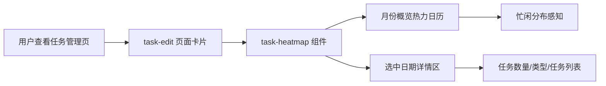

# 里程碑-22D：任务分布热力日历视觉与信息表达重设计 详细设计文档

> **设计状态**：✅ 已完成
> **创建日期**：2026-04-23
> **设计者**：GPT5 Codex
> **审核者**：项目维护者
> **预计工期**：1-2 天

---

## 📋 目录

- [需求分析](#需求分析)
- [技术方案](#技术方案)
- [代码结构](#代码结构)
- [实施步骤](#实施步骤)
- [测试方案](#测试方案)
- [风险评估](#风险评估)
- [替代方案](#替代方案)

---

## 需求分析

### 功能描述

当前任务管理页中的“任务分布”卡片已经具备可用的热力日历能力，能展示月份任务密度、选中日期和当日任务详情，但视觉完成度仍偏“功能控件”，与页面整体柔和、圆润、白卡片化的产品气质不完全匹配。

结合当前截图与实际代码，热力日历存在几个明确问题：日期格过硬、色阶跳变过大、单格信息承载过多、`today / selected / pressure` 状态表达互相竞争，导致用户虽然“能看懂”，但难以获得高级、精致、舒服的第一印象。本里程碑先不动业务规则，聚焦把热力日历重设计为真正可作为主视觉模块承载的“任务分布概览”。

### 业务价值

- [x] 用户价值：提升任务管理页的第一屏品质感，让用户能更轻松、更舒适地扫视月份任务分布。
- [x] 技术价值：为后续 `task-heatmap` 复杂度治理提供稳定的视觉契约，避免继续在旧样式上零碎修补。
- [x] 业务价值：提升产品整体完成度，使“任务分布”从可用统计控件升级为具有产品辨识度的核心模块。

### 功能范围

**包含**：
- ✅ 重设计热力日历格子的视觉形态、留白与圆角语言
- ✅ 重设计热力日历色阶体系，统一到任务管理页整体蓝白灰风格
- ✅ 降低单格信息密度，明确“概览”与“详情”的职责边界
- ✅ 重做 `today / selected / pressure` 的状态层级
- ✅ 调整星期标题、格子间距、底部任务标记的节奏和视觉主次
- ✅ 对详情区头部摘要做最小承接改造，确保热力格降载后信息不断层
- ✅ 明确长按提示气泡的取舍，避免保留双信息通路
- ✅ 补齐热力日历渲染契约相关测试

**不包含**：
- ❌ 不改任务统计口径、压力计算逻辑和任务分布算法
- ❌ 不在本期重构热力日历下方的任务详情列表卡片主体、编辑区和删除区
- ❌ 不在本期扩展为分析页/其他页面共用的新日历系统
- ❌ 不处理 `task-heatmap` 内部所有历史方法拆分，复杂度治理放在视觉契约稳定后单独推进

### 优先级

- **优先级**：P1
- **理由**：该问题不影响功能可用性，但直接影响任务管理页的视觉品质与产品完成度，且属于真实使用中稳定可见的核心首屏区域，值得作为正式体验优化项推进。

---

## 技术方案

### 方案概述

本期采用“**视觉重做 + 信息降载 + 状态分层**”方案：保留当前热力日历的业务能力和交互入口，但不再让单个日期格承担过多解释责任。热力格回归“概览视图”，主要传达忙闲分布；具体任务数量、任务构成和压力说明，交由选中日期后的详情区域承接。

设计上，热力日历从当前“完全方格 + 跳色 + 多信息叠加”的样式，升级为“软圆角轻网格 + 同色系渐进色阶 + 轻量任务标记 + 分层状态表达”。这样既保留信息价值，又能显著提升高级感和页面整体一致性。

### 技术选型

| 技术点 | 选择方案 | 替代方案 | 选择理由 |
|--------|---------|---------|---------|
| 日历格形态 | 小圆角软方格 | 保持直角方格 | 更匹配当前任务管理页和全局卡片风格 |
| 色阶体系 | 蓝灰/蓝青同色系渐进 | 蓝紫红多色跳变 | 渐进色阶更克制、更精致，避免小尺寸下显躁 |
| 任务类型表达 | 低密度显示类型点，高密度显示轻量数量徽标 | 数量+多彩点同时显示 | 兼顾任务量感知与视觉稳定性，避免“点 + 聚合字样”解释成本过高 |
| 状态表达 | 背景负责热力，边框/描边负责 today/selected | 全部叠在格子背景上 | 分层表达能避免状态互相打架 |

### DDD分层设计

**领域层（models/）**：
- [ ] 新建模型：无
- [ ] 修改模型：无
- 说明：本期不改领域模型和业务规则。

**服务层（services/）**：
- [ ] 新建服务：无
- [ ] 修改服务：无
- 说明：本期不改 `TaskService`、压力计算或统计逻辑。

**仓储层（repositories/）**：
- [ ] 新建仓储：无
- [ ] 修改仓储：无
- 说明：不涉及数据访问层。

**适配器层（adapters/）**：
- [ ] 新建适配器：无
- [ ] 修改适配器：无
- 说明：不涉及适配器层。

**表现层（pages/、components/）**：
- [ ] 新建页面：无
- [x] 修改页面：`pages/task-edit/`
- [x] 修改组件：`packageComponents/components/task-heatmap/`
- 说明：主要工作落在热力日历组件视觉与 WXML 结构重排，以及父页面卡片级留白协调。

### 架构图



### 数据模型

本期不新增数据模型，沿用现有 `days[]` 数据结构，但收紧其表现层消费约束：

```typescript
interface HeatDayDisplayState {
  date: string;
  day: number;
  level: 0 | 1 | 2 | 3 | 4;
  isCurrentMonth: boolean;
  isToday: boolean;
  taskDots: Array<{ type: string; color?: string; display?: string }>;
  taskCount: number;
}
```

关键变化不在数据结构本身，而在 UI 如何消费这些字段：
- `taskCount` 不再默认在高密度日期格中强展示
- `taskDots` 只作为轻量提示，不再承担完整任务说明责任

### 接口设计

本期无新增服务接口。

### 视觉与交互决策

#### 1. 热力格重做为“软圆角轻网格”

- 日期格从 `border-radius: 0` 改为稳定的小圆角
- 保持统一网格密度，但增加格子间的呼吸感
- 整体不再追求“填满式日历”，而是强调有秩序的留白

#### 2. 色阶统一到单一情绪体系

- `level-0`：接近白色的浅底
- `level-1`：极浅蓝
- `level-2`：柔和浅蓝
- `level-3`：中等蓝灰
- `level-4`：深一点的靛蓝/蓝灰

约束：
- 不再使用紫色和高饱和红色
- 高压力也要保持克制，不制造视觉惊扰

#### 3. 单格默认只保留“概览能力”

- 主信息：日期数字
- 次信息：轻量热力背景
- 辅信息：轻量底部任务类型标记

移除/降级：
- 默认不再用“任务数 + 圆点”同时出现的组合
- 即使任务较多，也不在格子里强行解释全部细节

#### 4. 任务类型标记轻量化

- 低密度日期保留少量类型点，帮助用户快速感知任务构成
- 高密度日期不再使用“点 + 聚合字样”的混合表达，改为单个轻量数量徽标
- 任务类型标记尺寸、色彩和透明度都要压低，不与日期数字抢主视觉

最终交付规则锁定为：
- 0 个任务：不显示标记
- 1-2 个任务：显示 1-2 个轻量类型点
- 3 个及以上任务：显示轻量数量徽标，例如 `3`、`4`
- 本期不再在日期格里使用“点 + 多”或“点 + +”等聚合表达

#### 5. 状态表达分层

- `pressure level`：只影响格子底色
- `today`：使用轻描边/小圆环/日期强调，不覆盖热力背景
- `selected`：使用更明确但克制的外框或投影

原则：
- 数据状态放底层
- 时间状态放中层
- 交互状态放上层

可编码优先级规则锁定为：
- `level-*` 只负责背景色，不改变边框层级
- `today` 只负责日期数字强调和细描边，不覆盖 `level-*` 背景
- `selected` 只负责最外层边界或投影，必须始终可见
- `selected + today` 同时存在时，以 `selected` 为主，`today` 退化为数字强调
- `level-4` 不允许通过深色背景吞掉 `selected` 的边界识别
- 非当前月日期始终维持弱化态，即使被选中也不得与当前月主格子争夺视觉焦点

#### 6. 长按提示气泡收口

当前组件仍保留长按提示通路，但本期不继续保留双信息入口。

决策：
- 删除热力格上的长按提示气泡能力
- 单格只保留“概览 + 点击进入详情区”单通路
- 所有进一步解释任务数量、任务构成、压力说明的职责统一收回点击后的详情区

原因：
- 本期目标是降低单格信息负担
- 若继续保留长按气泡，会形成“单格概览 / 长按气泡 / 点击详情”三套并存语义，设计无法真正收口

#### 7. 详情信息回归详情区

- 月份格子负责“扫一眼看忙闲”
- 选中日期后的详情区负责：
  - 任务摘要
  - 压力标签
  - 当日任务列表

这样可以减少热力图单格的认知负担。

边界锁定为：
- 本期允许改动详情区头部摘要区域，包括日期标题、压力标签、任务摘要文案
- 本期不改详情区任务列表卡片主体结构，不改任务编辑、删除、积分等下游交互
- 这样既能承接热力格降载后的信息转移，又不会让范围膨胀成整块详情区重做

---

## 代码结构

### 文件变更清单

**修改文件**：
- `packageComponents/components/task-heatmap/task-heatmap.wxml` - 重排热力日历格子结构与任务标记表达
- `packageComponents/components/task-heatmap/task-heatmap.wxss` - 重做格子形态、色阶、状态层和留白节奏
- `packageComponents/components/task-heatmap/task-heatmap.js` - 收紧渲染逻辑，移除“高任务数强展示”和长按提示分支，集中单格展示规则
- `pages/task-edit/task-edit.wxml` - 如有必要微调卡片内热力图周边留白
- `pages/task-edit/task-edit.wxss` - 如有必要微调“任务分布”卡片与组件间距
- `test/pages/task-heatmap.component.test.js` - 补充热力日历展示契约测试

### 核心代码结构

```javascript
// task-heatmap.js
methods: {
  generateCalendar() {
    // 继续生成 days[]
    // 但收紧到“概览优先”的显示字段
  },

  buildDayCellVisualState(day) {
    // 统一计算格子主次信息
    // 例如：是否显示轻量任务标记、是否显示聚合指示、
    // 是否需要 today / selected 的视觉优先级降级
  }
}
```

### 关键函数

**函数1**：`generateCalendar`
- **输入**：当前年份、月份、任务列表
- **输出**：`days[]`
- **职责**：生成日历基础展示数据
- **依赖**：现有压力计算与任务聚合逻辑

**函数2**：`buildDayCellVisualState`（建议新增 helper）
- **输入**：单日任务与压力信息
- **输出**：受 UI 约束后的单格展示状态
- **职责**：把“单格概览展示规则”集中收口，避免 WXML/JS 分散判断
- **依赖**：现有 `taskDots / taskCount / level / isToday`

**函数3**：`buildSelectedDaySummaryState`（建议新增 helper）
- **输入**：选中日期任务列表、压力信息
- **输出**：详情区头部摘要展示状态
- **职责**：把热力格迁移下来的数量/摘要信息集中收口到详情区头部
- **依赖**：现有 `dayTasks / selectedDayPressure / taskSummaryText`

---

## 实施步骤

### 第1步：锁定视觉契约（预计2小时）

- [x] **任务**：明确格子圆角、间距、字重、色阶和状态优先级
- [x] **验证**：输出与当前实现的差异清单，确保无业务语义变更
- [x] **依赖**：当前设计审核通过

**实施要点**：
1. 先确定“概览优先”的单格信息边界
2. 再确定色阶和 today/selected 的关系
3. 最后再落具体 WXML/CSS

---

### 第2步：重做热力日历结构与样式（预计4小时）

- [x] **任务**：修改 `task-heatmap.wxml / wxss`
- [x] **验证**：热力格在任务管理页首屏呈现更柔和、统一、清楚
- [x] **依赖**：第1步完成

**实施要点**：
1. 去掉硬方格与跳色风格
2. 降低底部标记的视觉噪音
3. 保持多设备下网格稳定
4. 同步删除长按提示的视觉依赖

---

### 第3步：收紧日历渲染逻辑（预计2小时）

- [x] **任务**：调整 `task-heatmap.js` 中单格视觉数据组装逻辑
- [x] **验证**：高任务数日期不再显得拥挤，today/selected/level 状态不互相打架
- [x] **依赖**：第2步完成

**实施要点**：
1. 把“显示多少个标记”做成集中规则
2. 删除“任务数强展示”逻辑
3. 删除长按提示逻辑，统一为点击进入详情区
4. 不改变点击日期、查看任务列表等交互行为

---

### 第4步：补齐详情区头部最小承接与回归（预计2小时）

- [x] **任务**：对详情区头部摘要做最小承接调整
- [x] **验证**：单格降载后，选中日期仍能清楚获得数量/压力/摘要信息
- [x] **依赖**：前3步完成

**实施要点**：
1. 只改头部摘要，不动任务列表卡片主体
2. 确保信息迁移后上下文不断层
3. 维持现有编辑/删除交互链路不受影响

---

### 第5步：补齐测试与回归（预计2小时）

- [x] **任务**：扩展 `task-heatmap` 组件测试，必要时补充任务管理页契约测试
- [x] **验证**：视觉契约对应的结构断言和关键逻辑断言通过
- [x] **依赖**：前4步完成

**实施要点**：
1. 覆盖热力格结构变化
2. 覆盖任务标记聚合逻辑
3. 覆盖长按提示移除后的单通路行为
4. 确保现有任务选中和任务列表展开不回归

---

## 测试方案

### 单元测试

| 测试项 | 测试方法 | 预期结果 |
|--------|---------|---------|
| 单格展示规则 | 构造不同任务数和类型组合 | 单格只输出受控数量的轻量标记 |
| 状态优先级 | 构造 today + selected + level 叠加场景 | 结构和 class 输出符合预期分层 |
| 当前月/非当前月 | 构造跨月补位日期 | 非当前月样式保持弱化 |
| 长按路径移除 | 触发对应结构检查和事件检查 | 不再保留长按提示入口，只保留点击详情通路 |

### 集成测试

- [ ] 任务管理页首屏展示热力图时，视觉结构与信息层级符合新设计
- [ ] 点击日期后仍能正常展开详情区和任务列表
- [ ] 月份切换后热力图布局与状态不异常
- [ ] 删除长按提示后，不存在信息断层或误操作空白

### 手动测试

1. **功能测试**：
   - [ ] 普通日期、高密度日期、无任务日期的视觉表现符合新方案
   - [ ] 今天日期、选中日期、跨月日期状态清楚且不冲突
   - [ ] 点击任意有任务日期，详情区仍能正常展开

2. **回归测试**：
   - [ ] 月份切换无异常
   - [ ] 任务详情区关闭/展开无异常
   - [ ] 现有任务编辑、删除等热力图下游交互未破坏

### 测试覆盖率目标

- 最低要求：85%
- 推荐目标：90%

## 实施结果

### 实际交付（2026-04-23）

- 已完成 [`packageComponents/components/task-heatmap/task-heatmap.wxml`](/Users/wangdafei/code/study_task_wechat/packageComponents/components/task-heatmap/task-heatmap.wxml)、[`packageComponents/components/task-heatmap/task-heatmap.wxss`](/Users/wangdafei/code/study_task_wechat/packageComponents/components/task-heatmap/task-heatmap.wxss)、[`packageComponents/components/task-heatmap/task-heatmap.js`](/Users/wangdafei/code/study_task_wechat/packageComponents/components/task-heatmap/task-heatmap.js) 的正式实现，删除长按提示通路、收口详情头部承接，并把旧的硬方格/跳色/高噪音格内表达替换为当前已交付版本
- 任务标记规则在实施期根据真实截图复核做了二次收口：最终没有保留最初设计阶段的“点位 + 聚合字样”方案，而是改成交付效果更好的“低密度类型点 + 高密度轻量数字”方案
- 本期未扩散到任务列表主体、编辑区和删除区重做，实际改动边界保持与立项时一致

### 实际验证结果

- 自动化验证通过：
  - `npx jest test/pages/task-heatmap.component.test.js --runInBand`
- 真实页面截图复核通过：
  - 已确认热力日历格子比例回到合理区间
  - 已确认小数字方案比“点 + 多”更直接、更稳定
  - 已确认选中日期后的详情承接链路与任务列表主链路保持正常

---

## 风险评估

### 技术风险

| 风险项 | 影响 | 概率 | 应对措施 |
|--------|------|------|---------|
| 视觉改动过大导致既有用户不适应 | 中 | 中 | 保留原有交互逻辑，只重做视觉与信息主次 |
| 小程序端不同设备下格子布局不稳定 | 中 | 中 | 使用稳定尺寸和更保守的间距策略，补齐多尺寸回归 |
| 日历格信息降载后被误解为信息变少 | 中 | 低 | 把数量和任务构成明确收回详情区，不做信息丢失 |
| 改动牵出组件历史复杂度 | 中 | 高 | 严格控制在视觉契约和单格渲染逻辑，不顺手大拆组件 |

### 产品风险

- 如果继续试图让单个日期格同时解释“数量、类型、压力、状态”，视觉优化收益会被抵消。
- 如果把推荐做成“只换颜色不换结构”的微调方式，会再次落回旧问题：局部好一点，但整体不高级。

---

## 替代方案

### 方案 A：只调色，不调结构

不采用。

原因：
- 根因不只在色彩，还在格子形态、信息密度和状态分层
- 只换色不会真正变高级

### 方案 B：保留现有多信息单格，只细调字体和间距

不采用。

原因：
- 当前问题的核心就是单格承担过多职责
- 只调字体和间距，无法从根本上解决“看着乱但又说不清哪里乱”

### 方案 C：彻底重做为分析页风格的大型图表

本期不采用。

原因：
- 任务管理页需要的是轻量概览，不是重分析看板
- 过度做大只会破坏首屏节奏

### 方案 D：概览轻量化 + 详情区承接

采用。

原因：
- 最符合当前页面定位
- 能同时提升美观度、理解成本和整体风格统一性
- 改动边界清楚，适合先做正式设计、再实施验证
