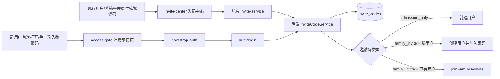

# 里程碑-22L：邀请码体系统一与新用户直达家庭 详细设计文档

> **设计状态**：🟢 审核通过（可实施）
> **创建日期**：2026-04-26
> **设计者**：GPT5 Codex
> **审核者**：项目维护者
> **预计工期**：6-8天

---

## 📋 目录

- [需求分析](#需求分析)
- [现状问题复盘](#现状问题复盘)
- [技术方案](#技术方案)
- [代码结构](#代码结构)
- [实施步骤](#实施步骤)
- [测试方案](#测试方案)
- [风险评估](#风险评估)
- [替代方案](#替代方案)
- [审核要点自检](#审核要点自检)

---

## 需求分析

### 功能描述

`M22A` 已经完成“应用级邀请制准入”和“家庭邀请码加入”两套独立能力，`M22B` / `M22M` 又补齐了系统管理员入口、动态准入和系统级用户治理。但从真实使用视角看，当前邀请码体系仍然是分裂的：

1. 应用级邀请码只解决“新用户能不能进系统”，不能解决“新用户进来后能不能直接进某个家庭”。
2. 家庭邀请码只解决“已进入系统的用户如何加入家庭”，不能解决“新用户首次进入就直达家庭”。
3. 第一类邀请码当前仍偏运营脚本思维，缺少普通用户可发码、系统管理员可治理发码额度的正式产品闭环。

结合本轮讨论，`M22L` 的目标不是简单“把现有两个码换个名字”，而是正式交付以下 3 类用户能力：

1. 现有用户给新用户邀请码，新用户可以进入程序成为用户，但不自动绑定家庭；进入后他可以自己创建家庭，或之后再加入别人的家庭。
2. 现有用户给新用户邀请码，新用户可以进入程序成为用户，并且首次进入时就直接加入邀请者所在家庭。
3. 现有用户给已经是小程序用户的人邀请码，对方输入后加入邀请者所在家庭。

同时，第一类“新用户入场码”需要具备最小治理能力：

- 系统管理员可以生成
- 普通用户也可以生成
- 但系统管理员可以限制：
  - 全局总量
  - 某个普通用户是否允许发码
  - 某个普通用户还能发多少个

### 业务价值

- [x] 用户价值：把“新用户进入程序”和“加入家庭”从两段式操作收敛成清晰可懂的邀请码体验。
- [x] 产品价值：支持真实传播场景，不再要求用户先靠维护者发应用邀请码，再靠家庭管理员发家庭邀请码。
- [x] 技术价值：收敛现有分裂的准入/加入链路，为后续新用户引导、邀请码治理和空态体验提供稳定基础。

### 功能范围

**包含**：

- [x] 定义统一的邀请码能力模型，覆盖“新用户入场”“新用户直达家庭”“已有用户加入家庭”
- [x] 设计新用户首次进入时直接加入家庭的后端事务链路
- [x] 设计普通用户可生成第一类邀请码、系统管理员可治理第一类邀请码额度的最小治理闭环
- [x] 设计邀请码页面与现有家庭设置页承接方式
- [x] 设计首期 `nickname / avatar` 获取与保存链路
- [x] 设计对现有 `app_access_codes` 与 `families.invite_code` 的平滑兼容方案

**不包含**：

- [x] 不做复杂的邀请码运营后台（批量发码、审计报表、导出列表），这属于后续候选治理方向
- [x] 不做 `gender / region` 入库，本期先收敛 `nickname / avatar`
- [x] 不做家庭治理权限模型重构，仍沿用 `manager / viewer`
- [x] 不做完整的新手 onboarding，这属于 `M22E`
- [x] 不把现有所有邀请相关表强制一次性物理合并并回填历史数据，本期优先建立统一正式主链路和渐进迁移能力

### 优先级

- **优先级**：P0
- **理由**：这是当前治理主线里最直接影响“系统如何扩散、用户如何进入、家庭如何形成”的缺口。若继续保持现在的两段式邀请码体验，后续新用户引导和家庭协作能力都会建立在割裂的基础上。

---

## 现状问题复盘

### 问题1：当前系统实际存在两套邀请码，但职责分裂

现有实现可明确分成两套：

1. **应用级邀请码**
   - 前端页：[pages/access-gate/access-gate.js](/Users/wangdafei/code/study_task_wechat/pages/access-gate/access-gate.js)
   - 状态存储：[utils/app/app-access-state.js](/Users/wangdafei/code/study_task_wechat/utils/app/app-access-state.js)
   - 登录链路：[utils/app/bootstrap-auth.js](/Users/wangdafei/code/study_task_wechat/utils/app/bootstrap-auth.js)
   - 后端服务：[backend/services/appAccessService.js](/Users/wangdafei/code/study_task_wechat/backend/services/appAccessService.js)
   - 登录入口：[backend/controllers/authController.js](/Users/wangdafei/code/study_task_wechat/backend/controllers/authController.js)

   这条链路解决的是“新用户能不能创建账号”，不解决“创建后是否加入家庭”。

2. **家庭邀请码**
   - 前端页：[packageManage/pages/family-settings/family-settings.js](/Users/wangdafei/code/study_task_wechat/packageManage/pages/family-settings/family-settings.js)
   - 前端服务：[services/user-service.js](/Users/wangdafei/code/study_task_wechat/services/user-service.js)
   - 后端服务：[backend/services/familyService.js](/Users/wangdafei/code/study_task_wechat/backend/services/familyService.js)
   - 路由入口：[backend/routes/families.js](/Users/wangdafei/code/study_task_wechat/backend/routes/families.js)

   这条链路解决的是“已登录用户怎么加入家庭”，不解决“首次进入时是否一起加入家庭”。

结果就是：

- 新用户拿到第一类码，只能先进程序，再自己处理家庭
- 想让新用户直接进家庭时，只能人工分两次发码
- 用户很难理解“应用邀请码”和“家庭邀请码”到底有什么区别

### 问题2：当前新用户创建后默认是“独立用户”，不是“被邀请用户”

现有登录控制器 [authController.js](/Users/wangdafei/code/study_task_wechat/backend/controllers/authController.js) 中：

- `invite_only` 模式下，新用户带 `accessCode` 登录，会走 `_createInvitedUser(...)`
- 这个流程只会：
  - 校验应用级邀请码
  - 创建用户
  - 消费邀请码

不会：

- 绑定家庭
- 继承邀请者上下文
- 记录这是哪位现有用户发的码

因此当前所谓“邀请制”，本质上更像“准入闸门”，不是“邀请关系”。

### 问题3：当前家庭邀请码是单码模型，天然不适合新一轮能力扩展

当前家庭邀请码直接挂在 `families` 表字段上：

- `invite_code`
- `invite_code_role`
- `invite_code_expires_at`
- `invite_code_used_at`

它的正式语义是：

- 单家庭单码
- 1 次使用
- 24 小时过期
- 按 `parent / child` 区分加入角色

这套模型可以支撑“家庭管理员邀请一个人加入家庭”，但很难优雅支撑：

- 普通用户发第一类入场码
- 系统管理员按用户治理发码能力
- 记录是谁发的第一类码
- 新用户第一次打开就自动进家庭
- 兼顾“新用户用”和“已有用户用”的统一承接页

### 问题4：当前新用户资料获取链路并不存在

现在后端 [backend/utils/wechat.js](/Users/wangdafei/code/study_task_wechat/backend/utils/wechat.js) 只通过 `code2Session` 获取：

- `openid`
- `unionid`
- `session_key`

拿不到：

- 昵称
- 头像
- 性别
- 地区

虽然 [backend/services/userService.js](/Users/wangdafei/code/study_task_wechat/backend/services/userService.js) 的 `getOrCreateUser(...)` 支持从 `wechatData.nickName / avatarUrl` 更新资料，但当前登录链路实际上没有向后端传这些字段。因此：

- 新用户默认被创建为 `name='用户'`
- `avatar=''`

如果 `M22L` 要达成首期 `nickname / avatar` 获取与保存，就必须设计一条前端显式授权后的资料补写链路，不能假设登录时微信天然会给。

### 问题5：当前“新用户直达家庭”在 open 模式下没有正式承接页

如果系统处于 `open` 模式：

- 新用户第一次打开小程序，会直接登录并创建账号
- 不会自动进入任何邀请码输入页

这意味着即使已有用户给了“希望对方首次进入就加入家庭”的邀请码，如果没有统一的承接页或分享路径，这个能力也无法可靠落地。

因此 `M22L` 不能只改后端校验，还必须设计：

- 手工输入邀请码的统一入口
- 通过分享路径/页面参数提前带入邀请码的统一入口

### 问题6：第一类邀请码治理诉求已经超出纯后端脚本管理

在 `M22A` 中，应用级邀请码还是“运维脚本生成、前端只消费”的模型。但当前真实诉求已经变化：

- 管理员也要在小程序里治理这类邀请码能力
- 普通用户也要能发第一类码
- 但不是所有普通用户都默认能发
- 还要有总量与个人额度限制

这说明第一类邀请码已经从“平台运营脚本工具”演进成“正式产品能力”，必须进入系统治理和前台产品设计范畴。

---

## 技术方案

### 方案概述

`M22L` 的核心思想是：

1. **对用户暴露 3 类能力**
   - 新用户入场但不绑定家庭
   - 新用户首次进入并直达家庭
   - 已有用户加入家庭
2. **对系统内部只收敛成 2 类邀请码模型**
   - `admission_only`：仅负责新用户入场
   - `family_invite`：同时支持
     - 新用户首次进入并加入家庭
     - 已有用户加入家庭
3. **新增统一邀请码正式主链路，但保留旧模型兼容回退**
   - 旧 `app_access_codes` 和 `families.invite_code*` 不做粗暴删除
   - 新生成的邀请码全部走统一链路
   - 旧码在过渡期内仍可消费，直到自然失效或被新 UI 刷新替换

这样做有三个好处：

- 用户理解简单：不再需要理解“这是系统邀请码还是家庭邀请码”
- 后端编排可控：真正统一的是服务编排和消费路径，而不是一开始就强做大规模历史迁移
- 与当前项目阶段匹配：先做成“正式可用 + 可治理 + 可渐进迁移”，再视收益决定是否彻底退役旧模型

### 核心设计决策

#### 决策1：内部统一为两类邀请码模型，而不是三张完全不同的业务表

虽然用户需求表现为 3 类能力，但系统内部只定义两类正式邀请码：

```typescript
type InviteCodePurpose =
  | 'admission_only'
  | 'family_invite';
```

能力映射如下：

| 用户能力 | 邀请码 purpose | 消费者状态 | 结果 |
|---------|----------------|------------|------|
| 新用户入场但不绑定家庭 | `admission_only` | 新用户 | 创建用户 |
| 新用户首次进入并直达家庭 | `family_invite` | 新用户 | 创建用户 + 加入家庭 |
| 已有用户加入家庭 | `family_invite` | 已有用户 | 加入家庭 |

选择理由：

- 用户看到的是 3 个场景，系统内部不必硬拆成 3 套模型
- `family_invite` 本身天然就是“是否新用户”分支不同、目标相同
- 后端可以统一做 code 查找、状态校验、过期处理和消费

#### 决策2：新增统一邀请码表 `invite_codes`，但旧模型过渡期保留只读兼容

本期新增正式表 `invite_codes`，只承接：

- 新生成的邀请码
- 新的消费主链路

旧模型的处理方式：

- `app_access_codes`
  - 不回填历史数据
  - 登录时若统一邀请码表未命中，再回退旧应用邀请码校验
- `families.invite_code*`
  - 不回填历史数据
  - 家庭加入时若统一邀请码表未命中，再回退旧家庭邀请码校验
  - 一旦某个家庭在新 UI 中刷新了新的家庭邀请码，就不再继续依赖旧字段

这意味着：

- 过渡期不会粗暴打断旧码
- 新功能从第一天起就统一走 `invite_codes`
- 后续若要彻底删除旧模型，可以作为独立清理里程碑处理

#### 决策3：第一类邀请码允许系统管理员和普通用户生成，但普通用户必须显式授权

第一类邀请码 `admission_only` 的发码规则：

- 系统管理员：默认允许
- 普通用户：只有满足以下条件才允许
  - 真实登录用户
  - `role='parent'`
  - `systemAccessLevel='normal'`
  - 被系统管理员显式允许发第一类码

以下用户一律不允许生成第一类邀请码：

- `child`
- `readonly`
- `blocked`
- 虚拟成员

选择理由：

- 满足你提出的“管理员和普通用户都可以发第一类码”
- 同时避免邀请码扩散失控
- 与现有系统治理模型一致：系统级限制优先于业务能力

#### 决策4：第一类邀请码治理只做最小闭环，不上复杂运营系统

本期治理能力限定为 3 项：

1. **全局总量**
   - 系统设置中配置 `admission_code_global_quota_total`
2. **用户是否允许发码**
   - 用户级字段 `canIssueAdmissionCode`
3. **用户累计配额**
   - 用户级字段 `admissionCodeQuotaTotal`

本期不做：

- 按天限流
- 按家庭限流
- 按邀请码批次管理
- 后台报表与导出

选择理由：

- 这是当前用户明确提出的最小治理面
- 再往上做就会演变成独立的运营后台里程碑

#### 决策4A：第一类邀请码治理继续挂在现有系统治理链路，但拆成“全局卡片 + 用户卡片内局部治理”

为了避免把当前系统治理页做成新的复杂后台，本期页面信息架构明确如下：

- `system-admin`
  - 继续只放系统级能力
  - 新增一张“新用户邀请码治理”全局卡片
  - 卡片内只放：
    - 全局可成功邀请总量
    - 已使用数量
    - 剩余额度
    - 进入用户治理页入口
- `system-user-governance`
  - 继续是“按用户逐个治理”的列表页
  - 仅对“真实登录的家长用户”展示一块轻量的“邀请码权限”子区域
  - 子区域只包含：
    - 是否允许发新用户邀请码
    - 个人可成功邀请总量
    - 已使用数量
    - 剩余额度
  - `child`、虚拟成员、只读/禁入用户不展示可编辑表单，只展示不可发码原因

这样做的原因：

- 贴合当前 [system-admin.wxml](/Users/wangdafei/code/study_task_wechat/packageManage/pages/system-admin/system-admin.wxml) 的“系统概览 + 入口卡片”结构
- 贴合当前 [system-user-governance.wxml](/Users/wangdafei/code/study_task_wechat/packageManage/pages/system-user-governance/system-user-governance.wxml) 的“用户卡片列表”结构
- 不新增第三张系统治理页，避免移动端治理链路继续膨胀

#### 决策5：额度按“成功邀请人数”统计，而不是按“累计发码/刷新次数”统计

本期额度含义统一为：

- 某个用户最多还能成功邀请多少个新用户进入程序
- 全局最多还能新增多少个通过第一类邀请码进入的新用户

实现上：

- `admission_only` 仍保持单槽位、单次消费模型
- 刷新当前仍有效的邀请码**不消耗额度**
- 只有当第一类邀请码被新用户成功消费、确实创建了新账号后，才记 1 次额度使用

这样设计的原因：

- 避免“用户只是刷新了几次当前邀请码，却把额度烧完”的错误体验
- 更符合你要的治理语义：管理员限制的是“还能带进来多少个新用户”，不是“还能点多少次刷新”
- 与单槽位模型兼容，不需要为“刷新是否算一次发码”额外制造复杂规则

#### 决策6：家庭邀请码统一为新旧用户都可消费，但只有家庭管理员能生成

`family_invite` 的生成权限如下：

- 只有 `familyPermissionRole='manager'` 且 `systemAccessLevel='normal'` 的家长可以生成
- `viewer` 不允许生成
- `child` 不允许生成
- 系统管理员如果不是该家庭 `manager`，也不因系统身份获得越权邀请能力

选择理由：

- 邀请别人进入某个家庭，本质上是家庭治理动作
- 应继续受 `manager / viewer` 约束，而不是被系统管理员身份绕开
- 这也与当前 `family-settings -> refreshInviteCode` 的真实治理边界一致：本期是沿用并收敛到统一邀请码链路，不是新增系统管理员越权发家庭码能力

#### 决策7：家庭邀请码默认一套双端通用，不再区分“新用户家庭码”和“已有用户家庭码”

对于家庭邀请，前台只展示一种“邀请加入我的家庭”的码：

- 如果对方是新用户：首次进入时创建账号并加入家庭
- 如果对方是已有用户：输入邀请码后加入家庭

这比给用户再分出“新用户家庭码”“已有用户家庭码”两种产品概念更简单。

#### 决策7A：已有用户消费 `family_invite` 时，不允许被邀请码改写既有账号角色

`family_invite` 虽然同时支持新用户和已有用户消费，但已有用户场景必须补一条 authoritative 角色规则：

- **新用户消费**：
  - `targetRole='child'`：创建为 `child`
  - `targetRole='parent'`：创建为 `parent`
- **已有用户消费**：
  - 只允许“加入家庭”，不允许把现有账号从 `parent` 改成 `child`，也不允许从 `child` 改成 `parent`
  - 因此邀请码 `targetRole` 必须与现有用户 `role` 一致，否则拒绝

正式规则：

- 已有 `parent` 只能消费 `targetRole='parent'` 的 `family_invite`
- 已有 `child` 只能消费 `targetRole='child'` 的 `family_invite`
- 若角色不匹配，返回 `INVITE_CODE_TARGET_ROLE_MISMATCH`

选择理由：

- 这和你要的第 3 类能力一致：已有用户只是加入邀请者家庭，不是被邀请码改造成另一种账号身份
- 也避免实现时沿用旧 `joinFamily()` 的“直接按邀请码改 role”逻辑，误伤现有用户

#### 决策7B：已有用户若已在家庭中，本期禁止借邀请码切换家庭

本期对“已有用户已经属于某个家庭，又去消费 `family_invite`”的正式规则如下：

- 若 `existingUser.familyId` 为空：
  - 允许继续消费 `family_invite`
- 若 `existingUser.familyId === invite.familyId`：
  - 拒绝消费
  - 返回 `INVITE_CODE_ALREADY_IN_TARGET_FAMILY`
  - 文案按用户视角提示“你已经在这个家庭里了，无需重复加入”
- 若 `existingUser.familyId !== invite.familyId`：
  - 拒绝消费
  - 返回 `INVITE_CODE_EXISTING_USER_HAS_FAMILY`
  - 文案按用户视角提示“你已加入其他家庭，暂不支持直接切换”

补充约束：

- 以上两种拒绝场景都**不消费邀请码**
- 本期不做“退出原家庭后再加入新家庭”的自动迁移流程
- “切换家庭 / 离开家庭”若未来需要，应作为独立家庭治理里程碑设计

选择理由：

- 这和当前系统还没有正式“离开家庭/切换家庭”产品流程的现实一致
- 避免把“加入家庭”悄悄做成“静默迁移家庭”
- 也避免误迁移用户后，把任务、奖励、成员治理语义一起带乱

#### 决策8：家庭邀请码仍保留“邀请孩子 / 邀请家长”两种目标身份

`family_invite` 继续保留 `targetRole`：

- `child`
- `parent`

规则如下：

- `child`：加入后 `role='child'`，`familyPermissionRole=null`
- `parent`：加入后 `role='parent'`，`familyPermissionRole='viewer'`

这延续 `M22A` 已落地的正式规则，不引入新的高权限邀请捷径。

#### 决策9：家庭邀请码 slot 仍保持“单槽位刷新覆盖”，避免 UI 和治理复杂化

虽然底层改成 `invite_codes` 记录表，但对用户仍保持接近当前的体验：

- 每个家庭对每种邀请角色只保留 1 个当前有效邀请码槽位
- 刷新同一槽位时，旧码立即失效，新码成为最新码

槽位定义：

- `family_invite + child`
- `family_invite + parent`

这样可以保留：

- 家庭设置里当前邀请码就是视觉焦点
- 刷新后旧码立即失效的明确心智

而不用把家庭页做成复杂的邀请码列表管理器。

#### 决策10：第一类邀请码也保持“个人单槽位刷新覆盖”

对 `admission_only` 同样采用单槽位：

- 每个允许发第一类码的用户，只展示并维护当前 1 个有效码
- 再次刷新时：
  - 若当前有效码仍存在，则直接覆盖旧码，不消耗额度
  - 若当前有效码已消费/失效，则重新生成新码；后续是否还能成功邀请新用户，仍受剩余额度限制
  - 旧码立即失效
- 前端在用户点击“刷新”前，必须显式提示“刷新后之前发出的邀请码会立即失效”

这样做可以显著降低：

- 前端 UI 复杂度
- 用户对“我当前该发哪一个码”的犹豫
- 多个活跃码并存导致的传播混乱

#### 决策11：分享路径和手工输入两条入口并存

为了同时覆盖 `open` 模式和 `invite_only` 模式，本期统一支持两种入口：

1. **手工输入**
   - 继续保留并扩展 `access-gate`
   - 用户可手工输入邀请码
2. **分享路径带码**
   - 邀请者可分享带 `inviteCode` 的小程序路径
   - App 捕获到带码路径后，先进入 `access-gate` 的对应承接态
   - 由用户确认后再继续登录或加入家庭流程

这样可以覆盖：

- 只拿到文本邀请码的人
- 直接从分享卡片或二维码进入的人

#### 决策11A：已登录用户打开分享邀请码时，不能只写 pending 状态，必须进入显式承接页

当前“先写 pending，再复用登录链路”的方式，只天然覆盖“尚未登录、需要走 `auth/login`”的新用户。  
对已登录用户，如果仍只写 pending invite code 而不补后续承接，就会出现：

- 用户点开家庭邀请码分享卡片
- 小程序已在登录态
- 没有重新走 `auth/login`
- 结果什么都没发生

因此本期正式规则是：

- **未登录用户**
  - 不再直接静默登录
  - 先进入 `access-gate` 的“分享带码承接态”
  - 由用户点击主按钮后再进入登录/消费流程
- **已登录用户**
  - 若分享的是 `family_invite`
    - 直接进入统一邀请码承接页，展示“将加入某个家庭”的确认态
    - 用户确认后调用 `POST /api/families/join`
  - 若分享的是 `admission_only`
    - 直接提示“当前账号已进入程序，无需使用此邀请码”
    - 不消费该码

选择理由：

- 这样新用户和老用户的路径都闭环
- 也避免把“加入家庭”这种有状态变化的动作做成静默自动执行
- 也能为新用户资料授权提供稳定的显式交互落点，不需要把授权弹窗硬塞进冷启动自动登录链路

#### 决策11B：`invite-center` 只负责发码，`access-gate` 只负责消费承接

为消除页面职责重叠，本期页面边界正式收敛为：

- `invite-center`
  - 只给**已登录用户**使用
  - 负责查看自己当前可用的邀请码
  - 负责生成/刷新邀请码
  - 负责复制、分享邀请码
  - 不负责消费邀请码
- `access-gate`
  - 作为**唯一的邀请码消费承接页**
  - 负责手工输入邀请码
  - 负责未登录用户从分享路径带码进入后的承接与确认
  - 负责已登录用户打开 `family_invite` 后的确认加入态
  - 不负责发码管理
- `family-settings`
  - 回归家庭信息、成员治理、创建/加入家庭入口
  - 只保留“去邀请码中心”入口，不再承载完整发码操作台

这样做的原因：

- 现有 [pages/access-gate/access-gate.js](/Users/wangdafei/code/study_task_wechat/pages/access-gate/access-gate.js) 已经是真实存在的消费入口，延展它比再造第二个消费页更稳
- `invite-center` 这个命名天然更适合“发码中心/邀请码中心”，不适合作为通用消费页
- `family-settings` 当前已承担创建家庭、加入家庭、成员治理、PIN 设置，继续叠加完整发码台会过重

#### 决策11C：`access-gate` 必须显式拆成 4 种页面状态，不再维持单一输入页心智

为了保证 `access-gate` 在本期可实施且不演变成隐式分支页，页面状态正式定义为 4 种：

1. **手工输入态**
   - 场景：
     - 用户主动进入输入邀请码
     - 邀请制下被拦截后手工补码
   - 展示：
     - 标题“请输入邀请码”
     - 输入框
     - 继续按钮
     - 轻量说明文案
2. **新用户分享带码承接态**
   - 场景：
     - 未登录用户通过分享卡片、二维码、带参路径进入
   - 展示：
     - 标题按邀请码 purpose 变化
     - 已带入的邀请码摘要
     - 主按钮
     - 可选昵称头像授权说明
   - 行为：
     - 点击主按钮后才开始登录/消费
3. **已登录用户加入家庭确认态**
   - 场景：
     - 已登录用户打开 `family_invite`
   - 展示：
     - “将加入某个家庭”的确认信息
     - 确认加入按钮
     - 取消返回按钮
   - 行为：
     - 仅确认后才调用 `POST /api/families/join`
4. **无需使用提示态**
   - 场景：
     - 已登录用户打开 `admission_only`
     - 用户已在目标家庭中
     - 用户已在其他家庭，本期不支持切换
     - 当前账号为系统只读
     - 当前账号已被系统禁入
   - 展示：
     - 结果提示
     - 返回首页或返回上一页按钮

补充约束：

- 以上 4 种状态共用同一页面路由，但必须有明确的 `mode` 数据字段驱动
- 不允许继续沿用当前 [access-gate.wxml](/Users/wangdafei/code/study_task_wechat/pages/access-gate/access-gate.wxml) 的“永远只有输入框”结构，再把其余逻辑藏在事件里
- 文案上不再使用“邀请码通常由项目维护者提供”这类旧心智表述，要改成更中性的“邀请码可由系统管理员或已有用户提供”

#### 决策12：`pending_app_access_code` 升级为通用 `pending_invite_code`

当前前端统一状态只服务于“应用级邀请码”。`M22L` 后它要承担更广语义：

- 入场码
- 家庭邀请码（新用户首次进入场景）

因此本期会把状态能力升级成通用 `pending_invite_code`：

- 统一保存、读取、清空
- 兼容读取旧 key `pending_app_access_code`
- 登录和分享路径都只消费这一处 source of truth

补充规则：

- `pending_invite_code` 只为“已进入 `access-gate` 承接页，但尚未完成登录消费”的场景服务
- 对已登录用户的分享卡片打开，不再只依赖 pending 状态，而是进入显式邀请码承接页
- `pending_invite_code` 不再承担“收到分享即立刻静默触发登录”的职责，只承担跨页面保存当前待消费邀请码

#### 决策12A：分享带码必须同时覆盖冷启动和热启动，并做去重承接

当前小程序真实存在 `App.onLaunch` 与 `App.onShow` 两段生命周期，因此本期正式要求：

1. 在 `app.js` 中抽一个统一入口，例如 `captureInviteEntry(options)`
2. 该入口同时在：
   - `App.onLaunch(options)`
   - `App.onShow(options)`
   中调用
3. 入口职责统一为：
   - 从页面参数中提取 `inviteCode`
   - 规范化码值
   - 记录最近一次处理的 invite fingerprint，避免一次分享在冷启动和热启动中被重复处理
   - 若当前未登录：
     - 进入 `access-gate` 的“新用户分享带码承接态”
     - 同时写入 `pending_invite_code`，供用户点击主按钮后继续消费
   - 若当前已登录：
     - `family_invite` 进入 `access-gate` 的确认加入态
     - `admission_only` 直接提示“当前账号已进入程序，无需使用此邀请码”

这样做的原因：

- 微信里“从聊天页下拉再次进入”“分享卡片唤起已在前台的小程序”都可能只走 `onShow`
- 如果设计只覆盖冷启动，很容易复现“重新进入才生效”的老问题
- 去重处理可以避免同一个分享码在一次唤起过程中被重复导航或重复写 pending 状态

#### 决策13：首期 `nickname / avatar` 采用“前端显式授权 + 登录参数透传/登录后补写”模式

由于 `code2Session` 拿不到资料，本期正式方案是：

1. 新用户在邀请码承接页点击主按钮时，前端可尝试请求微信昵称头像授权
2. 若用户同意：
   - 把 `nickname / avatarUrl` 作为可选参数随登录请求一起带给后端
3. 若用户拒绝：
   - 不阻断进入
   - 继续用默认用户资料创建
4. 若登录创建完成后资料仍为空：
   - 前端在首次进入后的轻量补全提示中允许再次同步昵称头像
5. 若用户后续再次授权并提交：
   - 本期允许覆盖更新当前 `nickname / avatar`
   - 以最近一次用户主动授权提交的数据为准

本期不做：

- `gender`
- `province / city / country`

原因：

- 当前项目并没有这些字段的前后端正式模型
- `M22L` 的主要价值是邀请码统一与新用户直达家庭，不应被资料模型扩张拖慢

#### 决策14：新统一邀请码采用独立码空间，避免与旧码碰撞

由于本期采用“新链路优先、旧模型回退”的双轨兼容方式，必须显式避免新旧码值冲突。

正式规则：

- 新 `invite_codes.code` 采用独立格式，不与旧应用邀请码、旧家庭邀请码共用同一编码空间
- 推荐方案：
  - 新统一邀请码长度升级为 10 位
  - 首字符固定使用旧码未占用的前缀集，例如 `U` / `F`
  - 旧码继续保持既有 8 位模型

后端查找顺序：

1. 先按新统一邀请码格式尝试命中新 `invite_codes`
2. 若格式不匹配或新表未命中，再按旧应用邀请码/旧家庭邀请码回退

这样可以保证：

- 过渡期不会因为码值巧合一致而把旧码错误识别成新码
- 兼容判断简单，不需要做多表模糊比对

补充前端约束：

- 过渡期输入页不能再把邀请码写死为“8位”
- `access-gate`、家庭加入输入框、邀请码确认态都应接受新旧两种长度
- 前端文案统一改成“请输入邀请码”
- 长度校验前端只做基础去空与大写规范化，最终有效性以服务端判断为准

### DDD分层设计

**领域层（models/）**：

- [x] 新建模型：`backend/models/InviteCode.js`
- [x] 修改模型：`backend/models/User.js`
- [x] 修改模型：`models/user.js`
- 说明：
  - `InviteCode` 负责统一邀请码类型、状态和值对象规则
  - `User` 增加第一类邀请码治理字段

**服务层（services/）**：

- [x] 新建服务：`backend/services/inviteCodeService.js`
- [x] 修改服务：`backend/services/appAccessService.js`
- [x] 修改服务：`backend/services/familyService.js`
- [x] 修改服务：`backend/services/userService.js`
- [x] 修改服务：`services/user-service.js`
- [x] 新建服务：`services/invite-service.js`
- [x] 修改服务：`services/system-service.js`
- 说明：
  - 后端统一由 `inviteCodeService` 负责生成、校验、消费和额度校验
  - `appAccessService` 与 `familyService` 仅保留旧模型兼容职责
  - 前端新增 `invite-service` 作为邀请码正式服务入口

**仓储层（repositories/）**：

- [ ] 不新增独立前端仓储
- [x] 新增后端邀请码数据访问封装（可放在 service 内部轻量 SQL，暂不强拆 repository）
- 说明：
  - 参考当前后端风格，本期先不为了邀请码单独引入新 repository 层

**适配器层（adapters/）**：

- [ ] 无独立新增

**表现层（pages/、components/）**：

- [x] 新建页面：`packageManage/pages/invite-center/`
- [x] 修改页面：`packageManage/pages/family-settings/`
- [x] 修改页面：`pages/access-gate/`
- [x] 修改页面：`packageManage/pages/system-admin/`
- [x] 修改页面：`packageManage/pages/system-user-governance/`
- 说明：
  - `invite-center` 作为已登录用户的发码中心
  - `access-gate` 作为唯一的邀请码消费承接页
  - `family-settings` 回归家庭创建/加入/成员治理，不再承载全部邀请复杂度
  - 系统治理页补充第一类邀请码发码权限与额度治理

### 页面入口与跳转关系

本期把“发码”和“用码”的入口统一收口，页面进入关系明确如下：

1. **已登录用户进入邀请码中心发码**
   - 主入口页：`family-settings`
   - 页面位置：
     - 未加入家庭态：在现有“创建家庭 / 输入邀请码加入”操作区新增“邀请码中心”入口
     - 已加入家庭态：替换当前完整邀请码操作卡片，改为“当前邀请码摘要 + 进入邀请码中心”入口
   - 目标页面：`packageManage/pages/invite-center/`
   - 可见性规则：
     - 仅真实登录的 `parent` 用户显示入口
     - `child` 用户不显示
     - `readonly` 用户可进入查看，但页面内发码按钮按能力置灰
   - 这样设计的原因：
     - 贴合当前 [family-settings.wxml](/Users/wangdafei/code/study_task_wechat/packageManage/pages/family-settings/family-settings.wxml) 已经是家庭相关总入口的现实
     - 也保证“没有家庭的家长”依然能找到新用户入场码入口

2. **手工输入邀请码**
   - 主入口页：`family-settings`
   - 页面位置：
     - 未加入家庭态：保留现有“输入邀请码加入”主按钮，但交互从本地弹框改为跳转到 `access-gate` 手工输入态
     - 已加入家庭态：不再提供“直接切换家庭”入口；若未来仍保留手工输入入口，只能用于同家庭复核或无家庭用户场景，本期不新增显式切换家庭入口
   - 目标页面：`pages/access-gate/access-gate`
   - 目标状态：`mode='manual_input'`
   - 这样设计的原因：
     - 当前 [family-settings.wxml](/Users/wangdafei/code/study_task_wechat/packageManage/pages/family-settings/family-settings.wxml#L17) 已经承载“输入邀请码加入”的用户心智
     - 但具体输入与消费逻辑要统一收口到 `access-gate`

3. **邀请制拦截后进入输入邀请码页**
   - 触发来源：新用户在 `invite_only` 模式下登录失败
   - 当前真实承接：沿用 [bootstrap-auth.js](/Users/wangdafei/code/study_task_wechat/utils/app/bootstrap-auth.js#L154) 的 `redirectToAccessGate(...)`
   - 目标页面：`pages/access-gate/access-gate`
   - 目标状态：`mode='manual_input'`
   - 文案要求：
     - 继续允许展示失败原因
     - 但整体页面文案要从“项目维护者发码”改成更中性的统一邀请码文案

4. **分享卡片 / 二维码 / 带参路径进入**
   - 触发来源：
     - 微信分享卡片
     - 小程序二维码
     - 带 `inviteCode` 参数的路径
   - 捕获位置：
     - `App.onLaunch(options)`
     - `App.onShow(options)`
   - 目标页面：`pages/access-gate/access-gate`
   - 目标状态：
     - 未登录：`mode='share_pending_login'`
     - 已登录且是 `family_invite`：`mode='confirm_join_family'`
     - 已登录且是 `admission_only`：`mode='no_action_needed'`
   - 这样设计的原因：
     - 贴合当前 [app.js](/Users/wangdafei/code/study_task_wechat/app.js#L23) 与 [app.js](/Users/wangdafei/code/study_task_wechat/app.js#L71) 的双生命周期现实
     - 分享入口统一落到 `access-gate`，避免再造第二个消费页

5. **系统管理员进入系统治理**
   - 主入口页：`about`
   - 页面位置：连续点击版本号
   - 当前真实承接：沿用 [about.js](/Users/wangdafei/code/study_task_wechat/packageManage/pages/about/about.js#L46) 的隐藏入口
   - 跳转关系：
     - `about -> system-admin`
     - `system-admin -> system-user-governance`
   - 本期新增能力位置：
     - `system-admin`：新增“新用户邀请码治理”全局卡片
     - `system-user-governance`：新增按用户配置发码权限与额度的卡片区
   - 这样设计的原因：
     - 延续当前项目已上线的管理员入口习惯，不新增新的公开管理员入口

### 架构图



### 数据模型

#### 统一邀请码模型

```typescript
type InviteCodePurpose = 'admission_only' | 'family_invite';
type InviteCodeStatus = 'active' | 'consumed' | 'expired' | 'disabled';
type InviteTargetRole = 'parent' | 'child' | null;

interface InviteCodeRecord {
  inviteCodeId: string;
  code: string;
  purpose: InviteCodePurpose;
  status: InviteCodeStatus;
  issuerUserId: string | null;
  familyId: string | null;
  targetRole: InviteTargetRole;
  targetFamilyPermissionRole: 'viewer' | null;
  maxUses: number;
  usedCount: number;
  slotKey: string | null;
  expiresAt: string | null;
  consumedByUserId: string | null;
  consumedAt: string | null;
  note: string | null;
  createdAt: string;
  updatedAt: string;
}
```

建议 SQL 字段：

- `invite_code_id`
- `code`
- `purpose`
- `status`
- `issuer_user_id`
- `family_id`
- `target_role`
- `target_family_permission_role`
- `max_uses`
- `used_count`
- `slot_key`
- `expires_at`
- `consumed_by_user_id`
- `consumed_at`
- `note`

#### 用户治理字段扩展

后端 `users` 表新增：

```typescript
interface UserInviteGovernance {
  canIssueAdmissionCode: boolean;
  admissionCodeQuotaTotal: number | null;
}
```

说明：

- 系统管理员默认可以生成第一类邀请码，不依赖该字段
- 普通用户是否可生成，由 `canIssueAdmissionCode` 决定
- `admissionCodeQuotaTotal = null` 表示未配置，不等于无限额

#### 系统设置扩展

```typescript
interface SystemSettingsExtension {
  admissionCodeGlobalQuotaTotal: number | null;
}
```

建议作为新的 `system_settings.setting_key`：

- `admission_code_global_quota_total`

### 接口设计

#### 新增后端接口

| 方法 | 路径 | 说明 |
|------|------|------|
| `POST` | `/api/invites/preview` | 预览邀请码摘要与当前用户可执行动作，不消费邀请码 |
| `GET` | `/api/system/admin/invite-governance` | 获取第一类邀请码全局治理概览 |
| `PATCH` | `/api/system/admin/invite-governance` | 更新第一类邀请码全局总量 |
| `PATCH` | `/api/system/admin/users/:userId/admission-issuer` | 更新用户是否可发第一类邀请码和个人额度 |
| `GET` | `/api/invites/bootstrap` | 获取当前登录用户的邀请码能力与当前有效邀请码摘要 |
| `POST` | `/api/invites/admission-code` | 生成或刷新当前用户第一类邀请码 |
| `POST` | `/api/invites/family-code` | 生成或刷新当前家庭邀请码 |
| `GET` | `/api/invites/current` | 获取当前用户/家庭的邀请码摘要 |
| `PATCH` | `/api/users/current/profile` | 补写当前用户昵称头像 |

#### 修改后端接口

| 方法 | 路径 | 修改点 |
|------|------|--------|
| `POST` | `/api/auth/login` | 接收通用 `inviteCode` 与可选 `profile`；新用户可通过 `family_invite` 直接入家庭 |
| `POST` | `/api/families/join` | 改为统一消费 `family_invite`；旧家庭邀请码仅作兼容回退 |

#### 邀请码预览接口返回约定

为支撑 `access-gate` 的显式确认态，本期新增 `POST /api/invites/preview`，请求体仅包含：

```json
{
  "inviteCode": "FXXXXXXX01"
}
```

返回体建议统一为：

```typescript
interface InvitePreviewResult {
  inviteCode: string;
  purpose: 'admission_only' | 'family_invite';
  status: 'active' | 'expired' | 'disabled' | 'invalid';
  targetRole: 'parent' | 'child' | null;
  familyId: string | null;
  familyName: string | null;
  issuerDisplayName: string | null;
  currentAction:
    | 'enter_app'
    | 'join_family'
    | 'already_in_family'
    | 'has_other_family'
    | 'already_has_access'
    | 'system_readonly'
    | 'system_blocked'
    | 'invalid';
  currentActionMessage: string;
  requiresProfileAuthorization: boolean;
}
```

约束如下：

- `preview` 只做解析、校验和当前用户动作判定，**绝不消费邀请码**
- 未登录场景下：
  - 不要求 token
  - `currentAction` 只需区分：
    - `enter_app`
    - `join_family`
    - `invalid`
- 已登录场景下：
  - 若当前用户 `systemAccessLevel='blocked'`，返回 `system_blocked`
  - 若当前用户 `systemAccessLevel='readonly'` 且本次动作会产生写入，返回 `system_readonly`
  - 若为 `admission_only`，返回 `already_has_access`
  - 若为 `family_invite` 且当前用户就在目标家庭，返回 `already_in_family`
  - 若为 `family_invite` 且当前用户已在其他家庭，返回 `has_other_family`
  - 若为 `family_invite` 且当前用户可加入，返回 `join_family`
- `familyName` 若涉及隐私顾虑，可返回轻量展示名，例如“王小明的家庭”，不要求暴露更多家庭信息
- 未认证 preview 本期允许“持有码者可知晓该邀请码对应一个家庭及其轻量展示名”，但不得返回成员列表、家庭设置、家庭 ID 明文之外的额外敏感信息

这样做的原因：

- `access-gate` 的“确认加入某个家庭”必须有 authoritative 数据来源，不能靠前端猜
- 这和当前真实代码只有“输入后直接登录/加入”的结构不同，需要一条正式 preview 接口承接新的显式确认 UX
- preview 与 consume 分离后，测试和错误处理会更稳定，也不会引入“为了展示信息先试消费一次”的错误实现
- 允许返回轻量家庭名，是为了让被邀请者确认“这是不是我要加入的那个家庭”；这是本期有意接受的 UX 与隐私平衡

路由与鉴权约束：

- `POST /api/invites/preview` 应挂在新的 `backend/routes/invites.js`
- 该接口使用现有 [optionalAuthMiddleware](/Users/wangdafei/code/study_task_wechat/backend/middleware/auth.js#L72)
  - 未带 token：允许进入 guest preview
  - 带有效 token：允许基于 `req.user` 返回当前动作判定
  - 带无效 token：按现有 `optionalAuthMiddleware` 行为降级为 guest preview，不阻断预览
- preview service 在已登录场景下必须进一步查询数据库中的最新用户快照，而不能只依赖 JWT 里的旧字段
  - 原因：系统只读 / 禁入属于动态治理状态，不能只信 token 内缓存
- 其余真正会改状态的邀请码接口，仍应继续使用 `authMiddleware + systemUserAccessMiddleware`

#### 错误码设计

| 错误码 | 说明 |
|--------|------|
| `INVITE_CODE_REQUIRED` | 当前流程必须提供邀请码 |
| `INVITE_CODE_INVALID` | 邀请码无效 |
| `INVITE_CODE_EXPIRED` | 邀请码已过期 |
| `INVITE_CODE_DISABLED` | 邀请码已失效 |
| `INVITE_CODE_PURPOSE_MISMATCH` | 在错误场景使用了邀请码，例如把入场码用于已有用户加入家庭 |
| `INVITE_CODE_TARGET_ROLE_MISMATCH` | 已有用户角色与家庭邀请码目标角色不匹配 |
| `INVITE_CODE_ALREADY_IN_TARGET_FAMILY` | 用户已经在该家庭中，无需重复加入 |
| `INVITE_CODE_EXISTING_USER_HAS_FAMILY` | 用户已加入其他家庭，本期不支持直接切换 |
| `INVITE_CODE_QUOTA_EXCEEDED` | 用户个人第一类邀请码额度已满 |
| `INVITE_CODE_GLOBAL_QUOTA_EXCEEDED` | 全局第一类邀请码额度已满 |
| `INVITE_CODE_ISSUER_FORBIDDEN` | 当前用户无权生成该邀请码 |
| `INVITE_CODE_FAMILY_MANAGER_REQUIRED` | 当前用户不是家庭管理员，不能生成家庭邀请码 |

---

## 代码结构

### 文件变更清单

**新增文件**：

- `backend/models/InviteCode.js` - 统一邀请码领域模型
- `backend/services/inviteCodeService.js` - 统一邀请码生成、校验、消费与额度治理
- `backend/database/migrations/019_create_invite_codes_and_user_admission_quota.sql` - 新表与治理字段迁移
- `backend/controllers/inviteController.js` - 邀请码前台接口
- `backend/routes/invites.js` - 邀请码路由
- `packageManage/pages/invite-center/` - 邀请码中心页
- `services/invite-service.js` - 前端邀请码服务
- `test/pages/invite-center.page.test.js` - 邀请码中心页测试
- `backend/test/unit/inviteCodeService.test.js` - 统一邀请码服务测试

**修改文件**：

- `backend/controllers/authController.js` - 登录链路承接通用邀请码
- `backend/controllers/systemAdminController.js` - 增加第一类邀请码治理接口
- `backend/services/appAccessService.js` - 降级为旧应用邀请码兼容层
- `backend/services/familyService.js` - 降级为旧家庭邀请码兼容层 + 复用统一家庭加入事务
- `backend/services/userService.js` - 用户治理字段、资料补写支持
- `backend/routes/system.js` - 扩展邀请码治理接口
- `backend/routes/families.js` - 统一消费家庭邀请码
- `services/user-service.js` - 前端 `joinFamily()` 与资料同步接口
- `packageManage/pages/family-settings/` - 邀请码 UI 重排
- `pages/access-gate/` - 从“仅邀请制输入页”升级为“统一邀请码消费承接页”
- `app.js` - 承接分享路径中的邀请码并区分已登录/未登录分支
- `utils/app/app-access-state.js` - 升级为通用 `invite-code-state`
- `utils/app/bootstrap-auth.js` - 消费通用 pending invite code
- `docs/development/ROADMAP.md` - 里程碑状态进入设计中

**明确删除/清理项**：

- 删除 `family-settings` 中旧的“本地弹框输入邀请码后直接 joinFamily”链路
  - 包括 `showJoinDialog`
  - `joinCodeInput`
  - `showJoinFamily() / onJoinCodeInput() / confirmJoinFamily() / cancelJoinFamily()`
  - 对应 WXML 的“加入家庭对话框”块
- 删除 `family-settings` 中旧的完整邀请码操作卡片，不保留“摘要入口”和“完整操作台”双版本并存
- 删除 `access-gate` 中只服务旧 `pending_app_access_code` 命名心智的文案与状态命名，统一替换为通用 invite 语义

### 核心代码结构

```javascript
class InviteCodeService {
  async previewInviteCode({ code, currentUserId }) {}

  async issueAdmissionCode({ issuerUserId, note }) {}

  async issueFamilyInviteCode({ issuerUserId, familyId, targetRole }) {}

  async resolveInviteCode(code, { forUpdate = false } = {}) {}

  async consumeForNewUser({ code, wechatData, profileSnapshot }) {}

  async consumeForExistingUser({ code, userId }) {}
}
```

### 关键函数

**函数1**：`issueAdmissionCode({ issuerUserId })`
- **输入**：当前发码用户
- **输出**：当前有效的第一类邀请码
- **职责**：校验系统管理员/普通用户发码权限、全局额度和个人额度，然后刷新单槽位邀请码

**函数0**：`previewInviteCode({ code, currentUserId })`
- **输入**：邀请码、可选当前登录用户
- **输出**：邀请码预览摘要与当前用户动作判定
- **职责**：为 `access-gate` 提供显式确认态数据，且不消费邀请码；已登录场景下还要反映系统只读/禁入等动态治理状态

**函数2**：`consumeForNewUser({ code, wechatData, profileSnapshot })`
- **输入**：邀请码、微信身份、可选昵称头像
- **输出**：创建后的用户与可选家庭绑定结果
- **职责**：统一处理新用户首次进入；若是 `family_invite`，必须在同一事务内“创建用户 + 入家庭 + 消费邀请码”

**函数3**：`consumeForExistingUser({ code, userId })`
- **输入**：邀请码、已登录用户
- **输出**：加入家庭结果
- **职责**：只允许消费 `family_invite`，不允许把 `admission_only` 用作已有用户加入家庭；且不得改写现有用户 `role`，也不得借邀请码把用户迁移到其他家庭

**函数4**：`syncCurrentUserProfile({ nickname, avatarUrl })`
- **输入**：用户资料快照
- **输出**：更新后的用户信息
- **职责**：补齐首期 `nickname / avatar` 入库

---

## 实施步骤

### 第1步：建立统一邀请码数据模型与后端主服务（预计2天）

- [ ] **任务**：新增 `invite_codes` 表、邀请码领域模型与统一服务
- [ ] **验证**：后端单测覆盖码生成、过期、消费、用途校验、额度校验
- [ ] **依赖**：无

**实施要点**：
1. 统一邀请码表只承接新生成的新链路，不回填旧数据。
2. `family_invite` 与 `admission_only` 都采用单槽位刷新覆盖策略。
3. 第一类邀请码额度统计按成功邀请人数，而不是按累计创建/刷新次数。

---

### 第2步：打通新用户首次进入与已有用户加入的统一消费链路（预计2天）

- [ ] **任务**：改造 `auth/login` 与 `families/join`，接入统一邀请码服务
- [ ] **验证**：新用户可用 `admission_only` 入场；新用户可用 `family_invite` 直接入家庭；已有用户可用 `family_invite` 入家庭
- [ ] **依赖**：第1步

**实施要点**：
1. `family_invite` 在新用户首次进入场景下，必须在同一事务中完成创建用户、绑定家庭和消费邀请码。
   - 事务应从 `authController` 层开启
   - 沿用当前 `_createInvitedUser(...)` 已有的事务起点
   - 并把同一个 `connection` 继续传给 `inviteCodeService / userService / familyService`，不能让“创建用户”“加入家庭”“消费邀请码”分散在多个隐式事务里
2. `joinFamily` 只允许消费 `family_invite`；若收到 `admission_only`，必须返回专用错误码。
3. 已有用户消费 `family_invite` 时，必须校验其现有 `role` 与 `targetRole` 一致，不允许借邀请码改写账号身份。
4. 已有用户若已属于任一家庭：
   - 同家庭返回“无需重复加入”
   - 不同家庭返回“暂不支持直接切换家庭”
   - 两种情况都不消费邀请码
5. 新链路未命中时，保留对旧 `app_access_codes` / `families.invite_code` 的兼容回退。
6. 未登录用户从分享路径进入时，必须先进入显式承接页，再由用户点击主按钮触发登录/消费，不做冷启动静默自动消费。

---

### 第3步：前端统一邀请码入口与分享承接（预计2天）

- [ ] **任务**：新增 `invite-center`，改造 `access-gate` 与 `family-settings`
- [ ] **验证**：现有用户可清晰生成邀请码；新用户可通过手工输入或分享路径进入统一链路
- [ ] **依赖**：第1步、第2步

**实施要点**：
1. `invite-center` 只负责发码和分享，`access-gate` 只负责消费承接。
2. `family-settings` 从“邀请码操作台”收口为“家庭页 + 邀请入口页”。
3. 旧的“加入家庭弹框 + 直接调用 joinFamily”链路要直接删除，不保留双入口。
4. `access-gate` 升级为统一邀请码消费承接页，并明确实现手工输入态、分享承接态、加入确认态、无需使用提示态 4 种页面状态。
   - 该页当前是极轻的单态输入页，本期应按“重构级修改”估算，不按普通字段调整估算
5. preview 返回若命中 `system_readonly / system_blocked`，前端直接进入“无需使用提示态”，不再给出可提交按钮。
6. App 需要同时在 `onLaunch` / `onShow` 识别分享路径中的 `inviteCode`：
   - 未登录用户进入承接页，由用户确认后再继续登录链路
   - 已登录用户直接进入显式承接页，不做静默消费
   - 同一次带码唤起要做去重，避免重复承接
7. 前端所有邀请码输入和展示文案需兼容新旧码长度，不能继续把 UI 写死为“8位邀请码”。
8. `invite-center` 中所有“刷新邀请码”操作都要先给出旧码失效提示，避免用户误发已失效旧码。

---

### 第4步：系统管理员最小发码治理与资料补写（预计1.5天）

- [ ] **任务**：补系统管理员治理接口与页面，补昵称头像同步能力
- [ ] **验证**：管理员可配置个人发码权限/额度；新用户授权后昵称头像能入库
- [ ] **依赖**：第1步、第3步

**实施要点**：
1. 第一类邀请码治理优先挂在现有系统治理链路内，不另起一整套后台体系。
2. `system-admin` 只承载全局总量卡片与治理入口，不承载逐用户编辑表单。
3. 普通用户的发码权限与剩余额度，需要在系统用户治理页的用户卡片内可见可调。
4. 资料同步不能阻断用户进入，拒绝授权时必须优雅回退。

---

## 测试方案

### 单元测试

**后端**：

- `inviteCodeService`
  - `previewInviteCode` 在未登录场景返回 `enter_app / join_family / invalid`
  - `previewInviteCode` 在已登录 `systemAccessLevel='readonly'` 且动作会写入时返回 `system_readonly`
  - `previewInviteCode` 在已登录 `systemAccessLevel='blocked'` 时返回 `system_blocked`
  - `previewInviteCode` 在已登录 `admission_only` 场景返回 `already_has_access`
  - `previewInviteCode` 在已登录 `family_invite` 且已在目标家庭时返回 `already_in_family`
  - `previewInviteCode` 在已登录 `family_invite` 且已在其他家庭时返回 `has_other_family`
  - `previewInviteCode` 在已登录 `family_invite` 且可加入时返回 `join_family`
  - 允许的用户可生成 `admission_only`
  - 被禁用或额度用尽的用户不可生成 `admission_only`
  - 刷新当前仍有效的 `admission_only` 不消耗额度
  - `family_invite` 只能由家庭管理员生成
  - `family_invite` 新用户消费时可创建用户并加入家庭
  - `family_invite` 已有用户消费时只加入家庭
  - `family_invite` 已有用户消费时若角色不匹配，应拒绝并返回专用错误
  - `family_invite` 已有用户已在同家庭时，不消费邀请码并返回“无需重复加入”
  - `family_invite` 已有用户已在其他家庭时，不消费邀请码并返回“暂不支持直接切换家庭”
  - `admission_only` 不允许在已有用户加入家庭接口中消费
  - `family_invite` 新用户消费链路中，若“加入家庭”或“消费邀请码”失败，已创建用户必须随事务整体回滚
  - 同一个 `slotKey` 并发刷新时，最终只能保留 1 个有效邀请码
  - 新邀请码表未命中时，兼容回退到旧 `app_access_codes` / `families.invite_code` 的判定路径正确
- `authController`
  - 新用户用 `admission_only` 登录成功
  - 新用户用 `family_invite` 登录成功并直接加入家庭
  - 资料快照为空时仍可登录成功
  - 资料快照重复提交时，允许按最新授权结果覆盖 `nickname / avatar`
- `familyService`
  - 旧家庭邀请码兼容回退仍可工作

**前端**：

- `invite-service`
  - 预览邀请码
  - 获取邀请码摘要
  - 生成/刷新第一类邀请码
  - 生成/刷新家庭邀请码
  - 补写当前用户资料
- `access-gate`
  - 手工输入邀请码成功
  - 分享路径带 `inviteCode` 时成功承接
  - 通过 preview 接口正确渲染手工输入态、分享承接态、加入确认态、无需使用提示态
  - preview 返回 `system_readonly / system_blocked` 时，页面进入结果提示态且不再展示可提交按钮
  - 未登录用户分享带码进入时，先进入承接态，再由主按钮触发登录消费
  - 已登录用户打开家庭邀请码分享时进入确认承接态
  - 错误码提示准确
- `invite-center`
  - 普通用户有权限时可生成第一类邀请码
  - 无权限时展示禁用原因
  - 家庭管理员可切换邀请对象角色并刷新家庭邀请码
- `system-user-governance`
  - 可设置普通用户是否能发第一类邀请码
  - 可设置个人额度

### 集成测试

- 新用户在 `invite_only` 模式下使用 `admission_only` 成功创建账号
- 新用户在 `invite_only` 模式下使用 `family_invite` 成功创建账号并加入家庭
- 新用户在 `open` 模式下通过分享路径携带 `family_invite` 首次进入并加入家庭
- 已有用户使用 `family_invite` 成功加入家庭
- 未登录用户通过分享路径带 `admission_only` / `family_invite` 进入时，不发生静默消费，而是先进入承接页确认
- `POST /api/invites/preview` 在未登录与已登录场景下都能返回正确的 `currentAction`
- 已登录只读用户打开会产生写入的邀请码场景时，`preview` 返回 `system_readonly`
- 已登录禁入用户打开邀请码场景时，`preview` 返回 `system_blocked`
- 已有用户已在目标家庭时使用 `family_invite`，收到“无需重复加入”，邀请码不被消费
- 已有用户已在其他家庭时使用 `family_invite`，收到“不支持直接切换家庭”，邀请码不被消费
- 已有 `parent` 用户误用 `child` 家庭邀请码、已有 `child` 用户误用 `parent` 家庭邀请码时，均收到角色不匹配错误
- 已有用户误用 `admission_only` 加入家庭时收到正确错误
- 旧应用邀请码和旧家庭邀请码在过渡期仍可消费
- 新用户 `family_invite` 消费链路中，若中途任一步失败，不会留下“账号已创建但未加入家庭”半成功状态
- 同一用户或同一家庭的单槽位邀请码在并发刷新下不会出现两个同时有效的码

### 手工回归清单

- [ ] 普通用户被允许发第一类邀请码时，可在邀请码中心看到并刷新当前邀请码
- [ ] 普通用户被系统管理员禁用发第一类邀请码后，页面立即变为禁用态
- [ ] 家庭管理员可在家庭邀请码中切换“邀请孩子 / 邀请家长”
- [ ] 新用户使用家庭邀请码首次进入后，直接看到已加入家庭的正确状态
- [ ] 未登录用户通过分享路径进入时，会先看到承接页，再由点击主按钮进入登录/消费
- [ ] `access-gate` 的确认信息来自 preview 接口，而不是前端本地猜测
- [ ] 只读账号打开会产生写入的邀请码场景时，会直接看到“当前账号为只读，仅可查看”
- [ ] 禁入账号打开邀请码场景时，会直接看到禁入提示，不再出现可继续按钮
- [ ] 已有用户输入家庭邀请码后，立即加入家庭且上下文刷新正确
- [ ] 已有用户若已在当前家庭，再次打开邀请码时，会看到“无需重复加入”
- [ ] 已有用户若已在其他家庭，打开邀请码时，会看到“暂不支持直接切换家庭”
- [ ] 已登录用户从分享卡片打开家庭邀请码时，会进入确认加入态而不是静默无反应
- [ ] 已登录用户从分享卡片打开家庭邀请码时，无论冷启动还是热启动都能进入承接态
- [ ] `access-gate` 在手工输入、分享承接、加入确认、无需使用提示 4 种状态下文案和按钮都符合预期
- [ ] 新用户拒绝昵称头像授权时，仍可正常进入系统
- [ ] 新用户同意昵称头像授权时，首页和系统治理页可看到更新后的资料

---

## 风险评估

| 风险 | 等级 | 说明 | 缓解方案 |
|------|------|------|----------|
| 新旧邀请码双轨并存导致判断分叉复杂 | 高 | 登录和加入家庭都要兼容旧链路 | 统一新链路优先、旧链路回退，并补专门兼容测试 |
| 新用户首次进入并加入家庭的事务链路出错 | 高 | 会出现“用户建了，但没进家庭”或反过来 | 必须单事务提交；邀请码消费放到事务内末尾 |
| 普通用户发第一类邀请码扩散过快 | 高 | 如果默认开放会失控 | 默认关闭，仅系统管理员和被授权用户可发；额度按成功邀请人数治理 |
| 分享路径带邀请码在 open 模式下承接不稳 | 中 | 冷启动、热启动、前台恢复的处理路径不同 | 统一在 `onLaunch` / `onShow` 走同一个带码捕获入口，并做去重 |
| 已登录用户打开分享邀请码却没有消费链路 | 高 | 只写 pending 对登录态无效 | 已登录用户统一进入显式承接页 |
| 未登录用户分享带码被静默消费，导致体验不可控 | 高 | 用户还未理解邀请含义就被自动登录/自动入家庭 | 未登录用户也先进入承接页，再由主按钮触发登录消费 |
| `access-gate` 缺少可依赖的确认摘要来源 | 高 | 前端无法稳定展示“将加入哪个家庭/当前能否加入” | 增加 `POST /api/invites/preview`，将 preview 与 consume 明确分离 |
| preview 未反映系统只读/禁入治理状态 | 高 | 页面会显示“可以继续”，提交时才被后端拒绝 | preview 已登录场景必须查询最新用户快照，并返回 `system_readonly / system_blocked` |
| 已有用户被错误迁移到其他家庭 | 高 | 若沿用旧 `joinFamily()` 覆盖式写法会误切家庭 | 明确禁止跨家庭切换；同家庭/异家庭都不消费邀请码 |
| 新旧邀请码码值冲突，导致兼容判断错误 | 高 | 新表优先查找可能误遮蔽旧码 | 新统一邀请码采用独立格式和长度 |
| 前端保留旧加入家庭弹框链路导致双入口并存 | 中 | 用户入口分裂，代码也会继续分叉 | 直接删除 `family-settings` 旧弹框加入链路，只保留跳转到 `access-gate` |
| 昵称头像授权体验打断首次进入 | 中 | 用户可能不理解为何要授权 | 资料授权不阻断进入，文案只解释“用于显示昵称和头像” |
| 系统治理页继续膨胀 | 中 | `M22M` 刚做过治理页，本期再塞能力容易过重 | 第一类邀请码治理只做最小字段与操作，不做列表后台 |
| 未认证 preview 暴露家庭存在性与轻量名称 | 低 | 持有码者可知道该邀请码对应一个家庭 | 只返回轻量展示名，不返回成员信息、设置详情和更多敏感字段 |
| `invite-center` 新增后带来分包体积上升 | 中 | `packageManage` 分包新增页面与分享能力，可能抬高分包体积 | 实施完成后按 M22K 口径复核分包体积，避免把低价值素材和冗余逻辑带入页面 |
| 新用户直达家庭链路的事务传递断裂 | 高 | 若 `authController -> inviteCodeService -> familyService` 没有共用同一事务，可能留下半成功状态 | 从控制器层统一开启事务并显式传递 `connection`，补事务回滚测试 |

---

## 替代方案

### 方案B：继续保留两套邀请码，只在前端文案层统一

做法：

- 不新增统一表
- 应用级邀请码和家庭邀请码各自继续独立
- 只调整前台文案和入口

不选原因：

- 不能解决“新用户首次进入就加入家庭”
- 不能优雅支持第一类邀请码普通用户发码与额度治理
- 只是把结构性问题包装起来，后续还会反复暴露

### 方案C：一步到位彻底删除旧模型，只保留新 `invite_codes`

做法：

- 迁移所有旧应用邀请码和家庭邀请码
- 登录和家庭加入只认新表

不选原因：

- 当前项目已经在线上真实使用，强迁移风险过高
- 旧家庭邀请码是 `families` 表内联字段，不值得在本期为了历史回填放大实施面
- 与本阶段“先统一正式主链路，再渐进清理”的原则不符

### 方案D：把 3 类能力做成 3 种邀请码 type

做法：

- `admission_only`
- `admission_and_join_family`
- `join_family_only`

不选原因：

- 对用户看似清晰，但系统内部重复度高
- `admission_and_join_family` 和 `join_family_only` 的本质区别只在消费者是不是新用户，不值得拆成两套底层模型

---

## 审核要点自检

- [x] 已明确当前真实存在的两套邀请码链路及其缺口
- [x] 已把用户想要的 3 类能力收敛为正式产品目标
- [x] 已明确第一类邀请码的最小治理面
- [x] 已明确已有用户若已在家庭中时，本期禁止借邀请码切换家庭
- [x] 已明确 `nickname / avatar` 需要前端授权链路，不能假设微信登录天然返回
- [x] 已明确不在本期纳入 `gender / region`
- [x] 已明确新旧邀请码兼容策略，不做粗暴历史迁移
- [x] 已明确系统内部只采用 2 类邀请码模型，避免过度设计
- [x] 已明确 `invite-center` / `access-gate` 的页面职责边界
- [x] 已明确分享带码需要同时覆盖冷启动与热启动
- [x] 已明确未登录用户分享带码不做静默消费，而是先进入承接页确认
- [x] 已明确 `access-gate` 的 4 种页面状态机
- [x] 已明确 `access-gate` 依赖 preview 接口提供 authoritative 确认摘要
- [x] 已明确 preview 需反映系统只读/禁入等动态治理状态
- [x] 已明确 `family-settings` 旧加入家庭弹框链路要直接删除，不保留中间兼容逻辑
