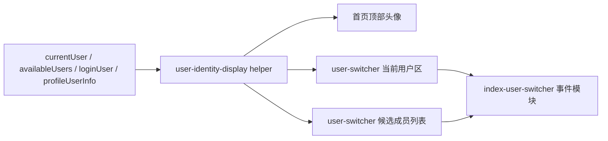

# 里程碑-22N：用户身份展示与切换体验收口 详细设计文档

> **设计状态**：🟢 审核通过
> **创建日期**：2026-04-30
> **设计者**：GPT5 Codex
> **审核者**：项目维护者
> **预计工期**：2-3天

> **审核结论（2026-04-30）**
> - 评审结果：通过，可实施
> - 结论说明：范围边界、身份展示规则、顶部头像归属、编辑权限矩阵、原生二级动作路线与冗余清理要求已满足实施前置条件

---

## 📋 目录

- [需求分析](#需求分析)
- [现状问题复盘](#现状问题复盘)
- [技术方案](#技术方案)
- [视觉与交互规格](#视觉与交互规格)
- [代码结构](#代码结构)
- [实施步骤](#实施步骤)
- [测试方案](#测试方案)
- [风险评估](#风险评估)
- [替代方案](#替代方案)
- [审核关注点](#审核关注点)

---

## 需求分析

### 功能描述

当前首页的“选择用户”面板已经承载真实高频使用场景，但它仍停留在“功能能用”的阶段，没有形成与当前软件整体一致的身份表达体系。用户在真实使用中已经明确感知到三个问题：

1. 顶部头像、切换面板、家庭成员称呼各自像是三套系统，视觉和数据来源都不统一。
2. 面板里当前用户、可切换成员、编辑删除、添加成员同时抢注意力，主次关系混乱，不够轻、不够顺。
3. 对于有独立微信身份的家长用户，希望至少能看到更像“本人”的身份表达；而共享设备场景下，又不能把面板做成重型个人中心。

`M22N` 的目标不是扩展新的用户体系，也不是立刻引入孩子专属头像系统，而是在现有真实代码边界内，完成一次“身份展示规则 + 切换面板层级 + 首页入口一致性”的收口，让该面板回归“快速切换、易于辨认、低打扰管理”的高频入口定位。

### 业务价值

- [x] 用户价值：让用户更容易一眼看懂“当前是谁、还能切到谁”，减少切换时的认知负担。
- [x] 产品价值：统一首页头像、切换面板和家庭身份称呼的表达方式，提升整体完成度和品牌一致性。
- [x] 技术价值：沉淀正式的身份展示 helper，避免后续每个页面继续各自拼接昵称、头像和角色文案。

### 功能范围

**包含**：

- [x] 收口首页顶部头像与用户切换面板的身份展示规则
- [x] 重新编排切换面板的信息层级、当前用户区和可切换成员列表
- [x] 定义“家庭称呼 / 角色 / 微信资料补充信息 / 头像 fallback”的正式展示边界
- [x] 将成员编辑、删除、添加等管理动作降权，不再与“快速切换”争抢主焦点
- [x] 补齐共享展示 helper / view-model 设计及对应测试计划
- [x] 明确实施后必须同步清理的旧结构、废弃样式和无用方法，避免 `user-switcher` 留下双轨实现

**不包含**：

- [x] 不新增后端用户资料字段，不改造用户持久化模型
- [x] 不实现孩子自定义头像、首页进度头像联动，这属于 `M22O`
- [x] 不重做家庭成员管理页或把切换面板扩展成完整个人中心
- [x] 不调整 PIN 校验规则、用户切换权限规则和家庭治理权限模型
- [x] 不处理多家长切换视角能力；当前代码仍维持“家长自己 + 孩子列表”的边界

### 优先级

- **优先级**：P1
- **理由**：这不是底层能力缺失，而是高频入口完成度偏低的问题；收益明确，但应在保持现有用户模型稳定的前提下收口。

---

## 现状问题复盘

### 问题1：首页头像和切换面板使用两套不同的身份源

当前首页顶部头像位直接取 [`pages/index/index.wxml`](/Users/wangdafei/code/study_task_wechat/pages/index/index.wxml) 中的 `userInfo.nickName[0]`，而切换面板使用 [`components/user-switcher/user-switcher.wxml`](/Users/wangdafei/code/study_task_wechat/components/user-switcher/user-switcher.wxml) 里的 `currentUser / availableUsers`。

结果是：

- 头像来源不一致
- 昵称来源不一致
- 一个是首字母圆底，一个是角色 emoji 圆底

这会让用户感觉自己在两个入口里看到的是两套不同的身份系统。

### 问题2：切换面板职责已经过重，但视觉上没有做优先级切分

[`components/user-switcher/user-switcher.js`](/Users/wangdafei/code/study_task_wechat/components/user-switcher/user-switcher.js) 当前同时负责：

- 用户切换
- 孩子切回家长的 PIN 验证
- 当前用户昵称编辑
- 虚拟成员昵称编辑
- 虚拟成员删除
- 添加成员入口

但在 UI 上，这些动作几乎都挤在用户卡片和面板底部，导致：

- 每一行既像列表项，又像管理卡片
- 当前用户、可切换用户、管理动作没有清晰主次
- “添加成员”按钮权重过高，抢走了“快速切换”的焦点

### 问题3：当前实现没有正式的身份展示规则

实际代码里目前只有一套松散字段：

- `user.name`
- `user.avatar`
- `user.role`
- `user.isVirtual`
- `user.familyPermissionRole`

但没有正式定义：

- 哪个字段是用户切换时的主展示名
- 什么时候展示角色，什么时候展示家庭权限
- 微信头像和微信昵称何时能作为补充信息出现
- 没有头像时应该如何 fallback

如果不先正式化这些规则，后续哪怕引入真实头像，也只会继续堆信息。

### 问题4：当前代码边界并不支持本期做“双昵称持久化”

虽然 `UserService.updateCurrentProfile()` 和 `updateNickname()` 来自两条不同链路，但它们最终都仍然写回 `user.name`。这说明当前代码还没有稳定区分：

- 家庭内称呼
- 微信昵称

因此 `M22N` 不能假设当前已经有可靠的双字段模型，更不应该在未过设计审核前顺手扩展账户模型。本期必须以“展示规则收口”为主，而不是把问题升级成用户资料体系重构。

### 问题5：当前设计稿对“整体风格一致性”的约束还不够硬

现有成熟页面已经逐步形成了比较稳定的视觉语言：

- 浅灰背景 + 白色卡面
- 轻阴影、软边框、14-24rpx 圆角
- 蓝色只用于状态强调，不大面积铺满
- 说明文案偏克制，不使用过多技术化标签

如果 `M22N` 只写“重排层级”，但不明确：

- 必须复用全局 token 和已有卡面 / 底部 sheet 语言
- 头像 fallback 不再使用重 emoji 视觉
- “添加成员”在不同场景下的权重规则

那实施时仍然有较大概率做成一个“结构正确、但观感突兀”的新面板。

---

## 技术方案

### 方案概述

`M22N` 采用“共享展示规则 + 面板信息层级重排 + 管理动作降权”的方案，不新增后端接口，不扩展用户持久化模型：

1. 建立一套共享身份展示 helper，统一首页头像和切换面板的主展示逻辑。
2. 对切换面板引入轻量 view-model，把“当前用户展示”“候选成员展示”“可管理动作”从原始数据中解耦出来。
3. 保持现有事件链路和权限边界不变，只调整 UI 编排与展示语义。

核心目标是：同一用户在首页头像和切换面板里看起来像同一个人；切换面板一眼就能看懂当前身份和可切换对象；管理动作存在但不抢主通路。

### 核心设计决策

#### 决策1：`user.name` 继续作为本期主展示名

本期不新增 `familyNickname / wechatNickname` 双持久化字段。用户切换相关的主显示名继续使用 `user.name`，原因：

- 当前后端和前端都没有稳定的双字段契约
- 现有切换、toast、家庭成员编辑链路都依赖 `user.name`
- 强行在 `M22N` 引入新字段会把本期从展示收口升级成账户模型改造

配套规则：

- `user.name` 为空时，回退到角色默认文案，如“家长”“孩子”
- `displayName` 本期不再作为切换面板的主展示来源，避免出现“家长模式”这类程序味文案

#### 决策2：微信资料在 M22N 中只做低权重补充

本期只在“当前登录用户且确有可用资料”场景下，把微信资料作为低权重补充信息使用，不作为新的主命名体系：

- 头像：优先使用 `user.avatar`
- 首页顶部头像：改为复用同一头像 resolver，不再单独读 `userInfo.nickName[0]`
- 微信昵称：仅当当前登录用户存在 `userInfo.nickName`，且与 `user.name` 不同时，允许在当前用户区以弱提示文案展示，但不使用“微信昵称：xxx”这种后台味标签式写法，而是更轻的自然语言副信息

其他成员默认不展示“微信昵称”第二行，原因是当前代码没有稳定来源，避免制造伪精致和事实不一致。

补充边界：

- 顶部头像在产品语义上代表“当前视角用户”，不是“设备登录者”
- 只有当 `currentUser.userId === loginUserId` 时，才允许把 `profileUserInfo / app.globalData.userInfo` 作为头像或微信昵称补充来源
- 当家长切到孩子视角时，顶部头像必须切换为该孩子的身份展示；此时不能继续显示家长的微信头像或家长微信昵称
- 若当前视角不是登录本人，则只允许使用 `currentUser` 自身字段和统一 fallback，不允许借用登录者资料补洞

#### 决策3A：M22N 不再把 emoji 作为正式头像 fallback 主体

当前面板的问题之一，就是头像视觉还停留在“角色 emoji 占位”的阶段。这种表现对于调试期足够，但不适合作为当前软件已经逐步成型后的正式高频入口。

因此本期规则调整为：

- 有真实头像时显示真实头像
- 无真实头像时，优先使用名称首字 / 单字 monogram / 中性圆形占位
- 角色属性通过次级说明和小型状态标识表达，不再把大 emoji 当成主视觉头像

说明：

- 这不等于提前进入 `M22O`
- `M22O` 仍负责“孩子专属形象”
- `M22N` 只是先把当前入口从“临时占位感”收口到“正式产品感”

#### 决策4：新增共享展示 helper / view-model 层

建议新增前端纯函数 helper，例如：

- `utils/user-identity-display.js`

职责：

- 统一解析头像来源、fallback 文案、主展示名、次级说明和状态标签
- 输出首页头像和切换面板都可消费的展示结构

建议输出结构：

```javascript
{
  userId: 'child-1',
  primaryName: '小明',
  secondaryText: '孩子 · 共享设备成员',
  tertiaryText: '',
  avatarMode: 'image' | 'initial' | 'placeholder',
  avatarUrl: '',
  avatarText: '明',
  badgeText: '当前',
  profileSupplementText: '',
  isUsingLoginProfile: false,
  canEdit: true,
  canDelete: false,
  canSwitch: true,
  managementActions: ['rename', 'delete']
}
```

要求：

- 纯展示层 helper，不直接调用 `wx`、`navigateTo`、`showModal`
- 首页和 `user-switcher` 使用同一规则，避免再次分裂
- helper 必须显式接收 `loginUserId` 或 `loginUser`，不能仅靠 `currentUser + profileUserInfo` 推断是否可消费登录资料

#### 决策5：切换面板回归“快速切换优先”

切换面板的主任务重新定义为：

1. 确认当前是谁
2. 快速切换到另一个视角
3. 在需要时再进入轻量管理动作

因此需要调整交互层级：

- 当前用户区使用单独卡片承接，保留低频编辑入口
- 候选成员列表每一行默认只强调“切换”
- 编辑/删除不再同时裸露在每一行的主视觉里
- “添加成员”从高饱和主按钮降为低权重次操作区

#### 决策6：管理动作改为单出口，而不是多图标并排

对于可管理的虚拟成员，不再在一行里同时摆放编辑、删除、箭头三种符号。改为：

- 默认点击整行 = 切换
- 行尾只保留一个轻量“更多”入口
- 点击后再展示 action sheet 或轻量菜单：
  - 修改称呼
  - 删除成员

这样可以在不丢失功能的前提下，把列表恢复成列表，而不是按钮集合。

#### 决策7：主面板复用产品视觉语言，行尾更多动作使用微信原生 `wx.showActionSheet`

本期不应为 `user-switcher` 再造一套独立的弹层视觉系统，也不应为了两个二级动作复制一套新的自定义 sheet 结构。

明确路线：

- 主面板、身份卡、列表项、次级按钮继续复用现有全局 token 和成熟页面语言
- 行尾“更多”动作统一使用微信原生 `wx.showActionSheet`
- 当用户选择“删除成员”时，再沿用现有 `wx.showModal` 做二次确认

选择理由：

- “更多”只是低频二级动作，不是主视觉区域
- 原生 action sheet 更轻，不会抢走“快速切换”主任务
- 能直接避免复制新的 WXML / WXSS / data 状态，降低冗余代码和后续维护成本
- 面板主体仍保持产品视觉一致性，不会因为二级菜单采用平台原生而破坏整体风格

### 技术选型

| 技术点 | 选择方案 | 替代方案 | 选择理由 |
|--------|---------|---------|---------|
| 身份展示收口 | 纯前端 helper + view-model | 直接在 WXML 内拼条件 | 避免首页和面板再次各写一套判断 |
| 管理动作承载 | 行尾单出口 + action sheet | 行内并排编辑/删除/切换图标 | 更轻，更符合“快速切换”主目标 |
| 头像展示 | `avatar` 优先，缺失时统一 monogram/占位头像 | 继续一处首字一处 emoji | 更符合当前软件成熟页面的简洁感，减少临时占位感 |
| 当前用户补充信息 | 仅当前登录用户可见的弱提示 | 对所有成员都展示微信资料 | 现有其他成员资料来源并不稳定 |
| 弹层与动作样式 | 主面板复用 token；二级菜单使用 `wx.showActionSheet` | 为 `user-switcher` 单独造样式体系 | 保住主面板一致性，同时避免复制一套低频菜单代码 |

### DDD分层设计

**领域层（models/）**：
- [ ] 新建模型：无
- [ ] 修改模型：无
- 说明：本期不扩展用户领域模型，避免越界到账户体系设计。

**服务层（services/）**：
- [ ] 新建服务：无
- [ ] 修改服务：`services/user-service.js`（仅在必要时补充展示所需的安全 getter 或组装）
- 说明：优先不改服务语义，只在展示层收口。

**仓储层（repositories/）**：
- [ ] 新建仓储：无
- [ ] 修改仓储：无
- 说明：本期不涉及数据访问改造。

**适配器层（adapters/）**：
- [ ] 新建适配器：无
- [ ] 修改适配器：无
- 说明：本期不新增基础设施能力。

**表现层（pages/、components/）**：
- [ ] 修改页面：`pages/index/`
- [ ] 修改组件：`components/user-switcher/`
- [ ] 新建辅助模块：`utils/user-identity-display.js`（或等价展示 helper）
- 说明：主要工作集中在首页入口头像、切换面板结构与展示模型抽离。

### 架构图



### 数据模型

```typescript
interface UserIdentityDisplayModel {
  userId: string;
  primaryName: string;
  secondaryText: string;
  tertiaryText: string;
  avatarMode: 'image' | 'initial' | 'placeholder';
  avatarUrl: string;
  avatarText: string;
  badgeText: string;
  profileSupplementText: string;
  isUsingLoginProfile: boolean;
  canSwitch: boolean;
  canEdit: boolean;
  canDelete: boolean;
  managementActions: Array<'rename' | 'delete'>;
}
```

### 接口设计

**新增展示 helper 接口**：

| 方法 | 说明 | 参数 | 返回值 |
|------|------|------|--------|
| `buildIdentityDisplayModel` | 构建单个用户的身份展示模型 | `{ user, currentUserId, loginUserId, canManageMembers, profileUserInfo }` | `UserIdentityDisplayModel` |
| `buildSwitcherDisplayState` | 构建整个切换面板所需数据 | `{ currentUser, availableUsers, loginUser, loginUserId, canManageMembers, profileUserInfo }` | `{ currentCard, switchableUsers, footerAction }` |
| `buildHeaderIdentityDisplay` | 构建首页顶部头像展示 | `{ currentUser, loginUser, loginUserId, profileUserInfo }` | `{ avatarMode, avatarUrl, avatarText, accessibilityLabel }` |

---

## 视觉与交互规格

### 1. 面板结构

面板调整为三段式：

1. **当前身份卡**
   - 头像
   - 主展示名
   - 角色 / 权限 / 共享设备说明
   - 当前标记
   - 低权重编辑或更多入口（按权限矩阵显示）
2. **可切换成员列表**
   - 单行列表项
   - 头像
   - 主展示名
   - 次级说明
   - 切换箭头或轻量强调
   - 如可管理，仅保留一个更多入口
3. **底部次操作区**
   - 添加成员
   - 必要说明文案

### 2. 视觉层级原则

- 当前身份卡比候选列表更稳、更完整，但不使用过高饱和度大面积蓝底
- 候选成员列表以可扫描、可点击为主，避免卡片过厚、阴影过重
- 添加成员为次级操作，不再占据主按钮视觉层级；仅在“当前无其他成员可切换”时，允许在空态区提升为描边次按钮
- 删除操作只在二级菜单中出现，不在列表主层直接暴露危险动作
- 不引入新的跳色体系，主色仍使用现有蓝色 token，文本和说明色沿用当前灰蓝体系

### 2A. 风格一致性约束

- 面板、卡片、行项、底部操作区优先使用全局变量：
  - `--primary-color`
  - `--text-primary / --text-secondary / --text-hint`
  - `--radius-md / --radius-lg / --radius-xl`
  - `--shadow-light / --shadow-medium`
- 当前身份卡允许使用非常轻的蓝色背景或描边，但不应出现大面积实心蓝块
- 候选成员列表应更接近 `invite-center`、`family-settings` 的白卡浅边框节奏，而不是另起一套厚卡样式
- “更多”入口和关闭按钮应保持轻量，不抢主标题和主身份信息
- 如需新增图标，优先使用简单几何或系统风格，不引入情绪过强的装饰图标

### 3. 头像规则

- 若 `avatar` 可用，优先显示图片头像
- 若头像缺失：
  - 家长 fallback 为首字或中性 monogram
  - 孩子 fallback 为首字或统一的中性圆形占位
  - 不再使用大 emoji 作为正式头像主体
- 首页顶部头像与面板头像共用同一规则
- 顶部头像必须优先表达当前视角用户：
  - `currentUser === loginUser` 时，可消费登录资料头像
  - `currentUser !== loginUser` 时，不得展示登录者头像
  - 若孩子没有头像，则回退到孩子自己的 monogram/占位，而不是借用家长微信头像

### 4. 文案规则

- 主展示名：`user.name`
- 次级说明：
  - 家长管理员：`家长 · 管理员`
  - 家长查看者：`家长 · 查看者`
  - 共享设备孩子：`孩子 · 共享设备成员`
  - 独立账号孩子：`孩子`
- 当前用户补充信息：
  - 仅当前登录用户且确有差异时显示弱化副信息，例如 `微信昵称 xxx`
  - 不出现“账号信息”“profile”这类后台感提示语

### 4A. 编辑入口显示矩阵

为避免“看起来能改、实际不该改”的歧义，本期显式规定：

- `parent-self`：
  - 显示当前身份卡编辑入口
  - 编辑对象是当前家长的显示名
- `parent-view-child`：
  - 当前身份卡不显示“编辑家长本人”的入口
  - 若当前卡代表可管理孩子，则显示轻量“更多”入口
  - “更多”内只提供与该孩子相关的动作，如“修改称呼”，若为虚拟成员可继续提供“删除成员”
- `child-self`（独立账号孩子）：
  - 不显示编辑入口
  - 不允许在切换面板内修改当前显示名
- `viewer / readonly`：
  - 不显示任何编辑、删除、添加成员入口
  - 只保留查看和切换能力

说明：

- 本期“编辑当前用户”只适用于当前登录家长本人
- 本期不在切换面板内扩展独立孩子账号的个人资料编辑能力
- 家长切到孩子视角后，如确需管理该孩子，入口应通过当前身份卡的轻量“更多”提供，而不是让用户先切回别的成员再操作

### 5. 动作规则

- 点击当前身份卡：无切换动作
- 点击候选成员行：直接切换
- 点击行尾更多：调用 `wx.showActionSheet` 展开“修改称呼 / 删除成员”
- 点击添加成员：跳转家庭设置页
- 孩子切回家长时，仍沿用现有 PIN 验证对话框逻辑
- 选择“删除成员”后，仍需使用现有确认弹窗二次确认

### 6. 冗余代码清理要求

本期若实施，必须同步清理以下冗余，避免留下“双轨 UI + 历史逻辑残留”：

- `components/user-switcher/user-switcher.js` 中不再使用的旧 data 字段、旧方法、旧 observer 兼容残留
- `components/user-switcher/user-switcher.wxml` 中废弃的行内编辑/删除结构
- `components/user-switcher/user-switcher.wxss` 中与旧重按钮、旧 emoji 头像、旧并排动作图标相关的无用选择器
- 若复用统一 helper 后，首页中仅为首字头像存在的旧条件渲染逻辑应一并删除
- 不新增自定义 action-sheet 的局部 data / WXML / WXSS 状态机，避免为两个低频动作再复制一套菜单结构

清理原则：

- 只保留新方案实际使用的结构
- 不为“可能以后还用”保留死分支
- 测试同步更新，不保留对旧 DOM 结构和旧 class 的无意义契约依赖

---

## 代码结构

### 文件变更清单

**新增文件**：

- `utils/user-identity-display.js` - 身份展示解析 helper，统一首页头像和切换面板 view-model

**修改文件**：

- `components/user-switcher/user-switcher.js` - 消费展示模型，收口列表动作结构
- `components/user-switcher/user-switcher.wxml` - 重构当前身份区、候选成员列表和次级管理入口
- `components/user-switcher/user-switcher.wxss` - 重做信息层级、卡片节奏和按钮权重
- `pages/index/index.wxml` - 首页头像位改为消费统一展示模型
- `pages/index/index.js` - 注入顶部头像所需的展示数据
- `pages/index/modules/index-lifecycle.js` - 确保首页头像展示数据同时拿到 `currentUser` 和 `loginUser/profileUserInfo`
- `pages/index/modules/index-user-switcher.js` - 切换后 toast 和 setData 改用统一展示名来源
- `test/pages/index.modules.test.js` - 补齐统一展示链路和管理动作编排的测试
- `test/pages/index.page-contract.test.js` - 更新首页头像 / user-switcher 契约
- `test/utils/` - 新增展示 helper 单元测试

**同步清理**：

- `components/user-switcher/user-switcher.js` 中确认无用后删除：
  - `addDialogAnimation`
  - 旧 `getRoleText`
  - 旧 `getRoleIcon`
  - 以及重构后不再使用的旧事件/状态字段
- `components/user-switcher/user-switcher.wxss` 中删除旧版高权重按钮、emoji 头像、并排动作按钮相关样式
- 不新增仅为“更多菜单”服务的自定义 sheet 样式和状态字段

### 核心代码结构

```javascript
// utils/user-identity-display.js
function buildIdentityDisplayModel(context) {
  // 1. 解析主展示名
  // 2. 解析次级说明
  // 3. 解析头像来源和 fallback
  // 4. 解析动作权限
}

function buildSwitcherDisplayState(context) {
  return {
    currentCard: buildIdentityDisplayModel(/* current */),
    switchableUsers: context.availableUsers
      .filter(/* 排除 current */)
      .map(/* buildIdentityDisplayModel */),
    footerAction: {
      visible: context.canManageMembers,
      text: '添加成员'
    }
  };
}
```

### 关键函数

**函数1**：`buildIdentityDisplayModel`
- **输入**：`user`、`currentUserId`、`loginUserId`、`canManageMembers`、`profileUserInfo`
- **输出**：单个用户的展示模型
- **职责**：统一主名称、次级说明、头像和动作权限
- **依赖**：`user.role`、`user.isVirtual`、`user.familyPermissionRole`

**函数2**：`buildHeaderIdentityDisplay`
- **输入**：`currentUser`、`loginUser`、`loginUserId`、`profileUserInfo`
- **输出**：首页头像展示数据
- **职责**：保证首页头像与切换面板一致，并严格区分“当前视角用户”和“登录资料用户”
- **依赖**：`buildIdentityDisplayModel`

**函数3**：`buildSwitcherDisplayState`
- **输入**：`currentUser`、`availableUsers`、`loginUser`、`loginUserId`、`canManageMembers`
- **输出**：面板整体展示状态
- **职责**：避免组件直接拼接条件和按钮显隐
- **依赖**：`buildIdentityDisplayModel`

---

## 实施步骤

### 第1步：抽离共享身份展示 helper（预计0.5天）

- [ ] **任务**：新增统一身份展示 helper，并确定首页头像和切换面板都使用同一套解析规则
- [ ] **验证**：helper 单测覆盖主名称、次级说明、头像 fallback、管理动作权限
- [ ] **依赖**：现有 `currentUser / availableUsers / loginUser / userInfo` 数据结构

**实施要点**：
1. 只做纯函数，不内嵌页面行为
2. 先解决展示一致性，再做 UI 结构调整
3. 明确当前登录用户与普通成员的微信资料展示边界

---

### 第2步：重构 user-switcher 结构与样式（预计1天）

- [ ] **任务**：将面板改为“当前身份卡 + 可切换列表 + 次操作区”的三段式结构
- [ ] **验证**：WXML 契约测试和页面模块测试通过；真实模拟器中切换、编辑、删除、添加成员路径不回归
- [ ] **依赖**：第1步展示 helper 完成

**实施要点**：
1. 行尾管理动作改为单出口
2. 添加成员按钮降权
3. 头像 fallback 改为正式的 monogram/占位方案，不再沿用 emoji 头像
4. 保持现有 PIN / 昵称编辑 / 删除成员事件链路不变

---

### 第3步：统一首页头像入口（预计0.5天）

- [ ] **任务**：首页顶部头像改用共享展示规则，不再直接依赖 `userInfo.nickName[0]`
- [ ] **验证**：切换用户后顶部头像和切换面板身份显示一致
- [ ] **依赖**：第1步展示 helper 完成

**实施要点**：
1. 优先保证头像来源一致
2. 保持首页标题、消息入口和整体 header 布局稳定
3. 不额外引入新的顶部文案块

---

### 第4步：补齐测试与回归验证（预计0.5-1天）

- [ ] **任务**：补齐 helper 测试、首页模块测试、user-switcher 契约测试和必要的手工回归清单
- [ ] **验证**：相关测试通过，模拟器回归无明显视觉/交互回退
- [ ] **依赖**：前3步完成

**实施要点**：
1. 覆盖“有头像 / 无头像 / 当前登录用户 / 虚拟孩子 / 普通孩子”分支
2. 覆盖“点击整行切换”和“点击更多管理动作”分支
3. 覆盖切换后 toast、首页头像更新和面板关闭行为

---

### 第5步：清理冗余实现（预计0.5天）

- [ ] **任务**：删除旧版 `user-switcher` 内不再使用的 data、方法、WXML 结构和样式选择器
- [ ] **验证**：`git diff` 中不再同时存在新旧两套结构；测试不再依赖旧 class 和旧行为
- [ ] **依赖**：第2-4步完成

**实施要点**：
1. 清理死代码，而不是注释保留
2. 清理旧样式时同步检查是否仍被其他页面复用
3. 保证 helper 上线后首页旧首字渲染逻辑同步删除

---

## 测试方案

### 单元测试

| 测试项 | 测试方法 | 预期结果 |
|--------|---------|---------|
| 身份主展示名解析 | `utils/user-identity-display` 单测 | `user.name` 优先，缺失时安全 fallback |
| 次级说明解析 | `utils/user-identity-display` 单测 | 家长/孩子/共享设备/权限文案符合规则 |
| 头像来源解析 | `utils/user-identity-display` 单测 | `avatar` 优先，缺失时统一 fallback |
| 非 emoji fallback 规则 | `utils/user-identity-display` 单测 | 不再输出旧的角色 emoji 作为正式头像主体 |
| 管理动作权限 | `utils/user-identity-display` 单测 | 仅可管理虚拟成员时暴露 rename/delete |

### 集成测试

- [ ] `test/pages/index.modules.test.js` 覆盖切换后首页上下文、toast 文案和顶部头像展示数据刷新
- [ ] `test/pages/index.page-contract.test.js` 覆盖首页 user-switcher 挂载契约和头像展示契约
- [ ] `components/user-switcher` 相关测试覆盖当前身份区、候选列表和更多操作入口
- [ ] 覆盖“登录家长切到孩子视角后，顶部头像不能继续消费家长 `userInfo`”场景
- [ ] 覆盖“家长切到孩子视角时，当前身份卡可出现孩子管理型更多入口；独立孩子账号自身不出现该入口”场景
- [ ] 清理后更新或删除对旧 emoji 头像、旧并排动作图标和旧 DOM 结构的契约断言

### 手动测试

1. **家长共享设备场景**：
   - [ ] 首页头像与切换面板当前身份一致
   - [ ] 能切换到孩子，再切回家长，PIN 行为不回归
   - [ ] 虚拟孩子可在更多菜单中修改称呼、删除成员
   - [ ] 家长切到孩子视角后，顶部头像切换为该孩子，不继续显示家长微信头像
   - [ ] 家长切到孩子视角后，当前身份卡如代表可管理孩子，仍能通过“更多”完成孩子相关管理动作
2. **独立微信家长场景**：
   - [ ] 若有头像，顶部头像和面板显示为真实头像
   - [ ] 若 `userInfo.nickName` 与主展示名不同，仅在当前身份区低权重提示
3. **孩子独立账号场景**：
   - [ ] 只能看到自己，不出现多余管理动作
   - [ ] 切换面板仍保持清晰，不显示“添加成员”
4. **无头像 fallback 场景**：
   - [ ] 首页与面板 fallback 风格一致，不再一处首字一处 emoji

### 回归测试

- [ ] 家庭设置页添加成员入口链路不受影响
- [ ] 当前昵称编辑、成员删除、PIN 校验仍能正常工作
- [ ] 首页消息面板、浮动菜单和 header 其他交互不回归

---

## 风险评估

### 风险1：误把本期做成账户模型改造

- **风险描述**：若为了展示“微信昵称 + 家庭称呼”而新增持久化字段，会把 `M22N` 升级成用户资料体系改造。
- **影响**：范围失控，后端契约和历史数据迁移风险显著上升。
- **应对措施**：本期严格限定为展示收口；主展示名仍用 `user.name`。

### 风险2：首页头像与切换面板规则仍可能再次分叉

- **风险描述**：若首页和组件分别写条件，后续很容易再次漂移。
- **影响**：设计收益很快被后续维护抵消。
- **应对措施**：强制引入共享 helper，并用单元测试锁定规则。

### 风险3：管理动作降权后，用户找不到编辑/删除入口

- **风险描述**：从并排按钮改成更多入口后，第一次使用可能需要适应。
- **影响**：管理效率短期下降。
- **应对措施**：仅对可管理成员显示清晰但轻量的更多入口，并保持文案明确；不做隐藏式手势。

### 风险4：真实头像接入后视觉不统一

- **风险描述**：如果只替换图片，不统一尺寸、描边和 fallback，页面会更杂。
- **影响**：整体风格仍然不高级。
- **应对措施**：首页和面板共用头像容器尺寸、圆角、描边和 fallback 规则。

### 风险5：方案实施后残留双轨代码，后续维护再次劣化

- **风险描述**：如果只叠加 helper 和新样式，但不删除旧的 `user-switcher` data / method / 选择器，后续很容易再次漂回旧结构。
- **影响**：代码复杂度上升，页面测试也会长期绑在历史 DOM 上。
- **应对措施**：把“清理旧结构”列为显式实施步骤和验收标准，不作为可选项。

---

## 替代方案

### 方案A：直接在现有组件上微调样式，不新增 helper

**优点**：

- 改动小
- 实施快

**缺点**：

- 首页头像和切换面板仍然是两套规则
- 条件判断继续散落在 WXML / JS 中
- 只能解决“难看一点”，不能解决“系统不一致”

**结论**：不采用。收益太浅，后续容易反弹。

### 方案B：本期直接把“家庭称呼 + 微信昵称 + 头像体系”一次做完整

**优点**：

- 一次性解决更多长期问题

**缺点**：

- 需要新增用户资料字段或明确持久化模型
- 影响前后端契约和历史数据
- 与 `M22O` 高度重叠，范围失控

**结论**：不采用。当前代码事实不支撑一次做完，风险明显高于收益。

### 方案C：把切换、编辑、删除、添加成员彻底拆成多个页面

**优点**：

- 职责清晰

**缺点**：

- 高频切换路径变长
- 会破坏当前“首页轻面板切换”的便利性
- 实施成本显著更高

**结论**：不采用。当前问题主要是信息层级和展示收口，不是必须拆页面。

### 方案D：继续沿用 emoji 头像，只调文字和按钮层级

**优点**：

- 改动最小

**缺点**：

- 仍然保留明显的临时占位感
- 和当前成熟页面的精致程度不匹配
- 即使层级对了，视觉完成度仍然不够

**结论**：不采用。若本期目标是“整体一致、精致高级”，这一点必须同步收口。

---

## 审核关注点

- [ ] 是否认同 `M22N` 本期只做展示收口，不进入用户资料模型扩展
- [ ] 是否认同 `user.name` 继续作为主展示名，微信资料仅做低权重补充
- [ ] 是否认同本期同步淘汰 emoji 头像 fallback，改为更中性的正式占位方案
- [ ] 是否认同管理动作从并排按钮降级为单一“更多”入口
- [ ] 是否认同首页头像与切换面板必须共用同一展示 helper
- [ ] 是否认同“清理旧 data / 旧方法 / 旧样式 / 旧 DOM 契约”应作为实施必做项
- [ ] 是否认同 `M22O` 继续独立承接孩子专属头像与首页进度联动
