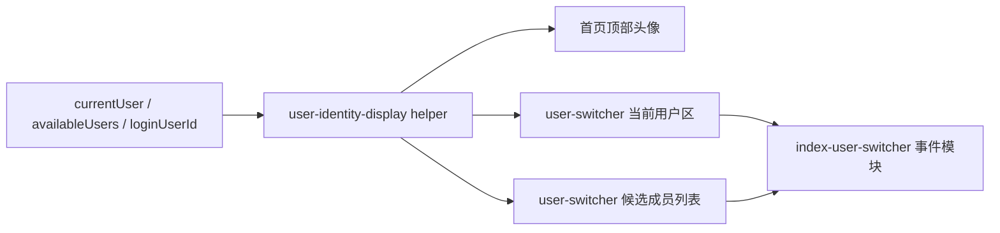

# 里程碑-22N：用户身份展示与切换体验收口 详细设计文档

> **设计状态**：✅ 已实施完成
> **创建日期**：2026-04-30
> **设计者**：GPT5 Codex
> **审核者**：项目维护者
> **预计工期**：2-3天

> **审核结论（2026-05-07，修订后范围）**
> - 评审结果：通过，可实施
> - 结论说明：本结论覆盖当前修订后的正式范围，包括切换页视觉收口、家庭称呼维护权限扩展、所有孩子的动物头像选择、旧前台微信资料补写链路清理，以及相关前后端最小权限收口

> **修订说明（2026-05-07）**
> - 根据产品反馈与微信官方能力复核，`M22N` 范围调整为：选择用户面板视觉收口、家庭角色身份展示规则收口，以及孩子的内置动物头像选择
> - 原先一度纳入的“当前登录微信用户头像昵称展示”已移出 `M22N`，因为新版微信小程序不适合再把“读取并展示真实微信资料”作为正式产品目标
> - 原先放到 `M22O` 的“孩子基础头像选择”已前移到 `M22N`；原 `M22O` 已从 roadmap 移除，后续如确有更完整头像体系诉求再单独立项
> - 已按微信官方文档补充 `wx.getUserProfile`、`open-data`、`chooseAvatar`、`input type="nickname"` 和 `code2Session` 的正式能力边界
> - 2026-04-30 旧版范围的通过结论已被当前修订版审核结论覆盖，不再单独作为当前实施依据

> **实施结果（2026-05-07）**
> - 已完成统一身份展示 helper、共享头像组件、首页与切换面板展示规则统一、所有孩子动物头像选择，以及旧前台微信资料补写主链路清理
> - 已完成家庭称呼维护权限扩展与 `avatar-preset` 前后端写入闭环
> - 本轮以定向前后端自动化回归为主完成验证，详细结果同步记录在 `CHANGELOG.md`

---

## 📋 目录

- [需求分析](#需求分析)
- [现状问题复盘](#现状问题复盘)
- [技术方案](#技术方案)
- [视觉与交互规格](#视觉与交互规格)
- [代码结构](#代码结构)
- [实施步骤](#实施步骤)
- [测试方案](#测试方案)
- [风险评估](#风险评估)
- [替代方案](#替代方案)
- [审核关注点](#审核关注点)

---

## 需求分析

### 功能描述

当前首页的“选择用户”面板已经承载真实高频使用场景，但它仍停留在“功能能用”的阶段，没有形成与当前软件整体一致的身份表达体系。用户在真实使用中已经明确感知到三个问题：

1. 顶部头像、切换面板、家庭成员称呼各自像是三套系统，视觉和数据来源都不统一。
2. 面板里当前用户、可切换成员、编辑删除、添加成员同时抢注意力，主次关系混乱，不够轻、不够顺。
3. 现在的身份表达既不够像“家庭角色”，也不够克制；如果继续硬接微信资料，又容易越界到用户不期待的隐私感知。

`M22N` 的目标不是把用户系统重做成重型个人中心，但也不再只是“调一下面板样式”。本期需要在现有真实代码边界内，同时完成三件事：

1. 把“选择用户”面板做得更清楚、更顺眼，真正回到高频切换入口定位。
2. 明确“微信登录身份只负责后台识别，前台主身份只展示家庭角色信息”的产品边界，让用户觉得自然、不侵扰。
3. 让孩子不再只有单一小鸡 emoji；无论是共享设备孩子还是独立账号孩子，都可以从一组内置动物头像里选择更喜欢的形象。

换句话说，`M22N` 现在的目标是完成一次“身份展示规则 + 切换面板层级 + 隐私克制的角色表达 + 孩子基础头像选择”的收口。

### 业务价值

- [x] 用户价值：让用户更容易一眼看懂“当前是谁、还能切到谁”，减少切换时的认知负担。
- [x] 产品价值：统一首页头像、切换面板和家庭身份称呼的表达方式，提升整体完成度和品牌一致性。
- [x] 体验价值：让家长和孩子都能在不额外暴露微信资料的前提下，更容易认出“当前是谁”。
- [x] 技术价值：沉淀正式的身份展示 helper，避免后续每个页面继续各自拼接昵称、头像和角色文案。

### 功能范围

**包含**：

- [x] 收口首页顶部头像与用户切换面板的身份展示规则
- [x] 重新编排切换面板的信息层级、当前用户区和可切换成员列表
- [x] 定义“家庭称呼 / 角色 / 登录身份边界 / 头像 fallback”的正式展示边界
- [x] 明确微信开放能力在本期的边界：只保留后台身份识别，不在前台获取或展示真实微信昵称、真实微信头像
- [x] 所有孩子支持从一组内置动物头像中选择当前身份形象，替代单一小鸡占位
- [x] 补齐孩子动物头像的正式写入契约，避免设计只有展示规则、没有受控写路径
- [x] 清理与 `M22N` 主身份表达相冲突的旧前台微信资料补写链路，避免“设计说不用，实际还在前台采集”
- [x] 将成员编辑、删除、添加等管理动作降权，不再与“快速切换”争抢主焦点
- [x] 补齐共享展示 helper / view-model 设计及对应测试计划
- [x] 明确实施后必须同步清理的旧结构、废弃样式和无用方法，避免 `user-switcher` 留下双轨实现

**不包含**：

- [x] 不新增后端用户资料字段，不改造用户持久化模型
- [x] 不使用 `wx.getUserInfo`、`wx.getUserProfile`、`open-data userNickName/userAvatarUrl`、`button open-type="getUserInfo"` 或 `scope.userInfo` 作为本期正式方案
- [x] 不使用 `button open-type="chooseAvatar"` 或 `input type="nickname"` 作为本期正式产品路径
- [x] 不为了当前场景新增 `getPhoneNumber` 等更敏感的个人信息获取链路
- [x] 不新增头像上传、文件落库、云存储换链或“外部平台头像跨设备稳定持久化”能力
- [x] 不新增“通用任意用户头像编辑接口”；孩子头像仅允许使用受控的 `preset:*` 方案
- [x] 不实现首页进度头像联动、完整角色头像素材体系或更重的头像资产系统；若后续确有真实需求，再单独立项
- [x] 不重做家庭成员管理页或把切换面板扩展成完整个人中心
- [x] 不调整 PIN 校验规则、用户切换权限规则和家庭治理权限模型
- [x] 不处理多家长切换视角能力；当前代码仍维持“家长自己 + 孩子列表”的边界
- [x] 不把生物认证、小程序码、URL Link/URL Scheme 等平台能力并入 `M22N`

### 优先级

- **优先级**：P1
- **理由**：这不是底层能力缺失，而是高频入口完成度偏低的问题；收益明确，但应在保持现有用户模型稳定的前提下收口。

---

## 现状问题复盘

### 问题1：首页头像和切换面板使用两套不同的身份源

当前首页顶部头像位直接取 [`pages/index/index.wxml`](/Users/wangdafei/code/study_task_wechat/pages/index/index.wxml) 中的 `userInfo.nickName[0]`，而切换面板使用 [`components/user-switcher/user-switcher.wxml`](/Users/wangdafei/code/study_task_wechat/components/user-switcher/user-switcher.wxml) 里的 `currentUser / availableUsers`。

结果是：

- 头像来源不一致
- 昵称来源不一致
- 一个是首字母圆底，一个是角色 emoji 圆底

这会让用户感觉自己在两个入口里看到的是两套不同的身份系统。

### 问题2：切换面板职责已经过重，但视觉上没有做优先级切分

[`components/user-switcher/user-switcher.js`](/Users/wangdafei/code/study_task_wechat/components/user-switcher/user-switcher.js) 当前同时负责：

- 用户切换
- 孩子切回家长的 PIN 验证
- 当前用户昵称编辑
- 虚拟成员昵称编辑
- 虚拟成员删除
- 添加成员入口

但在 UI 上，这些动作几乎都挤在用户卡片和面板底部，导致：

- 每一行既像列表项，又像管理卡片
- 当前用户、可切换用户、管理动作没有清晰主次
- “添加成员”按钮权重过高，抢走了“快速切换”的焦点

### 问题3：当前实现没有正式的身份展示规则

实际代码里目前只有一套松散字段：

- `user.name`
- `user.avatar`
- `user.role`
- `user.isVirtual`
- `user.familyPermissionRole`

但没有正式定义：

- 哪个字段是用户切换时的主展示名
- 什么时候展示角色，什么时候展示家庭权限
- 登录身份和当前视角身份何时需要被感知
- 没有头像时应该如何 fallback

如果不先正式化这些规则，后续哪怕继续扩展角色头像体系，也只会继续堆信息。

### 问题4：当前代码边界并不支持本期做“双昵称持久化”

虽然 `UserService.updateCurrentProfile()` 和 `updateNickname()` 来自两条不同链路，但它们最终都仍然写回 `user.name`。这说明当前代码还没有稳定区分：

- 家庭内称呼
- 外部平台资料

因此 `M22N` 不能假设当前已经有可靠的双字段模型，更不应该在未过设计审核前顺手扩展账户模型。本期必须以“角色展示规则收口”为主，而不是把问题升级成用户资料体系重构。

### 问题4A：当前真实链路仍会采集并落库微信资料，和修订后的产品边界存在冲突

当前修订后的产品结论是：“微信身份只做后台识别，前台不再把真实微信头像昵称当正式产品目标”。但代码现实并不是完全如此：

- 准入页仍保留 `wx.getUserProfile` 采集与登录后补写提示
- 后端新建用户与前端 `updateCurrentProfile()` 仍会把昵称 / 头像写入正式用户字段
- 首页旧头部还继续消费 `app.globalData.userInfo`

这意味着如果设计只写“本期不展示微信资料”，却不把旧前台补写链路的收口方式讲清楚，实施时会出现两种错误：

- 文档语义正确，但真实产品继续在前台提示用户补微信头像昵称
- UI 虽然不再写“微信昵称”，但底层又继续把微信资料静默写回当前身份字段

因此 `M22N` 需要明确：哪些历史资料允许被动沿用，哪些旧采集/补写路径必须从正式主链路退出。

### 问题4B：当前设计稿只有孩子头像展示规则，没有正式写入契约

本期已经把“孩子可选内置动物头像”纳入范围，但当前文档还缺一个真正可实施的闭环：

- 谁可以改
- 允许改谁
- 写什么值
- 通过哪条前后端链路写
- 本地模式如何保持一致

如果不补这一层，实施时很容易退化为：

- 前端临时把动物 emoji 塞进 `avatar`
- 复用“当前用户资料更新”去误改登录家长自己
- 或者只做展示态，不做真正可保存的头像选择

这会直接把 `M22N` 变成“看起来有方案，实际上没有落地契约”的设计稿。

### 问题5：当前设计稿对“整体风格一致性”和旧数据兼容的约束还不够硬

现有成熟页面已经逐步形成了比较稳定的视觉语言：

- 浅灰背景 + 白色卡面
- 轻阴影、软边框、14-24rpx 圆角
- 蓝色只用于状态强调，不大面积铺满
- 说明文案偏克制，不使用过多技术化标签

如果 `M22N` 只写“重排层级”，但不明确：

- 必须复用全局 token 和已有卡面 / 底部 sheet 语言
- 头像 fallback 不再使用重 emoji 视觉
- 旧 `avatar` 里的 `👩‍💼 / 👶` 这类历史占位值如何归一化
- “添加成员”在不同场景下的权重规则

那实施时仍然有较大概率做成一个“结构正确、但观感突兀”的新面板。

---

## 技术方案

### 方案概述

`M22N` 采用“共享展示规则 + 面板信息层级重排 + 隐私克制的角色表达 + 孩子内置动物头像选择”的方案，不新增后端用户资料字段，不扩展重型头像持久化模型：

1. 建立一套共享身份展示 helper，统一首页头像和切换面板的主展示逻辑。
2. 对切换面板引入轻量 view-model，把“当前用户展示”“候选成员展示”“可管理动作”从原始数据中解耦出来。
3. 明确微信登录身份只用于后台识别和权限边界，不在前台读取、填写或展示真实微信昵称、真实微信头像。
4. 对孩子，复用现有 `user.avatar` 字段提供一组内置动物头像选择，不再只保留单一默认小鸡。
5. 保持现有切换、PIN、家庭治理等核心权限边界不变；在此基础上，显式扩展“家庭称呼”维护边界为“家长可维护孩子称呼，孩子可维护自己称呼”，并补齐孩子 `avatar-preset` 写入链路，同时清理与新边界冲突的旧前台资料补写提示。

核心目标是：同一用户在首页头像和切换面板里看起来像同一个人；家长和孩子都能以更自然、更克制的角色身份被表达；孩子也能拥有比默认占位更自然的可辨认形象；管理动作存在但不抢主通路。

### 核心设计决策

#### 决策1：`user.name` 继续作为本期主展示名

本期不新增 `familyNickname / wechatNickname` 双持久化字段。用户切换相关的主显示名继续使用 `user.name`，原因：

- 当前后端和前端都没有稳定的双字段契约
- 现有切换、toast、家庭成员编辑链路都依赖 `user.name`
- 强行在 `M22N` 引入新字段会把本期从展示收口升级成账户模型改造

配套规则：

- `user.name` 为空时，回退到角色默认文案，如“家长”“孩子”
- `displayName` 本期不再作为切换面板的主展示来源，避免出现“家长模式”这类程序味文案
- 用户身份识别仍继续依赖现有登录链路与后端用户模型：`wx.login -> code2Session -> OpenID / UnionID / userId`
- 头像、昵称只参与展示，不参与身份判定、权限判定或家庭成员归属判定
- `user.name` 在本期继续承担“家庭内主展示称呼”角色，因此需要配套扩展称呼维护权限，而不是新增双字段模型
- 本期称呼修改边界明确为：
  - 家长可以维护自己和同家庭任意孩子的家庭称呼
  - 孩子可以维护自己的家庭称呼
  - 不开放跨家庭修改，也不开放查看者 / 系统只读 / blocked 用户修改

#### 决策2：微信身份在 M22N 中只承担后台识别，不承担前台资料展示

本期把“微信身份”和“家庭角色身份”明确拆开：

- `wx.login -> code2Session -> openid / unionid / userId` 继续保留，作为后台登录识别与权限判断边界
- 前台主身份只展示 `user.name`、角色说明和系统内头像结果
- 首页顶部头像改为复用同一头像 resolver，不再单独读 `userInfo.nickName[0]`
- 当家长切到孩子视角时，顶部头像必须切换为该孩子的身份展示；此时不能继续显示设备登录者的任何个人资料
- 若当前视角不是登录本人，则只允许使用 `currentUser` 自身字段和统一 fallback，不允许借用登录者资料补洞

补充边界：

- 小程序侧 `scope.userInfo` 已回收，`wx.getUserInfo` / `open-type="getUserInfo"` 不作为本期正式实现路线
- 按微信官方现行规则，`wx.getUserProfile`、`open-data userNickName/userAvatarUrl` 不适合作为新版小程序的正式产品方案
- `button open-type="chooseAvatar"` 与 `input type="nickname"` 本质是“用户主动选择/填写”，不是“系统被动读取现有微信资料”；本期不采用
- `getPhoneNumber` 虽可获取更敏感个人信息，但与当前场景价值不匹配，本期不采用
- `profileUserInfo / app.globalData.userInfo` 不再作为头像或昵称补充来源

#### 决策2B：历史上已经写进用户表的昵称/头像，按“现有系统资料”处理，不再标注或追溯其微信来源

考虑到当前真实代码曾经会把资料快照写入正式用户字段，本期需要把“历史数据如何对待”说清楚：

- 若某个用户的 `user.name / user.avatar` 已经存在可用值，本期可以把它当成“现有系统内资料”被动沿用
- 前台不展示“来自微信”“微信昵称”“微信头像”之类来源说明
- 首页和切换面板只消费当前 `currentUser` 上已经存在的系统字段，不额外追问来源
- `M22N` 不要求为历史数据做一次库级迁移，也不要求区分“这是家长主动改的，还是早期微信快照写入的”

但同时明确：

- 本期不再以“继续采集真实微信资料”作为正式产品目标
- 后续如果要进一步做“历史资料清洗 / 资料来源审计 / 双字段重构”，必须另起里程碑，不混入 `M22N`

#### 决策2C：旧前台微信资料补写链路退出 `M22N` 正式主链路

为了让上述边界不是纸面规则，本期设计同步要求：

- 首页头部移除对 `app.globalData.userInfo` 的身份依赖
- 准入页不再把“用于补全你的昵称和头像”作为 `M22N` 主身份表达的一部分
- 登录后“是否现在补全昵称和头像”的前台提示，不再作为本期正式产品链路保留

说明：

- 这不等于本期要把准入页做成新的资料中心
- 也不要求补一套新的昵称头像采集替代方案
- 本期目标只是把与新产品边界冲突的旧前台资料链路收口掉，避免 UI 口径和真实行为打架

#### 决策2A：M22N 不接“微信头像昵称填写”能力，避免产品语义和用户预期错位

根据微信官方文档与公告：

- `wx.getUserProfile` 在新版小程序里不再适合作为获取真实头像昵称的正式路线
- `open-data userNickName / userAvatarUrl` 也不再返回真实用户资料
- `chooseAvatar` 返回的是用户主动选择后的临时头像路径
- `input type="nickname"` 是带微信昵称提示的填写能力，不是自动读取

因此本期产品路线明确为：

- 不设计“微信昵称展示”
- 不设计“微信昵称填写”
- 不设计“微信头像选择并展示”为首页主身份能力
- 只保留后台登录身份识别，以及前台角色称呼和系统内头像表达

#### 决策3A：M22N 把“孩子头像只有小鸡”升级为“可选内置动物头像”

当前面板的问题之一，是头像能力太单薄：家长缺头像时像临时占位，孩子更是长期只有一个固定小鸡 emoji。这已经不能满足真实使用场景下的身份辨识和偏好表达。

因此本期规则调整为：

- 有稳定头像资料时显示稳定头像
- 孩子支持从一组精选动物头像中选择正式形象，例如小猫、小狗、小兔、小熊、小狐狸等内置形象
- 家长无稳定头像时，优先使用名称首字 / 单字 monogram / 中性圆形占位
- 角色属性通过次级说明和小型状态标识表达，不再把“家长职业 emoji / 默认单一小鸡”当成唯一主视觉头像策略

说明：

- 这不等于本期要顺带做完整头像体系
- 后续若确有真实需求，再单独评估“更完整的角色头像体系、首页进度等跨页面联动，以及更正式素材能力”
- `M22N` 先解决“孩子不能选头像、只有单一小鸡”的当前痛点

#### 决策4：新增共享展示 helper / view-model 层

建议新增前端纯函数 helper，例如：

- `utils/user-identity-display.js`

职责：

- 统一解析头像来源、fallback 文案、主展示名、次级说明和状态标签
- 输出首页头像和切换面板都可消费的展示结构

建议输出结构：

```javascript
{
  userId: 'child-1',
  primaryName: '小明',
  secondaryText: '孩子',
  tertiaryText: '',
  avatarMode: 'image' | 'preset' | 'initial' | 'placeholder',
  avatarUrl: '',
  avatarPresetId: 'fox',
  avatarText: '明',
  badgeText: '当前',
  canDelete: false,
  canSwitch: true,
  managementActions: ['rename', 'pickAvatar']
}
```

要求：

- 纯展示层 helper，不直接调用 `wx`、`navigateTo`、`showModal`
- 首页和 `user-switcher` 使用同一规则，避免再次分裂
- helper 可显式接收 `loginUserId`，用于区分“当前视角用户”和“设备登录者”
- helper 必须显式区分三类头像来源：稳定图片头像、孩子内置动物 preset、统一 fallback
- 样例中的 `managementActions` 必须与 `canDelete`、成员虚拟/独立属性保持一致，不能出现互相打架的示例
- 组件层不再额外消费 `canEdit` 之类泛化布尔值；“是否显示更多入口”只由 `managementActions.length > 0` 和权限矩阵共同决定

#### 决策4A：孩子头像使用 `preset` 契约，不重载成伪 URL

本期不新增后端字段，但必须避免把“动物头像”混成普通图片 URL 或临时路径。设计约定如下：

- 孩子的内置动物头像通过 `presetId` 表达，例如：
  - `cat`
  - `dog`
  - `rabbit`
  - `bear`
  - `fox`
- 为兼容当前不扩表约束，可在已有 `user.avatar` 字段中存储命名空间字符串：
  - `preset:cat`
  - `preset:dog`
  - `preset:rabbit`
- `utils/user-avatar-presets.js` 负责维护 preset 列表及其展示元数据：
  - `presetId`
  - `emoji` 或本地资源引用
  - `label`
  - 可选的辅助色
- `utils/user-identity-display.js` 负责把 `preset:*` 解析为：
  - `avatarMode = 'preset'`
  - `avatarPresetId`
  - 必要的展示字段

明确禁止：

- 不把动物头像直接写成“看起来像 URL 的字符串”
- 不把动物 emoji 混进 `avatarUrl`
- 不把任何临时平台资料和孩子 preset 共用同一种存储语义

#### 决策4B：孩子头像写入走专用 `avatar-preset` 契约，不复用“当前用户资料更新”

本期需要一个最小但明确的保存链路，避免“更换头像”只有 UI，没有真正可控的写路径。设计约定如下：

- 目标用户必须满足：
  - `role === child`
- 允许两类操作者：
  - 孩子本人修改自己的头像
  - 同家庭且具备成员管理权限的家长修改孩子头像
- 写入值只允许是受控白名单内的 `presetId`
- 持久化结果统一写为 `user.avatar = preset:{presetId}`

建议接口：

- 前端服务：`userService.updateChildAvatarPreset(userId, presetId)`
- 后端接口：`PATCH /api/users/:userId/avatar-preset`
- 请求体：`{ presetId: 'fox' }`
- 响应体：`{ userId: 'child-1', avatar: 'preset:fox' }`

权限边界：

- 孩子可以修改自己的头像
- 家长管理员可以修改自己家庭中的任意孩子头像
- 家长查看者、系统只读用户、被禁用用户均不能修改
- 孩子不能修改其他孩子头像
- 家长本人也不能通过该接口把自己头像改成 `preset:*`
- 本期不开放“任意成员通用头像编辑”

本地模式要求：

- 同一个前端 service 方法在本地模式下也要落到 `userCache + localFamilyMembers`
- 不允许本地模式和 API 模式出现两套不同的头像值语义

选择该路线的原因：

- 不会误用 `updateCurrentProfile()` 去改登录者自己
- 能同时覆盖共享设备孩子和独立账号孩子
- 保持本期能力边界清晰，只解决“孩子可选系统头像”，不顺带扩成通用头像系统

#### 决策5：切换面板回归“快速切换优先”

切换面板的主任务重新定义为：

1. 确认当前是谁
2. 快速切换到另一个视角
3. 在需要时再进入轻量管理动作

因此需要调整交互层级：

- 当前用户区使用单独卡片承接，保留低频编辑入口
- 候选成员列表每一行默认只强调“切换”
- 编辑/删除不再同时裸露在每一行的主视觉里
- “添加成员”从高饱和主按钮降为低权重次操作区

#### 决策6：管理动作改为单出口，而不是多图标并排

对于可管理的孩子成员，不再在一行里同时摆放编辑、删除、箭头三种符号。改为：

- 默认点击整行 = 切换
- 行尾只保留一个轻量“更多”入口
- 点击后再展示 action sheet 或轻量菜单：
  - 修改称呼
  - 更换头像
  - 删除成员（仅虚拟孩子出现）

这样可以在不丢失功能的前提下，把列表恢复成列表，而不是按钮集合。

#### 决策7：主面板复用产品视觉语言，行尾更多动作使用微信原生 `wx.showActionSheet`

本期不应为 `user-switcher` 再造一套独立的弹层视觉系统，也不应为了两个二级动作复制一套新的自定义 sheet 结构。

明确路线：

- 主面板、身份卡、列表项、次级按钮继续复用现有全局 token 和成熟页面语言
- 行尾“更多”动作统一使用微信原生 `wx.showActionSheet`
- 当用户选择“删除成员”时，再沿用现有 `wx.showModal` 做二次确认

选择理由：

- “更多”只是低频二级动作，不是主视觉区域
- 原生 action sheet 更轻，不会抢走“快速切换”主任务
- 能直接避免复制新的 WXML / WXSS / data 状态，降低冗余代码和后续维护成本
- 面板主体仍保持产品视觉一致性，不会因为二级菜单采用平台原生而破坏整体风格

### 技术选型

| 技术点 | 选择方案 | 替代方案 | 选择理由 |
|--------|---------|---------|---------|
| 身份展示收口 | 纯前端 helper + view-model | 直接在 WXML 内拼条件 | 避免首页和面板再次各写一套判断 |
| 管理动作承载 | 行尾单出口 + action sheet | 行内并排编辑/删除/切换图标 | 更轻，更符合“快速切换”主目标 |
| 头像展示 | 稳定图片头像优先；所有孩子支持内置动物头像；其余场景统一 fallback | 继续一处首字一处 emoji | 更符合当前软件成熟页面的简洁感，也更贴近真实用户的角色表达需求 |
| 当前用户补充信息 | 仅展示角色、权限、共享设备等系统内语义 | 对当前成员追加微信资料 | 避免资料来源不稳定和用户隐私预期错位 |
| 孩子头像写入 | 专用 `avatar-preset` 孩子头像契约 | 复用 `updateCurrentProfile` 或仅前端临时改值 | 避免误改登录者资料，同时覆盖共享设备孩子和独立账号孩子 |
| 弹层与动作样式 | 主面板复用 token；二级菜单使用 `wx.showActionSheet` | 为 `user-switcher` 单独造样式体系 | 保住主面板一致性，同时避免复制一套低频菜单代码 |

### DDD分层设计

**领域层（models/）**：
- [ ] 新建模型：无
- [ ] 修改模型：无
- 说明：本期不扩展用户领域模型，避免越界到账户体系设计。

**服务层（services/）**：
- [ ] 新建服务：无
- [ ] 修改服务：`services/user-service.js`、`backend/services/familyService.js`、`backend/services/userService.js`
- 说明：前端补齐孩子 `preset:*` 写入方法；后端仅补最小孩子头像 preset 管理契约，不扩展任何真实微信资料写入目标。

**仓储层（repositories/）**：
- [ ] 新建仓储：无
- [ ] 修改仓储：无
- 说明：本期不涉及数据访问改造。

**适配器层（adapters/）**：
- [ ] 新建适配器：无
- [ ] 修改适配器：无
- 说明：本期不新增基础设施能力。

**表现层（pages/、components/）**：
- [ ] 修改页面：`pages/index/`
- [ ] 修改页面：`pages/access-gate/`（仅清理旧前台资料补写链路，不扩展资料中心）
- [ ] 修改组件：`components/user-switcher/`
- [ ] 新建辅助模块：`utils/user-identity-display.js`（或等价展示 helper）
- 说明：主要工作集中在首页入口头像、切换面板结构与展示模型抽离，以及与新边界冲突的旧前台资料提示清理。

### 架构图



### 数据模型

```typescript
interface UserIdentityDisplayModel {
  userId: string;
  primaryName: string;
  secondaryText: string;
  tertiaryText: string;
  avatarMode: 'image' | 'preset' | 'initial' | 'placeholder';
  avatarUrl: string;
  avatarPresetId: string;
  avatarText: string;
  badgeText: string;
  canSwitch: boolean;
  canDelete: boolean;
  managementActions: Array<'rename' | 'pickAvatar' | 'delete'>;
}
```

### 接口设计

**新增展示 helper 接口**：

| 方法 | 说明 | 参数 | 返回值 |
|------|------|------|--------|
| `buildIdentityDisplayModel` | 构建单个用户的身份展示模型 | `{ user, currentUserId, loginUserId, permissionContext }` | `UserIdentityDisplayModel` |
| `buildSwitcherDisplayState` | 构建整个切换面板所需数据 | `{ currentUser, availableUsers, loginUserId, permissionContext }` | `{ currentCard, switchableUsers, footerAction }` |
| `buildHeaderIdentityDisplay` | 构建首页顶部头像展示 | `{ currentUser, loginUserId }` | `{ avatarMode, avatarUrl, avatarPresetId, avatarText, accessibilityLabel }` |

`permissionContext` 在本期不是一个可随意省略的布尔值，而是页面传入的明确权限快照。最少应包含：

- `loginUserRole`
- `systemAccessLevel`
- `isSystemBlocked`
- `isReadonlyView`
- `isSwitchedChildView`
- `isViewerReadonly`
- `canManageFamilyGovernance`
- `canManageBusinessData`

helper 基于这组输入再导出展示动作，不允许仅凭 `canManageMembers` 决定“更多 / 编辑 / 删除 / 添加成员”显隐。原因是当前工程里 `canManageMembers` 只接近“登录者是家长”，不足以表达查看者只读、系统只读、切到孩子视角后的展示边界。
同时，`isReadonlyView` 也不能直接作为“所有管理动作一律关闭”的总开关，因为当前工程里的只读态混合了“系统只读 / 查看者只读”和“家长切到孩子视角”两类语义；后者在本期仍允许保留针对当前孩子的轻量身份管理动作。
另外，`blocked` 在本期必须被视为硬性禁止态：`permissionContext` 的派生字段需要把 `isSystemBlocked === true` 直接短路到“不可管理 / 不可添加 / 不可编辑”，不能只靠 `isReadonlyView` 间接表达。

**新增成员头像 preset 写入接口**：

| 接口 | 说明 | 请求体 | 权限 |
|------|------|------|------|
| `PATCH /api/users/:userId/avatar-preset` | 更新孩子的内置动物头像 | `{ presetId }` | 孩子本人，或具备成员管理权限的同家庭家长 |
| `userService.updateChildAvatarPreset(userId, presetId)` | 前端统一写入口 | `{ userId, presetId }` | 与后端同边界；本地/API 模式同语义 |

**后端 `blocked` 校验路线约定**：

- 本期明确采用“服务端实时查询当前操作者治理状态”的方案，而不是扩展 token / `req.user` 载荷
- 也就是说：
  - `authMiddleware` 继续只负责基础身份解码
  - `userController` / `familyService` 在进入写操作权限判断前，需基于 `operatorUserId` 调用 `backend/services/userService.findActiveById()`（或等价现有查询）获取最新 `systemAccessLevel`
  - 若当前操作者为 `blocked`，直接拒绝昵称修改、孩子头像 preset 修改、成员删除等管理型写操作
- 选择该路线的原因：
  - 不需要改 token 发放和认证中间件载荷
  - 权限判断总是以数据库最新治理状态为准
  - 能把本期改动收敛在用户/家庭写操作链路，而不扩散到整个登录态基础设施

---

## 视觉与交互规格

### 1. 面板结构

面板调整为三段式：

1. **当前身份卡**
   - 头像
   - 主展示名
   - 角色 / 权限 / 共享设备说明
   - 当前标记
   - 低权重编辑或更多入口（按权限矩阵显示）
2. **可切换成员列表**
   - 单行列表项
   - 头像
   - 主展示名
   - 次级说明
   - 切换箭头或轻量强调
   - 如可管理，仅保留一个更多入口
3. **底部次操作区**
   - 添加成员
   - 必要说明文案

### 2. 视觉层级原则

- 当前身份卡比候选列表更稳、更完整，但不使用过高饱和度大面积蓝底
- 候选成员列表以可扫描、可点击为主，避免卡片过厚、阴影过重
- 添加成员为次级操作，不再占据主按钮视觉层级；仅在“当前无其他成员可切换”时，允许在空态区提升为描边次按钮
- 删除操作只在二级菜单中出现，不在列表主层直接暴露危险动作
- 不引入新的跳色体系，主色仍使用现有蓝色 token，文本和说明色沿用当前灰蓝体系

### 2A. 风格一致性约束

- 面板、卡片、行项、底部操作区优先使用全局变量：
  - `--primary-color`
  - `--text-primary / --text-secondary / --text-hint`
  - `--radius-md / --radius-lg / --radius-xl`
  - `--shadow-light / --shadow-medium`
- 当前身份卡允许使用非常轻的蓝色背景或描边，但不应出现大面积实心蓝块
- 候选成员列表应更接近 `invite-center`、`family-settings` 的白卡浅边框节奏，而不是另起一套厚卡样式
- “更多”入口和关闭按钮应保持轻量，不抢主标题和主身份信息
- 如需新增图标，优先使用简单几何或系统风格，不引入情绪过强的装饰图标

### 3. 头像规则

- 若 `avatar` 可用，优先显示图片头像
- 仅当头像来源是现有稳定字符串 URL/路径时，才视为正式可渲染头像
- 若 `avatar` 为 `preset:*`，按孩子内置动物头像解析
- 若 `avatar` 为历史占位值（如 `👩‍💼`、`👶` 或其他旧 emoji 占位），视为“无正式头像”，不再直接渲染原值
- 若头像缺失：
  - 家长 fallback 为首字或中性 monogram
  - 孩子优先使用已选择的内置动物头像
  - 孩子未选择动物头像时，再回退到统一默认动物头像或中性占位
- 首页顶部头像与面板头像共用同一规则
- 顶部头像必须优先表达当前视角用户：
  - `currentUser.userId === loginUserId` 不自动意味着要展示任何微信资料
  - `currentUser.userId !== loginUserId` 时，不得展示设备登录者的头像或昵称
  - 若孩子没有稳定头像，则优先显示孩子自己的动物头像或 fallback，而不是借用家长资料

### 4. 文案规则

- 主展示名：`user.name`
- 次级说明：
  - 家长管理员：`家长 · 管理员`
  - 家长查看者：`家长 · 查看者`
  - 共享设备孩子：`孩子 · 共享设备成员`
  - 独立账号孩子：`孩子`
- 不展示“微信昵称 xxx”“微信头像”等外部平台资料文案
- 若后续确需提示设备登录关系，只允许使用非个人资料的弱化文案，并且不作为本期必做项

### 4A. 编辑入口显示矩阵

为避免“看起来能改、实际不该改”的歧义，本期显式规定：

- `parent-self`：
  - 显示当前身份卡编辑入口
  - 编辑对象是当前家长的显示名
- `parent-view-child`：
  - 当前身份卡不显示“编辑家长本人”的入口
  - 若当前卡代表可管理孩子，则显示轻量“更多”入口
  - “更多”内只提供与该孩子相关的动作：
    - 虚拟孩子：`修改称呼 / 更换头像 / 删除成员`
    - 独立孩子：`修改称呼 / 更换头像`
- `child-self`（独立账号孩子）：
  - 显示轻量“更多”入口
  - “更多”内提供：`修改称呼 / 更换头像`
  - 可维护自己的家庭称呼
- `viewer / system-readonly / blocked`：
  - 不显示任何编辑、删除、添加成员入口
  - 只保留查看和切换能力

说明：

- 本期“编辑当前用户”只适用于当前登录家长本人
- 本期明确把“家庭称呼维护”纳入正式范围：家长可维护孩子称呼，孩子可维护自己称呼
- 家长切到孩子视角后，如确需管理该孩子，入口应通过当前身份卡的轻量“更多”提供，而不是让用户先切回别的成员再操作
- `delete` 能力必须独立判断，不能从“可编辑”自动推出：只有同家庭可管理家长面对虚拟孩子时，才允许显示
- `viewer / system-readonly / blocked` 场景下，`managementActions` 必须直接退化为空数组

### 4B. 动作权限导出规则

为避免实现时再次把权限写散，本期要求展示 helper 统一导出以下派生语义：

- `canManageChildIdentity`
  - 含义：当前登录者是否可以管理“这个孩子”的身份展示信息
  - 成立条件：
    - 非 `system-blocked`
    - 非 `system-readonly`
    - 非 `viewer-readonly`
    - 当前目标用户是孩子
    - 且满足以下之一：
      - 孩子本人正在管理自己头像
      - 同家庭家长具备成员管理权限
- `canRename`
  - 仅在以下场景为 `true`：
    - 非 `system-blocked`
    - 家长本人修改自己的显示名
    - 具备成员管理权限的同家庭家长修改任意孩子称呼
    - 孩子本人修改自己的显示名
- `canPickAvatar`
  - 仅在非 `system-blocked` 前提下，家长本人、孩子本人、或可管理家长修改孩子动物头像时为 `true`
- `canDelete`
  - 仅当 `user.role === 'child' && user.isVirtual === true && permissionContext.canManageFamilyGovernance === true && permissionContext.isSystemBlocked !== true` 时为 `true`

约束：

- `canManageMembers` 不能直接驱动上述任一字段
- `isReadonlyView` 不能单独驱动上述任一字段；helper 需要结合 `isSwitchedChildView`、`isViewerReadonly`、`isSystemBlocked`、`systemAccessLevel` 和目标成员身份共同判断
- `footerAction.visible` 必须由“已排除 blocked 的 `permissionContext.canManageFamilyGovernance`”决定，而不是任意家长都显示
- 实施时必须同步修正 `utils/user-context.resolvePermissionContext()`，确保 `isSystemBlocked === true` 时，`canManageFamilyGovernance` / `canManageBusinessData` 等管理型派生字段一律为 `false`
- 当前身份卡和候选成员行都只能消费 helper 导出的派生动作，不允许组件层再拼一套独立权限判断

### 5. 动作规则

- 点击当前身份卡：无切换动作
- 点击候选成员行：直接切换
- 点击行尾更多：调用 `wx.showActionSheet`，只展开当前成员 `managementActions` 中实际允许的动作；“修改称呼”在家长本人、孩子本人、家长管理孩子场景出现；“删除成员”只能在虚拟孩子场景出现
- 点击添加成员：跳转家庭设置页
- 选择“更换头像”后：打开轻量头像选择面板，供孩子选择内置动物头像
- 头像选择确认后：通过专用 `avatar-preset` 写入链路持久化，不复用“当前用户资料更新”
- 孩子切回家长时，仍沿用现有 PIN 验证对话框逻辑
- 选择“删除成员”后，仍需使用现有确认弹窗二次确认

### 6. 冗余代码清理要求

本期若实施，必须同步清理以下冗余，避免留下“双轨 UI + 历史逻辑残留”：

- `components/user-switcher/user-switcher.js` 中不再使用的旧 data 字段、旧方法、旧 observer 兼容残留
- `components/user-switcher/user-switcher.wxml` 中废弃的行内编辑/删除结构
- `components/user-switcher/user-switcher.wxss` 中与旧重按钮、旧 emoji 头像、旧并排动作图标相关的无用选择器
- 若复用统一 helper 后，首页中仅为首字头像存在的旧条件渲染逻辑应一并删除
- 不新增自定义 action-sheet 的局部 data / WXML / WXSS 状态机，避免为两个低频动作再复制一套菜单结构

清理原则：

- 只保留新方案实际使用的结构
- 不为“可能以后还用”保留死分支
- 测试同步更新，不保留对旧 DOM 结构和旧 class 的无意义契约依赖

---

## 代码结构

### 文件变更清单

**新增文件**：

- `utils/user-identity-display.js` - 身份展示解析 helper，统一首页头像和切换面板 view-model
- `utils/user-avatar-presets.js` - 孩子内置动物头像配置

**修改文件**：

- `components/user-switcher/user-switcher.js` - 消费展示模型，收口列表动作结构
- `components/user-switcher/user-switcher.wxml` - 重构当前身份区、候选成员列表和次级管理入口
- `components/user-switcher/user-switcher.wxss` - 重做信息层级、卡片节奏和按钮权重
- `pages/index/index.wxml` - 首页头像位改为消费统一展示模型
- `pages/index/index.js` - 注入顶部头像所需的展示数据
- `pages/index/modules/index-lifecycle.js` - 确保首页头像展示数据同时拿到 `currentUser` 和 `loginUserId`
- `pages/index/modules/index-user-switcher.js` - 切换后 toast 和 setData 改用统一展示名来源
- `pages/access-gate/access-gate.js` - 清理与正式产品边界冲突的旧前台昵称头像补写提示链路
- `services/user-service.js` - 承接孩子 `preset:*` 头像更新，并清理首页身份展示对旧 `userInfo` 的依赖
- `backend/controllers/userController.js` - 新增孩子 `avatar-preset` 更新入口
- `backend/services/userService.js` - 为写操作权限判断提供操作者最新 `systemAccessLevel` 查询入口
- `backend/services/familyService.js` - 承接“孩子本人 / 同家庭家长管理孩子头像 preset”权限与写入逻辑，并扩展家庭称呼维护权限到“家长可维护孩子，孩子可维护自己”
- `test/pages/index.modules.test.js` - 补齐统一展示链路和管理动作编排的测试
- `test/pages/index.page-contract.test.js` - 更新首页头像 / user-switcher 契约
- `backend/test/unit/`、`backend/test/integration/` - 补齐 `avatar-preset` 权限和持久化回归
- `test/utils/` - 新增展示 helper 单元测试

**明确不修改**：

- 后端文件上传或媒体持久化相关接口 - 当前不在 `M22N` 范围内
- `backend/middleware/auth.js` 的 token 载荷结构 - 本期不因 `M22N` 扩展 `systemAccessLevel`

**同步清理**：

- `components/user-switcher/user-switcher.js` 中确认无用后删除：
  - `addDialogAnimation`
  - 旧 `getRoleText`
  - 旧 `getRoleIcon`
  - 以及重构后不再使用的旧事件/状态字段
- `components/user-switcher/user-switcher.wxss` 中删除旧版高权重按钮、旧家长职业 emoji 和单一小鸡占位相关样式
- 不新增仅为“更多菜单”服务的自定义 sheet 样式和状态字段

### 核心代码结构

```javascript
// utils/user-identity-display.js
function buildIdentityDisplayModel(context) {
  // 1. 解析主展示名
  // 2. 解析次级说明
  // 3. 按“稳定头像 -> preset -> fallback”顺序解析头像来源
  // 4. 基于 permissionContext 导出 canRename / canPickAvatar / canDelete
}

function buildSwitcherDisplayState(context) {
  return {
    currentCard: buildIdentityDisplayModel(/* current */),
    switchableUsers: context.availableUsers
      .filter(/* 排除 current */)
      .map(/* buildIdentityDisplayModel */),
    footerAction: {
      visible: context.permissionContext.canManageFamilyGovernance,
      text: '添加成员'
    }
  };
}
```

### 关键函数

**函数1**：`buildIdentityDisplayModel`
- **输入**：`user`、`currentUserId`、`loginUserId`、`permissionContext`
- **输出**：单个用户的展示模型
- **职责**：统一主名称、次级说明、头像和动作权限
- **依赖**：`user.role`、`user.isVirtual`、`user.familyPermissionRole`、`user.avatar`、`preset:*` 解析规则、历史 emoji 占位归一化规则，以及 `permissionContext` 中的只读/治理权限字段

**函数2**：`buildHeaderIdentityDisplay`
- **输入**：`currentUser`、`loginUserId`
- **输出**：首页头像展示数据
- **职责**：保证首页头像与切换面板一致，并严格区分“当前视角用户”和“设备登录者”
- **依赖**：`buildIdentityDisplayModel`

**函数3**：`buildSwitcherDisplayState`
- **输入**：`currentUser`、`availableUsers`、`loginUserId`、`permissionContext`
- **输出**：面板整体展示状态
- **职责**：避免组件直接拼接条件和按钮显隐
- **依赖**：`buildIdentityDisplayModel`

**函数4**：`updateChildAvatarPreset`
- **输入**：`userId`、`presetId`
- **输出**：写入结果与更新后的成员快照
- **职责**：统一孩子动物头像的本地/API 模式写入
- **依赖**：`presetId` 白名单、成员权限校验、`user.avatar = preset:*` 持久化语义

---

## 实施步骤

### 第1步：抽离共享身份展示 helper 与头像来源契约（预计0.5天）

- [x] **任务**：新增统一身份展示 helper，并确定首页头像和切换面板都使用同一套解析规则
- [x] **验证**：helper 单测覆盖主名称、次级说明、稳定头像 / preset / fallback、管理动作权限
- [x] **依赖**：现有 `currentUser / availableUsers / loginUserId` 数据结构

**实施要点**：
1. 只做纯函数，不内嵌页面行为
2. 先解决展示一致性，再做 UI 结构调整
3. 明确微信登录身份只用于后台识别，不进入前台昵称头像展示
4. 显式区分“已有稳定头像来源”和 `preset:*`，避免实现时混入平台临时资料
5. 显式定义 `preset:*` 孩子头像协议，避免实现时混进 `avatarUrl`
6. 把历史 `👩‍💼 / 👶` 等旧占位值统一归类为 legacy placeholder，而不是继续直接渲染
7. helper 输入必须消费结构化 `permissionContext`，不能继续只收一个 `canManageMembers`
8. 实施时必须同步修正 `resolvePermissionContext()`，避免 `blocked` 仍被派生为可管理态
9. 后端 `blocked` 校验采用“按 `operatorUserId` 实时查当前用户”的方案，不扩展 token / `req.user`

---

### 第2步：重构 user-switcher 结构与样式（预计1天）

- [x] **任务**：将面板改为“当前身份卡 + 可切换列表 + 次操作区”的三段式结构
- [x] **验证**：WXML 契约测试和页面模块测试通过；真实模拟器中切换、编辑、删除、添加成员路径不回归
- [x] **依赖**：第1步展示 helper 完成

**实施要点**：
1. 行尾管理动作改为单出口
2. 添加成员按钮降权
3. 家长 fallback 改为正式的 monogram/占位方案；所有孩子接入内置动物头像选择
4. 保持现有 PIN / 删除成员事件链路不变；昵称编辑链路按本期新权限边界扩展
5. 为孩子补入“更换头像”入口，使用轻量头像选择面板或等价低复杂度交互
6. 删除动作只允许在虚拟孩子 action sheet 中出现，独立孩子永不显示删除
7. 称呼修改动作允许出现在家长本人、孩子本人、家长管理孩子场景；但查看者 / 系统只读 / blocked 一律不显示

---

### 第2A步：补齐孩子头像 preset 写入链路（预计0.5天）

- [x] **任务**：新增孩子 `avatar-preset` 更新接口与前端 service 写入口，形成真正可保存的头像选择闭环
- [x] **验证**：孩子可修改自己头像；具备成员管理权限的同家庭家长可修改孩子头像；家长本人、跨家庭成员、无权限操作者均被拒绝；本地模式与 API 模式语义一致
- [x] **依赖**：第1步完成 `preset:*` 契约

**实施要点**：
1. 不复用 `updateCurrentProfile()`
2. 不新增通用头像上传能力
3. 后端只接受白名单 `presetId`
4. 成功写入后统一返回 `avatar = preset:*`
5. 写操作前先查询操作者最新 `systemAccessLevel`；若为 `blocked` 直接拒绝

---

### 第2B步：扩展家庭称呼维护权限（预计0.5天）

- [x] **任务**：把 `updateNickname` 权限边界从“自己 / 虚拟孩子”扩展为“家长可维护同家庭任意孩子，孩子可维护自己”
- [x] **验证**：家长可修改同家庭独立孩子和虚拟孩子称呼；孩子可修改自己称呼；跨家庭、查看者、系统只读、blocked 均被拒绝；本地模式与 API 模式同语义
- [x] **依赖**：第1步完成展示 helper 权限模型

**实施要点**：
1. 这是家庭称呼维护权限扩展，不是双昵称字段改造
2. 仍继续写回 `user.name`
3. 不把“孩子家庭称呼”拆成新字段
4. 前后端权限校验与 UI 展示矩阵必须保持一致
5. `blocked` 必须作为硬性拒绝态同步收口到 `permissionContext` 和后端权限判断
6. 后端具体落地采用“按 `operatorUserId` 实时查询当前用户”的方案，而不是修改 token 载荷

---

### 第3步：统一首页头像入口与当前视角表达（预计0.5天）

- [x] **任务**：首页顶部头像改用共享展示规则，不再直接依赖 `userInfo.nickName[0]`，并明确只表达当前视角用户
- [x] **验证**：切换用户后顶部头像和切换面板身份显示一致
- [x] **依赖**：第1步展示 helper 完成

**实施要点**：
1. 优先保证头像来源一致
2. 不新增任何微信昵称/微信头像前台入口
3. 保持首页标题、消息入口和整体 header 布局稳定
4. 不额外引入新的顶部大文案块
5. 顶部头像只消费系统内稳定头像、动物 preset 和统一 fallback

---

### 第3A步：清理旧前台微信资料补写链路（预计0.5天）

- [x] **任务**：把与 `M22N` 新边界冲突的旧前台资料采集/补写提示从正式主链路中移出
- [x] **验证**：首页不再依赖 `app.globalData.userInfo`；准入页不再把“补全昵称头像”作为主流程提示
- [x] **依赖**：第1步完成展示边界定义

**实施要点**：
1. 不把准入页扩展成新资料中心
2. 不新增替代性的微信资料采集能力
3. 目标是让“前台主身份不依赖微信资料”成为真实代码事实，而不只是设计宣告

---

### 第4步：补齐测试与回归验证（预计0.5-1天）

- [x] **任务**：补齐 helper 测试、首页模块测试、user-switcher 契约测试和必要的手工回归清单
- [x] **验证**：相关测试通过，模拟器回归无明显视觉/交互回退
- [x] **依赖**：前3步完成

**实施要点**：
1. 覆盖“有头像 / 无头像 / 当前登录用户 / 虚拟孩子 / 普通孩子”分支
2. 覆盖“点击整行切换”和“点击更多管理动作”分支
3. 覆盖切换后 toast、首页头像更新和面板关闭行为
4. 覆盖历史 emoji 占位值归一化分支
5. 覆盖孩子 `avatar-preset` 写入成功与拒绝路径

---

### 第5步：清理冗余实现（预计0.5天）

- [x] **任务**：删除旧版 `user-switcher` 内不再使用的 data、方法、WXML 结构和样式选择器
- [x] **验证**：`git diff` 中不再同时存在新旧两套结构；测试不再依赖旧 class 和旧行为
- [x] **依赖**：第2-4步完成

**实施要点**：
1. 清理死代码，而不是注释保留
2. 清理旧样式时同步检查是否仍被其他页面复用
3. 保证 helper 上线后首页旧首字渲染逻辑同步删除

---

## 测试方案

### 单元测试

| 测试项 | 测试方法 | 预期结果 |
|--------|---------|---------|
| 身份主展示名解析 | `utils/user-identity-display` 单测 | `user.name` 优先，缺失时安全 fallback |
| 次级说明解析 | `utils/user-identity-display` 单测 | 家长/孩子/共享设备/权限文案符合规则 |
| 头像来源解析 | `utils/user-identity-display` 单测 | `avatar` 图片优先，孩子动物头像次之，缺失时统一 fallback |
| 历史占位兼容规则 | `utils/user-identity-display` 单测 | `👩‍💼 / 👶` 等旧值不再直接渲染，统一归一化为正式 fallback |
| 当前视角优先规则 | `utils/user-identity-display` 单测 | 首页和面板都严格表达 `currentUser`，不借用设备登录者资料 |
| 动物头像规则 | `utils/user-avatar-presets` / `utils/user-identity-display` 单测 | 所有孩子都可输出选定动物头像，不再只有单一小鸡 |
| 管理动作权限 | `utils/user-identity-display` 单测 | 仅在符合权限和角色边界时暴露 rename / pickAvatar / delete；不再单靠 `canManageMembers` 判定 |
| `blocked` 短路规则 | `utils/user-context` / `utils/user-identity-display` 单测 | `isSystemBlocked` 时，更多入口、添加成员、rename / pickAvatar / delete 全部关闭 |
| 后端 `blocked` 实时校验 | 后端单测 | 控制器/服务在写操作前按 `operatorUserId` 查询最新 `systemAccessLevel`；被封禁用户即使 token 仍有效也会被拒绝 |
| 家庭称呼维护权限 | 前后端单测 | 家长可修改同家庭任意孩子称呼；孩子可修改自己称呼；查看者 / 系统只读 / blocked / 跨家庭全部拒绝 |
| `avatar-preset` 写入权限 | 前后端单测 | 仅孩子本人或具备成员管理权限的同家庭家长可修改，其他对象全部拒绝 |

### 集成测试

- [ ] `test/pages/index.modules.test.js` 覆盖切换后首页上下文、toast 文案和顶部头像展示数据刷新
- [ ] `test/pages/index.page-contract.test.js` 覆盖首页 user-switcher 挂载契约和头像展示契约
- [ ] `components/user-switcher` 相关测试覆盖当前身份区、候选列表和更多操作入口
- [ ] 覆盖“登录家长切到孩子视角后，顶部头像不能继续消费家长登录资料”场景
- [ ] 覆盖“家长切到孩子视角时，当前身份卡可出现孩子管理型更多入口；独立孩子账号自身可出现‘修改称呼 / 更换头像’入口”场景
- [ ] 覆盖“家长查看独立孩子和虚拟孩子时，都可出现‘修改称呼’；只有虚拟孩子才出现‘删除成员’”场景
- [ ] 覆盖“查看者家长 / 系统只读用户看不到更多、编辑、添加成员入口”场景
- [ ] 覆盖“blocked 用户看不到更多、编辑、删除、添加成员入口”场景
- [ ] 覆盖“后端在 token 未更新情况下，仍可按最新 `systemAccessLevel` 拒绝 blocked 用户写操作”场景
- [ ] 覆盖“虚拟孩子可出现删除动作，独立孩子永不出现删除动作”场景
- [ ] 覆盖“孩子切换动物头像后，首页与面板同步刷新”场景
- [ ] 覆盖“准入页旧补全昵称头像提示已退出正式主链路”场景
- [ ] 清理后更新或删除对旧单一小鸡头像、旧并排动作图标和旧 DOM 结构的契约断言

### 手动测试

1. **家长共享设备场景**：
   - [ ] 首页头像与切换面板当前身份一致
   - [ ] 能切换到孩子，再切回家长，PIN 行为不回归
   - [ ] 虚拟孩子可在更多菜单中修改称呼、删除成员
   - [ ] 虚拟孩子可在更多菜单中更换动物头像，且切换后首页与面板一致
   - [ ] 独立孩子可显示“修改称呼”
   - [ ] 独立孩子不显示“删除成员”
   - [ ] 家长切到孩子视角后，顶部头像切换为该孩子，不继续显示家长资料
   - [ ] 家长切到孩子视角后，当前身份卡如代表可管理孩子，仍能通过“更多”完成孩子相关管理动作
2. **独立微信家长场景**：
   - [ ] 首页和切换面板主展示名都仍以角色称呼为准
   - [ ] 不出现“微信昵称”“微信头像”等前台资料展示
   - [ ] 若系统内已有稳定头像资料，则顶部头像和面板显示一致
   - [ ] 若无稳定头像资料，则使用统一 monogram / placeholder，不因已微信登录而额外抓取资料
   - [ ] 若用户处于 blocked，不能看到任何称呼维护、头像维护、删除、添加成员入口
3. **孩子独立账号场景**：
   - [ ] 只能看到自己，不出现与当前身份无关的管理动作
   - [ ] 切换面板仍保持清晰，不显示“添加成员”
   - [ ] 可修改自己的家庭称呼，且重新进入后保持
   - [ ] 可为自己选择动物头像，且重新进入后保持
   - [ ] 不出现“删除成员”
   - [ ] 家长在具备成员管理权限时，也可代该孩子修改头像
4. **无头像 fallback 场景**：
   - [ ] 首页与面板 fallback 风格一致，不再出现“家长职业 emoji + 单一小鸡”的割裂组合
5. **平台能力边界验证**：
   - [ ] 实现不依赖 `wx.getUserProfile`、`open-data userNickName/userAvatarUrl`、`input type="nickname"` 或 `chooseAvatar`
   - [ ] 登录链路仍只用于后台身份识别，不影响首页与切换面板前台展示语义
6. **旧数据兼容验证**：
   - [ ] 历史 `👩‍💼 / 👶` 占位值不会再被当成正式头像直接展示
   - [ ] 已存在的 `user.name / user.avatar` 若可用，可被动沿用，但前台不展示“来自微信”的来源说明

### 回归测试

- [ ] 家庭设置页添加成员入口链路不受影响
- [ ] 当前昵称编辑、成员删除、PIN 校验仍能正常工作
- [ ] 孩子动物头像选择可保存并在重新进入后保持
- [ ] 首页消息面板、浮动菜单和 header 其他交互不回归
- [ ] 查看者只读、系统只读、虚拟孩子删除边界、家庭称呼维护权限边界不回归
- [ ] blocked 用户不会被错误派生为可管理态
- [ ] 不引入对 `wx.getUserInfo`、`wx.getUserProfile`、`open-data userNickName/userAvatarUrl`、`scope.userInfo` 或旧用户信息授权链路的依赖

---

## 风险评估

### 风险1：误把本期做成账户模型改造

- **风险描述**：若为了区分“家庭称呼 + 外部平台资料”而新增持久化字段，会把 `M22N` 升级成用户资料体系改造。
- **影响**：范围失控，后端契约和历史数据迁移风险显著上升。
- **应对措施**：本期严格限定为“身份展示 + 轻量头像选择”收口；主展示名仍用 `user.name`。

### 风险2：首页头像与切换面板规则仍可能再次分叉

- **风险描述**：若首页和组件分别写条件，后续很容易再次漂移。
- **影响**：设计收益很快被后续维护抵消。
- **应对措施**：强制引入共享 helper，并用单元测试锁定规则。

### 风险3：管理动作降权后，用户找不到编辑/删除入口

- **风险描述**：从并排按钮改成更多入口后，第一次使用可能需要适应。
- **影响**：管理效率短期下降。
- **应对措施**：仅对可管理成员显示清晰但轻量的更多入口，并保持文案明确；不做隐藏式手势。

### 风险4：稳定头像与系统内头像混用后视觉不统一

- **风险描述**：如果只替换图片或 preset，不统一尺寸、描边和 fallback，页面会更杂。
- **影响**：整体风格仍然不高级。
- **应对措施**：首页和面板共用头像容器尺寸、圆角、描边和 fallback 规则。

### 风险4A：实施时偷偷回接微信资料链路，导致产品语义跑偏

- **风险描述**：如果开发时为了“更像本人”又把 `wx.getUserProfile`、`open-data`、`chooseAvatar` 或 `input type="nickname"` 混回当前方案，会让“角色身份”和“微信资料”重新纠缠。
- **影响**：用户隐私预期混乱，设计边界再次失真，评审结论失效。
- **应对措施**：本期明确禁止把微信昵称/微信头像展示作为交付目标；任何恢复相关能力的提案都必须单独起设计并重新评审。

### 风险4AA：如果旧前台补资料链路不清理，产品边界会停留在纸面

- **风险描述**：即使首页和切换面板不再写“微信昵称”，只要准入页还在主流程里提示“补全昵称头像”，用户仍会感知到产品在索取微信资料。
- **影响**：设计口径与真实行为继续冲突，评审结论无法成立。
- **应对措施**：把旧资料补写提示从正式主链路移出，作为 `M22N` 的显式实施项和验收项。

### 风险4C：孩子动物头像若没有稳定协议，会和稳定头像语义混淆

- **风险描述**：如果孩子动物头像没有明确的 `preset` 契约，实施时很容易把 emoji、本地资源名和普通头像值都塞进 `user.avatar`，导致 helper 和渲染层到处写兼容分支。
- **影响**：实现复杂度上升，后续继续扩展头像体系时容易反复返工。
- **应对措施**：本期强制使用 `preset:*` 协议，并在 helper 中集中解析；禁止业务页面自行猜测头像值类型。

### 风险4B：把“孩子可选头像”做成又一个粗糙临时入口

- **风险描述**：如果只是把几个动物 emoji 随意堆进旧界面，虽然名义上满足了“可选头像”，但视觉上仍然会显得廉价且割裂。
- **影响**：用户会觉得功能增加了，但页面还是不好看，核心体验目标并没有达成。
- **应对措施**：内置动物头像必须和新的头像容器、描边、选中态一起设计，不接受“只补数据、不补样式”的做法。

### 风险5：方案实施后残留双轨代码，后续维护再次劣化

- **风险描述**：如果只叠加 helper 和新样式，但不删除旧的 `user-switcher` data / method / 选择器，后续很容易再次漂回旧结构。
- **影响**：代码复杂度上升，页面测试也会长期绑在历史 DOM 上。
- **应对措施**：把“清理旧结构”列为显式实施步骤和验收标准，不作为可选项。

### 风险6：历史 placeholder 数据如果没有统一归一化，会导致新旧头像逻辑并存

- **风险描述**：当前库里和本地模式里都可能已有 `👩‍💼 / 👶` 这类旧值；如果 helper 不统一归一化，最终会同时存在图片、preset、emoji 三套头像语义。
- **影响**：展示规则变脏，测试矩阵膨胀，后续继续扩展头像体系会重复返工。
- **应对措施**：本期明确把旧 emoji 值视为 legacy placeholder，在 helper 中统一吞掉并回退到正式规则。

---

## 替代方案

### 方案A：直接在现有组件上微调样式，不新增 helper

**优点**：

- 改动小
- 实施快

**缺点**：

- 首页头像和切换面板仍然是两套规则
- 条件判断继续散落在 WXML / JS 中
- 只能解决“难看一点”，不能解决“系统不一致”

**结论**：不采用。收益太浅，后续容易反弹。

### 方案B：本期直接把“家庭称呼 + 外部平台资料 + 完整头像体系”一次做完整

**优点**：

- 一次性解决更多长期问题

**缺点**：

- 需要新增用户资料字段或明确持久化模型
- 影响前后端契约和历史数据
- 与后续完整头像体系高度重叠，范围失控

**结论**：不采用。当前代码事实不支撑一次做完，风险明显高于收益。

### 方案C：把切换、编辑、删除、添加成员彻底拆成多个页面

**优点**：

- 职责清晰

**缺点**：

- 高频切换路径变长
- 会破坏当前“首页轻面板切换”的便利性
- 实施成本显著更高

**结论**：不采用。当前问题主要是信息层级和展示收口，不是必须拆页面。

### 方案D：继续沿用现状头像，只调文字和按钮层级

**优点**：

- 改动最小

**缺点**：

- 仍然保留“家长像临时占位、孩子只有单一小鸡”的明显半成品感
- 和当前成熟页面的精致程度不匹配
- 即使层级对了，视觉完成度仍然不够

**结论**：不采用。若本期目标是“整体一致、精致高级”，这一点必须同步收口。

---

## 审核关注点

- [x] 是否认同 `M22N` 本期同时覆盖：切换页收口、家庭角色身份展示规则收口、所有孩子的动物头像选择
- [x] 是否认同 `user.name` 继续作为主展示名，不额外引入双昵称持久化字段
- [x] 是否认同微信登录身份在本期只承担后台识别，不承担前台昵称头像展示
- [x] 是否认同历史上已写入 `user.name / user.avatar` 的值，本期只按“现有系统资料”被动沿用，不在前台标注其微信来源
- [x] 是否认同旧前台“补全昵称头像”提示链路应退出 `M22N` 正式主流程
- [x] 是否认同 `wx.getUserProfile`、`open-data userNickName/userAvatarUrl`、`chooseAvatar`、`input type="nickname"` 不作为本期正式产品路径
- [x] 是否认同孩子头像采用 `preset:*` 协议，而不是混成 URL 或临时路径
- [x] 是否认同孩子头像需要独立的 `avatar-preset` 写入契约，而不是复用“当前用户资料更新”
- [x] 是否认同所有孩子本期都应支持内置动物头像选择，而不是只限共享设备孩子
- [x] 是否认同管理动作从并排按钮降级为单一“更多”入口
- [x] 是否认同首页头像与切换面板必须共用同一展示 helper
- [x] 是否认同“清理旧 data / 旧方法 / 旧样式 / 旧 DOM 契约”应作为实施必做项
- [x] 是否认同完整角色头像体系、跨页面联动与更正式头像资产能力暂不进入 roadmap，待后续有真实诉求再单独立项
